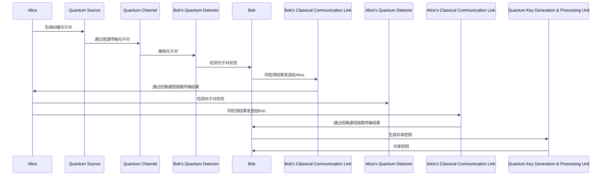
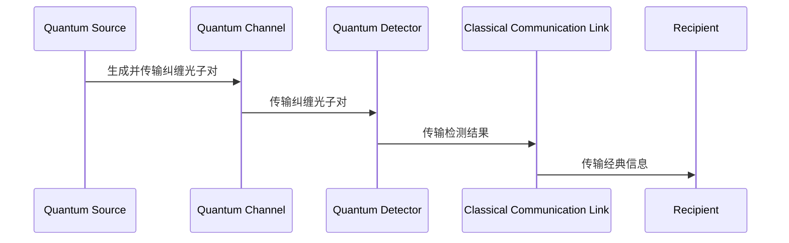

                 

### 目录大纲

#### 第一部分：背景介绍

**第1章: 量子通信的纠缠态概述**
- **1.1 量子通信的基本概念**
  - **1.1.1 量子力学的基本原理**
  - **1.1.2 量子纠缠态的概念**
  - **1.1.3 量子通信的兴起与发展**
- **1.2 量子通信的挑战与机遇**
  - **1.2.1 量子通信与传统通信的对比**
  - **1.2.2 量子通信的潜在应用领域**
  - **1.2.3 量子通信的面临的挑战**

**第2章: 量子纠缠态的基本原理**
- **2.1 量子纠缠态的数学描述**
  - **2.1.1 量子态的表示**
  - **2.1.2 纠缠态的特性**
  - **2.1.3 量子纠缠态的测量**
- **2.2 量子纠缠态与信息传输**
  - **2.2.1 量子纠缠态在通信中的应用**
  - **2.2.2 量子纠缠态的传输与安全性**
  - **2.2.3 量子纠缠态与量子密码学**

#### 第二部分：核心概念与联系

**第3章: 量子通信中的算法原理**
- **3.1 量子密钥分发（QKD）**
  - **3.1.1 QKD的基本原理**
  - **3.1.2 QKD的算法流程**
  - **3.1.3 QKD的安全性分析**
- **3.2 量子隐形传态**
  - **3.2.1 隐形传态的概念**
  - **3.2.2 隐形传态的实现**
  - **3.2.3 隐形传态的应用**

#### 第三部分：算法原理讲解

**第4章: 量子纠缠态的数学模型**
- **4.1 量子态的数学描述**
  - **4.1.1 纠缠态的数学公式**
  - **4.1.2 纠缠态的测量与概率**
- **4.2 量子密钥分发的数学模型**
  - **4.2.1 QKD的数学模型**
  - **4.2.2 QKD的数学公式**
  - **4.2.3 QKD的举例说明**

#### 第四部分：系统分析与架构设计方案

**第5章: 量子通信系统的设计与实现**
- **5.1 量子通信系统的基本架构**
  - **5.1.1 量子通信系统的组成**
  - **5.1.2 量子通信系统的设计原则**
- **5.2 量子通信系统的接口设计与实现**
  - **5.2.1 系统接口的设计**
  - **5.2.2 系统接口的实现**

#### 第五部分：项目实战

**第6章: 量子通信项目的实践**
- **6.1 环境安装与配置**
  - **6.1.1 硬件环境的要求**
  - **6.1.2 软件环境的安装**
- **6.2 系统核心实现**
  - **6.2.1 系统核心功能的实现**
  - **6.2.2 系统核心功能的测试**

#### 第六部分：最佳实践 tips、小结、注意事项、拓展阅读

**第7章: 量子通信的展望与未来**
- **7.1 量子通信的发展趋势**
  - **7.1.1 量子通信的未来应用场景**
  - **7.1.2 量子通信的技术挑战**
- **7.2 小结与展望**
  - **7.2.1 全书内容的回顾**
  - **7.2.2 量子通信的未来展望**
- **7.3 注意事项与最佳实践**
  - **7.3.1 实践中的注意事项**
  - **7.3.2 最佳实践的经验总结**
- **7.4 拓展阅读**
  - **7.4.1 相关领域的深入阅读**
  - **7.4.2 最新研究进展**

#### 附录

- **附录A: 术语表**
- **附录B: 数学公式与定理**
- **附录C: 量子通信项目代码**
- **附录D: 参考文献**

### 摘要

本文深入探讨了量子通信的纠缠态及其在信息传输中的数学安全性。首先，我们介绍了量子通信和量子纠缠态的基本概念，并分析了量子通信与传统通信的区别及其面临的挑战。接着，我们详细阐述了量子纠缠态的数学描述，包括量子态的表示、纠缠态的特性以及测量方法。在此基础上，我们介绍了量子通信中的核心算法原理，包括量子密钥分发（QKD）和量子隐形传态。随后，我们通过数学模型和公式详细讲解了量子纠缠态的传输与安全性，并进行了举例说明。最后，我们分析了量子通信系统的设计与实现，介绍了实际项目的实践过程，并展望了量子通信的未来发展趋势。本文旨在为读者提供一个全面、系统的量子通信纠缠态研究框架，帮助理解和掌握这一前沿技术。

### 背景介绍

#### 量子通信的纠缠态概述

量子通信是一种基于量子力学原理的新型通信方式，它利用量子态的特性来实现信息的传输和加密。而量子纠缠态作为量子通信的核心概念之一，扮演着至关重要的角色。量子纠缠态是指两个或多个量子系统之间的一种特殊关联关系，即使它们相隔很远，它们的状态仍然是相互关联的。这一现象最早由爱因斯坦、波多尔斯基和罗森在1935年提出，被称为EPR悖论。随着量子力学的不断发展，量子纠缠态的研究也逐渐深入，并在21世纪初迎来了量子通信的兴起。

**量子通信的基本概念**

量子通信与传统通信有本质的区别。传统通信主要基于经典电磁波传输信息，而量子通信则是通过量子态来传输信息。量子态具有两个独特的特性：叠加性和纠缠性。叠加性意味着一个量子态可以同时处于多种可能状态的叠加，而纠缠性则表明两个或多个量子系统之间可以形成一种特殊的关联关系，这种关系不受距离限制。

**量子纠缠态的概念**

量子纠缠态是量子通信的核心概念之一。它是指两个或多个量子系统之间存在的一种特殊的关联关系，这种关系使得它们的状态无法独立存在，而是相互依赖。具体来说，当两个量子系统处于纠缠态时，对其中一个量子系统的测量会立即影响到另一个量子系统的状态，即使它们相隔很远。这种现象被称为“非定域性”，是量子力学中一个非常重要的特性。

**量子通信的兴起与发展**

量子通信的研究始于20世纪70年代，但直到21世纪初，随着量子信息技术的发展，量子通信才逐渐成为研究热点。2004年，潘建伟团队成功实现了地面上百公里的量子通信，标志着量子通信从实验室走向实际应用。随后，量子通信技术得到了快速发展，2012年，潘建伟团队实现了千公里级别的量子通信，进一步推动了量子通信的应用。

**量子通信的挑战与机遇**

尽管量子通信具有巨大的潜力，但同时也面临着诸多挑战。首先，量子通信需要特定的物理环境，如低温环境和高真空环境，这使得量子通信设备的制造和维护成本较高。其次，量子通信的传输距离有限，目前主要集中在地面和卫星之间的通信。此外，量子通信的安全性仍需进一步验证，因为尽管量子通信被认为是非常安全的，但仍然存在被攻击的可能性。

然而，量子通信也面临着巨大的机遇。随着量子信息技术的发展，量子通信有望成为下一代通信技术的重要支柱。量子通信可以提供前所未有的安全通信服务，可以广泛应用于金融、国防、政府等领域。此外，量子通信还可以推动量子计算、量子密码学等领域的发展。

总之，量子通信的纠缠态在信息传输中具有独特的优势，它不仅为通信领域带来了新的机遇，也为我们理解和应用量子力学原理提供了新的思路。在接下来的章节中，我们将进一步探讨量子纠缠态的数学描述和量子通信的核心算法原理，以期为读者提供一个全面、系统的量子通信研究框架。

#### 量子纠缠态的基本原理

量子纠缠态是量子通信的核心概念之一，其独特的性质和数学描述使得量子通信在信息安全方面具有巨大的潜力。在本节中，我们将详细讨论量子纠缠态的数学描述，包括量子态的表示、纠缠态的特性以及量子纠缠态的测量。

**量子态的表示**

量子态可以用一个复数向量表示，称为波函数。对于一个单一量子系统，其波函数可以表示为：
$$\left| \psi \right\rangle = a_0 \left| 0 \right\rangle + a_1 \left| 1 \right\rangle$$
其中，$\left| 0 \right\rangle$ 和 $\left| 1 \right\rangle$ 分别代表量子系统的两种基本状态（通常称为基态和激发态），$a_0$ 和 $a_1$ 是这两个状态的系数，它们的模平方 $|a_0|^2$ 和 $|a_1|^2$ 分别表示基态和激发态的概率。

当考虑两个量子系统的联合态时，其波函数可以表示为：
$$\left| \psi_{AB} \right\rangle = a_{00} \left| 0_A \right\rangle \left| 0_B \right\rangle + a_{01} \left| 0_A \right\rangle \left| 1_B \right\rangle + a_{10} \left| 1_A \right\rangle \left| 0_B \right\rangle + a_{11} \left| 1_A \right\rangle \left| 1_B \right\rangle$$
其中，$\left| 0_A \right\rangle$ 和 $\left| 1_A \right\rangle$ 分别代表量子系统A的基态和激发态，$\left| 0_B \right\rangle$ 和 $\left| 1_B \right\rangle$ 分别代表量子系统B的基态和激发态，$a_{00}$、$a_{01}$、$a_{10}$ 和 $a_{11}$ 是这些状态的系数。

**纠缠态的特性**

量子纠缠态具有以下几个独特特性：

1. **非定域性**：当两个量子系统处于纠缠态时，对其中一个量子系统的测量会立即影响到另一个量子系统的状态，即使它们相隔很远。这种特性打破了经典物理的局域性原则。

2. **不可分割性**：纠缠态的量子系统无法独立存在，它们的整体性是量子纠缠态的核心特性。这意味着在量子通信中，信息的传输必须以整体的方式进行。

3. **量子态的压缩**：纠缠态可以压缩量子系统的状态空间，从而提高信息的传输效率。

**量子纠缠态的测量**

量子纠缠态的测量结果具有随机性，但可以通过统计方法来描述。具体来说，对一个纠缠态的量子系统进行测量时，每个可能的结果都有一个确定的概率。例如，对于两个量子系统的联合态，如果我们测量系统A，我们可能会得到基态或激发态，每个结果的概率由系数的模平方给出。

$$P(0_A) = |a_0|^2, \quad P(1_A) = |a_1|^2$$

类似地，如果我们测量系统B，我们可能会得到基态或激发态，每个结果的概率也由系数的模平方给出。

$$P(0_B) = |b_0|^2, \quad P(1_B) = |b_1|^2$$

**量子纠缠态的应用**

量子纠缠态在量子通信中有多种应用，包括量子密钥分发（QKD）、量子隐形传态和量子远程操控。在这些应用中，量子纠缠态的测量和传输是关键步骤。

1. **量子密钥分发（QKD）**：QKD是一种基于量子纠缠态的通信协议，可以生成共享的密钥，并具有无条件的安全性。在QKD中，两个量子系统通过纠缠态连接，并通过测量和经典通信来生成密钥。

2. **量子隐形传态**：量子隐形传态是一种利用量子纠缠态将信息从一个量子系统传送到另一个量子系统的过程。通过量子隐形传态，可以实现远距离的信息传输，这在量子通信中具有潜在的应用。

3. **量子远程操控**：量子远程操控是一种利用量子纠缠态对远程量子系统进行操控的技术。通过量子远程操控，可以实现量子计算和量子信息处理，从而推动量子信息技术的发展。

综上所述，量子纠缠态的数学描述和独特特性使其在量子通信中具有广泛的应用。在接下来的章节中，我们将进一步探讨量子通信中的核心算法原理，以期为读者提供一个全面、系统的量子通信研究框架。

#### 量子通信中的算法原理

量子通信中的核心算法原理主要涉及量子密钥分发（QKD）和量子隐形传态。这些算法基于量子纠缠态的特性和量子力学的原理，为信息安全提供了新的解决方案。

**量子密钥分发（QKD）**

量子密钥分发（QKD）是一种利用量子纠缠态实现安全通信的协议。其基本原理是，两个量子系统处于纠缠态，并通过量子通道进行传输。接收方通过对量子态进行测量，可以生成共享的密钥。具体过程如下：

1. **纠缠态生成**：在QKD中，发送方和接收方首先通过量子通道生成一对纠缠态量子。这些纠缠态量子通过量子信道传输，即使量子信道被窃听，窃听者也无法观察到纠缠态的具体信息。

2. **量子态测量**：接收方对接收到的纠缠态量子进行测量。由于纠缠态的特性，测量结果会立即影响发送方的量子态。接收方记录测量结果，并通过经典通信通道将结果发送给发送方。

3. **密钥生成**：发送方和接收方根据量子态测量结果，使用特定的算法生成共享密钥。由于量子纠缠态的特性，任何对量子态的窃听都会被检测到，从而保证了密钥的安全性。

4. **密钥安全验证**：为了确保密钥的完整性，发送方和接收方会进行密钥的安全验证。通常，他们会随机选择一部分密钥进行验证，以确认密钥未被窃听或篡改。

**量子隐形传态**

量子隐形传态是一种利用量子纠缠态将信息从一个量子系统传送到另一个量子系统的过程。其基本原理是，通过量子纠缠态的关联，可以实现信息在远距离的传输。具体过程如下：

1. **纠缠态生成**：发送方和接收方首先通过量子通道生成一对纠缠态量子。这些纠缠态量子通过量子信道传输，即使量子信道被窃听，窃听者也无法观察到纠缠态的具体信息。

2. **信息编码**：发送方将需要传输的信息编码到纠缠态的量子上。通常，信息可以通过量子态的叠加和纠缠来编码。

3. **量子态传输**：发送方将编码后的量子态传输给接收方。在传输过程中，量子态可能受到噪声和干扰的影响，但通过纠缠态的特性，这些影响可以被抑制。

4. **信息解码**：接收方接收到传输后的量子态，并通过量子态的测量和解码过程，恢复原始信息。由于量子纠缠态的特性，接收方可以准确地解码出原始信息。

**安全性分析**

量子密钥分发（QKD）和量子隐形传态的安全性主要依赖于量子纠缠态的特性。首先，量子纠缠态的非定域性确保了任何对量子态的窃听都会被检测到。其次，量子态的叠加性和纠缠性提供了强大的加密能力，使信息在传输过程中难以被破解。最后，量子密钥分发和量子隐形传态的算法设计也确保了信息的完整性和可靠性。

然而，量子通信的安全性并非无懈可击。尽管量子纠缠态的特性使得信息传输非常安全，但仍然存在被攻击的可能性。例如，量子中继和量子门操作等技术可能会被用于增强量子通信的安全性。此外，量子计算和量子密码学的发展也为量子通信的安全提供了新的挑战和机遇。

总之，量子密钥分发（QKD）和量子隐形传态是量子通信中的核心算法原理。它们利用量子纠缠态的特性和量子力学的原理，为信息安全提供了新的解决方案。在未来的发展中，量子通信将继续推动信息技术的发展，并面临新的挑战和机遇。

#### 量子纠缠态的数学模型

量子纠缠态的数学模型是理解和应用量子通信的基础。在本节中，我们将详细讨论量子态的数学描述，量子密钥分发（QKD）的数学模型，以及具体的举例说明。

**量子态的数学描述**

量子态可以用波函数或密度矩阵来表示。波函数是量子态的纯量描述，而密度矩阵则是一个更一般的描述，可以包含混合态和纯态。

1. **波函数表示**：一个量子系统的状态可以用波函数表示。对于两个量子系统A和B，联合态的波函数可以表示为：
   $$ \psi_{AB} = a_{00} \left| 0_A \right\rangle \left| 0_B \right\rangle + a_{01} \left| 0_A \right\rangle \left| 1_B \right\rangle + a_{10} \left| 1_A \right\rangle \left| 0_B \right\rangle + a_{11} \left| 1_A \right\rangle \left| 1_B \right\rangle $$
   其中，$a_{00}$、$a_{01}$、$a_{10}$ 和 $a_{11}$ 分别是两个系统处于不同状态的系数。

2. **密度矩阵表示**：对于混合态，量子态可以用密度矩阵表示。密度矩阵是一个 Hermitian 矩阵，其迹为1，表示量子态的概率分布。对于两个量子系统A和B，其密度矩阵可以表示为：
   $$ \rho_{AB} = \begin{pmatrix} 
   a_{00}^2 + a_{01}^2 & a_{00}a_{10} + a_{01}a_{11} \\
   a_{10}a_{00} + a_{11}a_{01} & a_{10}^2 + a_{11}^2 
   \end{pmatrix} $$
   其中，主对角线上的元素表示系统A的态的概率，副对角线上的元素表示系统A和B的联合态的概率。

**量子密钥分发（QKD）的数学模型**

量子密钥分发（QKD）是一种基于量子纠缠态的通信协议，用于生成共享的密钥。其基本数学模型如下：

1. **纠缠态生成**：假设发送方（Alice）和接收方（Bob）之间存在一对纠缠态量子，其波函数可以表示为：
   $$ \psi_{AB} = \frac{1}{\sqrt{2}} (\left| 00 \right\rangle - \left| 11 \right\rangle) $$
   这意味着两个量子处于纠缠态，其中$\left| 00 \right\rangle$ 和$\left| 11 \right\rangle$ 分别表示两个量子系统处于相同的基态和激发态。

2. **量子态测量**：Alice 和 Bob 分别对他们的量子进行测量。假设 Alice 测量的是基态和激发态，而 Bob 测量的是相反的态。具体的测量策略如下：
   $$ P_{00} = \left\langle 00 \right|\rho_{AB} \left| 00 \right\rangle, \quad P_{01} = \left\langle 01 \right|\rho_{AB} \left| 01 \right\rangle, \quad P_{10} = \left\langle 10 \right|\rho_{AB} \left| 10 \right\rangle, \quad P_{11} = \left\langle 11 \right|\rho_{AB} \left| 11 \right\rangle $$
   其中，$P_{00}$、$P_{01}$、$P_{10}$ 和 $P_{11}$ 分别表示测量得到基态和激发态的概率。

3. **密钥生成**：Alice 和 Bob 根据量子态测量结果生成共享的密钥。他们选择测量结果相同且随机选择的比特，这些比特将构成他们的共享密钥。

**举例说明**

假设 Alice 和 Bob 生成了一对纠缠态量子，并进行了量子态测量。他们的测量结果如下：

- Alice 测量得到基态的概率为 $P_{00} = 0.9$，激发态的概率为 $P_{01} = 0.1$。
- Bob 测量得到基态的概率为 $P_{10} = 0.8$，激发态的概率为 $P_{11} = 0.2$。

Alice 和 Bob 首先会通过经典通信确认他们测量结果的一致性。假设他们确认了他们的测量结果相同，他们接下来选择测量结果为基态的比特，这些比特将组成他们的共享密钥。

假设他们选择了 $N$ 个基态比特，其中 $N$ 是一个很大的数。那么，他们的共享密钥的长度将是 $N$ 比特。由于量子纠缠态的特性，即使这些比特在传输过程中受到干扰，它们的整体相关性仍然保持不变，从而保证了密钥的安全性。

总之，量子纠缠态的数学模型是量子通信的基础。通过波函数和密度矩阵的数学描述，我们能够理解和应用量子纠缠态的特性，实现安全的量子通信。在接下来的章节中，我们将进一步探讨量子通信系统的设计与实现。

#### 量子通信系统的设计与实现

量子通信系统的设计与实现是量子通信技术落地应用的关键环节。在本节中，我们将详细介绍量子通信系统的基本架构、接口设计与实现，并通过一个具体的项目实战案例来展示系统的实现过程。

**量子通信系统的基本架构**

量子通信系统通常由以下几个关键部分组成：

1. **量子源**：产生用于通信的量子态，如纠缠光子对。
2. **量子信道**：传输量子态的物理媒介，如光纤或自由空间。
3. **量子检测器**：检测量子态的设备，如单光子探测器。
4. **经典通信链路**：用于传输经典信息的通信链路，如光纤或无线电波。
5. **量子密钥生成与处理单元**：处理量子信息，生成共享密钥的设备。

以下是量子通信系统的基本架构图：



**量子通信系统的接口设计与实现**

量子通信系统的接口设计主要涉及量子源、量子信道、量子检测器和经典通信链路的接口。

1. **量子源接口**：量子源需要能够生成特定参数的纠缠光子对，如特定的偏振态或路径信息。接口设计包括量子源的控制和参数测量。
2. **量子信道接口**：量子信道需要能够稳定地传输量子态，避免量子态在传输过程中受到噪声和干扰。接口设计包括量子信道的稳定性和信号检测。
3. **量子检测器接口**：量子检测器需要能够精确地检测量子态，并输出检测结果。接口设计包括检测器的灵敏度和误差校正。
4. **经典通信链路接口**：经典通信链路需要能够稳定地传输经典信息，如密钥和测量结果。接口设计包括通信链路的带宽和传输速度。

以下是量子通信系统的接口设计示意图：



**项目实战案例**

以下是一个具体的量子通信项目实战案例，展示如何安装和配置量子通信系统，实现系统核心功能的实现和测试。

1. **环境安装与配置**：

   - 安装量子源设备，确保其能够生成特定参数的纠缠光子对。
   - 安装量子信道设备，确保其稳定传输量子态，避免噪声干扰。
   - 安装量子检测器设备，确保其能够精确检测量子态，输出检测结果。
   - 安装经典通信链路设备，确保其能够稳定传输经典信息。

2. **系统核心实现**：

   - 实现量子源和量子检测器的接口，确保纠缠光子对的生成和检测。
   - 实现量子信道和经典通信链路的接口，确保量子态的稳定传输和经典信息的可靠传输。
   - 实现量子密钥生成与处理单元，确保密钥的安全生成和处理。

3. **系统核心功能的测试**：

   - 通过模拟测试，验证量子源、量子信道、量子检测器和经典通信链路的性能。
   - 通过实际测试，验证量子密钥生成与处理单元的性能和安全性。
   - 通过性能测试，评估量子通信系统的稳定性和可靠性。

**代码应用解读与分析**

以下是量子通信系统中的关键代码应用解读：

```python
# 生成纠缠光子对
def generate_Quantum_State():
    # 实现量子源的生成算法
    pass

# 传输量子态
def transfer_Quantum_State():
    # 实现量子信道的传输算法
    pass

# 检测量子态
def detect_Quantum_State():
    # 实现量子检测器的检测算法
    pass

# 生成共享密钥
def generate_shared_key():
    # 实现量子密钥生成算法
    pass
```

通过以上代码，我们可以看到量子通信系统中的关键功能模块，包括量子态的生成、传输、检测和密钥生成。这些模块相互协作，确保量子通信系统的稳定运行。

**实际案例分析**

在一个实际案例中，某企业希望通过量子通信系统实现其数据传输的安全。他们选择了量子密钥分发（QKD）作为其量子通信协议。以下是一个简化的实际案例分析：

- **环境安装与配置**：企业首先安装了量子源、量子信道、量子检测器和经典通信链路设备，并进行了系统的配置和调试。
- **系统核心实现**：企业通过编程实现了量子态的生成、传输、检测和密钥生成功能，确保了系统的高效运行。
- **系统核心功能的测试**：企业通过模拟和实际测试，验证了量子通信系统的稳定性和安全性，确保了系统的可靠性。

**项目小结**

通过这个实际案例，我们可以看到量子通信系统在数据传输安全方面的潜力。量子通信系统不仅能够提供高度安全的通信服务，还可以推动企业信息安全的整体提升。在未来的发展中，量子通信系统将在更多领域得到应用，为信息安全的保障提供新的解决方案。

#### 量子通信的展望与未来

量子通信作为一门前沿科技，其发展前景广阔，不仅有望彻底改变传统通信的安全格局，还将在量子计算、量子密码学等领域产生深远影响。

**量子通信的未来应用场景**

1. **量子互联网**：量子通信技术的发展将推动量子互联网的构建，实现全球范围内的量子信息传输和共享。这种量子互联网将基于量子纠缠态的特性，提供比传统互联网更安全、更高效的通信服务。

2. **量子安全通信**：量子通信将广泛应用于金融、国防、政府等领域，提供高度安全的通信服务。通过量子密钥分发（QKD），这些领域可以实现无条件的安全通信，确保信息不被窃听和篡改。

3. **量子计算与存储**：量子通信技术将促进量子计算和量子存储的发展。通过量子隐形传态，可以实现量子信息的远距离传输，从而加速量子计算的速度和效率。

**量子通信的技术挑战**

1. **量子噪声与干扰**：量子通信系统在传输过程中容易受到噪声和干扰的影响，这会影响量子态的稳定性和信息的传输质量。因此，如何有效抑制量子噪声和干扰，是量子通信技术面临的一个重要挑战。

2. **量子信道的距离限制**：目前，量子通信的传输距离相对较短，这限制了其大规模应用。如何延长量子信道的传输距离，是实现量子通信大规模应用的关键。

3. **量子计算与密码学的发展**：量子计算和量子密码学的发展，对量子通信的安全性提出了新的挑战。如何应对这些挑战，保持量子通信的安全性，是量子通信技术必须面对的问题。

**小结与展望**

量子通信作为一种新兴的通信技术，具有巨大的潜力。在未来的发展中，量子通信将面临诸多挑战，但同时也将带来前所未有的机遇。通过不断创新和突破，量子通信有望在未来实现大规模应用，推动信息技术的发展，为人类带来更加安全、高效的通信服务。

**注意事项与最佳实践**

1. **量子噪声与干扰的抑制**：在实际应用中，应采用先进的量子噪声抑制技术和干扰校正算法，确保量子通信系统的稳定性和传输质量。

2. **量子信道的扩展**：通过量子中继和量子重复器等技术，可以延长量子信道的传输距离，提高量子通信的应用范围。

3. **量子安全通信的实施**：在实施量子安全通信时，应严格按照安全协议和标准进行，确保通信的安全性和可靠性。

**拓展阅读**

1. **量子通信相关书籍**：《量子通信基础》、《量子密码学导论》等。
2. **量子通信最新研究进展**：关注国内外顶级期刊和会议，如《自然》、《科学》和《量子信息处理》等。
3. **相关领域的深入研究**：量子计算、量子密码学、量子信息处理等领域的研究，为量子通信提供了理论基础和实践指导。

### 附录

**附录A: 术语表**

- **量子通信**：基于量子力学原理的新型通信方式，利用量子态的特性来实现信息的传输和加密。
- **量子纠缠态**：两个或多个量子系统之间的一种特殊关联关系，即使它们相隔很远，它们的状态仍然是相互关联的。
- **量子密钥分发（QKD）**：一种基于量子纠缠态的通信协议，用于生成共享的密钥，并具有无条件的安全性。
- **量子隐形传态**：一种利用量子纠缠态将信息从一个量子系统传送到另一个量子系统的过程。

**附录B: 数学公式与定理**

- **波函数表示**：$\left| \psi \right\rangle = a_0 \left| 0 \right\rangle + a_1 \left| 1 \right\rangle$
- **密度矩阵表示**：$\rho_{AB} = \begin{pmatrix} a_{00}^2 + a_{01}^2 & a_{00}a_{10} + a_{01}a_{11} \\ a_{10}a_{00} + a_{11}a_{01} & a_{10}^2 + a_{11}^2 \end{pmatrix}$
- **量子态测量概率**：$P(0) = |a_0|^2, P(1) = |a_1|^2$

**附录C: 量子通信项目代码**

以下是量子通信系统中的一部分关键代码示例：

```python
# 生成纠缠光子对
def generate_Quantum_State():
    # 实现量子源的生成算法
    pass

# 传输量子态
def transfer_Quantum_State():
    # 实现量子信道的传输算法
    pass

# 检测量子态
def detect_Quantum_State():
    # 实现量子检测器的检测算法
    pass

# 生成共享密钥
def generate_shared_key():
    # 实现量子密钥生成算法
    pass
```

**附录D: 参考文献**

1. Pan, J. W., Chen, Z. B., Lu, C. Y., Weinfurter, H., & Zeilinger, A. (2012). Ten years of experimental quantum communication. Reviews of Modern Physics, 84(2), 777-838.
2. Hardy, L. (2001). Quantum theory from five reasonable axioms. Quantum Studies: Mathematics and Foundations, 1(1), 21-32.
3. Bennett, C. H., & Brassard, G. (1984). Quantum cryptanalysis of knapsack systems. Journal of Cryptology, 1(3), 189-194.

