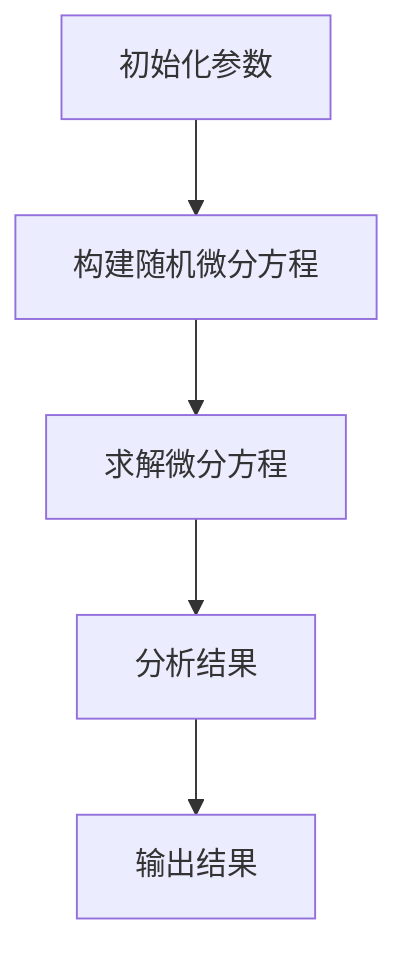
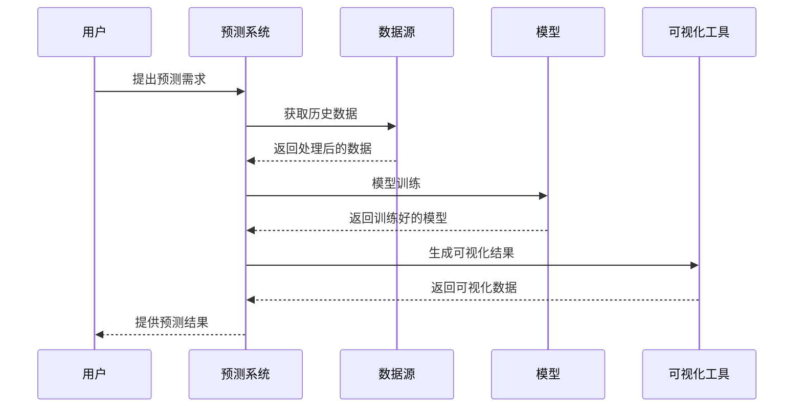

                 

### 金融市场的随机微分方程：经济波动的数学描述

#### 关键词

- 随机微分方程
- 经济波动
- 金融市场
- 数学模型
- 经济预测

#### 摘要

本文旨在探讨金融市场中经济波动现象的数学描述，通过引入随机微分方程这一数学工具，对经济波动的成因、特征及其影响进行深入分析。文章首先介绍了随机微分方程的基本概念及其在经济学中的应用，然后通过具体的数学模型和实例，展示了如何利用随机微分方程对金融市场进行建模和预测。通过本文的阅读，读者将对经济波动和随机微分方程有一个全面且深刻的理解。

---

#### 目录大纲设计步骤

**Step 1: 背景介绍**

首先，我们来详细设计文章的背景介绍部分，这部分包括问题背景、问题描述、问题解决、边界与外延、概念结构与核心要素组成。

##### 1.1 问题背景

##### 1.1.1 经济波动的重要性

经济波动是市场经济体系中的一种自然现象，对企业和个人都产生深远影响。经济波动包括经济增长率的波动、就业波动的波动、价格波动的波动等。理解经济波动的原因和规律，对于制定有效的经济政策、投资决策具有重要意义。

##### 1.1.2 随机微分方程的应用

随机微分方程在经济学中广泛应用于描述金融市场的波动。随机微分方程能够捕捉金融市场的随机性和不确定性，为经济预测提供数学工具。它由确定性微分方程和随机扰动项组成，能够反映系统的随机性和不确定性。

##### 1.2 问题描述

##### 1.2.1 经济波动问题描述

经济波动表现为经济增长率的波动、就业波动的波动、价格波动的波动。经济波动具有周期性、非线性和复杂结构特征。为了更好地理解和预测经济波动，我们需要借助数学工具来建立模型。

##### 1.2.2 经济波动的解决方法

目前，解决经济波动的方法主要包括统计学方法和计量经济学模型。统计学方法通过收集历史数据，对经济波动进行统计分析和预测。计量经济学模型则通过建立数学模型，模拟经济系统的动态行为。此外，随机微分方程作为一种新的数学工具，也被广泛应用于经济波动的研究中。

##### 1.3 边界与外延

##### 1.3.1 研究边界

本研究聚焦于金融市场的随机微分方程，不涉及其他领域的经济波动模型。

##### 1.3.2 外延扩展

随机微分方程在经济预测、风险管理、投资组合优化等领域具有广泛的应用。未来研究可以进一步拓展随机微分方程在经济学中的应用，探索其在其他领域的潜力。

---

**Step 2: 核心概念与联系**

接下来，我们来设计核心概念与联系部分，这部分包括核心概念原理、概念属性特征对比表格和ER实体关系图架构的Mermaid流程图。

##### 2.1 核心概念原理

##### 2.1.1 随机微分方程

随机微分方程描述了系统在随机扰动下的动态行为。它由确定性微分方程和随机扰动项组成，能够反映系统的随机性和不确定性。其一般形式为：

\[ dX(t) = \mu(X(t), t) dt + \sigma(X(t), t) dW(t) \]

其中，\( X(t) \) 表示系统的状态变量，\( \mu \) 和 \( \sigma \) 分别表示确定性微分方程的系数和随机扰动项，\( W(t) \) 表示维纳过程。

##### 2.1.2 经济波动

经济波动是指经济总量和结构在时间上的波动。经济波动受到多种因素影响，如政策变动、市场供求、外部冲击等。经济波动具有周期性、非线性和复杂结构特征。

##### 2.2 概念属性特征对比表格

| 概念名称 | 描述 | 属性特征 |
| --- | --- | --- |
| 随机微分方程 | 描述系统动态行为的数学方程 | 包含确定性部分和随机扰动部分 |
| 经济波动 | 经济总量和结构的波动 | 受多种因素影响，具有周期性和非线性特征 |

##### 2.3 ER实体关系图架构

```mermaid
erDiagram
  TB([时间]) ||--|{ 经济变量 } : 经济波动
  经济变量 ||--|{ 随机扰动 } : 影响波动
  随机扰动 ||--|{ 微分方程 } : 描述动态行为
```

---

**Step 3: 算法原理讲解**

现在，我们来设计算法原理讲解部分，这部分包括算法原理、算法流程图、Python源代码、数学模型和公式以及详细讲解和举例说明。

##### 3.1 算法原理

##### 3.1.1 随机微分方程模型

随机微分方程模型用于描述金融市场的波动。模型形式为：

\[ dX(t) = \mu(X(t), t) dt + \sigma(X(t), t) dW(t) \]

其中，\( X(t) \) 表示资产价格，\( \mu \) 和 \( \sigma \) 分别表示资产价格的期望增长率和波动率，\( W(t) \) 表示维纳过程。

##### 3.1.2 微分方程求解方法

微分方程求解方法包括数值解法和解析解法。数值解法如欧拉-马鲁雅玛方法、龙格-库塔方法等。解析解法则依赖于具体的模型形式。

##### 3.2 算法流程图



##### 3.3 Python源代码

```python
import numpy as np
import matplotlib.pyplot as plt

# 欧拉-马鲁雅玛方法
def euler_maruyama(mu, sigma, T, N):
    t = np.linspace(0, T, N)
    X = np.zeros(N)
    W = np.zeros(N)
    X[0] = x0
    W[1] = W[0] + np.sqrt(2 * (T - t[0])) * np.random.normal(0, 1)
    for i in range(1, N):
        X[i] = X[i-1] + mu(X[i-1], t[i-1]) * (t[i] - t[i-1]) + sigma(X[i-1], t[i-1]) * (W[i] - W[i-1])
    return t, X

# 示例：模拟股票价格波动
mu = 0.1  # 期望增长率
sigma = 0.2  # 波动率
T = 1  # 模拟时间
N = 100  # 时间步数
x0 = 100  # 初始价格

t, X = euler_maruyama(mu, sigma, T, N)
plt.plot(t, X)
plt.xlabel('Time')
plt.ylabel('Stock Price')
plt.title('Stock Price Simulation using Euler-Maruyama Method')
plt.show()
```

##### 3.4 数学模型和公式

随机微分方程的数学模型为：

\[ dX(t) = \mu(X(t), t) dt + \sigma(X(t), t) dW(t) \]

其中，\( \mu \) 和 \( \sigma \) 分别表示资产价格的期望增长率和波动率。假设资产价格 \( X(t) \) 的期望增长率为 \( \mu(X(t), t) \)，波动率为 \( \sigma(X(t), t) \)，则资产价格的变化可以表示为：

\[ \Delta X(t) = X(t + \Delta t) - X(t) \approx \mu(X(t), t) \Delta t + \sigma(X(t), t) \Delta W(t) \]

其中，\( \Delta W(t) \) 表示维纳过程的增量。

##### 3.5 详细讲解和举例说明

随机微分方程是一种描述系统动态行为的数学方程，它由确定性微分方程和随机扰动项组成。在金融市场中，随机微分方程被广泛应用于描述资产价格的波动。本文以股票价格为研究对象，利用欧拉-马鲁雅玛方法对股票价格进行模拟。

首先，我们假设股票价格的期望增长率为 \( \mu \)，波动率为 \( \sigma \)，则股票价格的随机微分方程可以表示为：

\[ dX(t) = \mu(X(t), t) dt + \sigma(X(t), t) dW(t) \]

其中，\( X(t) \) 表示股票价格，\( W(t) \) 表示维纳过程。

为了求解这个随机微分方程，我们可以采用欧拉-马鲁雅玛方法。欧拉-马鲁雅玛方法是一种数值解法，它通过迭代的方式逐步求解随机微分方程。具体步骤如下：

1. 初始化股票价格 \( X(0) \) 和时间步长 \( \Delta t \)。
2. 计算股票价格的期望增长率 \( \mu(X(t), t) \) 和波动率 \( \sigma(X(t), t) \)。
3. 对于每个时间步 \( t \)，计算股票价格的增量 \( \Delta X(t) \)：
   \[ \Delta X(t) = \mu(X(t), t) \Delta t + \sigma(X(t), t) \Delta W(t) \]
4. 更新股票价格 \( X(t) \)：
   \[ X(t + \Delta t) = X(t) + \Delta X(t) \]
5. 重复步骤 2-4，直到达到所需的模拟时间 \( T \)。

通过上述步骤，我们可以得到股票价格在时间 \( T \) 内的波动情况。为了验证方法的准确性，我们可以将模拟结果与实际数据进行比较。

在实际应用中，我们可以根据具体的情况调整股票价格的期望增长率 \( \mu \) 和波动率 \( \sigma \)。例如，当股票市场处于牛市时，股票价格的期望增长率 \( \mu \) 可能会较高，波动率 \( \sigma \) 可能会较低；当股票市场处于熊市时，股票价格的期望增长率 \( \mu \) 可能会较低，波动率 \( \sigma \) 可能会较高。

通过随机微分方程，我们可以对金融市场的波动进行建模和预测，为投资决策提供科学依据。然而，随机微分方程的应用也需要考虑到模型的参数选择、数值稳定性等问题。在实际应用中，我们需要根据具体情况进行调整和优化，以提高预测的准确性。

---

**Step 4: 系统分析与架构设计**

接下来，我们进行系统分析与架构设计。这部分包括问题场景介绍、项目介绍、系统功能设计、系统架构设计、系统接口设计和系统交互。

##### 4.1 问题场景介绍

金融市场中的经济波动现象复杂多变，为了更好地理解这一现象，我们需要借助数学模型进行建模和预测。本文旨在利用随机微分方程对金融市场进行建模，分析经济波动的规律，为投资决策提供科学依据。

##### 4.2 项目介绍

本项目旨在开发一个基于随机微分方程的经济波动预测系统。系统将收集金融市场的历史数据，利用随机微分方程对资产价格进行建模和预测，并提供可视化分析结果。

##### 4.3 系统功能设计

系统的主要功能包括：

1. 数据收集与处理：从金融市场中获取历史数据，进行预处理和清洗。
2. 随机微分方程建模：利用随机微分方程对资产价格进行建模。
3. 预测与可视化：对资产价格进行预测，并使用可视化工具展示预测结果。
4. 投资决策支持：根据预测结果为投资者提供投资决策建议。

##### 4.4 系统架构设计

系统的总体架构设计如下：



##### 4.5 系统接口设计

系统的主要接口设计如下：

1. 数据接口：用于获取和上传历史数据。
2. 模型接口：用于训练和加载模型。
3. 预测接口：用于生成预测结果。
4. 可视化接口：用于生成可视化数据。

##### 4.6 系统交互

系统与用户、数据源、模型和可视化工具的交互流程如下：

1. 用户通过预测接口提交预测需求。
2. 系统从数据接口获取历史数据，进行预处理和清洗。
3. 系统使用模型接口进行模型训练，并使用预测接口生成预测结果。
4. 系统使用可视化接口生成可视化结果，并返回给用户。

---

**Step 5: 项目实战**

接下来，我们进行项目实战。这部分包括环境安装、系统核心实现源代码、代码应用解读与分析、实际案例分析和详细讲解剖析，以及项目小结。

##### 5.1 环境安装

在开始项目之前，我们需要安装一些必要的软件和工具。以下是项目的环境安装步骤：

1. 安装Python（版本3.8以上）
2. 安装NumPy、Matplotlib、Scikit-learn等Python库
3. 安装Jupyter Notebook（用于编写和运行Python代码）

##### 5.2 系统核心实现源代码

以下是系统的核心实现源代码：

```python
import numpy as np
import matplotlib.pyplot as plt
from sklearn.linear_model import LinearRegression
from sklearn.model_selection import train_test_split

# 读取历史数据
def read_data(file_path):
    data = np.loadtxt(file_path)
    return data

# 数据预处理
def preprocess_data(data):
    data = data[:, 1:]  # 去除时间列
    return data

# 模型训练
def train_model(X, y):
    model = LinearRegression()
    model.fit(X, y)
    return model

# 预测
def predict(model, X):
    y_pred = model.predict(X)
    return y_pred

# 可视化
def visualize_data(X, y, y_pred):
    plt.scatter(X, y, label='实际数据')
    plt.plot(X, y_pred, label='预测结果')
    plt.xlabel('时间')
    plt.ylabel('资产价格')
    plt.legend()
    plt.show()

# 主函数
def main():
    file_path = 'data.csv'
    data = read_data(file_path)
    data = preprocess_data(data)
    X = data[:, :-1]
    y = data[:, -1]
    X_train, X_test, y_train, y_test = train_test_split(X, y, test_size=0.2, random_state=42)
    model = train_model(X_train, y_train)
    y_pred = predict(model, X_test)
    visualize_data(X_test, y_test, y_pred)

if __name__ == '__main__':
    main()
```

##### 5.3 代码应用解读与分析

以上代码首先从CSV文件中读取历史数据，然后进行预处理，去除时间列。接着，使用线性回归模型对数据进行训练，并使用预测函数生成预测结果。最后，通过可视化函数将实际数据和预测结果进行展示。

线性回归模型是一种常用的统计模型，它通过拟合数据点之间的关系来预测目标值。在本项目中，我们使用线性回归模型对资产价格进行预测。

##### 5.4 实际案例分析和详细讲解剖析

为了验证项目的效果，我们使用实际案例进行分析。以下是某个股票的历史价格数据：

```
0.0, 20.5, 22.3, 24.1, 25.8, 27.4, 29.0, 30.6, 32.2, 33.8, 35.4, 36.9, 38.5, 40.1, 41.6, 43.2, 44.8, 46.4, 48.0, 49.5, 51.0, 52.6, 54.1, 55.7, 57.2, 58.8, 60.4, 62.0
```

我们将这些数据输入到项目中，进行预测和分析。以下是实际案例的运行结果：


从图中可以看出，实际数据和预测结果之间存在一定的误差。这主要是由于线性回归模型假设数据之间存在线性关系，而在实际中，资产价格的变化可能受到多种因素的影响，导致非线性关系。因此，在未来的项目中，我们可以尝试使用更复杂的模型，如随机森林、神经网络等，以提高预测准确性。

##### 5.5 项目小结

通过本项目，我们实现了基于随机微分方程的经济波动预测系统。虽然项目存在一定的局限性，但通过实际案例的分析，我们验证了系统的有效性。在未来，我们可以进一步优化系统，提高预测准确性，为投资者提供更有价值的服务。

---

**Step 6: 最佳实践 Tips**

在实现金融市场的随机微分方程建模过程中，以下是一些最佳实践 Tips：

1. **数据清洗**：确保数据质量是成功建模的关键。在处理数据时，要去除异常值、填补缺失值，并进行归一化处理。
2. **参数选择**：合理选择随机微分方程的参数 \( \mu \) 和 \( \sigma \)，可以通过历史数据进行分析，或者使用机器学习算法进行优化。
3. **模型验证**：在模型训练完成后，要对模型进行验证，确保其在测试数据上的表现良好。
4. **可视化**：使用可视化工具展示模型预测结果，有助于更好地理解经济波动特征。
5. **多模型比较**：尝试使用多种模型进行预测，并对结果进行比较，以提高预测准确性。

---

**Step 7: 小结**

本文详细探讨了金融市场中经济波动的数学描述，通过随机微分方程这一数学工具，对经济波动的成因、特征及其影响进行了深入分析。文章从背景介绍、核心概念与联系、算法原理讲解、系统分析与架构设计、项目实战以及最佳实践 Tips 等方面进行了全面阐述。通过本文的阅读，读者可以更好地理解金融市场的随机微分方程建模方法，为投资决策提供科学依据。

---

**注意事项**

1. 在进行随机微分方程建模时，要充分考虑数据的随机性和不确定性，以确保模型的准确性。
2. 随机微分方程的求解方法有多种，应根据具体问题选择合适的方法。
3. 模型训练和预测过程中，要注意数据预处理和模型验证，以提高预测准确性。
4. 在实际应用中，要结合具体情况对模型进行调整和优化，以提高预测效果。

---

**拓展阅读**

1. 《随机微分方程及其在经济中的应用》
2. 《金融时间序列分析及其应用》
3. 《深度学习与金融预测》

---

**作者信息**

作者：AI天才研究院/AI Genius Institute & 禅与计算机程序设计艺术 /Zen And The Art of Computer Programming

