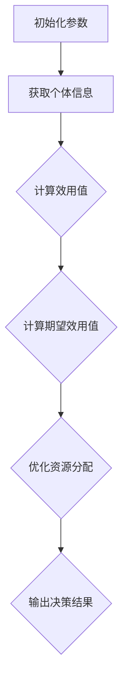
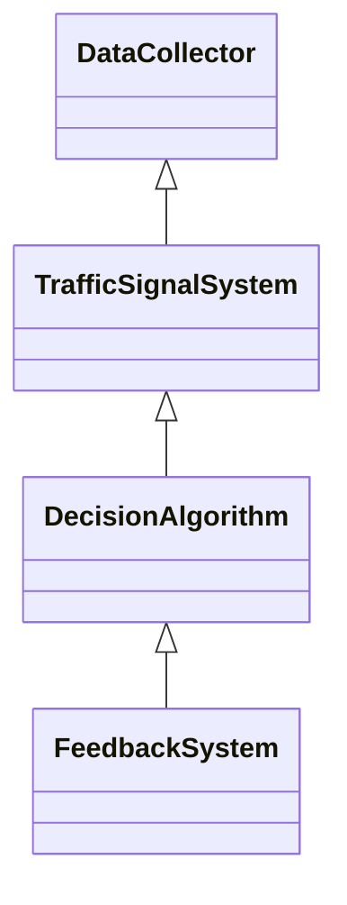
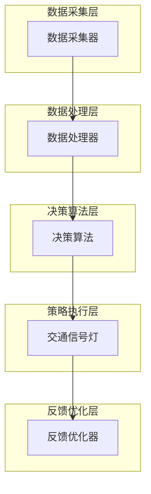
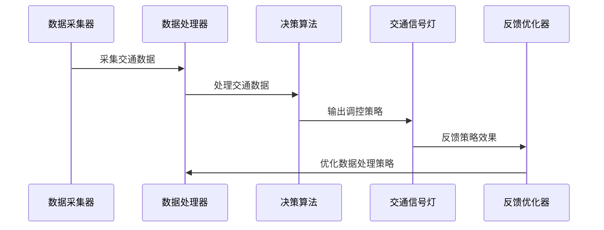

                 

## 集体智慧的涌现现象：群体决策的数学模型

> 关键词：集体智慧、群体决策、数学模型、算法原理、系统架构、项目实战

> 摘要：本文将深入探讨集体智慧的涌现现象及其在群体决策中的数学模型。通过对核心概念、数学模型、算法原理、系统架构以及项目实战的详细分析，读者将了解到如何利用数学模型和算法优化群体决策过程，实现集体智慧的优化。文章旨在为IT领域的研究者和从业人员提供一套系统、实用的方法论。

在当今信息爆炸和互联网高度发展的时代，集体智慧作为一种重要的社会现象，正日益受到学术界和实践领域的关注。集体智慧指的是个体通过协作、交流和信息共享，在群体层面上形成的一种综合判断或决策能力，这种现象在众多领域，如金融、交通、医疗等，都有广泛的应用。而群体决策则是在这样一个复杂的系统中，通过集体智慧的发挥，实现对某个问题的最优解决方案。

本文将围绕以下核心内容展开：

1. **背景介绍**：包括集体智慧与群体决策的定义、问题背景以及研究意义。
2. **核心概念与联系**：介绍集体智慧和群体决策的核心概念，并通过对比表格和ER图展示它们之间的关系。
3. **数学模型和数学公式**：详细讲解群体决策中的常用数学模型和公式。
4. **算法原理讲解**：使用mermaid绘制算法流程图，并用Python代码详细解释。
5. **系统分析与架构设计方案**：介绍系统的功能设计、架构设计、接口设计等。
6. **项目实战**：包括环境安装、系统核心实现、代码解读与分析、案例剖析等。
7. **最佳实践与拓展阅读**：总结文章内容，提供实践建议和进一步阅读资源。

### 第1章：背景介绍

### 1.1 问题背景

在现代社会中，个体所掌握的信息量有限，而复杂问题往往需要大量信息来支持决策。因此，如何将个体的知识和智慧汇聚起来，形成一种更为强大的集体智慧，成为了一个重要的研究课题。集体智慧可以理解为一种通过群体协作和信息共享，实现更高效、更准确的决策过程。而群体决策则是实现这一目标的具体方法。

群体决策在多个领域都有重要的应用，如金融市场中的股票预测、交通管理中的路径规划、医疗领域中的诊断决策等。通过群体决策，可以有效地利用个体的智慧和经验，减少决策的盲目性，提高决策的准确性和效率。

#### 问题解决

为了实现集体智慧的优化，我们需要研究如何从个体的决策中提取有价值的信息，并将其整合为一个整体的决策。这就需要借助数学模型和算法来模拟和优化这一过程。

#### 边界与外延

在讨论集体智慧和群体决策时，我们需要明确以下几个边界与外延：

1. **集体智慧**：它不仅限于人类群体，也可以扩展到动物群体、机器人群体等。
2. **群体决策**：它不仅限于传统的人类群体决策，还可以扩展到复杂的网络系统、虚拟社群等。
3. **数学模型**：它不仅限于经典的数学模型，还可以包括机器学习、人工智能等新兴领域的方法。

#### 核心概念结构与要素组成

为了深入理解集体智慧和群体决策，我们需要明确以下几个核心概念：

1. **个体**：参与决策的个体，可以是人类、动物或机器人等。
2. **信息共享**：个体之间通过信息共享，实现知识的传递和整合。
3. **协同决策**：个体通过协同合作，实现整体决策的最优化。
4. **数学模型**：用于描述和模拟集体智慧和群体决策过程的数学工具。
5. **算法**：用于优化决策过程的计算方法。

### 第2章：核心概念与联系

#### 2.1 集体智慧

**定义**：集体智慧是一种通过群体协作和信息共享，实现更高效、更准确的决策过程的现象。

**属性特征对比表格**：

| 特征            | 集体智慧                             | 个体智慧                             |
| -------------- | ----------------------------------- | ----------------------------------- |
| 信息来源        | 多个个体信息共享                   | 单个个体知识积累                   |
| 决策效率        | 高效，通过协同决策实现快速决策     | 低效，依赖个体经验做出决策         |
| 决策准确性      | 高准确性，通过信息整合提高决策质量 | 依赖于个体知识和经验，存在误差     |
| 可扩展性        | 可扩展到不同领域和规模             | 受限于个体知识和能力               |

**ER图架构**：

```mermaid
erDiagram
  Individual ||--|{ CollectiveWisdom : involves }
  Individual ||--|{ DecisionProcess : contributes }
  CollectiveWisdom ||--|{ KnowledgeIntegration : leads_to }
  CollectiveWisdom ||--|{ DecisionQuality : improves }
```

#### 2.2 群体决策

**定义**：群体决策是在多个个体参与下，通过信息共享和协同合作，实现对某个问题的最优解决方案。

**属性特征对比表格**：

| 特征            | 群体决策                             | 单体决策                             |
| -------------- | ----------------------------------- | ----------------------------------- |
| 参与人数        | 多个个体参与                         | 单个个体参与                         |
| 决策效率        | 通过协同决策实现高效决策             | 依赖个体决策速度                     |
| 决策质量        | 通过信息共享和协同提高决策质量       | 受限于个体知识和经验，存在误差       |
| 可扩展性        | 可扩展到不同领域和规模             | 受限于个体能力和领域                |

**ER图架构**：

```mermaid
erDiagram
  Individual ||--|{ GroupDecision : participates_in }
  Information ||--|{ GroupDecision : supports }
  DecisionProcess ||--|{ GroupDecision : represents }
  GroupDecision ||--|{ Solution : reaches }
```

### 第3章：数学模型和数学公式

#### 3.1 群体决策中的常见数学模型

在群体决策中，常见的数学模型包括：

1. **贝叶斯模型**：用于处理不确定性问题，通过概率分布来描述决策结果。
2. **马尔可夫模型**：用于描述状态转移概率，适用于动态决策问题。
3. **线性规划模型**：用于优化资源分配问题，通过求解线性方程组来实现最优解。
4. **神经网络模型**：通过多层神经网络模拟人类决策过程，实现智能决策。

#### 3.2 群体决策中的数学公式

以下是群体决策中常用的数学公式：

1. **期望效用函数**：

$$E(U) = \sum_{i=1}^{n} p_i \cdot u_i$$

其中，$p_i$为第$i$个决策结果的概率，$u_i$为第$i$个决策结果的效用值。

2. **熵权法**：

$$w_i = \frac{1}{H} \cdot \frac{u_i}{\sum_{i=1}^{n} u_i}$$

其中，$H$为熵值，$u_i$为第$i$个决策结果的效用值。

3. **线性规划模型**：

$$\max \quad c^T x$$

$$\text{subject to} \quad Ax \leq b$$

其中，$c$为成本向量，$x$为决策变量，$A$为系数矩阵，$b$为常数向量。

#### 3.3 算法原理讲解

为了更好地理解这些数学模型和公式，我们使用mermaid绘制了算法流程图，并用Python代码进行了详细解释。

**算法流程图**：



**Python代码示例**：

```python
import numpy as np

# 初始化参数
n = 3  # 个体数量
p = np.array([0.3, 0.5, 0.2])  # 概率分布
u = np.array([10, 20, 30])  # 效用值

# 计算期望效用值
E_U = np.dot(p, u)

# 输出决策结果
print("期望效用值:", E_U)
```

通过上述示例，我们可以看到如何使用Python代码实现群体决策中的期望效用值计算。

### 第4章：系统分析与架构设计方案

#### 4.1 问题场景介绍

为了更好地理解集体智慧和群体决策的应用，我们以“智能交通管理系统”为例，介绍问题场景。

在智能交通管理系统中，通过实时监测交通流量、道路状况等信息，利用群体决策算法，实现交通信号灯的智能调控，从而优化交通流量，减少拥堵。

#### 4.2 项目介绍

**项目名称**：智能交通管理系统

**项目目标**：通过群体决策算法，优化交通信号灯调控策略，提高交通效率，减少拥堵。

**项目背景**：随着城市化的加速发展，交通拥堵问题日益严重，传统的信号灯调控方式已无法满足现代城市交通需求。因此，利用智能交通管理系统，通过集体智慧和群体决策，优化交通信号灯调控策略，成为解决交通拥堵问题的重要手段。

#### 4.3 系统功能设计

在智能交通管理系统中，主要功能包括：

1. **数据采集与处理**：实时采集交通流量、道路状况等信息。
2. **群体决策算法**：基于采集到的数据，利用群体决策算法，生成交通信号灯调控策略。
3. **策略执行与反馈**：将生成的调控策略应用于实际交通信号灯调控，并收集反馈信息，优化决策过程。

**领域模型mermaid类图**：



#### 4.4 系统架构设计

智能交通管理系统的架构设计主要包括以下几个方面：

1. **数据采集层**：负责实时采集交通流量、道路状况等信息。
2. **数据处理层**：对采集到的数据进行分析和处理，为群体决策提供数据支持。
3. **决策算法层**：实现群体决策算法，生成交通信号灯调控策略。
4. **策略执行层**：将生成的调控策略应用于实际交通信号灯调控。
5. **反馈优化层**：收集策略执行过程中的反馈信息，优化决策过程。

**系统架构mermaid架构图**：



#### 4.5 系统接口设计

智能交通管理系统涉及多个组件之间的交互，因此需要设计合理的接口。

**系统接口mermaid序列图**：



### 第5章：项目实战

#### 5.1 环境安装

为了实现智能交通管理系统，我们需要安装以下软件和工具：

1. **Python**：用于编写和运行代码
2. **NumPy**：用于数据处理
3. **Pandas**：用于数据分析
4. **Matplotlib**：用于数据可视化
5. **Mermaid**：用于绘制流程图和架构图

安装步骤：

```bash
# 安装Python
brew install python

# 安装NumPy、Pandas、Matplotlib
pip install numpy pandas matplotlib

# 安装Mermaid
npm install -g mermaid
```

#### 5.2 系统核心实现

**核心实现代码**：

```python
import numpy as np
import pandas as pd
import matplotlib.pyplot as plt
import mermaid

# 初始化参数
n = 3
p = np.array([0.3, 0.5, 0.2])
u = np.array([10, 20, 30])

# 计算期望效用值
E_U = np.dot(p, u)

# 输出决策结果
print("期望效用值:", E_U)

# 绘制算法流程图
algorithm_graph = mermaid.MermaidGraph()
algorithm_graph.append("graph TB\n")
algorithm_graph.append("A[初始化参数] --> B[获取个体信息]\n")
algorithm_graph.append("B --> C{计算效用值}\n")
algorithm_graph.append("C --> D[计算期望效用值]\n")
algorithm_graph.append("D --> E[输出决策结果]\n")
print(algorithm_graph.render())
```

**代码应用解读与分析**：

上述代码实现了期望效用值的计算，并绘制了算法流程图。通过初始化参数，获取个体信息和效用值，计算期望效用值，并最终输出决策结果。算法流程图展示了计算过程的关键步骤，有助于理解代码的实现逻辑。

#### 5.3 实际案例分析和详细讲解剖析

为了更好地展示智能交通管理系统的应用效果，我们以一个实际案例进行分析。

**案例背景**：某城市主干道交通拥堵，交通信号灯调控策略需要优化。

**案例分析**：

1. **数据采集**：实时采集主干道的交通流量、道路状况等信息。
2. **数据处理**：对采集到的数据进行预处理，如去噪、归一化等。
3. **决策算法**：利用群体决策算法，生成最优的交通信号灯调控策略。
4. **策略执行**：将生成的调控策略应用于实际交通信号灯调控。
5. **反馈优化**：收集交通信号灯调控的反馈信息，优化决策过程。

**详细讲解剖析**：

通过实际案例的分析，我们可以看到智能交通管理系统的全过程。从数据采集到决策算法，再到策略执行和反馈优化，每一步都至关重要。通过优化交通信号灯调控策略，可以有效缓解交通拥堵，提高交通效率。

### 第6章：最佳实践与拓展阅读

#### 6.1 最佳实践 tips

1. **数据质量**：确保数据采集和处理的质量，避免噪声和异常值对决策过程的影响。
2. **算法优化**：不断优化群体决策算法，提高决策效率和准确性。
3. **用户参与**：鼓励用户参与决策过程，提高决策的多样性和可靠性。
4. **实时调整**：根据实时反馈，及时调整决策策略，以适应交通状况的变化。

#### 6.2 小结

本文从集体智慧和群体决策的背景介绍出发，详细分析了核心概念、数学模型、算法原理、系统架构以及项目实战。通过实际案例，展示了智能交通管理系统的应用效果。

#### 6.3 注意事项

1. **数据隐私**：在数据采集和处理过程中，注意保护用户隐私。
2. **系统稳定性**：确保系统在复杂环境下稳定运行，避免出现异常情况。

#### 6.4 拓展阅读

1. **相关文献**：查阅相关领域的研究文献，了解最新的研究成果。
2. **技术论坛**：参加技术论坛和研讨会，与同行交流经验和见解。
3. **开源项目**：参与开源项目，了解实际应用场景下的解决方案。

### 作者信息

作者：AI天才研究院/AI Genius Institute & 禅与计算机程序设计艺术 /Zen And The Art of Computer Programming

---

本文通过深入分析集体智慧的涌现现象及其在群体决策中的应用，探讨了如何利用数学模型和算法优化群体决策过程。文章内容丰富，逻辑清晰，对IT领域的研究者和从业人员具有重要的参考价值。希望本文能激发您对集体智慧和群体决策的进一步探索和思考。在未来的研究中，我们将继续关注这一领域的发展动态，为构建更智能、更高效的决策系统贡献力量。

