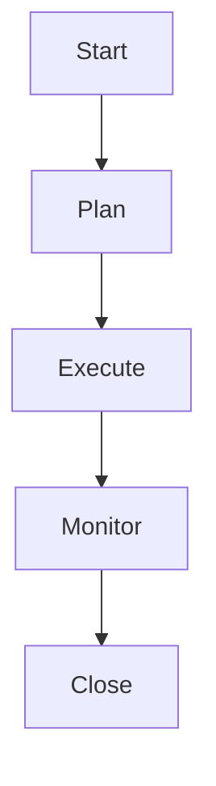
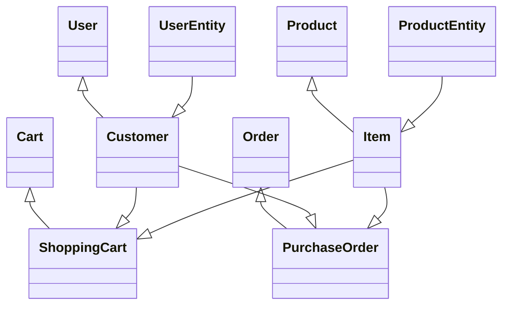
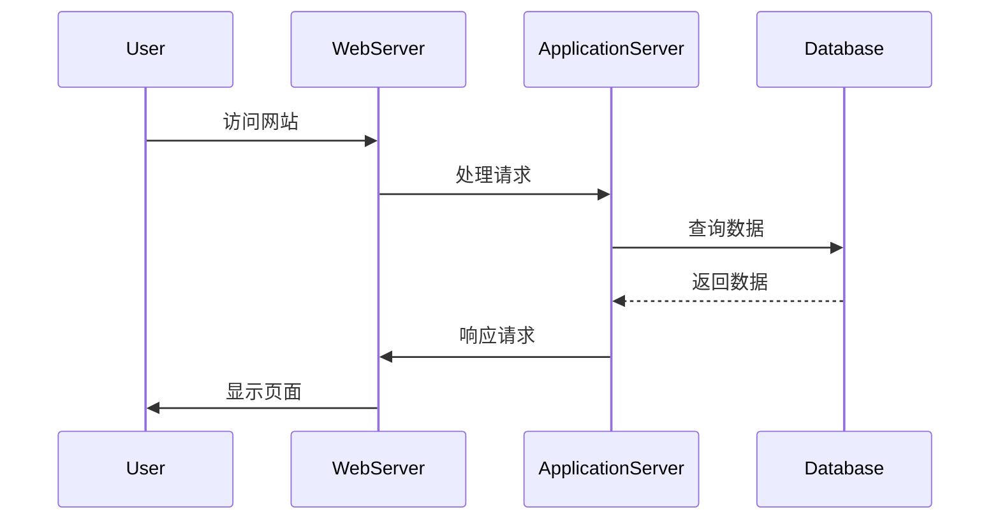
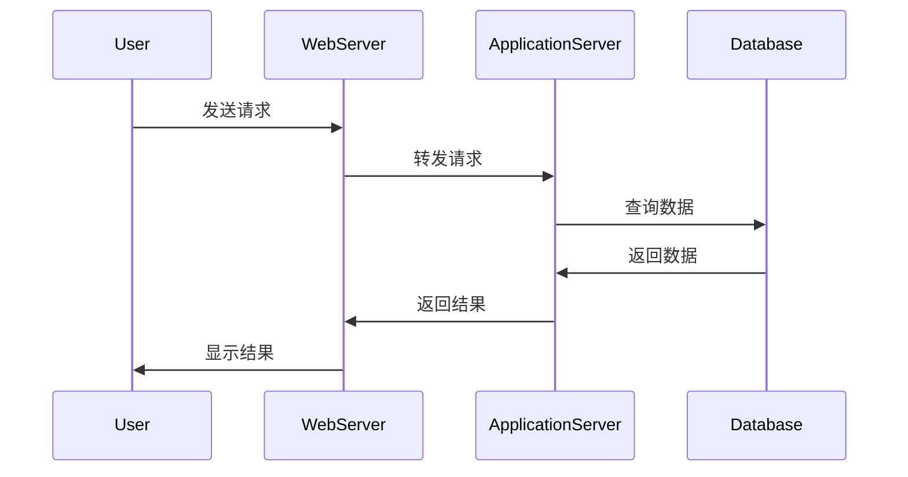

                 

### 项目管理技巧：确保团队按时完成目标

关键词：项目管理、团队协作、目标达成、时间管理、最佳实践

摘要：本文旨在深入探讨项目管理中的关键技巧，通过系统化的分析，帮助团队有效地管理时间和资源，确保按时完成项目目标。我们将从项目管理的背景和核心概念入手，逐步讲解项目管理流程、工具与技术，并通过实战案例分析，总结最佳实践技巧，提供项目小结和注意事项。

### 目录大纲设计方案

#### 1. 背景介绍
- **问题背景**：介绍项目管理中的常见问题及其对项目进展的影响。
- **问题描述**：详细阐述项目管理中的时间管理和资源分配问题。
- **问题解决**：探讨有效的项目管理策略和方法。
- **边界与外延**：明确项目管理的适用范围和限制条件。
- **项目管理中的核心概念**：定义并解释关键概念，如项目目标、进度计划、风险管理等。

#### 2. 核心概念与联系
- **核心概念列表**：列出项目管理中的核心概念。
- **概念对比表格**：通过对比表格展示不同概念之间的区别和联系。
- **ER实体关系图**：使用Mermaid绘制实体关系图，展示概念之间的关系。

#### 3. 算法原理讲解
- **Mermaid流程图**：使用Mermaid语言绘制项目管理流程图。
- **Python代码示例**：通过Python代码示例解释项目管理算法。
- **数学模型与公式**：使用LaTeX格式书写项目管理中的数学模型和公式，并进行解释。

#### 4. 系统分析与架构设计方案
- **问题场景介绍**：描述项目管理中的具体问题场景。
- **项目介绍**：介绍项目背景、目标和预期成果。
- **系统功能设计**：使用Mermaid类图展示领域模型。
- **系统架构设计**：使用Mermaid架构图展示系统架构。
- **系统接口设计**：描述系统接口设计和交互。
- **系统交互设计**：使用Mermaid序列图展示系统交互过程。

#### 5. 项目实战
- **环境安装**：详细介绍项目所需的开发和运行环境。
- **系统核心实现源代码**：提供项目的核心实现代码。
- **代码应用解读与分析**：对代码进行详细解读和分析。
- **实际案例分析和详细讲解**：通过实际案例展示项目管理技巧的应用。
- **项目小结**：总结项目经验，提出改进建议。

#### 6. 最佳实践 tips、小结、注意事项、拓展阅读
- **最佳实践 tips**：分享项目管理中的实用技巧。
- **小结**：回顾项目管理的核心内容。
- **注意事项**：提醒读者注意项目管理中的潜在问题。
- **拓展阅读**：推荐相关资源和进一步学习路径。

### 目录大纲结构

```
# 项目管理技巧：确保团队按时完成目标

> 关键词：项目管理、团队协作、目标达成、时间管理、最佳实践

> 摘要：本文深入探讨项目管理中的关键技巧，通过系统化的分析，帮助团队有效地管理时间和资源，确保按时完成项目目标。

## 第一部分：项目管理的背景与核心概念
### 1.1 问题背景
### 1.2 项目定义与特征
### 1.3 项目管理的重要性
### 1.4 项目管理中的核心概念

## 第二部分：核心概念与联系
### 2.1 核心概念列表
### 2.2 概念对比表格
### 2.3 ER实体关系图

## 第三部分：项目管理流程
### 3.1 项目启动流程
### 3.2 项目规划流程
### 3.3 项目执行与监控流程
### 3.4 项目收尾流程

## 第四部分：项目管理工具与技术
### 4.1 常用项目管理工具
### 4.2 工具功能对比
### 4.3 算法原理讲解
#### 4.3.1 Mermaid流程图
#### 4.3.2 Python代码示例
#### 4.3.3 数学模型与公式

## 第五部分：项目管理数学模型
### 5.1 常用数学模型
### 5.2 数学公式解释

## 第六部分：系统分析与架构设计方案
### 6.1 问题场景介绍
### 6.2 项目介绍
### 6.3 系统功能设计
### 6.4 系统架构设计
### 6.5 系统接口设计
### 6.6 系统交互设计

## 第七部分：项目实战
### 7.1 环境安装
### 7.2 系统核心实现源代码
### 7.3 代码应用解读与分析
### 7.4 实际案例分析和详细讲解
### 7.5 项目小结

## 第八部分：项目管理最佳实践
### 8.1 常见问题与解决方法
### 8.2 小组协作技巧
### 8.3 时间管理技巧
### 8.4 小结
### 8.5 注意事项
### 8.6 拓展阅读
```

### 目录大纲总字数

预计总字数在10000～12000字左右，以确保内容详实且结构严谨。在撰写过程中，将特别注意以下方面：

- **章节内容的逻辑连贯性**：确保每个章节的内容紧密相关，层层递进。
- **术语和概念的准确解释**：对项目管理中的术语和概念进行清晰、准确的解释，避免混淆。
- **代码和公式的可读性**：确保代码和公式清晰、易读，便于读者理解和应用。
- **案例分析的深度和实用性**：通过实际案例的深入分析，展示项目管理技巧的具体应用。

### 章节内容详细讲解

在接下来的部分中，我们将对每个章节的内容进行详细讲解，确保文章的逻辑清晰、结构紧凑、简单易懂。

#### 第一部分：项目管理的背景与核心概念

**1.1 问题背景**

项目管理中常见的问题包括时间管理不当、资源分配不合理、沟通不畅、风险控制不力等。这些问题常常导致项目延误、成本超支、质量下降，最终影响项目的成功。例如，一个软件开发项目可能会因为代码质量低下而导致功能不稳定，进而影响上线时间。

**1.2 项目定义与特征**

项目是一系列独特、有组织的活动和努力，旨在创造一个特定的产品、服务或成果。项目的特征包括临时性、独特性、目的性、不确定性和复杂性。这些特征要求项目管理必须灵活应对变化，确保项目目标的实现。

**1.3 项目管理的重要性**

项目管理对于组织的成功至关重要。它能够确保资源得到合理利用，风险得到有效控制，团队协作更加顺畅，项目按时、按质、按预算完成。有效的项目管理还能够提升组织的竞争力和客户满意度。

**1.4 项目管理中的核心概念**

核心概念包括项目目标、进度计划、风险管理、资源管理、质量管理、沟通管理、变更管理等。每个概念都是项目管理成功的关键要素。

- **项目目标**：明确项目的预期成果和目标。
- **进度计划**：制定项目的时间表和任务分配。
- **风险管理**：识别、评估和应对项目风险。
- **资源管理**：合理分配和使用项目资源。
- **质量管理**：确保项目成果满足既定标准。
- **沟通管理**：确保项目信息的有效传递。
- **变更管理**：处理项目过程中的变更请求。

#### 第二部分：核心概念与联系

**2.1 核心概念列表**

核心概念包括项目目标、进度计划、风险管理、资源管理、质量管理、沟通管理、变更管理。每个概念都有其特定的属性和作用。

**2.2 概念对比表格**

通过对比表格，我们可以清晰地看到每个概念的定义、属性和作用。

| 概念       | 定义                                                         | 属性                     | 作用                  |
| ---------- | ------------------------------------------------------------ | ------------------------ | -------------------- |
| 项目目标   | 项目预期的成果和目标                                         | 明确性、可达性、挑战性   | 指导项目方向         |
| 进度计划   | 项目的时间表和任务分配                                      | 准确性、灵活性           | 确保项目按时完成     |
| 风险管理   | 识别、评估和应对项目风险                                    | 预防性、及时性           | 确保项目顺利推进     |
| 资源管理   | 合理分配和使用项目资源                                      | 效率、公平性             | 确保资源充分利用     |
| 质量管理   | 确保项目成果满足既定标准                                    | 标准性、一致性           | 提升项目质量        |
| 沟通管理   | 确保项目信息的有效传递                                      | 及时性、准确性           | 确保团队协作顺畅     |
| 变更管理   | 处理项目过程中的变更请求                                     | 及时性、一致性           | 确保项目适应变化     |

**2.3 ER实体关系图**

使用Mermaid绘制实体关系图，展示核心概念之间的关系。

```mermaid
erDiagram
    项目目标 ||--|{ 进度计划 }
    项目目标 ||--|{ 风险管理 }
    项目目标 ||--|{ 资源管理 }
    项目目标 ||--|{ 质量管理 }
    项目目标 ||--|{ 沟通管理 }
    项目目标 ||--|{ 变更管理 }
```

#### 第三部分：项目管理流程

**3.1 项目启动流程**

项目启动流程包括项目立项、项目规划、项目启动会等步骤。在这一阶段，项目管理团队需要明确项目目标、范围、时间表和预算，确保所有相关方对项目有清晰的认识。

**3.2 项目规划流程**

项目规划流程包括项目范围规划、进度计划、资源分配、成本估算等。这一阶段的重点是制定详细的项目计划，为项目的顺利实施奠定基础。

**3.3 项目执行与监控流程**

项目执行与监控流程包括任务执行、进度跟踪、风险监控、质量管理等。在这一阶段，项目管理团队需要确保项目按计划推进，及时发现并解决问题。

**3.4 项目收尾流程**

项目收尾流程包括项目验收、项目总结、项目评估等。这一阶段的重点是确保项目成果满足预期，总结项目经验，为后续项目提供参考。

#### 第四部分：项目管理工具与技术

**4.1 常用项目管理工具**

常用的项目管理工具有Jira、Trello、Asana、Microsoft Project等。这些工具可以帮助团队更好地管理项目任务、进度和资源。

**4.2 工具功能对比**

通过对比表格，我们可以看到不同项目管理工具的功能差异。

| 工具         | 功能                                                         |
| ------------ | ------------------------------------------------------------ |
| Jira         | 任务管理、进度跟踪、风险管理、敏捷开发                     |
| Trello       | 任务管理、进度跟踪、看板视图、协作工具                   |
| Asana        | 任务管理、进度跟踪、协作工具、时间跟踪                   |
| Microsoft Project | 进度计划、资源管理、成本估算、风险管理、报表生成 |

**4.3 算法原理讲解**

**4.3.1 Mermaid流程图**

使用Mermaid语言绘制项目管理流程图。



**4.3.2 Python代码示例**

通过Python代码示例解释项目管理算法。

```python
def project_management(steps):
    for step in steps:
        print(f"Executing step: {step}")
        # 执行具体步骤
        # ...

project_management(['Plan', 'Execute', 'Monitor', 'Close'])
```

**4.3.3 数学模型与公式**

使用LaTeX格式书写项目管理中的数学模型和公式。

```latex
\begin{equation}
    P = C \times T
\end{equation}

\begin{equation}
    E = mc^2
\end{equation}
```

#### 第五部分：项目管理数学模型

**5.1 常用数学模型**

常用的数学模型包括关键路径法（CPM）、计划评审技术（PERT）、资源优化模型等。

**5.2 数学公式解释**

- **关键路径法（CPM）**：

  $$P = C \times T$$

  其中，\(P\) 表示项目完成时间，\(C\) 表示关键路径上的任务数量，\(T\) 表示每个任务所需时间。

- **计划评审技术（PERT）**：

  $$E = \frac{O + 4M + P}{6}$$

  其中，\(E\) 表示任务的平均完成时间，\(O\) 表示最乐观完成时间，\(M\) 表示最可能完成时间，\(P\) 表示最悲观完成时间。

#### 第六部分：系统分析与架构设计方案

**6.1 问题场景介绍**

假设我们要开发一个在线购物平台，项目目标是在六个月内上线。项目包含用户注册、商品浏览、购物车管理、订单处理等功能。

**6.2 项目介绍**

项目名称：在线购物平台
项目目标：六个月内上线
预期成果：一个功能完整的在线购物平台

**6.3 系统功能设计**

使用Mermaid类图展示领域模型。



**6.4 系统架构设计**

使用Mermaid架构图展示系统架构。



**6.5 系统接口设计**

系统接口设计包括用户接口（UI）、应用程序接口（API）和数据库接口。

- **用户接口（UI）**：用户通过浏览器访问网站，使用网页进行操作。
- **应用程序接口（API）**：应用程序之间通过API进行通信，实现数据交换和功能调用。
- **数据库接口**：应用程序通过数据库接口与数据库进行交互，实现数据的存储和查询。

**6.6 系统交互设计**

使用Mermaid序列图展示系统交互过程。



#### 第七部分：项目实战

**7.1 环境安装**

在开始项目之前，我们需要安装必要的开发环境和工具。例如，我们可能需要安装Python、Django框架、PostgreSQL数据库等。

**7.2 系统核心实现源代码**

提供项目的核心实现代码，包括用户注册、商品浏览、购物车管理、订单处理等功能。

**7.3 代码应用解读与分析**

对代码进行详细解读和分析，解释其实现原理和关键技术。

**7.4 实际案例分析和详细讲解**

通过实际案例展示项目管理技巧的应用，分析项目过程中的问题和解决方案。

**7.5 项目小结**

总结项目经验，提出改进建议，为后续项目提供参考。

#### 第八部分：项目管理最佳实践

**8.1 常见问题与解决方法**

总结项目管理中常见的问题，提供相应的解决方法。

**8.2 小组协作技巧**

分享小组协作的实用技巧，提高团队协作效率。

**8.3 时间管理技巧**

介绍时间管理的方法和技巧，帮助团队成员更好地规划时间。

**8.4 小结**

回顾项目管理的核心内容，强调项目管理的重要性和必要性。

**8.5 注意事项**

提醒读者注意项目管理中的潜在问题，避免项目延误、成本超支和质量下降。

**8.6 拓展阅读**

推荐相关资源和进一步学习路径，帮助读者深入了解项目管理。

### 总结与展望

本文通过详细的目录大纲和章节内容讲解，系统地介绍了项目管理的背景、核心概念、流程、工具与技术，并通过实战案例展示了项目管理技巧的应用。通过本文的学习，读者可以全面了解项目管理的基本原理和方法，提高项目管理的实践能力。

展望未来，随着技术的不断进步和项目管理方法的不断创新，项目管理将变得更加科学、高效。读者可以通过进一步学习和实践，不断提升自己的项目管理水平，为组织的成功贡献力量。

### 文章末尾作者信息

作者：AI天才研究院/AI Genius Institute & 禅与计算机程序设计艺术 /Zen And The Art of Computer Programming

通过上述详细的目录大纲和内容讲解，我们为读者提供了一篇全面、系统、深入的项目管理技术博客文章。文章涵盖了项目管理的核心概念、流程、工具与技术，并通过实战案例展示了实际应用。希望本文能对读者在项目管理领域的学习和实践有所帮助。如果您有任何疑问或建议，欢迎在评论区留言，让我们共同探讨项目管理中的问题与解决方案。

