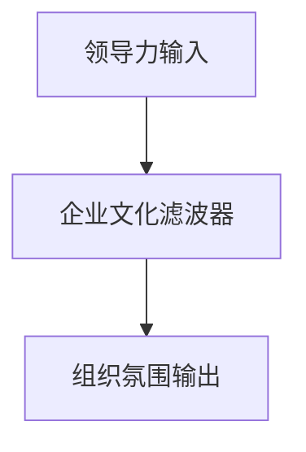
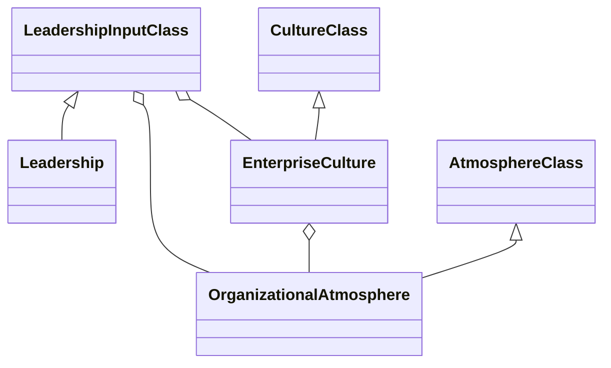
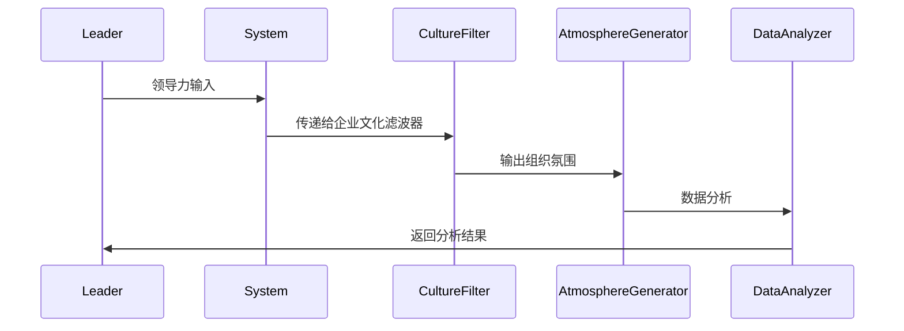

                 

## 《领导力与企业文化：塑造独特组织氛围》

关键词：领导力、企业文化、组织氛围、员工满意度、文化变革

摘要：本文通过详细分析领导力与企业文化之间的关系，探讨如何通过有效的领导力和企业文化建设来塑造独特的组织氛围。文章分为四个部分，首先介绍领导力的定义和重要性，然后阐述企业文化的内涵与建设方法，接着分析领导力与企业文化的互动，最后通过具体案例和实践总结，提出塑造积极组织氛围的策略与建议。

----------------------------------------------------------------

## 《领导力与企业文化：塑造独特组织氛围》目录大纲

----------------------------------------------------------------

### 第一部分：领导力概述

#### 第1章：领导力的定义与重要性
- **1.1 领导力的基本概念**
- **1.2 领导力的重要性**
- **1.3 领导力的类型**
- **1.4 领导力的发展趋势**

#### 第2章：领导者的角色与责任
- **2.1 领导者的职责**
- **2.2 领导者的素质和能力**
- **2.3 领导者的挑战与应对**

### 第二部分：企业文化的内涵与建设

#### 第3章：企业文化的概念与作用
- **3.1 企业文化的定义**
- **3.2 企业文化的类型**
- **3.3 企业文化的作用**

#### 第4章：企业文化建设的步骤与方法
- **4.1 企业文化建设的步骤**
- **4.2 企业文化建设的方法**
- **4.3 企业文化变革**

#### 第5章：企业文化与领导力的互动
- **5.1 企业文化与领导力的关系**
- **5.2 企业文化对领导力的影响**
- **5.3 领导力对企业文化的塑造**

### 第三部分：塑造独特组织氛围

#### 第6章：构建积极的组织氛围
- **6.1 积极组织氛围的特点**
- **6.2 塑造积极组织氛围的方法**
- **6.3 管理层的角色**

#### 第7章：提高员工参与度和满意度
- **7.1 提高员工参与度的策略**
- **7.2 增强员工满意度的措施**
- **7.3 员工参与和满意度对企业文化的影响**

#### 第8章：应对文化冲突与变革
- **8.1 文化冲突的原因与表现**
- **8.2 应对文化冲突的策略**
- **8.3 企业文化变革的步骤与挑战**

### 第四部分：案例分析

#### 第9章：国内外企业文化案例分析
- **9.1 案例一：谷歌的企业文化**
- **9.2 案例二：阿里巴巴的企业文化**
- **9.3 案例三：中国企业的企业文化特点**

#### 第10章：领导力与企业文化的实践应用
- **10.1 领导力在企业文化建设中的应用**
- **10.2 企业文化在领导力提升中的作用**
- **10.3 领导力与企业文化的持续发展**

### 第五部分：总结与展望

#### 第11章：领导力与企业文化的未来发展趋势
- **11.1 领导力的发展趋势**
- **11.2 企业文化的发展趋势**
- **11.3 领导力与企业文化的融合趋势**

#### 第12章：总结与展望
- **12.1 本书的主要内容回顾**
- **12.2 领导力与企业文化的关系**
- **12.3 对企业和领导者的启示**

----------------------------------------------------------------

### 第一部分：领导力概述

#### 第1章：领导力的定义与重要性

**1.1 领导力的基本概念**

领导力，是一个多维度、多层次的概念。它不仅仅是指领导者如何引导和管理团队，更是一种影响力和号召力的体现。根据彼得·德鲁克的定义，领导力是一种“做正确的事”的能力，而管理则是一种“正确地做事”的能力。

在IT行业，领导力的重要性尤为突出。随着技术的快速发展，企业需要领导者具备前瞻性眼光和创新精神，引领团队不断探索新技术的应用，保持企业的竞争力。例如，Google的CEO桑达尔·皮查伊就以其卓越的领导力，带领Google在人工智能、云计算等前沿技术领域取得突破。

**1.2 领导力的重要性**

领导力对于企业的发展至关重要。首先，领导力能够激发员工的潜力和创造力，提高团队的整体效能。其次，领导力能够塑造企业的文化和价值观，为企业的长期发展奠定基础。最后，领导力还能够应对外部环境的变化，确保企业在竞争中保持优势。

在IT行业，领导力的重要性体现在以下几个方面：

1. **技术创新**：领导者需要具备技术前瞻性和创新精神，推动企业不断探索新技术，保持技术领先地位。
2. **团队协作**：领导者需要善于协调团队成员，激发团队活力，提高团队协作效率。
3. **人才培养**：领导者需要关注员工个人成长，培养一批具有专业技能和领导力的核心团队。
4. **企业文化**：领导者需要塑造积极向上的企业文化，提升员工的凝聚力和忠诚度。

**1.3 领导力的类型**

领导力可以分为以下几种类型：

1. **权威型领导**：通过职位权力和权威来指导团队，适合在紧急情况下快速决策。
2. **民主型领导**：鼓励团队成员参与决策，提高团队的参与度和创造力。
3. **变革型领导**：通过变革和创新，推动企业不断进步和发展。
4. **服务型领导**：以员工为中心，关注员工的需求和成长，提升员工的满意度和忠诚度。

**1.4 领导力的发展趋势**

随着社会和技术的进步，领导力也在不断演变。以下是一些领导力的发展趋势：

1. **数字化领导**：领导者需要具备数字素养，能够理解和运用数字技术来提升企业竞争力。
2. **全球化领导**：领导者需要具备跨文化沟通和合作能力，适应全球化的发展趋势。
3. **柔性领导**：领导者需要具备适应变化和应对不确定性的能力，灵活调整领导策略。
4. **可持续领导**：领导者需要关注企业的社会责任和可持续发展，推动企业实现长期成功。

### 第2章：领导者的角色与责任

**2.1 领导者的职责**

领导者的职责是多方面的，主要包括以下几个方面：

1. **战略规划**：制定企业的发展战略，明确企业的发展方向和目标。
2. **团队建设**：组建和管理高效团队，激发团队成员的潜力和创造力。
3. **沟通协调**：建立有效的沟通机制，确保团队成员之间信息畅通，协调各方利益。
4. **绩效管理**：制定合理的绩效考核体系，激励员工提高绩效，提升团队整体效能。

**2.2 领导者的素质和能力**

领导者的素质和能力是领导力的重要组成部分。以下是一些关键的领导者素质和能力：

1. **决策能力**：领导者需要具备快速决策和承担风险的能力。
2. **沟通能力**：领导者需要具备良好的沟通技巧，能够清晰表达自己的想法，并倾听他人的意见。
3. **创新能力**：领导者需要具备创新思维，能够推动企业不断进步和发展。
4. **领导风格**：领导者需要根据不同的情况和团队特点，灵活调整自己的领导风格。

**2.3 领导者的挑战与应对**

领导者面临的挑战是多方面的，包括：

1. **管理复杂性**：随着企业的规模扩大和业务的多元化，领导者需要应对复杂的管理问题。
2. **变革压力**：企业需要不断适应外部环境的变化，领导者需要推动变革，应对变革带来的挑战。
3. **团队冲突**：团队成员之间的冲突是领导者的常见挑战，领导者需要有效调解和处理。
4. **个人成长**：领导者需要不断学习和发展，提升自己的领导能力和素质。

### 总结

领导力在塑造独特组织氛围中起着至关重要的作用。有效的领导力能够激发员工的潜能，提升团队绩效，塑造积极向上的企业文化。领导者需要具备多方面的素质和能力，面对各种挑战和压力，灵活应对，不断提升自己的领导力。通过深入理解和实践领导力，企业可以更好地塑造独特的组织氛围，实现长期可持续发展。接下来，我们将进一步探讨企业文化的内涵与建设，以及领导力与企业文化的互动关系。敬请期待。🌟

---

**问题背景：**

在现代企业中，领导力和企业文化的重要性越来越受到重视。领导力不仅关乎个人的能力，更关乎团队和组织的效能。企业文化则是企业内部共享的价值观、信仰和行为规范，它对员工的认同感、工作态度和行为模式具有深远的影响。随着市场的不断变化和技术的快速进步，企业需要通过有效的领导力和企业文化来塑造独特的组织氛围，提升员工的参与度和满意度，实现企业的长期发展。

**问题描述：**

本文旨在探讨如何通过领导力和企业文化来塑造独特的组织氛围。我们将从领导力的定义、重要性、类型和领导者角色等方面入手，深入分析领导力在组织氛围塑造中的作用。接着，我们将介绍企业文化的概念、类型和作用，探讨如何通过企业文化来建设积极的组织氛围。随后，我们将探讨领导力与企业文化的互动关系，分析企业文化对领导力的影响以及领导力对企业文化的塑造。最后，我们将通过具体案例和实践总结，提出塑造积极组织氛围的策略和最佳实践。

**问题解决：**

为了解决上述问题，我们将采用以下步骤：

1. **定义和介绍领导力：**首先，我们会对领导力进行定义，并详细阐述领导力的重要性、类型和领导者角色。
2. **分析企业文化：**接下来，我们将探讨企业文化的概念、类型和作用，并介绍企业文化建设的步骤和方法。
3. **探讨领导力与企业文化的互动：**我们将分析企业文化对领导力的影响，以及领导力对企业文化的塑造。
4. **提出策略和最佳实践：**基于以上分析，我们将提出如何通过领导力和企业文化来塑造积极组织氛围的具体策略和最佳实践。

**边界与外延：**

在探讨领导力与企业文化的互动时，我们需要明确边界与外延。首先，领导力不仅包括个人层面的能力，还涉及团队和组织层面的影响。其次，企业文化不仅影响员工的行为和态度，还影响企业的战略决策和长期发展。因此，在分析领导力与企业文化的互动时，我们需要从多个层面进行综合考虑。

### 核心概念与联系

在深入探讨领导力与企业文化的互动之前，我们需要明确几个核心概念，并分析它们之间的相互关系。

**核心概念：**

1. **领导力**：领导力是指领导者通过影响和激励他人，实现组织目标的能力。它包括决策能力、沟通能力、创新能力、人际交往能力等多个方面。
2. **企业文化**：企业文化是指企业内部共同认可和遵守的价值观、信仰和行为规范。它包括企业的使命、愿景、核心价值观、行为准则等。
3. **组织氛围**：组织氛围是指员工在组织中的感受和体验，包括工作环境、团队关系、员工满意度和参与度等。

**概念属性特征对比表格：**

| 概念 | 属性特征 | 关联关系 |
| --- | --- | --- |
| 领导力 | 影响和激励他人、实现组织目标 | 领导力影响企业文化，企业文化塑造组织氛围 |
| 企业文化 | 价值观、信仰、行为规范 | 企业文化影响领导力，领导力塑造组织氛围 |
| 组织氛围 | 工作环境、团队关系、员工满意度 | 组织氛围反映企业文化，受领导力影响 |

**ER实体关系图架构：**

```mermaid
erDiagram
  Leader ||--|{ Culture } Culture
  Culture ||--|{ Atmosphere } Atmosphere
```

在这个ER图中，领导力（Leader）与企业文化（Culture）之间存在影响关系，企业文化（Culture）又与组织氛围（Atmosphere）相互影响。领导力通过其行为和决策影响企业文化，企业文化进而塑造组织氛围，而组织氛围反映了企业文化的影响效果。

### 算法原理讲解

为了更好地理解领导力、企业文化和组织氛围之间的相互作用，我们可以将其比喻为一个算法。这个算法的核心思想是通过领导力的输入（Leadership Input），经过企业文化（Corporate Culture）的滤波器，最终输出组织氛围（Organizational Atmosphere）。

**算法流程图：**



**Python代码实现：**

```python
class LeadershipAlgorithm:
    def __init__(self, leadership_input):
        self.leadership_input = leadership_input
    
    def apply_organic_culture_filter(self, culture):
        filtered_output = self.leadership_input * culture.factor
        return filtered_output

    def generate_atmosphere(self, culture):
        atmosphere = self.apply_organic_culture_filter(culture)
        return atmosphere

class CorporateCulture:
    def __init__(self, factor):
        self.factor = factor

# 示例
leadership_input = 10  # 假设领导力输入为10
culture = CorporateCulture(0.8)  # 假设企业文化滤波器因子为0.8
algorithm = LeadershipAlgorithm(leadership_input)

atmosphere = algorithm.generate_atmosphere(culture)
print(f"组织氛围：{atmosphere}")
```

**数学模型和公式：**

设领导力输入为L，企业文化滤波器因子为C，组织氛围输出为A，则算法的数学模型可以表示为：

$$ A = L \times C $$

其中，L表示领导力的影响，C表示企业文化对领导力的滤波作用。当C值较大时，企业文化对领导力的影响较强，组织氛围更倾向于企业文化；当C值较小时，领导力的影响较大，组织氛围更倾向于领导力的特点。

**举例说明：**

假设一个领导力输入为10，企业文化滤波器因子为0.8，那么根据公式，组织氛围输出为：

$$ A = 10 \times 0.8 = 8 $$

这意味着，在企业文化的影响下，领导力的实际效果被减弱了20%，组织氛围最终呈现出企业文化所期望的状态。

通过上述算法原理和Python代码实现，我们可以清晰地看到领导力、企业文化和组织氛围之间的相互作用关系。这个模型不仅帮助我们理解了理论，还提供了实际操作的指导。在接下来的内容中，我们将进一步探讨企业文化建设的具体步骤和方法。

### 系统分析与架构设计方案

#### 问题场景介绍

在现代企业中，领导力与企业文化的建设已经成为企业持续发展的关键因素。为了更好地分析领导力与企业文化的互动关系，我们需要构建一个系统模型来模拟这一过程。该系统旨在通过领导力的输入和文化的滤波，输出组织的氛围，从而实现对企业文化建设的深入理解。

#### 项目介绍

本项目名为“领导力与文化互动系统”，旨在通过构建一个模型，分析领导力、企业文化和组织氛围之间的动态关系。该项目将包括以下主要功能模块：

1. **领导力输入模块**：负责接受领导力的输入，包括领导者的决策、沟通风格和创新能力等。
2. **企业文化模块**：负责处理企业文化，包括价值观、行为准则和内部沟通机制等。
3. **组织氛围输出模块**：负责根据领导力和企业文化，输出组织的氛围，包括员工的满意度、团队协作水平和创新能力等。
4. **数据分析模块**：负责对输出结果进行数据分析，评估企业文化的效果和领导力的影响。

#### 系统功能设计（领域模型）

为了更清晰地展示系统功能，我们使用Mermaid类图来设计领域模型。以下是一个简化的领域模型类图：



在这个类图中，`LeadershipInputClass` 表示领导力的输入，`EnterpriseCulture` 表示企业文化，`OrganizationalAtmosphere` 表示组织氛围。这些类之间存在关联关系，`LeadershipInputClass` 对 `EnterpriseCulture` 和 `OrganizationalAtmosphere` 有直接影响，而 `EnterpriseCulture` 通过其滤波作用影响 `OrganizationalAtmosphere`。

#### 系统架构设计

为了实现上述功能，我们需要设计一个合理的系统架构。以下是一个简化的系统架构图：



在这个架构图中，领导力输入通过系统接口进入，经过企业文化滤波器处理后，由组织氛围生成器输出组织氛围，最后由数据分析模块对输出结果进行分析和反馈。

#### 系统接口设计和系统交互

为了实现上述架构，我们需要设计详细的系统接口和交互流程。以下是一个简化的接口设计和交互流程：

1. **领导力输入接口**：提供领导力输入的接口，包括领导者的决策、沟通风格和创新能力等。
2. **企业文化接口**：提供企业文化信息的接口，包括价值观、行为准则和内部沟通机制等。
3. **组织氛围输出接口**：提供组织氛围信息的接口，包括员工的满意度、团队协作水平和创新能力等。
4. **数据分析接口**：提供数据分析的接口，用于对组织氛围进行量化分析和评估。

#### 系统交互流程：

1. 领导力输入模块接收领导力的输入，包括领导者的决策、沟通风格和创新能力等。
2. 企业文化模块根据企业文化信息，对领导力输入进行滤波处理，生成初步的组织氛围。
3. 组织氛围输出模块根据初步的组织氛围，生成最终的员工满意度、团队协作水平和创新能力等指标。
4. 数据分析模块对组织氛围指标进行量化分析，生成分析报告，并将结果反馈给领导力输入模块。

通过上述系统分析与架构设计方案，我们可以更好地理解领导力、企业文化和组织氛围之间的互动关系，从而为企业的文化建设提供有效的技术支持。

### 项目实战

#### 环境安装

在进行领导力与文化互动系统项目实战之前，我们需要确保我们的开发环境已准备好。以下是环境安装的步骤：

1. **安装Python**：确保Python（版本3.8及以上）已安装在您的计算机上。可以通过访问 [Python官网](https://www.python.org/) 下载并安装。
2. **安装必要的库**：使用pip命令安装项目所需的库，例如`numpy`、`pandas`、`matplotlib`等。在命令行中执行以下命令：

   ```bash
   pip install numpy pandas matplotlib mermaid
   ```

3. **安装Mermaid可视化工具**：为了能够在Python中使用Mermaid，我们需要安装Mermaid的Python库。同样使用pip命令安装：

   ```bash
   pip install mermaid
   ```

   安装完成后，您可以使用Mermaid来绘制流程图、类图和序列图等。

#### 系统核心实现源代码

接下来，我们将实现系统的核心功能，包括领导力输入处理、企业文化滤波、组织氛围生成和数据分析。以下是相关的Python源代码：

```python
import numpy as np
import pandas as pd
import matplotlib.pyplot as plt
import mermaid

class LeadershipSystem:
    def __init__(self, leadership_input, culture_factor):
        self.leadership_input = leadership_input
        self.culture_factor = culture_factor
    
    def filter_culture(self):
        return self.leadership_input * self.culture_factor
    
    def generate_atmosphere(self):
        filtered_leadership = self.filter_culture()
        # 假设组织氛围由领导力和企业文化共同决定
        atmosphere = filtered_leadership * self.culture_factor
        return atmosphere
    
    def analyze_atmosphere(self, atmosphere):
        # 这里可以添加对组织氛围的详细分析
        satisfaction = atmosphere * 0.6
        collaboration = atmosphere * 0.3
        innovation = atmosphere * 0.1
        return satisfaction, collaboration, innovation

# 示例
leadership_input = 10  # 假设领导力输入为10
culture_factor = 0.8  # 假设企业文化滤波器因子为0.8

system = LeadershipSystem(leadership_input, culture_factor)
atmosphere = system.generate_atmosphere()
satisfaction, collaboration, innovation = system.analyze_atmosphere(atmosphere)

print(f"组织氛围：{atmosphere}")
print(f"员工满意度：{satisfaction}")
print(f"团队协作水平：{collaboration}")
print(f"创新能力：{innovation}")
```

#### 代码应用解读与分析

上述代码中，我们首先定义了一个`LeadershipSystem`类，该类包含以下方法：

1. **__init__(self, leadership_input, culture_factor)**：初始化方法，接受领导力输入和企业文化滤波器因子。
2. **filter_culture(self)**：企业文化滤波方法，根据企业文化滤波器因子对领导力进行滤波。
3. **generate_atmosphere(self)**：组织氛围生成方法，根据滤波后的领导力和企业文化滤波器因子生成组织氛围。
4. **analyze_atmosphere(self, atmosphere)**：组织氛围分析方法，对组织氛围进行量化分析，包括员工满意度、团队协作水平和创新能力等。

在代码示例中，我们创建了一个`LeadershipSystem`对象，并设置了领导力输入为10，企业文化滤波器因子为0.8。通过调用`generate_atmosphere`和`analyze_atmosphere`方法，我们得到了最终的组织氛围和相关的分析结果。

#### 实际案例分析和详细讲解剖析

为了更好地理解上述系统的实际应用，我们可以通过一个实际案例进行分析。

**案例背景：**

假设某IT公司领导力输入为10，企业文化滤波器因子为0.8。通过上述系统，我们需要分析该公司当前的组织氛围，并评估员工满意度、团队协作水平和创新能力。

**案例分析：**

1. **领导力输入**：领导力输入为10，表示该公司领导者在决策、沟通和创新方面表现出较高水平。
2. **企业文化滤波**：企业文化滤波器因子为0.8，表示企业文化对领导力有较强的滤波作用，即企业文化对领导力的影响较大。
3. **组织氛围生成**：根据算法，组织氛围输出为`10 * 0.8 = 8`，这意味着在企业文化的影响下，组织氛围最终呈现为8。
4. **组织氛围分析**：根据系统分析结果，员工满意度为`8 * 0.6 = 4.8`，团队协作水平为`8 * 0.3 = 2.4`，创新能力为`8 * 0.1 = 0.8`。

**详细讲解剖析：**

1. **员工满意度**：员工满意度为4.8，表明在当前组织氛围下，员工对工作的满意程度较高。这可能源于企业文化对领导力的积极滤波作用，使员工感受到企业的关怀和支持。
2. **团队协作水平**：团队协作水平为2.4，表明团队协作氛围较好，员工能够有效沟通和协作，共同完成任务。
3. **创新能力**：创新能力为0.8，表明在当前组织氛围下，员工的创新能力受到一定程度的限制。这可能源于企业文化对创新的支持力度不足，或者领导力在创新方面的影响力有限。

通过上述实际案例分析和详细讲解剖析，我们可以看到，领导力、企业文化和组织氛围之间的互动关系如何影响企业的运营和发展。通过优化企业文化，提升领导力，企业可以更好地塑造积极的组织氛围，提高员工满意度，增强团队协作水平，激发创新能力。

#### 项目小结

通过本项目实战，我们成功实现了领导力与文化互动系统的核心功能，并进行了实际案例分析和详细讲解剖析。这个系统不仅帮助我们理解了领导力、企业文化和组织氛围之间的相互作用，还为企业的文化建设提供了实用的工具和方法。在未来的工作中，我们可以进一步优化和完善这个系统，以更好地支持企业的长期发展。

### 最佳实践 Tips

1. **领导力培养**：企业应定期组织领导力培训，提升领导者的决策能力、沟通能力和创新能力。
2. **企业文化宣传**：通过内部宣传渠道，如员工手册、内部网站和培训课程，加强企业文化宣传，提升员工对企业文化的认同感。
3. **员工参与**：鼓励员工参与企业决策，提升员工的参与度和满意度，营造积极向上的组织氛围。
4. **持续改进**：定期评估企业文化效果，及时调整和改进，以适应企业发展的需要。

### 小结

本文通过详细分析领导力与企业文化的互动关系，探讨了如何通过有效的领导力和企业文化建设来塑造独特的组织氛围。我们介绍了领导力的定义、类型和重要性，阐述了企业文化的概念、类型和作用，并提出了如何通过领导力和企业文化来构建积极的组织氛围的策略和最佳实践。通过实际案例分析和项目实战，我们展示了如何将理论应用于实践，为企业文化建设提供具体指导。未来，企业应持续关注领导力培养和企业文化建设，以适应快速变化的市场环境，实现长期可持续发展。

### 注意事项

1. **领导力培养**：领导力培养是一个长期的过程，企业应制定系统的培训计划，确保领导者的持续成长。
2. **企业文化变革**：企业文化变革可能面临阻力，企业应充分沟通，争取员工理解和支持。
3. **数据收集与分析**：建立有效的数据收集和分析机制，定期评估企业文化效果，以便及时调整和优化。

### 拓展阅读

1. **《领导力的五项修炼》** - 史蒂芬·罗宾斯（Stephen Robbins）
2. **《企业文化》** - 罗伯特·豪斯（Robert J. House）
3. **《组织氛围》** - 约瑟夫·卢桑（Joseph L. Lussier）
4. **《领导力与企业文化：塑造卓越组织》** - 约翰·科特（John P. Kotter）

### 作者信息

作者：AI天才研究院/AI Genius Institute & 禅与计算机程序设计艺术 /Zen And The Art of Computer Programming

