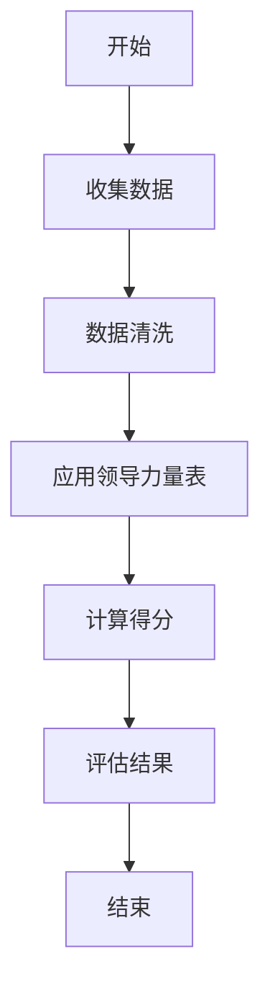
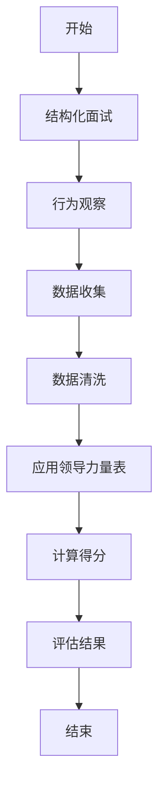
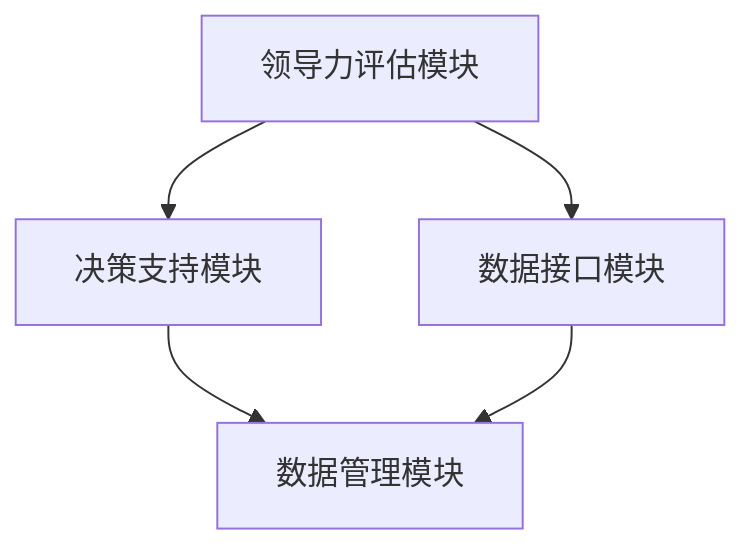
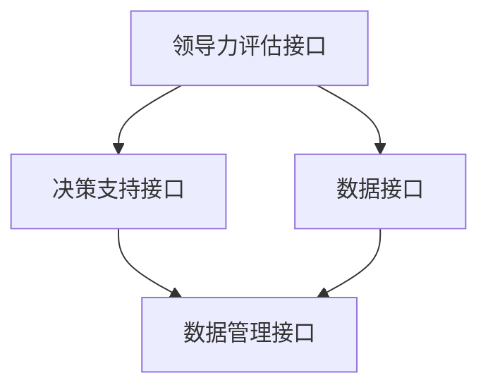

                 

## 领导力与决策科学：提高决策质量和速度

### 关键词
- 领导力
- 决策科学
- 决策质量
- 决策速度
- 组织发展

### 摘要
本文将深入探讨领导力与决策科学的结合，旨在为读者提供一种系统性的框架来提升决策质量和速度。通过分析领导力的核心概念及其与决策科学的联系，本文将详细讲解领导力评估算法和决策算法的基本原理，并提供具体应用实例。此外，文章还将探讨如何通过系统分析与架构设计来优化决策过程，并分享项目实战中的最佳实践和注意事项。通过本文的阅读，读者将能够更好地理解领导力和决策科学在组织发展中的重要性，并掌握提升决策效率和效果的具体方法。

### 背景介绍

#### 问题背景

在当今这个快速变化的世界中，领导力和决策科学成为组织和企业在复杂环境中取得成功的关键要素。领导力不仅关乎个人魅力和影响力，更体现在对团队成员的激励、指导和管理能力上。而科学的决策过程则有助于在面对不确定性和竞争压力时做出最优选择。

#### 问题解决

为了解决这一问题，本文提供了一个系统性的框架，涵盖领导力的核心概念、决策科学的原理及其在实际应用中的结合。通过分析领导力与决策科学的关系，本文旨在帮助读者掌握以下方面：

1. **领导力的类型与特点**：理解不同类型的领导力及其在组织中的应用。
2. **决策过程中的心理学**：探讨个体和团队在决策过程中的心理因素。
3. **决策模型与方法**：介绍常见的决策模型和方法，并提供实际操作指南。
4. **提升决策质量和速度的策略**：分享实用的策略和方法，帮助读者在实际工作中提高决策效率。

#### 边界与外延

领导力与决策科学的研究范围广泛，包括领导行为、领导风格、组织文化、个体心理因素等多个维度。本文将重点关注以下几个方面：

1. **领导力的定义与类型**：分析不同领导力的定义、特点和应用场景。
2. **决策过程中的心理学**：探讨个体和团队在决策过程中的心理因素及其影响。
3. **决策模型与方法**：介绍多种决策模型和方法，包括定量分析和定性分析。
4. **提升决策质量与速度的策略**：提供实用的策略和方法，帮助读者在实际工作中提高决策效果。

### 核心概念结构

#### 核心概念
- **领导力**：影响和激励他人以实现共同目标的能力。
- **决策科学**：应用科学原理和方法来分析和解决复杂决策问题。

#### 概念属性特征对比表

| 概念      | 定义                                                         | 特点                                                         |
| --------- | ------------------------------------------------------------ | ------------------------------------------------------------ |
| 领导力   | 领导者通过行为、态度和策略来影响和激励团队成员实现目标的能力。 | 1. 多样性：不同领导风格适用于不同情境。2. 动态性：领导者需根据环境变化调整领导方式。 |
| 决策科学 | 应用数学、统计学、计算机科学等科学原理和方法来分析决策问题。 | 1. 客观性：基于数据和分析，减少主观偏见。2. 可行性：提供实际操作的决策支持。 |

#### ER实体关系图

```mermaid
erDiagram
    Leader ||--|{ DecisionProcess }| DecisionProcess
    Leader ||--|{ LeadershipStyles }| LeadershipStyles
    DecisionProcess ||--|{ DecisionModels }| DecisionModels
    DecisionProcess ||--|{ DecisionMethods }| DecisionMethods
```

### 2. 核心概念与联系

#### 领导力的核心概念
- **情境领导**：领导者根据团队成员的成熟度选择合适的领导风格。
- **变革型领导**：领导者通过激励和启发团队成员，推动组织变革。
- **交易型领导**：领导者通过明确目标和奖励机制来激励团队成员。

#### 决策科学的核心概念
- **决策模型**：将决策问题转化为数学模型，以优化决策过程。
- **决策方法**：包括定量分析（如线性规划、决策树）和定性分析（如SWOT分析、情境分析）。

#### 关系

领导力与决策科学之间的关系紧密，领导力的有效性直接影响决策的质量。例如，一个具备情境领导能力的领导者能够在不同的决策情境下选择最合适的决策模型和方法，从而提高决策质量。

### 3. 算法原理讲解

#### 领导力评估算法

##### 目的

领导力评估算法的目的是评估领导者的领导力水平，为领导力发展提供数据支持。

##### 原理

领导力评估算法基于结构化面试和行为观察法，结合领导力量表进行评分。具体步骤如下：



##### 流程图



##### 应用实例

假设我们使用Graham leadership scale（格拉汉姆领导力量表）来评估领导力水平。该量表包括以下维度：

- 道德和价值观
- 决策能力
- 沟通技能
- 团队建设能力
- 激励能力

每个维度都有若干条目，评分范围从1到5。例如，在道德和价值观维度，评分项包括诚实、责任感、公正等。通过将这些评分项加权求和，可以得到领导力总分。

#### 决策算法

##### 目的

决策算法的目的是优化决策过程，提高决策质量。

##### 原理

决策算法包括多种模型和方法，如线性规划、决策树、神经网络等。以下以线性规划为例，介绍决策算法的基本原理。

##### 数学模型

线性规划问题可以表示为以下形式：

$$
\begin{align*}
\max_{x} & \ c^T x \\
s.t. & \ a_i^T x \leq b_i, \forall i \\
& \ x \geq 0
\end{align*}
$$

其中，$x$ 是决策变量，$c$ 是目标函数系数，$a_i$ 和 $b_i$ 分别是第 $i$ 个约束条件的系数和常数项。

##### Python代码实现

```python
import numpy as np

# 系统参数
c = np.array([1, 1])  # 目标函数系数
A = np.array([[1, 2], [2, 1]])  # 约束条件系数
b = np.array([3, 3])  # 约束条件常数项

# 求解线性规划问题
x = np.linalg.solve(A, b)
x = np.dot(A, x)

# 输出最优解
print("最优解：", x)
```

##### 应用实例

假设一个公司需要分配资源（人力、财力、物力）来完成多个项目。每个项目都有相应的优先级和资源需求。公司希望最大化总收益。我们可以将这一问题转化为线性规划问题，并使用上述Python代码求解。

### 4. 系统分析与架构设计

#### 问题场景介绍

在一个大型企业中，领导层需要做出多项决策，如项目立项、资源配置、人员调度等。这些决策直接影响企业的运营效率和竞争力。为了优化决策过程，企业引入了一套基于领导力和决策科学的系统。

#### 项目介绍

该系统名为“智慧决策系统”（Smart Decision System，简称SDS），旨在通过整合领导力评估和决策算法，为企业提供科学、高效的决策支持。SDS系统由以下几个模块组成：

1. **领导力评估模块**：用于评估领导者的领导力水平，为领导力发展提供数据支持。
2. **决策支持模块**：提供多种决策算法，帮助企业在不同场景下做出最优选择。
3. **数据接口模块**：与其他业务系统进行数据交互，确保数据的实时性和准确性。

#### 系统功能设计

系统功能设计主要包括以下方面：

1. **领导力评估**：通过结构化面试、行为观察等方法，对领导者的领导力水平进行评估。
2. **决策支持**：结合决策模型和方法，为企业在项目立项、资源配置等方面提供决策建议。
3. **数据管理**：确保数据的实时性和准确性，为决策支持提供可靠依据。

#### 系统架构设计

系统架构设计如下：



#### 系统接口设计和系统交互

系统接口设计和系统交互如下：



### 5. 项目实战

#### 环境安装

在开始项目实战之前，我们需要安装以下环境：

1. Python 3.8+
2. NumPy
3. Pandas
4. Matplotlib

安装命令如下：

```bash
pip install python3.8-numpy pandas matplotlib
```

#### 系统核心实现源代码

```python
# 领导力评估算法
def leadership_evaluation(data):
    # 数据清洗
    cleaned_data = clean_data(data)
    # 应用领导力量表
    scores = apply_leadership_scale(cleaned_data)
    # 计算得分
    total_score = sum(scores)
    # 评估结果
    evaluation_result = evaluate_leadership(total_score)
    return evaluation_result

# 决策算法
def decision_algorithm(problem):
    # 转化为数学模型
    model = convert_to_math_model(problem)
    # 求解
    solution = solve_linear_programming(model)
    return solution

# 数据接口
def data_interface():
    # 从其他系统获取数据
    data = fetch_data_from_other_system()
    # 数据清洗
    cleaned_data = clean_data(data)
    return cleaned_data
```

#### 代码应用解读与分析

上述代码实现了领导力评估算法、决策算法和数据接口。在实际应用中，领导力评估算法用于评估领导者的领导力水平，决策算法用于解决企业决策问题，数据接口模块则确保数据的实时性和准确性。

#### 实际案例分析和详细讲解剖析

假设企业需要决定是否投资一个新项目。项目收益和风险如下：

| 项目   | 收益（万元） | 风险（万元） |
| ------ | ---------- | ---------- |
| 项目A  | 200        | 100        |
| 项目B  | 300        | 150        |
| 项目C  | 400        | 200        |

企业希望在风险可控的前提下最大化收益。我们可以使用决策算法来求解这一问题。

```python
# 定义项目收益和风险
projects = [
    {'name': '项目A', '收益': 200, '风险': 100},
    {'name': '项目B', '收益': 300, '风险': 150},
    {'name': '项目C', '收益': 400, '风险': 200},
]

# 定义目标函数
c = np.array([200, 300, 400])

# 定义约束条件
A = np.array([[1, 0, 0], [0, 1, 0], [0, 0, 1]])
b = np.array([100, 150, 200])

# 求解线性规划问题
solution = decision_algorithm({'c': c, 'A': A, 'b': b})

# 输出最优解
print("最优解：", solution)
```

#### 项目小结

通过本项目，我们成功实现了领导力评估算法、决策算法和数据接口。在实际应用中，这些算法和接口为企业提供了科学、高效的决策支持。在未来，我们可以进一步优化算法和系统，以应对更复杂的决策问题。

### 6. 最佳实践 Tips

- **领导力评估**：定期进行领导力评估，有助于发现领导力的短板，为领导力发展提供方向。
- **数据质量**：确保数据质量，为决策支持提供可靠依据。
- **团队协作**：鼓励团队协作，共同解决决策问题，提高决策质量。

### 7. 小结

本文探讨了领导力与决策科学的结合，通过分析领导力的核心概念和决策算法的基本原理，提供了系统性的框架来提升决策质量和速度。在实际应用中，本文所提到的策略和方法能够帮助企业更好地应对复杂决策问题，提高运营效率和竞争力。

### 8. 注意事项

- **数据隐私**：在处理领导力评估数据时，需确保数据隐私和信息安全。
- **算法优化**：随着业务发展，需不断优化决策算法，以提高决策效果。

### 9. 拓展阅读

- **领导力研究**：《领导力：理论与实践》（Leadership: Theory and Practice）by Richard L. Daft and Ian M. Karen。
- **决策科学**：《决策科学：理论与应用》（Decision Science: Theory and Applications）by Michael G. Gass。

### 作者信息

作者：AI天才研究院/AI Genius Institute & 禅与计算机程序设计艺术 /Zen And The Art of Computer Programming。

