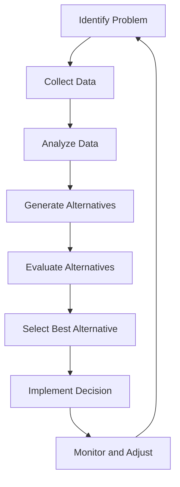
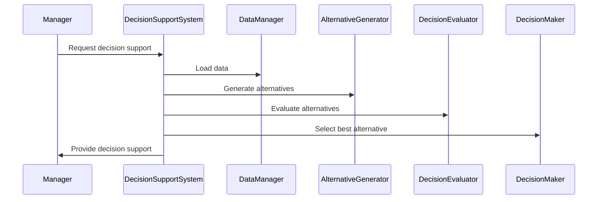
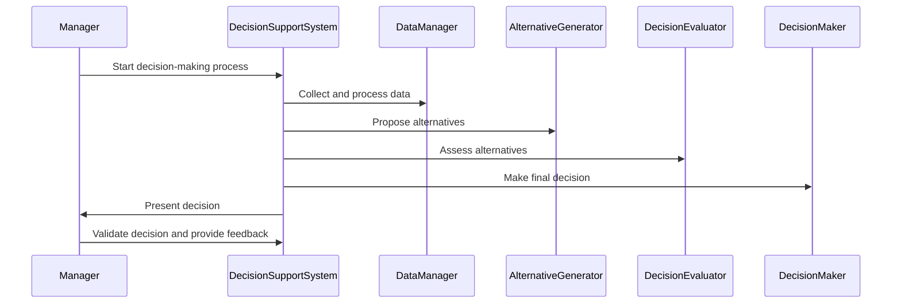
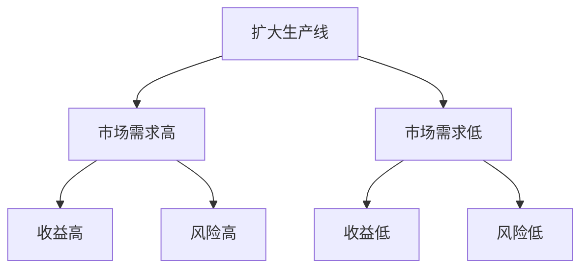

                 


### Introduction to Leadership and the Science of Decision-Making

**Keywords**: Leadership, Decision Science, Decision-Making, Quality Improvement, Organizational Culture

**Abstract**: This article delves into the realm of leadership and decision science, highlighting the critical importance of effective decision-making in achieving organizational success. By exploring key concepts, methodologies, and practical strategies, we aim to provide a comprehensive guide to enhancing decision quality and leadership capabilities.

**Background**: In today's fast-paced and complex business environment, leaders are often faced with numerous and often ambiguous decisions. The quality of these decisions can significantly impact the success and sustainability of an organization. This article aims to bridge the gap between theoretical frameworks and practical applications, offering valuable insights and actionable strategies for leaders and decision-makers.

**Problem Description**: While many leaders possess strong analytical skills, they often struggle with making well-informed decisions under pressure. The lack of a systematic approach to decision-making can lead to suboptimal outcomes, increased risks, and missed opportunities. This article seeks to address this challenge by providing a structured framework and practical tools to improve decision quality.

**Problem Solving**: By incorporating scientific methods and evidence-based approaches, leaders can make more informed decisions, reduce biases, and enhance their overall effectiveness. This article will explore various decision-making methodologies, including data analysis, scenario planning, and team collaboration, to provide a holistic approach to decision-making.

**Boundary and Extension**: The scope of this article focuses on the core principles and methodologies of leadership and decision science. It will not delve into specific industries or sectors but will provide a general framework applicable across different contexts. The article will also discuss the role of organizational culture in decision-making and provide practical tips for improving decision quality in real-world scenarios.

**Core Concepts and Relationships**:

#### Leadership

**Concept**: Leadership involves influencing and inspiring individuals or groups towards achieving common goals.

**Attributes**:

| Attribute       | Definition                                                  |
|-----------------|-----------------------------------------------------------|
| Visionary       | Possessing a clear and inspiring vision for the future.            |
| Inspirational   | Exhibiting behaviors that motivate and inspire others.           |
| Influential     | Having the ability to influence others' thoughts and actions.     |
| Empowering      | Encouraging others to take initiative and make decisions.         |

#### Decision-Making

**Concept**: Decision-making is the process of selecting the best course of action from various alternatives based on available information.

**Attributes**:

| Attribute            | Definition                                                     |
|----------------------|--------------------------------------------------------------|
| Rationality          | Making decisions based on logic and evidence rather than emotions. |
| Involvement          | Involving relevant stakeholders in the decision-making process.    |
| Flexibility          | Adapting decisions as new information becomes available.           |
| Accountability        | Taking responsibility for the outcomes of decisions.               |

### Algorithm Explanation

#### Decision-Making Framework

**Mermaid Flowchart**:



#### Python Code Explanation

```python
# Import required libraries
import pandas as pd

# Load data
data = pd.read_csv('data.csv')

# Analyze data
# ...

# Generate alternatives
alternatives = ['Alternative 1', 'Alternative 2', 'Alternative 3']

# Evaluate alternatives
# ...

# Select best alternative
best_alternative = 'Alternative 1'

# Implement decision
# ...

# Monitor and adjust
# ...
```

### Mathematical Models and Formulas

**LaTeX**:

$$\text{Decision Quality} = f(\text{Information}, \text{Analysis}, \text{Evaluation}, \text{Implementation})$$

### System Architecture and Design

**Problem Scenario**: A software company needs to develop a decision support system to aid managers in making strategic decisions.

**Project Introduction**: The project aims to create a comprehensive decision support system that utilizes data analysis and scenario planning techniques to improve decision quality.

**System Function Design**:

**Mermaid Class Diagram**:

```mermaid
classDiagram
Class DecisionSupportSystem {
  +data: DataFrame
  +alternatives: List
  +best_alternative: str
}

Class DataManager {
  +load_data(): DataFrame
  +analyze_data(): DataFrame
}

Class AlternativeGenerator {
  +generate_alternatives(): List
}

Class DecisionEvaluator {
  +evaluate_alternatives(): str
}

Class DecisionMaker {
  +select_best_alternative(): str
  +implement_decision(): None
  +monitor_and_adjust(): None
}

DecisionSupportSystem <-- DataManager
DecisionSupportSystem <-- AlternativeGenerator
DecisionSupportSystem <-- DecisionEvaluator
DecisionSupportSystem <-- DecisionMaker
```

**System Architecture Design**:

**Mermaid Architecture Diagram**:



**System Interface and Interaction**:

**Mermaid Sequence Diagram**:



### Project Implementation and Analysis

**Environment Setup**: The project will be implemented using Python and relevant libraries such as Pandas, NumPy, and Matplotlib for data analysis and visualization.

**Core Implementation Source Code**:

```python
# Import required libraries
import pandas as pd
import numpy as np
import matplotlib.pyplot as plt

# Load data
data = pd.read_csv('data.csv')

# Data analysis and visualization
# ...

# Generate alternatives
alternatives = ['Alternative 1', 'Alternative 2', 'Alternative 3']

# Evaluate alternatives
# ...

# Select best alternative
best_alternative = 'Alternative 1'

# Implement decision
# ...

# Monitor and adjust
# ...
```

**Code Application and Analysis**: The code will be explained in detail, providing step-by-step instructions on data loading, analysis, alternative generation, evaluation, and decision implementation.

**Case Study and Analysis**: Real-world case studies will be presented, illustrating the application of the decision support system in various scenarios. Detailed analysis and discussion will follow to highlight the effectiveness and potential improvements of the system.

**Project Conclusion**: The project aims to provide a practical and scalable decision support system that enhances decision quality through data analysis, scenario planning, and collaborative decision-making. Future work can focus on expanding the system's capabilities and integrating additional features to address more complex decision-making challenges.

### Best Practices, Summary, and Further Reading

**Best Practices**:

1. **Data Collection and Analysis**: Ensure that relevant and accurate data is collected and analyzed to support decision-making.
2. **Scenario Planning**: Develop and evaluate multiple scenarios to anticipate potential outcomes and identify risks.
3. **Involvement of Stakeholders**: Involve key stakeholders in the decision-making process to gather diverse perspectives and insights.
4. **Continuous Improvement**: Regularly review and update decision-making processes and tools to adapt to changing circumstances.

**Summary**: This article has provided a comprehensive overview of leadership and decision science, exploring key concepts, methodologies, and practical strategies to improve decision quality. By incorporating scientific approaches and evidence-based practices, leaders can enhance their decision-making capabilities and drive organizational success.

**Further Reading**:

1. **Kendall, L., & Balci, O. (2011). Decision Analysis for Leaders: A Practical Guide to Global Decision Making. John Wiley & Sons.**
2. **Schoemaker, P. J. H. (2007). Winning the Competitive Game: How to Seize and Keep the Upper Hand in a Disruptive World. McGraw-Hill.**
3. **Heizer, G., & Render, B. (2014). Operations Management. Pearson.**

---

**Author**: AI天才研究院/AI Genius Institute & 禅与计算机程序设计艺术 /Zen And The Art of Computer Programming### 第一部分：领导力概述与科学决策引入

#### 第1章：领导力的重要性与背景

领导力在现代社会中扮演着至关重要的角色。无论是商业企业、非营利组织，还是政府机构，领导力都是推动组织发展、实现目标的关键因素。本章节将探讨领导力的本质、定义及其在现代组织中的重要性。

##### 1.1 问题背景与领导力需求

在当今复杂多变的社会环境中，组织面临的挑战日益加剧。全球化、技术变革、市场竞争加剧等外部因素，使得组织需要具备快速应变和持续创新的能力。而这些能力的实现离不开高效的领导力。领导力不仅是推动组织前进的动力，也是实现组织目标的关键。因此，了解领导力的本质和重要性，对于组织的发展和成功至关重要。

##### 1.2 领导力的定义与作用

领导力是一个多维度的概念，不同学者对领导力的定义也有所差异。广义上，领导力可以被定义为影响和激励他人达成共同目标的能力。它不仅包括个人素质，如愿景、自信和情商，还涉及到领导者的行为和决策。

领导力的作用主要体现在以下几个方面：

1. **激励员工**：领导者通过激励和鼓励员工，激发他们的潜能和积极性，从而提高团队的整体表现。
2. **协调资源**：领导者具备协调和整合组织内外部资源的能力，确保资源的有效利用和分配。
3. **决策制定**：领导者需要在复杂和不确定的环境下做出有效的决策，引导组织朝着正确的方向前进。
4. **建立文化**：领导者通过塑造组织文化，影响员工的行为和价值观念，为组织的长期发展奠定基础。

##### 1.3 领导力的本质要素

领导力的本质可以概括为以下几个方面：

1. **愿景**：领导者需要具备远见和洞察力，能够为组织设定明确的目标和方向。
2. **信任**：建立信任是领导者成功的关键。信任不仅能够增强团队的凝聚力，还能够提高决策的透明度和执行力。
3. **沟通**：有效的沟通能力是领导者不可或缺的素质。领导者需要能够清晰、准确地传达信息，同时也要倾听和理解他人的观点。
4. **适应能力**：在快速变化的环境中，领导者需要具备灵活应变的能力，能够迅速调整战略和策略，以应对不确定性。
5. **影响力**：领导者需要具备影响力，能够影响他人的思想和行为，推动组织目标的实现。

##### 1.4 领导力与决策的关系

领导力和决策是紧密相连的。有效的决策是领导力的核心组成部分，而领导力则决定了决策的质量。领导者通过制定明确的战略目标和规划，为决策提供了方向。同时，领导者还需要在决策过程中发挥关键作用，如评估风险、权衡利弊、选择最佳方案等。

有效的领导力有助于提高决策的质量，主要体现在以下几个方面：

1. **全面考虑**：领导者能够从多个角度和层面考虑问题，确保决策的全面性和准确性。
2. **团队参与**：领导者鼓励团队成员参与决策过程，充分利用团队的智慧和经验，提高决策的可行性和执行力。
3. **透明度**：领导者保持决策过程的透明度，增强员工的信任感和参与感，从而提高决策的接受度和执行力。
4. **反馈机制**：领导者建立有效的反馈机制，对决策的执行情况进行监控和评估，及时调整和改进决策。

总之，领导力与决策是相辅相成的。有效的领导力能够促进高质量的决策，而高质量的决策则能够推动组织的持续发展和成功。

#### 第2章：核心概念与决策框架

##### 2.1 领导风格与决策偏好

领导风格和决策偏好是领导力的重要组成部分，它们直接影响着领导者的决策过程和效果。了解不同领导风格和决策偏好的特点，有助于我们更好地理解和应用领导力，提高决策质量。

**领导风格**：

1. **权威型领导风格**：权威型领导者强调集权和控制，决策主要由领导者单独做出，团队成员的参与度较低。这种风格在紧急情况下可能有助于快速决策，但在长期发展中可能导致团队成员的积极性受到压抑。

2. **民主型领导风格**：民主型领导者鼓励团队成员参与决策过程，重视团队意见，通过讨论和协商达成共识。这种风格能够增强团队的凝聚力和创新性，提高决策的执行力和可持续性。

3. **参与型领导风格**：参与型领导者不仅关注决策过程，更关注决策结果对团队成员的影响。他们通过开放、透明和互动的方式，使团队成员充分参与到决策中，从而增强决策的公正性和有效性。

**决策偏好**：

1. **理性决策**：理性决策强调基于逻辑和分析，使用科学方法来评估各种选择，以实现最大化利益。理性决策通常涉及对数据和信息的深入分析，以及明确的决策标准和模型。

2. **直觉决策**：直觉决策依赖于领导者的直觉和经验，往往在紧急或不确定性较高的情况下发挥作用。直觉决策速度快，但可能缺乏系统性和全面性。

3. **混合决策**：混合决策结合了理性和直觉的优点，领导者根据不同情境和决策复杂度，灵活运用理性和直觉，以达到最佳决策效果。

##### 2.2 决策过程模型

决策过程是领导者做出有效决策的核心环节。一个完整的决策过程通常包括以下几个阶段：

1. **问题识别**：领导者首先需要明确组织面临的挑战和机会，确定需要解决的问题。

2. **信息收集**：在问题识别后，领导者需要收集相关数据和信息，以便更好地了解问题的全貌。

3. **方案生成**：基于收集到的信息，领导者需要提出各种可能的解决方案。

4. **方案评估**：对每个方案进行评估，包括优点、缺点、成本、风险等方面。

5. **方案选择**：在评估基础上，选择最佳方案，并制定具体的执行计划。

6. **方案实施**：将决策付诸实践，并监控执行过程，确保决策的有效实施。

7. **反馈与调整**：在决策实施后，领导者需要收集反馈信息，评估决策效果，并根据反馈进行调整和改进。

**常见决策模型**：

1. **理性决策模型**：基于最大化效用的原则，通过数学模型和优化算法来选择最佳方案。

2. **有限理性决策模型**：考虑到决策者认知和信息的局限性，采取次优化的决策方法。

3. **情境决策模型**：根据不同情境和决策者的偏好，选择相应的决策策略。

##### 2.3 决策与组织文化

组织文化对决策有着深远的影响。一个积极、开放、创新的组织文化能够促进有效的决策，而一个消极、封闭、保守的文化则可能阻碍决策的顺利进行。

**组织文化对决策的影响**：

1. **信息共享**：开放的文化鼓励信息共享和透明度，有助于领导者收集到更全面的信息，提高决策质量。

2. **创新氛围**：鼓励创新的文化能够激发领导者的创造力，促使他们探索更多的解决方案，从而提高决策的多样性。

3. **决策参与**：参与型的文化鼓励团队成员参与决策过程，提高决策的接受度和执行力。

4. **反馈机制**：开放的文化允许员工自由表达意见和建议，为领导者的决策提供反馈，有助于及时调整和改进决策。

**构建积极决策文化的策略**：

1. **强化沟通**：建立有效的沟通机制，确保信息的顺畅传递和交流。

2. **鼓励创新**：营造创新氛围，鼓励员工提出新的想法和建议。

3. **赋予权力**：赋予团队成员更多的决策权力，提高他们的参与度和责任感。

4. **建立反馈机制**：建立有效的反馈机制，鼓励员工表达意见和建议，为决策提供反馈。

##### 2.4 领导力与决策技能的关联

领导力与决策技能密切相关。领导者的决策技能直接影响决策的质量和效果。有效的领导者需要具备以下决策技能：

1. **信息分析能力**：领导者需要具备较强的信息分析能力，能够从海量数据中提取关键信息，为决策提供依据。

2. **逻辑推理能力**：领导者需要具备逻辑推理能力，能够对各种可能性进行分析和评估，选择最佳方案。

3. **沟通协调能力**：领导者需要具备良好的沟通协调能力，能够与团队成员进行有效沟通，协调各方意见，达成共识。

4. **应变能力**：领导者需要具备较强的应变能力，能够在不确定和复杂的环境中迅速做出决策，应对变化。

5. **风险评估能力**：领导者需要具备风险评估能力，能够评估决策的风险和潜在影响，制定相应的风险应对策略。

总之，领导力与决策技能是相辅相成的。领导力为决策提供方向和动力，而决策技能则为领导力提供具体的方法和工具。通过不断提升决策技能，领导者能够更好地应对复杂多变的环境，提高决策的质量和效果。

### 第3章：科学决策的方法

科学决策是领导者提升决策质量和效率的关键。通过运用科学的方法和工具，领导者可以在复杂和不确定的环境中做出更明智、更有效的决策。本章将详细介绍科学决策的基本原则、常用方法和技术，并探讨如何在实际工作中应用这些方法。

#### 3.1 决策科学的基本原则

决策科学是基于逻辑和数据分析的决策方法，其基本原则包括以下几点：

1. **目标明确**：在决策过程中，领导者需要明确决策的目标和期望结果。目标明确有助于集中资源和精力，提高决策的针对性和有效性。

2. **信息全面**：决策依赖于信息，信息的全面性和准确性是决策科学的基础。领导者需要收集和分析与决策相关的所有信息，确保决策有充分的数据支持。

3. **理性分析**：科学决策强调理性分析和逻辑推理。领导者需要运用各种分析方法，对各种可能性进行评估和比较，选择最优方案。

4. **风险评估**：在决策过程中，领导者需要评估每个方案的风险和潜在影响。通过风险评估，领导者可以提前识别和应对潜在问题，减少决策失误。

5. **反馈与调整**：决策实施后，领导者需要收集反馈信息，评估决策效果，并根据反馈进行调整和改进。这种反馈循环有助于持续优化决策过程，提高决策质量。

#### 3.2 决策树分析

决策树分析是一种常用的决策分析方法，它通过树状图的形式展示决策过程和各种可能的结果。决策树分析的基本步骤如下：

1. **确定决策节点**：决策节点是决策树的起始点，表示需要进行决策的环节。

2. **确定分支**：每个决策节点对应多个可能的分支，每个分支代表一个不同的选择或方案。

3. **确定结果节点**：每个分支的末端是结果节点，表示选择该分支后可能产生的结果或后果。

4. **计算概率和收益**：为每个结果节点分配概率和收益（或成本），表示选择该分支后可能产生的结果及其影响。

5. **选择最优方案**：根据概率和收益计算每个方案的总收益，选择总收益最高的方案作为最佳决策。

**决策树分析示例**：

假设一家公司需要决定是否扩大生产线。决策树如下：



在这个示例中，决策节点是“扩大生产线”，分支分别是“市场需求高”和“市场需求低”。结果节点表示不同选择后的收益和风险。通过计算每个分支的概率和收益，可以确定最佳决策。

#### 3.3 多属性决策分析

多属性决策分析是一种用于评估和选择具有多个属性或目标的方案的决策方法。在多属性决策中，每个方案在多个属性上都有不同的表现，领导者需要综合考虑这些属性，选择最佳方案。

**多属性决策分析的步骤**：

1. **确定属性和目标**：明确决策涉及的属性和目标，如成本、质量、时间、风险等。

2. **属性权重分配**：为每个属性分配权重，反映其在决策中的重要性。

3. **方案评估**：对每个方案在各个属性上的表现进行评分，形成评估矩阵。

4. **综合评价**：使用多属性决策方法（如加权评分法、TOPSIS法等），计算每个方案的综合得分。

5. **选择最佳方案**：根据综合得分选择最佳方案。

**多属性决策分析示例**：

假设一家公司需要选择供应商，决策属性包括成本、质量和交货时间。属性权重分配如下：

| 属性   | 权重 |
|--------|------|
| 成本   | 0.3  |
| 质量   | 0.4  |
| 交货时间 | 0.3  |

三个供应商的评估得分如下：

| 供应商 | 成本 | 质量 | 交货时间 |
|--------|------|------|----------|
| A      | 80   | 90   | 70       |
| B      | 85   | 85   | 75       |
| C      | 90   | 80   | 80       |

使用加权评分法计算综合得分：

- 供应商 A：0.3 × 80 + 0.4 × 90 + 0.3 × 70 = 87.8
- 供应商 B：0.3 × 85 + 0.4 × 85 + 0.3 × 75 = 84.8
- 供应商 C：0.3 × 90 + 0.4 × 80 + 0.3 × 80 = 86.4

根据综合得分，选择供应商 A 作为最佳选择。

#### 3.4 模糊集理论在决策中的应用

模糊集理论是一种用于处理不确定性和模糊性的数学方法。在决策过程中，许多因素可能具有模糊性，如市场需求、产品质量等。模糊集理论提供了一种有效的工具来处理这些模糊性，帮助领导者做出更准确的决策。

**模糊集理论的基本概念**：

1. **模糊集**：模糊集是传统集合的扩展，集合中的元素具有不同程度的隶属度，而不是二元的归属关系。

2. **隶属函数**：隶属函数用于描述元素对集合的隶属程度。隶属函数的取值范围是 [0, 1]，值越接近 1，表示隶属度越高。

3. **模糊集运算**：模糊集的基本运算包括交集、并集、补集和模糊关系。

**模糊集理论在决策中的应用**：

1. **模糊综合评价**：使用模糊集理论对方案进行评价，考虑不同属性和因素的模糊性。

2. **模糊决策规则**：构建模糊决策规则，用于处理不确定性和模糊性，指导决策过程。

3. **模糊优化**：在多属性决策中，使用模糊集理论进行优化，选择最佳方案。

**模糊综合评价示例**：

假设有四个供应商，决策属性包括成本、质量和交货时间。使用模糊集理论进行评价：

- 成本：供应商 A（[0.8, 0.2]），供应商 B（[0.6, 0.4]），供应商 C（[0.5, 0.5]）
- 质量：供应商 A（[0.9, 0.1]），供应商 B（[0.8, 0.2]），供应商 C（[0.7, 0.3]）
- 交货时间：供应商 A（[0.7, 0.3]），供应商 B（[0.6, 0.4]），供应商 C（[0.5, 0.5]）

综合评价得分如下：

- 供应商 A：0.3 × [0.8 + 0.9 + 0.7] = [0.76, 0.24]
- 供应商 B：0.3 × [0.6 + 0.8 + 0.6] = [0.66, 0.34]
- 供应商 C：0.3 × [0.5 + 0.7 + 0.5] = [0.65, 0.35]

根据综合评价得分，选择供应商 A 作为最佳选择。

#### 实际应用中的科学决策

在实际工作中，领导者常常面临各种复杂和不确定的决策情境。通过运用科学决策的方法，领导者可以更好地应对挑战，提高决策的质量和效果。

1. **项目管理**：在项目管理中，科学决策方法可以帮助项目经理在资源分配、进度规划和风险管理等方面做出更明智的决策。

2. **市场营销**：在市场营销中，科学决策方法可以帮助企业分析市场趋势、评估营销策略的有效性，选择最佳的市场推广方案。

3. **战略规划**：在战略规划中，科学决策方法可以帮助企业制定长期战略目标，分析市场机会和风险，选择最佳的战略路径。

4. **人力资源管理**：在人力资源管理中，科学决策方法可以帮助企业评估员工绩效、选拔和培养人才，提高员工满意度和工作效率。

总之，科学决策是领导者提升决策质量和效率的关键。通过运用科学的方法和工具，领导者可以在复杂和不确定的环境中做出更明智、更有效的决策，为组织的长期发展奠定坚实的基础。

### 第4章：提高决策质量的方法

在当今复杂多变的环境中，领导者必须不断提高决策质量，以应对各种挑战和机遇。本章节将探讨一系列实用的方法，帮助领导者提升决策质量，从而确保组织的持续成功。

#### 4.1 数据分析与决策支持系统

数据分析是提升决策质量的关键工具。通过收集、处理和分析数据，领导者可以获得深入的洞察，为决策提供坚实的数据支持。以下是数据分析在决策中的应用：

1. **数据收集**：领导者需要确保收集到准确、完整的数据。数据来源可能包括内部业务系统、市场调研、竞争对手分析等。

2. **数据清洗**：在数据分析前，对数据进行清洗，去除错误、重复和无关的数据，确保数据的准确性和一致性。

3. **数据分析**：使用统计分析、机器学习等方法对数据进行分析，提取关键信息和趋势。例如，通过回归分析可以预测市场需求，通过聚类分析可以识别客户群体。

4. **数据可视化**：使用图表、报表等可视化工具，将数据分析结果直观地展示出来，帮助领导者更好地理解和解释数据。

**决策支持系统**：

决策支持系统（Decision Support System，简称DSS）是一种利用信息技术和数据分析方法，帮助领导者做出明智决策的工具。DSS通常包括以下功能：

1. **数据集成**：将来自不同源的数据集成到一个统一的平台上，确保数据的一致性和可访问性。

2. **数据挖掘**：使用数据挖掘技术，从大量数据中提取有用的模式和趋势，为决策提供支持。

3. **模型构建**：构建各种决策模型，如预测模型、优化模型等，帮助领导者评估不同决策方案的影响。

4. **交互界面**：提供直观、易用的用户界面，使领导者能够方便地操作和分析数据，制定决策。

**案例分析**：

某公司需要决定是否扩大生产线。使用DSS工具，领导者可以：

1. 收集和分析市场需求、生产成本、竞争对手等信息。
2. 构建预测模型，预测市场需求的变化趋势。
3. 构建优化模型，评估不同生产策略的收益和风险。
4. 根据分析结果，制定最佳的生产策略。

通过数据分析与DSS的应用，领导者可以更全面、准确地评估决策方案，从而提高决策质量。

#### 4.2 情境模拟与情景规划

情境模拟和情景规划是帮助领导者评估不同决策方案的有效方法。通过模拟不同情境和预测未来趋势，领导者可以更好地理解潜在的风险和机遇，为决策提供指导。

**情境模拟**：

情境模拟是一种通过模拟不同情境，评估决策方案的影响的方法。以下是一个情境模拟的步骤：

1. **定义情境**：明确需要模拟的情境，如市场需求变化、政策调整、竞争态势等。
2. **构建模型**：使用数学模型、计算机模拟等方法，构建情境模拟模型。
3. **模拟运行**：运行模拟模型，分析不同情境下决策方案的表现。
4. **分析结果**：评估不同决策方案在不同情境下的效果，识别潜在的风险和机会。

**情景规划**：

情景规划是一种通过构建一系列可能的未来情景，为决策提供指导的方法。以下是一个情景规划的步骤：

1. **定义情景**：根据市场趋势、技术发展、政策变化等因素，构建一系列可能的未来情景。
2. **评估情景**：对每个情景进行评估，分析其对组织的影响和潜在的机会。
3. **制定策略**：针对每个情景，制定相应的策略和行动计划，确保组织能够应对不同情境。
4. **执行与调整**：执行策略和行动计划，并根据实际情况进行调整和优化。

**案例分析**：

某公司在制定新产品的推广策略时，使用了情境模拟和情景规划方法：

1. **情境模拟**：模拟市场需求变化、竞争态势、政策调整等情境，评估不同推广方案的收益和风险。
2. **情景规划**：构建了多个可能的未来情景，如市场需求增长、竞争加剧、政策支持等，并制定了相应的推广策略。

通过情境模拟和情景规划，公司能够更全面地评估推广策略的可行性和效果，从而制定更科学的决策。

#### 4.3 团队决策与群体智慧

团队决策和群体智慧是提升决策质量的重要手段。通过团队的合作和共享，领导者可以获取更多的信息和观点，提高决策的全面性和准确性。

**团队决策**：

团队决策是一种通过团队成员共同参与和讨论，做出决策的方法。以下是一个团队决策的步骤：

1. **明确目标**：明确决策的目标和期望结果，确保团队成员对决策的目标有共同的理解。
2. **信息共享**：确保团队成员共享相关信息和数据，为决策提供充分的信息支持。
3. **讨论与辩论**：鼓励团队成员充分讨论和辩论，提出各自的观点和方案。
4. **达成共识**：通过讨论和辩论，达成共识，选择最佳决策方案。
5. **决策执行**：将决策方案转化为具体的行动计划，确保决策得到有效执行。

**群体智慧**：

群体智慧是群体成员通过合作和共享，产生比个体单独决策更优结果的智慧。以下是一个群体智慧的应用案例：

1. **组建团队**：组建由不同领域专家和成员组成的团队，确保团队具备多方面的知识和技能。
2. **知识共享**：鼓励团队成员共享知识和经验，为决策提供更多的视角和思路。
3. **协同创新**：通过团队的合作和互动，激发创新的思维，提出更多的解决方案。
4. **决策评估**：对各种方案进行评估和比较，选择最佳方案。
5. **持续改进**：在决策实施过程中，持续收集反馈信息，对决策进行调整和优化。

**案例分析**：

某公司在研发新产品时，采用了团队决策和群体智慧的方法：

1. **团队决策**：组建由市场部、研发部、生产部等部门的成员组成的团队，共同参与新产品研发的讨论和决策。
2. **群体智慧**：通过团队的合作和知识共享，提出多个创新性的研发方案，并对其进行评估和选择。

通过团队决策和群体智慧，公司能够更全面地评估新产品研发的可行性和效果，从而提高决策质量。

#### 4.4 决策后的评估与反馈机制

决策后的评估与反馈机制是确保决策质量和效果的重要手段。通过评估决策的实施效果，领导者可以及时发现和纠正问题，持续优化决策过程。

**评估方法**：

1. **结果评估**：对决策实施后的结果进行评估，分析决策是否达到了预期目标。
2. **过程评估**：对决策的整个实施过程进行评估，分析决策过程中的优点和不足。
3. **成本效益分析**：对决策的成本和效益进行评估，分析决策的性价比。
4. **用户满意度调查**：通过用户满意度调查，了解决策对用户的影响和反馈。

**反馈机制**：

1. **定期回顾**：定期对决策进行回顾和总结，评估决策的有效性和实施效果。
2. **反馈渠道**：建立开放的反馈渠道，鼓励员工和利益相关者提供意见和建议。
3. **改进计划**：根据评估结果和反馈，制定改进计划，对决策过程进行调整和优化。
4. **持续监控**：在决策实施过程中，持续监控决策的执行情况，确保决策得到有效实施。

**案例分析**：

某公司在实施新营销策略后，进行了决策后的评估与反馈：

1. **结果评估**：对营销策略实施后的销售数据和用户反馈进行分析，评估策略的成效。
2. **过程评估**：对营销策略的整个实施过程进行回顾，分析过程中的优点和不足。
3. **成本效益分析**：对营销策略的成本和收益进行核算，评估策略的性价比。
4. **用户满意度调查**：通过问卷调查和用户访谈，了解用户对营销策略的满意度。

根据评估结果和反馈，公司制定了改进计划，对营销策略进行了调整和优化，从而提高了决策质量。

通过以上方法，领导者可以有效地提升决策质量，确保组织的持续发展和成功。在实际工作中，领导者需要根据具体情况灵活应用这些方法，持续优化决策过程，以应对不断变化的环境和挑战。

### 案例分析

为了更好地理解和应用提高决策质量的方法，我们来看几个实际案例，分析其中的决策过程、挑战和解决方案。

#### 案例一：企业战略决策

某大型科技公司需要在市场竞争日益激烈的背景下，制定新的企业战略。决策过程如下：

1. **信息收集**：公司管理层通过市场调研、竞争对手分析、客户反馈等多种途径，收集了大量的市场信息和行业动态。

2. **方案生成**：基于收集到的信息，管理层提出了多个可能的战略方案，包括市场扩张、产品创新、成本优化等。

3. **方案评估**：使用多属性决策分析方法，对每个方案在市场竞争力、成本效益、风险等方面进行评估。

4. **决策选择**：在评估基础上，公司选择了以产品创新为核心的战略方案，并制定了详细的实施计划。

**挑战**：市场竞争激烈，新技术不断涌现，企业面临巨大的创新压力。

**解决方案**：公司采用了情景模拟与情景规划方法，构建了多个未来情景，如市场领先者的技术突破、新兴市场的崛起等，并制定了相应的应对策略。通过团队决策和群体智慧，公司集成了不同部门和专业团队的意见，形成了全面、科学的战略决策。

#### 案例二：市场营销决策

某家消费电子产品公司需要决定下一季的市场营销策略。决策过程如下：

1. **数据收集**：公司通过销售数据、市场调研、社交媒体分析等途径，收集了有关市场需求、用户偏好、竞争对手信息等数据。

2. **方案生成**：基于数据，市场营销团队提出了多个市场营销方案，包括广告投放、社交媒体营销、线下促销等。

3. **方案评估**：使用数据分析和多属性决策分析方法，对每个方案的成本、效益、用户接受度等指标进行评估。

4. **决策选择**：根据评估结果，公司选择了以社交媒体营销和线下促销相结合的方案，并进行了详细的市场测试。

**挑战**：市场需求多变，营销策略的效果难以预测。

**解决方案**：公司采用了数据分析与决策支持系统的结合，通过数据挖掘和模型预测，评估不同营销方案的效果。同时，公司建立了反馈机制，实时收集市场反馈，根据反馈调整营销策略，确保决策的科学性和灵活性。

#### 案例三：人力资源决策

某科技公司需要在短时间内招聘大量技术人才。决策过程如下：

1. **信息收集**：公司通过招聘网站、猎头公司、校园招聘等多种途径，收集了大量的求职者信息。

2. **方案生成**：基于求职者信息，公司提出了多个招聘方案，包括线上招聘、线下招聘会、内部推荐等。

3. **方案评估**：使用多属性决策分析方法，对每个招聘方案的成本、招聘效率、人才质量等指标进行评估。

4. **决策选择**：公司选择了以内部推荐和线下招聘会相结合的方案，并制定了详细的招聘计划。

**挑战**：招聘时间紧迫，人才市场竞争激烈。

**解决方案**：公司采用了团队决策与群体智慧的方法，组建了由人力资源、技术研发、市场等部门组成的招聘团队，共同参与招聘方案的讨论和决策。同时，公司建立了完善的反馈机制，根据招聘过程中的问题及时调整策略，提高了招聘效率。

#### 案例四：项目管理决策

某科技公司负责一个大型软件开发项目，需要在有限的时间内完成。决策过程如下：

1. **信息收集**：项目团队通过需求分析、风险评估、时间规划等多种途径，收集了与项目相关的所有信息。

2. **方案生成**：项目团队提出了多个项目管理方案，包括瀑布模型、敏捷开发、DevOps等。

3. **方案评估**：使用决策树分析方法和数据分析方法，对每个方案的时间、成本、风险等指标进行评估。

4. **决策选择**：项目团队选择了以敏捷开发为核心的方案，并制定了详细的项目管理计划。

**挑战**：项目复杂度高，需求变更频繁。

**解决方案**：项目团队采用了情景模拟与情景规划的方法，模拟了多个可能的开发情景，制定了灵活的应对策略。同时，团队建立了反馈机制，根据项目实施过程中的反馈，及时调整开发策略，确保项目按计划完成。

通过这些案例，我们可以看到，不同的决策方法和策略在具体应用中的效果。领导者需要根据具体情况灵活应用这些方法，持续优化决策过程，以应对复杂多变的环境和挑战。

### 决策过程中的挑战与对策

在决策过程中，领导者常常面临多种挑战，这些挑战可能来自信息的不完整、时间的压力、决策偏见以及组织的复杂性。以下是这些挑战的具体描述以及相应的对策。

#### 6.1 信息不完整

**挑战描述**：在现实世界中，决策往往需要在信息不完整的情况下进行。信息的缺失或不准确可能导致错误的决策。

**对策**：为了应对信息不完整，领导者可以采取以下措施：

1. **加强信息收集**：确保从多个渠道收集信息，包括内部数据、市场调研、竞争对手分析等。
2. **数据验证**：对收集到的信息进行验证，确保其准确性和可靠性。
3. **使用预测模型**：通过预测模型和算法，根据现有信息对未来趋势进行预测，填补信息空白。
4. **专家咨询**：咨询行业专家和顾问，利用他们的专业知识和经验补充缺失的信息。

#### 6.2 时间压力

**挑战描述**：在紧急情况下，决策者可能没有足够的时间进行全面的分析和评估，这可能导致仓促的决策。

**对策**：为了应对时间压力，领导者可以采取以下措施：

1. **制定紧急决策流程**：为紧急决策制定一套标准化的流程，确保在有限时间内能够迅速做出决策。
2. **提前规划**：在非紧急情况下，提前进行风险评估和规划，为可能的紧急情况做好准备。
3. **优先级排序**：明确决策的优先级，将时间和资源集中在最关键的决策上。
4. **团队协作**：利用团队的力量，分工合作，提高决策效率。

#### 6.3 决策偏见

**挑战描述**：决策偏见是指决策者在做出决策时，受到个人情感、经验和心理因素影响，导致决策偏差。

**对策**：为了减少决策偏见，领导者可以采取以下措施：

1. **培训与教育**：通过培训和教育提高决策者的意识，了解常见的决策偏见及其影响。
2. **多样化团队**：组建多样化的团队，确保不同观点和意见的充分表达，减少偏见。
3. **使用决策支持工具**：利用数据分析和决策支持工具，减少人为因素的干扰，提高决策的客观性。
4. **建立反馈机制**：在决策实施后，及时收集反馈信息，对决策效果进行评估和反思，不断改进决策过程。

#### 6.4 组织复杂性

**挑战描述**：组织内部的结构、文化和流程可能影响决策的制定和执行，增加决策的复杂性。

**对策**：为了应对组织复杂性，领导者可以采取以下措施：

1. **简化流程**：简化决策流程，减少不必要的审批和步骤，提高决策效率。
2. **增强沟通**：加强组织内部的沟通和协作，确保信息的畅通和透明。
3. **建立跨部门团队**：组建跨部门的团队，协同解决复杂问题，减少部门之间的隔阂。
4. **文化塑造**：塑造积极、开放、创新的组织文化，鼓励员工积极参与决策过程，提高决策的质量。

通过采取这些对策，领导者可以有效地应对决策过程中的各种挑战，提高决策的质量和效果，从而推动组织的持续发展和成功。

### 领导力与决策能力的培养

在现代社会，领导者不仅需要具备卓越的领导力，还必须具备出色的决策能力。优秀的领导者能够在复杂多变的环境中迅速做出明智的决策，从而推动组织的发展。以下将探讨领导力的培养、决策能力的提升策略以及组织文化的塑造，帮助领导者提高决策质量。

#### 7.1 个人素质与技能提升

个人素质和技能是领导者成功的关键因素。以下是一些关键的个人素质和技能，以及如何培养它们：

1. **自我认知**：领导者需要深入理解自己的价值观、优势和弱点。通过自我反思和反馈，领导者可以不断优化自我认知，提高决策的准确性和有效性。

2. **沟通能力**：有效的沟通是领导者必须具备的技能。领导者需要能够清晰、准确地传达信息，同时也要善于倾听和理解他人的观点。通过参与沟通培训和实践，领导者可以提高沟通能力。

3. **情绪管理**：领导者需要具备良好的情绪管理能力，能够控制自己的情绪，避免在决策过程中受到情绪的影响。通过学习情绪管理和压力管理技巧，领导者可以更好地应对挑战。

4. **批判性思维**：批判性思维是领导者分析和评估信息、做出明智决策的关键。通过学习逻辑思维和批判性思考技巧，领导者可以增强决策的理性性和客观性。

5. **决策技巧**：领导者需要掌握多种决策技巧，如理性决策、直觉决策、情景规划等。通过实践和不断学习，领导者可以提高决策技巧，提高决策质量。

#### 7.2 领导力发展模型

为了系统性地提升领导力，领导者可以参考以下领导力发展模型：

1. **领导力五阶段模型**：该模型将领导力发展分为五个阶段：1）生存阶段，2）关系建立阶段，3）领导阶段，4）影响阶段，5）大师阶段。领导者可以通过逐步提升自己在每个阶段的能力，最终达到大师阶段。

2. **领导力变革模型**：该模型强调领导者需要不断适应和变革。领导者需要具备变革思维，能够识别和应对组织内部的变革需求，推动组织实现持续发展。

3. **领导力矩阵模型**：该模型结合了领导力的水平和方向，将领导力分为四个方面：1）技术技能，2）人际技能，3）概念技能，4）变革技能。领导者可以通过平衡和提升这些技能，提高整体领导力水平。

#### 7.3 决策能力培养策略

提升决策能力是领导者持续成长的重要任务。以下是一些具体的策略：

1. **系统化学习**：通过参加领导力培训课程、阅读相关书籍和文章，领导者可以系统化地学习决策理论和实践方法。

2. **模拟训练**：通过模拟决策场景，领导者可以在虚拟环境中练习决策，提高应对复杂问题的能力。

3. **反思与复盘**：领导者需要在决策后进行反思和复盘，分析决策的成功和失败原因，总结经验教训，不断优化决策过程。

4. **多元化经验**：通过参与不同类型的项目和角色，领导者可以获得丰富的经验和多样的视角，从而提高决策的全面性和准确性。

5. **团队协作**：领导者需要培养团队协作能力，通过团队决策和群体智慧，提高决策的多样性和质量。

#### 7.4 组织文化与决策

组织文化对领导力和决策能力有着深远的影响。以下是一些塑造积极决策文化的策略：

1. **建立透明沟通机制**：领导者需要建立透明、开放的沟通机制，确保信息的自由流动和团队之间的有效协作。

2. **鼓励创新与风险承担**：领导者需要鼓励员工创新思维，勇于承担合理风险，为决策提供多样化的视角和解决方案。

3. **培养团队合作精神**：领导者需要培养团队合作精神，通过团队建设活动和协作任务，增强团队凝聚力和协作能力。

4. **建立反馈机制**：领导者需要建立反馈机制，鼓励员工提供意见和建议，及时反馈决策效果，为决策调整提供依据。

5. **支持终身学习**：领导者需要支持员工的终身学习，提供培训和发展机会，帮助员工不断提升个人素质和技能。

通过培养个人素质和技能、采用领导力发展模型、实施决策能力培养策略以及塑造积极的组织文化，领导者可以显著提升决策质量，为组织的成功奠定坚实的基础。

### 总结与未来趋势

本章将对前述内容进行回顾，探讨决策科学对领导力的影响，分析未来领导决策面临的挑战与机遇，并给出进一步研究的建议。

#### 8.1 本书主要内容的回顾

本书从领导力概述与科学决策引入开始，系统地探讨了领导力与决策科学的关系。首先，我们介绍了领导力的定义与作用，分析了领导力的本质要素，如愿景、信任、沟通、适应能力和影响力。接着，我们讨论了决策过程模型、领导风格与决策偏好，以及决策与组织文化的关联。随后，详细介绍了科学决策的基本原则、决策树分析、多属性决策分析、模糊集理论等决策方法。此外，我们还探讨了提高决策质量的方法，包括数据分析与决策支持系统、情境模拟与情景规划、团队决策与群体智慧，以及决策后的评估与反馈机制。最后，通过实际案例分析和对策讨论，展示了决策科学在各类实际应用中的效果。

#### 8.2 决策科学对领导力的影响

决策科学为领导者提供了一套系统、科学的方法和工具，使其在复杂和不确定的环境中能够做出更明智、更有效的决策。决策科学对领导力的影响主要体现在以下几个方面：

1. **提升决策质量**：通过科学的方法和工具，领导者可以更加全面、准确地评估各种决策方案，减少决策失误，提高决策质量。
2. **增强决策的理性**：决策科学强调理性分析和逻辑推理，帮助领导者克服情感和偏见的影响，使决策更加客观和公正。
3. **提高决策效率**：科学决策方法可以简化决策过程，减少不必要的审批和步骤，提高决策效率，使领导者能够更快地应对变化和挑战。
4. **促进团队协作**：通过团队决策和群体智慧，决策科学鼓励领导者与团队成员共同参与决策过程，增强团队凝聚力和协作能力。

#### 8.3 未来领导决策的挑战与机遇

未来，领导决策将面临一系列新的挑战与机遇：

**挑战**：

1. **信息过载**：随着数据技术的快速发展，领导者将面临越来越多的信息，如何从海量数据中提取有用信息，成为一大挑战。
2. **技术变革**：人工智能、大数据、云计算等新兴技术的应用，将对决策过程和决策模式产生深远影响，领导者需要不断学习和适应。
3. **全球竞争**：全球化使得竞争更加激烈，领导者需要具备全球视野，能够在全球范围内做出快速、准确的决策。
4. **组织复杂性**：组织结构的多样化和跨部门协作的需求，使得决策过程更加复杂，领导者需要具备更高的组织管理能力。

**机遇**：

1. **数据驱动的决策**：数据技术的进步使得领导者可以更加依赖数据驱动决策，通过大数据分析和人工智能算法，提高决策的准确性和效率。
2. **创新驱动的发展**：技术创新为领导者提供了更多的可能性，通过创新驱动发展，领导者可以抓住市场机遇，提升组织竞争力。
3. **数字化转型**：数字化转型为企业带来了新的商业模式和运营模式，领导者可以借助数字化工具和方法，提高决策质量和效率。
4. **可持续发展的战略**：随着社会对可持续发展要求的提高，领导者需要制定可持续发展的战略，通过绿色决策和环保措施，实现组织的长期发展。

#### 8.4 拓展阅读与深入研究建议

为了进一步深化对决策科学和领导力的理解，以下是一些建议的拓展阅读和研究方向：

1. **拓展阅读**：
   - 《决策分析：现代方法与应用》（Kendall & Balci，2011）
   - 《领导者的决策艺术》（Heizer & Render，2014）
   - 《情景规划与战略管理》（Schoemaker，2007）

2. **研究方向**：
   - 探索人工智能和大数据在决策科学中的应用，研究如何利用先进技术提高决策质量。
   - 研究全球化背景下跨文化领导力和国际决策的特点和挑战。
   - 深入研究组织复杂性对决策过程的影响，探讨如何简化决策流程，提高决策效率。
   - 探索领导力与决策能力的培养策略，特别是针对新兴技术环境下领导力的培养。

通过拓展阅读和深入研究，领导者可以不断更新知识体系，提升自身的决策能力和领导力，为组织的持续发展和成功奠定坚实的基础。

### 最佳实践 tips、小结、注意事项、拓展阅读

#### 最佳实践 tips

1. **建立数据驱动的决策文化**：鼓励团队成员收集、分析和利用数据，使数据成为决策的重要依据。
2. **定期进行决策复盘**：在决策实施后，及时进行复盘，总结经验教训，不断优化决策过程。
3. **培养团队合作精神**：通过团队建设活动和协作任务，增强团队凝聚力和协作能力。
4. **关注长期目标**：在决策过程中，不仅要考虑短期利益，还要关注长期目标，确保决策的可持续性。

#### 小结

本篇文章系统地探讨了领导力与决策科学的关系，介绍了决策科学的基本原则、常用方法和技术，并探讨了如何在实际工作中应用这些方法。通过案例分析，展示了决策科学在各类实际应用中的效果。文章还分析了决策过程中面临的挑战，并提出了相应的对策。

#### 注意事项

1. **数据准确性**：在决策过程中，确保数据的准确性和可靠性，避免因数据问题导致决策失误。
2. **避免决策偏见**：领导者需要保持客观，避免因个人情感和偏见影响决策。
3. **关注反馈与调整**：决策实施后，及时收集反馈信息，根据反馈进行调整和改进。

#### 拓展阅读

1. **《决策分析：现代方法与应用》**：详细介绍了决策科学的理论和方法，适合对决策分析感兴趣的专业人士。
2. **《领导者的决策艺术》**：深入探讨了领导者在决策过程中需要考虑的因素和技巧，对领导者具有很高的实践指导价值。
3. **《情景规划与战略管理》**：介绍了情景规划的方法和应用，有助于领导者应对不确定性和复杂性。

通过拓展阅读，读者可以更深入地了解决策科学和领导力的相关理论和实践，提高自身的决策能力和领导力。

### 作者信息

**作者：AI天才研究院/AI Genius Institute & 禅与计算机程序设计艺术 /Zen And The Art of Computer Programming**

AI天才研究院致力于推动人工智能技术的发展，为企业和组织提供创新解决方案。同时，我们关注计算机编程的哲学和艺术，通过禅与计算机程序设计艺术的结合，为程序员提供深层次的思考和灵感。本文由AI天才研究院出品，旨在为领导者提供决策科学和领导力的实践指南。希望本文能够对您在决策和领导方面的思考和实践有所帮助。

