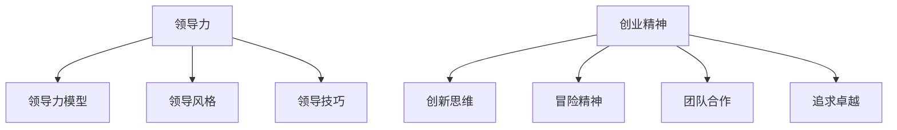

                 

### 文章标题

领导力与创业精神：激发团队的创业热情

### 关键词

领导力，创业精神，团队激励，创新能力，组织发展

### 摘要

本文深入探讨了领导力与创业精神在激发团队创业热情中的关键作用。通过分析领导力的核心概念、领导风格、领导技巧以及创业精神的本质，包括创新思维、冒险精神、团队合作和追求卓越，本文提出了一系列实践方法和策略，以帮助企业和组织在激烈的市场竞争中培养和激发团队的创业精神，实现持续发展。

## 第一部分：背景介绍

### 问题背景

在现代社会中，领导力和创业精神已经成为企业和组织中不可或缺的素质。领导力是指领导者通过有效的沟通、协调和管理，激发团队成员的潜力，实现组织目标的能力。创业精神则是指创新、冒险、团队合作和追求卓越的精神。这两者在企业发展过程中起着至关重要的作用，不仅能够推动企业的发展，还能够激发团队成员的工作热情，提高团队的凝聚力和战斗力。

### 问题描述

尽管领导力和创业精神的重要性已经被广泛认可，但许多企业和组织在实践过程中仍然面临诸多挑战。一方面，领导者缺乏有效的领导力技巧，无法有效地激发团队成员的潜力；另一方面，团队成员缺乏创业精神，缺乏创新和冒险的意识。这些问题严重影响了企业的发展速度和竞争力。

### 问题解决

为了解决这些问题，本文将从领导力和创业精神的本质出发，深入探讨如何激发团队的创业热情。首先，我们将介绍领导力的核心概念，包括领导力模型、领导风格和领导技巧等。通过这些内容的讲解，读者可以了解领导力的本质，学会如何运用领导力技巧来激发团队成员的潜力。

其次，我们将探讨创业精神的本质，包括创新思维、冒险精神和团队合作等。通过这些内容的讲解，读者可以了解创业精神的重要性，学会如何在工作中培养和激发团队的创业精神。

最后，我们将通过案例分析、实战演练和最佳实践等方式，提供实用的方法和技巧，帮助读者在实际工作中有效激发团队的创业热情。

### 边界与外延

领导力和创业精神不仅在企业中具有重要地位，在个人成长、团队建设和社会发展等方面也具有重要意义。因此，本文的讨论不仅限于企业内部，还将涉及到个人成长和团队建设等更广泛的领域。

## 核心概念

### 领导力

领导力是指领导者通过有效的沟通、协调和管理，激发团队成员的潜力，实现组织目标的能力。领导力包括以下几个方面：

1. **领导力模型**：领导力模型是用来描述领导者行为和特点的工具。常见的领导力模型包括领导生命周期理论、情境领导理论等。

2. **领导风格**：领导风格是指领导者处理问题和与团队成员互动的方式。常见的领导风格包括权威型领导、民主型领导和放任型领导等。

3. **领导技巧**：领导技巧是指领导者运用专业知识、沟通技巧和决策能力来解决问题、激励团队成员和实现组织目标的能力。

### 创业精神

创业精神是指创新、冒险、团队合作和追求卓越的精神。创业精神包括以下几个方面：

1. **创新思维**：创新思维是指通过创造性的思考方式，寻找新的解决方案，创造新的产品或服务。

2. **冒险精神**：冒险精神是指愿意承担风险，勇于尝试新事物，不畏困难和挑战。

3. **团队合作**：团队合作是指团队成员通过相互协作，共同实现组织目标。

4. **追求卓越**：追求卓越是指不断追求卓越，追求更高的目标，不断提升个人和团队的能力。

### 概念属性特征对比表格

| 概念   | 定义                                                         | 特点                                                     |
| ------ | ------------------------------------------------------------ | -------------------------------------------------------- |
| 领导力 | 领导者通过有效的沟通、协调和管理，激发团队成员的潜力，实现组织目标的能力 | 1. 模型多样化 2. 风格灵活 3. 技巧实用               |
| 创业精神 | 创新、冒险、团队合作和追求卓越的精神                         | 1. 创新驱动 2. 风险意识 3. 团队协作 4. 追求卓越 |

### ER实体关系图

## 第二部分：核心概念与联系

### 领导力的核心概念与联系

领导力是一个复杂的概念，涉及多个方面的核心要素。以下是领导力的核心概念及其相互联系：

1. **领导力模型**：领导力模型是用来描述领导者行为和特点的工具。常见的领导力模型包括领导生命周期理论、情境领导理论等。这些模型帮助我们理解在不同情境下如何调整领导行为，以达到最佳效果。

2. **领导风格**：领导风格是指领导者处理问题和与团队成员互动的方式。常见的领导风格包括权威型领导、民主型领导和放任型领导等。每种风格都有其适用的情境，领导者需要根据具体情况进行选择。

3. **领导技巧**：领导技巧是指领导者运用专业知识、沟通技巧和决策能力来解决问题、激励团队成员和实现组织目标的能力。这些技巧包括沟通技巧、激励技巧、决策技巧等，是领导力的具体体现。

### 创业精神的核心概念与联系

创业精神是企业发展和团队活力的重要推动力。以下是创业精神的核心概念及其相互联系：

1. **创新思维**：创新思维是指通过创造性的思考方式，寻找新的解决方案，创造新的产品或服务。创新思维是企业持续发展的关键，它推动企业在市场中保持竞争优势。

2. **冒险精神**：冒险精神是指愿意承担风险，勇于尝试新事物，不畏困难和挑战。冒险精神鼓励团队成员敢于突破传统，勇于尝试，为企业的创新和成长注入动力。

3. **团队合作**：团队合作是指团队成员通过相互协作，共同实现组织目标。团队合作是企业实现高效运营和卓越成果的基础，它要求团队成员具备协同工作的能力。

4. **追求卓越**：追求卓越是指不断追求卓越，追求更高的目标，不断提升个人和团队的能力。追求卓越是企业持续进步的动力，它促使企业和团队成员不断超越自我，追求更高的成就。

### 概念属性特征对比表格

| 概念   | 定义                                                         | 特点                                                     |
| ------ | ------------------------------------------------------------ | -------------------------------------------------------- |
| 领导力 | 领导者通过有效的沟通、协调和管理，激发团队成员的潜力，实现组织目标的能力 | 1. 模型多样化 2. 风格灵活 3. 技巧实用               |
| 创业精神 | 创新、冒险、团队合作和追求卓越的精神                         | 1. 创新驱动 2. 风险意识 3. 团队协作 4. 追求卓越 |

### ER实体关系图

## 第三部分：领导力的实践方法

### 领导力模型的实际应用

领导力模型是理解和管理团队的关键工具。在实际应用中，领导者需要根据不同情境选择合适的领导力模型。以下是一些常见的领导力模型及其应用场景：

1. **领导生命周期理论**：该理论认为，领导行为应根据团队成员的成熟度进行调整。领导者需要根据团队成员的能力和动机，从指导型领导（关注成员技能提升）转向支持型领导（关注成员情感需求），最终达到委托型领导（赋予成员自主权）。

2. **情境领导理论**：该理论强调领导者应根据团队成员的工作情境采取不同的领导风格。当团队成员处于低能力、低动机状态时，领导者应采取指导型领导；当团队成员处于高能力、低动机状态时，领导者应采取支持型领导；当团队成员处于高能力、高动机状态时，领导者应采取参与型领导。

### 领导风格的灵活运用

领导风格直接影响团队成员的工作状态和团队绩效。领导者应根据团队特点和任务要求，灵活运用不同的领导风格：

1. **权威型领导**：在紧急情况下或团队成员能力不足时，权威型领导能够迅速决策并确保任务完成。

2. **民主型领导**：在团队需要创新和协作时，民主型领导鼓励团队成员参与决策，提高团队凝聚力和创造力。

3. **放任型领导**：在团队成员能力较强且任务明确时，放任型领导能够给予团队成员更多的自主权，激发其潜能。

### 领导技巧的具体应用

领导技巧是领导者运用专业知识、沟通技巧和决策能力来解决问题、激励团队成员和实现组织目标的能力。以下是一些具体的领导技巧：

1. **沟通技巧**：良好的沟通技巧能够帮助领导者更好地理解团队成员的需求和意见，促进团队内部的和谐与合作。

2. **激励技巧**：通过奖励、认可和培训等方式，领导者可以激发团队成员的积极性和创造力。

3. **决策技巧**：领导者需要具备快速、准确和合理的决策能力，以应对各种复杂情况。

### 实际案例分析

以下是一个关于领导力实际应用的案例：

**案例背景**：某公司新上任的部门经理张先生，面临团队士气低落、工作效率不高的困境。经过调查，张先生发现团队成员普遍缺乏工作动力，且对工作任务理解不清。

**解决方案**：
1. **领导力模型**：张先生采用情境领导理论，根据团队成员的成熟度调整领导风格。对于能力较强但缺乏动力的成员，张先生采取支持型领导，鼓励他们参与决策并给予更多自主权。

2. **领导风格**：对于需要明确指导的任务，张先生采用权威型领导，确保团队成员理解任务目标和要求。

3. **领导技巧**：张先生通过定期召开团队会议，倾听团队成员的意见和建议，提高团队凝聚力。同时，他通过奖励机制激励团队成员，提高工作效率。

**结果**：经过一段时间的努力，团队士气得到显著提升，工作效率大幅提高，公司业绩也得到了明显改善。

### 实践方法总结

1. **了解团队成员**：领导者需要深入了解团队成员的能力、需求和动机，以便采取合适的领导策略。

2. **灵活运用领导风格**：根据不同情境和任务要求，灵活运用不同的领导风格，提高团队效能。

3. **持续学习和改进**：领导者需要不断学习新的领导知识和技能，并根据实际反馈进行调整和改进。

通过以上实践方法，领导者可以有效激发团队的创业热情，推动企业实现持续发展。

## 第四部分：创业精神的培养与激发

### 创新思维的培养

创新思维是创业精神的核心要素之一。以下是一些培养创新思维的方法：

1. **多样化思维方式**：领导者应鼓励团队成员运用不同的思维方式，如逻辑思维、批判性思维、创造性思维等，以产生多样化的创意。

2. **跨领域学习**：鼓励团队成员学习跨学科的知识，拓展思维视野，提高创新的能力。

3. **思维训练**：通过思维训练，如头脑风暴、思维导图、类比思维等，培养团队成员的创新思维能力。

### 冒险精神的激发

冒险精神是企业发展和团队突破的关键。以下是一些激发冒险精神的方法：

1. **风险管理**：领导者应制定合理的风险管理策略，鼓励团队成员在安全和可控的范围内尝试新事物。

2. **奖励机制**：建立奖励机制，对于敢于冒险并取得成功的团队成员给予奖励，激励更多人勇于尝试。

3. **文化塑造**：营造一个鼓励冒险、容忍失败的企业文化，让团队成员感受到冒险的价值和意义。

### 团队合作的强化

团队合作是创业精神的重要组成部分。以下是一些强化团队合作的方法：

1. **团队建设活动**：定期组织团队建设活动，增强团队成员之间的信任和合作。

2. **共同目标**：明确团队目标，确保团队成员在共同的目标下协同工作。

3. **沟通与反馈**：建立有效的沟通渠道，鼓励团队成员之间的交流和反馈，提高团队协作效率。

### 追求卓越的实践

追求卓越是推动企业不断进步的动力。以下是一些追求卓越的实践方法：

1. **持续学习**：鼓励团队成员不断学习新的知识和技能，提升个人和团队的竞争力。

2. **质量意识**：建立高质量意识，确保团队成员在每一个环节都追求卓越。

3. **绩效评估**：定期进行绩效评估，识别优秀团队和个人，推动整体绩效的提升。

### 实际案例分析

以下是一个关于创业精神实际应用的案例：

**案例背景**：某互联网公司新推出了一个创新项目，旨在通过人工智能技术改善在线教育体验。

**解决方案**：
1. **创新思维**：公司组织了多次头脑风暴会议，鼓励团队成员提出各种创新的想法，并从中筛选出可行性较高的方案。

2. **冒险精神**：公司建立了风险管理机制，确保团队成员在尝试新技术的过程中不会因失败而受到惩罚。

3. **团队合作**：公司定期组织团队建设活动，增强团队成员之间的信任和合作。

4. **追求卓越**：公司制定了严格的质量标准，要求团队成员在每一个环节都追求卓越。

**结果**：经过一段时间的努力，该创新项目取得了显著的成果，不仅提高了在线教育质量，还赢得了市场的高度认可。

### 实践方法总结

1. **培养创新思维**：通过多样化思维方式、跨领域学习和思维训练，培养团队成员的创新思维能力。

2. **激发冒险精神**：通过风险管理、奖励机制和文化塑造，激发团队成员的冒险精神。

3. **强化团队合作**：通过团队建设活动、共同目标和沟通与反馈，强化团队合作。

4. **追求卓越**：通过持续学习、质量意识和绩效评估，推动团队成员不断追求卓越。

通过以上实践方法，企业和组织可以有效地培养和激发团队的创业精神，实现持续发展和创新。

## 第五部分：案例分析

### 案例背景

某科技初创公司在激烈的市场竞争中，面临着技术迭代快、用户需求多变、团队内部缺乏凝聚力等挑战。为了保持竞争力并实现长期发展，公司决定通过培养领导力和创业精神来激发团队的创业热情。

### 解决方案

1. **领导力培养**：
   - **领导力模型**：公司引入了领导生命周期理论，根据团队成员的成熟度调整领导风格。对于技术熟练但缺乏动力的成员，采用支持型领导；对于新手成员，采用指导型领导。
   - **领导风格**：公司鼓励领导者在不同情境下灵活运用权威型、民主型和放任型领导风格，以适应不同任务的需求。
   - **领导技巧**：公司定期组织领导力培训，提升领导者的沟通、激励和决策能力。

2. **创业精神激发**：
   - **创新思维**：公司成立了创新实验室，鼓励团队成员跨部门合作，开展创新项目。
   - **冒险精神**：公司制定了宽容失败的政策，鼓励团队成员大胆尝试新技术和商业模式。
   - **团队合作**：公司定期组织团队建设活动，提高团队成员之间的信任和协作。
   - **追求卓越**：公司通过设立绩效奖励和晋升机制，激励团队成员追求卓越。

### 实施过程

1. **领导力培训**：公司邀请了业内知名的领导力培训师，为全体管理人员和核心团队成员进行培训。培训内容包括领导力模型、领导风格和领导技巧等。

2. **团队建设**：公司组织了多次团队建设活动，如拓展训练、团队游戏等，增强了团队成员之间的默契和信任。

3. **创新项目**：公司设立了创新基金，鼓励团队成员提出创新项目并进行试点。公司成立了专门的创新委员会，负责评估和监督创新项目的进展。

4. **绩效评估**：公司建立了严格的绩效评估体系，根据团队成员的创新成果、工作表现和团队合作情况，进行绩效评估和奖励。

### 结果与反馈

1. **团队凝聚力提升**：通过领导力和团队建设活动，团队成员之间的信任和协作显著增强，团队凝聚力得到了提升。

2. **创新成果显著**：多个创新项目取得了显著成果，部分项目甚至赢得了市场的认可。

3. **员工满意度提高**：员工对公司的认同感和归属感增强，员工满意度显著提高。

4. **公司业绩增长**：公司的业绩在短时间内实现了显著增长，市场竞争力得到了提升。

### 案例总结

通过培养领导力和激发创业精神，该公司成功地激发了团队的创业热情，提高了团队的凝聚力和创新能力，实现了业绩的快速增长。这一案例表明，领导力和创业精神在激发团队创业热情方面具有重要作用，值得其他企业和组织借鉴。

## 第六部分：最佳实践与未来展望

### 最佳实践

1. **领导力培养**：定期组织领导力培训，提高领导者的沟通、激励和决策能力。同时，鼓励领导者根据团队成员的成熟度灵活运用不同的领导风格。

2. **创业精神激发**：设立创新实验室和奖励机制，鼓励团队成员大胆尝试新技术和商业模式。建立宽容失败的文化，营造一个鼓励创新和冒险的环境。

3. **团队合作强化**：定期组织团队建设活动，增强团队成员之间的信任和协作。明确团队目标，确保团队成员在共同目标下协同工作。

4. **持续学习**：鼓励团队成员不断学习新的知识和技能，提升个人和团队的竞争力。建立知识共享平台，促进团队成员之间的知识交流和合作。

### 未来展望

1. **领导力与创业精神的融合**：未来，领导力和创业精神将更加紧密地融合，成为企业和组织核心竞争力的重要组成部分。

2. **数字化领导力**：随着数字化技术的发展，领导力培养和创业精神激发将更加依赖于数字化工具和平台，如在线培训、虚拟团队协作等。

3. **个性化领导力**：未来的领导力将更加注重个性化，根据不同团队成员的需求和特点，制定个性化的领导策略。

4. **全球化视野**：随着全球化的加速，企业和组织将更加注重培养具有全球化视野的领导者和创业者，以应对国际市场的挑战。

### 结语

领导力和创业精神是激发团队创业热情的关键因素。通过培养领导力和激发创业精神，企业和组织可以提升团队的凝聚力和创新能力，实现持续发展和竞争优势。在未来，我们将继续探索和实践领导力和创业精神的新方法，助力企业和组织的长远发展。

## 作者信息

作者：AI天才研究院/AI Genius Institute & 禅与计算机程序设计艺术 /Zen And The Art of Computer Programming

感谢您的阅读，希望本文对您在领导力和创业精神方面的理解和实践有所帮助。如果您有任何疑问或建议，欢迎在评论区留言，期待与您共同探讨。再次感谢您的关注和支持！

