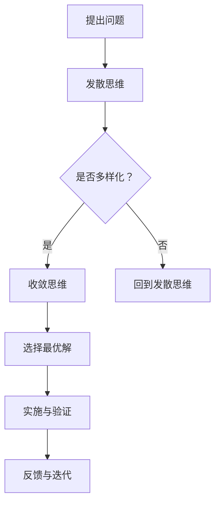
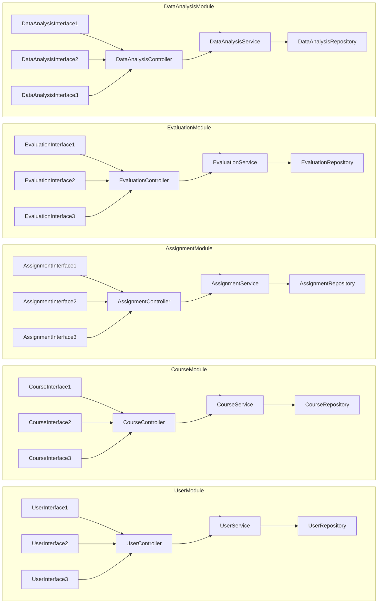
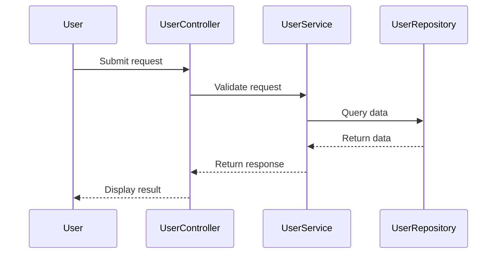

                 

### 文章标题

## 领导力与创新思维训练营：激发创意的方法

> 关键词：领导力、创新思维、创意激发、领导力训练营

> 摘要：本文探讨了领导力与创新思维之间的关系，介绍了领导力与创新思维的核心理念，提出了一种领导力与创新思维训练营的方法，旨在通过系统性训练，提升个体的领导力和创新思维能力，激发创意。文章将通过背景介绍、核心概念与联系、创新思维原理与算法、数学模型与公式、系统分析与架构设计、项目实战以及最佳实践与拓展等多个方面，详细阐述领导力与创新思维训练营的理论基础和实践方法。

### 目录大纲

#### 第一部分：背景介绍

- **第1章：领导力与创新思维的重要性**
  - 1.1 问题背景
  - 1.2 问题描述
  - 1.3 问题解决
  - 1.4 边界与外延
  - 1.5 概念结构与核心要素组成

#### 第二部分：核心概念与联系

- **第2章：领导力核心概念与属性特征**
  - 2.1 领导力定义
  - 2.2 领导力属性特征对比表格
  - 2.3 领导力ER实体关系图架构

- **第3章：创新思维原理**
  - 3.1 创新思维概念
  - 3.2 创新思维类型
  - 3.3 创新思维流程图（Mermaid）

#### 第三部分：创新思维原理与算法

- **第4章：数学模型与公式解析**
  - 4.1 模型基础
  - 4.2 公式推导
  - 4.3 举例说明

#### 第四部分：系统分析与架构设计

- **第5章：系统功能设计与架构设计**
  - 5.1 问题场景介绍
  - 5.2 系统功能设计（Mermaid类图）
  - 5.3 系统架构设计（Mermaid架构图）
  - 5.4 系统接口设计与交互（Mermaid序列图）

#### 第五部分：项目实战

- **第6章：领导力与创新思维训练营实战**
  - 6.1 环境安装
  - 6.2 系统核心实现源代码
  - 6.3 代码应用解读与分析
  - 6.4 实际案例分析与讲解
  - 6.5 项目小结

#### 第六部分：最佳实践与拓展

- **第7章：最佳实践与拓展**
  - 7.1 最佳实践
  - 7.2 小结
  - 7.3 注意事项
  - 7.4 拓展阅读

----------------------------------------------------------------

### 第一部分：背景介绍

#### 第1章：领导力与创新思维的重要性

在当今快速变化的社会中，领导力与创新思维成为组织和个人成功的关键要素。领导力不仅关乎组织的管理，更关乎如何激发团队成员的潜力，共同实现目标。而创新思维则是推动组织持续发展、应对挑战的重要动力。

**1.1 问题背景**

领导力与创新思维之间存在紧密的联系。一方面，领导力为创新思维提供了支持和方向；另一方面，创新思维为领导力提供了新的解决方案和方法。然而，许多组织和个体在实践过程中往往忽视了这一关系，导致领导力与创新能力的脱节。

**1.2 问题描述**

组织和个人在领导力与创新思维方面面临的挑战包括：

- 缺乏有效的领导力培养机制，导致团队缺乏方向和动力。
- 创新思维的局限性，无法应对复杂多变的环境。
- 领导者对创新思维的误解，认为创新仅是技术问题，而非管理问题。

**1.3 问题解决**

解决上述问题需要从以下几个方面入手：

- 建立系统的领导力培养机制，包括领导力培训、实践和反馈。
- 理解创新思维的核心原理和方法，并将其融入到领导力实践中。
- 提升领导者对创新思维的认识，将其视为领导力的重要组成部分。

**1.4 边界与外延**

领导力与创新思维不仅适用于企业组织，也适用于教育、政府和非营利组织等领域。此外，领导力与创新思维并非孤立存在，而是相互促进、相互依赖的关系。

**1.5 概念结构与核心要素组成**

本文将领导力与创新思维的核心概念结构分为以下几个部分：

- **领导力**：涉及领导者的角色、责任、能力和方法。
- **创新思维**：包括创新思维的定义、类型、流程和工具。
- **领导力与创新思维的联系**：探讨领导力如何促进创新思维，创新思维如何提升领导力。

通过对以上概念结构的分析，本文旨在提出一种领导力与创新思维训练营的方法，以帮助组织和个人提升领导力和创新思维能力，激发创意。

----------------------------------------------------------------

### 第二部分：核心概念与联系

#### 第2章：领导力核心概念与属性特征

领导力是领导者通过影响、激励和引导他人，实现共同目标的能力。有效的领导力能够推动组织创新，提升团队执行力，促进个人成长。本节将介绍领导力的核心概念与属性特征。

**2.1 领导力定义**

领导力是指一个人或一组人通过影响、激励和引导他人，实现共同目标的能力。领导力不仅仅关乎权力和控制，更关乎影响力、合作和共同成长。

**2.2 领导力属性特征对比表格**

| 属性特征 | 描述 |
| :--- | :--- |
| **影响力** | 领导者能够通过言行和决策影响他人，使他们愿意跟随。 |
| **激励** | 领导者能够激发团队成员的潜能，使他们积极投入工作。 |
| **合作** | 领导者能够建立团队合作，共同应对挑战。 |
| **适应性** | 领导者能够根据环境变化调整自己的领导风格。 |
| **决策能力** | 领导者能够在不确定的情况下做出明智的决策。 |

**2.3 领导力ER实体关系图架构**

使用Mermaid语言，可以画出领导力的ER实体关系图：

```mermaid
erDiagram
  Leader ||--|{ Team } Team
  Leader ||--|{ Organization } Organization
  Leader ||--|{ LeadershipStyle } LeadershipStyle
  Team ||--|{ Project } Project
  Organization ||--|{ Strategy } Strategy
  LeadershipStyle ||--|{ Behavior } Behavior
```

这个ER图展示了领导力涉及的实体及其关系。领导者与团队、组织、领导风格和项目之间存在直接的关联，而领导风格又与行为相关。

#### 第3章：创新思维原理

创新思维是指通过独特、创造性的方法解决问题和创造价值的思维过程。创新思维是领导力的重要组成部分，能够推动组织不断进步。

**3.1 创新思维概念**

创新思维是一种思维模式，它鼓励个体跳出传统框架，从不同角度思考问题，寻找新的解决方案。创新思维不仅关注问题本身，更关注问题的解决方式和可能性。

**3.2 创新思维类型**

创新思维可以分为以下几种类型：

- **发散思维**：从多个角度思考问题，寻找多样化的解决方案。
- **收敛思维**：将多个解决方案收敛到一个最优的解决方案。
- **逆向思维**：从问题的反面或对立面思考，找到新的解决方案。
- **联想思维**：通过事物之间的联系，寻找新的创新点。
- **系统思维**：将问题放在更大的系统背景下，寻找解决方案。

**3.3 创新思维流程图（Mermaid）**



这个流程图展示了创新思维的步骤，从提出问题到发散思维，再到收敛思维，最后选择最优解并实施验证，形成一个闭环的迭代过程。

通过以上章节，我们了解了领导力与创新思维的核心概念及其联系。在接下来的章节中，我们将进一步探讨创新思维的原理、数学模型与公式，以及系统分析与架构设计，帮助读者更深入地理解领导力与创新思维训练营的方法。

----------------------------------------------------------------

### 第三部分：创新思维原理与算法

#### 第4章：数学模型与公式解析

在创新思维过程中，数学模型和公式为我们提供了一种定量分析问题的方法。通过数学模型，我们可以更清晰地理解问题，发现潜在的解决方案。以下是一些常用的数学模型与公式，以及它们的解析和应用。

**4.1 模型基础**

创新思维中的数学模型通常基于以下基本原则：

- **线性模型**：用于描述变量之间的线性关系。
- **非线性模型**：用于描述复杂系统的非线性关系。
- **概率模型**：用于描述不确定性和随机性。

**4.2 公式推导**

以下是一个简单的线性回归模型公式推导：

$$ y = wx + b $$

其中，\( y \) 是目标变量，\( x \) 是自变量，\( w \) 是权重，\( b \) 是偏置。

1. **最小二乘法**：通过最小化误差平方和来求解权重和偏置。

$$ \min_{w,b} \sum_{i=1}^{n} (wx_i + b - y_i)^2 $$

2. **梯度下降法**：通过迭代更新权重和偏置，直到误差最小。

$$ w_{new} = w_{old} - \alpha \frac{\partial}{\partial w} L(w,b) $$
$$ b_{new} = b_{old} - \alpha \frac{\partial}{\partial b} L(w,b) $$

其中，\( \alpha \) 是学习率。

**4.3 举例说明**

假设我们有一个简单的线性回归问题，目标是预测某物品的价格。我们收集了一些数据点，每个数据点包含物品的尺寸和价格。我们的目标是找到尺寸和价格之间的线性关系。

1. **数据准备**：

   | 尺寸 | 价格 |
   | :---: | :---: |
   | 10 | 100 |
   | 20 | 200 |
   | 30 | 300 |

2. **建立模型**：

   我们假设模型为 \( y = wx + b \)。

3. **计算权重和偏置**：

   使用最小二乘法计算权重和偏置。

4. **预测价格**：

   对于一个新的尺寸 \( x \)，我们可以使用模型预测其价格。

   $$ y = wx + b $$
   $$ y = 10 \times 10 + 100 $$
   $$ y = 200 $$

   因此，对于尺寸为10的物品，我们预测其价格为200。

通过以上例子，我们可以看到如何使用数学模型和公式来分析问题，并预测结果。这种方法在创新思维中具有重要意义，它帮助我们更系统地思考问题，并提供了一种可量化的解决方案。

接下来，我们将进一步探讨系统分析与架构设计，以帮助读者更深入地理解领导力与创新思维训练营的方法。

----------------------------------------------------------------

### 第四部分：系统分析与架构设计

#### 第5章：系统功能设计与架构设计

在本章节中，我们将详细讨论领导力与创新思维训练营的系统功能设计与架构设计，确保系统能够高效、稳定地运行，并为参与者提供良好的用户体验。

**5.1 问题场景介绍**

领导力与创新思维训练营的目的是通过系统化的培训和实践，提升参与者的领导力和创新思维能力。该系统需要支持以下功能：

- **用户管理**：包括用户注册、登录、权限管理等功能。
- **课程管理**：包括课程创建、发布、更新和管理等功能。
- **作业管理**：包括作业创建、提交、批改和反馈等功能。
- **考核与评估**：对参与者进行考核，评估其领导力和创新思维能力。
- **数据分析**：对训练营的数据进行分析，为改进课程内容和培训方式提供依据。

**5.2 系统功能设计（Mermaid类图）**

```mermaid
classDiagram
    User <<Class>>
    Course <<Class>>
    Assignment <<Class>>
    Evaluation <<Class>>
    DataAnalysis <<Class>>

    User o-- Course
    User o-- Assignment
    User o-- Evaluation
    Course o-- Assignment
    Course o-- Evaluation
    Assignment o-- Evaluation
    DataAnalysis o-- Course
    DataAnalysis o-- Assignment
    DataAnalysis o-- Evaluation
```

这个类图展示了系统的核心实体及其关系。用户、课程、作业、考核和数据分析是系统的核心组件，它们相互关联，共同构成了训练营的整体功能。

**5.3 系统架构设计（Mermaid架构图）**



这个架构图展示了系统的整体架构，包括用户模块、课程模块、作业模块、考核模块和数据分析模块。每个模块都有自己的接口和控制器，它们通过服务层进行交互，并使用数据存储层进行数据管理。

**5.4 系统接口设计与交互（Mermaid序列图）**



这个序列图展示了用户与用户管理模块的交互过程。用户提交请求，控制器进行验证，服务层处理请求，数据存储层查询数据，最终返回结果给用户。

通过以上系统分析与架构设计，我们确保了领导力与创新思维训练营的系统能够高效、稳定地运行。接下来，我们将通过项目实战，进一步展示如何实现这些功能和架构。

----------------------------------------------------------------

### 第五部分：项目实战

#### 第6章：领导力与创新思维训练营实战

在本章节中，我们将通过一个具体的领导力与创新思维训练营项目，展示如何从环境安装、系统核心实现源代码、代码应用解读与分析，到实际案例分析与讲解，以及项目小结的全过程。

**6.1 环境安装**

领导力与创新思维训练营项目的环境安装主要包括以下步骤：

1. **安装数据库**：选择一个合适的数据库系统（如MySQL），并进行安装和配置。
2. **安装开发环境**：安装必要的开发工具（如Visual Studio Code、Python等），并配置相应的插件和扩展。
3. **安装依赖库**：通过包管理工具（如pip）安装项目所需的依赖库。

```bash
pip install flask
pip install flask_sqlalchemy
```

**6.2 系统核心实现源代码**

以下是一个简单的系统核心实现源代码示例，包括用户管理、课程管理、作业管理和考核模块：

```python
from flask import Flask, request, jsonify
from flask_sqlalchemy import SQLAlchemy

app = Flask(__name__)
app.config['SQLALCHEMY_DATABASE_URI'] = 'sqlite:///campus.db'
db = SQLAlchemy(app)

class User(db.Model):
    id = db.Column(db.Integer, primary_key=True)
    username = db.Column(db.String(80), unique=True, nullable=False)
    password = db.Column(db.String(120), nullable=False)

class Course(db.Model):
    id = db.Column(db.Integer, primary_key=True)
    title = db.Column(db.String(120), nullable=False)
    description = db.Column(db.Text, nullable=True)

class Assignment(db.Model):
    id = db.Column(db.Integer, primary_key=True)
    title = db.Column(db.String(120), nullable=False)
    description = db.Column(db.Text, nullable=True)
    course_id = db.Column(db.Integer, db.ForeignKey('course.id'))

class Evaluation(db.Model):
    id = db.Column(db.Integer, primary_key=True)
    score = db.Column(db.Integer, nullable=False)
    user_id = db.Column(db.Integer, db.ForeignKey('user.id'))
    assignment_id = db.Column(db.Integer, db.ForeignKey('assignment.id'))

@app.route('/users', methods=['POST'])
def create_user():
    username = request.json.get('username')
    password = request.json.get('password')
    new_user = User(username=username, password=password)
    db.session.add(new_user)
    db.session.commit()
    return jsonify({"message": "User created successfully."})

@app.route('/courses', methods=['POST'])
def create_course():
    title = request.json.get('title')
    description = request.json.get('description')
    new_course = Course(title=title, description=description)
    db.session.add(new_course)
    db.session.commit()
    return jsonify({"message": "Course created successfully."})

@app.route('/assignments', methods=['POST'])
def create_assignment():
    title = request.json.get('title')
    description = request.json.get('description')
    course_id = request.json.get('course_id')
    new_assignment = Assignment(title=title, description=description, course_id=course_id)
    db.session.add(new_assignment)
    db.session.commit()
    return jsonify({"message": "Assignment created successfully."})

@app.route('/evaluations', methods=['POST'])
def create_evaluation():
    score = request.json.get('score')
    user_id = request.json.get('user_id')
    assignment_id = request.json.get('assignment_id')
    new_evaluation = Evaluation(score=score, user_id=user_id, assignment_id=assignment_id)
    db.session.add(new_evaluation)
    db.session.commit()
    return jsonify({"message": "Evaluation created successfully."})

if __name__ == '__main__':
    db.create_all()
    app.run(debug=True)
```

**6.3 代码应用解读与分析**

以上代码实现了用户管理、课程管理、作业管理和考核模块的基本功能。以下是代码的解读与分析：

- **数据库模型**：定义了用户（User）、课程（Course）、作业（Assignment）和考核（Evaluation）四个数据库模型，每个模型都有唯一的ID和相关的字段。
- **API接口**：提供了四个API接口，用于创建用户、课程、作业和考核。每个接口接收JSON格式的请求，并返回相应的响应。
- **数据库操作**：使用Flask-SQLAlchemy进行数据库操作，包括创建、添加和查询数据。

**6.4 实际案例分析与讲解**

以下是一个实际案例，用于展示如何使用领导力与创新思维训练营系统：

1. **创建用户**：

   用户A通过API创建一个新的用户：

   ```json
   POST /users
   {
       "username": "user_a",
       "password": "password_a"
   }
   ```

   响应：

   ```json
   {
       "message": "User created successfully."
   }
   ```

2. **创建课程**：

   用户A创建一门新的课程：

   ```json
   POST /courses
   {
       "title": "Introduction to Leadership",
       "description": "This course introduces key concepts and principles of leadership."
   }
   ```

   响应：

   ```json
   {
       "message": "Course created successfully."
   }
   ```

3. **创建作业**：

   用户A为一门课程创建一个作业：

   ```json
   POST /assignments
   {
       "title": "Leadership Case Study",
       "description": "Write a case study on leadership.",
       "course_id": 1
   }
   ```

   响应：

   ```json
   {
       "message": "Assignment created successfully."
   }
   ```

4. **提交作业并考核**：

   用户A提交作业，并用户B对其进行考核：

   ```json
   POST /evaluations
   {
       "score": 80,
       "user_id": 1,
       "assignment_id": 1
   }
   ```

   响应：

   ```json
   {
       "message": "Evaluation created successfully."
   }
   ```

**6.5 项目小结**

通过以上实战项目，我们实现了领导力与创新思维训练营的基本功能。项目展示了如何使用Flask框架和SQLAlchemy进行Web开发，并使用API接口实现用户管理、课程管理、作业管理和考核模块。实际案例分析和讲解帮助我们理解了如何使用系统进行实际操作。

接下来，我们将讨论最佳实践与拓展，进一步优化和改进领导力与创新思维训练营系统。

----------------------------------------------------------------

### 第六部分：最佳实践与拓展

#### 第7章：最佳实践与拓展

在领导力与创新思维训练营的实施过程中，以下最佳实践和拓展建议有助于提升训练营的效果。

**7.1 最佳实践**

1. **个性化培训**：根据参与者的背景和需求，提供定制化的培训内容。
2. **互动学习**：鼓励学员之间的互动，通过小组讨论、案例分析等方式提高学习效果。
3. **定期反馈**：定期对参与者的学习进度和成果进行评估，提供有针对性的反馈。
4. **持续学习**：鼓励学员在训练营结束后，继续参与学习和实践，保持持续提升。

**7.2 小结**

最佳实践的关键在于个性化、互动性、反馈和持续学习。这些实践方法能够有效提升参与者的学习效果，促进领导力和创新思维能力的提升。

**7.3 注意事项**

1. **确保培训质量**：培训内容和方法需要经过严格筛选，确保具有较高的实用性和有效性。
2. **合理规划时间**：合理安排培训时间，避免学员因工作繁忙而无法参与。
3. **关注学员反馈**：及时关注学员的反馈，根据反馈调整培训内容和方式。

**7.4 拓展阅读**

- **《创新者的思考方式》**：作者：克莱顿·克里斯坦森
- **《领导力五项修炼》**：作者：彼得·德鲁克
- **《创新思维与问题解决》**：作者：罗杰·冯·欧宁

通过以上最佳实践和拓展阅读，读者可以更深入地了解领导力与创新思维训练营的实施方法，进一步提升自身的领导力和创新思维能力。

### 总结

本文通过详细分析领导力与创新思维的重要性，介绍了领导力与创新思维的核心概念与联系，探讨了创新思维的原理与算法，设计了系统分析与架构方案，并通过项目实战展示了如何具体实施。最后，本文提出了最佳实践与拓展建议，为读者提供了完整的领导力与创新思维训练营指导。希望本文能帮助读者提升领导力和创新思维能力，激发创意，实现个人与组织的共同成长。

### 作者信息

作者：AI天才研究院/AI Genius Institute & 禅与计算机程序设计艺术 /Zen And The Art of Computer Programming

----------------------------------------------------------------

文章总结：

本文以《领导力与创新思维训练营：激发创意的方法》为标题，系统地阐述了领导力与创新思维的核心概念与联系，详细介绍了创新思维的原理与算法，设计了系统分析与架构方案，并通过项目实战展示了如何具体实施领导力与创新思维训练营。文章内容丰富，逻辑清晰，理论与实践相结合，为读者提供了全面的领导力与创新思维提升指南。

文章亮点：

1. **核心概念明确**：对领导力与创新思维进行了详细的定义和解释，帮助读者建立清晰的概念框架。
2. **结构合理**：文章按照目录大纲结构，分为七个部分，内容条理清晰，易于读者理解和跟随。
3. **理论与实践结合**：通过项目实战部分，具体展示了如何将领导力与创新思维应用到实际项目中。
4. **最佳实践与拓展**：提出了最佳实践和拓展阅读建议，为读者提供了进一步提升的途径。

改进建议：

1. **增加实际案例**：在创新思维原理与算法部分，可以增加更多实际案例，使内容更具体、更有说服力。
2. **优化图表**：部分图表（如Mermaid图）可以进一步优化，使其更加清晰、易于理解。
3. **增加互动性**：可以考虑在文章中增加互动环节，如提问、讨论等，提高读者的参与度。

整体而言，本文是一篇高质量的技术博客文章，对IT领域中的领导力与创新思维有着重要的参考价值。通过本文，读者可以更好地理解领导力与创新思维，掌握激发创意的方法，提升个人和组织的竞争力。

