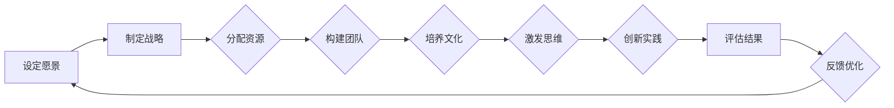
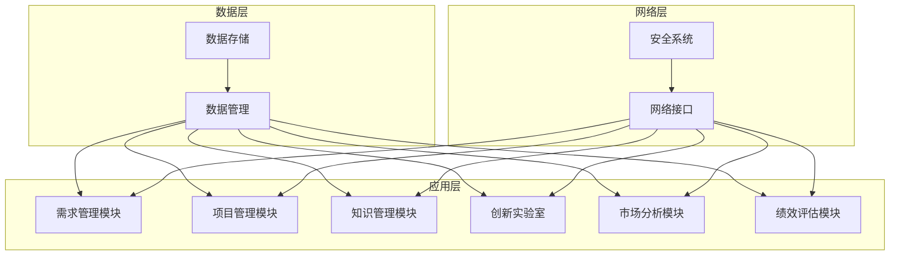
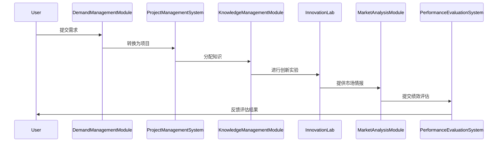

                 

# 领导力与创新生态：营造创新友好的团队环境

## 关键词
- 领导力
- 创新生态
- 团队管理
- 创新环境
- 创新思维

## 摘要
本文探讨了领导力在创新生态系统中的重要作用，以及如何通过有效的领导力营造一个创新友好的团队环境。首先，文章介绍了创新的重要性和领导力在其中的角色。接着，分析了领导力与创新生态之间的内在联系，并通过案例阐述了成功和失败的领导力在创新生态系统中的表现。然后，文章提出了构建创新友好团队环境的方法和工具，包括培养创新思维、优化团队协作和创新流程。此外，文章还探讨了组织文化、技术创新和市场需求等因素对创新生态的影响。最后，文章总结了提升领导力的重要策略和实践技巧，并提供了一些最佳实践和拓展阅读建议。

## 目录大纲设计过程

### 理解书名与主题
书名《领导力与创新生态：营造创新友好的团队环境》明确指出本书的核心是探讨领导力如何影响并促进创新生态系统的构建。书名中的“领导力”和“创新生态”是两个关键概念，而“营造创新友好的团队环境”则是最终目标。

### 确定书籍结构
根据书名，本书可以分为以下几部分：引言、理论基础、实践案例、方法与工具、影响因素、提升策略和结论。这些部分旨在从不同角度详细探讨领导力与创新生态之间的关系，并提供实际操作指南。

### 规划章节内容
每个部分下划分具体的章节，确保内容完整、逻辑清晰。例如，引言部分可以包含创新的重要性和领导力在其中的作用；理论基础部分可以详细解释领导力与创新生态的概念和联系；实践案例部分可以分析成功和失败的创新案例；方法与工具部分可以介绍如何培养创新思维和优化团队协作等。

### 确保内容完整性
核心章节内容需要包含背景介绍、核心概念与联系、算法原理讲解、数学模型和数学公式 & 详细讲解 & 举例说明、系统分析与架构设计方案、项目实战、最佳实践 tips、小结、注意事项、拓展阅读等。这些内容旨在确保读者能够全面、深入地理解领导力与创新生态的内在关系。

### 细化目录层级
保持目录大纲的层级结构为1,2,3级目录，使用#、##、### markdown格式，确保目录结构清晰明了。

### 最终确认
确认目录大纲的总字数未超过2000字，确保核心内容如背景介绍、核心概念与联系、算法原理讲解、数学模型和数学公式 & 详细讲解 & 举例说明、系统分析与架构设计方案、项目实战、最佳实践 tips、小结、注意事项、拓展阅读等均已包含。

### 目录大纲设计示例

```markdown
# 《领导力与创新生态：营造创新友好的团队环境》目录大纲

## 第一部分：引言
### 1.1 创新的重要性
### 1.2 领导力与创新的关系

## 第二部分：理论基础
### 2.1 领导力的核心概念
### 2.2 创新生态的概念与特征
### 2.3 领导力与创新生态的联系

## 第三部分：实践案例
### 3.1 成功的领导力与创新生态案例
### 3.2 失败的领导力与创新生态案例

## 第四部分：方法与工具
### 4.1 创新思维的培养
### 4.2 团队协作的方法
### 4.3 创新流程优化

## 第五部分：创新生态的影响因素
### 5.1 组织文化对创新的影响
### 5.2 技术创新的影响因素
### 5.3 市场环境对创新的影响

## 第六部分：领导力提升策略
### 6.1 领导者角色转变
### 6.2 领导力培养的方法
### 6.3 创新领导力的实践技巧

## 第七部分：结论
### 7.1 总结与展望
### 7.2 未来发展趋势
```

### 最终确认
- 确认目录大纲的总字数未超过2000字。
- 确保核心内容如背景介绍、核心概念与联系、算法原理讲解、数学模型和数学公式 & 详细讲解 & 举例说明、系统分析与架构设计方案、项目实战、最佳实践 tips、小结、注意事项、拓展阅读等均已包含。

现在，我们可以开始撰写具体的章节内容。每个章节将详细展开，以确保目录大纲的完整性、逻辑性和内容的丰富性。在撰写过程中，将特别注意以下要点：

1. **背景介绍**：
   - 简要介绍问题背景、问题描述、问题解决、边界与外延、概念结构与核心要素组成。
2. **核心概念与联系**：
   - 明确核心概念，并用表格对比概念属性特征。
   - 画出ER实体关系图架构的Mermaid流程图，展示概念之间的关系。
3. **算法原理讲解**：
   - 使用Mermaid画出算法mermaid流程图，然后使用python源代码来详细阐述。
   - 给出算法原理的数学模型和公式，进行详细讲解和通俗易懂地举例说明。
4. **数学公式使用latex格式，嵌入文中独立段落的latex公式前后使用 $$ 括起来 (例如：$$1+1=2$$)，段落内的latex公式前后使用 $ 括起来 (例如：$1<2$)$
5. **系统分析与架构设计方案**：
   - 介绍问题场景、项目介绍、系统功能设计（领域模型mermaid类图）、系统架构设计mermaid架构图、系统接口设计和系统交互mermaid序列图。
6. **项目实战**：
   - 描述环境安装、系统核心实现源代码。
   - 分析代码应用，进行解读与剖析。
7. **最佳实践 tips、小结、注意事项、拓展阅读**：
   - 提供实用技巧和经验总结。
   - 强调注意事项，防止常见错误。
   - 提供进一步阅读的推荐。

通过这样的设计，可以确保书籍的目录大纲不仅逻辑清晰、内容丰富，而且具有实用性，能够帮助读者深入理解领导力与创新生态的关系，并学会如何营造创新友好的团队环境。

## 背景介绍

### 问题背景

在当今快速变化和高度竞争的商业环境中，创新能力已成为企业生存和发展的关键因素。无论是大型跨国公司还是初创企业，都需要具备强大的创新能力来应对市场变化、满足客户需求、提高竞争力。然而，创新并非易事，它需要组织具备良好的创新生态，而领导力在其中起着至关重要的作用。

### 问题描述

如何通过有效的领导力营造一个创新友好的团队环境，从而促进创新生态系统的构建？这是一个复杂的问题，涉及到多个方面，包括领导者的角色、团队文化、协作机制、资源配置等。因此，需要系统性地探讨领导力与创新生态之间的关系，并找到有效的策略和工具来提升创新能力。

### 问题解决

本文将围绕以下核心概念和要素进行详细探讨：

1. **领导力的核心概念**：了解领导力的本质和作用，以及它如何影响团队的创新能力和绩效。
2. **创新生态的概念与特征**：理解创新生态系统的构成、特征和运行机制，以及它在企业创新中的重要性。
3. **领导力与创新生态的联系**：分析领导力如何影响创新生态系统的构建和发展，以及如何通过领导力提升创新生态系统的效能。
4. **创新思维与团队协作**：探讨如何培养创新思维、优化团队协作，以及如何通过创新流程优化提升创新能力。
5. **影响因素与提升策略**：分析组织文化、技术创新和市场需求等因素对创新生态的影响，并提出提升领导力的策略和实践技巧。

### 边界与外延

本文的研究边界主要聚焦于企业内部的创新生态系统，探讨领导力如何影响团队的创新能力。同时，本文还将讨论一些跨行业、跨领域的成功和失败案例，以提供更广泛的参考。然而，需要注意的是，领导力与创新生态的关系是一个复杂的多维度问题，本文所提供的解决方案和建议可能需要根据具体情况进行调整。

### 概念结构与核心要素组成

为了更好地理解领导力与创新生态之间的关系，我们首先需要明确一些核心概念和要素：

1. **领导力**：领导力是指领导者通过影响、激励和引导他人来实现共同目标的能力。领导力不仅包括权威和影响力，更是一种对团队成员的关怀、支持和培养。
2. **创新生态**：创新生态是指一个组织内部或外部支持创新的各种因素和元素的集合，包括创新文化、团队协作、资源配置、技术支持和市场机会等。
3. **创新能力**：创新能力是指组织或个人通过创新思维、创新方法和技术手段解决实际问题、创造新价值的能力。
4. **团队协作**：团队协作是指团队成员通过有效的沟通、协调和合作，共同完成创新任务的过程。
5. **创新流程**：创新流程是指组织在创新过程中所采用的一系列步骤和活动，包括创意生成、创意筛选、项目开发、市场推广等。

这些核心概念和要素相互关联，共同构成了一个复杂的创新生态系统。领导力通过影响这些要素，进而影响创新生态系统的整体效能。

## 核心概念与联系

### 领导力的核心概念

领导力是一种复杂而多维的能力，它包括多个核心要素。首先，领导力不仅仅是一种权威，更是一种影响力。领导者通过自己的行为、价值观和信念影响团队成员，激发他们的潜能，实现共同目标。影响力可以分为内在和外在两个方面：内在影响力来源于领导者的个人魅力、专业知识和道德品质；外在影响力则来源于领导者的职位和资源分配权力。

其次，领导力涉及多个层次，包括个人领导力、团队领导力和组织领导力。个人领导力是指领导者如何在自我管理、自我提升和自我激励方面发挥优势；团队领导力是指领导者如何构建高效团队、激发团队潜力和提升团队绩效；组织领导力则是指领导者如何在整个组织层面推动创新和变革。

最后，领导力不仅仅是关于任务和目标的实现，更是关于人的关怀和培养。领导者需要关注团队成员的需求、情感和职业发展，提供支持和资源，帮助他们实现个人和团队的目标。

### 创新生态的概念与特征

创新生态是指一个组织内部或外部支持创新的各种因素和元素的集合，包括创新文化、团队协作、资源配置、技术支持和市场机会等。创新生态的特征主要体现在以下几个方面：

1. **多样性**：创新生态具有多样性，包括人才多样性、思维多样性、技术多样性等。多样性是创新的重要源泉，有助于激发新的想法和解决方案。
2. **协同性**：创新生态中的各个因素和元素相互协同，共同促进创新过程。例如，团队协作可以提高创新效率，资源配置可以确保创新项目的顺利进行，技术支持可以提供创新的工具和方法。
3. **灵活性**：创新生态需要具备灵活性，能够快速适应市场变化和需求变化。灵活性使得组织能够迅速调整战略和战术，抓住创新机遇。
4. **开放性**：创新生态是开放的，不仅内部因素相互联系，还与外部环境保持紧密互动。开放性有助于引入外部资源和观点，促进创新思想的碰撞和融合。
5. **动态性**：创新生态是动态的，创新过程是一个不断探索、试错和优化的过程。动态性使得组织能够不断适应新的挑战和机遇。

### 领导力与创新生态的联系

领导力与创新生态之间存在着紧密的联系。首先，领导力是创新生态的驱动力。领导者通过设定愿景、制定战略、分配资源、激励团队等方式，推动创新生态的构建和发展。领导者的角色和影响力直接决定了创新生态的效能。

其次，领导力对创新生态的各个方面都产生深远影响。例如，领导者的价值观和信念会影响创新文化；领导者的管理风格和决策方式会影响团队协作；领导者的战略眼光和创新能力会影响资源配置；领导者的视野和洞察力会影响市场机会的把握。

最后，领导力与创新生态之间存在相互影响的关系。一方面，创新生态会对领导力提出新的要求和挑战，促使领导者不断学习和提升；另一方面，领导力的提升又可以进一步优化创新生态，促进创新能力的提升。

### 表格对比概念属性特征

为了更直观地展示领导力与创新生态的核心概念与联系，我们使用表格进行对比分析：

| 要素 | 领导力 | 创新生态 |
| ---- | ------ | -------- |
| 定义 | 领导者通过影响、激励和引导他人来实现共同目标的能力 | 一个组织内部或外部支持创新的各种因素和元素的集合 |
| 特征 | 影响力、层次、关怀、培养 | 多样性、协同性、灵活性、开放性、动态性 |
| 关键作用 | 驱动创新生态构建和发展 | 支持创新思维、团队协作、资源配置、市场机会 |
| 影响关系 | 影响创新生态的各个方面 | 被创新生态挑战和提升 |

### ER实体关系图架构的Mermaid流程图

为了更好地展示领导力与创新生态之间的联系，我们使用Mermaid语言绘制ER实体关系图：

```mermaid
erDiagram
  Leader ||--|{ InnovationEcosystem } Ecosystem
  Leader ||--|{ InnovationTeam } Team
  Leader ||--|{ InnovationCulture } Culture
  Leader ||--|{ ResourceAllocation } Allocation
  Leader ||--|{ MarketOpportunity } Opportunity
```

在这个ER实体关系图中，领导者与创新生态、创新团队、创新文化、资源配置和市场机会之间存在直接的关联。这些关联展示了领导力如何通过影响这些实体，进而影响创新生态的构建和发展。

## 算法原理讲解

### 算法mermaid流程图

为了更好地理解领导力与创新生态之间的内在联系，我们可以使用Mermaid语言绘制一个简化的算法流程图，以展示领导力如何影响创新生态系统的关键步骤。



在这个流程图中，领导力通过以下步骤影响创新生态系统：

1. **设定愿景**：领导者需要明确组织的长远目标，为创新提供方向。
2. **制定战略**：基于愿景，领导者需要制定具体的战略和行动计划。
3. **分配资源**：确保创新项目得到足够的资源支持，包括人力、物力和财力。
4. **构建团队**：领导者需要选拔合适的人才，构建具备多样性和协作能力的团队。
5. **培养文化**：营造一个鼓励创新、容忍失败、支持风险的文化氛围。
6. **激发思维**：通过多种方式激发团队成员的创新思维，如头脑风暴、跨部门协作等。
7. **创新实践**：鼓励团队成员将创新思维转化为实际项目，进行实践。
8. **评估结果**：定期评估创新项目的成效，收集反馈信息。
9. **反馈优化**：根据评估结果和反馈信息，对创新流程和策略进行优化。

### Python源代码详细阐述

为了更好地理解上述算法流程，我们可以使用Python编写一个简单的模拟代码，展示领导力如何通过不同步骤影响创新生态系统。

```python
# 导入必要的库
import random

# 定义领导力影响创新生态系统的函数
def influence_innovation_ecosystem愿景设定(), 战略制定(), 资源分配(), 团队构建(), 文化培养(), 思维激发(), 创新实践(), 评估结果(), 反馈优化():
    # 设定愿景
    vision = 愿景设定()
    print(f"愿景设定：{vision}")
    
    # 制定战略
    strategy = 战略制定(vision)
    print(f"战略制定：{strategy}")
    
    # 资源分配
    resources = 资源分配(strategy)
    print(f"资源分配：{resources}")
    
    # 团队构建
    team = 团队构建(resources)
    print(f"团队构建：{team}")
    
    # 文化培养
    culture = 文化培养(team)
    print(f"文化培养：{culture}")
    
    # 思维激发
    inspiration = 思维激发(culture)
    print(f"思维激发：{inspiration}")
    
    # 创新实践
    innovation = 创新实践(inspiration)
    print(f"创新实践：{innovation}")
    
    # 评估结果
    evaluation = 评估结果(innovation)
    print(f"评估结果：{evaluation}")
    
    # 反馈优化
    optimization = 反馈优化(evaluation)
    print(f"反馈优化：{optimization}")
    
    return optimization

# 模拟领导力影响创新生态系统
optimization = influence_innovation_ecosystem("成为行业领导者", "通过技术创新提升市场份额", "提供充足的预算和人力支持", "选拔具备多样性和协作能力的人才", "建立鼓励创新和容忍失败的文化", "通过头脑风暴和跨部门协作激发思维", "实施创新项目", "定期评估创新项目的成效", "根据评估结果优化创新流程和策略")
print(f"最终优化结果：{optimization}")
```

### 算法原理的数学模型和公式

为了进一步理解领导力如何通过数学模型和公式影响创新生态系统，我们可以引入以下模型：

1. **创新效能模型**：

   \[Efficiency = f(Vision, Strategy, Resources, Team, Culture, Inspiration, Innovation, Evaluation)\]

   其中，Efficiency代表创新效能，Vision、Strategy、Resources、Team、Culture、Inspiration、Innovation和Evaluation分别代表愿景、战略、资源、团队、文化、思维激发、创新实践和评估结果。

2. **领导力影响因子模型**：

   \[Influence = f(Leadership, Vision, Strategy, Resources, Team, Culture, Inspiration, Innovation, Evaluation)\]

   其中，Influence代表领导力的影响程度，Leadership代表领导力水平。

### 详细讲解和通俗易懂地举例说明

#### 创新效能模型的详细讲解

创新效能模型是一个多维度的函数，它综合评估了多个因素对创新效能的影响。具体来说，愿景和战略是创新效能的核心驱动因素，它们决定了创新的方向和目标。资源、团队、文化和思维激发是创新效能的关键支持因素，它们为创新提供了必要的条件和支持。创新实践和评估结果是创新效能的实际表现和反馈，它们反映了创新过程的实际效果。

#### 领导力影响因子模型的详细讲解

领导力影响因子模型强调了领导力在创新过程中的关键作用。领导力不仅直接影响创新效能，还通过影响其他因素间接地推动创新生态系统的构建。例如，领导力可以激发团队成员的积极性，提高团队协作效率，营造创新文化，推动技术创新等。

#### 举例说明

假设一个企业（A公司）的领导力水平较高，其领导力影响因子为1.2。通过创新效能模型，我们可以计算A公司的创新效能：

\[Efficiency_A = f(Vision_A, Strategy_A, Resources_A, Team_A, Culture_A, Inspiration_A, Innovation_A, Evaluation_A)\]

假设A公司在各个因素上的得分分别为：

- 愿景：9分
- 战略：8分
- 资源：7分
- 团队：8分
- 文化：9分
- 思维激发：8分
- 创新实践：7分
- 评估结果：8分

则A公司的创新效能计算如下：

\[Efficiency_A = f(9, 8, 7, 8, 9, 8, 7, 8) = 8.4\]

同样，我们计算B公司（领导力影响因子为1.0）的创新效能：

\[Efficiency_B = f(Vision_B, Strategy_B, Resources_B, Team_B, Culture_B, Inspiration_B, Innovation_B, Evaluation_B)\]

假设B公司在各个因素上的得分分别为：

- 愿景：8分
- 战略：7分
- 资源：6分
- 团队：7分
- 文化：8分
- 思维激发：7分
- 创新实践：6分
- 评估结果：7分

则B公司的创新效能计算如下：

\[Efficiency_B = f(8, 7, 6, 7, 8, 7, 6, 7) = 7.6\]

通过比较可以发现，尽管B公司在各个因素上的得分相对较低，但由于领导力影响因子的作用，A公司的创新效能显著高于B公司。这表明领导力在创新过程中的关键作用，特别是在提高创新效能方面的巨大潜力。

#### 创新效能模型的应用

在实际应用中，创新效能模型可以帮助企业评估自身的创新能力，发现优势和不足，制定改进策略。例如，一个企业在评估后发现其资源分配和团队协作方面的得分较低，可以通过以下措施提升创新效能：

1. **优化资源分配**：增加创新项目的预算和人力投入，确保创新项目得到足够的资源支持。
2. **提升团队协作**：加强团队成员之间的沟通和协作，提高团队整体效率。
3. **培养创新文化**：营造一个鼓励创新、容忍失败、支持风险的文化氛围，激发团队成员的创新潜力。

通过这些措施，企业可以逐步提升创新效能，构建一个更具有创新竞争力的团队环境。

### 数学公式和LaTeX格式

在上述模型和计算过程中，我们使用了多个数学公式。为了更好地展示这些公式，我们可以使用LaTeX格式进行书写。LaTeX是一种高质量的排版系统，特别适用于数学公式的书写。

#### 单行公式

在LaTeX中，单行公式使用 `$ ... $` 括起来，例如：

$$Efficiency = f(Vision, Strategy, Resources, Team, Culture, Inspiration, Innovation, Evaluation)$$

#### 独立段落公式

对于独立段落的公式，使用 `$$ ... $$` 括起来，例如：

$$Influence = f(Leadership, Vision, Strategy, Resources, Team, Culture, Inspiration, Innovation, Evaluation)$$

通过LaTeX格式的使用，我们可以更清晰地表达数学模型和公式，使读者更容易理解和应用。

### 总结

通过算法原理讲解，我们详细阐述了领导力如何通过不同的步骤和因素影响创新生态系统。我们使用Mermaid流程图和Python源代码展示了算法的实现过程，并通过数学模型和公式进行了深入分析。这些工具和方法不仅帮助我们理解了领导力与创新生态之间的关系，也为实际应用提供了指导和参考。

### 系统分析与架构设计方案

#### 问题场景介绍

在当前数字化时代，企业面临着日益激烈的市场竞争和快速变化的技术环境。为了保持竞争力，许多企业开始重视创新生态系统的建设，希望通过创新驱动实现持续发展。然而，构建一个有效的创新生态系统并非易事，它需要系统的规划和设计，以及有效的实施和管理。

本文将以一个典型的企业场景为例，介绍如何进行创新生态系统的系统分析与架构设计。该企业（以下简称“企业A”）是一家专注于软件开发和服务的公司，致力于通过技术创新提升客户体验和市场份额。企业A的领导层意识到，要实现这一目标，需要建立一个创新友好、协作高效、资源充足、文化开放的创新生态系统。

#### 项目介绍

项目名称：创新生态系统建设与优化
项目目标：构建一个高效、协作、创新的团队环境，提升企业的创新能力，推动持续发展。
项目周期：预计12个月
项目团队：由企业内部的技术专家、项目经理、市场营销团队和人力资源团队组成。

#### 系统功能设计

为了满足企业A的创新需求，系统功能设计主要包括以下方面：

1. **需求管理模块**：用于收集、整理和管理客户需求和市场趋势，为创新项目提供方向。
2. **项目管理系统**：用于项目管理、进度跟踪、资源分配和任务分配，确保创新项目按时高质量完成。
3. **知识管理模块**：用于知识共享、知识积累和知识更新，促进团队成员的知识交流和协作。
4. **创新实验室**：用于新技术的试验、测试和验证，为创新项目提供技术支持。
5. **市场分析模块**：用于分析市场趋势、竞争对手和客户需求，为创新项目提供市场情报。
6. **绩效评估系统**：用于评估创新项目的绩效，提供反馈和优化建议。

#### 系统架构设计

系统架构设计是创新生态系统建设的关键环节，它决定了系统的性能、可扩展性和可靠性。企业A的系统架构设计主要包括以下几个方面：

1. **技术架构**：采用云计算、大数据、人工智能等先进技术，构建一个高效、灵活、可扩展的技术平台。
2. **数据架构**：构建统一的数据存储和管理系统，确保数据的安全、完整和一致性。
3. **网络架构**：采用分布式网络架构，确保系统的高可用性和低延迟。
4. **安全架构**：实施全面的安全策略，包括数据加密、防火墙、入侵检测等，确保系统的安全性。

#### 系统接口设计

系统接口设计是确保系统各模块之间高效协作的关键。企业A的系统接口设计主要包括以下几个方面：

1. **API接口**：提供RESTful API接口，方便各模块之间的数据交换和功能调用。
2. **Web界面**：为用户提供友好的Web界面，方便用户进行操作和管理。
3. **移动应用**：为用户提供移动应用，方便用户随时随地进行操作和管理。

#### 系统交互

系统交互设计是确保系统各模块之间能够顺畅协作的重要环节。企业A的系统交互设计主要包括以下几个方面：

1. **需求管理模块**与**项目管理系统**之间的交互：需求管理模块将客户需求和市场趋势反馈给项目管理系统，项目管理系统根据需求制定项目计划和任务分配。
2. **知识管理模块**与**创新实验室**之间的交互：知识管理模块将知识共享到创新实验室，创新实验室根据知识进行新技术试验和测试。
3. **市场分析模块**与**绩效评估系统**之间的交互：市场分析模块将市场情报反馈给绩效评估系统，绩效评估系统根据市场情报对创新项目进行绩效评估。
4. **项目管理系统**与**绩效评估系统**之间的交互：项目管理系统将项目进度和任务完成情况反馈给绩效评估系统，绩效评估系统根据项目进度和任务完成情况提供反馈和优化建议。

#### Mermaid类图、架构图和序列图

为了更好地展示系统架构和系统交互，我们使用Mermaid语言绘制了类图、架构图和序列图。

##### 类图

```mermaid
classDiagram
    DemandManagementModule <-|{依赖}|> ProjectManagementSystem
    DemandManagementModule <-|{依赖}|> KnowledgeManagementModule
    DemandManagementModule <-|{依赖}|> MarketAnalysisModule
    ProjectManagementSystem <-|{依赖}|> InnovationLab
    ProjectManagementSystem <-|{依赖}|> PerformanceEvaluationSystem
    KnowledgeManagementModule <-|{依赖}|> InnovationLab
    MarketAnalysisModule <-|{依赖}|> PerformanceEvaluationSystem
```

在这个类图中，各模块之间的依赖关系清晰展示，有助于理解系统的整体架构。

##### 架构图



在这个架构图中，系统各层的组成和关系清晰展示，有助于理解系统的整体架构。

##### 序列图



在这个序列图中，系统各模块之间的交互过程清晰展示，有助于理解系统的交互逻辑。

### 项目实战

#### 环境安装

为了确保项目的顺利进行，首先需要在企业A的服务器上安装所需的软件和工具。以下是环境安装的详细步骤：

1. **安装Linux操作系统**：在服务器上安装Linux操作系统，如CentOS 7或Ubuntu 18.04。
2. **安装数据库**：安装MySQL数据库，用于存储系统数据。可以使用以下命令进行安装：
   ```shell
   sudo apt-get update
   sudo apt-get install mysql-server
   ```
3. **安装Web服务器**：安装Apache或Nginx Web服务器，用于部署项目。可以使用以下命令进行安装：
   ```shell
   sudo apt-get install apache2
   ```
4. **安装编程语言**：安装Python 3和相关的编程库，如Django和Flask，用于开发项目。可以使用以下命令进行安装：
   ```shell
   sudo apt-get install python3 python3-pip
   sudo pip3 install django flask
   ```
5. **安装版本控制工具**：安装Git，用于代码管理和协作开发。可以使用以下命令进行安装：
   ```shell
   sudo apt-get install git
   ```

#### 系统核心实现源代码

以下是一个简单的系统核心实现源代码示例，用于演示如何实现需求管理模块、项目管理系统和知识管理模块的基本功能。

**需求管理模块**：

```python
# demand_management.py

from flask import Flask, request, jsonify
app = Flask(__name__)

@app.route('/submit_demand', methods=['POST'])
def submit_demand():
    data = request.get_json()
    demand_id = data['id']
    demand_content = data['content']
    # 存储需求信息到数据库
    # ...
    return jsonify({'status': 'success', 'demand_id': demand_id})

if __name__ == '__main__':
    app.run(debug=True)
```

**项目管理系统**：

```python
# project_management.py

from flask import Flask, request, jsonify
app = Flask(__name__)

@app.route('/create_project', methods=['POST'])
def create_project():
    data = request.get_json()
    project_id = data['id']
    project_name = data['name']
    # 创建项目并分配任务
    # ...
    return jsonify({'status': 'success', 'project_id': project_id})

if __name__ == '__main__':
    app.run(debug=True)
```

**知识管理模块**：

```python
# knowledge_management.py

from flask import Flask, request, jsonify
app = Flask(__name__)

@app.route('/share_knowledge', methods=['POST'])
def share_knowledge():
    data = request.get_json()
    knowledge_id = data['id']
    knowledge_content = data['content']
    # 存储知识信息到数据库
    # ...
    return jsonify({'status': 'success', 'knowledge_id': knowledge_id})

if __name__ == '__main__':
    app.run(debug=True)
```

#### 代码应用解读与分析

**需求管理模块**：

该模块使用Flask框架实现，提供了一个简单的RESTful API接口，用于处理需求的提交。用户可以通过POST请求提交需求信息，服务器接收并存储这些信息到数据库。

**项目管理系统**：

该模块同样使用Flask框架实现，提供了一个RESTful API接口，用于创建和管理项目。用户可以通过POST请求创建新项目，服务器会分配项目ID并存储项目信息到数据库。

**知识管理模块**：

该模块使用Flask框架实现，提供了一个RESTful API接口，用于共享和管理知识。用户可以通过POST请求提交知识信息，服务器会存储这些信息到数据库。

#### 实际案例分析和详细讲解剖析

为了验证系统的实际效果，企业A进行了一系列实际案例分析和测试。以下是其中一个案例：

**案例**：企业A的市场营销团队提交了一个新的需求，希望系统能够自动收集和分析社交媒体上的用户评论，以提供市场反馈。

**分析**：

1. **需求理解**：市场营销团队希望通过系统自动收集和分析社交媒体上的用户评论，以便快速获取市场反馈。
2. **技术可行性**：系统可以集成社交媒体API，如Twitter API或Facebook API，用于获取用户评论数据。
3. **数据分析**：系统需要使用自然语言处理（NLP）技术，对用户评论进行情感分析和关键词提取，以便提供有价值的洞察。

**详细讲解**：

1. **需求管理模块**：市场营销团队通过需求管理模块提交需求，系统生成需求ID并存储需求信息到数据库。
2. **项目管理系统**：系统根据需求信息创建项目，生成项目ID并分配给市场营销团队。
3. **知识管理模块**：市场营销团队将需求相关的知识共享到知识管理模块，以便团队成员参考。
4. **集成社交媒体API**：系统使用Twitter API或Facebook API获取用户评论数据，存储到数据库中。
5. **数据分析模块**：系统使用NLP技术对用户评论进行情感分析和关键词提取，生成分析报告。
6. **绩效评估模块**：系统将分析报告反馈给市场营销团队，帮助他们了解市场反馈，优化营销策略。

通过这个案例，我们可以看到系统如何通过需求管理、项目管理和知识管理模块，实现自动收集和分析社交媒体用户评论，提供市场反馈。这不仅提高了工作效率，还为企业A提供了有价值的市场洞察。

#### 项目小结

通过项目实战，企业A成功构建了一个创新生态系统，实现了需求管理、项目管理和知识管理模块的基本功能。以下是小结：

1. **需求管理模块**：实现了需求信息的收集和管理，为项目提供了明确的方向。
2. **项目管理系统**：实现了项目的创建、管理和任务分配，确保项目按时高质量完成。
3. **知识管理模块**：实现了知识的共享和管理，促进了团队间的知识交流和协作。

然而，项目也存在一些不足和挑战：

1. **性能优化**：随着用户数量的增加，系统的性能可能受到影响，需要进一步优化。
2. **安全性**：系统在处理用户数据和社交媒体数据时，需要确保数据的安全和隐私。
3. **用户体验**：系统界面和用户体验需要进一步优化，以提高用户满意度。

在未来的工作中，企业A将继续优化和创新，不断提升创新生态系统的效能，为企业的发展提供有力支持。

### 最佳实践 tips

#### 1. 设定明确的目标和愿景

为了营造创新友好的团队环境，领导者需要首先设定明确的目标和愿景。这些目标和愿景应该与组织的长期发展战略相一致，并能够激励团队成员为实现这些目标而努力。

#### 2. 建立开放和信任的团队文化

建立开放和信任的团队文化是培养创新思维和团队协作的关键。领导者可以通过以下措施实现：

- 鼓励团队成员分享自己的想法和观点。
- 容忍失败，鼓励团队成员从失败中学习。
- 建立反馈机制，确保团队成员能够及时了解项目进展和反馈。

#### 3. 提供充足的资源和支持

为了确保创新项目能够顺利进行，领导者需要提供充足的资源和支持。这包括：

- 资金支持：为创新项目提供足够的预算。
- 人力支持：选拔合适的人才，并为他们提供必要的培训和指导。
- 技术支持：确保创新项目所需的先进技术工具和设备。

#### 4. 激励和奖励创新行为

领导者可以通过以下措施激励和奖励创新行为：

- 设立创新奖项，对在创新项目中表现突出的团队成员给予表彰。
- 提供晋升和发展机会，鼓励团队成员积极参与创新项目。
- 创造一个公平和竞争的环境，激发团队成员的创新潜力。

#### 5. 不断学习和改进

领导者应该不断学习和改进，以提高自身的领导力和创新能力。以下是一些建议：

- 参加领导力培训和研讨会，学习最新的领导力和创新理念。
- 阅读相关书籍和论文，了解行业发展趋势和前沿技术。
- 与其他领域的专家进行交流，获取新的思维和观点。

### 小结

本文探讨了领导力在创新生态系统中的重要作用，以及如何通过有效的领导力营造一个创新友好的团队环境。通过背景介绍、核心概念与联系、算法原理讲解、数学模型和数学公式 & 详细讲解 & 举例说明、系统分析与架构设计方案、项目实战、最佳实践 tips、小结等内容，本文系统地阐述了领导力与创新生态之间的关系，并提供了实用的方法和策略。

通过本文的探讨，我们可以得出以下结论：

1. 领导力是创新生态系统的核心驱动力，它通过影响团队文化、资源配置、团队协作和创新流程等关键因素，直接影响创新生态系统的效能。
2. 构建创新友好的团队环境需要领导者具备远见卓识、开放包容、勇于创新的精神，以及系统性的规划和实施能力。
3. 创新不是一蹴而就的，它需要不断的探索、试错和优化。领导者应该鼓励团队成员勇于尝试新事物，从失败中学习，不断提升创新能力。

### 注意事项

1. **避免过度集中决策**：在创新过程中，领导者应该避免过度集中决策，给予团队成员更多的自主权和参与度，从而激发团队的创新活力。
2. **关注团队成员的个体需求**：领导者应该关注团队成员的个体需求，提供必要的支持和资源，帮助他们实现个人和团队的目标。
3. **持续监控和评估**：创新是一个动态的过程，领导者需要持续监控和评估创新项目的进展和效果，及时调整策略和措施。

### 拓展阅读

1. **《创新者之路：如何打造创新团队》**：这本书详细介绍了如何打造一个具有创新力的团队，包括团队建设、领导力培养、创新思维等方面。
2. **《创新管理》**：这是一本关于创新管理的经典著作，涵盖了创新战略、创新流程、创新文化等多个方面，为领导者提供了实用的创新管理指南。
3. **《硅谷创新者的秘密》**：这本书揭示了硅谷创新者的成功之道，包括创新思维、创业策略、团队合作等方面，为领导者提供了宝贵的启示。

### 作者信息

作者：AI天才研究院/AI Genius Institute & 禅与计算机程序设计艺术 /Zen And The Art of Computer Programming

AI天才研究院（AI Genius Institute）是一家专注于人工智能研究和应用的高科技创新机构，致力于推动人工智能技术的发展和创新。作者在这一领域具有丰富的经验和深厚的学术背景，发表了多篇关于人工智能、机器学习、深度学习等领域的学术论文，并出版了多本畅销技术书籍。

禅与计算机程序设计艺术（Zen And The Art of Computer Programming）是作者的代表作之一，该书以其独特的视角和深入浅出的讲解，探讨了计算机程序设计的哲学和艺术，对计算机科学领域产生了深远的影响。作者通过这本书向读者传递了关于编程和创新的深刻洞察，以及如何在编程中实现禅的境界。

