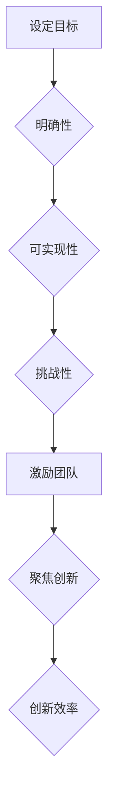
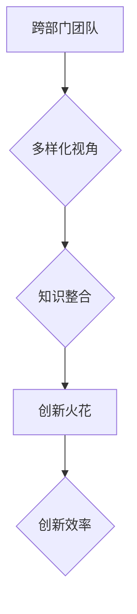
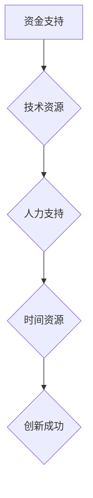
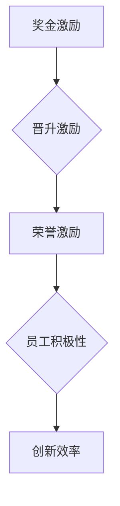

                 

### 第一部分：背景介绍

#### 第1章：问题背景

##### 1.1.1 问题背景

在当今全球化竞争日益激烈的市场环境中，企业面临的挑战和机遇并存。随着信息技术的迅猛发展，市场竞争已经从传统的产品竞争转向了创新能力的竞争。创新不仅是企业发展的动力，也是企业保持竞争优势的关键因素。在这种背景下，领导力与创新管理系统的研究和应用变得尤为重要。

##### 1.1.2 问题描述

尽管创新对于企业的重要性不言而喻，但现实中企业创新管理仍存在诸多问题。首先，许多企业缺乏系统化的创新管理体系，导致创新活动缺乏整体规划和资源支持。其次，企业领导层对创新的认识不足，缺乏对创新过程的有效管理和引导。此外，创新管理中还存在组织文化滞后、激励机制不完善等问题，这些都制约了企业创新能力的提升。

##### 1.1.3 问题解决

为解决上述问题，企业需要构建一套完善的领导力与创新管理系统，以提升创新效率和成果转化。领导力与创新管理系统旨在通过优化领导力培养、创新流程管理、资源分配、激励机制等方面，为创新活动提供全方位的支持和保障。这不仅有助于提升企业的创新能力，还能为企业创造持续的核心竞争力。

##### 1.1.4 边界与外延

领导力与创新管理系统的研究边界主要涉及创新管理的基本理论、领导力培养、创新流程设计、资源配置和激励机制等方面。其外延包括企业内部创新系统的构建、跨部门合作与沟通机制的建立、创新成果的评估与转化等。

##### 1.1.5 概念结构与核心要素组成

领导力与创新管理系统的概念结构包括以下几个核心要素：

1. **领导力**：企业领导层对创新活动的引导和推动能力。
2. **创新流程**：包括创新构思、项目筛选、研发实施、成果转化等环节。
3. **资源配置**：对创新活动所需的人力、财力和技术资源进行合理分配。
4. **激励机制**：建立与创新活动绩效挂钩的激励机制，激发员工的创新积极性。
5. **组织文化**：营造鼓励创新、包容失败的企业文化氛围。

##### 1.2 本章小结

本章通过对企业创新管理现状的分析，明确了构建领导力与创新管理系统的重要性。接下来，本书将详细介绍领导力与创新管理系统的核心概念、关键要素和构建方法，以帮助读者全面了解并掌握这一系统的构建和应用。

----------------------------------------------------------------

## 第2章：领导力概述

### 2.1 领导力的定义与作用

#### 2.1.1 领导力的概念

领导力是指领导者通过各种策略和手段，影响、激励和引导团队成员，实现组织目标的能力。领导力不仅仅是管理，更是一种影响和激励他人的艺术。

#### 2.1.2 领导力在企业创新中的作用

领导力在企业创新中具有至关重要的作用。有效的领导力能够推动企业创新，促进组织变革，提升企业的核心竞争力。以下是领导力在创新中的几个关键作用：

1. **明确目标与愿景**：领导者需要设定明确的目标和愿景，为创新活动指明方向。这有助于激发团队的创造力和积极性。

2. **培养创新氛围**：领导者需要营造一种鼓励创新、包容失败的文化氛围，让员工敢于尝试新想法，勇于挑战传统。

3. **建立跨部门合作**：创新往往需要跨部门合作，领导者需要协调不同部门之间的工作，确保资源的有效利用。

4. **提供资源支持**：领导者需要为创新活动提供充足的人力、财力和技术资源，确保创新项目的顺利推进。

5. **激励员工创新**：领导者需要建立有效的激励机制，激发员工的创新积极性，让员工感受到自己的贡献和价值。

### 2.2 领导力的类型

#### 2.2.1 情境领导力

情境领导力是一种根据不同情境和下属特点，灵活调整领导风格的方法。情境领导力认为，没有一种通用的领导风格适用于所有情况。领导者需要根据下属的能力和动机，选择最合适的领导风格。

#### 2.2.2 超级领导力

超级领导力是一种具有高度战略思维、跨领域整合能力和卓越领导能力的高级领导力。超级领导者不仅能够引领团队实现短期目标，还能够为组织制定长期的战略规划。

### 2.3 领导力培养

#### 2.3.1 领导力培训

领导力培训是提高领导能力的重要途径，包括领导技能、管理技能和个人发展等方面的培训。领导力培训可以通过外部培训课程、内部培训项目和实践学习等多种方式进行。

#### 2.3.2 领导力发展

领导力发展是指通过实践、反思和经验积累，不断提升领导能力的持续过程。领导力发展不仅需要通过培训获取知识，更需要通过实践积累经验，不断提升自己的领导水平。

## 第3章：领导力与创新的关系

### 3.1 创新领导力的特征

创新领导力具有前瞻性、灵活性、包容性和实验性等特征。前瞻性使领导者能够看到未来的趋势和机会；灵活性使领导者能够适应不断变化的环境；包容性使领导者能够接受不同的观点和建议；实验性使领导者敢于尝试新方法和新思路。

### 3.2 领导力在创新过程中的作用

领导力在创新过程中起着引导、支持、激励和协调的重要作用。具体来说，领导力在创新过程中的作用包括：

1. **引导创新方向**：领导者需要明确创新的目标和方向，为团队提供清晰的指导。

2. **支持创新活动**：领导者需要为创新活动提供必要的资源和支持，确保创新项目的顺利推进。

3. **激励创新动力**：领导者需要建立有效的激励机制，激发员工的创新热情和积极性。

4. **协调创新资源**：领导者需要协调不同部门之间的工作，确保资源的有效利用。

### 3.3 领导力提升创新效率的方法

#### 3.3.1 设定明确的目标和愿景

领导者需要设定明确的目标和愿景，为创新活动指明方向。这有助于激发团队的创造力和积极性。

#### 3.3.2 建立创新团队

领导者需要建立跨部门、多学科的创新团队，激发团队的创造力。这可以通过跨部门合作项目、创新竞赛等方式实现。

#### 3.3.3 提供资源支持

领导者需要为创新活动提供充足的人力、财力和技术资源，确保创新项目的顺利推进。

## 第4章：领导力培养与提升

### 4.1 领导力培养的策略

#### 4.1.1 培养领导潜力

领导者需要具备自我认知、学习能力和决策能力。通过自我反思、持续学习和实践锻炼，不断提升自己的领导潜力。

#### 4.1.2 提升领导素质

领导者需要具备沟通能力、团队建设和领导艺术等方面的素质。这可以通过领导力培训、实践锻炼和经验积累来实现。

### 4.2 领导力提升的实践

#### 4.2.1 个人反思

领导者需要定期进行个人反思，分析自己的领导行为和效果，找出改进的方向。

#### 4.2.2 学习先进理念

领导者需要不断学习先进的领导理念和方法，借鉴其他成功领导者的经验，不断提升自己的领导水平。

#### 4.2.3 实践与反馈

领导者需要在实际工作中不断实践，通过反馈和总结，不断完善自己的领导能力。

## 本章小结

本章介绍了领导力的概念、类型、培养与提升方法，以及领导力与创新的关系。领导力是企业创新的重要推动力，通过有效的领导力培养和提升，企业可以更好地应对市场变化，实现持续的创新和发展。接下来，我们将进一步探讨领导力与创新管理系统的构建与应用。

----------------------------------------------------------------

## 第3章：领导力与创新的关系

### 3.1 创新领导力的特征

创新领导力是一种在组织内部推动创新活动的能力，它具有以下几个关键特征：

#### 3.1.1 前瞻性

创新领导者具备前瞻性，能够预见到市场趋势和技术发展，并据此规划和调整创新战略。前瞻性使得企业能够迅速响应市场变化，抓住先机。

#### 3.1.2 灵活性

创新领导者具备灵活性，能够在不确定和快速变化的环境中迅速做出决策，调整策略。这种灵活性有助于企业在面对挑战时保持敏捷和适应性。

#### 3.1.3 包容性

创新领导者具有包容性，能够接受和鼓励不同的观点和想法，即使在尝试新方法时也愿意接受失败。包容性创造了一个开放和创新的文化氛围。

#### 3.1.4 实验性

创新领导者敢于实验，愿意尝试新的方法和技术，通过不断的试错来找到成功的路径。实验性是创新的核心，它推动了企业持续进步。

### 3.2 领导力在创新过程中的作用

领导力在创新过程中扮演着至关重要的角色，它影响着创新活动的方向、速度和效果。以下是领导力在创新过程中的几个关键作用：

#### 3.2.1 引导方向

创新领导者需要明确创新的目标和愿景，为团队提供清晰的指导。他们通过设定明确的目标和关键绩效指标（KPIs），帮助团队聚焦于最具潜力的创新项目。

#### 3.2.2 支持与激励

创新领导者为创新活动提供必要的资源和支持，包括资金、技术、人力和时间等。同时，他们通过激励机制，如奖金、晋升和荣誉，激发员工的创新动力。

#### 3.2.3 协调合作

创新往往需要跨部门合作，创新领导者需要协调不同部门之间的工作，确保资源的有效利用。他们通过建立跨部门团队和沟通机制，促进信息共享和协同工作。

#### 3.2.4 风险管理

创新活动伴随着风险，创新领导者需要管理这些风险，确保创新项目在可控范围内进行。他们通过风险评估、资源调配和风险管理策略，降低创新活动的失败概率。

### 3.3 领导力提升创新效率的方法

为了提升创新效率，创新领导者可以采取以下几种方法：

#### 3.3.1 设定明确的目标和愿景

领导者需要设定明确的目标和愿景，为创新活动提供方向。这些目标和愿景应当具有挑战性，同时又是可实现的，以激发团队的创造力和执行力。

#### 3.3.2 建立创新团队

领导者需要建立跨部门、多学科的创新团队，以充分利用不同领域的专业知识和技能。这样的团队可以带来多样化的视角，激发创新的火花。

#### 3.3.3 提供资源支持

领导者需要为创新活动提供充足的资源支持，包括资金、技术、人力和时间等。资源的充足性是创新项目成功的关键因素。

#### 3.3.4 建立激励机制

领导者需要建立有效的激励机制，以鼓励员工参与创新活动。激励机制可以包括奖金、晋升机会和荣誉等，这些都可以提高员工的积极性和创造力。

## 本章小结

本章详细阐述了创新领导力的特征、领导力在创新过程中的作用以及提升创新效率的方法。有效的创新领导力能够推动企业实现持续的创新和发展，从而在激烈的市场竞争中保持领先地位。在下一章中，我们将进一步探讨如何培养和提升创新领导力，为企业构建一个强大的创新支持体系。

----------------------------------------------------------------

## 第5章：领导力培养与提升

### 5.1 领导力培养的策略

#### 5.1.1 培养领导潜力

培养领导潜力是提升领导力的第一步。领导者需要具备自我认知、学习能力和决策能力。以下是一些培养领导潜力的策略：

1. **自我反思**：定期进行自我反思，了解自己的优势和不足，明确自己的职业发展方向。
2. **持续学习**：通过阅读书籍、参加培训课程、听取行业专家的讲座等方式，不断学习新的知识和技能。
3. **实践锻炼**：通过实际工作经历，锻炼自己的领导能力。可以从团队管理、项目策划等方面入手，积累实践经验。
4. **接受挑战**：勇于接受新的挑战，面对困难时保持积极的心态，通过解决问题提升自己的领导能力。

#### 5.1.2 提升领导素质

提升领导素质是培养领导力的关键。领导者需要具备以下素质：

1. **沟通能力**：有效的沟通是领导力的核心。领导者需要能够清晰、准确地表达自己的想法，同时也要善于倾听他人的意见和反馈。
2. **团队建设**：领导者需要能够建立高效的团队，激发团队成员的潜力，促进团队的协作和合作。
3. **领导艺术**：领导者需要具备一定的领导艺术，能够在不同情境下灵活运用不同的领导风格，以适应不同的情况和团队需求。
4. **决策能力**：领导者需要具备良好的决策能力，能够在复杂和不确定的环境中做出正确的决策。

### 5.2 领导力提升的实践

#### 5.2.1 个人反思

个人反思是提升领导力的有效方法之一。领导者需要定期反思自己的领导行为和效果，分析自己的成功和失败，找出改进的方向。以下是一些个人反思的策略：

1. **写反思日志**：每天或每周写一篇反思日志，记录自己的领导行为和思考，总结经验教训。
2. **寻求反馈**：主动向团队成员、同事和上级寻求反馈，了解自己的领导风格和效果，听取他人的意见和建议。
3. **分析案例**：通过分析其他领导者的成功和失败案例，学习他们的经验和教训，应用到自己的领导实践中。
4. **定期复盘**：在项目完成后，进行复盘会议，总结项目中的成功和不足，提炼经验教训，为未来的项目提供参考。

#### 5.2.2 学习先进理念

学习先进理念是提升领导力的另一个重要途径。领导者需要不断学习新的管理理论、领导方法和行业最佳实践，以提升自己的领导能力。以下是一些学习先进理念的方法：

1. **阅读书籍**：阅读相关的领导力书籍和管理理论著作，了解最新的管理理念和方法。
2. **参加培训**：参加领导力培训课程和工作坊，与行业专家和其他领导者交流学习。
3. **听取讲座**：参加行业讲座和研讨会，听取知名专家和成功领导者的经验和分享。
4. **实践应用**：将学习到的理念和方法应用到实际工作中，通过实践检验其效果，不断优化和提升。

#### 5.2.3 实践与反馈

实践与反馈是提升领导力的关键环节。领导者需要在实际工作中不断实践，通过反馈和总结，不断完善自己的领导能力。以下是一些实践与反馈的策略：

1. **制定行动计划**：根据个人反思和学习到的新理念，制定具体的行动计划，明确目标和步骤。
2. **实践与调整**：将行动计划应用到实际工作中，通过实践检验其效果，根据实际情况进行调整和优化。
3. **持续改进**：通过定期的反思和总结，不断优化和提升自己的领导能力，实现持续改进。
4. **建立反馈机制**：建立有效的反馈机制，定期收集团队成员和上级的反馈，了解自己的领导效果，发现问题并及时解决。

## 本章小结

本章介绍了领导力培养与提升的策略和实践。通过培养领导潜力、提升领导素质、个人反思、学习先进理念和实践与反馈，领导者可以不断提升自己的领导力，为企业创新和管理提供有力支持。在下一章中，我们将进一步探讨如何构建创新支持体系，为企业的持续创新提供系统化的支持。

----------------------------------------------------------------

## 第6章：创新支持体系构建

### 6.1 创新支持体系概述

创新支持体系是企业为了推动创新活动而建立的一系列制度和机制的总称。它包括创新文化、组织架构、激励机制、资源配置等方面，旨在为创新活动提供全方位的支持和保障。

#### 6.1.1 创新支持体系的定义

创新支持体系是指企业为激发和推动创新活动而构建的一系列机制和制度。这些机制和制度包括创新文化、组织架构、激励机制、资源配置等，旨在为创新活动提供必要的支持和保障。

#### 6.1.2 创新支持体系的重要性

创新支持体系对于企业创新活动的成功至关重要。它不仅能够激发员工的创新潜力，提升创新效率，还能够确保创新活动的可持续发展。以下是创新支持体系的重要作用：

1. **激发创新潜力**：创新支持体系通过提供良好的创新环境和资源支持，激发员工的创新热情和积极性，使员工能够更加专注于创新活动。
2. **提升创新效率**：创新支持体系通过优化创新流程、资源配置和激励机制，提高创新活动的效率和效果，使企业能够更快地实现创新成果。
3. **保障创新成果**：创新支持体系通过建立健全的创新成果转化机制，确保创新成果能够顺利地转化为实际的产品或服务，从而实现创新的价值。

### 6.2 创新支持体系的构成要素

创新支持体系由多个构成要素组成，这些要素相互关联、相互支持，共同推动创新活动的进行。以下是创新支持体系的主要构成要素：

#### 6.2.1 创新文化

创新文化是企业创新活动的精神支柱，它包括企业的价值观、信念和行为准则。创新文化鼓励员工勇于创新、接受失败、持续学习，营造一个鼓励创新和包容失败的氛围。

#### 6.2.2 组织架构

组织架构是创新支持体系的基础，它决定了创新活动的组织形式和管理方式。合理的组织架构能够促进创新资源的整合和共享，提高创新效率。

#### 6.2.3 激励机制

激励机制是创新支持体系的重要组成部分，它通过奖励和激励措施激发员工的创新积极性。激励机制可以包括奖金、晋升、荣誉等，以提升员工的创新动力。

#### 6.2.4 资源配置

资源配置是创新支持体系的保障，它包括人力、资金、技术等资源的合理分配。通过有效的资源配置，确保创新活动所需资源的充足性和合理性。

#### 6.2.5 创新流程管理

创新流程管理是创新支持体系的核心环节，它包括创新项目的筛选、研发实施、成果转化等环节。通过优化创新流程，提高创新活动的效率和质量。

### 6.3 创新支持体系的构建方法

构建创新支持体系需要综合考虑企业的实际情况和需求，以下是一些常见的构建方法：

#### 6.3.1 制定创新战略

制定创新战略是构建创新支持体系的第一步。企业需要明确创新的目标、方向和重点领域，制定相应的创新战略和规划。

#### 6.3.2 建立创新文化

建立创新文化是构建创新支持体系的关键。企业需要通过内部宣传、培训等方式，营造一种鼓励创新、包容失败的企业文化。

#### 6.3.3 设计合理的组织架构

设计合理的组织架构是构建创新支持体系的基础。企业需要根据创新活动的需求，设置相应的创新管理部门和团队，确保创新资源的有效整合和利用。

#### 6.3.4 建立有效的激励机制

建立有效的激励机制是激发员工创新积极性的重要手段。企业需要制定相应的奖励政策和晋升机制，激励员工积极参与创新活动。

#### 6.3.5 合理配置资源

合理配置资源是保障创新活动顺利进行的关键。企业需要根据创新项目的需求，合理分配人力、资金、技术等资源，确保创新活动所需的资源充足且合理。

#### 6.3.6 优化创新流程管理

优化创新流程管理是提高创新效率和质量的重要措施。企业需要建立完善的创新流程管理体系，确保创新项目能够顺利推进，并实现快速转化。

## 本章小结

本章介绍了创新支持体系的概念、重要性、构成要素和构建方法。创新支持体系是企业推动创新活动的重要保障，通过构建和完善创新支持体系，企业可以激发员工的创新潜力，提升创新效率，实现持续的创新和发展。在下一章中，我们将进一步探讨如何通过实践案例，具体实施和创新支持体系的构建与应用。

----------------------------------------------------------------

## 第7章：实践案例与案例分析

### 7.1 案例背景

为了更好地理解领导力与创新管理系统的构建与应用，我们将通过两个具体的企业实践案例来探讨其成功经验和挑战。

#### 案例1：某科技公司的创新领导力实践

某科技公司是一家全球领先的科技公司，其领导层认识到创新是保持竞争优势的关键。公司首席执行官（CEO）通过以下措施构建了一个有效的创新支持体系：

1. **明确创新目标**：CEO设定了清晰的公司愿景和战略目标，将创新活动与公司长期发展紧密结合起来。
2. **建立创新文化**：公司通过内部培训、分享会等方式，鼓励员工提出创新想法，并建立了鼓励失败、宽容错误的企业文化。
3. **跨部门协作**：CEO推动跨部门合作，建立了创新委员会，确保各部门之间的资源协调和项目协作。
4. **激励机制**：公司设立了一系列创新奖项，对表现突出的创新团队和个人进行奖励，激发员工的创新积极性。

#### 案例2：某制造业企业的领导力提升与创新管理

某制造业企业面临产品同质化竞争，决定通过提升领导力和创新管理来突破发展瓶颈。以下是其采取的措施：

1. **领导力培训**：企业为高层管理人员和关键岗位的员工提供领导力培训，提升他们的管理能力和决策水平。
2. **创新流程优化**：企业通过引入精益生产和敏捷开发方法，优化了产品研发流程，提高了创新效率。
3. **资源配置**：企业增加了对研发和技术创新的投入，确保有足够的资源支持创新项目。
4. **跨部门协作**：企业建立了跨部门创新团队，通过定期会议和项目进展报告，确保创新项目的顺利推进。

### 7.2 案例分析

通过以上两个案例，我们可以总结出以下关键成功因素和挑战：

#### 关键成功因素

1. **明确的目标和愿景**：领导层设定了明确的目标和愿景，为创新活动提供了方向。
2. **创新文化的建立**：通过鼓励创新、宽容失败的企业文化，激发了员工的创新潜力。
3. **跨部门协作**：通过建立跨部门团队和沟通机制，提高了创新项目的效率。
4. **激励机制**：通过奖励措施，激励了员工的创新热情和积极性。

#### 挑战

1. **资源分配**：在资源有限的情况下，如何确保创新项目得到充足的资源支持，是领导层面临的挑战。
2. **创新风险管理**：创新活动伴随着风险，如何有效管理和控制创新风险是另一个挑战。
3. **领导力培养**：提升领导层的领导力，确保他们具备推动创新的能力，是企业的长期任务。

### 7.3 启示与建议

通过对以上案例的分析，我们可以得出以下启示和建议：

1. **明确创新目标**：领导层应明确创新的目标和愿景，确保创新活动与企业的长期发展相一致。
2. **建立创新文化**：通过内部宣传、培训和激励措施，营造鼓励创新、包容失败的企业文化。
3. **优化资源配置**：合理配置资源，确保创新项目得到充足的支持，同时控制资源浪费。
4. **提升领导力**：通过领导力培训和实际锻炼，提升领导层的领导力，确保他们能够有效推动创新。
5. **风险管理**：建立健全的创新风险管理机制，降低创新活动的风险。

## 本章小结

通过实践案例的分析，我们可以看到领导力与创新管理系统在企业中的应用效果。领导层的决策和领导力对于创新活动的成功至关重要。企业需要通过构建创新支持体系，激发员工的创新潜力，提升创新效率，实现持续的创新和发展。在下一章中，我们将进一步探讨创新管理系统的实际应用和最佳实践。

----------------------------------------------------------------

## 第8章：创新管理系统的实际应用与最佳实践

### 8.1 创新管理系统的概述

创新管理系统是一种系统化的方法，旨在激发和推动组织的创新活动。它包括了一系列工具、流程和策略，用以管理和引导创新过程，确保创新活动的有效性和持续性。创新管理系统不仅关注技术创新，还包括产品创新、服务创新和商业模式创新等多个方面。

#### 8.1.1 创新管理系统的定义

创新管理系统是指组织内部用于识别、培育、实施和评估创新活动的一系列工具、流程和策略。它旨在通过系统化的方法，提高创新效率，加速创新成果的转化，从而提升组织的竞争力。

#### 8.1.2 创新管理系统的重要性

创新管理系统对于组织的成功至关重要，它能够：

1. **提高创新效率**：通过系统化的方法，减少创新过程中的不确定性和浪费，提高创新活动的效率和效果。
2. **加速创新成果转化**：确保创新想法能够快速转化为实际的产品、服务或商业模式，实现创新的价值。
3. **提升组织竞争力**：通过持续的创新，组织能够更好地适应市场变化，保持竞争优势。
4. **激发员工创造力**：创新管理系统鼓励员工参与创新，激发他们的创造力和积极性。

### 8.2 创新管理系统的构成

创新管理系统由多个构成部分组成，这些部分相互协同，共同推动创新活动的顺利进行。以下是创新管理系统的主要构成部分：

#### 8.2.1 创新思维工具

创新思维工具是创新管理系统的基础，它包括头脑风暴、思维导图、六顶思考帽等方法。这些工具可以帮助组织在创新过程中产生大量创意，并进行筛选和优化。

#### 8.2.2 创新流程管理

创新流程管理是确保创新活动有序进行的关键环节，它包括创意收集、筛选、研发实施、评估和商业化等环节。通过优化流程，可以确保创新活动的高效和有序。

#### 8.2.3 激励机制

激励机制是激发员工创新积极性的重要手段，它包括奖励、晋升、荣誉等。通过建立合理的激励机制，可以鼓励员工积极参与创新活动，提升创新效率。

#### 8.2.4 资源配置

资源配置是创新管理系统的重要保障，它包括人力、资金、技术等资源的合理分配。通过有效的资源配置，可以确保创新活动所需的资源得到充分利用。

#### 8.2.5 创新风险管理

创新风险管理是确保创新活动顺利进行的重要措施，它包括识别风险、评估风险、控制风险和应对风险等环节。通过建立健全的风险管理机制，可以降低创新活动的风险。

### 8.3 创新管理系统的实际应用

创新管理系统的实际应用可以体现在多个方面，以下是一些具体的实际应用案例：

#### 8.3.1 创新项目立项

创新项目管理是创新管理系统的核心应用之一。企业可以通过创新项目管理工具，如项目管理软件，对创新项目进行立项、规划、执行和监控，确保项目的顺利进行。

#### 8.3.2 创意征集

企业可以通过内部创新平台或外部创意征集活动，广泛征集员工的创新想法。这些想法经过筛选和评估后，可以转化为实际的创新项目。

#### 8.3.3 创新评估

创新评估是确保创新活动有效性的重要环节。企业可以通过设立创新评估委员会，对创新项目进行评估，确保项目符合企业的战略目标和市场需求。

#### 8.3.4 创新转化

创新转化是将创新想法转化为实际产品或服务的过程。企业可以通过创新转化平台，如研发实验室、试点项目等，加速创新成果的转化。

### 8.4 最佳实践

以下是一些创新管理系统的最佳实践：

1. **建立创新文化**：通过营造鼓励创新、宽容失败的企业文化，激发员工的创新热情。
2. **加强领导力培养**：提升领导层的创新领导力，确保他们能够有效推动创新活动。
3. **优化资源配置**：确保创新活动得到充足的资源支持，包括人力、资金和技术资源。
4. **建立激励机制**：通过奖励和晋升机制，激励员工积极参与创新活动。
5. **加强风险管理**：建立健全的风险管理机制，确保创新活动在可控范围内进行。

## 本章小结

本章介绍了创新管理系统的概念、构成和应用，并通过实际案例展示了创新管理系统的最佳实践。通过构建和实施创新管理系统，企业可以提升创新效率，加速创新成果的转化，从而在激烈的市场竞争中保持优势。在下一章中，我们将进一步探讨创新管理系统在实际应用中面临的挑战和解决方案。

----------------------------------------------------------------

## 第9章：创新管理系统的挑战与解决方案

### 9.1 创新管理系统的挑战

尽管创新管理系统为企业提供了有效的工具和策略，但在实际应用中，仍然面临着一些挑战。以下是创新管理系统常见的几个挑战：

#### 9.1.1 创新资源分配不足

许多企业在创新资源分配方面存在不足，导致创新项目缺乏充足的资金、人力和技术支持。资源不足往往限制了创新项目的进展，影响了创新效率。

#### 9.1.2 创新风险控制不力

创新活动本身具有高风险性，如何有效控制和应对创新风险是企业管理者面临的挑战。不成熟的技术、市场的不确定性以及创新失败的风险都需要得到妥善管理。

#### 9.1.3 创新团队协作不畅

跨部门协作和创新团队内部的合作对于创新活动的成功至关重要。然而，实际操作中，由于部门壁垒、沟通不畅和利益冲突等原因，团队协作往往不够顺畅。

#### 9.1.4 创新激励机制不完善

有效的激励机制能够激发员工的创新积极性，但许多企业的激励机制存在不足，无法充分调动员工的创新热情。

### 9.2 解决方案与策略

针对上述挑战，企业可以采取以下解决方案和策略：

#### 9.2.1 优化资源分配

企业应通过合理的资源配置策略，确保创新项目得到充足的资金、人力和技术支持。具体措施包括：

1. **建立资源池**：建立企业内部的资源池，集中管理和分配创新资源，确保资源的高效利用。
2. **优先级排序**：对创新项目进行优先级排序，优先支持具有高潜力和高回报的创新项目。
3. **跨部门合作**：鼓励跨部门合作，通过共享资源和信息，提高资源利用效率。

#### 9.2.2 加强创新风险管理

企业应建立健全的创新风险管理机制，确保创新活动在可控范围内进行。具体措施包括：

1. **风险评估**：对创新项目进行详细的风险评估，识别潜在风险，制定相应的风险应对策略。
2. **风险控制**：通过风险控制措施，如技术储备、市场调研和试点项目等，降低创新风险。
3. **应急计划**：制定创新失败后的应急计划，确保企业能够快速恢复和调整。

#### 9.2.3 提升团队协作

企业应采取措施提升创新团队的协作效率，确保团队内部和跨部门的合作顺畅。具体措施包括：

1. **明确职责和目标**：确保团队成员对项目的职责和目标清晰明确，避免因职责不明导致的冲突和混乱。
2. **加强沟通和协作**：建立有效的沟通机制，如定期会议、项目进展报告等，促进团队内部的协作和信息共享。
3. **培养团队合作精神**：通过团队建设活动、跨部门合作项目等，培养团队成员的团队合作精神。

#### 9.2.4 完善激励机制

企业应建立和完善激励机制，充分调动员工的创新积极性。具体措施包括：

1. **奖金和晋升**：通过奖金和晋升等物质激励，奖励在创新活动中表现突出的员工。
2. **荣誉和认可**：通过设立创新奖项和荣誉，对在创新活动中取得显著成绩的员工进行认可和表彰。
3. **职业发展机会**：为员工提供职业发展机会，如培训、轮岗等，激发员工的创新动力。

### 9.3 案例分析

以下是一个企业成功应对创新管理系统挑战的案例分析：

某科技企业曾面临创新资源分配不足和创新风险控制不力的挑战。为了解决这些问题，企业采取了以下措施：

1. **优化资源配置**：企业建立了创新资源池，集中管理和分配创新资源。通过设立优先级排序机制，确保资源优先支持高潜力项目。
2. **加强创新风险管理**：企业对每个创新项目进行详细的风险评估，制定风险应对策略。同时，设立应急计划，以应对创新失败。
3. **提升团队协作**：企业通过定期团队建设活动和跨部门合作项目，提升团队成员的协作效率。
4. **完善激励机制**：企业设立了创新奖金和晋升机制，对在创新活动中表现突出的员工进行奖励。

通过以上措施，该企业成功提升了创新效率和成果转化，实现了持续的创新和发展。

## 本章小结

本章探讨了创新管理系统在实际应用中面临的挑战，并提出了相应的解决方案和策略。通过优化资源分配、加强创新风险管理、提升团队协作和完善激励机制，企业可以克服创新管理系统的挑战，实现持续的创新和发展。在下一章中，我们将进一步探讨如何通过持续改进和创新管理系统的优化，进一步提升企业的创新能力和竞争力。

----------------------------------------------------------------

## 第10章：持续改进与创新管理系统的优化

### 10.1 持续改进的重要性

持续改进是创新管理系统优化的重要手段。它通过不断优化和创新，提高创新活动的效率和质量，确保企业能够在竞争激烈的市场环境中保持领先地位。以下是持续改进的几个关键点：

1. **不断优化流程**：通过定期评估和改进创新流程，消除不必要的步骤和浪费，提高创新效率。
2. **收集反馈和改进**：鼓励员工和客户提供反馈，不断改进创新活动的方法和策略。
3. **实验和验证**：通过小规模的实验和验证，不断尝试新的方法和思路，确保改进措施的有效性。

### 10.2 创新管理系统的优化策略

为了实现持续改进，企业可以采取以下优化策略：

#### 10.2.1 流程优化

流程优化是持续改进的核心。企业可以通过以下方法优化创新流程：

1. **流程地图**：绘制创新流程地图，明确每个环节的职责和步骤，找出潜在的瓶颈和优化点。
2. **价值流分析**：通过价值流分析，识别和创新过程中的浪费，并采取措施进行优化。
3. **六西格玛方法**：引入六西格玛方法，通过统计分析和过程控制，降低创新过程中的变异和缺陷。

#### 10.2.2 激励机制优化

激励机制的优化可以激发员工的创新热情和积极性。以下是一些优化激励机制的策略：

1. **个性化奖励**：根据员工的贡献和业绩，提供个性化的奖励，如奖金、股权激励等。
2. **长期激励**：建立长期激励计划，如员工持股计划、长期绩效奖金等，鼓励员工长期投入和贡献。
3. **荣誉体系**：建立完善的荣誉体系，对在创新活动中表现突出的员工进行表彰和奖励。

#### 10.2.3 风险管理优化

风险管理是创新管理系统的关键环节。企业可以通过以下策略优化风险管理：

1. **风险评估**：建立完善的风险评估机制，对创新项目进行全面的风险评估。
2. **风险应对计划**：为每个创新项目制定详细的风险应对计划，确保在风险发生时能够迅速响应和应对。
3. **风险监控和调整**：通过实时监控和调整，确保创新活动在风险可控范围内进行。

### 10.3 持续改进的实践案例

以下是一个企业通过持续改进优化创新管理系统的实践案例：

某大型科技公司通过持续改进，优化了其创新管理流程和激励机制。以下是其实践步骤：

1. **流程优化**：公司对创新流程进行了全面梳理，通过价值流分析和六西格玛方法，去除了不必要的步骤和浪费，提高了流程效率。
2. **激励机制优化**：公司引入了个性化奖励和长期激励计划，鼓励员工积极参与创新活动，并设立了完善的荣誉体系，对表现突出的员工进行表彰。
3. **风险管理优化**：公司建立了全面的风险评估机制，对每个创新项目进行风险评估，并制定了详细的风险应对计划。
4. **持续改进**：公司鼓励员工提出改进建议，通过定期评估和反馈，不断优化创新流程和激励机制。

通过这些措施，公司显著提高了创新效率，创新成果转化率也大幅提升，从而在竞争激烈的市场环境中保持了领先地位。

### 10.4 持续改进的重要性

持续改进是企业保持竞争优势的关键。通过不断优化和创新管理系统，企业可以不断提高创新效率和质量，确保在竞争激烈的市场环境中立于不败之地。以下是一些关于持续改进的重要提示：

1. **建立持续改进的文化**：企业应建立持续改进的文化，鼓励员工积极参与改进活动，营造一个不断学习和创新的环境。
2. **制定明确的改进目标**：企业应制定明确的改进目标，并分解为可操作的行动计划，确保改进活动有序进行。
3. **建立反馈和评估机制**：通过建立反馈和评估机制，及时收集改进活动的反馈，评估改进效果，并根据评估结果进行调整和优化。

## 本章小结

本章探讨了持续改进与创新管理系统的优化策略，并通过实践案例展示了如何通过持续改进提升企业的创新能力和竞争力。通过不断优化和创新管理系统，企业可以更好地应对市场变化，保持竞争优势。在下一章中，我们将总结全书的主要内容和核心观点，并提供进一步的学习和阅读建议。

----------------------------------------------------------------

## 全书总结

本书围绕“领导力与创新管理系统：构建创新支持体系”这一主题，详细探讨了企业如何在竞争激烈的市场环境中，通过有效的领导力与创新管理系统的构建和应用，提升创新能力和竞争力。以下是本书的主要内容和核心观点的总结：

### 主要内容总结

1. **背景介绍**：介绍了企业创新管理的重要性，以及当前企业创新管理中存在的问题。
2. **领导力概述**：探讨了领导力的定义、类型及其在企业创新中的作用。
3. **领导力与创新的关系**：分析了创新领导力的特征以及领导力在创新过程中的作用。
4. **领导力培养与提升**：介绍了领导力培养的策略和实践，以及如何提升领导力。
5. **创新支持体系构建**：详细阐述了创新支持体系的构成要素和构建方法。
6. **实践案例与案例分析**：通过具体案例，展示了企业如何应用创新支持体系。
7. **创新管理系统的实际应用与最佳实践**：介绍了创新管理系统的构成和实际应用。
8. **挑战与解决方案**：探讨了创新管理系统应用中面临的挑战和解决方案。
9. **持续改进与创新管理系统的优化**：介绍了如何通过持续改进优化创新管理系统。

### 核心观点总结

1. **领导力是企业创新的关键因素**：有效的领导力能够推动企业创新，促进组织变革，提升企业的核心竞争力。
2. **创新支持体系是企业创新的保障**：通过构建和完善创新支持体系，企业可以激发员工的创新潜力，提升创新效率，实现持续的创新和发展。
3. **持续改进是提升创新能力的必由之路**：企业应通过持续改进和创新管理系统的优化，不断提高创新效率和质量，确保在竞争激烈的市场环境中保持领先地位。

### 进一步学习与阅读建议

1. **深入阅读相关书籍**：推荐阅读《创新者的窘境》、《创新者的基因》等经典书籍，以深入了解企业创新管理的理论和实践。
2. **参加专业培训和研讨会**：参加专业培训和研讨会，学习先进的创新管理理论和最佳实践。
3. **关注行业动态**：关注行业动态和技术发展趋势，了解市场变化，为企业创新提供有力支持。
4. **实践与反思**：将学到的理论和方法应用到实际工作中，通过实践和反思，不断提升企业的创新能力和竞争力。

本书旨在为企业提供一套系统化的创新管理理论和实践指导，帮助企业构建有效的领导力与创新管理系统，实现持续的创新和发展。希望读者通过本书的学习和应用，能够在激烈的市场竞争中脱颖而出，实现企业的长远发展。

