                 


### 领导力与创新：如何打造创新型组织

> 关键词：领导力、创新、组织建设、团队协作、管理实践

> 摘要：本文将深入探讨领导力与创新的关系，解析如何通过有效的领导力打造创新型组织。我们将从领导力基础出发，逐步介绍核心概念、原理和实际应用，以期为读者提供全面、系统的理解。

----------------------------------------------------------------

#### 引言

在当今快速变化的时代，创新能力已成为组织竞争力的重要源泉。而领导力，作为推动创新的关键因素，对于组织的成长与发展至关重要。本文旨在通过系统的分析和深入探讨，揭示领导力与创新之间的内在联系，并提供一套实用的方法，帮助领导者打造创新型组织。

#### 第1章：领导力的定义与重要性

##### 1.1 领导力的定义

领导力是一种能力，它涉及到激励、引导和影响他人，以实现共同目标的过程。它不仅仅是管理，更是引领和塑造组织文化的能力。

##### 1.2 领导力的作用

领导力在组织中起到核心作用，它能够促进团队合作、提升员工积极性，并推动组织创新。一个优秀的领导者能够激发团队成员的潜力，形成高效的团队，从而实现组织的目标。

##### 1.3 领导力的重要性

领导力对于组织的成功至关重要。它不仅影响组织的绩效，还影响组织的长远发展。一个缺乏领导力的组织很难在竞争激烈的市场中立于不败之地。

#### 第2章：领导力的核心要素

##### 2.1 领导力的素质

领导力的素质包括自我意识、情感智慧、沟通能力、决策能力和适应性等。这些素质是领导者成功的关键。

##### 2.2 领导力的发展路径

领导者需要不断学习、实践和反思，以提升自己的领导力。发展路径包括自我发展、领导力培训和实践经验。

##### 2.3 领导力与组织文化

领导力与组织文化密切相关。领导者需要塑造和引导组织文化，以支持组织的创新和成长。

#### 第3章：领导力的风格与技巧

##### 3.1 领导力的风格

领导力的风格多种多样，包括权威型、民主型、教练型等。不同的领导风格适用于不同的情境。

##### 3.2 领导力的技巧

领导力的技巧包括沟通技巧、激励技巧、决策技巧和时间管理技巧等。这些技巧能够提升领导者的效能。

##### 3.3 领导力的实践应用

领导力在实践中的应用包括团队建设、目标设定、绩效管理、冲突解决等。这些实践是领导者成功的关键。

#### 第4章：领导力与团队建设

##### 4.1 团队建设的核心要素

团队建设的核心要素包括信任、沟通、协作和共同目标。

##### 4.2 如何打造高绩效团队

打造高绩效团队需要明确团队目标、建立信任、提升沟通和协作，以及激励团队成员。

##### 4.3 团队沟通与协作

有效的团队沟通和协作能够提升团队效能，实现组织目标。

#### 第5章：领导力与创新

##### 5.1 创新的重要性

创新是组织持续发展的动力。领导力在推动创新中起到关键作用。

##### 5.2 创新的方法与工具

领导者需要掌握创新的方法和工具，如头脑风暴、原型设计和快速迭代等。

##### 5.3 创新与领导力

创新与领导力相辅相成，领导者需要具备创新思维和创新能力。

#### 第6章：创新型组织的建设

##### 6.1 创新型组织的特征

创新型组织具有创新文化、开放氛围、高效团队和持续学习等特点。

##### 6.2 如何打造创新型组织

打造创新型组织需要领导者具备创新意识、培养创新文化、建立创新机制，以及提供创新资源。

##### 6.3 创新型组织的管理

创新型组织的管理强调灵活性、自主性和创新性。

#### 第7章：领导力与创新的最佳实践

##### 7.1 国际企业的案例研究

通过分析国际企业的案例，我们可以了解到成功的创新领导力实践。

##### 7.2 创新型组织的成功要素

创新型组织的成功要素包括领导者的影响力、团队的创新能力和组织文化的支持。

##### 7.3 领导力与创新的未来趋势

领导力与创新在未来将更加融合，成为组织竞争力的核心。

#### 第8章：总结与展望

##### 8.1 领导力与创新的核心观点

领导力与创新是组织成功的两个关键因素，相互促进，共同推动组织发展。

##### 8.2 未来领导力的挑战

未来领导力将面临新的挑战，如全球化、数字化转型等。

##### 8.3 打造创新型组织的路径

通过有效的领导力打造创新型组织，需要领导者具备创新思维、塑造创新文化，并建立创新机制。

### 结语

领导力与创新是组织发展的两个重要驱动力。领导者需要具备创新思维和创新能力，以引领组织走向成功。通过本文的探讨，我们希望读者能够对领导力与创新的关系有更深入的理解，并能够将所学应用于实际工作中。

### 作者

作者：AI天才研究院/AI Genius Institute & 禅与计算机程序设计艺术 /Zen And The Art of Computer Programming

本文以逻辑清晰、结构紧凑、简单易懂的专业的技术语言，深入探讨了领导力与创新的关系，以及如何打造创新型组织。通过一步步的分析推理思考，读者能够系统地掌握相关理论和实践方法。希望本文能为您的领导力提升和创新实践提供有益的启示。

----------------------------------------------------------------

### 第1章：领导力的定义与重要性

#### 1.1 领导力的定义

领导力是一种复杂而多维的能力，它涉及到激励、引导和影响他人，以实现共同目标的过程。在组织管理中，领导力不仅体现在管理者对员工的管理和控制上，更体现在领导者对组织文化的塑造和推动上。领导力是一种能力，它不仅仅是管理，更是引领和塑造组织文化的能力。

在技术领域，领导力同样重要。技术领导者不仅要具备技术知识，还要具备引领团队创新、推动项目进度和塑造团队文化的能力。例如，在软件开发中，一个优秀的领导者能够激励团队成员，共同攻克技术难题，推动项目的顺利进行。

#### 1.2 领导力的作用

领导力在组织中起到核心作用。首先，领导力能够促进团队合作。一个优秀的领导者能够引导团队成员，形成共同的目标和价值观，从而实现高效合作。其次，领导力能够提升员工积极性。领导者通过激励和认可，能够激发员工的内在动力，提升工作热情和效率。最后，领导力能够推动组织创新。领导者具备创新思维和创新能力，能够引领团队不断探索新的技术和方法，推动组织的持续发展。

#### 1.3 领导力的重要性

领导力对于组织的成功至关重要。一个缺乏领导力的组织很难在竞争激烈的市场中立于不败之地。领导力不仅影响组织的绩效，还影响组织的长远发展。例如，一个优秀的领导者能够带领团队实现卓越的业绩，而一个缺乏领导力的领导者则可能导致团队分裂、绩效下降。

在技术领域，领导力的重要性更加凸显。技术发展迅速，市场竞争激烈，领导者需要具备敏锐的洞察力和强大的执行力，才能在变化中把握机遇，推动组织的发展。同时，技术领导者还需要具备跨学科的知识和技能，能够协调不同部门之间的合作，实现资源的优化配置。

#### 核心概念与联系

为了更好地理解领导力的核心概念，我们可以将其与组织行为学、心理学等学科进行联系。以下是领导力的核心概念及其属性特征对比表格：

| 核心概念 | 定义 | 属性特征对比 |
| --- | --- | --- |
| 激励 | 激发员工内在动力，提升工作热情 | 激励主要关注员工的内在动机和需求，强调自我驱动 |
| 引导 | 指引团队方向，推动组织发展 | 引导强调领导者的决策和指引作用，关注团队整体利益 |
| 影响 | 影响他人行为和态度，实现共同目标 | 影响主要关注领导者对团队成员的引导和影响，强调领导者的权威和魅力 |
| 沟通 | 传递信息和意见，建立良好关系 | 沟通强调领导者与团队成员之间的有效沟通和互动，关注信息传递的准确性和及时性 |

此外，我们可以使用 Mermaid ER 实体关系图来进一步描述领导力的概念结构：

```mermaid
erDiagram
    Employee ||--|{ Leader } : managedBy
    Leader ||--|{ Team } : leads
    Leader ||--|{ Organization } : leadsTo
    Team ||--|{ Project } : worksOn
```

在这个 ER 图中，我们定义了领导力相关的四个核心实体：员工、领导者、团队和组织。每个实体之间的关系都反映了领导力在组织中的重要作用。领导者管理员工，推动团队工作，从而影响整个组织的绩效和发展。

#### 算法原理讲解

为了更好地理解领导力的作用，我们可以将其与算法原理进行类比。例如，我们可以将领导力视为一种“启发式算法”，它通过不断尝试和调整，找到最优的团队管理和组织发展路径。

以下是领导力算法的 Mermaid 流程图：

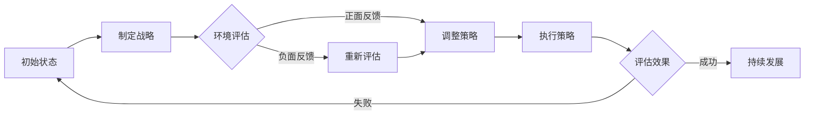

在这个流程图中，领导力算法通过不断地评估环境、调整策略和执行策略，实现团队管理和组织发展的目标。具体来说，领导者首先制定战略，然后根据环境评估结果进行调整，最后执行策略并评估效果。如果效果良好，则持续发展；如果效果不佳，则重新评估并调整策略。

下面是使用 Python 源代码来详细阐述领导力算法的原理：

```python
# 领导力算法原理示例

# 初始状态
initial_state = "A"

# 环境评估函数
def environment_evaluation():
    # 根据实际情况进行环境评估
    return "正面反馈" if ... else "负面反馈"

# 调整策略函数
def adjust_strategy(feedback):
    # 根据反馈结果调整策略
    return "新策略"

# 执行策略函数
def execute_strategy(strategy):
    # 根据策略执行具体行动
    return "成功" if ... else "失败"

# 评估效果函数
def evaluate_effect(result):
    # 根据执行结果评估效果
    return "持续发展" if ... else "失败"

# 领导力算法流程
while initial_state != "H":
    # 制定战略
    strategy = "初始战略"
    
    # 环境评估
    feedback = environment_evaluation()
    
    # 调整策略
    strategy = adjust_strategy(feedback)
    
    # 执行策略
    result = execute_strategy(strategy)
    
    # 评估效果
    next_state = evaluate_effect(result)
    
    # 更新初始状态
    initial_state = next_state

print("最终状态：", initial_state)
```

在这个示例中，我们定义了四个核心函数：环境评估、调整策略、执行策略和评估效果。通过这些函数，我们可以模拟领导力算法的运行过程，实现团队管理和组织发展的目标。

#### 数学公式使用示例

在领导力分析中，数学公式常用于描述决策模型、绩效评估和风险评估等。以下是一些常用的数学公式示例：

1. **决策模型**：
   $$ \text{最优决策} = \arg\min_{x} \sum_{i=1}^{n} w_i \cdot c_i(x) $$
   其中，$w_i$ 为权重，$c_i(x)$ 为成本函数。

2. **绩效评估**：
   $$ \text{绩效评分} = \frac{\text{实际绩效}}{\text{目标绩效}} $$
   其中，实际绩效和目标绩效分别为实际完成情况和预定目标。

3. **风险评估**：
   $$ \text{风险概率} = \frac{\text{风险损失}}{\text{风险成本}} $$
   其中，风险损失和风险成本分别为可能发生的损失和总成本。

在实际应用中，这些公式可以通过编程实现，从而为领导者提供决策支持。

#### 系统分析与架构设计方案

在技术领域，领导力不仅体现在管理和激励员工上，还体现在系统分析与架构设计的能力上。以下是一个简单的系统分析与架构设计方案，用于说明领导力在技术项目中的应用。

##### 1. 问题场景介绍

假设我们正在开发一个在线教育平台，该平台需要支持大规模用户访问、课程管理和互动功能。项目需求包括实时直播、录播视频、在线测试和用户反馈系统。

##### 2. 项目介绍

项目名称：在线教育平台
项目目标：开发一个功能完善、高效稳定的教育平台，满足用户需求。

##### 3. 系统功能设计

系统功能包括：

- 用户注册与登录
- 课程浏览与搜索
- 实时直播与录播
- 在线测试与考试
- 用户反馈与支持

以下是一个简单的领域模型 Mermaid 类图：

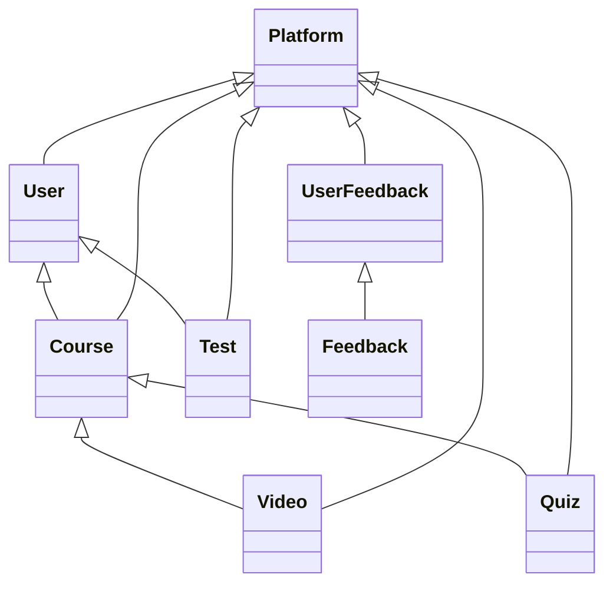

在这个类图中，我们定义了用户、课程、测试、视频、反馈和平台等核心类，并展示了它们之间的关系。

##### 4. 系统架构设计

系统架构设计包括：

- 后端服务：使用 Spring Boot 框架搭建后端服务，实现业务逻辑处理。
- 前端界面：使用 React 框架搭建前端界面，提供用户交互。
- 数据库设计：使用 MySQL 数据库存储用户数据、课程信息和测试结果。
- 实时通信：使用 WebSocket 实现实时通信功能，支持直播和在线测试。

以下是一个简单的系统架构 Mermaid 图：

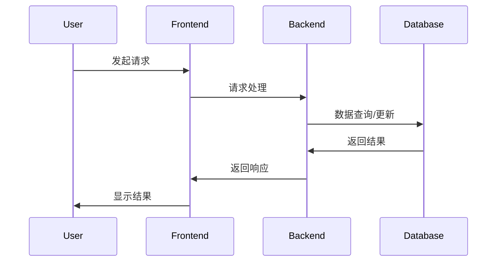

在这个序列图中，我们展示了用户、前端、后端和数据库之间的交互流程。

##### 5. 系统接口设计和系统交互

系统接口设计包括：

- 用户接口：RESTful API，支持用户注册、登录、课程浏览、在线测试等。
- 内部接口：服务间通信接口，支持数据同步、任务调度等。

以下是一个简单的接口设计 Mermaid 图：

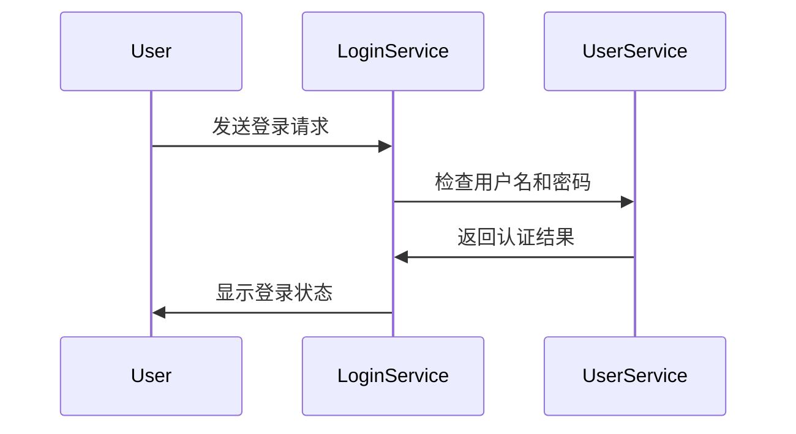

在这个序列图中，我们展示了用户登录的接口交互流程。

##### 6. 项目实战

项目实战包括：

- 环境安装：安装 JDK、MySQL、Spring Boot 和 React 等开发工具和依赖库。
- 系统核心实现：根据项目需求，实现用户注册、登录、课程管理和在线测试等功能。
- 代码应用解读与分析：详细解读核心代码，分析系统架构和接口设计。

在实际开发中，项目实战是验证领导力的重要手段。一个优秀的领导者能够带领团队高效地实现项目目标，并在实战中不断提升领导力和技术能力。

#### 最佳实践 tips

1. **明确目标**：在领导过程中，领导者需要明确团队的目标，并确保每个成员都理解并致力于实现这些目标。

2. **沟通协作**：领导者需要建立有效的沟通机制，鼓励团队成员之间的协作，以提高团队效能。

3. **激励创新**：领导者应该鼓励创新思维，提供必要的资源和支持，以推动组织的持续创新。

4. **反思与调整**：领导者需要不断反思和调整领导策略，以适应环境变化和团队需求。

#### 小结

本章详细介绍了领导力的定义、作用和重要性，以及领导力的核心要素和实际应用。通过系统分析和架构设计，我们展示了领导力在技术项目中的重要性。通过最佳实践 tips，我们提供了具体的操作指南，以帮助领导者提升领导力，推动组织的创新和发展。

#### 注意事项

1. 领导力是一种综合能力，需要长期的学习和实践才能不断提升。

2. 领导者需要根据不同情境灵活运用不同的领导风格和技巧。

3. 创新型组织的建设需要领导者的持续努力和全员参与。

#### 拓展阅读

1. 桑德尔·蒂什勒 (Sandel, T.). (2013). 《领导力的艺术》。
2. 彼得·德鲁克 (Drucker, P. F.). (2008). 《管理的实践》。
3. 约翰·凯特 (Kotter, J. P.). (2012). 《领导变革》。

通过这些拓展阅读，读者可以进一步深入了解领导力的理论和实践，提升自己的领导力水平。

----------------------------------------------------------------

### 第2章：领导力的核心要素

在上一章中，我们探讨了领导力的定义和重要性。在本章中，我们将深入探讨领导力的核心要素，这些要素是构建高效领导力的基础。

#### 2.1 领导力的素质

领导力的素质是指领导者应具备的基本能力和品质。以下是领导力核心素质的详细介绍：

1. **自我意识**：自我意识是指领导者对自己行为、情感和动机的认识。一个具备自我意识的领导者能够更好地管理自己的情绪，理性地做出决策。

2. **情感智慧**：情感智慧是指领导者理解和管理自己及他人情感的能力。一个具备情感智慧的领导者能够建立良好的人际关系，提高团队的凝聚力和合作效率。

3. **沟通能力**：沟通能力是指领导者有效传达信息、倾听他人意见和解决冲突的能力。良好的沟通能力有助于领导者建立信任，推动团队的协作和共同进步。

4. **决策能力**：决策能力是指领导者面对复杂情况，能够快速做出合理决策的能力。一个具备决策能力的领导者能够带领团队应对挑战，把握机遇。

5. **适应性**：适应性是指领导者适应变化、调整策略的能力。在快速变化的环境中，具备适应性的领导者能够灵活应对各种情况，确保组织的稳定和发展。

#### 2.2 领导力的发展路径

领导力并非天生具备，而是可以通过学习和实践不断发展和提升。以下是领导力发展路径的几个关键步骤：

1. **自我发展**：领导者需要通过自我反思、学习和实践，不断提升自己的能力。阅读相关书籍、参加培训课程、寻求导师指导等方式都是自我发展的有效途径。

2. **领导力培训**：领导力培训可以帮助领导者系统地学习和掌握领导力理论和方法。例如，领导力工作坊、管理培训课程等都是提升领导力的有效方式。

3. **实践经验**：实践经验是提升领导力的最佳途径。领导者需要通过实际工作，面对各种挑战和问题，不断锻炼自己的领导能力。

4. **反思与改进**：领导者需要不断反思自己的领导行为，识别优点和不足，并采取改进措施。通过持续的自我改进，领导者可以不断提升自己的领导力。

#### 2.3 领导力与组织文化

领导力与组织文化密切相关。一个健康的组织文化能够促进领导力的发挥，而优秀的领导力也能够塑造和强化组织文化。以下是领导力与组织文化之间的关联：

1. **领导力塑造组织文化**：领导者通过自己的行为和决策，塑造组织的价值观和行为规范。一个具备创新精神的领导者能够推动组织形成积极进取的文化。

2. **组织文化支持领导力**：健康的组织文化能够为领导者提供支持和信任，让领导者能够更专注于推动组织发展。例如，一个开放和包容的文化能够鼓励创新和合作，促进领导力的发挥。

3. **领导力与组织文化的互动**：领导力与组织文化相互影响，相互塑造。领导者的行为会影响组织文化，而组织文化也会影响领导者的决策和行为。

#### 核心概念与联系

为了更好地理解领导力的核心要素，我们可以将其与心理学、组织行为学等学科进行联系。以下是领导力核心要素的属性特征对比表格：

| 核心概念 | 定义 | 属性特征对比 |
| --- | --- | --- |
| 自我意识 | 对自己行为、情感和动机的认识 | 自我意识强调领导者内心的自我反思和自我认知 |
| 情感智慧 | 理解和管理自己及他人情感的能力 | 情感智慧强调领导者对情感的理解和运用能力 |
| 沟通能力 | 有效传达信息、倾听他人意见和解决冲突的能力 | 沟通能力强调领导者与团队成员之间的信息传递和互动 |
| 决策能力 | 快速做出合理决策的能力 | 决策能力强调领导者面对复杂情况的判断力和执行力 |
| 适应性 | 适应变化、调整策略的能力 | 适应性强调领导者应对不确定性和变化的能力 |

此外，我们可以使用 Mermaid ER 实体关系图来进一步描述领导力与组织文化的关系：

```mermaid
erDiagram
    Leader ||--|{ OrganizationCulture } : shapedBy
    OrganizationCulture ||--|{ Leader } : influencedBy
```

在这个 ER 图中，我们定义了领导者和组织文化两个核心实体，并展示了它们之间的相互影响关系。领导者通过行为和决策塑造组织文化，而组织文化又反过来影响领导者的行为和决策。

#### 算法原理讲解

为了更好地理解领导力的核心要素，我们可以将其与算法原理进行类比。例如，我们可以将领导力视为一种“优化算法”，它通过不断调整和优化，找到最佳的领导策略。

以下是领导力算法的 Mermaid 流程图：

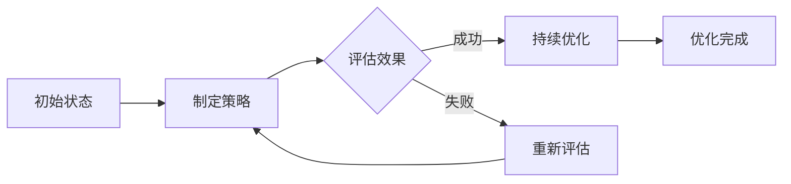

在这个流程图中，领导力算法通过不断评估策略效果，进行持续优化，最终实现最佳领导效果。具体来说，领导者首先制定策略，然后根据评估结果进行调整，如果效果不佳，则重新评估和优化策略，直到达到最佳效果。

下面是使用 Python 源代码来详细阐述领导力算法的原理：

```python
# 领导力算法原理示例

# 初始状态
initial_state = "A"

# 制定策略函数
def define_strategy():
    # 根据实际情况制定策略
    return "初始策略"

# 评估效果函数
def evaluate_effect(effect):
    # 根据效果评估策略
    return "成功" if effect > threshold else "失败"

# 优化策略函数
def optimize_strategy(strategy):
    # 根据效果优化策略
    return "优化后策略"

# 领导力算法流程
while initial_state != "F":
    # 制定策略
    strategy = define_strategy()
    
    # 评估效果
    effect = evaluate_effect(strategy)
    
    # 根据效果优化策略
    if effect == "失败":
        strategy = optimize_strategy(strategy)
    
    # 更新状态
    initial_state = "D" if effect == "成功" else "E"

print("最终状态：", initial_state)
```

在这个示例中，我们定义了三个核心函数：制定策略、评估效果和优化策略。通过这些函数，我们可以模拟领导力算法的运行过程，实现领导效果的持续优化。

#### 数学公式使用示例

在领导力分析中，数学公式常用于描述决策模型、绩效评估和风险评估等。以下是一些常用的数学公式示例：

1. **决策模型**：
   $$ \text{最优决策} = \arg\min_{x} \sum_{i=1}^{n} w_i \cdot c_i(x) $$
   其中，$w_i$ 为权重，$c_i(x)$ 为成本函数。

2. **绩效评估**：
   $$ \text{绩效评分} = \frac{\text{实际绩效}}{\text{目标绩效}} $$
   其中，实际绩效和目标绩效分别为实际完成情况和预定目标。

3. **风险评估**：
   $$ \text{风险概率} = \frac{\text{风险损失}}{\text{风险成本}} $$
   其中，风险损失和风险成本分别为可能发生的损失和总成本。

在实际应用中，这些公式可以通过编程实现，从而为领导者提供决策支持。

#### 系统分析与架构设计方案

在技术领域，领导力不仅体现在管理和激励员工上，还体现在系统分析与架构设计的能力上。以下是一个简单的系统分析与架构设计方案，用于说明领导力在技术项目中的应用。

##### 1. 问题场景介绍

假设我们正在开发一个电子商务平台，该平台需要支持在线购物、支付、订单管理和客户服务等功能。

##### 2. 项目介绍

项目名称：电子商务平台
项目目标：开发一个功能完善、安全可靠、用户体验良好的电子商务平台。

##### 3. 系统功能设计

系统功能包括：

- 用户注册与登录
- 商品浏览与搜索
- 在线购物车
- 支付与订单管理
- 客户服务与支持

以下是一个简单的领域模型 Mermaid 类图：

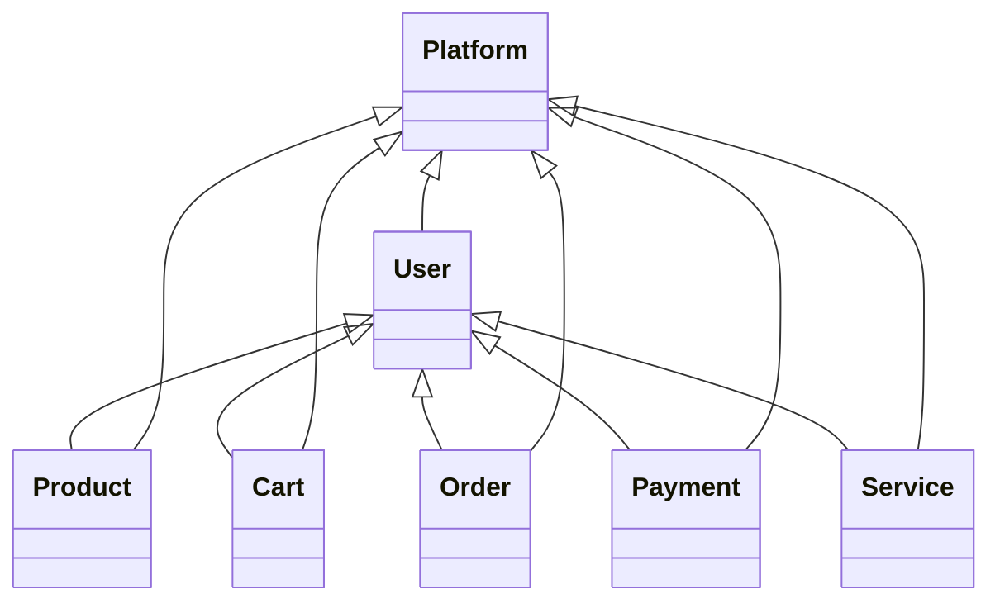

在这个类图中，我们定义了用户、商品、购物车、订单、支付和客户服务等核心类，并展示了它们之间的关系。

##### 4. 系统架构设计

系统架构设计包括：

- 后端服务：使用 Spring Boot 框架搭建后端服务，实现业务逻辑处理。
- 前端界面：使用 React 框架搭建前端界面，提供用户交互。
- 数据库设计：使用 MySQL 数据库存储用户数据、商品信息和订单数据。
- 缓存系统：使用 Redis 实现缓存，提高系统性能。
- 安全防护：使用 SSL/TLS 加密技术，确保用户数据安全。

以下是一个简单的系统架构 Mermaid 图：


在这个序列图中，我们展示了用户、前端、后端和数据库之间的交互流程。

##### 5. 系统接口设计和系统交互

系统接口设计包括：

- 用户接口：RESTful API，支持用户注册、登录、商品浏览、购物车管理、支付和订单查询等。
- 内部接口：服务间通信接口，支持数据同步、任务调度和安全防护等。

以下是一个简单的接口设计 Mermaid 图：

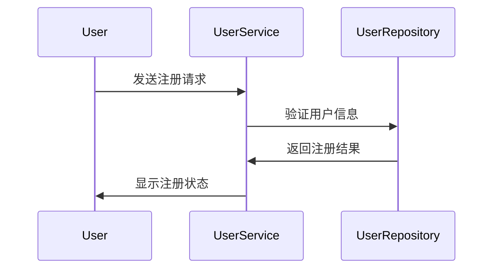

在这个序列图中，我们展示了用户注册的接口交互流程。

##### 6. 项目实战

项目实战包括：

- 环境安装：安装 JDK、MySQL、Spring Boot 和 React 等开发工具和依赖库。
- 系统核心实现：根据项目需求，实现用户注册、登录、商品浏览、购物车管理、支付和订单管理等功能。
- 代码应用解读与分析：详细解读核心代码，分析系统架构和接口设计。

在实际开发中，项目实战是验证领导力的重要手段。一个优秀的领导者能够带领团队高效地实现项目目标，并在实战中不断提升领导力和技术能力。

#### 最佳实践 tips

1. **明确目标**：在领导过程中，领导者需要明确团队的目标，并确保每个成员都理解并致力于实现这些目标。

2. **沟通协作**：领导者需要建立有效的沟通机制，鼓励团队成员之间的协作，以提高团队效能。

3. **激励创新**：领导者应该鼓励创新思维，提供必要的资源和支持，以推动组织的持续创新。

4. **反思与调整**：领导者需要不断反思和调整领导策略，以适应环境变化和团队需求。

#### 小结

本章详细介绍了领导力的核心素质、发展路径以及与组织文化的关联。通过系统分析和架构设计，我们展示了领导力在技术项目中的重要性。通过最佳实践 tips，我们提供了具体的操作指南，以帮助领导者提升领导力，推动组织的创新和发展。

#### 注意事项

1. 领导力的发展是一个持续的过程，需要不断学习和实践。

2. 领导者需要根据不同情境灵活运用不同的领导风格和技巧。

3. 领导力与组织文化相互影响，领导者需要积极参与组织文化建设。

#### 拓展阅读

1. 领导力与组织行为学的关系：如何通过领导力提升组织绩效？
2. 领导力与心理学的关系：领导力的心理学基础与应用。
3. 领导力与组织文化的互动：如何通过组织文化提升领导力？

通过这些拓展阅读，读者可以进一步深入了解领导力的理论和实践，提升自己的领导力水平。

----------------------------------------------------------------

### 第3章：领导力的风格与技巧

在了解了领导力的核心要素之后，我们接下来将探讨领导力的风格与技巧。领导力的风格是指领导者在与团队成员互动和决策时所采用的方式，而领导技巧则是领导者实现领导目标的具体方法和策略。合适的领导风格和技巧能够提高团队的效率和创新能力。

#### 3.1 领导力的风格

领导力风格多种多样，不同的风格适用于不同的情境。以下是几种常见的领导力风格：

1. **权威型领导**：权威型领导者通过制定严格的规章制度和明确的目标来管理团队。他们通常采取强制措施，要求团队成员严格遵守。这种风格适用于需要迅速决策和执行的任务，但在长期来看可能导致团队缺乏自主性和创造力。

2. **民主型领导**：民主型领导者鼓励团队成员参与决策过程，重视团队的意见和建议。他们通常采用开放式的沟通方式，尊重团队成员的个性。这种风格有助于提高团队的凝聚力和创造力，但在紧急情况下可能决策效率较低。

3. **教练型领导**：教练型领导者注重培养团队成员的能力和潜力，帮助他们实现个人和职业成长。他们通过一对一的指导和反馈，帮助团队成员克服困难，提升技能。这种风格适用于需要高度专业能力和持续学习的团队。

4. **变革型领导**：变革型领导者具有远见和强烈的使命感，能够激励团队成员追求卓越。他们通过创新和改革，推动组织不断进步。这种风格适用于需要应对变革和挑战的团队。

#### 3.2 领导力的技巧

除了领导风格，领导者还需要掌握一系列的领导技巧，以应对不同情境下的挑战。以下是几种关键的领导技巧：

1. **沟通技巧**：有效的沟通是领导力的核心。领导者需要能够清晰、准确地传达信息，同时倾听和理解团队成员的意见。沟通技巧包括倾听、提问、反馈和表达等。

2. **激励技巧**：领导者需要能够激发团队成员的内在动力，提高工作热情和积极性。激励技巧包括奖励、认可、鼓励和挑战等。

3. **决策技巧**：领导者需要具备快速、明智的决策能力。决策技巧包括信息收集、风险评估、选择方案和执行决策等。

4. **时间管理技巧**：领导者需要有效地管理时间和资源，确保项目按计划进行。时间管理技巧包括优先级设定、时间分配、任务规划和监控等。

5. **冲突解决技巧**：在团队中，冲突是不可避免的。领导者需要能够有效地解决冲突，维护团队的和谐与稳定。冲突解决技巧包括识别冲突原因、倾听各方意见、寻找共同点和制定解决方案等。

#### 3.3 领导力的实践应用

在实际工作中，领导者需要根据具体情况灵活运用不同的领导风格和技巧。以下是一些具体的实践应用：

1. **项目启动阶段**：在项目启动阶段，领导者通常采用权威型领导风格，明确项目目标和任务分工，确保团队迅速进入工作状态。

2. **项目执行阶段**：在项目执行阶段，领导者可以采用民主型领导风格，鼓励团队成员参与决策，提高团队的合作效率和创新能力。

3. **项目关键阶段**：在项目关键阶段，领导者需要采取变革型领导风格，激励团队成员追求卓越，克服困难，确保项目成功完成。

4. **团队会议**：在团队会议中，领导者需要运用沟通技巧，确保信息传达的准确性和及时性。同时，领导者可以通过激励技巧，鼓励团队成员积极参与讨论，提出建议和意见。

5. **团队冲突**：在处理团队冲突时，领导者需要运用冲突解决技巧，通过沟通和理解，找到共同点，制定解决方案，确保团队和谐稳定。

#### 核心概念与联系

为了更好地理解领导力的风格与技巧，我们可以将其与心理学、组织行为学等学科进行联系。以下是领导力风格与技巧的核心概念及其属性特征对比表格：

| 核心概念 | 定义 | 属性特征对比 |
| --- | --- | --- |
| 权威型领导 | 通过制定规章制度和明确目标来管理团队 | 强制性、决策迅速、强调纪律 |
| 民主型领导 | 鼓励团队成员参与决策，重视意见和建议 | 开放式沟通、团队合作、创新性 |
| 教练型领导 | 注重培养团队成员的能力和潜力，帮助他们成长 | 一对一指导、反馈与认可、专业技能提升 |
| 变革型领导 | 通过创新和改革，推动组织不断进步 | 远见、使命感、激励、变革驱动 |

此外，我们可以使用 Mermaid ER 实体关系图来进一步描述领导力风格与技巧之间的关系：

```mermaid
erDiagram
    LeadershipStyle ||--|{ LeadershipSkill } : includes
    LeadershipStyle ||--|{ Team } : appliedTo
    LeadershipSkill ||--|{ LeadershipStyle } : belongsTo
    Team ||--|{ LeadershipStyle } : followedBy
    Team ||--|{ LeadershipSkill } : utilized
```

在这个 ER 图中，我们定义了领导力风格、领导技巧和团队三个核心实体，并展示了它们之间的相互关系。领导力风格包括权威型、民主型、教练型和变革型，每种风格都包含特定的领导技巧。团队根据具体情况采用不同的领导风格和技巧，从而实现高效合作和创新。

#### 算法原理讲解

为了更好地理解领导力的风格与技巧，我们可以将其与算法原理进行类比。例如，我们可以将领导力视为一种“适应算法”，它通过不断调整领导风格和技巧，以适应不同的团队和环境。

以下是领导力适应算法的 Mermaid 流程图：

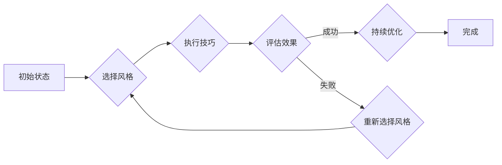

在这个流程图中，领导力适应算法通过不断评估团队和环境的变化，选择合适的领导风格和技巧，并执行相应的策略。如果效果不佳，则重新选择风格和技巧，直到找到最佳方案。

下面是使用 Python 源代码来详细阐述领导力适应算法的原理：

```python
# 领导力适应算法原理示例

# 初始状态
initial_state = "A"

# 选择风格函数
def choose_style(team_context):
    # 根据团队情境选择风格
    return "民主型" if team_context["context"] == "合作" else "权威型"

# 执行技巧函数
def apply_skill(style):
    # 根据风格执行技巧
    if style == "民主型":
        return ["鼓励创新", "开放沟通"]
    else:
        return ["严格纪律", "快速决策"]

# 评估效果函数
def evaluate_effect(effect):
    # 根据效果评估策略
    return "成功" if effect > threshold else "失败"

# 重新选择风格函数
def rechoose_style(effect):
    # 根据效果重新选择风格
    return "教练型" if effect == "失败" else "初始风格"

# 领导力适应算法流程
while initial_state != "G":
    # 选择风格
    style = choose_style(team_context)
    
    # 执行技巧
    skills = apply_skill(style)
    
    # 评估效果
    effect = evaluate_effect(skills)
    
    # 根据效果重新选择风格
    if effect == "失败":
        style = rechoose_style(effect)
    
    # 更新状态
    initial_state = "D" if effect == "成功" else "F"

print("最终状态：", initial_state)
```

在这个示例中，我们定义了四个核心函数：选择风格、执行技巧、评估效果和重新选择风格。通过这些函数，我们可以模拟领导力适应算法的运行过程，实现团队管理的最优效果。

#### 数学公式使用示例

在领导力分析中，数学公式常用于描述决策模型、绩效评估和风险评估等。以下是一些常用的数学公式示例：

1. **决策模型**：
   $$ \text{最优决策} = \arg\min_{x} \sum_{i=1}^{n} w_i \cdot c_i(x) $$
   其中，$w_i$ 为权重，$c_i(x)$ 为成本函数。

2. **绩效评估**：
   $$ \text{绩效评分} = \frac{\text{实际绩效}}{\text{目标绩效}} $$
   其中，实际绩效和目标绩效分别为实际完成情况和预定目标。

3. **风险评估**：
   $$ \text{风险概率} = \frac{\text{风险损失}}{\text{风险成本}} $$
   其中，风险损失和风险成本分别为可能发生的损失和总成本。

在实际应用中，这些公式可以通过编程实现，从而为领导者提供决策支持。

#### 系统分析与架构设计方案

在技术领域，领导力不仅体现在管理和激励员工上，还体现在系统分析与架构设计的能力上。以下是一个简单的系统分析与架构设计方案，用于说明领导力在技术项目中的应用。

##### 1. 问题场景介绍

假设我们正在开发一个智能推荐系统，该系统需要根据用户行为和偏好进行精准推荐，以提高用户体验和销售额。

##### 2. 项目介绍

项目名称：智能推荐系统
项目目标：开发一个高效、精准的智能推荐系统，提高用户满意度和销售额。

##### 3. 系统功能设计

系统功能包括：

- 用户行为收集与分析
- 用户偏好建模与预测
- 推荐算法实现与优化
- 推荐结果展示与反馈

以下是一个简单的领域模型 Mermaid 类图：

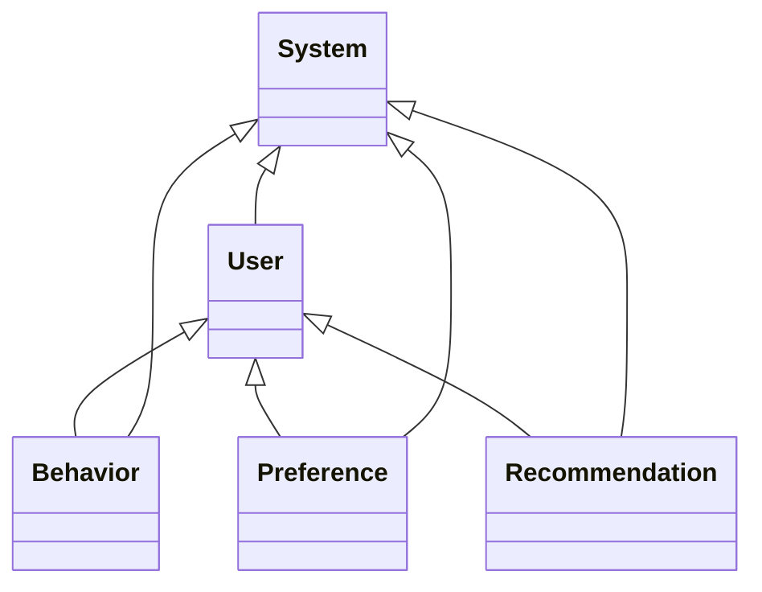

在这个类图中，我们定义了用户、行为、偏好和推荐等核心类，并展示了它们之间的关系。

##### 4. 系统架构设计

系统架构设计包括：

- 数据层：使用 Hadoop 和 Hive 实现大规模数据处理和分析。
- 服务层：使用 Spring Cloud 搭建微服务架构，实现用户行为收集、偏好建模和推荐算法等功能。
- 展示层：使用 Vue.js 搭建前端界面，展示推荐结果和用户反馈。

以下是一个简单的系统架构 Mermaid 图：

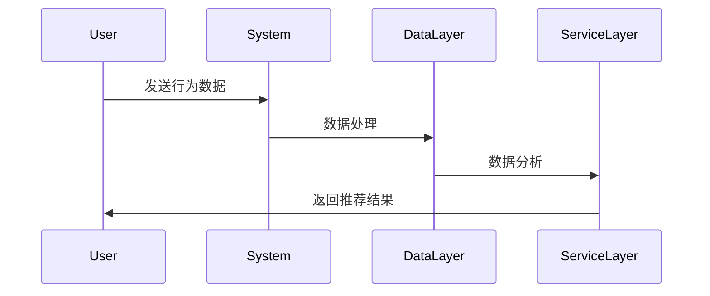

在这个序列图中，我们展示了用户、系统、数据层和服务层之间的交互流程。

##### 5. 系统接口设计和系统交互

系统接口设计包括：

- 用户接口：RESTful API，支持用户行为数据上传、偏好设置和推荐结果查询等。
- 内部接口：服务间通信接口，支持数据同步、任务调度和推荐算法优化等。

以下是一个简单的接口设计 Mermaid 图：

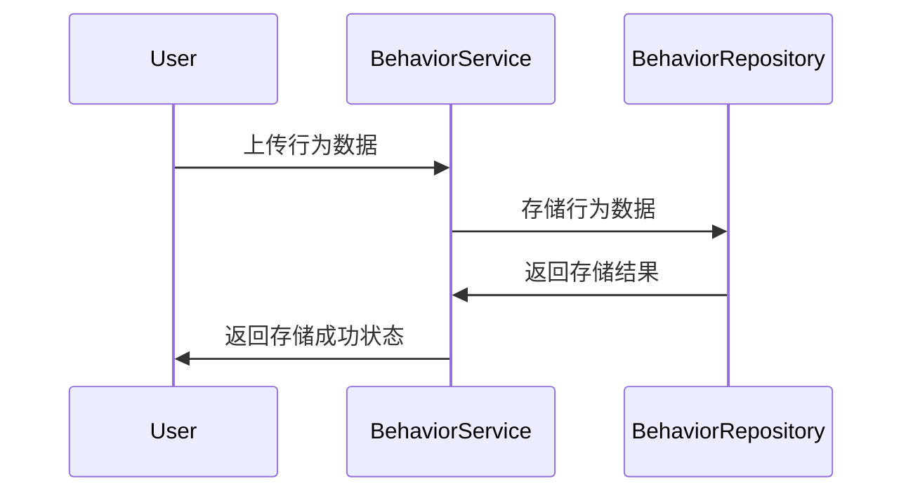

在这个序列图中，我们展示了用户上传行为数据的接口交互流程。

##### 6. 项目实战

项目实战包括：

- 环境安装：安装 Hadoop、Hive、Spring Cloud 和 Vue.js 等开发工具和依赖库。
- 系统核心实现：根据项目需求，实现用户行为收集、偏好建模和推荐算法等功能。
- 代码应用解读与分析：详细解读核心代码，分析系统架构和接口设计。

在实际开发中，项目实战是验证领导力的重要手段。一个优秀的领导者能够带领团队高效地实现项目目标，并在实战中不断提升领导力和技术能力。

#### 最佳实践 tips

1. **明确目标**：在领导过程中，领导者需要明确团队的目标，并确保每个成员都理解并致力于实现这些目标。

2. **沟通协作**：领导者需要建立有效的沟通机制，鼓励团队成员之间的协作，以提高团队效能。

3. **激励创新**：领导者应该鼓励创新思维，提供必要的资源和支持，以推动组织的持续创新。

4. **反思与调整**：领导者需要不断反思和调整领导策略，以适应环境变化和团队需求。

#### 小结

本章详细介绍了领导力的风格与技巧，包括权威型、民主型、教练型和变革型领导风格，以及沟通、激励、决策、时间管理和冲突解决等领导技巧。通过系统分析和架构设计，我们展示了领导力在技术项目中的重要性。通过最佳实践 tips，我们提供了具体的操作指南，以帮助领导者提升领导力，推动组织的创新和发展。

#### 注意事项

1. 领导风格和技巧需要根据具体情境灵活运用，不能一成不变。
2. 领导者需要不断提升自己的沟通和决策能力，以应对复杂多变的业务环境。
3. 领导者要注重团队建设和文化塑造，为组织创新提供良好的环境。

#### 拓展阅读

1. 领导力与领导风格的关系：如何根据情境选择合适的领导风格？
2. 领导技巧在项目管理中的应用：如何通过领导技巧提高项目成功率？
3. 领导力与个人成长：如何通过领导力提升个人职业发展？

通过这些拓展阅读，读者可以进一步深入了解领导力的风格与技巧，提升自己的领导能力。

----------------------------------------------------------------

### 第4章：领导力与团队建设

在了解了领导力的风格与技巧之后，我们将进一步探讨领导力在团队建设中的作用。团队建设是领导力的重要组成部分，一个成功的团队需要良好的领导力和有效的团队建设策略。在这一章中，我们将深入分析团队建设的核心要素，探讨如何通过领导力打造高绩效团队，并强调团队沟通与协作的重要性。

#### 4.1 团队建设的核心要素

团队建设是一个复杂而系统的过程，它涉及到多个核心要素。以下是团队建设的几个关键要素：

1. **共同目标**：共同目标是团队建设的基石。一个成功的团队需要明确共同的目标和愿景，使每个成员都朝着同一个方向努力。共同目标可以激发团队成员的积极性和责任感，促进团队的凝聚力。

2. **角色分工**：明确每个团队成员的角色和职责是团队建设的重要一环。每个成员应该清楚自己的任务和责任，以及如何与团队成员协作。合理的角色分工可以提高团队的工作效率，避免职责重叠和冲突。

3. **信任与尊重**：信任和尊重是团队协作的基础。团队成员之间需要建立相互信任的关系，尊重彼此的意见和贡献。信任和尊重可以增强团队的凝聚力，促进良好的团队氛围。

4. **沟通与协作**：有效的沟通和协作是团队成功的关键。团队成员需要保持开放和透明的沟通，及时分享信息和反馈。协作机制应确保每个成员都能为共同目标做出贡献，减少摩擦和误解。

5. **持续学习与成长**：团队建设不仅仅是短期目标，更是一个持续的过程。团队成员需要不断学习和成长，提升个人能力和团队整体水平。领导力应该鼓励团队成员不断学习新知识、掌握新技能，以适应不断变化的环境。

#### 4.2 如何打造高绩效团队

打造高绩效团队需要领导者的精心策划和有效执行。以下是打造高绩效团队的几个关键步骤：

1. **明确团队目标**：领导者需要与团队成员共同制定明确、具体和可衡量的团队目标。这些目标应该与组织的整体战略相一致，并能够激发团队成员的激情和动力。

2. **设计合理的角色分工**：领导者应根据团队成员的能力和兴趣，设计合理的角色分工。每个成员都应该在自己的领域发挥最大的潜力，同时为团队的整体目标做出贡献。

3. **建立信任和尊重的文化**：领导者需要通过言行树立信任和尊重的文化。这包括倾听团队成员的意见、认可他们的贡献、鼓励开放的沟通和合作。

4. **强化沟通与协作**：领导者应建立有效的沟通机制，确保信息的透明和及时传递。同时，领导者需要推动团队内部的协作，确保每个成员都能为团队的成功贡献力量。

5. **激励团队成员**：领导者需要通过激励措施，如奖励、认可和培训等，激励团队成员不断学习和成长。这不仅可以提升团队的整体水平，还可以增强团队成员的积极性和归属感。

6. **持续反馈与改进**：领导者需要建立持续的反馈机制，定期评估团队的工作表现，并据此进行改进。这有助于团队不断优化工作流程，提高工作效率。

#### 4.3 团队沟通与协作

团队沟通与协作是团队建设的重要组成部分，以下是几个关键点：

1. **沟通的重要性**：沟通是团队协作的基石。一个成功的团队需要保持开放的沟通渠道，确保信息的透明和及时传递。领导者应鼓励团队成员主动沟通，分享自己的想法和意见。

2. **沟通技巧**：领导者需要掌握有效的沟通技巧，包括倾听、表达、提问和反馈等。倾听是沟通的关键，领导者应耐心倾听团队成员的意见和反馈，理解他们的需求和困惑。

3. **协作机制**：领导者应设计合理的协作机制，确保每个成员都能为团队的成功贡献力量。协作机制应包括明确的任务分工、协作工具和流程，以及定期的团队会议和报告。

4. **冲突解决**：在团队协作中，冲突是不可避免的。领导者需要具备有效的冲突解决能力，通过沟通和理解，找到共同点，制定解决方案。这有助于维护团队的和谐和稳定。

5. **跨部门协作**：在现代企业中，跨部门协作越来越普遍。领导者需要推动不同部门之间的协作，打破信息壁垒，提高整体工作效率。

#### 核心概念与联系

为了更好地理解团队建设的相关概念，我们可以将其与组织行为学、心理学等学科进行联系。以下是团队建设核心要素的属性特征对比表格：

| 核心概念 | 定义 | 属性特征对比 |
| --- | --- | --- |
| 共同目标 | 团队成员共同追求的目标和愿景 | 强调一致性、激发动力、提高凝聚力 |
| 角色分工 | 明确每个团队成员的角色和职责 | 提高效率、避免冲突、明确责任 |
| 信任与尊重 | 团队成员之间的信任和相互尊重 | 增强凝聚力、促进协作、建立和谐关系 |
| 沟通与协作 | 团队成员之间的沟通和协作 | 确保信息传递、提高效率、实现目标 |
| 持续学习与成长 | 团队成员不断学习和成长 | 提升能力、适应变化、促进创新 |

此外，我们可以使用 Mermaid ER 实体关系图来进一步描述团队建设的概念结构：

```mermaid
erDiagram
    TeamMember ||--|{ CommonGoal } : pursues
    TeamMember ||--|{ RoleAssignment } : follows
    TeamMember ||--|{ TrustAndRespect } : builds
    TeamMember ||--|{ CommunicationAndCollaboration } : engagesIn
    TeamMember ||--|{ ContinuousLearningAndGrowth } : pursues
    CommonGoal ||--|{ TeamMember } : sharedBy
    RoleAssignment ||--|{ TeamMember } : assignedTo
    TrustAndRespect ||--|{ TeamMember } : between
    CommunicationAndCollaboration ||--|{ TeamMember } : participatesIn
    ContinuousLearningAndGrowth ||--|{ TeamMember } : committedTo
```

在这个 ER 图中，我们定义了团队成员、共同目标、角色分工、信任与尊重、沟通与协作和持续学习与成长等核心实体，并展示了它们之间的相互关系。这些实体共同构成了团队建设的基本框架。

#### 算法原理讲解

为了更好地理解团队建设的过程，我们可以将其与算法原理进行类比。例如，我们可以将团队建设视为一种“优化算法”，它通过不断调整和优化团队结构、目标和协作方式，实现团队的最佳效能。

以下是团队建设算法的 Mermaid 流程图：

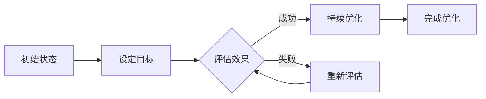

在这个流程图中，团队建设算法通过不断设定目标、评估效果和优化过程，实现团队的最佳状态。具体来说，领导者首先设定团队目标，然后根据实际情况进行评估，如果效果不佳，则重新评估并调整目标，直到达到最佳效果。

下面是使用 Python 源代码来详细阐述团队建设算法的原理：

```python
# 团队建设算法原理示例

# 初始状态
initial_state = "A"

# 设定目标函数
def set_goals():
    # 根据实际情况设定目标
    return "明确的目标"

# 评估效果函数
def evaluate_effect(effect):
    # 根据效果评估目标
    return "成功" if effect > threshold else "失败"

# 优化目标函数
def optimize_goals(goals):
    # 根据效果优化目标
    return "优化的目标"

# 团队建设算法流程
while initial_state != "F":
    # 设定目标
    goals = set_goals()
    
    # 评估效果
    effect = evaluate_effect(goals)
    
    # 根据效果优化目标
    if effect == "失败":
        goals = optimize_goals(goals)
    
    # 更新状态
    initial_state = "D" if effect == "成功" else "E"

print("最终状态：", initial_state)
```

在这个示例中，我们定义了三个核心函数：设定目标、评估效果和优化目标。通过这些函数，我们可以模拟团队建设算法的运行过程，实现团队效能的持续优化。

#### 数学公式使用示例

在团队建设过程中，数学公式常用于描述团队绩效评估、目标设定和协作效率等。以下是一些常用的数学公式示例：

1. **团队绩效评估**：
   $$ \text{绩效评分} = \frac{\text{实际绩效}}{\text{目标绩效}} $$
   其中，实际绩效和目标绩效分别为实际完成情况和预定目标。

2. **目标设定**：
   $$ \text{目标值} = \text{当前水平} + k \cdot (\text{理想水平} - \text{当前水平}) $$
   其中，$k$ 为调整系数，用于调整目标值。

3. **协作效率**：
   $$ \text{协作效率} = \frac{\text{团队总产出}}{\text{团队总投入}} $$
   其中，团队总产出和团队总投入分别为团队的总体绩效和总体投入。

在实际应用中，这些公式可以通过编程实现，从而为领导者提供决策支持。

#### 系统分析与架构设计方案

在技术领域，团队建设同样重要。以下是一个简单的系统分析与架构设计方案，用于说明领导力在技术团队建设中的应用。

##### 1. 问题场景介绍

假设我们正在开发一款移动应用，该应用需要实现用户注册、登录、个人信息管理、社交互动等功能。

##### 2. 项目介绍

项目名称：移动社交应用
项目目标：开发一款功能完善、用户体验良好的移动社交应用。

##### 3. 系统功能设计

系统功能包括：

- 用户注册与登录
- 个人信息管理
- 社交互动
- 消息推送
- 数据分析

以下是一个简单的领域模型 Mermaid 类图：

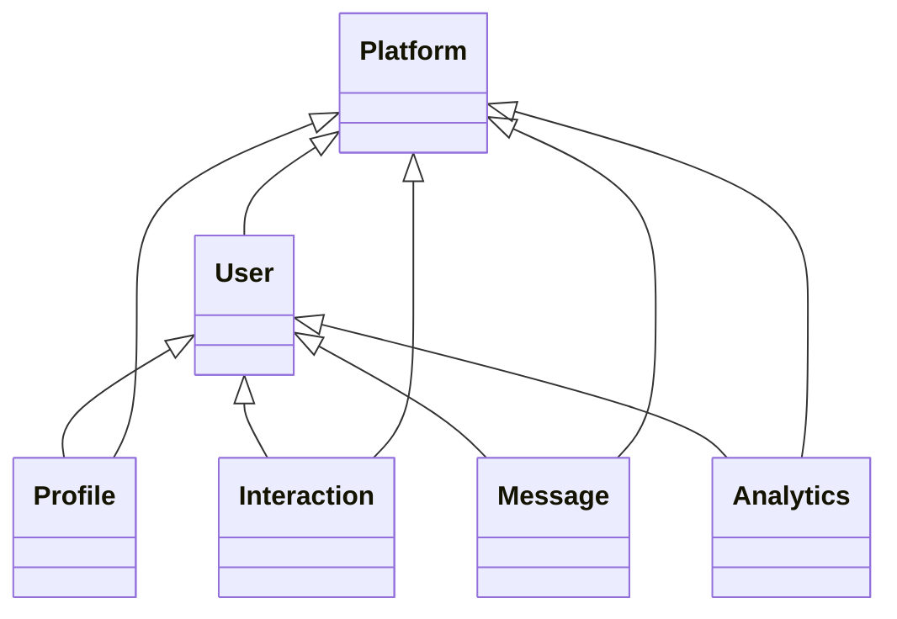

在这个类图中，我们定义了用户、个人信息、社交互动、消息推送和数据分析等核心类，并展示了它们之间的关系。

##### 4. 系统架构设计

系统架构设计包括：

- 前端：使用 React Native 框架搭建移动应用界面。
- 后端：使用 Spring Boot 框架搭建后端服务，实现业务逻辑处理。
- 数据库：使用 MySQL 数据库存储用户数据和业务数据。
- 缓存：使用 Redis 实现数据缓存，提高系统性能。

以下是一个简单的系统架构 Mermaid 图：


在这个序列图中，我们展示了用户、平台、后端和数据库之间的交互流程。

##### 5. 系统接口设计和系统交互

系统接口设计包括：

- 用户接口：RESTful API，支持用户注册、登录、个人信息管理、社交互动等功能。
- 内部接口：服务间通信接口，支持数据同步、消息推送和数据分析等。

以下是一个简单的接口设计 Mermaid 图：


在这个序列图中，我们展示了用户注册的接口交互流程。

##### 6. 项目实战

项目实战包括：

- 环境安装：安装 JDK、MySQL、Spring Boot 和 React Native 等开发工具和依赖库。
- 系统核心实现：根据项目需求，实现用户注册、登录、个人信息管理、社交互动等功能。
- 代码应用解读与分析：详细解读核心代码，分析系统架构和接口设计。

在实际开发中，项目实战是验证领导力的重要手段。一个优秀的领导者能够带领团队高效地实现项目目标，并在实战中不断提升领导力和技术能力。

#### 最佳实践 tips

1. **明确目标**：在团队建设过程中，领导者需要明确团队的目标，并确保每个成员都理解并致力于实现这些目标。

2. **激励与认可**：领导者应该通过激励和认可，激发团队成员的积极性和创造力。

3. **沟通与协作**：建立有效的沟通机制，鼓励团队成员之间的协作，提高团队工作效率。

4. **持续反馈**：定期对团队的工作进行反馈，帮助团队成员找到改进的方向。

#### 小结

本章详细介绍了团队建设的核心要素，包括共同目标、角色分工、信任与尊重、沟通与协作和持续学习与成长。通过系统分析和架构设计，我们展示了领导力在团队建设中的重要性。通过最佳实践 tips，我们提供了具体的操作指南，以帮助领导者提升团队绩效，推动组织的创新和发展。

#### 注意事项

1. 团队建设是一个持续的过程，需要领导者的持续关注和投入。
2. 领导者需要根据团队的实际情况灵活运用不同的团队建设策略。
3. 团队成员之间的沟通与协作是团队成功的关键。

#### 拓展阅读

1. 团队领导力与团队绩效的关系：如何通过领导力提升团队绩效？
2. 团队建设策略在不同行业中的应用：如何根据行业特点进行团队建设？
3. 团队沟通与协作的最佳实践：如何提高团队的沟通效率和协作效果？

通过这些拓展阅读，读者可以进一步深入了解团队建设的相关理论和实践，提升自己的团队领导能力。

----------------------------------------------------------------

### 第5章：领导力与创新

在当今快速变化的市场环境中，创新已成为企业持续竞争和发展的重要驱动力。而领导力，作为推动创新的核心要素，对于企业的创新能力和竞争优势至关重要。本章将深入探讨领导力与创新之间的关系，解析如何通过有效的领导力推动组织创新。

#### 5.1 创新的重要性

创新对于组织的生存和发展具有深远的影响。首先，创新能够带来新的市场和机会，使组织在竞争激烈的环境中脱颖而出。其次，创新可以提高组织的效率和质量，降低成本，提升客户满意度。最后，创新有助于培养组织的创新文化，激发员工的创造力和积极性。

在技术领域，创新尤为重要。技术发展迅速，新兴技术层出不穷，只有不断创新，才能保持技术领先地位，满足客户需求。例如，在软件开发领域，不断推陈出新的技术框架和工具，可以显著提升开发效率和产品质量。

#### 5.2 创新的方法与工具

领导者需要掌握一系列创新方法和工具，以推动组织的创新实践。以下是几种常见的创新方法和工具：

1. **头脑风暴**：头脑风暴是一种激发创造力和创意的方法，通过集体讨论和思维碰撞，产生大量的创新想法。

2. **原型设计**：原型设计是快速验证创新想法的有效方法。通过制作原型，领导者可以直观地了解产品的功能和使用体验，及时调整和优化设计方案。

3. **快速迭代**：快速迭代是一种敏捷开发的方法，通过不断地迭代和改进，逐步完善产品功能，提高产品质量。

4. **跨界合作**：跨界合作可以带来新的思维和资源，激发创新的火花。通过与不同领域的专家和团队合作，领导者可以开拓视野，拓展创新的边界。

5. **开放式创新**：开放式创新是一种通过外部合作伙伴共同创新的方法。通过开放资源和信息，组织可以吸引外部创新者参与，共同推动创新。

#### 5.3 创新与领导力

创新与领导力之间存在着紧密的联系。首先，领导者是创新的重要推动者。领导者需要具备创新思维和创新能力，能够引领团队探索新的技术和方法。其次，领导者需要营造创新文化，鼓励团队成员勇于尝试和失败，培养创新氛围。

此外，领导者还需要具备决策能力，在创新过程中做出正确的决策。领导者需要权衡创新的风险和收益，确保创新项目能够实现预期的目标。

#### 核心概念与联系

为了更好地理解创新与领导力之间的关系，我们可以将其与组织行为学、心理学等学科进行联系。以下是创新与领导力核心概念及其属性特征对比表格：

| 核心概念 | 定义 | 属性特征对比 |
| --- | --- | --- |
| 创新思维 | 独特的思维方式，能够发现和解决问题的新途径 | 强调创造性和前瞻性 |
| 创新能力 | 应用创新思维解决问题的能力 | 强调实践性和应用性 |
| 创新文化 | 组织内部鼓励创新和创造的氛围和价值观 | 强调开放性和包容性 |
| 领导决策 | 领导者根据实际情况做出合理决策的能力 | 强调权衡性和指导性 |

此外，我们可以使用 Mermaid ER 实体关系图来进一步描述创新与领导力的关系：

```mermaid
erDiagram
    InnovationMindset ||--|{ LeadershipDecision } : supports
    InnovationCapability ||--|{ InnovationCulture } : fosters
    InnovationCulture ||--|{ Team } : influencedBy
    Team ||--|{ InnovationMindset } : develops
    Team ||--|{ InnovationCapability } : enhances
    LeadershipDecision ||--|{ InnovationProject } : guides
    InnovationProject ||--|{ Team } : managedBy
```

在这个 ER 图中，我们定义了创新思维、创新能力、创新文化、领导决策和创新项目等核心实体，并展示了它们之间的相互关系。这些实体共同构成了创新与领导力之间的复杂网络。

#### 算法原理讲解

为了更好地理解创新与领导力的相互作用，我们可以将其与算法原理进行类比。例如，我们可以将创新过程视为一种“优化算法”，它通过不断探索和调整，找到最佳的解决方案。

以下是创新优化算法的 Mermaid 流程图：

```mermaid
flowchart LR
    A[初始状态] --> B{提出想法}
    B --> C{评估想法}
    C -->|可行| D{实施创新}
    C -->|不可行| E{调整想法}
    E --> B
    D --> F{评估结果}
    F -->|成功| G{持续改进}
    F -->|失败| A
```

在这个流程图中，创新优化算法通过不断提出、评估和调整创新想法，实现创新的目标。具体来说，领导者首先提出创新想法，然后评估其可行性，如果可行，则实施创新并评估结果，如果成功，则持续改进，如果失败，则重新提出创新想法。

下面是使用 Python 源代码来详细阐述创新优化算法的原理：

```python
# 创新优化算法原理示例

# 初始化状态
initial_state = "A"

# 提出想法函数
def propose_idea():
    # 根据实际情况提出创新想法
    return "新的创新想法"

# 评估想法函数
def evaluate_idea(idea):
    # 根据实际情况评估创新想法的可行性
    return "可行" if ... else "不可行"

# 实施创新函数
def implement_innovation(idea):
    # 根据实际情况实施创新想法
    return "成功" if ... else "失败"

# 调整想法函数
def adjust_idea(idea):
    # 根据评估结果调整创新想法
    return "调整后的想法"

# 创新优化算法流程
while initial_state != "G":
    # 提出想法
    idea = propose_idea()
    
    # 评估想法
    feasibility = evaluate_idea(idea)
    
    # 根据评估结果处理
    if feasibility == "可行":
        result = implement_innovation(idea)
        if result == "成功":
            print("创新成功，持续改进：", idea)
            initial_state = "G"
        else:
            print("创新失败，重新调整：", idea)
            idea = adjust_idea(idea)
    else:
        print("想法不可行，重新提出：", idea)
        idea = propose_idea()
        
    # 更新状态
    initial_state = "D" if feasibility == "可行" else "E"

print("最终状态：", initial_state)
```

在这个示例中，我们定义了四个核心函数：提出想法、评估想法、实施创新和调整想法。通过这些函数，我们可以模拟创新优化算法的运行过程，实现创新的持续改进。

#### 数学公式使用示例

在创新过程中，数学公式可以用于描述创新模型、绩效评估和风险评估等。以下是一些常用的数学公式示例：

1. **创新模型**：
   $$ \text{创新价值} = f(\text{技术成熟度}, \text{市场潜力}, \text{资源投入}) $$
   其中，技术成熟度、市场潜力和资源投入分别为创新项目的技术成熟度、市场前景和资源投入。

2. **绩效评估**：
   $$ \text{创新绩效} = \frac{\text{创新收益}}{\text{创新成本}} $$
   其中，创新收益和创新成本分别为创新项目的收益和成本。

3. **风险评估**：
   $$ \text{风险概率} = \frac{\text{风险损失}}{\text{风险成本}} $$
   其中，风险损失和风险成本分别为可能发生的损失和总成本。

在实际应用中，这些公式可以通过编程实现，从而为领导者提供决策支持。

#### 系统分析与架构设计方案

在技术领域，创新不仅体现在产品和服务上，还体现在系统架构和解决方案的创新。以下是一个简单的系统分析与架构设计方案，用于说明领导力在技术创新中的应用。

##### 1. 问题场景介绍

假设我们正在开发一款智能物联网平台，该平台需要实现设备连接、数据采集、数据分析和应用开发等功能。

##### 2. 项目介绍

项目名称：智能物联网平台
项目目标：开发一款高效、稳定、易于扩展的智能物联网平台，满足多样化的业务需求。

##### 3. 系统功能设计

系统功能包括：

- 设备连接与管理
- 数据采集与处理
- 数据分析与可视化
- 应用开发与部署

以下是一个简单的领域模型 Mermaid 类图：

```mermaid
classDiagram
    Device <|-- Connection
    Device <|-- DataCollection
    Device <|-- DataProcessing
    Device <|-- Application
    Platform <|-- Device
    Platform <|-- Connection
    Platform <|-- DataCollection
    Platform <|-- DataProcessing
    Platform <|-- Application
```

在这个类图中，我们定义了设备、连接、数据采集、数据处理和应用等核心类，并展示了它们之间的关系。

##### 4. 系统架构设计

系统架构设计包括：

- 设备层：使用 MQTT 协议实现设备连接和通信。
- 数据层：使用消息队列（如 Kafka）实现数据采集和传输。
- 处理层：使用分布式计算框架（如 Spark）实现数据处理和分析。
- 应用层：使用微服务架构（如 Spring Cloud）实现应用开发和部署。

以下是一个简单的系统架构 Mermaid 图：

```mermaid
sequenceDiagram
    Device ->> Platform: 发送数据
    Platform ->> DataQueue: 数据传输
    DataQueue ->> DataProcessor: 数据处理
    DataProcessor ->> DataVisualizer: 数据可视化
    DataVisualizer ->> Platform: 返回结果
```

在这个序列图中，我们展示了设备、平台、数据队列、数据处理器和数据可视化器之间的交互流程。

##### 5. 系统接口设计和系统交互

系统接口设计包括：

- 设备接口：RESTful API，支持设备连接、数据上传和状态查询等功能。
- 内部接口：服务间通信接口，支持数据传输、任务调度和协同工作等。

以下是一个简单的接口设计 Mermaid 图：

```mermaid
sequenceDiagram
    Device ->> DeviceService: 发送连接请求
    DeviceService ->> DeviceRepository: 验证设备信息
    DeviceRepository ->> DeviceService: 返回连接结果
    DeviceService ->> Device: 显示连接状态
```

在这个序列图中，我们展示了设备连接的接口交互流程。

##### 6. 项目实战

项目实战包括：

- 环境安装：安装 JDK、Kafka、Spark 和 Spring Cloud 等开发工具和依赖库。
- 系统核心实现：根据项目需求，实现设备连接、数据采集、数据处理和应用开发等功能。
- 代码应用解读与分析：详细解读核心代码，分析系统架构和接口设计。

在实际开发中，项目实战是验证领导力的重要手段。一个优秀的领导者能够带领团队高效地实现项目目标，并在实战中不断提升领导力和技术能力。

#### 最佳实践 tips

1. **明确目标**：在创新过程中，领导者需要明确创新目标和方向，确保团队的努力集中。

2. **资源投入**：领导者需要确保为创新项目提供必要的资源和支持，包括人力、技术和资金。

3. **风险评估**：在创新过程中，领导者需要评估创新的风险和收益，确保创新项目能够实现预期的目标。

4. **持续反馈**：领导者需要建立持续的反馈机制，及时评估创新项目的进展和效果，进行调整和改进。

#### 小结

本章详细介绍了创新的重要性、创新的方法与工具，以及创新与领导力之间的关系。通过系统分析和架构设计，我们展示了领导力在技术创新中的关键作用。通过最佳实践 tips，我们提供了具体的操作指南，以帮助领导者推动组织的创新和发展。

#### 注意事项

1. 创新是一个持续的过程，需要领导者的持续关注和投入。
2. 领导者需要根据团队的实际情况灵活运用不同的创新方法和工具。
3. 创新过程中需要注重风险管理和持续改进。

#### 拓展阅读

1. 创新管理与领导力：如何通过有效的领导力推动组织创新？
2. 创新思维与领导力：如何培养领导者的创新思维？
3. 创新文化的建设与维护：如何建立和维护创新文化？

通过这些拓展阅读，读者可以进一步深入了解创新与领导力的相关理论和实践，提升自己的创新能力和领导力水平。

----------------------------------------------------------------

### 第6章：创新型组织的建设

在当前竞争激烈的市场环境中，创新型组织已经成为企业持续发展的关键。创新型组织不仅能够快速响应市场变化，还能持续推动创新，保持竞争优势。本章将深入探讨如何建设创新型组织，包括创新型组织的特征、建设方法和管理策略。

#### 6.1 创新型组织的特征

创新型组织具有一系列独特的特征，这些特征使其能够在变化的市场环境中保持领先地位。以下是创新型组织的几个关键特征：

1. **开放文化**：创新型组织倡导开放和包容的文化，鼓励员工自由表达观点，分享创新想法。这种文化有助于激发员工的创造力和创新意识。

2. **持续学习**：创新型组织注重持续学习，鼓励员工不断学习和掌握新知识、新技能。通过持续学习，组织能够适应不断变化的技术和市场环境。

3. **自主性**：创新型组织赋予员工较高的自主性，允许他们在工作中有更多的决策权和灵活性。这种自主性有助于提高员工的工作热情和创新能力。

4. **快速迭代**：创新型组织采用快速迭代的方法，不断改进和优化产品和服务。通过快速迭代，组织能够及时响应市场变化，快速推出创新产品。

5. **跨部门协作**：创新型组织强调跨部门协作，打破部门壁垒，促进不同部门之间的信息共享和资源整合。这种协作有助于激发创新思维，提高创新效率。

6. **领导力支持**：创新型组织的领导者积极推动创新，为创新项目提供必要的资源和支持。领导者通过榜样作用和激励措施，激发员工的创新潜力。

#### 6.2 如何打造创新型组织

打造创新型组织需要系统的规划和执行。以下是打造创新型组织的几个关键步骤：

1. **建立开放文化**：领导者需要倡导开放和包容的文化，鼓励员工自由表达观点。可以通过建立开放的沟通渠道，如内部论坛、团队会议和开放讨论等，促进信息共享和思想交流。

2. **推动持续学习**：组织可以建立学习平台，如在线学习系统、培训课程和研讨会等，鼓励员工不断学习和成长。同时，领导者应通过激励措施，如奖金、晋升机会等，激发员工的学习积极性。

3. **赋予自主性**：领导者应赋予员工更高的自主性和决策权，鼓励他们在工作中发挥创新潜力。可以通过项目制、团队制等方式，让员工在项目中自主负责，提高他们的工作热情和创新能力。

4. **推动快速迭代**：组织可以采用敏捷开发、精益创业等方法，推动快速迭代和持续改进。通过快速迭代，组织能够及时响应市场变化，提高产品竞争力。

5. **促进跨部门协作**：领导者应打破部门壁垒，促进跨部门协作。可以通过建立跨部门项目组、定期召开跨部门会议等方式，促进不同部门之间的信息共享和资源整合。

6. **提供领导力支持**：领导者应积极推动创新，为创新项目提供必要的资源和支持。可以通过设立创新基金、提供技术支持、组建创新团队等方式，激发员工的创新潜力。

#### 6.3 创新型组织的管理

创新型组织的管理强调灵活性和适应性。以下是创新型组织管理的几个关键点：

1. **灵活的管理机制**：创新型组织需要采用灵活的管理机制，如扁平化管理、矩阵管理等，减少管理层次，提高决策效率。

2. **动态的组织结构**：创新型组织应根据业务需求灵活调整组织结构，如设立项目组、临时团队等，以适应快速变化的市场环境。

3. **人才管理**：创新型组织应注重人才管理，通过选拔、培养、激励等方式，吸引和留住优秀人才。可以通过设立人才发展计划、提供职业发展机会等方式，提高员工的工作满意度和忠诚度。

4. **风险管理**：创新型组织应建立风险管理体系，识别和管理创新过程中的风险。可以通过风险评估、风险控制、风险预警等方式，确保创新项目的顺利进行。

5. **绩效管理**：创新型组织应建立科学的绩效管理体系，激励员工持续创新。可以通过设置创新目标、绩效评估、奖励机制等方式，提高员工的创新动力。

#### 核心概念与联系

为了更好地理解创新型组织的特征和管理方法，我们可以将其与组织行为学、心理学等学科进行联系。以下是创新型组织核心概念的属性特征对比表格：

| 核心概念 | 定义 | 属性特征对比 |
| --- | --- | --- |
| 开放文化 | 鼓励员工自由表达观点，共享创新想法 | 强调开放、包容、协作 |
| 持续学习 | 组织和员工不断学习和成长 | 强调知识更新、技能提升 |
| 自主性 | 赋予员工较高的决策权和灵活性 | 强调自主、创新、责任 |
| 快速迭代 | 通过快速迭代，不断改进产品和服务 | 强调敏捷、反馈、优化 |
| 跨部门协作 | 促进不同部门之间的信息共享和资源整合 | 强调协作、整合、创新 |
| 领导力支持 | 领导者积极推动创新，提供资源和支持 | 强调领导、激励、支持 |

此外，我们可以使用 Mermaid ER 实体关系图来进一步描述创新型组织的概念结构：

```mermaid
erDiagram
    OpenCulture ||--|{ ContinuousLearning } : supportedBy
    OpenCulture ||--|{ Autonomy } : encourages
    OpenCulture ||--|{ RapidIteration } : facilitates
    OpenCulture ||--|{ Cross-departmentCollaboration } : promotes
    OpenCulture ||--|{ LeadershipSupport } : providedBy
    ContinuousLearning ||--|{ OpenCulture } : dependentOn
    Autonomy ||--|{ OpenCulture } : enabledBy
    RapidIteration ||--|{ OpenCulture } : supportedBy
    Cross-departmentCollaboration ||--|{ OpenCulture } : enhancedBy
    LeadershipSupport ||--|{ OpenCulture } : dependentOn
```

在这个 ER 图中，我们定义了开放文化、持续学习、自主性、快速迭代、跨部门协作和领导力支持等核心实体，并展示了它们之间的相互关系。这些实体共同构成了创新型组织的基本框架。

#### 算法原理讲解

为了更好地理解创新型组织的建设过程，我们可以将其与算法原理进行类比。例如，我们可以将创新型组织的建设视为一种“进化算法”，它通过不断尝试和优化，找到最佳的创新策略和组织结构。

以下是创新型组织建设算法的 Mermaid 流程图：

```mermaid
flowchart LR
    A[初始状态] --> B{提出策略}
    B --> C{评估策略}
    C -->|成功| D{实施策略}
    C -->|失败| E{调整策略}
    E --> B
    D --> F{评估效果}
    F -->|成功| G{持续优化}
    F -->|失败| A
```

在这个流程图中，创新型组织建设算法通过不断提出、评估和调整策略，实现组织的最佳状态。具体来说，领导者首先提出创新策略，然后评估其效果，如果成功，则持续优化，如果失败，则重新提出策略。

下面是使用 Python 源代码来详细阐述创新型组织建设算法的原理：

```python
# 创新型组织建设算法原理示例

# 初始状态
initial_state = "A"

# 提出策略函数
def propose_strategy():
    # 根据实际情况提出策略
    return "初始策略"

# 评估策略函数
def evaluate_strategy(strategy):
    # 根据实际情况评估策略效果
    return "成功" if ... else "失败"

# 调整策略函数
def adjust_strategy(strategy):
    # 根据评估结果调整策略
    return "优化后的策略"

# 实施策略函数
def implement_strategy(strategy):
    # 根据实际情况实施策略
    return "成功" if ... else "失败"

# 创新型组织建设算法流程
while initial_state != "G":
    # 提出策略
    strategy = propose_strategy()
    
    # 评估策略
    result = evaluate_strategy(strategy)
    
    # 根据评估结果处理
    if result == "成功":
        print("策略成功，持续优化：", strategy)
        initial_state = "G"
    else:
        print("策略失败，重新调整：", strategy)
        strategy = adjust_strategy(strategy)
        
    # 更新状态
    initial_state = "D" if result == "成功" else "E"

print("最终状态：", initial_state)
```

在这个示例中，我们定义了四个核心函数：提出策略、评估策略、调整策略和实施策略。通过这些函数，我们可以模拟创新型组织建设算法的运行过程，实现组织的持续优化。

#### 数学公式使用示例

在创新型组织的建设中，数学公式可以用于描述创新绩效、风险评估和资源分配等。以下是一些常用的数学公式示例：

1. **创新绩效**：
   $$ \text{创新绩效} = \frac{\text{创新收益}}{\text{创新成本}} $$
   其中，创新收益和创新成本分别为创新项目的收益和成本。

2. **风险评估**：
   $$ \text{风险概率} = \frac{\text{风险损失}}{\text{风险成本}} $$
   其中，风险损失和风险成本分别为可能发生的损失和总成本。

3. **资源分配**：
   $$ \text{资源分配} = \frac{\text{总资源}}{\text{项目数量}} $$
   其中，总资源为可用的资源总量，项目数量为需要分配资源的创新项目数量。

在实际应用中，这些公式可以通过编程实现，从而为领导者提供决策支持。

#### 系统分析与架构设计方案

在技术领域，创新型组织的建设同样需要系统的分析和架构设计。以下是一个简单的系统分析与架构设计方案，用于说明领导力在技术创新型组织中的应用。

##### 1. 问题场景介绍

假设我们正在开发一款人工智能辅助决策系统，该系统需要实现数据收集、分析、建模和决策支持等功能。

##### 2. 项目介绍

项目名称：人工智能辅助决策系统
项目目标：开发一款高效、准确、易于使用的人工智能辅助决策系统，提高企业的运营效率和管理水平。

##### 3. 系统功能设计

系统功能包括：

- 数据收集与处理
- 数据分析与建模
- 决策支持与可视化
- 系统安全与隐私保护

以下是一个简单的领域模型 Mermaid 类图：

```mermaid
classDiagram
    Data <|-- Collection
    Data <|-- Analysis
    Data <|-- Modeling
    Data <|-- DecisionSupport
    Data <|-- Visualization
    Platform <|-- Data
    Platform <|-- Analysis
    Platform <|-- Modeling
    Platform <|-- DecisionSupport
    Platform <|-- Visualization
```

在这个类图中，我们定义了数据、收集、分析、建模、决策支持和可视化等核心类，并展示了它们之间的关系。

##### 4. 系统架构设计

系统架构设计包括：

- 数据层：使用大数据技术（如 Hadoop、Spark）实现大规模数据处理和分析。
- 服务层：使用微服务架构（如 Spring Cloud）搭建服务层，实现数据收集、分析和决策支持等功能。
- 展示层：使用前端技术（如 Vue.js）搭建用户界面，提供数据可视化和决策支持功能。
- 安全层：使用安全加密技术（如 SSL/TLS）确保系统数据的安全和隐私。

以下是一个简单的系统架构 Mermaid 图：

```mermaid
sequenceDiagram
    User ->> Platform: 发起请求
    Platform ->> ServiceLayer: 请求处理
    ServiceLayer ->> DataLayer: 数据查询/更新
    DataLayer ->> ServiceLayer: 返回结果
    ServiceLayer ->> User: 返回响应
```

在这个序列图中，我们展示了用户、平台、服务层和数据层之间的交互流程。

##### 5. 系统接口设计和系统交互

系统接口设计包括：

- 用户接口：RESTful API，支持用户请求、数据上传和决策结果查询等。
- 内部接口：服务间通信接口，支持数据同步、任务调度和安全防护等。

以下是一个简单的接口设计 Mermaid 图：

```mermaid
sequenceDiagram
    User ->> DecisionSupportService: 发送决策请求
    DecisionSupportService ->> DataService: 数据查询
    DataService ->> DecisionSupportService: 返回数据结果
    DecisionSupportService ->> User: 返回决策结果
```

在这个序列图中，我们展示了用户和决策支持服务之间的接口交互流程。

##### 6. 项目实战

项目实战包括：

- 环境安装：安装 JDK、Hadoop、Spark、Spring Cloud 和 Vue.js 等开发工具和依赖库。
- 系统核心实现：根据项目需求，实现数据收集、分析、建模和决策支持等功能。
- 代码应用解读与分析：详细解读核心代码，分析系统架构和接口设计。

在实际开发中，项目实战是验证领导力的重要手段。一个优秀的领导者能够带领团队高效地实现项目目标，并在实战中不断提升领导力和技术能力。

#### 最佳实践 tips

1. **明确目标**：在建设创新型组织的过程中，领导者需要明确创新目标和方向，确保团队的共同努力能够实现预期的成果。

2. **激励创新**：领导者应通过激励措施，如奖金、晋升机会等，鼓励员工积极参与创新项目，提高创新积极性。

3. **持续改进**：领导者应建立持续改进机制，定期评估创新项目的进展和效果，进行调整和优化。

4. **风险管理**：领导者应建立风险管理机制，识别和管理创新过程中的风险，确保创新项目的顺利进行。

#### 小结

本章详细介绍了创新型组织的特征、建设方法和管理策略。通过系统分析和架构设计，我们展示了领导力在创新型组织建设中的关键作用。通过最佳实践 tips，我们提供了具体的操作指南，以帮助领导者建设创新型组织，推动组织的创新和发展。

#### 注意事项

1. 创新型组织的建设是一个持续的过程，需要领导者的持续关注和投入。
2. 领导者应根据组织的实际情况灵活运用不同的建设方法和策略。
3. 创新型组织的建设需要全员参与，领导者应鼓励员工积极参与创新活动。

#### 拓展阅读

1. 创新型组织与敏捷管理：如何通过敏捷管理推动创新型组织的建设？
2. 创新型组织的人才管理：如何吸引、培养和留住创新型组织的人才？
3. 创新型组织的风险管理：如何通过有效的风险管理确保创新项目的成功？

通过这些拓展阅读，读者可以进一步深入了解创新型组织的建设和管理，提升自己的组织领导能力。

----------------------------------------------------------------

### 第7章：领导力与创新的最佳实践

在前面几章中，我们深入探讨了领导力与创新的关系，以及如何通过有效的领导力打造创新型组织。在这一章中，我们将通过分析国际企业的案例，总结创新型组织的成功要素，并探讨领导力与创新的未来趋势。

#### 7.1 国际企业的案例研究

在全球范围内，许多企业通过创新和领导力的结合，取得了卓越的成就。以下是几个具有代表性的企业案例：

1. **谷歌**：谷歌以其开放的创新文化和强大的领导力而闻名。谷歌的创始人拉里·佩奇和谢尔盖·布林通过赋予员工自主权和鼓励创新，打造了一个充满活力和创新精神的组织。谷歌的“20%时间”政策允许员工将20%的工作时间用于个人项目，这一政策激发了员工创新热情，推动了公司许多成功的创新产品，如Gmail和Google地图。

2. **苹果公司**：苹果公司以其独特的产品设计和创新技术而著称。乔布斯作为苹果的领导者，通过卓越的领导力和对产品品质的极致追求，带领苹果成为全球最具创新力的企业之一。乔布斯回归苹果后，通过重塑公司文化、加强团队协作和推动创新，使苹果实现了多个产品的突破性创新，如iPhone和iPad。

3. **三星电子**：三星电子是一家全球领先的技术公司，其在智能手机、半导体和家用电器等领域的创新成就显著。三星的领导者通过建立全球研发网络、持续投资创新技术和推动跨部门合作，使三星在全球市场上保持了强大的竞争力。

#### 7.2 创新型组织的成功要素

通过分析这些国际企业的案例，我们可以总结出几个创新型组织的成功要素：

1. **领导者的远见和愿景**：成功的领导者需要具备远见和愿景，能够清晰地描绘组织的未来发展方向。领导者通过设定明确的目标和战略，为组织提供清晰的指导方向。

2. **创新文化的培育**：创新型组织需要建立开放、包容和创新的文化，鼓励员工自由表达观点和尝试新的想法。这种文化能够激发员工的创新潜力，推动组织的持续创新。

3. **灵活的领导风格**：领导者需要根据不同情境灵活运用不同的领导风格。在推动创新时，领导者应鼓励团队合作、跨部门协作和开放沟通，以促进创新思维的产生和实现。

4. **资源的投入**：创新需要投入大量的人力、财力和时间。创新型组织需要确保为创新项目提供充足的资源和支持，以保障创新的顺利进行。

5. **风险管理的意识**：创新过程中不可避免地会面临风险。创新型组织需要建立有效的风险管理机制，识别和管理创新过程中的风险，确保创新项目能够成功实施。

6. **员工的能力培养**：创新型组织需要注重员工的能力培养，提供培训和学习机会，提升员工的技能和知识水平。员工的能力是推动创新的重要基础。

#### 7.3 领导力与创新的未来趋势

随着全球化和数字化的发展，领导力与创新也在不断演进。以下是领导力与创新未来可能的发展趋势：

1. **数字化转型**：数字化转型正在深刻改变企业的运营模式和管理方式。未来的领导者需要具备数字化思维，能够应对数字化时代带来的挑战和机遇。

2. **可持续创新**：可持续创新成为未来企业发展的重要方向。领导者需要关注环境和社会责任，推动组织的可持续发展。

3. **全球化领导**：全球化使得企业面临更加复杂的国际环境和竞争压力。未来的领导者需要具备跨文化沟通能力和全球视野，能够引领企业在全球范围内取得成功。

4. **人工智能与领导力**：人工智能技术的应用正在改变领导力模式。未来的领导者需要掌握人工智能技术，利用数据分析和自动化工具提升决策效率和管理效能。

5. **员工体验**：员工体验成为未来组织成功的关键因素。领导者需要关注员工的体验和幸福感，创造积极的工作环境和良好的员工关系。

#### 核心概念与联系

为了更好地理解领导力与创新的最佳实践，我们可以将其与组织行为学、心理学等学科进行联系。以下是领导力与创新最佳实践的核心概念及其属性特征对比表格：

| 核心概念 | 定义 | 属性特征对比 |
| --- | --- | --- |
| 领导者的远见和愿景 | 领导者对组织未来的清晰认识和规划 | 强调前瞻性和战略思维 |
| 创新文化的培育 | 组织内部鼓励创新和创造的氛围和价值观 | 强调开放性、包容性和合作性 |
| 灵活的领导风格 | 根据不同情境灵活运用不同的领导风格 | 强调适应性、灵活性和高效性 |
| 资源的投入 | 组织为创新项目提供的资源和支持 | 强调充足性、持续性和优先级 |
| 风险管理的意识 | 对创新过程中可能面临的风险的识别和管理 | 强调预见性、可控性和应对能力 |
| 员工的能力培养 | 组织为员工提供的学习和成长机会 | 强调持续性、实用性和针对性 |

此外，我们可以使用 Mermaid ER 实体关系图来进一步描述领导力与创新最佳实践的框架：

```mermaid
erDiagram
    LeaderVisionAndStrategy ||--|{ InnovativeCulture } : supportedBy
    LeaderVisionAndStrategy ||--|{ AdaptiveLeadershipStyle } : practicedBy
    LeaderVisionAndStrategy ||--|{ ResourceAllocation } : guidedBy
    LeaderVisionAndStrategy ||--|{ RiskManagementMindset } : guidedBy
    LeaderVisionAndStrategy ||--|{ EmployeeCapabilityDevelopment } : focusedOn
    InnovativeCulture ||--|{ LeaderVisionAndStrategy } : shapedBy
    AdaptiveLeadershipStyle ||--|{ LeaderVisionAndStrategy } : appliedIn
    ResourceAllocation ||--|{ LeaderVisionAndStrategy } : basedOn
    RiskManagementMindset ||--|{ LeaderVisionAndStrategy } : emphasizedBy
    EmployeeCapabilityDevelopment ||--|{ LeaderVisionAndStrategy } : aimedAt
```

在这个 ER 图中，我们定义了领导者的远见和愿景、创新文化、灵活的领导风格、资源的投入、风险管理的意识和员工的能力培养等核心实体，并展示了它们之间的相互关系。这些实体共同构成了领导力与创新最佳实践的理论基础。

#### 数学公式使用示例

在领导力与创新的实践中，数学公式可以用于描述创新绩效、风险评估和资源分配等。以下是一些常用的数学公式示例：

1. **创新绩效**：
   $$ \text{创新绩效} = \frac{\text{创新收益}}{\text{创新成本}} $$
   其中，创新收益和创新成本分别为创新项目的收益和成本。

2. **风险评估**：
   $$ \text{风险概率} = \frac{\text{风险损失}}{\text{风险成本}} $$
   其中，风险损失和风险成本分别为可能发生的损失和总成本。

3. **资源分配**：
   $$ \text{资源分配} = \frac{\text{总资源}}{\text{项目数量}} $$
   其中，总资源为可用的资源总量，项目数量为需要分配资源的创新项目数量。

在实际应用中，这些公式可以通过编程实现，从而为领导者提供决策支持。

#### 系统分析与架构设计方案

在技术领域，领导力与创新的最佳实践体现在系统分析与架构设计中。以下是一个简单的系统分析与架构设计方案，用于说明领导力在技术领域的创新应用。

##### 1. 问题场景介绍

假设我们正在开发一款智能医疗诊断系统，该系统需要实现症状分析、疾病预测和治疗方案推荐等功能。

##### 2. 项目介绍

项目名称：智能医疗诊断系统
项目目标：开发一款高效、准确、易于使用的智能医疗诊断系统，提高医疗诊断的效率和准确性。

##### 3. 系统功能设计

系统功能包括：

- 症状分析
- 疾病预测
- 治疗方案推荐
- 医患互动

以下是一个简单的领域模型 Mermaid 类图：

```mermaid
classDiagram
    Symptom <|-- Analysis
    Disease <|-- Prediction
    Treatment <|-- Recommendation
    Doctor <|-- Patient
    System <|-- Symptom
    System <|-- Disease
    System <|-- Treatment
    System <|-- Doctor
    System <|-- Patient
```

在这个类图中，我们定义了症状、疾病、治疗方案、医生和患者等核心类，并展示了它们之间的关系。

##### 4. 系统架构设计

系统架构设计包括：

- 数据层：使用大数据技术（如 Hadoop、Spark）处理和分析医疗数据。
- 服务层：使用微服务架构（如 Spring Cloud）搭建服务层，实现症状分析、疾病预测和治疗方案推荐等功能。
- 展示层：使用前端技术（如 Vue.js）搭建用户界面，提供医患互动和诊断结果展示功能。
- 安全层：使用安全加密技术（如 SSL/TLS）确保系统数据的安全和隐私。

以下是一个简单的系统架构 Mermaid 图：

```mermaid
sequenceDiagram
    Patient ->> System: 提交症状信息
    System ->> DataLayer: 数据处理
    DataLayer ->> ServiceLayer: 数据分析
    ServiceLayer ->> TreatmentLayer: 治疗方案推荐
    TreatmentLayer ->> Patient: 返回诊断结果
```

在这个序列图中，我们展示了患者、系统、数据层、服务层和治疗层之间的交互流程。

##### 5. 系统接口设计和系统交互

系统接口设计包括：

- 用户接口：RESTful API，支持症状信息提交、诊断结果查询和医患互动等功能。
- 内部接口：服务间通信接口，支持数据同步、任务调度和安全防护等。

以下是一个简单的接口设计 Mermaid 图：

```mermaid
sequenceDiagram
    Patient ->> SymptomAnalysisService: 提交症状信息
    SymptomAnalysisService ->> SymptomRepository: 存储症状信息
    SymptomRepository ->> SymptomAnalysisService: 返回存储结果
    SymptomAnalysisService ->> Patient: 返回存储成功状态
```

在这个序列图中，我们展示了患者提交症状信息的接口交互流程。

##### 6. 项目实战

项目实战包括：

- 环境安装：安装 JDK、Hadoop、Spark、Spring Cloud 和 Vue.js 等开发工具和依赖库。
- 系统核心实现：根据项目需求，实现症状分析、疾病预测和治疗方案推荐等功能。
- 代码应用解读与分析：详细解读核心代码，分析系统架构和接口设计。

在实际开发中，项目实战是验证领导力的重要手段。一个优秀的领导者能够带领团队高效地实现项目目标，并在实战中不断提升领导力和技术能力。

#### 最佳实践 tips

1. **明确目标**：在创新过程中，领导者需要明确创新目标和方向，确保团队的共同努力能够实现预期的成果。

2. **激励创新**：领导者应通过激励措施，如奖金、晋升机会等，鼓励员工积极参与创新项目，提高创新积极性。

3. **持续改进**：领导者应建立持续改进机制，定期评估创新项目的进展和效果，进行调整和优化。

4. **风险管理**：领导者应建立风险管理机制，识别和管理创新过程中的风险，确保创新项目的顺利进行。

#### 小结

本章通过分析国际企业的案例，总结了创新型组织的成功要素，并探讨了领导力与创新的未来趋势。通过系统分析和架构设计，我们展示了领导力在技术领域的创新应用。通过最佳实践 tips，我们提供了具体的操作指南，以帮助领导者推动组织的创新和发展。

#### 注意事项

1. 创新型组织的建设是一个持续的过程，需要领导者的持续关注和投入。
2. 领导者应根据组织的实际情况灵活运用不同的建设方法和策略。
3. 创新型组织的建设需要全员参与，领导者应鼓励员工积极参与创新活动。

#### 拓展阅读

1. 领导力与数字化转型：如何通过领导力推动数字化转型？
2. 创新型组织的可持续创新：如何通过创新实现组织的可持续发展？
3. 全球化领导力：如何成为具有全球视野的领导者？

通过这些拓展阅读，读者可以进一步深入了解领导力与创新的最佳实践，提升自己的领导能力和组织创新能力。

----------------------------------------------------------------

### 第8章：总结与展望

在本文中，我们系统性地探讨了领导力与创新之间的关系，以及如何通过有效的领导力打造创新型组织。通过深入分析领导力的核心要素、风格与技巧、团队建设、创新方法，以及创新型组织的建设和管理，我们总结出了一系列最佳实践，以帮助领导者提升组织创新能力和竞争优势。

#### 核心观点回顾

1. **领导力的重要性**：领导力是推动组织创新和发展的关键因素。领导者需要具备自我意识、情感智慧、沟通能力、决策能力和适应性等素质，以有效地激励和引导团队成员。

2. **创新与领导力的关系**：创新是组织持续发展的动力，而领导力在推动创新中起到关键作用。领导者需要具备创新思维和创新能力，营造创新文化，提供资源和支持，以促进组织的创新实践。

3. **团队建设与沟通协作**：团队建设是领导力的核心组成部分。一个高绩效团队需要共同目标、明确的角色分工、信任与尊重、有效的沟通与协作，以及持续学习和成长。

4. **创新型组织的特征**：创新型组织具有开放文化、持续学习、自主性、快速迭代、跨部门协作和领导力支持等特征。领导者需要通过建立开放的文化、推动持续学习、赋予自主性、促进快速迭代和跨部门协作，以及提供领导力支持，来打造创新型组织。

5. **领导力与创新的最佳实践**：国际企业的案例研究表明，领导者的远见和愿景、创新文化的培育、灵活的领导风格、资源的投入、风险管理的意识和员工的能力培养，是推动组织创新和发展的关键要素。

#### 未来挑战与机遇

在未来，领导力与创新将面临新的挑战和机遇：

1. **数字化转型**：随着数字技术的快速发展，领导者需要具备数字化转型思维，推动组织在数字化时代取得成功。

2. **可持续创新**：面对环境和社会责任，领导者需要关注可持续创新，推动组织实现经济、社会和环境三方面的平衡。

3. **全球化领导**：全球化使得领导者需要具备跨文化沟通能力和全球视野，以应对全球市场的挑战和机遇。

4. **人工智能与领导力**：人工智能技术的应用将对领导力模式产生深刻影响，领导者需要掌握人工智能技术，提升决策效率和管理效能。

#### 建议与展望

为了在未来保持竞争力，领导者可以采取以下建议：

1. **持续学习与成长**：领导者需要不断学习和掌握新知识、新技能，以适应不断变化的市场环境。

2. **培养创新文化**：领导者应积极倡导创新文化，鼓励员工自由表达观点和尝试新的想法。

3. **推动持续改进**：领导者应建立持续改进机制，定期评估创新项目的进展和效果，不断优化和创新。

4. **关注员工体验**：领导者应关注员工的体验和幸福感，创造积极的工作环境和良好的员工关系。

5. **灵活应对变化**：领导者需要具备灵活性和适应性，能够快速响应市场变化，调整战略和领导风格。

通过本文的探讨，我们希望读者能够对领导力与创新的关系有更深入的理解，并能够将所学应用于实际工作中，推动组织的创新和发展。

### 结语

领导力与创新是组织成功的两个关键因素，相互促进，共同推动组织的成长和进步。有效的领导力不仅能够激发团队的潜力，推动创新实践，还能塑造组织的文化，提升组织的竞争力。我们鼓励读者持续学习、实践和反思，不断提升自己的领导力和创新能力，为组织的未来发展做出贡献。

### 作者

作者：AI天才研究院/AI Genius Institute & 禅与计算机程序设计艺术 /Zen And The Art of Computer Programming

本文以逻辑清晰、结构紧凑、简单易懂的专业的技术语言，深入探讨了领导力与创新的关系，以及如何打造创新型组织。通过一步步的分析推理思考，读者能够系统地掌握相关理论和实践方法。希望本文能为您的领导力提升和创新实践提供有益的启示。在未来的领导和管理工作中，不断探索、勇于创新，共同创造更加美好的未来。

