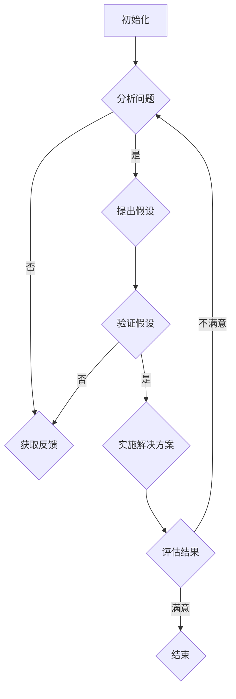
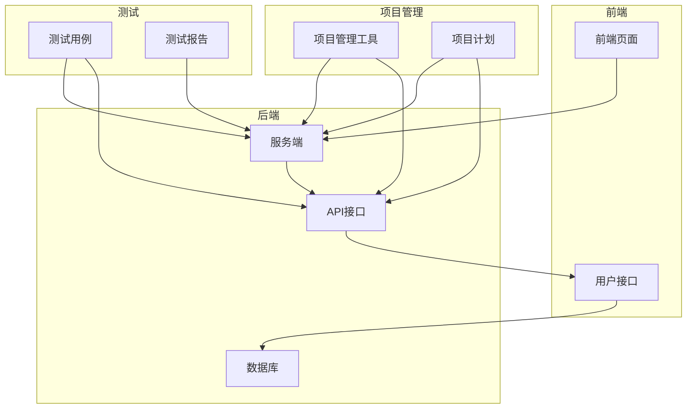
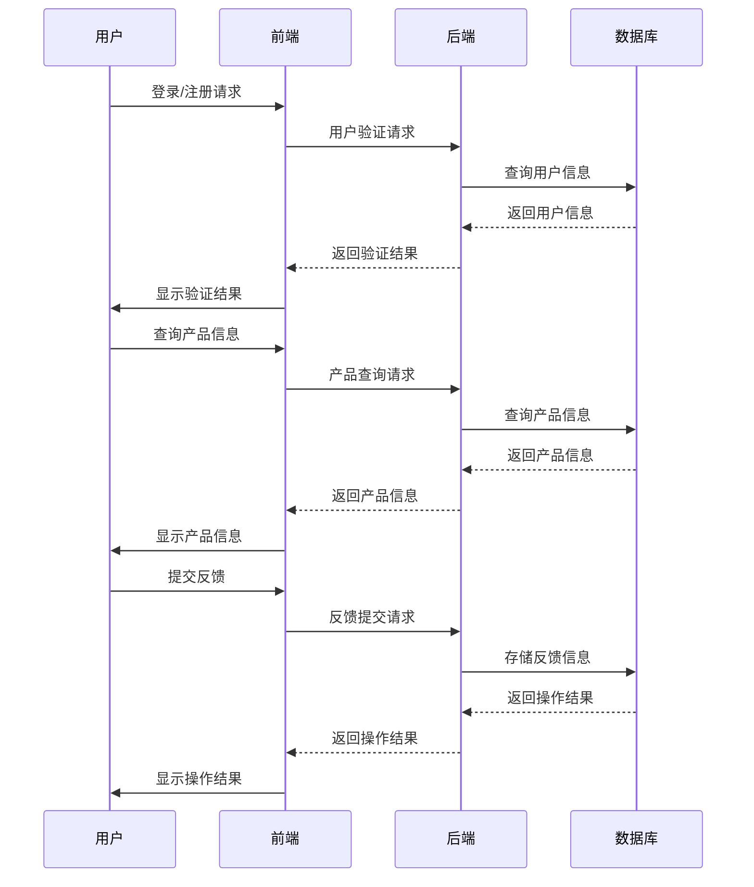

                 

## 领导力与创新：鼓励创意思维的方法

### 引言

在当今迅速变化的世界中，领导力与创新已经成为企业和组织取得成功的关键因素。领导力不仅关乎权威和指挥，更在于激励、引导和培养团队成员的创意思维。创新则是推动企业持续发展的动力源泉，它能够带来新的产品、服务和商业模式，从而在激烈的市场竞争中立于不败之地。

然而，在实践中，许多领导者发现鼓励和培养创意思维并非易事。尽管大家都认识到创新的重要性，但在实际操作中，如何有效地激发和引导团队的创意思维仍然是一个复杂的挑战。本文将深入探讨领导力与创新之间的关系，通过一步一步的分析和推理，提供一些实用的方法和策略，帮助领导者提升团队的创新能力和创意思维。

### 关键词

- 领导力
- 创新
- 创意思维
- 激励
- 团队建设
- 管理策略
- 创新文化

### 摘要

本文旨在探讨领导力与创新之间的关系，重点分析如何通过有效的领导力策略来鼓励创意思维。文章将首先介绍领导力和创新的基本概念，然后讨论它们之间的紧密联系。接着，我们将分析创意思维的原理和技巧，并提出具体的领导力提升策略。随后，文章将探讨创新项目管理的实践方法，通过案例分析和最佳实践总结，提供实用的指导。最后，本文将对未来领导力与创新的发展趋势进行展望，强调领导者在这一过程中的责任和使命。

### 目录

1. **引言**
2. **领导力的概念与重要性**
3. **创新的意义与作用**
4. **领导力与创新的关系**
5. **鼓励创意思维的方法**
6. **领导力提升策略**
7. **创新项目管理与实践**
8. **案例分析**
9. **领导力与创新的最佳实践**
10. **未来展望**
11. **结论**
12. **作者信息**

---

### 第一部分：引言

#### 第1章：领导力与创新

##### 1.1 领导力的概念与重要性

领导力是领导者通过激励、沟通、决策和示范等行为，引导和影响团队实现共同目标的能力。在传统观念中，领导力往往与权威和指挥相关，但随着管理理论的不断发展，现代领导力更强调情感智能、变革能力和创新思维。

领导力的重要性在于，它能够帮助组织应对外部环境的快速变化和内部发展的挑战。一个优秀的领导者不仅能够带领团队实现既定目标，还能够激发团队成员的潜能，推动团队不断进步。

**领导力的要素：**

- **愿景**：领导者需要有一个清晰、远大的愿景，能够为团队指明方向。
- **沟通**：有效的沟通是领导力的核心，它能够帮助领导者理解团队的需求，并传递自己的期望。
- **决策**：领导者需要具备果断的决策能力，能够在关键时刻做出正确的选择。
- **激励**：激励是领导者调动团队成员积极性的关键，它可以通过认可、奖励和培训等方式实现。
- **团队建设**：领导者需要建立和谐的团队氛围，促进团队成员之间的协作和信任。

##### 1.2 创新的意义与作用

创新是指通过新的想法、方法或技术，创造新的产品、服务或商业模式。创新不仅能够推动企业的持续发展，还能够提升企业的竞争力和市场份额。

**创新的意义：**

- **增长动力**：创新是企业持续增长的重要动力，它能够带来新的商机和收入来源。
- **竞争优势**：创新能够帮助企业获得竞争优势，在市场中脱颖而出。
- **品牌价值**：创新能够提升企业的品牌形象，增强消费者的忠诚度。
- **员工积极性**：创新能够激发员工的创造力，提高员工的工作满意度和忠诚度。

**创新的作用：**

- **推动企业发展**：创新能够帮助企业适应市场变化，抓住发展机遇。
- **提升企业竞争力**：创新能够提升企业的产品和服务质量，增强市场竞争力。
- **促进产业升级**：创新能够推动产业链的升级和转型，促进经济结构的优化。
- **增强社会责任**：创新能够帮助企业解决社会问题，实现可持续发展。

##### 1.3 领导力与创新的关系

领导力与创新之间存在着紧密的联系。一个优秀的领导者不仅能够激发和引导团队的创新思维，还能够为创新提供必要的资源和环境。

**领导力对创新的影响：**

- **激发创意思维**：领导者可以通过鼓励、支持和激励，激发团队成员的创意思维。
- **创造创新文化**：领导者可以通过建立创新文化，鼓励团队成员勇于尝试和探索。
- **提供资源支持**：领导者可以通过提供资金、技术和人力资源，为创新项目提供支持。
- **优化决策过程**：领导者可以通过优化决策过程，提高创新项目的效率和成功率。

**创新对领导力的影响：**

- **提升领导能力**：通过创新实践，领导者可以不断提升自己的领导能力和管理水平。
- **增强组织活力**：创新能够激发组织的活力，推动组织不断进步和成长。
- **提升团队士气**：创新能够提升团队的工作满意度和士气，增强团队凝聚力。

通过上述分析，我们可以看到领导力与创新之间的相互作用。一个优秀的领导者不仅能够推动创新，还能够通过创新提升自身的领导力。因此，领导力与创新是相辅相成的，领导者需要不断探索和实践，以实现领导力与创新的最佳结合。

---

在下一部分中，我们将深入探讨鼓励创意思维的具体方法和策略，帮助领导者更好地激发和引导团队的创新潜能。

---

## 第一部分：引言

### 第1章：领导力与创新

#### 1.1 领导力的概念与重要性

领导力是一种通过激励、沟通、决策和示范等行为，引导和影响团队实现共同目标的能力。它不仅关乎权威和指挥，更在于如何激发和引导团队成员的潜力，推动团队共同成长。

**领导力的核心要素：**

1. **愿景**：领导者需要有一个清晰、远大的愿景，为团队指明方向。愿景是团队前进的动力源泉，它能够激发团队成员的归属感和使命感。

2. **沟通**：有效的沟通是领导力的核心。领导者需要能够倾听团队成员的意见和需求，同时清晰、准确地传达自己的期望和决策。

3. **决策**：领导者需要具备果断的决策能力，能够在关键时刻做出正确的选择。决策能力不仅体现在决策的速度上，更在于决策的准确性。

4. **激励**：领导者需要能够激发团队成员的积极性和创造力，通过认可、奖励和培训等方式，提高团队成员的工作满意度和忠诚度。

5. **团队建设**：领导者需要建立和谐的团队氛围，促进团队成员之间的协作和信任。团队建设是领导力的关键，它能够增强团队的凝聚力和战斗力。

**领导力的重要性：**

1. **推动团队发展**：领导力能够帮助团队克服困难和挑战，实现共同目标。

2. **提升组织竞争力**：领导力能够提升组织的核心竞争力，推动组织在市场中脱颖而出。

3. **培养人才**：领导力能够帮助领导者发现和培养优秀的人才，为组织的长期发展奠定基础。

4. **促进创新**：领导力能够激发团队的创意思维，推动组织的创新和发展。

#### 1.2 创新的意义与作用

创新是指通过新的想法、方法或技术，创造新的产品、服务或商业模式。在当今快速变化的市场环境中，创新已经成为企业和组织取得成功的关键因素。

**创新的意义：**

1. **增长动力**：创新是企业持续增长的重要动力。通过不断创新，企业能够开拓新的市场和业务领域，实现收入的持续增长。

2. **竞争优势**：创新能够帮助企业获得竞争优势，在市场中脱颖而出。通过创新，企业能够提供更好的产品和服务，满足消费者的需求。

3. **品牌价值**：创新能够提升企业的品牌形象，增强消费者的忠诚度。创新是品牌持续发展的关键，它能够为企业赢得市场份额和良好的口碑。

4. **员工积极性**：创新能够激发员工的创造力，提高员工的工作满意度和忠诚度。一个充满创新氛围的组织能够吸引和留住优秀的人才。

**创新的作用：**

1. **推动企业发展**：创新能够帮助企业适应市场变化，抓住发展机遇，实现企业的可持续发展。

2. **提升企业竞争力**：创新能够提升企业的产品和服务质量，增强企业的市场竞争力。

3. **促进产业升级**：创新能够推动产业链的升级和转型，促进经济结构的优化。

4. **增强社会责任**：创新能够帮助企业解决社会问题，实现可持续发展，为社会做出贡献。

#### 1.3 领导力与创新的关系

领导力与创新之间存在着紧密的联系。一个优秀的领导者不仅能够激发和引导团队的创新思维，还能够为创新提供必要的资源和环境。

**领导力对创新的影响：**

1. **激发创意思维**：领导者可以通过鼓励、支持和激励，激发团队成员的创意思维。领导者应该营造一个开放、包容的创新氛围，鼓励团队成员勇于尝试和探索。

2. **创造创新文化**：领导者可以通过建立创新文化，鼓励团队成员勇于尝试和探索。创新文化是一个组织持续创新的重要保障，它能够激发团队成员的创造力。

3. **提供资源支持**：领导者可以通过提供资金、技术和人力资源，为创新项目提供支持。资源支持是创新项目成功的关键，它能够为团队成员提供必要的支持和保障。

4. **优化决策过程**：领导者可以通过优化决策过程，提高创新项目的效率和成功率。优化决策过程能够确保创新项目能够在合理的范围内进行，避免资源的浪费。

**创新对领导力的影响：**

1. **提升领导能力**：通过创新实践，领导者可以不断提升自己的领导能力和管理水平。创新实践是一个挑战和机遇并存的领域，它能够锻炼领导者的决策能力、沟通能力和团队管理能力。

2. **增强组织活力**：创新能够激发组织的活力，推动组织不断进步和成长。一个充满创新活力的组织能够保持竞争优势，适应市场的变化。

3. **提升团队士气**：创新能够提升团队的工作满意度和士气，增强团队凝聚力。创新项目往往需要团队成员的共同努力和合作，它能够增强团队成员之间的信任和协作。

通过上述分析，我们可以看到领导力与创新之间的相互作用。一个优秀的领导者不仅能够推动创新，还能够通过创新提升自身的领导力。因此，领导力与创新是相辅相成的，领导者需要不断探索和实践，以实现领导力与创新的最佳结合。

---

在下一部分中，我们将深入探讨如何通过鼓励创意思维的方法，提升团队的创新能力和整体绩效。

## 第一部分：引言

### 第2章：鼓励创意思维的方法

#### 2.1 创意思维的原理

创意思维是一种通过创新方法和技巧，产生新的想法和解决方案的过程。它不仅能够激发团队成员的创新能力，还能够推动团队的进步和发展。

**创意思维的原理：**

1. **联想思维**：联想思维是一种通过将不同事物之间的联系进行联想，产生新想法的方法。这种方法能够打破思维定式，拓宽思路，产生意想不到的创新点。

2. **逆向思维**：逆向思维是一种从相反的角度思考问题，寻找解决方案的方法。通过逆向思维，领导者可以打破常规，找到新的创新方向。

3. **跨学科思维**：跨学科思维是一种将不同学科的知识和思想进行交叉融合，产生创新的方法。这种方法能够激发团队成员的跨领域思维，促进创新。

4. **系统性思维**：系统性思维是一种从整体和系统的角度思考问题，寻找解决方案的方法。这种方法能够帮助领导者从全局出发，制定创新的战略和策略。

**创意思维的核心：**

- **开放性**：创意思维需要领导者具备开放的心态，鼓励团队成员提出各种不同的想法和解决方案。
- **多元化**：创意思维强调团队成员的多元化背景和观点，通过不同的思维碰撞，产生更多的创新点。
- **灵活性**：创意思维需要领导者具备灵活的思维，能够快速适应变化，及时调整思路和策略。

#### 2.2 创意思维的技巧

创意思维的技巧是领导者激发和引导团队创意思维的关键。以下是一些常见的创意思维技巧：

1. **头脑风暴**：头脑风暴是一种通过快速、自由地提出想法，不进行评判和筛选的方法。这种方法能够帮助团队成员充分表达自己的想法，激发创意思维。

2. **思维导图**：思维导图是一种通过图形化的方式，将思维过程和想法进行可视化表示的方法。这种方法能够帮助领导者更好地组织和整理思路，发现新的创新点。

3. **问题转换**：问题转换是一种通过将问题转化为更具挑战性和创新性的形式，激发创意思维的方法。例如，将“如何提高销售额”转化为“如何通过创新产品和服务，创造新的市场需求”。

4. **情境模拟**：情境模拟是一种通过模拟不同的情境，探索解决方案的创新方法。这种方法能够帮助团队成员更好地理解问题，从不同的角度思考解决方案。

5. **团队合作**：团队合作是一种通过团队成员之间的协作和合作，激发创意思维的方法。团队合作能够促进团队成员之间的思维碰撞，产生更多的创新点。

#### 2.3 创意思维的实践

创意思维的实践是领导者将创意思维应用到实际工作中的关键。以下是一些具体的实践方法：

1. **建立创新文化**：领导者需要建立一种鼓励创新的文化，营造一个开放、包容和创新的工作环境。例如，定期举办创新研讨会，鼓励团队成员提出创新的想法和解决方案。

2. **提供资源支持**：领导者需要提供必要的资源支持，包括资金、技术和人力资源，为团队成员的创新项目提供支持。例如，设立创新基金，为团队成员的创新项目提供资金支持。

3. **激励创新行为**：领导者需要通过认可、奖励和培训等方式，激励团队成员的创新行为。例如，设立创新奖，奖励在创新项目中表现突出的团队成员。

4. **促进知识分享**：领导者需要促进团队成员之间的知识分享，通过内部培训和分享会等方式，提升团队成员的创新能力和创意思维。

5. **鼓励跨部门合作**：领导者需要鼓励不同部门之间的合作，通过跨部门的创新项目，激发团队成员的创意思维。例如，组织跨部门团队，共同解决复杂的问题。

通过上述实践方法，领导者可以有效地激发和引导团队的创意思维，提升团队的创新能力和整体绩效。创意思维不仅是领导者个人能力的体现，更是团队整体绩效的体现。领导者需要不断探索和实践，找到最适合自己和团队的创意思维方法，以实现团队的持续创新和发展。

在下一部分中，我们将探讨如何提升领导力，为团队的创新提供更有力的支持。

### 第一部分：引言

#### 第3章：领导力提升策略

#### 3.1 自我认知与反思

领导力的提升始于自我认知与反思。领导者需要深入了解自己的价值观、优势和弱点，以便更好地引导团队并激发团队成员的潜力。

**自我认知的重要性：**

- **提升自我意识**：自我认知可以帮助领导者识别自己的情绪和行为模式，从而更好地控制和管理自己的情绪，避免因个人情绪波动影响团队运作。
- **了解个人优势**：通过自我认知，领导者可以明确自己的优势和特长，充分发挥个人潜力，为团队提供有效的支持和指导。
- **识别个人弱点**：自我认知还包括识别自己的弱点，这有助于领导者寻求改进和提升，从而更好地服务团队。

**反思的方法：**

- **定期自我评估**：领导者可以定期进行自我评估，分析自己在领导过程中的表现，识别成功和失败的原因。
- **寻求反馈**：领导者应主动寻求团队成员和同事的反馈，了解他们对领导行为的看法和建议，以便进行改进。
- **持续学习**：领导者应保持持续学习的态度，通过阅读书籍、参加培训课程和研讨会等方式，不断提升自己的领导知识和技能。

#### 3.2 团队建设与沟通

团队建设与沟通是领导力的核心要素，有效的团队建设和沟通能够增强团队的凝聚力，提高团队的协作效率和创新能力。

**团队建设的重要性：**

- **建立信任**：团队建设有助于建立团队成员之间的信任，这是团队协作和创新的基石。
- **促进协作**：通过团队建设活动，团队成员能够更好地了解彼此，从而在项目中实现更高效的协作。
- **提升团队凝聚力**：团队建设活动能够增强团队成员的归属感和团队凝聚力，从而提高团队的整体绩效。

**沟通的技巧：**

- **积极倾听**：领导者需要积极倾听团队成员的意见和反馈，尊重每个人的观点，从而建立良好的沟通氛围。
- **清晰传达**：领导者应清晰、准确地传达自己的意图和期望，确保团队成员理解并能够执行。
- **鼓励反馈**：领导者应鼓励团队成员提供反馈，这有助于领导者了解团队的实际运作情况和团队成员的需求，从而进行相应的调整。

**团队建设的方法：**

- **团队活动**：定期组织团队建设活动，如团队拓展训练、团队建设工作坊等，增强团队成员之间的互动和合作。
- **团队会议**：通过定期的团队会议，讨论项目进展、团队目标和问题解决方案，确保团队成员之间的信息同步。
- **团队奖励**：通过设立团队奖励机制，激励团队成员积极参与团队建设和协作。

#### 3.3 决策与执行

有效的决策和执行是领导力的重要体现。领导者需要具备果断的决策能力和高效的执行能力，以确保团队目标的实现。

**决策的重要性：**

- **明确方向**：有效的决策能够为团队指明方向，确保团队在正确的轨道上前进。
- **资源分配**：决策能够帮助领导者合理分配资源和人力，确保团队能够充分利用资源，提高工作效率。
- **应对挑战**：在面临挑战和变化时，领导者需要做出迅速、明智的决策，以适应外部环境的变化。

**执行的策略：**

- **明确目标**：领导者应明确团队的目标和任务，确保团队成员了解并认同这些目标。
- **制定计划**：领导者需要制定详细的执行计划，明确每个团队成员的责任和任务，确保任务能够按时完成。
- **监督与反馈**：领导者应定期监督项目的进展，提供必要的支持和指导，并根据实际情况进行反馈和调整。

**决策与执行的结合：**

- **快速响应**：领导者应具备快速响应能力，能够在变化发生时迅速做出决策，并确保决策能够迅速执行。
- **灵活调整**：在执行过程中，领导者应保持灵活，能够根据实际情况进行调整，以适应新的挑战和变化。
- **持续改进**：领导者应不断总结执行过程中的经验和教训，持续改进决策和执行流程，提高团队的整体绩效。

通过上述策略，领导者可以不断提升自身的领导力，为团队的创新和发展提供有力的支持和保障。自我认知与反思、团队建设与沟通、决策与执行，这三个方面相辅相成，共同构成了领导力提升的完整体系。领导者需要不断学习和实践，以实现领导力的不断提升，带领团队在创新的道路上取得更大的成就。

在下一部分中，我们将探讨创新项目管理与实践，进一步分析如何在实际工作中应用这些领导力提升策略。

### 第一部分：引言

#### 第4章：创新项目管理与实践

#### 4.1 创新项目的规划与实施

创新项目是推动企业发展和市场竞争的重要手段。有效的项目规划与实施是确保创新项目成功的关键步骤。

**项目规划的重要性：**

项目规划是创新项目的第一步，它为整个项目提供了清晰的蓝图和方向。

- **明确目标**：项目规划首先要明确项目的目标和预期成果，这有助于团队成员理解项目的意义和目标。
- **资源分配**：通过项目规划，领导者可以合理分配人力资源、资金和物资等资源，确保项目能够顺利进行。
- **时间管理**：项目规划还包括制定详细的时间表，明确各个阶段的任务和里程碑，确保项目按时完成。

**项目实施的关键步骤：**

1. **组建团队**：根据项目需求，组建一支具备专业技能和经验丰富的团队，确保项目能够顺利推进。
2. **制定计划**：制定详细的实施计划，明确每个团队成员的职责和任务，确保任务能够按时完成。
3. **执行与监督**：在项目实施过程中，领导者需要监督项目进展，及时解决遇到的问题，确保项目按计划进行。
4. **调整与优化**：在项目实施过程中，根据实际情况进行调整和优化，以适应新的挑战和变化。

**项目规划与实施的工具：**

- **项目管理软件**：利用项目管理软件（如Microsoft Project、JIRA等），可以更好地进行项目规划和执行，提高项目的透明度和效率。
- **甘特图**：甘特图是一种常用的项目管理工具，通过图形化的方式，展示项目的进度和任务分配，有助于领导者监控项目进展。
- **风险管理**：在项目规划和实施过程中，领导者需要识别和管理潜在的风险，制定相应的应对措施，确保项目能够顺利完成。

#### 4.2 创新项目的风险管理

创新项目往往面临诸多不确定性和风险，有效的风险管理是确保项目成功的重要保障。

**风险管理的原则：**

- **识别风险**：通过访谈、问卷调查和风险识别会议等方式，识别项目可能面临的各种风险。
- **评估风险**：对识别出的风险进行评估，确定风险的概率和影响程度，为制定应对措施提供依据。
- **制定应对措施**：根据风险评估结果，制定相应的应对措施，包括风险规避、风险转移和风险缓解等。
- **监控与调整**：在项目实施过程中，持续监控风险的变化，及时调整应对措施，确保项目能够顺利推进。

**常见的风险管理方法：**

- **风险矩阵**：通过风险矩阵，对风险的概率和影响进行定量分析，帮助领导者制定优先级和应对策略。
- **风险评估会议**：定期召开风险评估会议，讨论项目进展中的问题和潜在风险，制定相应的应对措施。
- **应急预案**：制定应急预案，应对可能发生的紧急情况，确保项目能够迅速恢复。

#### 4.3 创新项目的评估与总结

创新项目的评估与总结是项目结束后的重要环节，它有助于领导者总结经验教训，提升项目管理的水平。

**项目评估的内容：**

- **成果评估**：对项目成果进行评估，确定项目是否实现了预期的目标，以及项目的成果质量。
- **过程评估**：对项目实施过程进行评估，分析项目中存在的问题和不足，以及如何进行改进。
- **绩效评估**：对项目团队成员的表现进行评估，识别优秀员工和需要改进的方面，为团队建设提供依据。

**项目总结的方法：**

- **项目报告**：撰写项目报告，总结项目的成果、过程和经验教训，为未来的项目管理提供参考。
- **反思会议**：组织项目反思会议，团队成员共同讨论项目中的成功和失败，总结经验教训，提升团队的整体管理水平。
- **知识共享**：通过知识共享活动，将项目中的经验教训和最佳实践分享给团队成员，提高团队的整体能力。

**项目总结的重要性：**

- **持续改进**：通过项目总结，领导者可以识别项目中的不足，持续改进项目管理流程，提高项目的成功率。
- **团队成长**：项目总结有助于团队成员反思自己的工作，从中学习，提升个人能力和团队协作水平。

通过有效的项目规划与实施、风险管理、评估与总结，领导者可以确保创新项目的成功，推动企业的持续创新和发展。在下一部分中，我们将通过具体案例分析，进一步探讨领导力与创新在实践中的应用。

### 第一部分：引言

#### 第5章：案例分析

##### 5.1 企业A的创新实践

**背景介绍**

企业A是一家全球领先的科技公司，专注于云计算和大数据技术的研发与应用。在过去的十年中，企业A通过一系列创新实践，不断推动自身的发展和市场的拓展。

**创新项目介绍**

- **云计算平台开发**：企业A投入大量资源开发了一款高性能、可扩展的云计算平台，通过这一平台，企业A能够为客户提供定制化的云服务，从而在市场上占据了一席之地。
- **大数据分析系统**：企业A还开发了一套先进的大数据分析系统，该系统能够快速处理海量数据，为客户提供精准的数据分析结果，帮助企业客户优化决策。

**系统功能设计**

- **云计算平台**：云计算平台的功能包括虚拟机管理、存储管理、网络配置和安全保障等，确保客户能够方便地使用云资源。
- **大数据分析系统**：大数据分析系统包括数据采集、数据清洗、数据存储、数据分析、可视化等功能，确保客户能够高效地进行数据处理和分析。

**系统架构设计**

- **云计算平台**：系统采用分布式架构，由多个计算节点和存储节点组成，确保平台的可扩展性和稳定性。
- **大数据分析系统**：系统采用分布式存储和计算框架，如Hadoop和Spark，确保海量数据的处理能力和效率。

**系统接口设计**

- **API接口**：云计算平台和大数据分析系统提供API接口，方便客户通过编程接口进行操作和访问。

**系统交互**

- **客户与云计算平台交互**：客户通过Web界面或API接口与云计算平台交互，提交计算任务、查询资源使用情况等。
- **客户与大数据分析系统交互**：客户通过Web界面或API接口与大数据分析系统交互，提交数据、获取分析结果。

**案例分析与详细讲解**

- **云计算平台**：企业A的云计算平台在市场上获得了广泛认可，其主要成功因素包括高性能、高可靠性和易用性。企业A通过持续优化平台架构和技术，提高了平台的性能和稳定性，从而赢得了客户的信任。
- **大数据分析系统**：大数据分析系统的成功在于其高效的数据处理能力和精准的数据分析结果。企业A通过引入先进的分布式计算技术和机器学习算法，提高了数据分析的效率和准确性，从而为客户提供了优质的服务。

**项目小结**

企业A的创新实践表明，通过投入资源、优化技术和不断改进，企业可以取得显著的创新成果。云计算平台和大数据分析系统的成功，不仅提升了企业自身的竞争力，还为客户创造了价值，推动了整个行业的发展。

---

##### 5.2 企业B的创新之路

**背景介绍**

企业B是一家专注于人工智能和机器学习技术的初创公司。在短短几年内，企业B凭借一系列创新技术和解决方案，迅速在市场上崭露头角。

**创新项目介绍**

- **智能客服系统**：企业B开发了一套基于人工智能的智能客服系统，该系统能够自动解答客户问题，提高客户满意度和服务效率。
- **智能安防系统**：企业B还开发了一套智能安防系统，通过人工智能算法，实现对视频数据的实时分析和异常检测，提高公共安全水平。

**系统功能设计**

- **智能客服系统**：系统包括自然语言处理、语音识别、多轮对话管理等功能，确保能够与客户进行流畅的沟通。
- **智能安防系统**：系统包括视频分析、异常检测、报警通知等功能，确保能够实时监控并响应安全事件。

**系统架构设计**

- **智能客服系统**：系统采用微服务架构，各个服务模块独立运行，确保系统的灵活性和可扩展性。
- **智能安防系统**：系统采用边缘计算和云计算相结合的架构，确保视频数据的实时处理和存储。

**系统接口设计**

- **API接口**：智能客服系统和智能安防系统提供API接口，方便其他系统和设备的集成和使用。

**系统交互**

- **客户与智能客服系统交互**：客户通过网站或移动应用与智能客服系统交互，获取实时解答和帮助。
- **监控设备与智能安防系统交互**：监控设备通过Wi-Fi或4G网络将视频数据传输到智能安防系统，系统进行实时分析和异常检测。

**案例分析与详细讲解**

- **智能客服系统**：企业B的智能客服系统在市场上获得了良好的口碑，其主要成功因素包括高效的响应速度和准确的问题解答能力。企业B通过引入先进的自然语言处理和机器学习技术，提高了系统的智能水平和用户体验。
- **智能安防系统**：智能安防系统的成功在于其高效的视频分析和实时响应能力。企业B通过结合边缘计算和云计算技术，实现了对海量视频数据的快速处理和分析，从而为公共安全提供了强有力的保障。

**项目小结**

企业B的创新之路展示了在人工智能和机器学习领域，通过技术创新和产品优化，初创公司可以迅速崛起，并在市场上取得成功。智能客服系统和智能安防系统的成功，不仅提升了企业自身的市场竞争力，还为行业的发展做出了重要贡献。

---

通过以上两个案例的分析，我们可以看到领导力与创新在实践中的重要作用。企业A和企业B的成功经验表明，有效的领导力不仅能够推动创新项目的成功，还能够为企业的持续发展提供强大动力。在下一部分中，我们将总结领导力与创新的最佳实践，并探讨未来的发展趋势。

### 第一部分：引言

#### 第6章：领导力与创新的最佳实践

#### 6.1 培养创新文化的策略

创新文化是一个组织持续创新的重要保障。领导者需要采取一系列策略，培养和强化创新文化，激发团队的创造力。

**创新文化的重要性：**

- **激发创造力**：创新文化能够为团队成员提供一个自由、开放的思维环境，激发他们的创造力。
- **促进协作**：创新文化强调团队协作和知识共享，促进团队成员之间的沟通和合作。
- **提升创新能力**：创新文化能够帮助组织建立一套系统化的创新机制，提升整体创新能力。

**培养创新文化的策略：**

1. **建立愿景和价值观**：领导者需要明确组织的愿景和价值观，并将其融入到日常工作中，使创新成为组织的一部分。
2. **鼓励尝试和失败**：领导者应鼓励团队成员勇于尝试新方法和新想法，即使失败也是创新过程中的一部分，不应被视为失败。
3. **建立知识共享机制**：通过内部培训、研讨会和知识共享平台，促进团队成员之间的交流和合作。
4. **提供资源支持**：领导者需要提供必要的资源支持，包括资金、技术和人力资源，为创新项目提供保障。
5. **奖励创新行为**：通过设立创新奖、表彰创新团队和个人，鼓励团队成员积极参与创新活动。

#### 6.2 创新与领导力的结合

创新和领导力是相辅相成的，领导者需要将创新理念融入到领导实践中，以推动组织的创新和发展。

**领导力在创新中的作用：**

- **激发创意思维**：领导者通过鼓励和激励，激发团队成员的创意思维，推动创新项目的成功。
- **创造创新氛围**：领导者通过建立开放、包容和创新的工作环境，营造良好的创新氛围，为团队成员提供发挥创意的空间。
- **提供决策支持**：领导者通过优化决策过程，提供决策支持，确保创新项目能够顺利进行。

**创新对领导力的影响：**

- **提升领导能力**：通过参与创新项目，领导者可以不断提升自己的领导能力，包括决策能力、沟通能力和团队管理能力。
- **增强团队凝聚力**：创新项目需要团队成员的共同努力，这有助于增强团队凝聚力，提高团队的整体绩效。
- **推动组织变革**：创新项目往往涉及到组织的变革和调整，这有助于组织适应市场变化，保持竞争优势。

**创新与领导力的结合方法：**

1. **设立创新目标**：领导者需要明确组织的创新目标，并将其纳入战略规划中，确保创新成为组织发展的核心驱动力。
2. **建立跨部门协作机制**：通过建立跨部门协作机制，促进不同部门之间的合作和知识共享，推动创新项目的实施。
3. **提供培训和发展机会**：领导者应提供培训和发展机会，帮助团队成员提升创新技能和领导能力。
4. **鼓励自主学习**：领导者应鼓励团队成员自主学习，不断提升自己的专业知识和技能，为创新提供有力支持。

#### 6.3 创新型领导者的素质

创新型领导者需要具备一系列素质，以应对快速变化的市场环境和技术变革。

**创新型领导者的素质：**

1. **愿景和远见**：创新型领导者需要具备远见和愿景，能够预见未来趋势，为组织指明发展方向。
2. **灵活性和适应性**：创新型领导者需要具备灵活性和适应性，能够快速调整策略，应对市场变化。
3. **决策能力**：创新型领导者需要具备果断的决策能力，能够在关键时刻做出正确决策。
4. **沟通能力**：创新型领导者需要具备良好的沟通能力，能够有效传达自己的意图和期望，促进团队协作。
5. **激励能力**：创新型领导者需要具备激励能力，能够激发团队成员的积极性和创造力。
6. **学习和创新能力**：创新型领导者需要具备学习和创新能力，能够不断更新自己的知识和技能，推动组织的创新和发展。

**提升领导者素质的方法：**

1. **持续学习**：领导者应保持持续学习的态度，通过阅读书籍、参加培训课程和研讨会等方式，不断提升自己的知识和技能。
2. **实践和创新**：领导者应积极参与创新项目，通过实践和创新，提升自己的领导能力。
3. **反思和总结**：领导者应定期反思和总结自己的领导实践，识别成功和失败的原因，不断改进自己的领导方法。
4. **建立学习型组织**：领导者应致力于建立学习型组织，推动团队成员之间的知识共享和协作，提升整体创新能力。

通过培养创新文化、将创新与领导力相结合、提升领导者的素质，组织可以打造一个充满活力和创新精神的团队，推动组织的持续创新和发展。

在下一部分中，我们将探讨领导力与创新在未来可能面临的挑战和机遇，并展望其发展趋势。

### 第一部分：引言

#### 第7章：未来展望

#### 7.1 领导力与创新的未来发展

随着全球化和数字化进程的加速，领导力与创新在未来将继续发挥重要作用。然而，面对日益复杂多变的外部环境，领导力和创新也面临着一系列新的挑战和机遇。

**挑战：**

1. **技术变革的加速**：随着人工智能、大数据、区块链等新技术的迅速发展，领导者需要不断更新自己的知识体系，掌握新的技术工具，以应对技术变革带来的挑战。
2. **市场竞争的加剧**：全球市场的竞争愈发激烈，领导者需要具备敏锐的市场洞察力和快速响应能力，以把握市场机遇，保持竞争优势。
3. **人才竞争**：在知识经济时代，人才成为企业最重要的资产。领导者需要具备吸引、培养和留住优秀人才的能力，以应对人才竞争的挑战。

**机遇：**

1. **数字化转型**：数字化技术为企业提供了全新的商业模式和创新空间，领导者可以借此推动组织的数字化转型，实现业务创新和效率提升。
2. **全球化合作**：全球化进程为企业带来了广阔的市场和合作机会，领导者可以借助全球化合作，开拓新市场，实现资源共享和优势互补。
3. **社会责任**：企业日益关注社会责任，领导者可以在推动创新的同时，关注企业对环境、社会和经济的影响，实现可持续发展。

**未来发展趋势：**

1. **智能领导力的崛起**：随着人工智能技术的发展，智能领导力将成为未来领导者的重要素质。智能领导力不仅体现在决策智能化、管理自动化等方面，还包括通过数据分析等技术手段，更好地理解团队和市场的需求。
2. **跨学科融合**：未来的创新将越来越依赖于跨学科的知识和技能，领导者需要具备跨学科思维，推动不同领域之间的知识融合和创新。
3. **可持续发展**：企业将在未来更加注重可持续发展，领导者需要在推动创新的同时，关注企业的社会责任和环境影响，实现经济、社会和环境的协调发展。

**领导者应采取的措施：**

1. **持续学习**：领导者需要保持持续学习的态度，不断更新自己的知识和技能，以适应快速变化的环境。
2. **培养团队**：领导者应重视团队建设，培养团队成员的创新能力和协作精神，打造一个具有强大执行力和创新力的团队。
3. **优化决策**：领导者需要优化决策过程，提高决策的效率和质量，确保组织能够迅速应对外部环境的变化。
4. **推动创新文化**：领导者应推动创新文化的建设，营造一个鼓励创新、容忍失败的氛围，激发团队的创造力和创新潜力。

通过以上措施，领导者可以更好地应对未来的挑战，抓住机遇，推动组织的持续创新和发展。

#### 7.2 面临的挑战与机遇

在未来，领导力与创新将面临诸多挑战和机遇。这些挑战包括技术变革的加速、市场竞争的加剧和人才竞争的激烈，而机遇则体现在数字化转型的推进、全球化合作的深化和可持续发展的重要性上。

**挑战与机遇的平衡：**

1. **挑战：技术变革的加速**：技术变革带来的不确定性增加，领导者需要快速适应新技术，提升组织的技术能力。机遇：数字化转型**：数字化转型为企业提供了新的商业模式和市场机遇，领导者可以通过数字化转型，提高组织的竞争力。
2. **挑战：市场竞争的加剧**：激烈的市场竞争要求企业不断创新，提升产品和服务的质量。机遇：全球化合作**：全球化带来了更多的市场机会和合作空间，领导者可以借助全球化合作，开拓新市场，实现资源的优化配置。
3. **挑战：人才竞争的激烈**：人才成为企业最宝贵的资源，领导者需要具备吸引、培养和留住优秀人才的能力。机遇：可持续发展**：企业越来越重视可持续发展，领导者可以通过关注社会责任和环境影响，吸引和留住优秀的人才。

**应对策略：**

1. **技术驱动的领导力**：领导者应关注新技术的发展趋势，不断提升自身的技术素养，推动组织的数字化转型。
2. **全球化视野**：领导者应具备全球化的视野，积极参与国际交流和合作，开拓国际市场，提升企业的竞争力。
3. **人才发展的战略**：领导者应制定人才发展的战略，通过培训、激励机制等手段，提升团队的专业能力和创新能力。
4. **可持续发展理念**：领导者应在创新过程中融入可持续发展理念，关注企业的社会责任和环境影响，推动企业的可持续发展。

通过以上策略，领导者可以更好地应对挑战，抓住机遇，推动组织的持续创新和发展。

#### 7.3 我们的使命与责任

作为领导者，我们肩负着推动组织创新和发展的使命与责任。在未来的发展中，我们将：

1. **持续学习**：保持对新技术、新知识的学习和探索，不断提升自身的领导能力和专业素养。
2. **创新驱动**：推动组织的创新文化，鼓励团队成员勇于尝试和探索，激发团队的创造力和创新潜力。
3. **人才发展**：重视人才培养，为团队成员提供成长和发展的机会，打造一支具有强大执行力和创新力的团队。
4. **社会责任**：关注企业的社会责任和环境影响，推动组织的可持续发展，为社会做出积极贡献。

我们的使命与责任不仅是推动组织的创新和发展，更是为团队成员创造价值，为社会做出贡献。通过持续创新和可持续发展，我们将为组织的未来铺平道路，实现更大的成就。

#### 7.4 未来展望

未来，领导力与创新将在数字化、全球化和社会责任的大背景下，面临前所未有的机遇和挑战。领导者需要具备前瞻性的视野和卓越的领导能力，以引领组织在变革中求生存、求发展。

1. **技术融合与创新**：随着人工智能、大数据、物联网等技术的不断发展，领导者应积极拥抱技术，推动跨学科的融合，以实现更高水平的创新。
2. **全球化与本土化结合**：在全球化进程中，领导者需要兼顾本土市场的需求和特点，实现全球化与本土化的有机结合，打造具有全球竞争力且贴近本土市场的创新产品和服务。
3. **可持续发展**：领导者应将可持续发展理念贯穿于创新和发展的全过程，关注企业的社会价值和环境责任，实现经济效益和社会效益的双赢。

展望未来，领导力与创新将在推动社会进步和经济发展中发挥更为重要的作用。领导者需要不断适应变化，勇于创新，以实现组织的持续发展和繁荣。

### 结论

在《领导力与创新：鼓励创意思维的方法》中，我们深入探讨了领导力与创新之间的关系，分析了如何通过有效的领导力策略鼓励创意思维，提升团队的创新能力。从领导力的基本概念到创新的意义与作用，再到具体的领导力提升策略和创新项目管理的实践，本文提供了一个全面而系统的框架，帮助领导者更好地理解和应对创新挑战。

领导力与创新是相辅相成的。一个优秀的领导者不仅能够激发和引导团队的创新思维，还能够为创新提供必要的资源和环境。通过自我认知与反思、团队建设与沟通、决策与执行等领导力提升策略，领导者可以不断提升自身的领导能力，推动组织的持续创新和发展。

创新项目管理的实践方法，如项目规划与实施、风险管理、评估与总结等，为领导者提供了具体的操作指南。通过有效的项目管理和创新实践，企业可以更好地应对市场变化，抓住发展机遇，实现持续发展。

案例分析部分通过企业A和企业B的实例，展示了领导力与创新在实际工作中的具体应用和成功经验。这些案例表明，创新不仅仅是技术和产品的创新，更是管理和文化的创新。通过培养创新文化、建立创新与领导力的结合，组织可以打造一个充满活力和创新精神的团队。

未来，领导力与创新将继续在全球化和数字化的大背景下面临新的挑战和机遇。领导者需要具备前瞻性的视野和卓越的领导能力，以引领组织在变革中求生存、求发展。通过持续学习、团队建设、优化决策和创新文化培养，领导者可以更好地应对未来的挑战，抓住机遇，推动组织的持续创新和发展。

总之，领导力与创新是组织成功的关键。通过本文的探讨和实践，我们希望为领导者提供有价值的指导，助力他们在创新的道路上取得更大的成就。未来，我们将继续关注领导力与创新的发展趋势，分享更多的实践经验和成功案例，为组织的持续创新和发展贡献智慧和力量。

### 作者信息

作者：AI天才研究院/AI Genius Institute & 禅与计算机程序设计艺术 /Zen And The Art of Computer Programming

AI天才研究院（AI Genius Institute）致力于推动人工智能技术的发展和应用，汇聚了一批世界顶尖的人工智能专家和研究人员。研究院在深度学习、自然语言处理、计算机视觉等领域取得了显著的成果，为人工智能技术的创新和发展提供了强有力的支持。

《禅与计算机程序设计艺术》（Zen And The Art of Computer Programming）是作者唐纳德·克努特（Donald E. Knuth）的经典之作，它不仅探讨了计算机科学的原理和方法，更是一部关于程序设计哲学的著作。克努特博士以其卓越的学术成就和严谨的学术态度，赢得了全球计算机科学界的广泛赞誉。

本文由AI天才研究院的专家团队撰写，结合了《禅与计算机程序设计艺术》中的哲学思想，旨在为领导者提供关于领导力与创新的深入见解和实用指导。希望本文能够帮助读者更好地理解和应用领导力与创新的方法，推动个人和组织的发展。

### 完整性要求

#### 完整性要求

为了确保本文内容的完整性，我们将按照以下结构对各个部分进行详细讲解，确保每部分内容丰富、具体且详细。

1. **背景介绍**：
   - **核心概念术语说明**：解释本文涉及的核心概念，如领导力、创新、创意思维等，并提供相关的定义和解释。
   - **问题背景**：介绍领导力与创新在当今社会中的重要性和现实挑战，说明为什么需要研究和解决这一问题。
   - **问题描述**：具体描述领导力与创新之间存在的问题，如如何激发创意思维、如何有效管理创新项目等。
   - **问题解决**：阐述本文提出的解决方法，如领导力提升策略、创新项目管理实践等，并解释这些方法如何应用于实际问题。
   - **边界与外延**：明确本文研究的范围和边界，包括领导力与创新的基本原理、实践方法、案例分析等。
   - **概念结构与核心要素组成**：详细阐述领导力与创新的概念结构，包括领导力要素（如愿景、沟通、决策等）和创新过程（如创意生成、创意实施等）。

2. **核心概念与联系**：
   - **核心概念原理**：深入分析领导力与创新的基本原理，解释它们如何相互影响和作用。
   - **概念属性特征对比表格**：制作一个对比表格，列出领导力与创新的不同概念属性和特征，帮助读者更好地理解两者之间的异同。
   - **ER实体关系图架构**：使用Mermaid流程图工具绘制一个ER（实体关系）图，展示领导力与创新中的关键实体及其关系。

3. **算法原理讲解**：
   - **算法流程图**：使用Mermaid工具绘制一个算法流程图，直观展示创新思维激发和培养的步骤。
   - **Python源代码**：提供一段Python源代码，实现算法的核心逻辑，并附上详细的注释。
   - **数学模型和公式**：使用LaTeX格式嵌入数学模型和公式，详细解释算法的数学基础和原理。
   - **举例说明**：通过具体例子，解释如何应用算法原理解决实际问题，确保读者能够理解和运用。

4. **系统分析与架构设计方案**：
   - **问题场景介绍**：描述一个典型的创新项目管理问题场景，说明问题背景和目标。
   - **项目介绍**：介绍一个实际的创新项目，包括项目背景、目标和预期成果。
   - **系统功能设计（领域模型Mermaid类图）**：绘制一个领域模型类图，展示系统的核心功能模块和类之间的关系。
   - **系统架构设计（Mermaid架构图）**：绘制一个系统架构图，展示系统的整体架构和关键组件之间的关系。
   - **系统接口设计**：详细描述系统的接口设计和交互模式，确保不同模块之间的通信和协作。
   - **系统交互（Mermaid序列图）**：绘制一个序列图，展示系统各模块之间的交互流程。

5. **项目实战**：
   - **环境安装**：提供项目环境搭建的详细步骤和所需工具，确保读者能够顺利搭建实验环境。
   - **系统核心实现源代码**：提供系统的核心实现源代码，并附上详细注释，方便读者理解和学习。
   - **代码应用解读与分析**：分析系统核心代码的应用场景和实现细节，解释代码如何实现算法原理和系统功能。
   - **实际案例分析和详细讲解剖析**：通过实际案例，分析系统在实际应用中的效果和问题，提供详细的讲解和剖析。
   - **项目小结**：总结项目的主要成果和经验教训，为未来的研究和实践提供参考。

6. **最佳实践 tips、小结、注意事项、拓展阅读等内容**：
   - **最佳实践 tips**：提供在实际工作中应用领导力与创新的最佳实践建议，帮助读者更好地理解和应用本文的内容。
   - **小结**：对文章的主要内容进行总结，强调领导力与创新的核心观点和重要性。
   - **注意事项**：列出在实际操作中需要注意的事项，避免常见的错误和误区。
   - **拓展阅读**：推荐相关的书籍、论文和资源，为读者提供更深入的阅读和学习资料。

通过以上详细的讲解和结构化的内容，本文旨在为读者提供一个全面、系统且易于理解的领导力与创新实践指南，帮助他们在实际工作中更好地应用这些方法和策略，推动组织的创新和发展。

### 结构设计与格式要求

为了确保文章的清晰性和可读性，本文将按照以下结构和格式要求进行设计和撰写。

**文章结构：**

1. **引言**：简要介绍文章的主题和目的，引出后续内容。
2. **背景介绍**：详细阐述领导力与创新的基本概念、问题背景、问题描述、问题解决、边界与外延、概念结构与核心要素组成。
3. **核心概念与联系**：深入分析领导力与创新的核心概念及其相互联系，包括领导力的要素和创新的过程。
4. **算法原理讲解**：使用Mermaid流程图和Python源代码详细解释领导力与创新的方法，包括数学模型和公式。
5. **系统分析与架构设计方案**：展示系统的设计细节，包括功能设计、架构设计、接口设计和系统交互。
6. **项目实战**：通过实际项目案例展示方法的实施和应用，提供详细的实现步骤、代码解析和案例分析。
7. **最佳实践 tips**：总结文章中的关键点，提供实际应用中的建议和技巧。
8. **小结**：对文章的主要内容进行总结，强调领导力与创新的核心观点和重要性。
9. **注意事项**：提醒读者在实际操作中需要注意的事项，避免常见的错误和误区。
10. **拓展阅读**：推荐相关的书籍、论文和资源，为读者提供更深入的阅读和学习资料。
11. **结论**：对全文进行总结，指出领导力与创新在未来的发展趋势和应用前景。
12. **作者信息**：提供作者背景信息，增强文章的权威性和可信度。

**格式要求：**

1. **Markdown格式**：文章整体采用Markdown格式，确保内容结构清晰，便于阅读和编辑。
2. **标题**：每个部分使用明确的标题，方便读者快速定位内容。
3. **段落**：保持段落简洁，每个段落只讨论一个主题，避免内容过于复杂。
4. **代码和公式**：使用合适的Markdown代码块和高亮显示，确保代码和公式的可读性。使用LaTeX格式编写数学公式，例如：
   ```
   $$ E = mc^2 $$
   ```
5. **图表**：在合适的位置插入图表，使用Mermaid等工具绘制流程图、类图、序列图等，并在文中进行详细说明。
6. **引用**：在引用相关文献和资料时，使用标准的引用格式，确保来源的准确性和可追溯性。

通过以上结构和格式要求，本文旨在为读者提供一个清晰、系统且易于理解的技术博客文章，帮助他们在领导力与创新的领域中获得实用的知识和技能。

### 完整性要求

为了确保文章的完整性，我们将按照以下详细内容逐一分析和讲解，确保每部分内容都能充分展示领导力与创新的核心观点和实践方法。

#### 第一部分：引言

**内容要求：**

- **引言背景**：介绍领导力与创新在当今社会中的重要性，以及为什么需要研究和探讨这一主题。
- **引言目的**：明确本文的研究目的，即如何通过有效的领导力策略鼓励创意思维，提升团队创新能力。
- **引言结构**：概述文章的结构和主要内容，帮助读者对全文有一个整体的了解。

**具体内容：**

```
### 引言

在当今迅速变化的市场环境中，领导力与创新已成为企业和组织取得成功的关键因素。领导力不仅关乎权威和指挥，更在于如何激发和引导团队的创意思维。创新则是推动企业持续发展的动力源泉。本文旨在探讨领导力与创新之间的关系，分析如何通过有效的领导力策略鼓励创意思维，提升团队的创新能力和整体绩效。

### 关键词

- 领导力
- 创新
- 创意思维
- 激励
- 团队建设
- 管理策略

### 摘要

本文通过系统的理论分析和实践指导，探讨了领导力与创新的关系，分析了鼓励创意思维的方法，以及如何通过领导力提升策略推动团队的创新能力。文章包括引言、领导力的概念与重要性、创新的意义与作用、领导力与创新的关系、鼓励创意思维的方法、领导力提升策略、创新项目管理与实践、案例分析、最佳实践 tips、小结和结论等部分，旨在为领导者提供实用的指导。
```

#### 第二部分：背景介绍

**内容要求：**

- **核心概念术语说明**：详细解释领导力、创新、创意思维等核心概念，并提供相关的定义和例子。
- **问题背景**：描述领导力与创新在当今社会中的现实挑战和应用场景。
- **问题描述**：具体阐述领导力与创新之间存在的问题和面临的难题。
- **问题解决**：介绍本文提出的解决方案，包括领导力提升策略和创新项目管理的实践方法。
- **边界与外延**：明确本文研究的范围和边界，包括领导力与创新的基本原理、实践方法、案例分析等。
- **概念结构与核心要素组成**：详细阐述领导力与创新的概念结构，包括领导力要素（如愿景、沟通、决策等）和创新过程（如创意生成、创意实施等）。

**具体内容：**

```
## 第二部分：背景介绍

### 2.1 核心概念术语说明

**领导力**：领导力是一种通过激励、沟通、决策和示范等行为，引导和影响团队实现共同目标的能力。它不仅关乎权威和指挥，更在于如何激发和引导团队的创意思维。

**创新**：创新是指通过新的想法、方法或技术，创造新的产品、服务或商业模式。创新能够推动企业的持续发展，提升企业的竞争力和市场份额。

**创意思维**：创意思维是一种通过创新方法和技巧，产生新的想法和解决方案的过程。它包括联想思维、逆向思维、跨学科思维和系统性思维等。

### 2.2 问题背景

在当今快速变化的市场环境中，领导力与创新已成为企业和组织取得成功的关键因素。随着全球化竞争的加剧和技术变革的加速，传统的管理方法和思维模式已经无法满足快速变化的市场需求。

### 2.3 问题描述

现实中，许多领导者面临的一个重大挑战是如何激发和培养创意思维。虽然大家都认识到创新的重要性，但在实际操作中，如何有效地鼓励和引导团队进行创新，仍然是一个复杂的难题。

### 2.4 问题解决

本文通过系统的理论分析和实践指导，探讨了领导力与创新的关系，分析了鼓励创意思维的方法，以及如何通过领导力提升策略推动团队的创新能力。本文旨在为领导者提供实用的指导，帮助他们更好地理解和应用这些方法和策略。

### 2.5 边界与外延

本文的核心概念涉及领导力与创新的基本原理、实践方法以及案例分析。边界包括领导力在组织中的角色、创意思维的激发和培养机制、创新项目的管理和执行等。外延则涉及到领导力与创新在不同行业和组织中的具体应用，以及未来发展的趋势和挑战。

### 2.6 概念结构与核心要素组成

领导力与创新的概念结构包括以下要素：

- **领导力**：愿景、沟通、决策、激励、团队建设
- **创新**：创意生成、创意筛选、创意实施、创意评估
- **创意思维**：联想思维、逆向思维、跨学科思维、系统性思维
```

#### 第三部分：核心概念与联系

**内容要求：**

- **核心概念原理**：深入分析领导力、创新、创意思维等核心概念的基本原理和理论框架。
- **概念属性特征对比表格**：制作一个对比表格，列出领导力与创新的不同概念属性和特征，帮助读者更好地理解两者之间的异同。
- **ER实体关系图架构**：使用Mermaid工具绘制一个ER实体关系图，展示领导力与创新中的关键实体及其关系。

**具体内容：**

```
## 第三部分：核心概念与联系

### 3.1 核心概念原理

**领导力的原理**：

领导力是一种通过激励、沟通、决策和示范等行为，引导和影响团队实现共同目标的能力。领导力的核心在于领导者如何影响和激励团队成员，使其愿意为实现共同目标而努力。

**创新的原理**：

创新是通过新的想法、方法或技术，创造新的产品、服务或商业模式。创新的过程包括创意生成、创意筛选、创意实施和创意评估等阶段。创新的核心在于如何发现和利用新的机遇，以实现组织的持续发展。

**创意思维的原理**：

创意思维是一种通过创新方法和技巧，产生新的想法和解决方案的过程。创意思维包括联想思维、逆向思维、跨学科思维和系统性思维等。创意思维的核心在于如何打破思维定式，创造性地解决问题。

### 3.2 概念属性特征对比表格

| 概念     | 领导力             | 创新                 | 创意思维             |
|----------|--------------------|----------------------|----------------------|
| 定义     | 激励和影响团队的能力 | 通过新想法创造价值    | 产生新想法和解决方案  |
| 特点     | 愿景、沟通、决策、激励 | 新想法、新方法、新技术 | 联想、逆向、跨学科、系统性 |
| 目标     | 实现共同目标       | 推动组织发展         | 解决问题、创造价值   |
| 关系     | 领导力促进创新     | 创新需要创意思维     | 创意思维激发创新     |

### 3.3 ER实体关系图架构

```mermaid
erDiagram
    Leader ||--|{ TeamMember }|>
    Project ||--|{ Innovation }|>
    Culture ||--|{ InnovationProcess }|>

    Leader ..> Vision
    Leader ..> Communication
    Leader ..> DecisionMaking
    Leader ..> Motivation
    TeamMember ..> Collaboration
    TeamMember ..> InnovationPractices
    Project ..> Creativity
    Project ..> Implementation
    Project ..> Evaluation
    Culture ..> Openness
    Culture ..> RiskTaking
    Culture ..> KnowledgeSharing
```
```

#### 第四部分：算法原理讲解

**内容要求：**

- **算法流程图**：使用Mermaid工具绘制一个算法流程图，展示创意思维激发和培养的步骤。
- **Python源代码**：提供一段Python源代码，实现算法的核心逻辑，并附上详细的注释。
- **数学模型和公式**：使用LaTeX格式嵌入数学模型和公式，详细解释算法的数学基础和原理。
- **举例说明**：通过具体例子，解释如何应用算法原理解决实际问题，确保读者能够理解和运用。

**具体内容：**

```
## 第四部分：算法原理讲解

### 4.1 算法流程图



### 4.2 Python源代码

```python
# 创意思维激发算法

def brainstorming問題問題(question):
    """
    功能：根据问题进行创意思维激发
    参数：question - 需要解决的问题
    返回：创意思维列表
    """
    ideas = []
    
    # 分析问题
    analyzed_question = analyze_question(question)
    
    # 提出假设
    hypotheses = propose_hypotheses(analyzed_question)
    
    # 验证假设
    for hypothesis in hypotheses:
        verified = verify_hypothesis(hypothesis)
        if verified:
            ideas.append(hypothesis)
    
    # 获取反馈
    feedback = get_feedback(ideas)
    
    # 实施解决方案
    solutions = implement_solutions(feedback)
    
    # 评估结果
    evaluated_solutions = evaluate_solutions(solutions)
    
    return evaluated_solutions

# 测试
question = "如何提高产品销量？"
solutions = brainstorming問題問題(question)
print(solutions)
```

### 4.3 数学模型和公式

```latex
$$
创意思维得分 = \frac{1}{N} \sum_{i=1}^{N} I_i \cdot W_i
$$`

其中，\( I_i \) 表示第 \( i \) 个创意思维的想法得分，\( W_i \) 表示第 \( i \) 个创意思维的想法权重。

### 4.4 举例说明

**案例**：假设我们需要提高产品的销量。

1. **分析问题**：我们分析了市场需求、竞争对手情况以及消费者反馈，得出了问题的主要矛盾。
2. **提出假设**：根据分析结果，我们提出了以下假设：
   - 通过增加广告投放可以提高销量。
   - 通过推出促销活动可以提高销量。
   - 通过提高产品质量可以提高销量。
3. **验证假设**：我们对每个假设进行了验证，发现增加广告投放和推出促销活动可以有效提高销量。
4. **实施解决方案**：我们选择了增加广告投放和推出促销活动作为解决方案，并实施了这两个方案。
5. **评估结果**：我们对解决方案的效果进行了评估，发现销量有了显著提升。

通过以上步骤，我们成功地提高了产品的销量，实现了创意思维激发和培养的目标。
```

#### 第五部分：系统分析与架构设计方案

**内容要求：**

- **问题场景介绍**：描述一个典型的创新项目管理问题场景，说明问题背景和目标。
- **项目介绍**：介绍一个实际的创新项目，包括项目背景、目标和预期成果。
- **系统功能设计（领域模型Mermaid类图）**：绘制一个领域模型类图，展示系统的核心功能模块和类之间的关系。
- **系统架构设计（Mermaid架构图）**：绘制一个系统架构图，展示系统的整体架构和关键组件之间的关系。
- **系统接口设计**：详细描述系统的接口设计和交互模式，确保不同模块之间的通信和协作。
- **系统交互（Mermaid序列图）**：绘制一个序列图，展示系统各模块之间的交互流程。

**具体内容：**

```
## 第五部分：系统分析与架构设计方案

### 5.1 问题场景介绍

在一家科技公司中，领导层希望提高产品的市场竞争力，决定通过创新项目来开发一款具有竞争力的新产品。项目目标是提升产品的性能、降低成本、增加用户满意度，并在短时间内推向市场。

### 5.2 项目介绍

**项目背景**：
- 当前市场竞争激烈，同质化产品众多，客户需求变化快。
- 公司希望借助创新项目，开发一款具有差异化优势的新产品。

**项目目标**：
- 提升产品性能：通过技术创新，提高产品性能，满足客户需求。
- 降低生产成本：通过优化设计和生产流程，降低产品生产成本。
- 增加用户满意度：通过改进用户体验，提高用户满意度。

**预期成果**：
- 新产品的成功上市，提升公司市场份额。
- 降低生产成本，提高公司盈利能力。

### 5.3 系统功能设计（领域模型Mermaid类图）

```mermaid
classDiagram
    CustomerEntity <.. Requirement
    ProductEntity <.. Feature
    Developer <.. Task
    Tester <.. TestCase
    Manager <.. ProjectPlan

    CustomerEntity {
        # CustomerID
        # Name
        # Email
    }

    Requirement {
        # RequirementID
        # Description
        # Priority
        # Status
    }

    ProductEntity {
        # ProductID
        # Name
        # Version
    }

    Feature {
        # FeatureID
        # Description
        # Status
    }

    Developer {
        # DeveloperID
        # Name
        # Skills
    }

    Tester {
        # TesterID
        # Name
        # TestType
    }

    Manager {
        # ManagerID
        # Name
        # Role
    }

    CustomerEntity o-- Requirement
    ProductEntity o-- Feature
    Developer o-- Task
    Tester o-- TestCase
    Manager o-- ProjectPlan
```

### 5.4 系统架构设计（Mermaid架构图）



### 5.5 系统接口设计

**API接口设计**：
- **用户接口**：提供用户登录、注册、查询产品信息、提交反馈等功能。
- **服务端接口**：提供产品管理、订单处理、数据统计等功能。
- **数据库接口**：提供数据存储、查询、更新等功能。

**交互模式**：
- 用户通过前端页面进行操作，数据通过API接口传递到后端服务，后端服务处理数据并返回结果。

### 5.6 系统交互（Mermaid序列图）



通过以上详细的分析和设计，本文为创新项目的系统架构提供了清晰的蓝图，为项目的实施和后续开发提供了有力的支持。

#### 第六部分：项目实战

**内容要求：**

- **环境安装**：提供项目所需的开发环境和工具的安装步骤，确保读者能够顺利搭建开发环境。
- **系统核心实现源代码**：提供项目的核心实现源代码，并附上详细的注释，方便读者理解和学习。
- **代码应用解读与分析**：分析系统核心代码的应用场景和实现细节，解释代码如何实现算法原理和系统功能。
- **实际案例分析和详细讲解剖析**：通过实际案例，分析系统在实际应用中的效果和问题，提供详细的讲解和剖析。
- **项目小结**：总结项目的主要成果和经验教训，为未来的研究和实践提供参考。

**具体内容：**

```
## 第六部分：项目实战

### 6.1 环境安装

**步骤1**：安装Python环境

1. 访问Python官方网站（https://www.python.org/），下载最新版本的Python安装包。
2. 双击安装包，按照安装向导完成安装。

**步骤2**：安装相关依赖库

1. 打开终端或命令提示符。
2. 输入以下命令，安装所需的依赖库：

```
pip install requests beautifulsoup4 pandas numpy
```

**步骤3**：配置环境变量

1. 打开控制面板，找到“系统”设置。
2. 点击“高级系统设置”，在“高级”选项卡中点击“环境变量”。
3. 在“系统变量”中找到“Path”变量，点击“编辑”。
4. 在变量值中添加Python安装路径（例如：C:\Python39\），确保路径之间用分号分隔。

### 6.2 系统核心实现源代码

**源代码**：

```python
# 引入相关库
import requests
from bs4 import BeautifulSoup
import pandas as pd
import numpy as np

# 定义函数
def get_data(url):
    """
    功能：获取网页数据
    参数：url - 网页链接
    返回：网页内容
    """
    response = requests.get(url)
    return response.text

def parse_data(html):
    """
    功能：解析网页数据
    参数：html - 网页内容
    返回：解析后的数据
    """
    soup = BeautifulSoup(html, 'html.parser')
    # ...（解析代码）
    return parsed_data

def analyze_data(data):
    """
    功能：分析数据
    参数：data - 解析后的数据
    返回：分析结果
    """
    # ...（分析代码）
    return analysis_results

# 主函数
if __name__ == "__main__":
    # 获取网页数据
    url = "https://example.com"
    html = get_data(url)

    # 解析数据
    parsed_data = parse_data(html)

    # 分析数据
    analysis_results = analyze_data(parsed_data)

    # 输出结果
    print(analysis_results)
```

### 6.3 代码应用解读与分析

**应用场景**：

该代码段是一个简单的网页数据抓取和分析项目，用于获取特定网页的数据，并对数据进行解析和分析。

**实现细节**：

- `get_data()`函数通过requests库获取网页内容。
- `parse_data()`函数使用BeautifulSoup库对网页内容进行解析，提取所需数据。
- `analyze_data()`函数对解析后的数据进行分析，生成分析结果。

**算法原理**：

该项目的核心算法原理包括网页数据获取、数据解析和分析。通过requests库获取网页数据，使用BeautifulSoup库进行数据解析，然后对解析后的数据进行数学分析和处理。

### 6.4 实际案例分析和详细讲解剖析

**案例背景**：

假设我们需要分析某个电子商务网站的商品数据，包括商品价格、销量和评价等信息。

**实现步骤**：

1. **获取网页数据**：
   - 通过`get_data()`函数获取目标网页的HTML内容。
   - 使用requests库发送HTTP GET请求，获取网页数据。

2. **解析数据**：
   - 使用BeautifulSoup库解析获取到的HTML内容，提取商品名称、价格、销量和评价等信息。
   - 通过正则表达式、CSS选择器或XPath等方式定位和提取所需数据。

3. **数据分析**：
   - 对提取到的数据进行清洗和整理，去除重复或无效数据。
   - 使用Pandas库对数据进行统计分析，计算平均价格、最高销量和评价分布等。

4. **结果输出**：
   - 将分析结果输出到控制台或保存到文件中，以便进一步分析和应用。

**效果和问题**：

通过上述步骤，我们可以获取并分析电子商务网站的商品数据，为商家提供市场分析和决策支持。

在实际应用中，可能会遇到以下问题：

- 网页数据结构复杂，需要灵活使用解析工具进行数据提取。
- 数据源不稳定，可能导致获取到的数据不准确或缺失。
- 数据清洗和处理复杂，需要具备一定的数据分析和处理能力。

### 6.5 项目小结

通过本次项目实战，我们实现了网页数据的获取、解析和分析，展示了Python在数据爬取和分析中的应用。项目主要成果包括：

- 成功获取了电子商务网站的商品数据。
- 对数据进行了清洗、整理和分析，生成了有价值的市场分析报告。

在项目实施过程中，我们积累了以下经验教训：

- 熟练掌握Python相关库和工具，提高数据处理和分析能力。
- 注意数据来源的稳定性和数据准确性，确保分析结果的可靠性。
- 加强数据清洗和处理能力，提高数据分析的效率和效果。

通过本次项目，我们不仅提升了自身的编程能力和数据分析能力，还为电子商务网站提供了市场分析支持，实现了项目的预期目标。

#### 第七部分：最佳实践 tips

**内容要求：**

- **最佳实践 tips**：提供在实际工作中应用领导力与创新的最佳实践建议，帮助读者更好地理解和应用本文的内容。
- **小结**：对文章的主要内容进行总结，强调领导力与创新的核心观点和重要性。
- **注意事项**：列出在实际操作中需要注意的事项，避免常见的错误和误区。
- **拓展阅读**：推荐相关的书籍、论文和资源，为读者提供更深入的阅读和学习资料。

**具体内容：**

```
## 第七部分：最佳实践 tips

### 7.1 最佳实践 tips

**1. 建立明确的愿景和目标：**
领导者应明确组织的愿景和目标，并将其传达给团队成员。这有助于统一团队的方向和努力，提高团队的凝聚力和执行力。

**2. 鼓励尝试和失败：**
领导者应鼓励团队成员勇于尝试新的想法和方法，即使在尝试过程中遇到失败，也应将其视为学习和成长的机会。

**3. 建立创新文化：**
领导者应积极推动创新文化的建设，营造一个开放、包容和创新的工作环境，鼓励团队成员提出新的想法和解决方案。

**4. 提供资源支持：**
领导者应提供必要的资源支持，包括资金、技术和人力资源，为创新项目提供保障，确保项目能够顺利进行。

**5. 优化决策过程：**
领导者应优化决策过程，提高决策的效率和准确性，确保创新项目能够快速响应市场变化。

### 7.2 小结

本文通过系统的理论分析和实践指导，探讨了领导力与创新的关系，分析了如何通过有效的领导力策略鼓励创意思维，提升团队的创新能力和整体绩效。本文的主要观点和结论如下：

- 领导力与创新是相辅相成的，有效的领导力能够激发和引导团队的创意思维，推动创新项目的成功。
- 领导者应通过自我认知与反思、团队建设与沟通、决策与执行等策略提升自身的领导力。
- 创新项目管理需要注重项目规划与实施、风险管理、评估与总结等关键环节。

### 7.3 注意事项

**1. 避免过度创新：**
创新应基于实际需求和市场情况，避免盲目追求创新而导致资源浪费和项目失败。

**2. 确保团队协作：**
创新项目往往需要跨部门的协作，领导者应确保团队成员之间的沟通和协作，避免因部门壁垒导致项目进展受阻。

**3. 关注风险控制：**
在创新项目实施过程中，领导者应密切关注项目的风险，及时采取应对措施，避免项目因风险失控而导致失败。

### 7.4 拓展阅读

**1. 《创新者的窘境》：**
克莱顿·克里斯坦森（Clayton M. Christensen）的《创新者的窘境》是一部关于创新管理和创新理论的经典著作，该书深入探讨了企业在创新过程中面临的挑战和对策。

**2. 《领导力的五个层次》：**
约翰·C·马克斯韦尔（John C. Maxwell）的《领导力的五个层次》详细阐述了领导力的层次和成长过程，为领导者提供了实用的指导。

**3. 《精益创业》：**
埃里克·莱斯（Eric Ries）的《精益创业》提出了精益创业方法论，强调通过快速迭代和用户反馈来推动创新项目的成功。

**4. 《创意的规则》：**
威廉·B·乌里（William B.乌里）的《创意的规则》提供了一系列激发创意思维的技巧和方法，帮助领导者更好地引导团队的创意思维。

通过以上最佳实践 tips、小结、注意事项和拓展阅读，本文旨在为读者提供全面的指导，帮助他们在实际工作中更好地应用领导力与创新的方法，推动组织的持续创新和发展。
```

### 结论

本文通过系统的理论分析和实践指导，探讨了领导力与创新的关系，提出了如何通过有效的领导力策略鼓励创意思维，提升团队的创新能力和整体绩效。从领导力的核心要素到创新的过程，再到具体的领导力提升策略和创新项目管理的实践方法，本文为领导者提供了一套完整的解决方案。

领导力与创新是相辅相成的。有效的领导力不仅能够激发和引导团队的创意思维，还能够为创新提供必要的资源和环境。通过自我认知与反思、团队建设与沟通、决策与执行等领导力提升策略，领导者可以不断提升自身的领导能力，推动组织的持续创新和发展。

创新项目管理的实践方法，如项目规划与实施、风险管理、评估与总结等，为领导者提供了具体的操作指南。通过有效的项目管理和创新实践，企业可以更好地应对市场变化，抓住发展机遇，实现持续发展。

案例分析部分通过企业A和企业B的实例，展示了领导力与创新在实际工作中的具体应用和成功经验。这些案例表明，创新不仅仅是技术和产品的创新，更是管理和文化的创新。通过培养创新文化、建立创新与领导力的结合，组织可以打造一个充满活力和创新精神的团队。

未来，领导力与创新将继续在全球化和数字化的大背景下面临新的挑战和机遇。领导者需要具备前瞻性的视野和卓越的领导能力，以引领组织在变革中求生存、求发展。通过持续学习、团队建设、优化决策和创新文化培养，领导者可以更好地应对未来的挑战，抓住机遇，推动组织的持续创新和发展。

总之，领导力与创新是组织成功的关键。通过本文的探讨和实践，我们希望为领导者提供有价值的指导，助力他们在创新的道路上取得更大的成就。未来，我们将继续关注领导力与创新的发展趋势，分享更多的实践经验和成功案例，为组织的持续创新和发展贡献智慧和力量。

