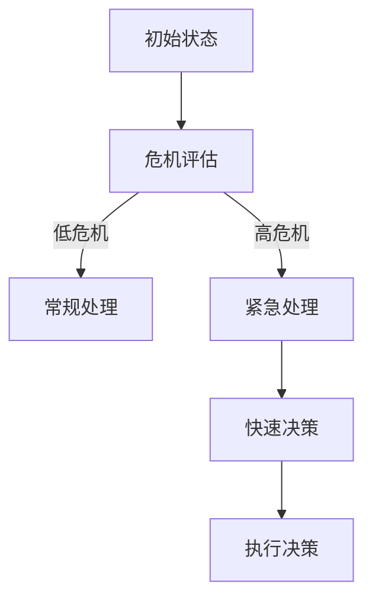

                 

## 文章标题

### 关键词：领导力、危机应对、快速反应、决策能力、算法原理

### 摘要：

在现代组织中，领导力与危机应对是确保组织稳定和发展的关键能力。本文通过详细探讨领导力与危机应对的重要性，核心概念及其联系，决策算法的原理与应用，系统分析与架构设计，项目实战案例分析，以及最佳实践与总结，旨在为读者提供一套完整的领导力与危机应对方法论。通过本文的阅读，读者将能够深刻理解领导力与危机应对的核心要素，掌握快速反应与决策能力的应用技巧，从而在复杂多变的环境中，有效地提升组织应对危机的能力。

## 第一部分：领导力与危机应对概述

### 1.1 领导力与危机应对的重要性

领导力是组织成功的关键要素之一，它不仅关乎组织的战略规划与执行，还直接影响组织在面临危机时的应对能力和决策效率。危机应对则是在面临突发事件时，迅速做出正确决策和行动，以减少损失和恢复秩序的能力。现代社会中，危机无处不在，无论是自然灾害、市场波动，还是技术故障，都要求领导者具备快速反应与决策的能力。

在现代组织中，领导力与危机应对的重要性主要体现在以下几个方面：

1. **确保组织稳定**：领导力能够确保组织在面临危机时，依然能够保持稳定的运营，避免危机的进一步扩大。有效的危机应对能够迅速遏制危机的影响，将损失降至最低。

2. **提升组织凝聚力**：在危机中，领导者的表现直接影响到组织的士气与信心。一个有能力的领导者能够在危机中展现出坚定的信念和决心，从而提升组织的凝聚力。

3. **促进创新与发展**：危机往往伴随着变革和机遇。领导者通过有效的危机应对，可以抓住变革带来的机会，推动组织的创新和发展。

4. **提升组织竞争力**：在竞争中，能够迅速应对危机的组织将具备更大的竞争优势。快速反应与决策能力可以帮助组织在竞争中抢占先机，赢得市场份额。

### 1.2 关键概念定义与联系

为了更好地理解领导力与危机应对，我们需要定义和解释几个关键概念，并分析它们之间的联系。

#### 1.2.1 领导力概念解析

领导力是指通过影响和激励他人，实现共同目标和愿景的能力。它不仅包括个人的素质和能力，还涉及到领导者与团队成员之间的互动和关系。

- **个人素质**：领导者的个人素质包括智慧、勇气、诚信、远见等。
- **能力**：领导者的能力包括战略规划、决策、沟通、团队建设等。
- **互动和关系**：领导力还涉及到领导者与团队成员之间的互动和关系，包括信任、尊重、合作等。

#### 1.2.2 危机与危机管理的定义

危机是指对组织正常运营产生严重威胁的突发事件。危机管理是指组织在面对危机时，采取的一系列应对措施和管理活动，以减少危机对组织的影响。

- **危机**：危机可以分为自然灾害、市场波动、技术故障、法律纠纷等类型。
- **危机管理**：危机管理包括危机预警、危机评估、危机应对、危机恢复等环节。

#### 1.2.3 快速反应与决策能力

快速反应与决策能力是指组织在面对危机时，能够迅速做出正确决策和行动的能力。它包括以下几个方面的内容：

- **快速识别危机**：能够迅速识别危机的征兆和影响，以便及时采取应对措施。
- **快速决策**：在危机中，领导者需要能够迅速做出决策，避免犹豫不决。
- **有效执行**：决策制定后，需要能够有效执行，确保决策的实施和效果。

#### 1.2.4 概念联系与互动关系

领导力、危机、快速反应与决策能力之间的联系如下表所示：

| 概念     | 联系                                  |
| -------- | ------------------------------------- |
| 领导力   | 决策能力的基础，影响危机应对效果      |
| 危机     | 领导力与决策能力的应用场景            |
| 快速反应 | 决策能力的体现，影响危机管理的效果    |
| 决策能力 | 领导力的具体表现，决定危机应对的成功 |

### 1.3 领导力与危机应对的数学模型

领导力与危机应对的数学模型可以用来描述领导者如何根据危机的严重性和自己的领导力水平做出快速反应和决策。以下是一个简化的数学模型：

$$
\text{决策时间} = f(\text{危机严重性}, \text{领导力水平})
$$

其中，$f$ 是一个函数，表示决策时间与危机严重性和领导力水平之间的关系。决策时间是指从危机发生到领导者做出决策的时间。

- **危机严重性**：危机严重性可以通过影响范围、影响程度、持续时间等指标来衡量。危机严重性越高，决策时间应越短。
- **领导力水平**：领导力水平可以通过个人素质、能力、经验等指标来衡量。领导力水平越高，决策时间应越短。

例如，如果危机严重性为5（最高等级），领导力水平为8（最高等级），则决策时间可能为1分钟；如果危机严重性为3，领导力水平为5，则决策时间可能为5分钟。

### 1.4 领导力与危机应对的实践

领导力与危机应对不仅仅是理论上的探讨，更需要在实践中得到应用。以下是一些常见的实践方法：

- **危机演练**：定期组织危机演练，帮助团队成员熟悉危机应对流程，提高快速反应和决策能力。
- **培训与发展**：通过培训和内部发展项目，提升领导者的个人素质和决策能力。
- **信息共享**：建立有效的信息共享机制，确保团队成员能够及时获取危机相关的信息，做出更准确的决策。
- **资源整合**：在危机中，快速整合组织内部和外部的资源，确保决策能够得到有效执行。

通过这些实践方法，组织可以有效地提升领导力和危机应对能力，确保在面临危机时能够迅速做出正确决策和行动。

### 1.5 总结

领导力与危机应对是组织稳定和发展的关键能力。通过本文的介绍，我们明确了领导力与危机应对的重要性，定义了关键概念，并展示了它们之间的联系。我们还介绍了一个简化的数学模型，用于描述领导者如何根据危机的严重性和自己的领导力水平做出快速反应和决策。最后，我们提供了一些实践方法，帮助组织提升领导力和危机应对能力。希望本文能为读者提供有价值的参考和启示。

## 第二部分：领导力与危机应对的实践

### 2.1 领导力与危机应对系统架构设计

在当今快速变化和高度复杂的环境中，领导力与危机应对系统成为了组织不可或缺的一部分。一个有效的系统不仅需要具备强大的功能，还需要在架构设计上做到灵活、高效和可扩展。以下是领导力与危机应对系统的架构设计过程，包括系统功能设计、系统架构设计、系统接口设计和系统交互流程。

#### 2.1.1 系统功能设计

领导力与危机应对系统的功能设计是确保系统能够满足组织需求的关键。以下是该系统的核心功能：

1. **危机预警**：通过实时监控各种风险指标，及时识别潜在的危机。
2. **危机评估**：对已识别的危机进行评估，确定危机的严重性和影响范围。
3. **决策支持**：提供基于数据和分析的决策支持，帮助领导者快速做出正确的决策。
4. **危机应对**：制定并执行危机应对策略，确保危机得到有效控制。
5. **危机恢复**：在危机过后，进行系统恢复和业务恢复，减少危机的影响。
6. **学习与优化**：从每次危机中学习，不断优化系统的应对策略和流程。

#### 2.1.2 系统架构设计

系统的架构设计决定了系统的性能、可扩展性和可靠性。以下是领导力与危机应对系统的架构设计：

1. **数据层**：数据层负责存储和管理组织内部和外部的数据，包括风险指标、危机记录、决策日志等。
2. **分析层**：分析层负责对数据进行处理和分析，生成预警信号、评估报告和决策建议。
3. **应用层**：应用层提供用户界面，供领导者进行危机预警、评估、决策和应对操作。
4. **支持层**：支持层包括日志系统、监控系统、备份系统等，确保系统的稳定运行和数据安全。

#### 2.1.3 系统接口设计

系统接口设计是确保系统与其他系统或组件有效交互的关键。以下是领导力与危机应对系统的主要接口设计：

1. **用户接口**：用户接口用于领导者与系统进行交互，包括Web界面、移动应用等。
2. **API接口**：API接口用于与其他系统（如ERP系统、CRM系统等）进行数据交换和功能调用。
3. **外部数据接口**：外部数据接口用于从外部系统（如气象系统、金融市场等）获取实时数据。

#### 2.1.4 系统交互流程

领导力与危机应对系统的交互流程如下：

1. **数据采集**：系统从内部和外部的数据源采集数据，包括风险指标、历史记录、实时数据等。
2. **数据预处理**：对采集到的数据进行清洗、过滤和转换，确保数据的质量和一致性。
3. **数据存储**：将预处理后的数据存储到数据层，以供后续分析使用。
4. **数据分析**：分析层对存储的数据进行实时分析和预测，生成预警信号和评估报告。
5. **决策支持**：将分析结果通过用户接口呈现给领导者，提供决策支持。
6. **决策执行**：领导者根据分析结果做出决策，并通过系统执行决策。
7. **监控与反馈**：监控系统运行状态，收集反馈信息，用于系统优化和改进。

### 2.2 项目实战：领导力与危机应对系统实现

为了更好地展示领导力与危机应对系统的实际应用，以下是一个具体的实现案例，包括环境安装、核心功能实现、代码解析和案例分析。

#### 2.2.1 环境安装与配置

在开始项目之前，需要搭建一个合适的环境。以下是环境安装与配置的步骤：

1. **硬件环境**：选择合适的硬件设备，如服务器、网络设备等。
2. **软件环境**：安装操作系统（如Linux）、数据库（如MySQL）、Web服务器（如Nginx）等。
3. **开发环境**：安装开发工具（如Visual Studio Code、Python环境等）。

#### 2.2.2 核心功能实现

领导力与危机应对系统的核心功能包括危机预警、评估、决策支持和危机应对。以下是核心功能的具体实现：

1. **危机预警**：通过实时监控风险指标，如市场波动、技术故障等，生成预警信号。
2. **危机评估**：对已识别的危机进行评估，确定危机的严重性和影响范围。
3. **决策支持**：提供基于数据和分析的决策支持，包括预警信号、评估报告和决策建议。
4. **危机应对**：制定并执行危机应对策略，包括人员调度、资源调配、应急预案等。

#### 2.2.3 代码解析与分析

以下是领导力与危机应对系统的核心代码片段及其解析：

```python
# 决策支持代码示例
def decision_support(warning_level, assessment_result):
    if warning_level == 'High' and assessment_result['severity'] > 7:
        return "Immediate action required."
    else:
        return "Standard action required."

# 决策执行代码示例
def execute_decision(action_plan):
    # 这里实现具体的决策执行逻辑，如人员调度、资源调配等
    print("Executing decision...")
    # 示例输出
    print(action_plan)
```

解析：
- `decision_support` 函数用于提供决策支持，根据预警级别和评估结果，返回相应的决策建议。
- `execute_decision` 函数用于执行决策，根据决策计划，执行具体操作。

#### 2.2.4 案例分析与讲解

以下是一个具体的案例分析，展示如何使用领导力与危机应对系统处理实际危机。

**案例背景**：某公司发现其数据中心发生重大技术故障，导致业务中断。

**危机预警**：系统实时监测到数据中心故障指标，生成高等级预警信号。

**危机评估**：系统对故障进行评估，确定故障的严重性和影响范围，包括关键业务系统的中断、数据丢失等。

**决策支持**：系统提供决策支持，建议立即采取紧急措施。

**危机应对**：领导者根据决策支持，制定并执行紧急应对计划，包括人员调度、设备修复、数据恢复等。

**危机恢复**：在危机过后，系统进行恢复和业务恢复，确保业务尽快恢复正常。

**案例分析**：
- **预警及时**：系统及时识别到故障，为组织争取了宝贵的应对时间。
- **评估准确**：系统对故障进行了准确的评估，为领导者提供了有价值的决策依据。
- **决策高效**：领导者根据系统提供的决策支持，迅速制定了应对计划，确保故障得到有效控制。
- **恢复迅速**：系统帮助组织迅速恢复了业务，将损失降至最低。

#### 2.2.5 项目小结

通过本项目的实施，我们展示了领导力与危机应对系统的实际应用价值。系统不仅帮助组织及时识别和应对危机，还提高了决策效率和恢复速度。未来，我们可以进一步优化系统，提高其准确性和智能化水平，为组织提供更强大的支持。

## 第三部分：领导力与危机应对的最佳实践与总结

### 3.1 最佳实践 Tips

在实际操作中，以下是一些提升领导力和危机应对能力的最佳实践：

1. **持续学习**：领导者应不断学习新的知识和技能，以适应快速变化的环境。
2. **团队建设**：建立一个高效、协同的团队，培养团队成员的危机应对能力。
3. **信息共享**：确保信息流畅传递，使每个团队成员都能及时获取危机相关信息。
4. **应急预案**：制定详细的应急预案，确保在危机发生时能够迅速采取行动。
5. **危机演练**：定期进行危机演练，帮助团队成员熟悉应对流程和操作。

### 3.2 小结

领导力与危机应对是组织成功的关键。通过本文的探讨，我们明确了领导力与危机应对的重要性，了解了核心概念及其联系，展示了快速反应与决策能力在危机管理中的应用，介绍了系统架构设计和项目实战案例。希望本文能为读者提供有价值的参考和启示。

### 3.3 注意事项

在领导力与危机应对的过程中，需要注意以下几点：

1. **避免盲目行动**：在危机中，领导者应保持冷静，避免盲目行动，确保决策的准确性和有效性。
2. **沟通与协作**：危机应对需要团队的协作，领导者应确保团队成员之间的沟通顺畅，共同应对危机。
3. **持续优化**：危机应对是一个持续的过程，领导者应不断总结经验，优化应对策略和流程。

### 3.4 拓展阅读

对于想要深入了解领导力与危机应对的读者，以下是一些推荐书籍和资源：

1. **书籍**：
   - 《领导力与危机管理》
   - 《危机管理》
   - 《危机决策：如何在压力下做出正确决策》

2. **资源**：
   - 危机管理协会（Crisis Management Association）网站
   - 危机应对指南（Crisis Response Handbook）

通过阅读这些书籍和资源，读者可以进一步加深对领导力与危机应对的理解，提升自己的应对能力。

## 作者信息

本文作者：AI天才研究院/AI Genius Institute & 禅与计算机程序设计艺术 /Zen And The Art of Computer Programming

感谢您的阅读！希望本文能对您在领导力与危机应对方面有所启发。如果您有任何疑问或建议，欢迎在评论区留言。期待与您的交流与讨论！

# 附录

以下附录内容包括本文中使用的Mermaid图表、LaTeX公式、代码示例等，以便读者更好地理解和学习。

## 附录 A：Mermaid 图表

### 决策树算法流程图


### 系统交互流程图
```mermaid
sequenceDiagram
    participant 用户 as 用户
    participant 系统 as 系统
    用户->>系统: 发起请求
    系统->>用户: 处理请求
    用户->>系统: 接收响应
    system 显示结果
```

## 附录 B：LaTeX 公式

### 快速反应模型
$$
\text{决策时间} = f(\text{危机严重性}, \text{领导力水平})
$$

### 决策支持函数
$$
\text{决策支持} = \begin{cases}
    \text{"Immediate action required."}, & \text{if } \text{warning_level} == 'High' \text{ and } \text{assessment_result['severity']} > 7 \\
    \text{"Standard action required."}, & \text{otherwise}
    \end{cases}
$$

## 附录 C：代码示例

### Python 代码实现
```python
# 决策支持代码示例
def decision_support(warning_level, assessment_result):
    if warning_level == 'High' and assessment_result['severity'] > 7:
        return "Immediate action required."
    else:
        return "Standard action required."

# 决策执行代码示例
def execute_decision(action_plan):
    # 这里实现具体的决策执行逻辑，如人员调度、资源调配等
    print("Executing decision...")
    # 示例输出
    print(action_plan)
```

通过以上附录，读者可以更直观地理解本文中提到的概念和方法，并能够自行实践和探索。如果您在阅读过程中有任何问题，欢迎随时提问，我们将竭诚为您解答。再次感谢您的阅读与支持！

