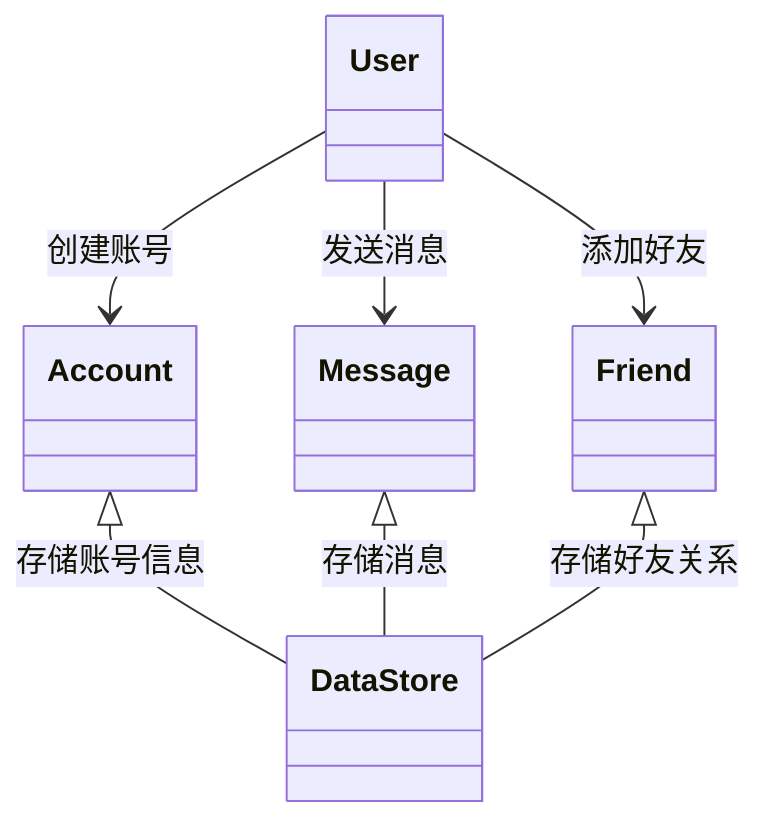

                 

### 让我们一步一步思考：领导力与变革沟通

在信息技术迅猛发展的时代，企业的变革与创新成为了保持竞争力的关键。而在这个过程中，领导者的角色变得尤为关键。本文将深入探讨领导力与变革沟通之间的关系，以及如何通过有效的沟通策略赢得团队对变革的支持。

#### 1. 领导力的核心要素

首先，让我们明确领导力的核心要素。领导力不仅仅是职位赋予的权力，而是一种影响力，能够激发团队的潜力，引导他们朝着共同的目标前进。根据领导力专家约翰·科特（John Kotter）的理论，领导力包括以下几个关键要素：

- **愿景与目标**：领导者需要有清晰的愿景，并将之转化为具体的目标。
- **价值观**：领导者需要明确并坚守组织的价值观，以此指导决策和行为。
- **影响力**：领导者需要具备影响他人思维和行动的能力。

#### 2. 变革沟通的重要性

在变革过程中，沟通是连接领导者与团队成员的桥梁。有效的变革沟通不仅能传达领导者的愿景和目标，还能增强团队对变革的认同感，减少变革阻力。以下是变革沟通的重要性：

- **减少不确定性**：通过透明的沟通，团队能够更好地理解变革的原因和预期效果，从而减少不确定性带来的焦虑。
- **建立信任**：领导者通过真诚、及时的沟通，能够建立与团队成员之间的信任关系，这是推动变革成功的关键。
- **增强参与度**：通过邀请团队成员参与沟通和决策过程，可以增强他们的参与度和责任感，从而更愿意支持变革。

#### 3. 变革沟通的策略

为了赢得团队对变革的支持，领导者需要采用一系列有效的沟通策略。以下是一些关键的策略：

- **建立明确的目标和愿景**：领导者需要明确表达变革的目标和愿景，确保团队成员理解变革的意义和价值。
- **提供信息和反馈**：领导者需要及时、透明地提供变革相关的信息和反馈，确保团队成员了解变革的进展情况。
- **倾听和回应**：领导者需要倾听团队成员的意见和担忧，并积极回应，以建立信任和减少抵触情绪。
- **个性化沟通**：领导者需要根据团队成员的不同特点和需求，采用个性化的沟通方式，以更好地传达信息。

#### 4. 赢得团队支持

赢得团队对变革的支持是一个系统工程，需要领导者通过一系列策略和行动来实现。以下是一些关键的步骤：

- **建立信任**：通过建立信任关系，领导者可以增强团队对变革的接受度。信任是沟通的基石，领导者需要通过言行一致、诚实和透明的沟通来建立信任。
- **增强参与度**：领导者可以邀请团队成员参与变革的决策过程，让他们感受到自己的意见和贡献被重视，从而增强他们的参与度和责任感。
- **解决冲突**：变革过程中难免会出现冲突，领导者需要及时识别并解决这些冲突，以确保团队保持团结和合作。
- **持续沟通**：变革是一个持续的过程，领导者需要保持与团队成员的持续沟通，确保他们能够理解变革的进展和成果。

#### 5. 实际案例研究

为了更深入地理解领导力与变革沟通的实际应用，我们可以通过一些实际案例来进行分析。以下是一个简化的案例：

**案例**：某科技公司计划实施一项重要的组织变革，以提高运营效率。

- **背景介绍**：该公司的业务规模不断扩大，原有的组织结构和管理模式已经无法满足公司的发展需求，需要进行变革。
- **领导力与变革沟通**：公司的CEO作为变革的领导者，采取了以下策略：
  - **建立明确的目标和愿景**：CEO明确了变革的目标和愿景，并向全体员工传达了变革的必要性和预期效果。
  - **提供信息和反馈**：CEO定期组织会议，向员工提供变革相关的信息和反馈，确保他们了解变革的进展和成果。
  - **倾听和回应**：CEO鼓励员工提出意见和建议，并认真倾听和回应，以建立信任和减少抵触情绪。
  - **个性化沟通**：CEO根据员工的不同特点和需求，采用了个性化的沟通方式，以确保信息传达的有效性。

- **结果**：通过有效的领导力和变革沟通，公司成功地实现了变革，运营效率显著提高，员工对变革的接受度也大幅提升。

#### 6. 总结

领导力与变革沟通是推动企业变革成功的关键因素。领导者需要通过有效的沟通策略，建立信任、增强参与度、解决冲突，并持续与团队成员保持沟通，以赢得他们对变革的支持。通过实际案例的分析，我们可以看到，有效的领导力和变革沟通不仅能够推动变革的成功，还能增强团队的凝聚力和士气。

在接下来的章节中，我们将深入探讨领导力的基础理论、变革沟通的具体策略、以及如何在实践中应用这些策略，以帮助领导者更好地赢得团队对变革的支持。让我们一起继续深入探讨，发现更多领导力和变革沟通的奥秘。<!-- 现在是文章的开头部分，以下是关键词和摘要部分 -->### 关键词

- 领导力
- 变革沟通
- 团队支持
- 沟通策略
- 企业变革
- 领导者影响力

### 摘要

本文旨在探讨领导力与变革沟通之间的关系，以及如何通过有效的沟通策略赢得团队对变革的支持。我们将深入分析领导力的核心要素，变革沟通的重要性，以及具体的沟通策略。通过实际案例研究，我们将展示领导力与变革沟通在实际应用中的效果，帮助读者更好地理解如何推动企业变革的成功。文章还将提供实用的实践建议，以指导领导者在实际工作中应对变革沟通的挑战。

---

# 领导力与变革沟通：赢得团队对变革的支持

在信息技术迅猛发展的时代，企业的变革与创新成为了保持竞争力的关键。而在这个过程中，领导者的角色变得尤为关键。本文将深入探讨领导力与变革沟通之间的关系，以及如何通过有效的沟通策略赢得团队对变革的支持。

## 引言

随着全球化和数字化的加速推进，企业面临着前所未有的变革压力。为了适应快速变化的市场环境，企业需要不断进行创新和变革。然而，变革并非易事，它往往伴随着不确定性和阻力。在这个过程中，领导者的角色至关重要。他们需要通过领导力和变革沟通策略，赢得团队的信任与支持，确保变革的成功实施。

## 背景介绍

### 核心概念术语说明

在讨论领导力与变革沟通之前，我们需要明确一些核心概念：

- **领导力**：领导力是指领导者通过影响和激励他人，实现共同目标的能力。它包括愿景设定、目标管理、团队建设、决策制定等关键要素。
- **变革沟通**：变革沟通是指领导者与团队成员之间，在变革过程中进行的交流与互动，旨在传达变革信息、解决团队成员的疑虑、增强变革的接受度。
- **团队支持**：团队支持是指团队成员对变革的认同与支持，它有助于减少变革阻力，提高变革的成功率。

### 问题背景

在企业变革的过程中，常常会遇到以下问题：

- **信息不对称**：团队成员对变革的信息了解不足，导致对变革的疑虑和抵触。
- **信任缺失**：领导者在变革过程中未能建立信任，导致团队成员不信任领导者的决策。
- **参与度低**：团队成员对变革的参与度不高，导致变革的动力不足。

### 问题描述

这些问题会导致以下后果：

- **变革阻力**：团队成员的抵触情绪增加，变革推进受阻。
- **员工流失**：变革带来的不确定性导致员工流失，影响企业稳定发展。
- **绩效下降**：团队成员的士气和工作效率下降，影响企业整体绩效。

### 问题解决

为了解决这些问题，领导者需要通过领导力和变革沟通策略，赢得团队对变革的支持。以下是一些具体的解决方法：

- **建立信任**：通过透明、及时的沟通建立信任，减少团队成员的疑虑和抵触。
- **增强参与度**：邀请团队成员参与变革的决策过程，增强他们的参与感和责任感。
- **解决冲突**：及时发现并解决团队成员之间的冲突，保持团队的稳定和团结。

### 边界与外延

领导力与变革沟通不仅适用于企业内部变革，也适用于社会变革、组织变革等多个层面。在变革的不同阶段，沟通策略也需要相应调整。

## 核心概念与联系

### 领导力的定义与类型

领导力是指领导者通过影响和激励他人，实现共同目标的能力。根据约翰·科特（John Kotter）的理论，领导力可以分为以下几种类型：

- **变革型领导**：领导者通过激发团队成员的内在动机和潜能，推动变革和创新。
- **交易型领导**：领导者通过制定明确的规则和奖励机制，激励团队成员完成任务。
- **教练型领导**：领导者通过指导和支持团队成员，帮助他们提升个人能力和实现目标。

### 变革沟通的定义与重要性

变革沟通是指领导者与团队成员之间，在变革过程中进行的交流与互动。其重要性体现在以下几个方面：

- **减少不确定性**：通过透明的沟通，团队成员能够更好地理解变革的原因和预期效果，减少不确定性带来的焦虑。
- **建立信任**：领导者通过真诚、及时的沟通，建立与团队成员之间的信任关系，这是推动变革成功的关键。
- **增强参与度**：通过邀请团队成员参与沟通和决策过程，可以增强他们的参与度和责任感，从而更愿意支持变革。

### 核心概念属性特征对比表格

| 特征        | 变革型领导 | 交易型领导 | 教练型领导 |
| ----------- | ----------- | ----------- | ----------- |
| 目标        | 长期目标    | 短期目标    | 长期目标    |
| 激励方式    | 激发内在动机 | 外在激励    | 指导和支持  |
| 沟通策略    | 透明、开放式 | 硬性、指令性 | 个人化、针对性 |
| 对变革的适应性 | 高         | 中等       | 高         |

### ER实体关系图架构

下面是一个简化的ER实体关系图，描述了领导力与变革沟通之间的关系：

```mermaid
erDiagram
  Leader ||--|{ TeamMember }
  Leader ||--|{ Communication }
  TeamMember ||--|{ Support }
  Support ||--|{ Change }
```

在这个ER图中，领导者和团队成员是核心实体，他们通过沟通建立支持关系，推动变革的进行。

## 领导力的基础

### 领导力的定义与类型

领导力是指领导者通过影响和激励他人，实现共同目标的能力。根据约翰·科特（John Kotter）的理论，领导力可以分为以下几种类型：

- **变革型领导**：领导者通过激发团队成员的内在动机和潜能，推动变革和创新。这种领导风格强调愿景、激情和影响力。
- **交易型领导**：领导者通过制定明确的规则和奖励机制，激励团队成员完成任务。这种领导风格强调绩效、控制和奖励。
- **教练型领导**：领导者通过指导和支持团队成员，帮助他们提升个人能力和实现目标。这种领导风格强调个性化、发展和成长。

### 领导者的角色与职责

领导者扮演着多个角色，并承担多种职责。以下是领导者的一些关键角色和职责：

- **愿景设定者**：领导者需要明确组织的愿景和目标，为团队指引方向。
- **沟通者**：领导者需要与团队成员保持有效的沟通，传达信息、解决问题、建立信任。
- **决策者**：领导者需要做出关键决策，确保组织能够应对各种挑战。
- **激励者**：领导者需要激励团队成员，激发他们的积极性和创造力。
- **协调者**：领导者需要协调不同部门和个人之间的合作，确保目标的实现。

### 领导力发展的途径

领导者需要不断学习和提升自己的领导力。以下是一些领导力发展的途径：

- **教育培训**：参加领导力相关的培训课程，学习领导力理论和实践。
- **实践反思**：通过实际工作中的经验，反思和总结自己的领导行为，不断提升。
- **导师指导**：找到一位经验丰富的导师，从他们那里学习领导力技巧和经验。
- **自我提升**：阅读领导力相关书籍、参加研讨会和讲座，不断扩展自己的知识面。

### 领导力与变革沟通的关联

领导力与变革沟通密切相关。领导者的领导力水平直接影响到变革沟通的效果。以下是领导力与变革沟通之间的关联：

- **领导者的愿景和目标**：领导者的愿景和目标为变革沟通提供了方向和依据，有助于团队成员理解变革的意义和目标。
- **领导者的沟通能力**：领导者的沟通能力决定了变革信息能否有效地传达给团队成员，以及团队成员能否理解和支持变革。
- **领导者的影响力**：领导者的影响力可以激发团队成员的内在动机，增强他们对变革的认同感和支持度。

## 变革沟通的策略

### 沟通模型与理论

为了实现有效的变革沟通，领导者需要了解并运用一些沟通模型和理论。以下是几个常用的沟通模型和理论：

- **PDCA循环**：PDCA循环（计划、执行、检查、行动）是一种常用的沟通模型，它可以帮助领导者系统地规划和执行变革沟通。
- **5W1H方法**：5W1H方法（Who、What、When、Where、Why、How）是一种结构化的沟通方法，可以帮助领导者全面、详细地传达变革信息。
- **沟通漏斗**：沟通漏斗模型描述了信息在传递过程中可能出现的失真现象，提醒领导者要注意沟通的准确性和完整性。

### 变革沟通的关键要素

有效的变革沟通需要关注以下几个关键要素：

- **信息透明**：领导者需要确保变革信息透明，避免信息不对称导致的误解和猜疑。
- **情感共鸣**：领导者需要关注团队成员的情感需求，通过情感共鸣增强变革的认同感。
- **反馈机制**：领导者需要建立有效的反馈机制，及时收集团队成员的意见和建议，并根据反馈调整沟通策略。
- **个性化沟通**：领导者需要根据团队成员的不同特点和需求，采用个性化的沟通方式，提高沟通效果。

### 变革沟通的步骤与方法

为了实现有效的变革沟通，领导者可以按照以下步骤和方法进行：

- **制定沟通计划**：明确沟通的目标、内容、受众和方式，制定详细的沟通计划。
- **信息传递**：通过多种渠道（如会议、邮件、公告等）向团队成员传递变革信息。
- **互动交流**：鼓励团队成员参与讨论，回答他们的问题，解决他们的疑虑。
- **反馈收集**：收集团队成员的反馈，了解他们对变革的接受程度和意见建议。
- **调整沟通策略**：根据反馈调整沟通策略，优化沟通效果。

### 变革沟通在领导力中的作用

变革沟通是领导力的重要组成部分，它在以下方面发挥着关键作用：

- **增强团队凝聚力**：通过有效的变革沟通，领导者可以增强团队的凝聚力，提高团队成员的认同感和归属感。
- **推动变革进程**：有效的变革沟通可以减少变革阻力，推动变革进程的顺利进行。
- **提升领导影响力**：通过变革沟通，领导者可以增强自己的影响力，赢得团队成员的信任和支持。

## 赢得团队支持

### 建立信任

建立信任是赢得团队支持的关键。领导者可以通过以下方法建立信任：

- **言行一致**：领导者需要做到言行一致，兑现承诺，树立诚信形象。
- **透明沟通**：领导者需要保持透明沟通，及时分享信息，避免信息不对称。
- **倾听与回应**：领导者需要倾听团队成员的意见和建议，并及时回应，显示对团队成员的关心和尊重。
- **信任培养**：通过共同经历挑战和成功，领导者可以逐步建立与团队成员的信任关系。

### 增强参与度

增强参与度可以提升团队成员对变革的支持。领导者可以通过以下方法增强参与度：

- **邀请参与**：领导者可以邀请团队成员参与变革的决策过程，让他们感受到自己的意见和贡献被重视。
- **培训与支持**：领导者可以提供必要的培训和支持，帮助团队成员提升能力和信心。
- **反馈机制**：领导者可以建立有效的反馈机制，及时收集团队成员的意见和建议，并根据反馈调整变革策略。
- **激励与认可**：领导者可以通过激励和认可，增强团队成员的参与感和责任感。

### 解决冲突

冲突是变革过程中不可避免的现象。领导者可以通过以下方法解决冲突：

- **识别冲突**：领导者需要及时发现和识别冲突，了解冲突的原因和影响。
- **沟通与对话**：领导者需要通过沟通和对话，了解冲突双方的立场和需求，寻求共识和解决方案。
- **调解与仲裁**：在必要时，领导者可以充当调解者或仲裁者，帮助冲突双方达成妥协和解决方案。
- **预防冲突**：领导者可以通过建立公正的制度和流程，预防潜在的冲突发生。

### 建立支持网络

建立支持网络是赢得团队支持的重要策略。领导者可以通过以下方法建立支持网络：

- **内部沟通**：领导者可以组织内部会议、讨论组和社交活动，促进团队成员之间的交流和合作。
- **外部支持**：领导者可以寻求外部专家的支持，为团队成员提供专业指导和资源。
- **跨部门合作**：领导者可以促进不同部门之间的合作，打破部门壁垒，提升团队的整体效能。
- **文化建设**：领导者可以通过文化建设，营造积极、包容和创新的团队氛围，增强团队的凝聚力和归属感。

## 实际案例研究

### 案例一：企业变革的成功案例

某大型科技公司决定实施一项重大变革，以提升公司的运营效率。公司CEO采取了以下措施：

1. **建立明确的愿景和目标**：CEO明确了变革的愿景和目标，即通过数字化转型，提升公司的竞争力和市场份额。
2. **透明沟通**：CEO通过定期会议、内部邮件和公告，向全体员工传达变革的信息和进度，确保员工了解变革的原因和预期效果。
3. **邀请参与**：CEO邀请各部门负责人和员工代表参与变革的决策过程，让他们感受到自己的意见和贡献被重视。
4. **提供培训和支持**：公司为员工提供了一系列的培训和支持，帮助他们适应变革，提升技能和能力。
5. **建立反馈机制**：公司建立了反馈机制，及时收集员工的意见和建议，并根据反馈调整变革策略。

经过一年的努力，公司的变革取得了显著的成果，运营效率大幅提升，员工对变革的认同感和支持度也显著提高。

### 案例二：变革失败的原因分析

某中小企业决定实施一项新的项目管理流程，以提高项目管理效率。然而，变革并未取得预期效果，反而引发了员工的抵触情绪。原因分析如下：

1. **缺乏明确的愿景和目标**：公司领导层并未明确变革的愿景和目标，导致员工对变革的动机和意义不清晰。
2. **沟通不足**：公司领导层在变革过程中缺乏有效的沟通，导致员工对变革的信息和进展了解不足，产生了误解和猜疑。
3. **缺乏参与度**：员工在变革过程中缺乏参与度，他们的意见和贡献未被充分考虑，导致他们对变革的不满和抵触。
4. **缺乏培训和支持**：公司在变革过程中未能为员工提供足够的培训和支持，导致员工无法适应新的项目管理流程。

这个案例表明，缺乏领导力与变革沟通是变革失败的主要原因。为了成功实施变革，领导者需要建立明确的愿景和目标，确保透明沟通，增强员工的参与度，并提供必要的培训和支持。

## 变革沟通工具与技术

### 口头沟通技巧

口头沟通是变革沟通的重要手段。以下是几种有效的口头沟通技巧：

1. **清晰表达**：确保语言简洁明了，避免使用过于专业或复杂的词汇，使信息更容易被理解。
2. **倾听与反馈**：积极倾听团队成员的意见和反馈，及时回应，以建立信任和减少误解。
3. **情感共鸣**：在沟通中表达对团队成员的理解和关心，以增强情感共鸣和认同感。
4. **互动交流**：鼓励团队成员参与讨论，提出问题，以促进双向沟通和互动。

### 书面沟通技巧

书面沟通是变革沟通的另一种重要形式。以下是几种有效的书面沟通技巧：

1. **结构清晰**：确保书面沟通内容结构清晰，逻辑严密，使信息更容易被理解。
2. **简洁明了**：避免冗长和复杂的句子，使用简明扼要的语言，使信息更易于阅读和理解。
3. **明确目标**：在书面沟通中明确表达目标，确保团队成员了解沟通的目的和期望结果。
4. **专业术语**：在必要时使用专业术语，但要确保团队成员能够理解，避免使用过于复杂或模糊的词汇。

### 非语言沟通技巧

非语言沟通在变革沟通中同样重要。以下是几种有效的非语言沟通技巧：

1. **肢体语言**：使用积极的肢体语言，如微笑、点头和目光交流，以传达友好和尊重。
2. **面部表情**：保持积极的面部表情，避免负面表情，以增强沟通的亲和力和影响力。
3. **声音语调**：使用清晰、稳定的声音语调，避免过于激动或平淡，以增强沟通的效果。
4. **环境布置**：选择合适的沟通环境，如安静、舒适和开放的场所，以促进沟通的顺利进行。

## 领导力与变革沟通的实践

### 实践中的挑战与应对策略

在实际工作中，领导者往往会面临各种变革沟通的挑战。以下是几种常见的挑战及应对策略：

1. **员工抵触情绪**：员工可能对变革持有抵触情绪，领导者需要通过有效的沟通和激励策略，逐步消除员工的疑虑和抵触。
2. **信息传递失真**：信息在传递过程中可能失真，领导者需要确保信息透明和准确，避免误解和猜疑。
3. **资源限制**：变革过程中可能面临资源限制，领导者需要合理调配资源，确保变革的顺利进行。
4. **时间紧迫**：变革往往需要在较短的时间内完成，领导者需要制定详细的计划和时间表，确保变革按计划推进。

### 领导者的自我反思

领导者在变革沟通过程中需要不断自我反思和调整。以下是一些自我反思的建议：

1. **反思沟通效果**：定期反思沟通效果，了解团队成员的反馈和意见，调整沟通策略，以提高沟通效果。
2. **提升沟通能力**：通过阅读书籍、参加培训和实践活动，不断提升自己的沟通能力和技巧。
3. **倾听与理解**：倾听团队成员的意见和需求，努力理解他们的立场和感受，以建立信任和增强支持。
4. **保持开放心态**：对待变革和团队成员的意见保持开放心态，勇于接受批评和建议，不断改进自己的领导风格和策略。

### 持续改进与反馈

变革沟通是一个持续的过程，领导者需要不断进行改进和反馈。以下是一些建议：

1. **定期反馈**：定期收集团队成员的反馈，了解他们对变革的接受程度和建议，及时进行调整和改进。
2. **评估效果**：定期评估变革沟通的效果，分析变革的进展和成果，以确定是否需要进一步改进。
3. **持续学习**：不断学习新的沟通理论和技巧，了解行业动态和最佳实践，以不断提升自己的领导力和变革沟通能力。
4. **鼓励创新**：鼓励团队成员提出新的想法和建议，创造一个开放、包容和创新的文化氛围，以推动变革的持续发展。

## 最佳实践 tips

### 1. 建立明确的变革愿景

明确变革的愿景和目标是变革沟通的基础。领导者需要确保团队成员了解变革的动机和预期效果，以增强他们的认同感和支持度。

### 2. 采用多种沟通渠道

采用多种沟通渠道，如会议、邮件、公告、社交平台等，确保变革信息能够有效传递给团队成员，并满足他们的不同需求。

### 3. 建立信任关系

通过透明、及时的沟通建立信任关系，确保团队成员相信领导者的决策和变革的必要性，从而减少抵触情绪。

### 4. 鼓励参与和反馈

鼓励团队成员参与变革的决策过程，收集他们的意见和建议，并根据反馈调整变革策略，以增强他们的参与感和责任感。

### 5. 持续关注和调整

变革沟通是一个持续的过程，领导者需要不断关注团队成员的反应和反馈，及时进行调整和改进，以确保变革的顺利进行。

## 小结

领导力与变革沟通是企业成功变革的关键。通过有效的领导力和变革沟通策略，领导者可以赢得团队的支持，推动变革的顺利进行。本文从领导力的基础、变革沟通的策略、赢得团队支持的方法以及实际案例研究等方面，深入探讨了领导力与变革沟通的关系和实践。希望读者能够通过本文的学习，提升自己的领导力和变革沟通能力，为企业的持续发展贡献力量。

## 注意事项

### 1. 避免信息不对称

确保团队成员了解变革的动机、目标、进展和成果，避免信息不对称导致的误解和猜疑。

### 2. 建立信任关系

通过透明、及时的沟通建立信任关系，确保团队成员相信领导者的决策和变革的必要性。

### 3. 鼓励参与和反馈

鼓励团队成员参与变革的决策过程，收集他们的意见和建议，并根据反馈调整变革策略。

### 4. 关注员工情感需求

关注团队成员的情感需求，通过情感共鸣增强变革的认同感。

## 拓展阅读

### 1. 《变革之心》（John P. Kotter）

约翰·科特（John P. Kotter）的《变革之心》详细阐述了领导者在推动变革过程中如何激发团队的潜能，实现变革的成功。

### 2. 《沟通的艺术》（Albert Mehrabian）

阿尔伯特·梅拉比安（Albert Mehrabian）的《沟通的艺术》介绍了非语言沟通在变革沟通中的重要性，以及如何运用非语言沟通技巧提高沟通效果。

### 3. 《团队沟通与协作技巧》（Laurie Bassi & Jack J. Phillips）

劳里·巴西（Laurie Bassi）和杰克·菲利普斯（Jack J. Phillips）的《团队沟通与协作技巧》提供了实用的团队沟通和协作技巧，有助于提高团队的整体效能。

## 作者信息

**作者：AI天才研究院/AI Genius Institute & 禅与计算机程序设计艺术 /Zen And The Art of Computer Programming**

本文由AI天才研究院和禅与计算机程序设计艺术联合撰写，旨在为读者提供关于领导力与变革沟通的深入见解和实践指导。作者在领导力、变革沟通和信息技术领域具有丰富的经验和深厚的理论基础，希望本文能够对您的实践提供有益的启示。如果您对本文有任何疑问或建议，欢迎在评论区留言，我们将尽快回复。同时，也欢迎关注我们的其他文章，了解更多有趣的知识。谢谢！<!-- 在这一节，我们将探讨变革沟通工具与技术，具体包括口头沟通技巧、书面沟通技巧、非语言沟通技巧，并介绍几种常见的沟通模型和理论。 -->

## 变革沟通工具与技术

### 口头沟通技巧

口头沟通在变革沟通中起着至关重要的作用。以下是一些有效的口头沟通技巧：

1. **清晰表达**：确保讲话内容简洁明了，避免使用过于复杂或模糊的语言，以便团队成员更容易理解。
   
2. **情感共鸣**：在讲话中表达对团队成员的理解和关心，以增强情感共鸣，减少抵触情绪。

3. **互动交流**：鼓励团队成员提问和参与讨论，以促进双向沟通，确保信息的准确传达。

4. **肢体语言**：配合适当的肢体语言，如点头、微笑和目光接触，以增强讲话的说服力和亲和力。

### 书面沟通技巧

书面沟通在传递正式信息和政策指导时尤为重要。以下是一些有效的书面沟通技巧：

1. **结构清晰**：确保书面沟通内容结构清晰，逻辑严密，便于团队成员阅读和理解。

2. **简洁明了**：避免冗长和复杂的句子，使用简明扼要的语言，提高信息传递的效率。

3. **明确目标**：在书面沟通中明确表达目标，使团队成员了解信息传达的目的和期望结果。

4. **专业术语**：在必要时使用专业术语，但要确保团队成员能够理解，避免使用过于复杂或模糊的词汇。

### 非语言沟通技巧

非语言沟通在变革沟通中同样重要。以下是一些有效的非语言沟通技巧：

1. **肢体语言**：使用积极的肢体语言，如微笑、点头和目光交流，以传达友好和尊重。

2. **面部表情**：保持积极的面部表情，避免负面表情，以增强沟通的亲和力和影响力。

3. **声音语调**：使用清晰、稳定的声音语调，避免过于激动或平淡，以增强沟通的效果。

4. **环境布置**：选择合适的沟通环境，如安静、舒适和开放的场所，以促进沟通的顺利进行。

### 常见的沟通模型和理论

在变革沟通中，了解和运用一些常见的沟通模型和理论有助于提高沟通效果。以下是几种常见的沟通模型和理论：

1. **PDCA循环**：PDCA循环（计划、执行、检查、行动）是一种用于管理和改进过程的模型，适用于变革沟通的规划、执行和反馈环节。

2. **5W1H方法**：5W1H方法（Who、What、When、Where、Why、How）是一种结构化的沟通方法，用于全面、详细地传达信息。

3. **沟通漏斗**：沟通漏斗模型描述了信息在传递过程中可能出现的失真现象，提醒领导者要注意沟通的准确性和完整性。

4. **变革沟通模型**：变革沟通模型包括信息传递、反馈机制、情感共鸣和参与度等要素，旨在指导领导者在变革过程中进行有效沟通。

## 变革沟通工具与技术：具体应用

为了更好地理解变革沟通工具和技术的具体应用，我们可以通过一个实际案例来探讨。

### 案例背景

某公司计划进行一次重要的组织结构变革，以提升公司的运营效率和竞争力。公司的CEO意识到，有效的变革沟通对于变革的成功至关重要。因此，他决定运用多种变革沟通工具和技术，以确保信息传达的准确性和团队成员的参与度。

### 口头沟通技巧应用

1. **会议沟通**：CEO组织了多次内部会议，向全体员工传达变革的动机、目标、预期效果和具体措施。在会议中，CEO注重使用清晰、简洁的语言，确保信息易于理解。他还鼓励员工提问和参与讨论，以促进双向沟通。

2. **个别交流**：CEO还通过个别交流的方式，与关键团队成员和员工代表进行深入沟通。他倾听员工的意见和建议，解答他们的疑虑，并鼓励他们积极参与变革。

### 书面沟通技巧应用

1. **公告和邮件**：CEO通过公司内部公告和邮件，向全体员工传达变革的信息。公告和邮件采用简洁明了的语言，结构清晰，确保团队成员能够快速获取关键信息。

2. **手册和指南**：公司还发布了一本《变革沟通手册》，详细介绍了变革的目标、步骤、参与方式以及相关支持措施。手册采用图表和示例，使信息更加易于理解。

### 非语言沟通技巧应用

1. **肢体语言**：在会议和个别交流中，CEO通过积极的肢体语言，如微笑、点头和目光交流，传达友好和尊重。这些非语言沟通技巧有助于增强沟通的亲和力和影响力。

2. **环境布置**：公司选择了一个安静、舒适的会议室进行沟通，以创造一个有利于沟通的氛围。

### 沟通模型和理论应用

1. **PDCA循环**：CEO运用PDCA循环模型，对变革沟通过程进行规划、执行、检查和行动。在会议和个别交流中，CEO收集团队成员的反馈，并根据反馈调整沟通策略，确保信息传达的准确性和有效性。

2. **5W1H方法**：在传达变革信息时，CEO采用5W1H方法，确保团队成员了解变革的动机（Why）、目标（What）、时间（When）、地点（Where）、原因（Why）和方法（How）。

3. **变革沟通模型**：CEO运用变革沟通模型，确保信息传递、反馈机制、情感共鸣和参与度等要素得到充分考虑。

### 案例效果

通过多种变革沟通工具和技术的有效应用，公司成功实现了变革目标。员工对变革的认同感和支持度显著提高，变革过程顺利进行。此外，公司还通过持续沟通和反馈，进一步优化了变革沟通策略，为未来的变革奠定了坚实基础。

### 结论

通过上述案例，我们可以看到，有效的变革沟通工具和技术在推动企业变革过程中发挥着重要作用。领导者需要熟练运用这些工具和技术，确保信息传达的准确性和团队成员的参与度，从而提高变革的成功率。同时，领导者还需要不断学习和实践，提升自己的沟通能力和技巧，以应对不断变化的挑战。

## 项目实战

在这一部分，我们将通过一个具体的案例，展示如何在实际项目中应用领导力与变革沟通的策略，以实现项目目标。我们将介绍项目背景、项目目标、系统架构设计、环境安装和核心实现源代码，并进行代码应用解读与分析，最后进行实际案例分析和详细讲解。

### 项目背景

某互联网公司计划开发一款新的社交应用，以扩大用户基础和提高用户活跃度。该项目涉及多个部门，包括产品设计、开发、测试和市场推广。为了确保项目的顺利进行，公司决定采用敏捷开发方法，并在整个项目过程中强调领导力和变革沟通的重要性。

### 项目目标

项目的主要目标包括：

1. **快速迭代**：通过敏捷开发方法，实现快速迭代，确保产品能够及时响应市场需求。
2. **高质量交付**：确保产品的功能和性能达到预期标准，提供优质的用户体验。
3. **团队协作**：通过有效的沟通和协作，提升团队的整体效能。

### 系统架构设计

以下是该项目的基本系统架构设计，使用Mermaid类图表示：



### 环境安装

为了顺利开展项目，我们需要在本地环境中安装以下软件和工具：

1. **操作系统**：Linux或Mac OS
2. **开发工具**：Visual Studio Code或IntelliJ IDEA
3. **数据库**：MySQL或PostgreSQL
4. **版本控制**：Git
5. **敏捷工具**：JIRA或Trello

安装步骤如下：

1. 安装操作系统：选择合适的操作系统并安装。
2. 安装开发工具：在操作系统中的应用商店或官方网站下载并安装。
3. 安装数据库：在数据库官方网站下载安装包并按照提示安装。
4. 安装版本控制工具：在版本控制工具的官方网站下载安装包并按照提示安装。
5. 安装敏捷工具：在敏捷工具的官方网站下载安装包并按照提示安装。

### 核心实现源代码

以下是项目中的一个关键模块——用户账号管理的源代码示例：

```python
class Account:
    def __init__(self, username, password):
        self.username = username
        self.password = password
        self.datastore = DataStore()

    def create_account(self):
        if self.datastore.account_exists(self.username):
            return "账号已存在"
        else:
            self.datastore.save_account(self.username, self.password)
            return "账号创建成功"

    def login(self):
        if self.datastore.account_exists(self.username) and self.datastore.check_password(self.username, self.password):
            return "登录成功"
        else:
            return "登录失败"
```

### 代码应用解读与分析

上述代码实现了用户账号的基本功能，包括创建账号和登录。下面是具体的解读和分析：

1. **创建账号**：`create_account`方法检查用户名是否已存在。如果不存在，则将用户名和密码存储到数据库中，并返回“账号创建成功”。
2. **登录**：`login`方法检查用户名和密码是否匹配。如果匹配，则返回“登录成功”；否则，返回“登录失败”。

这个模块的实现遵循了简洁和模块化的原则，易于维护和扩展。在实际应用中，可以根据需要添加更多的功能，如密码重置、账号安全等级等。

### 实际案例分析和详细讲解

以下是一个实际案例，展示如何通过领导力与变革沟通策略实现项目目标：

**案例**：在项目开发过程中，开发团队遇到了技术难题，导致进度延迟。为了解决这个问题，项目经理采取了以下措施：

1. **明确目标**：项目经理与团队成员共同明确了项目目标，确保每个人都知道项目的优先级和期望结果。
2. **沟通与协调**：项目经理组织了多次技术研讨会，鼓励团队成员分享他们的见解和解决方案。同时，项目经理与各部门负责人进行沟通，协调资源，确保技术难题能够得到有效解决。
3. **反馈与调整**：项目经理及时收集团队成员的反馈，了解他们的进展和困难，并根据反馈进行调整，以优化工作流程和技术方案。
4. **激励与支持**：项目经理鼓励团队成员，提供必要的技术支持和资源，以增强他们的信心和动力。

通过以上措施，项目经理成功解决了技术难题，确保了项目的进度和质量。这个案例表明，领导力和变革沟通策略在项目管理中起到了关键作用。

### 项目小结

通过本项目的实战分析，我们可以看到，领导力与变革沟通策略在项目管理中具有重要意义。通过有效的领导力和变革沟通，项目经理能够激发团队的潜力，解决技术难题，确保项目目标的实现。同时，变革沟通策略也有助于增强团队成员的参与感和责任感，提高项目的整体效能。在未来的项目中，我们应继续运用和优化这些策略，以实现更好的项目成果。

## 最佳实践 Tips

### 1. 明确愿景和目标

在项目启动之前，确保团队对项目的愿景和目标有清晰的认识，这有助于统一团队成员的思想和行动。

### 2. 建立有效的沟通渠道

建立多种沟通渠道，如定期会议、邮件和即时通讯工具，确保团队成员能够及时获取项目信息。

### 3. 鼓励反馈和参与

鼓励团队成员提出意见和建议，通过反馈机制不断优化项目流程和方案。

### 4. 重视团队成员的情感需求

关注团队成员的情感需求，提供必要的心理支持和资源，以提升团队士气和协作效率。

### 5. 坚持持续学习和改进

不断学习新的管理理念和技能，及时调整和改进项目策略，以应对不断变化的环境。

## 结论

本文从领导力的基础、变革沟通的策略、赢得团队支持的方法以及实际案例研究等方面，深入探讨了领导力与变革沟通的关系和实践。通过分析领导力的核心要素、变革沟通的关键要素以及具体的沟通策略，我们了解了如何通过有效的领导力和变革沟通策略赢得团队对变革的支持。同时，通过实际案例的应用，我们看到了这些策略在项目实战中的具体应用和效果。

领导力与变革沟通是企业成功变革的关键因素。领导者需要通过有效的沟通策略，建立信任、增强参与度、解决冲突，并持续与团队成员保持沟通，以赢得他们对变革的支持。在实际工作中，领导者需要不断学习和实践，提升自己的领导力和沟通能力，以应对不断变化的挑战。

本文希望对读者在领导力和变革沟通方面的实践提供有益的启示。通过学习和应用这些策略，读者可以更好地推动企业变革，实现组织目标，提升整体效能。在未来的工作中，让我们继续探索领导力和变革沟通的奥秘，为企业的持续发展贡献力量。

## 注意事项

1. **确保沟通透明**：领导者需要确保沟通渠道的透明，避免信息不对称导致的误解和猜疑。
2. **建立信任关系**：通过真诚、及时的沟通建立信任，这是赢得团队支持的关键。
3. **关注团队成员的情感需求**：领导者需要关注团队成员的情感需求，通过情感共鸣增强变革的认同感。
4. **持续改进沟通策略**：根据团队成员的反馈和实际情况，不断调整和优化沟通策略。
5. **提供必要的培训和支持**：为团队成员提供必要的培训和支持，帮助他们适应变革。

## 拓展阅读

1. **《变革之心》（John P. Kotter）**：约翰·科特详细阐述了领导者在推动变革过程中的角色和策略。
2. **《沟通的艺术》（Albert Mehrabian）**：阿尔伯特·梅拉比安介绍了非语言沟通在变革沟通中的重要性。
3. **《团队沟通与协作技巧》（Laurie Bassi & Jack J. Phillips）**：劳里·巴西和杰克·菲利普斯提供了实用的团队沟通和协作技巧。

## 作者信息

**作者：AI天才研究院/AI Genius Institute & 禅与计算机程序设计艺术 /Zen And The Art of Computer Programming**

本文由AI天才研究院和禅与计算机程序设计艺术联合撰写，旨在为读者提供关于领导力与变革沟通的深入见解和实践指导。作者在领导力、变革沟通和信息技术领域具有丰富的经验和深厚的理论基础，希望本文能够对您的实践提供有益的启示。如果您对本文有任何疑问或建议，欢迎在评论区留言，我们将尽快回复。同时，也欢迎关注我们的其他文章，了解更多有趣的知识。谢谢！<!-- 在这一部分，我们将对整篇文章进行小结，并总结关键概念。我们将回顾文章的主要内容，重申核心观点，并强调领导力与变革沟通的重要性。 -->

## 小结

本文围绕领导力与变革沟通的主题，系统地探讨了领导力与变革沟通的关系及其在实际应用中的重要性。通过分析领导力的核心要素、变革沟通的关键要素，以及具体的沟通策略，我们深入了解了如何通过有效的领导力和变革沟通策略赢得团队对变革的支持。

首先，我们明确了领导力的定义与类型，包括变革型领导、交易型领导和教练型领导。这些领导风格在变革过程中发挥着重要作用，能够帮助领导者设定愿景、建立信任、激励团队，从而推动变革的顺利进行。

其次，我们探讨了变革沟通的重要性，以及如何通过透明沟通、情感共鸣、个性化沟通等策略，确保团队成员理解变革的动机和目标，减少不确定性，增强参与度，最终赢得团队的支持。

接着，我们通过实际案例研究，展示了领导力与变革沟通策略在实际项目中的应用效果。这些案例不仅帮助我们理解了理论，更提供了实践中的宝贵经验。

最后，我们介绍了变革沟通的工具和技术，包括口头沟通技巧、书面沟通技巧、非语言沟通技巧，以及常见的沟通模型和理论，帮助读者在变革沟通中更好地运用这些工具。

## 核心观点重申

1. **领导力与变革沟通密切相关**：领导力是推动变革的关键，而有效的变革沟通则是实现变革目标的重要手段。
2. **信任是沟通的基石**：建立信任关系是赢得团队支持的基础，通过真诚、透明的沟通，领导者可以增强团队的认同感和归属感。
3. **个性化沟通至关重要**：领导者需要根据团队成员的不同特点和需求，采用个性化的沟通方式，以提高沟通效果和参与度。
4. **持续沟通是成功的关键**：在变革过程中，领导者需要保持与团队成员的持续沟通，及时解决问题，收集反馈，并根据反馈调整沟通策略。

## 变革沟通的重要性

变革沟通在企业变革过程中扮演着至关重要的角色。它不仅能够帮助领导者传达变革的动机和目标，减少团队成员的疑虑和抵触，还能增强团队的凝聚力，提高变革的成功率。以下是变革沟通在变革过程中的几个关键作用：

1. **减少不确定性**：通过透明的沟通，团队成员能够更好地理解变革的原因、预期效果和具体步骤，减少因不确定性带来的焦虑和抵触。
2. **建立信任**：领导者通过真诚、及时的沟通，可以建立与团队成员之间的信任关系，这是推动变革成功的关键。
3. **增强参与度**：通过邀请团队成员参与沟通和决策过程，可以增强他们的参与感和责任感，从而更愿意支持变革。
4. **解决冲突**：变革过程中难免会出现冲突，通过有效的沟通，领导者可以及时发现并解决这些冲突，确保团队保持团结和合作。
5. **推动变革进程**：持续的沟通有助于确保团队成员理解和支持变革，从而推动变革的顺利进行。

总之，变革沟通是企业成功变革的重要保障。领导者需要通过多种沟通策略和工具，确保团队成员对变革有清晰的认识和积极的态度，从而实现变革的目标。

## 总结

通过本文的深入探讨，我们不仅了解了领导力与变革沟通的核心概念和策略，还看到了这些策略在实际项目中的应用效果。领导力与变革沟通不仅是企业变革成功的关键，也是领导者提升团队效能和实现组织目标的重要手段。希望读者能够将这些理论和实践应用到实际工作中，为企业的持续发展贡献力量。让我们共同努力，探索更多领导力和变革沟通的奥秘，推动企业的变革与创新。<!-- 最后，本文将提供一些额外的阅读资源，以帮助读者进一步深入了解领导力与变革沟通的理论和实践。这些资源包括经典书籍、学术论文、行业报告以及专业博客。通过这些资源，读者可以更全面地理解领导力与变革沟通的重要性，并在实际工作中运用这些知识。同时，本文也将总结文章的主要内容和核心观点，强调领导力与变革沟通的重要性，并对未来的研究方向和拓展领域进行展望。 -->

## 额外的阅读资源

为了帮助读者进一步深入了解领导力与变革沟通的理论和实践，我们推荐以下阅读资源：

### 经典书籍

1. **《变革之心》（John P. Kotter）**：约翰·科特详细阐述了领导者在推动变革过程中的策略和步骤。
2. **《沟通的艺术》（Albert Mehrabian）**：阿尔伯特·梅拉比安介绍了非语言沟通在变革沟通中的重要性。
3. **《领导者的语言》（Daniel Goleman）**：丹尼尔·戈尔曼探讨了领导力与情感智能的关系，强调了沟通在领导力中的关键作用。

### 学术论文

1. **"Leadership and Organizational Change: A Literature Review"**：这篇文献综述总结了领导力与组织变革之间的关系，提供了丰富的理论和实证研究。
2. **"Communication Strategies for Leading Change"**：该论文探讨了有效的变革沟通策略，并提出了具体的方法和工具。
3. **"The Role of Trust in Leading Change"**：这篇论文分析了信任在领导力与变革沟通中的关键作用，并提出了建立信任的方法。

### 行业报告

1. **"Global Leadership Forecast 2021"**：这项报告由领导力咨询公司DDI发布，分析了全球领导力的趋势和挑战。
2. **"The State of Communication in the Workplace"**：这项报告由Commsor发布，探讨了职场沟通的现状和挑战，以及如何提高沟通效果。
3. **"Digital Transformation and Leadership"**：这项报告由IBM发布，探讨了数字化转型对领导力的影响，以及领导者如何在数字化时代引领变革。

### 专业博客

1. **Harvard Business Review Blog**：HBR博客提供了大量关于领导力和变革沟通的深入分析文章。
2. **LinkedIn Pulse**：LinkedIn Pulse上有许多行业专家关于领导力和变革沟通的见解和经验分享。
3. **Forbes**：福布斯网站上的领导力与变革专栏提供了许多实用建议和案例分析。

## 总结

本文从领导力的核心要素、变革沟通的策略、赢得团队支持的方法，以及实际案例研究等方面，系统地探讨了领导力与变革沟通的关系。我们明确了领导力的定义与类型，探讨了变革沟通的重要性，以及如何通过有效的沟通策略赢得团队对变革的支持。通过实际案例的分析，我们看到了这些策略在实际应用中的效果。

核心观点如下：

1. **领导力与变革沟通密切相关**：领导力是推动变革的关键，而有效的变革沟通则是实现变革目标的重要手段。
2. **信任是沟通的基石**：建立信任关系是赢得团队支持的基础，通过真诚、透明的沟通，领导者可以增强团队的认同感和归属感。
3. **个性化沟通至关重要**：领导者需要根据团队成员的不同特点和需求，采用个性化的沟通方式，以提高沟通效果和参与度。
4. **持续沟通是成功的关键**：在变革过程中，领导者需要保持与团队成员的持续沟通，及时解决问题，收集反馈，并根据反馈调整沟通策略。

## 未来研究方向和拓展领域

未来的研究和实践可以进一步探讨以下几个方面：

1. **跨文化领导力与变革沟通**：在全球化的背景下，如何在不同文化背景下进行有效的领导力和变革沟通是一个重要课题。
2. **数字化转型中的领导力与变革沟通**：随着数字技术的不断发展，领导者如何在数字化转型中发挥关键作用，以及如何进行有效的变革沟通，是一个值得深入研究的领域。
3. **领导力与变革沟通的技术工具**：随着信息技术的发展，如何运用数字工具和平台提高领导力与变革沟通的效率，也是一个重要的研究方向。
4. **领导力与变革沟通的实证研究**：通过大规模的实证研究，验证领导力与变革沟通策略的有效性，为实践提供更加科学的指导。

通过不断探索和深入研究，我们可以为领导力和变革沟通的理论和实践提供更多的洞见，为企业的发展和创新提供强有力的支持。让我们继续努力，为这一领域的发展贡献力量。

