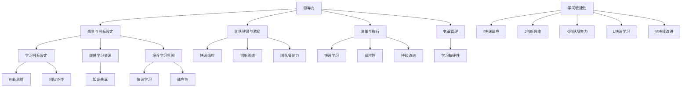

                 

# 领导力与学习敏捷性：培养快速学习的能力

关键词：领导力、学习敏捷性、快速学习、技能提升、管理实践

摘要：本文旨在探讨领导力与学习敏捷性的关系，分析两者之间的相互作用及其对个人和团队成长的重要性。通过逐步分析领导力与学习敏捷性的核心概念、特点、核心要素以及融合实践，本文将为读者提供一个全面的视角，帮助他们在专业和职业生涯中实现快速学习与持续成长。

### 目录大纲

## 第一部分：引言

### 1.1 问题背景
#### 1.1.1 领导力的重要性
#### 1.1.2 学习敏捷性的定义
#### 1.1.3 领导力与学习敏捷性的联系

### 1.2 核心概念
#### 1.2.1 领导力的核心概念
#### 1.2.2 学习敏捷性的核心概念
#### 1.2.3 领导力与学习敏捷性的关系图

### 1.3 边界与外延
#### 1.3.1 领导力的边界
#### 1.3.2 学习敏捷性的边界
#### 1.3.3 领导力与学习敏捷性的互动

### 1.4 概念结构与核心要素组成
#### 1.4.1 领导力的概念结构
#### 1.4.2 学习敏捷性的概念结构
#### 1.4.3 领导力与学习敏捷性的核心要素组成

### 1.5 本章小结

## 第二部分：领导力

### 2.1 领导力的定义与特点
#### 2.1.1 领导力的定义
#### 2.1.2 领导力的特点
#### 2.1.3 领导力与管理的区别

### 2.2 领导力的核心要素
#### 2.2.1 领导者的品质
#### 2.2.2 领导风格
#### 2.2.3 领导者的沟通技巧

### 2.3 领导力的发展与实践
#### 2.3.1 领导力的发展路径
#### 2.3.2 领导力实践的重要性
#### 2.3.3 领导力实践的方法与技巧

### 2.4 领导力案例分析
#### 2.4.1 成功的领导力案例
#### 2.4.2 失败的领导力案例
#### 2.4.3 案例分析与应用

### 2.5 本章小结

## 第三部分：学习敏捷性

### 3.1 学习敏捷性的定义与特点
#### 3.1.1 学习敏捷性的定义
#### 3.1.2 学习敏捷性的特点
#### 3.1.3 学习敏捷性与传统学习的区别

### 3.2 学习敏捷性的核心要素
#### 3.2.1 学习态度
#### 3.2.2 学习策略
#### 3.2.3 学习技能

### 3.3 学习敏捷性的培养与实践
#### 3.3.1 学习敏捷性的培养方法
#### 3.3.2 学习敏捷性的实践策略
#### 3.3.3 学习敏捷性的实践案例

### 3.4 学习敏捷性案例分析
#### 3.4.1 成功的学习敏捷性案例
#### 3.4.2 失败的学习敏捷性案例
#### 3.4.3 案例分析与应用

### 3.5 本章小结

## 第四部分：领导力与学习敏捷性的融合

### 4.1 领导力与学习敏捷性的融合
#### 4.1.1 领导力与学习敏捷性的融合意义
#### 4.1.2 领导力与学习敏捷性的融合路径
#### 4.1.3 领导力与学习敏捷性的融合策略

### 4.2 融合案例分析
#### 4.2.1 成功的融合案例
#### 4.2.2 失败的融合案例
#### 4.2.3 案例分析与应用

### 4.3 融合实践
#### 4.3.1 融合实践的重要性
#### 4.3.2 融合实践的方法与技巧
#### 4.3.3 融合实践案例

### 4.4 本章小结

## 第五部分：总结与展望

### 5.1 总结
#### 5.1.1 领导力与学习敏捷性的核心要点
#### 5.1.2 领导力与学习敏捷性的应用前景
#### 5.1.3 未来发展趋势

### 5.2 展望
#### 5.2.1 领导力与学习敏捷性的未来发展
#### 5.2.2 对读者的话
#### 5.2.3 拓展阅读

### 5.3 本章小结

## 第一部分：引言

### 1.1 问题背景

在当今快速变化的世界中，领导力和学习敏捷性成为了个人和团队成功的关键要素。随着技术、市场和竞争环境的不断演变，组织和个人必须具备快速适应和持续学习的能力。领导力不仅是推动团队实现目标的能力，更是培养和激发团队成员学习敏捷性的基础。

领导力的重要性在于它能够提供清晰的方向和目标，激发团队成员的潜力，并在面对挑战时保持团队的凝聚力。而学习敏捷性则强调快速获取新知识和技能，以应对不断变化的环境。两者之间存在着密切的联系：领导力可以引导和推动学习敏捷性的发展，而学习敏捷性则是领导力有效实施的重要保障。

#### 1.1.1 领导力的重要性

领导力是一种激励和影响他人共同实现目标的能力。在组织和企业中，领导力不仅关乎绩效和成果，更关乎团队士气、员工满意度和创新能力。以下是一些领导力的重要方面：

- **愿景与目标设定**：领导者需要明确组织的愿景和目标，并将其转化为具体的行动计划。
- **团队建设与激励**：领导者通过建立积极的工作氛围、激励员工发挥潜能来提升团队绩效。
- **决策与执行**：领导者需要在不确定性中做出明智的决策，并确保决策得到有效执行。
- **变革管理**：在组织变革过程中，领导者需要引导员工适应新环境，确保变革的顺利实施。

#### 1.1.2 学习敏捷性的定义

学习敏捷性是指个体或团队在面临复杂和不确定的环境时，快速学习、适应和应对变化的能力。学习敏捷性包括以下几个方面：

- **持续学习**：保持对知识的渴望，不断更新知识和技能。
- **快速适应**：在面对变化时能够迅速调整策略和方法。
- **创新能力**：通过创新思维和行动，寻找新的解决方案。
- **团队协作**：在团队中培养合作和共享知识的文化。

#### 1.1.3 领导力与学习敏捷性的联系

领导力与学习敏捷性之间存在着密切的相互作用。领导力可以激发团队成员的学习敏捷性，通过以下方式实现：

- **设定学习目标**：领导者可以明确学习目标和预期成果，激发团队成员的学习动力。
- **提供学习资源**：领导者可以为团队成员提供必要的资源和支持，帮助他们快速学习。
- **培养学习氛围**：领导者可以通过建立学习型组织文化，鼓励团队成员分享知识和经验。

学习敏捷性则可以增强领导力的有效性，通过以下方式实现：

- **快速适应**：团队成员的学习敏捷性可以帮助领导者更好地应对变化和不确定性。
- **创新思维**：学习敏捷性的团队成员可以带来新的视角和解决方案，推动组织的创新。
- **团队凝聚力**：共同的学习经历可以增强团队成员之间的信任和合作，提升团队凝聚力。

### 1.2 核心概念

为了深入理解领导力与学习敏捷性，我们需要明确这两个概念的核心要素和它们之间的关系。

#### 1.2.1 领导力的核心概念

领导力是一种复杂的能力，它涉及到多个方面。以下是领导力的核心概念：

- **影响力**：领导者通过激励和影响他人来实现共同目标。
- **愿景**：领导者需要具备清晰的愿景，能够为团队指明方向。
- **决策能力**：领导者需要在不确定性和压力下做出明智的决策。
- **沟通技巧**：领导者需要有效地传达信息和理解团队成员的需求。

#### 1.2.2 学习敏捷性的核心概念

学习敏捷性的核心概念包括：

- **快速学习**：在短时间内吸收和处理大量信息，并将其应用于实际工作中。
- **适应性**：在面对变化时能够灵活调整策略和方法。
- **持续改进**：不断反思和改进学习过程，提高学习效率。
- **知识共享**：在团队内部共享知识和经验，促进共同成长。

#### 1.2.3 领导力与学习敏捷性的关系图

为了更直观地展示领导力与学习敏捷性的关系，我们可以使用以下Mermaid关系图：

### 1.3 边界与外延

#### 1.3.1 领导力的边界

领导力虽然是一个广泛的概念，但它的应用范围和效果受到多种因素的影响。以下是一些领导力的边界：

- **组织层级**：领导力在不同层级（如中层、高层）可能有不同的表现和作用。
- **文化背景**：领导力在不同文化背景下可能需要调整策略和方法。
- **情境因素**：领导力在不同情境下（如危机、稳定）可能需要不同的应对策略。

#### 1.3.2 学习敏捷性的边界

学习敏捷性同样受到多种因素的制约。以下是一些学习敏捷性的边界：

- **知识领域**：学习敏捷性在不同知识领域（如技术、管理）可能有所不同。
- **个人能力**：学习敏捷性受到个人能力（如认知、技能）的限制。
- **资源支持**：学习敏捷性需要必要的资源支持（如时间、资金、技术）。

#### 1.3.3 领导力与学习敏捷性的互动

领导力与学习敏捷性之间的互动是动态的，它们在不同情境下可能相互促进或制约。以下是一些互动的例子：

- **领导力促进学习敏捷性**：通过设定明确的学习目标和提供资源支持，领导者可以激发团队成员的学习敏捷性。
- **学习敏捷性增强领导力**：通过快速学习和适应变化，团队成员可以提升领导者的决策能力和团队管理效率。

### 1.4 概念结构与核心要素组成

#### 1.4.1 领导力的概念结构

领导力的概念结构可以从以下几个方面进行理解：

- **核心能力**：影响力、愿景、决策能力、沟通技巧。
- **作用领域**：团队建设、目标设定、决策执行、变革管理。
- **影响因素**：组织层级、文化背景、情境因素。

#### 1.4.2 学习敏捷性的概念结构

学习敏捷性的概念结构可以从以下几个方面进行理解：

- **核心能力**：快速学习、适应性、持续改进、知识共享。
- **作用领域**：个人成长、团队协作、知识管理、创新思维。
- **影响因素**：知识领域、个人能力、资源支持。

#### 1.4.3 领导力与学习敏捷性的核心要素组成

领导力与学习敏捷性的核心要素组成可以从以下几个方面进行理解：

- **领导力要素**：愿景、目标、团队、决策、沟通。
- **学习敏捷性要素**：学习、适应、创新、共享。
- **互动要素**：激励、资源、反馈、文化。

### 1.5 本章小结

本部分介绍了领导力与学习敏捷性的核心概念、联系及其边界与外延。通过分析领导力的重要性、学习敏捷性的定义及其核心要素，我们为后续章节的深入探讨奠定了基础。领导力与学习敏捷性的互动是动态的，它们在个人和团队成长中发挥着重要作用。接下来，我们将进一步探讨领导力的具体特点、核心要素以及如何发展与实践领导力。

## 第二部分：领导力

### 2.1 领导力的定义与特点

领导力是一种复杂而多维度的能力，它涉及到多个方面。为了更好地理解领导力，我们首先需要明确其定义和特点。

#### 2.1.1 领导力的定义

领导力可以被定义为一种影响和激励他人共同实现目标的能力。这种能力不仅包括个人品质和技能，还涉及到与团队成员的互动和合作。以下是对领导力的几种常见定义：

- **哈佛商学院**：“领导力是影响他人实现共同目标的能力。”
- **彼得·德鲁克**：“领导力是创造影响力，引导人们完成共同目标的过程。”
- **约翰·肯尼迪**：“领导力不是关于权力，而是关于激励、影响和激励他人。”

#### 2.1.2 领导力的特点

领导力具有以下一些显著特点：

- **影响力**：领导力是一种影响力，领导者通过激励和影响他人来实现目标。
- **愿景**：领导者需要具备清晰的愿景，能够为团队指明方向。
- **决策能力**：领导者需要在不确定性和压力下做出明智的决策。
- **沟通技巧**：领导者需要有效地传达信息和理解团队成员的需求。
- **团队建设**：领导者需要建立有效的团队，激发团队成员的潜力。

#### 2.1.3 领导力与管理的区别

领导力与管理是两个密切相关但又不同的概念。以下是领导力与管理的一些区别：

- **焦点**：管理主要关注效率和流程，而领导力则关注愿景和激励。
- **职责**：管理者负责确保目标的实现，领导者则负责设定目标和激励团队。
- **风格**：管理通常采用结构化和程序化的方式，而领导力则更加灵活和适应性。
- **影响**：管理主要通过职位和权力来影响他人，而领导力则通过价值观和愿景来影响他人。

### 2.2 领导力的核心要素

领导力是一个复杂的概念，它包含多个核心要素。以下是对这些核心要素的详细探讨：

#### 2.2.1 领导者的品质

领导者的品质是领导力的基础。以下是一些关键的领导者品质：

- **诚实与透明**：领导者需要具备诚实和透明的品质，以建立信任和尊重。
- **自信与决心**：领导者需要有自信和决心，能够在压力和挑战面前保持冷静和坚定。
- **同情心与同理心**：领导者需要具备同情心和同理心，能够理解和关心团队成员的需求和感受。
- **正直与道德**：领导者需要具备正直和道德，以树立良好的榜样和行为准则。

#### 2.2.2 领导风格

领导风格是领导者处理和管理团队的方式。不同的领导风格适用于不同的情境和团队。以下是一些常见的领导风格：

- **指令型**：领导者明确指示团队成员应该做什么，如何做。
- **支持型**：领导者提供支持和鼓励，帮助团队成员克服困难。
- **参与型**：领导者与团队成员共同决策和参与管理。
- **授权型**：领导者将权力和责任下放给团队成员，鼓励自主性和创新。

#### 2.2.3 领导者的沟通技巧

沟通技巧是领导者成功的关键。以下是一些关键的沟通技巧：

- **有效倾听**：领导者需要有效地倾听团队成员的意见和需求，理解他们的观点。
- **清晰表达**：领导者需要清晰表达自己的想法和目标，确保团队成员理解。
- **建立信任**：领导者需要通过沟通建立信任，促进团队合作和协作。
- **积极反馈**：领导者需要给予积极的反馈，鼓励团队成员的成长和发展。

### 2.3 领导力的发展与实践

领导力是一个不断发展和实践的过程。以下是一些关于领导力发展与实践的关键要点：

#### 2.3.1 领导力的发展路径

领导力的发展路径通常包括以下几个阶段：

- **自我认知**：领导者首先需要了解自己的优点和缺点，明确自己的领导风格和价值观。
- **学习与培训**：领导者需要通过学习和培训不断提升自己的知识和技能。
- **实践与反思**：领导者需要将学到的知识和技能应用到实际工作中，并进行反思和总结。
- **持续发展**：领导力是一个持续的过程，领导者需要不断学习和成长。

#### 2.3.2 领导力实践的重要性

领导力实践对于组织和个人都具有重要意义。以下是一些关键点：

- **提升团队绩效**：有效的领导力实践可以提升团队的绩效和生产力。
- **培养人才**：领导力实践可以帮助培养和激发团队成员的潜力，提升整个团队的能力。
- **促进创新**：领导力实践可以鼓励团队成员创新思维和行动，推动组织的创新和发展。
- **建立文化**：领导力实践可以建立积极的企业文化，促进团队合作和协作。

#### 2.3.3 领导力实践的方法与技巧

以下是一些领导力实践的方法与技巧：

- **设定明确的愿景和目标**：领导者需要明确组织的愿景和目标，并将其传达给团队成员。
- **建立积极的工作氛围**：领导者需要营造一个积极的工作氛围，鼓励团队成员分享和合作。
- **提供支持和资源**：领导者需要为团队成员提供必要的支持和资源，帮助他们实现目标。
- **建立有效的沟通机制**：领导者需要建立有效的沟通机制，确保团队成员之间的信息畅通。
- **激励和奖励**：领导者需要通过激励和奖励来鼓励团队成员的积极性和创造力。
- **持续学习和改进**：领导者需要持续学习和改进自己的领导技能，以适应不断变化的环境。

### 2.4 领导力案例分析

#### 2.4.1 成功的领导力案例

以下是一些成功的领导力案例：

- **乔布斯**：乔布斯是苹果公司的创始人之一，他以卓越的领导力推动了苹果公司的创新和发展。他通过设定明确的愿景和目标，激发团队成员的潜力，推动了苹果公司的产品和市场的成功。
- **杰克·韦尔奇**：杰克·韦尔奇是通用电气的董事长兼首席执行官，他以强势的领导风格和远见卓识，推动了通用电气的转型和发展。他通过精简组织、优化流程和鼓励创新，使通用电气成为全球最成功的公司之一。
- **李开复**：李开复是创新工场的创始人，他以卓越的领导力和创业精神，推动了人工智能领域的发展和创新。他通过设立明确的目标和愿景，激发团队成员的潜力，推动了创新工场的快速发展。

#### 2.4.2 失败的领导力案例

以下是一些失败的领导力案例：

- **史蒂夫·乔布斯**：史蒂夫·乔布斯在离开苹果公司期间，领导力出现了问题。他过于强势和独断，忽视团队成员的意见和需求，导致团队士气低落和创新能力的下降。这也是苹果公司在乔布斯离开后出现业绩下滑的原因之一。
- **安迪·库柏**：安迪·库柏是微软公司的前首席执行官，他的领导力也存在问题。他过于依赖技术和管理流程，忽视市场和用户的需求，导致微软在互联网时代的竞争力下降。

#### 2.4.3 案例分析与应用

通过分析成功的领导力案例，我们可以学习到以下几点：

- **设定明确的愿景和目标**：成功的领导者需要设定明确的愿景和目标，以激发团队成员的潜力。
- **建立积极的工作氛围**：领导者需要建立积极的工作氛围，鼓励团队成员分享和合作。
- **提供支持和资源**：领导者需要为团队成员提供必要的支持和资源，帮助他们实现目标。
- **持续学习和改进**：领导者需要持续学习和改进自己的领导技能，以适应不断变化的环境。

通过分析失败的领导力案例，我们可以吸取以下几点教训：

- **避免独断和强势**：领导者需要避免过于独断和强势，尊重团队成员的意见和需求。
- **关注市场和用户需求**：领导者需要关注市场和用户需求，以保持企业的竞争力。
- **平衡技术和管理**：领导者需要平衡技术和管理，确保企业能够持续发展和创新。

### 2.5 本章小结

本部分详细探讨了领导力的定义、特点、核心要素以及发展与实践。通过分析成功的领导力案例和失败的领导力案例，我们得出了领导力实践的重要性和方法。领导力不仅关乎个人和团队的成功，更关乎企业的持续发展和创新。在接下来的部分，我们将进一步探讨学习敏捷性的定义、特点以及如何培养和实践学习敏捷性。

## 第三部分：学习敏捷性

### 3.1 学习敏捷性的定义与特点

学习敏捷性是个人和团队在面对快速变化的环境时，能够快速获取新知识、适应新情况并有效应用这些知识的能力。这一概念在当今高度不确定和动态变化的时代尤为重要。以下是对学习敏捷性定义与特点的详细探讨。

#### 3.1.1 学习敏捷性的定义

学习敏捷性可以理解为一种动态的、适应性的学习过程。它强调以下几个方面：

- **快速学习**：在短时间内快速吸收和处理新信息，并将其应用到实践中。
- **适应性**：在面对变化时能够迅速调整策略和方法，以适应新的环境和需求。
- **持续改进**：不断反思学习过程，寻找改进机会，以提高学习效率和质量。
- **知识共享**：在团队内部积极分享知识和经验，促进共同成长。

#### 3.1.2 学习敏捷性的特点

学习敏捷性具有以下显著特点：

- **灵活性**：学习敏捷性强调灵活应对变化，能够迅速调整学习策略和资源分配。
- **快速响应**：在变化发生时，能够迅速响应并采取行动，以减少不利影响。
- **创新能力**：通过持续学习和适应，能够不断创新思维和解决方案。
- **团队合作**：学习敏捷性需要团队成员之间的紧密协作和知识共享，以提高整体效能。

#### 3.1.3 学习敏捷性与传统学习的区别

学习敏捷性与传统学习存在一些显著的区别：

- **学习方式**：传统学习通常是以课程和培训为主，而学习敏捷性更注重实践和应用。
- **学习内容**：传统学习侧重于基础知识，而学习敏捷性更关注实时知识和技能。
- **学习速度**：传统学习过程较慢，而学习敏捷性强调快速学习和适应。
- **学习主体**：传统学习多以个体为主，而学习敏捷性强调团队合作和集体智慧。

### 3.2 学习敏捷性的核心要素

学习敏捷性的实现依赖于一系列核心要素，以下是对这些要素的详细探讨：

#### 3.2.1 学习态度

学习态度是学习敏捷性的基础。一个积极的学习态度包括以下几个方面：

- **好奇心**：对未知事物保持好奇，不断探索和学习。
- **主动性**：主动寻求学习机会，积极应对挑战。
- **反思性**：在学习过程中不断反思和总结，以提升学习效果。
- **开放性**：愿意接受新观点和反馈，勇于尝试新的学习方法和策略。

#### 3.2.2 学习策略

有效的学习策略是学习敏捷性的关键。以下是一些常用的学习策略：

- **多样化学习**：通过阅读、实践、讨论等多种方式学习，以获取全面的知识和技能。
- **目标导向学习**：设定清晰的学习目标，确保学习活动与目标一致。
- **问题解决学习**：通过解决实际问题来学习，以提高学习的效果和应用性。
- **协作学习**：与他人合作学习，共享知识和经验，提升学习效率。

#### 3.2.3 学习技能

学习技能是学习敏捷性的核心。以下是一些关键的学习技能：

- **信息检索技能**：能够高效地检索和获取所需信息，以支持学习和决策。
- **批判性思维**：对信息进行批判性分析，识别和评估其价值和可信度。
- **沟通技能**：能够清晰、有效地表达自己的观点和意见，促进知识共享。
- **创新思维**：培养创新思维，以提出新的观点和解决方案。

### 3.3 学习敏捷性的培养与实践

培养和实践学习敏捷性是一个持续的过程，需要个人和组织的共同努力。以下是一些具体的培养和实践策略：

#### 3.3.1 学习敏捷性的培养方法

- **建立学习型组织**：组织可以通过建立学习型组织文化，鼓励员工持续学习和成长。
- **提供学习资源**：组织应提供丰富的学习资源，包括培训、在线课程、书籍等。
- **鼓励创新**：组织应鼓励员工创新思维，提供试错和反馈机制。
- **建立知识共享平台**：通过内部知识共享平台，促进知识和经验的传递和交流。

#### 3.3.2 学习敏捷性的实践策略

- **持续学习**：个人应保持对知识的渴望，不断学习和更新自己的知识库。
- **实践应用**：将学到的知识应用到实际工作中，以检验学习效果和提升实践能力。
- **反思与改进**：在学习过程中不断反思和总结，发现不足并加以改进。
- **团队合作**：与他人合作学习，共享知识和经验，以实现共同成长。

#### 3.3.3 学习敏捷性的实践案例

以下是一些学习敏捷性的实践案例：

- **案例一**：某公司在面临市场变化时，迅速调整产品策略，通过内部培训和实践，提高了员工的市场适应能力，成功应对了市场挑战。
- **案例二**：某团队在项目实施过程中，通过持续学习和协作，不断优化解决方案，最终实现了项目目标，并获得了客户的高度评价。

### 3.4 学习敏捷性案例分析

#### 3.4.1 成功的学习敏捷性案例

以下是一些成功的学习敏捷性案例：

- **案例一**：谷歌公司以其创新和快速适应变化的能力而闻名。谷歌通过内部培训、项目试错和持续改进，不断推动技术创新和业务发展。
- **案例二**：华为公司在全球市场变化中，通过持续学习和创新，成功拓展了国际市场，并建立了强大的全球研发体系。

#### 3.4.2 失败的学习敏捷性案例

以下是一些失败的学习敏捷性案例：

- **案例一**：某企业在面对市场变化时，未能及时调整策略，导致市场份额大幅下降，最终陷入困境。
- **案例二**：某团队在项目实施过程中，未能充分利用学习敏捷性，导致项目延期和预算超支。

#### 3.4.3 案例分析与应用

通过分析成功的学习敏捷性案例，我们可以得出以下几点启示：

- **快速响应**：在面对市场变化时，企业应迅速调整策略，以适应新的环境。
- **持续创新**：企业应鼓励创新思维，通过内部培训和项目试错，不断提升自身竞争力。
- **团队合作**：团队合作是实现学习敏捷性的关键，企业应建立学习型组织文化，促进知识共享和协作。

通过分析失败的学习敏捷性案例，我们可以吸取以下几点教训：

- **及时调整**：企业应密切关注市场变化，及时调整策略和行动。
- **持续学习**：企业应保持对知识的渴望，不断学习和更新自己的知识库。
- **团队协作**：团队协作是实现学习敏捷性的关键，企业应鼓励团队合作和知识共享。

### 3.5 本章小结

本部分详细探讨了学习敏捷性的定义、特点、核心要素以及培养和实践策略。通过分析成功和失败的学习敏捷性案例，我们得出了学习敏捷性在个人和团队成长中的重要性。学习敏捷性不仅是应对快速变化的工具，更是实现持续成长和创新的关键。在接下来的部分，我们将进一步探讨如何将领导力与学习敏捷性融合，以实现更高效的个人和团队发展。

## 第四部分：领导力与学习敏捷性的融合

### 4.1 领导力与学习敏捷性的融合

领导力与学习敏捷性的融合是提升个人和团队竞争力的关键。通过结合领导力中的愿景、决策和沟通能力与学习敏捷性中的快速学习、适应性和创新能力，可以实现更高效的个人和团队发展。以下是对领导力与学习敏捷性融合的详细探讨。

#### 4.1.1 领导力与学习敏捷性的融合意义

领导力与学习敏捷性的融合具有以下重要意义：

- **提升个人和团队绩效**：通过融合领导力与学习敏捷性，个人和团队能够更快速地适应变化，提升绩效和创新能力。
- **增强组织竞争力**：融合领导力与学习敏捷性可以帮助组织在快速变化的市场环境中保持竞争优势。
- **促进个人成长**：融合领导力与学习敏捷性可以激发个人潜力，促进个人成长和发展。
- **建立学习型组织**：融合领导力与学习敏捷性有助于建立学习型组织文化，促进知识共享和协作。

#### 4.1.2 领导力与学习敏捷性的融合路径

实现领导力与学习敏捷性的融合需要遵循以下路径：

1. **建立共同愿景**：领导者需要与团队成员共同建立清晰的愿景，确保团队成员理解并认同组织的方向和目标。
2. **培养学习文化**：领导者需要培养团队的学习文化，鼓励成员持续学习和创新，创造一个支持学习和知识共享的环境。
3. **明确学习目标**：领导者需要与团队成员共同设定明确的个人和学习目标，确保学习活动与组织目标一致。
4. **提供学习资源**：领导者需要为团队成员提供必要的资源和支持，包括培训、在线课程和专家指导等。
5. **激励和奖励**：领导者需要通过激励和奖励机制，鼓励团队成员积极参与学习和创新活动，提高学习效果。

#### 4.1.3 领导力与学习敏捷性的融合策略

以下是一些具体的融合策略：

1. **领导力培训**：领导者可以通过参与培训和学习，提升自己的领导力和学习敏捷性，从而更好地引导和激励团队成员。
2. **团队建设活动**：领导者可以组织团队建设活动，增强团队成员之间的信任和合作，促进知识共享和创新能力。
3. **学习激励机制**：领导者可以设计有效的学习激励机制，鼓励团队成员积极参与学习和创新活动，提高学习效果。
4. **知识管理**：领导者需要建立有效的知识管理系统，促进知识和经验的传递和交流，提高团队整体学习效率。
5. **实践应用**：领导者需要鼓励团队成员将学到的知识应用到实际工作中，通过实践检验学习效果，提升实践能力。

### 4.2 融合案例分析

#### 4.2.1 成功的融合案例

以下是一些成功的领导力与学习敏捷性融合案例：

- **案例一**：某科技公司通过引入学习型组织文化，为员工提供丰富的学习资源和培训机会，鼓励团队成员持续学习和创新。在领导者的引导下，团队成员的绩效和创新能力得到了显著提升，公司整体竞争力也大幅提高。
- **案例二**：某创业团队在项目实施过程中，通过设立明确的学习目标和激励机制，鼓励团队成员积极参与学习和创新。团队成员在短时间内掌握了新的技术和方法，成功完成了项目，并获得了客户的高度评价。

#### 4.2.2 失败的融合案例

以下是一些失败的领导力与学习敏捷性融合案例：

- **案例一**：某企业在领导者的领导下，虽然重视学习资源的投入，但缺乏有效的激励机制和知识管理机制，导致团队成员的学习积极性和创新意识不高，学习效果不佳。
- **案例二**：某创业团队在项目实施过程中，虽然设立了明确的学习目标，但没有提供足够的支持和资源，导致团队成员在学习和创新方面面临困难，项目进展缓慢。

#### 4.2.3 案例分析与应用

通过分析成功的融合案例，我们可以得出以下几点启示：

- **明确目标**：领导者需要明确学习目标和激励机制，确保团队成员的学习活动与组织目标一致。
- **提供支持**：领导者需要为团队成员提供必要的支持和资源，帮助他们在学习和创新过程中克服困难。
- **鼓励合作**：领导者需要鼓励团队成员之间的合作和知识共享，促进共同成长。
- **持续改进**：领导者需要不断反思和总结学习效果，持续改进学习策略和激励机制。

通过分析失败的融合案例，我们可以吸取以下几点教训：

- **缺乏激励**：领导者需要建立有效的激励机制，提高团队成员的学习积极性和创新意识。
- **资源不足**：领导者需要确保为团队成员提供足够的支持和资源，以支持他们的学习和创新活动。
- **缺乏反馈**：领导者需要建立反馈机制，及时了解团队成员的学习效果和需求，提供针对性的支持和指导。

### 4.3 融合实践

#### 4.3.1 融合实践的重要性

领导力与学习敏捷性的融合实践对于个人和团队的成长具有重要意义：

- **提升个人能力**：融合实践可以帮助个人提升领导力和学习敏捷性，增强在快速变化环境中的适应能力。
- **增强团队协作**：融合实践可以促进团队协作，提高团队整体绩效和创新能力。
- **实现组织目标**：融合实践有助于实现组织的目标，提升组织的竞争力和持续发展能力。

#### 4.3.2 融合实践的方法与技巧

以下是一些融合实践的方法与技巧：

1. **建立学习型组织文化**：领导者需要通过树立榜样、宣传教育和激励机制，建立积极的学习型组织文化。
2. **提供多样化的学习资源**：组织应提供丰富的学习资源，包括内部培训、在线课程、外部培训等。
3. **开展团队学习活动**：领导者可以组织团队学习活动，如研讨会、工作坊和知识分享会，促进团队成员之间的交流和合作。
4. **建立反馈机制**：领导者需要建立有效的反馈机制，及时了解团队成员的学习效果和需求，提供针对性的支持和指导。
5. **鼓励实践应用**：领导者需要鼓励团队成员将学到的知识应用到实际工作中，通过实践检验学习效果。

#### 4.3.3 融合实践案例

以下是一个融合实践的案例：

- **案例**：某创业团队在项目实施过程中，通过建立学习型组织文化和提供多样化的学习资源，鼓励团队成员持续学习和创新。团队成员在短时间内掌握了新的技术和方法，成功完成了项目，并获得了客户的高度评价。

### 4.4 本章小结

本部分详细探讨了领导力与学习敏捷性的融合意义、路径、策略和实践。通过分析成功和失败的融合案例，我们得出了领导力与学习敏捷性融合的重要性及其具体实践方法。领导力与学习敏捷性的融合有助于提升个人和团队的能力，增强组织的竞争力。在未来的发展中，领导者应重视领导力与学习敏捷性的融合，持续推动个人和团队的发展。

## 第五部分：总结与展望

### 5.1 总结

在本文中，我们详细探讨了领导力与学习敏捷性的核心概念、特点、核心要素以及它们之间的融合策略和实践。以下是对文章核心要点的总结：

1. **领导力的重要性**：领导力是一种激励和影响他人共同实现目标的能力，它涉及愿景、决策、沟通和团队建设等方面。
2. **学习敏捷性的定义与特点**：学习敏捷性是指个人或团队在面对快速变化的环境时，能够快速学习、适应和创新的动态学习过程。
3. **领导力与学习敏捷性的关系**：领导力可以激发和推动学习敏捷性的发展，而学习敏捷性可以增强领导力的有效性。
4. **领导力的核心要素**：领导者的品质、领导风格和沟通技巧是领导力的核心要素。
5. **学习敏捷性的核心要素**：学习态度、学习策略和学习技能是学习敏捷性的核心要素。
6. **领导力与学习敏捷性的融合**：通过建立共同愿景、培养学习文化、明确学习目标、提供学习资源和激励奖励等策略，可以实现领导力与学习敏捷性的有效融合。

### 5.2 展望

在未来的发展中，领导力与学习敏捷性的融合将发挥越来越重要的作用。以下是对未来的展望：

1. **组织文化**：组织应建立学习型组织文化，鼓励持续学习和创新，以应对快速变化的市场环境。
2. **技术赋能**：利用新技术和工具，如人工智能、大数据等，提升学习敏捷性和领导力。
3. **个性化学习**：通过个性化学习方案，满足不同团队成员的学习需求，提高学习效果。
4. **跨界合作**：鼓励跨学科、跨行业的合作，促进知识的共享和创新。
5. **领导力发展**：领导者应持续发展自己的领导力和学习敏捷性，以适应不断变化的环境和挑战。

### 5.3 对读者的话

对于读者来说，培养领导力和学习敏捷性是一个长期而持续的过程。希望本文能为您提供一个全面的视角，帮助您更好地理解和应用这些概念。在实际工作和生活中，不断实践和反思，将所学知识付诸行动，才能实现真正的成长和发展。

### 5.4 拓展阅读

为了进一步深入了解领导力与学习敏捷性，读者可以参考以下拓展阅读资源：

- **《领导力五大障碍》**：作者：帕斯卡尔·瑞安，详细探讨了领导力面临的五大障碍及其解决方法。
- **《学习之道》**：作者：彼得·德鲁克，阐述了持续学习和自我发展的重要性。
- **《敏捷软件开发实践指南》**：作者：杰夫·萨瑟兰，介绍了敏捷开发方法在团队协作和学习敏捷性中的应用。
- **《学习与成长》**：作者：史蒂芬·柯维，提供了关于个人成长和学习的重要见解。

### 5.5 本章小结

本部分对文章的核心内容进行了总结，并对未来的发展进行了展望。领导力与学习敏捷性的融合是个人和团队成功的关键，希望读者能在实践中不断探索和提升自己的领导力和学习敏捷性。通过持续学习和反思，我们能够更好地适应快速变化的环境，实现持续成长和发展。

作者：AI天才研究院/AI Genius Institute & 禅与计算机程序设计艺术 /Zen And The Art of Computer Programming

### 总结

在本文中，我们系统地探讨了领导力与学习敏捷性的核心概念、特点、核心要素及其融合策略。首先，我们分析了领导力的重要性，包括愿景、决策、沟通和团队建设等方面，并详细讨论了学习敏捷性的定义和特点，如快速学习、适应性和创新能力。接着，我们分别介绍了领导力与学习敏捷性的核心要素，包括领导者的品质、领导风格、沟通技巧、学习态度、学习策略和学习技能。在此基础上，我们提出了领导力与学习敏捷性融合的策略和实践方法，并通过案例分析展示了成功和失败的经验。

通过本文的探讨，我们得出了以下结论：

1. **领导力与学习敏捷性的融合是提升个人和团队竞争力的重要手段**。领导者需要具备良好的领导力和学习敏捷性，以激发团队的潜力和创新能力。

2. **建立学习型组织文化** 是实现领导力与学习敏捷性融合的关键。组织应鼓励持续学习、知识共享和团队合作，为团队成员提供必要的资源和支持。

3. **快速适应和持续学习** 是个人和团队成功的关键。在快速变化的环境中，能够快速适应和学习新知识和技能，能够帮助个人和团队保持竞争优势。

4. **领导力与学习敏捷性的融合需要持续实践和反思**。领导者应不断反思和改进自己的领导风格和学习策略，以适应不断变化的环境。

### 应用前景

随着全球化、数字化和信息化的加速，领导力与学习敏捷性的融合将在未来发挥更加重要的作用。以下是一些潜在的应用前景：

1. **企业创新**：企业通过融合领导力与学习敏捷性，可以推动产品创新和服务创新，提高市场竞争力。

2. **组织变革**：在组织变革过程中，领导力与学习敏捷性的融合可以帮助员工快速适应新环境，确保变革的顺利实施。

3. **个人发展**：个人通过培养领导力和学习敏捷性，可以提升职业竞争力，实现职业生涯的持续成长。

4. **教育改革**：在教育领域，融合领导力与学习敏捷性的理念，可以推动教育创新，培养具有创新精神和适应能力的学生。

### 未来发展趋势

未来，领导力与学习敏捷性的发展将呈现出以下趋势：

1. **个性化学习**：随着技术的发展，个性化学习将成为主流，为不同个体提供量身定制的学习方案。

2. **跨界合作**：跨学科、跨行业的合作将促进知识的整合和创新，推动领导力与学习敏捷性的融合。

3. **技术赋能**：人工智能、大数据等新技术将赋能领导力与学习敏捷性的发展，提高学习效率和决策质量。

4. **可持续发展**：在可持续发展背景下，领导力与学习敏捷性的融合将更加注重社会责任和环境保护。

### 对读者的话

对于读者来说，培养领导力和学习敏捷性是一个持续的过程。希望本文能为您提供一些启示和策略，帮助您在实际工作和生活中更好地应用这些概念。请记住，持续学习、反思和改进是关键。不断探索新的知识，适应快速变化的环境，您将能够实现个人和团队的持续成长和发展。

### 拓展阅读

为了进一步深入了解领导力与学习敏捷性的相关理论和实践，以下是几本推荐阅读的书籍：

1. **《领导力五大障碍》**：帕斯卡尔·瑞安
2. **《学习之道》**：彼得·德鲁克
3. **《敏捷软件开发实践指南》**：杰夫·萨瑟兰
4. **《学习与成长》**：史蒂芬·柯维

通过阅读这些书籍，您将能够获得更深入的见解和实用的技巧，帮助您在领导力和学习敏捷性的培养方面取得更大的进步。

### 摘要

本文详细探讨了领导力与学习敏捷性的核心概念、特点、核心要素及其融合策略。通过系统分析，我们明确了领导力在个人和团队成长中的重要性，以及学习敏捷性在应对快速变化环境中的关键作用。我们提出了领导力与学习敏捷性融合的策略和实践方法，并通过案例分析展示了其实际应用效果。文章旨在为读者提供一个全面的视角，帮助他们在专业和职业生涯中实现快速学习与持续成长。通过本文的阅读，读者将能够更好地理解并应用领导力和学习敏捷性的理念，以提升个人和团队的竞争力。

