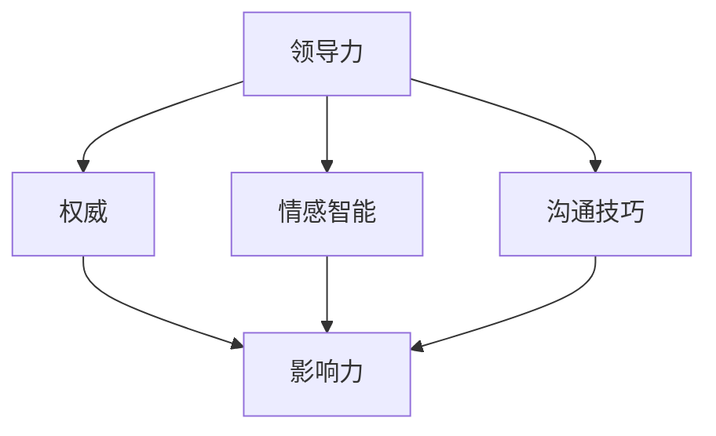
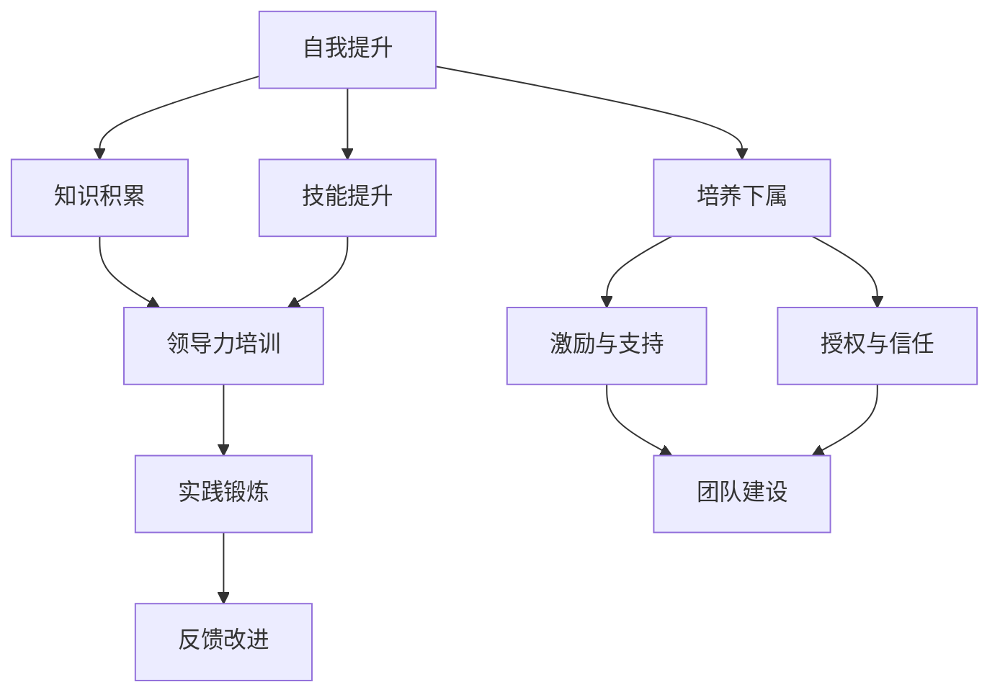
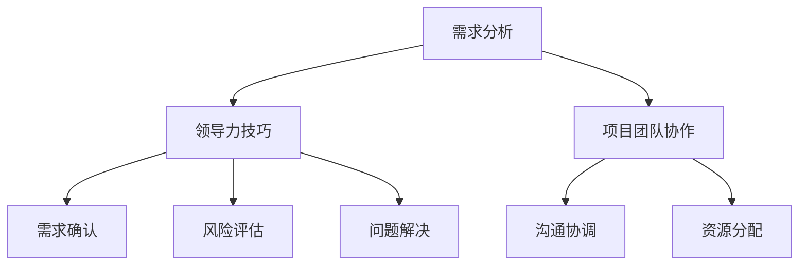
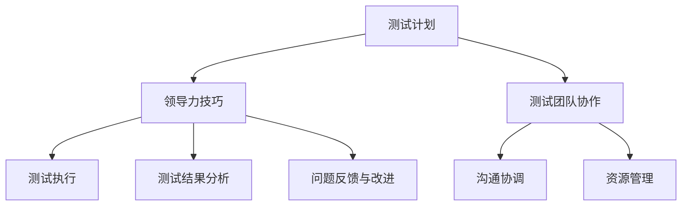
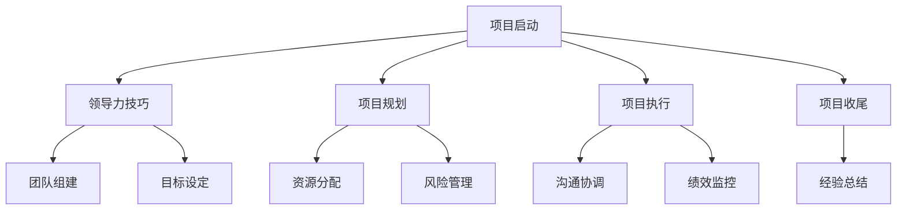
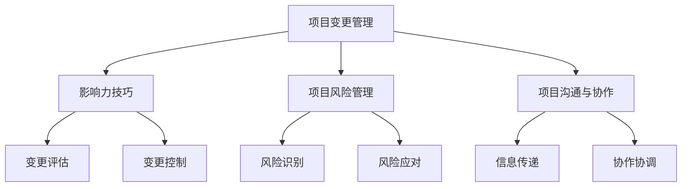
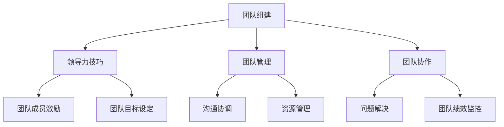
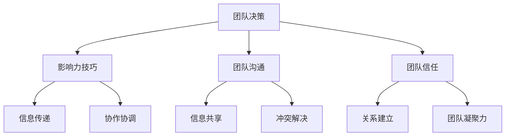
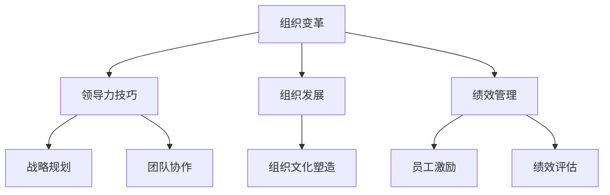
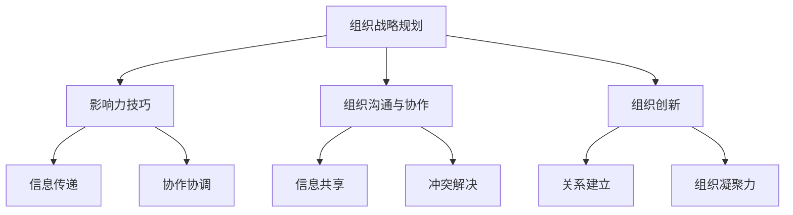

                 

# 领导力与影响力扩展：扩大个人影响圈的技巧

## 关键词
领导力、影响力、扩展、个人、技巧、影响力圈、影响力计算模型、领导力发展策略

## 摘要
本文旨在探讨领导力与影响力的核心概念，详细分析其在社会、组织和个人层面的作用。文章通过深入讲解影响力计算模型、领导力发展策略以及其在系统分析与架构设计中的应用，提供实用的扩展个人影响圈的技巧。同时，通过实际案例展示领导力与影响力在项目管理、团队领导和组织管理中的实践，总结最佳实践并提供拓展阅读建议。

## 引言与基础概念

### 第1章：领导力与影响力的核心

#### 1.1 领导力与影响力的概述
领导力是指引导和激励他人实现共同目标的能力，而影响力则是通过言语、行为或态度影响他人思维和行动的力量。领导力与影响力密切相关，领导力是影响力的一种表现，而影响力则是领导力发挥作用的基础。

在个人层面，领导力与影响力有助于提升个人魅力、增加社交资本，提高在职场和社交圈中的地位。在社会层面，领导力与影响力推动社会进步、促进和谐发展，是解决社会问题的重要力量。在组织层面，领导力与影响力决定着组织的运作效率和团队协作质量，对组织战略实施和目标达成具有关键作用。

#### 1.2 核心概念框架
- **权威**：权威是领导力的重要基础，指的是通过正式或非正式方式获得对他人的支配权力。
- **情感智能**：情感智能是指识别、理解和管理自己及他人情感的能力，对领导力与影响力至关重要。
- **沟通技巧**：沟通技巧是指表达思想、交流意见、传递信息的能力，是领导力与影响力的重要手段。

以下是一个简化的核心概念框架（用Mermaid流程图表示）：

### 第2章：领导力与影响力的数学模型

#### 2.1 影响力计算模型

影响力计算模型是一个用于量化个人影响力的工具。以下是一个简化的影响力计算公式：

$$
I = \alpha A + \beta E + \gamma C
$$

其中，\(I\) 表示影响力，\(\alpha\)、\(\beta\) 和 \(\gamma\) 分别是权威、情感智能和沟通技巧的权重，\(A\)、\(E\) 和 \(C\) 分别代表这三个因素的具体得分。

**影响力因子分析**：

- **权威（Authority）**：权威是影响力的基础，反映了一个人的职位、声誉和资源控制能力。较高的权威往往意味着更大的影响力。
- **情感智能（Emotional Intelligence）**：情感智能关乎个人对自身和他人情感的理解和管理能力。情感智能越高，越能建立深厚的人际关系，从而提高影响力。
- **沟通技巧（Communication Skills）**：沟通技巧是表达、传递信息和解决冲突的能力。良好的沟通技巧能够有效地传播思想，增强个人的影响力。

**影响力计算案例**：

假设某人在权威、情感智能和沟通技巧三个方面的得分分别为 80、70 和 90，且权重分别为 0.4、0.3 和 0.3。根据上述公式，该人的影响力计算如下：

$$
I = 0.4 \times 80 + 0.3 \times 70 + 0.3 \times 90 = 32 + 21 + 27 = 80
$$

因此，该人的影响力得分为 80。

#### 2.2 领导力发展策略

领导力发展策略包括自我提升、培养下属和构建团队等多个方面。以下是一个简化的领导力发展模型（用Mermaid流程图表示）：

**领导力发展路径**：

- **知识积累**：通过阅读、研究和实践，不断丰富自己的知识储备。
- **技能提升**：通过培训和练习，提高自己在沟通、决策和执行等方面的技能。
- **领导力培训**：参加专业的领导力培训课程，学习先进的领导理念和方法。
- **实践锻炼**：将所学应用于实际工作中，通过实践不断提升领导力。
- **反馈改进**：通过自我反思和他人反馈，不断改进自己的领导风格和决策能力。
- **培养下属**：通过激励、支持和授权，培养和提升下属的领导力。
- **团队建设**：构建和谐、高效的团队，增强团队的凝聚力和协作能力。

**领导力提升案例分析**：

以某科技公司CEO为例，该公司在短短三年内从初创企业成长为行业领导者。CEO通过不断学习新知识、提升沟通技能和决策能力，同时注重培养下属和构建团队，成功带领公司实现了快速发展。

### 第3章：系统分析与架构设计

#### 3.1 领导力在系统分析中的应用

在系统分析过程中，领导力可以帮助项目经理和团队成员更好地理解项目需求，确保项目的顺利进行。以下是一个简化的领导力在系统分析中的应用模型（用Mermaid流程图表示）：

**系统设计中的领导力考虑**：

- **需求确认**：通过领导力确保项目团队准确理解客户需求，避免需求偏差和误解。
- **风险评估**：通过领导力识别和评估项目风险，制定相应的风险应对策略。
- **问题解决**：在项目遇到问题时，领导力能够有效组织团队，快速解决问题，确保项目进展。

**领导力在系统测试中的角色**：

在系统测试阶段，领导力有助于确保测试过程的顺利进行，提高测试质量。以下是一个简化的领导力在系统测试中的应用模型（用Mermaid流程图表示）：

**影响力在架构设计中的影响**：

- **架构设计中的影响力策略**：在架构设计过程中，领导力可以帮助项目经理和架构师影响团队成员对架构方案的选择，确保方案的可行性和优化。
- **架构选择的影响因素**：影响力在架构选择中起到关键作用，包括技术可行性、业务需求、团队能力和项目期限等因素。
- **影响力对架构优化的作用**：通过影响力，领导力能够推动团队不断改进和优化架构设计，提高系统的可靠性和性能。

### 第4章：领导力与影响力在项目管理中的应用

#### 4.1 项目管理中的领导力

在项目管理中，领导力起着至关重要的作用。以下是一个简化的领导力在项目管理中的应用模型（用Mermaid流程图表示）：

**领导力在项目启动中的作用**：

- **团队组建**：通过领导力吸引和组建一支高效的项目团队，确保团队成员具有合适的技能和经验。
- **目标设定**：通过领导力明确项目的目标，确保项目团队对项目的目标和方向有清晰的认识。

#### 4.2 项目管理中的影响力技巧

影响力在项目管理中同样重要，以下是一个简化的影响力在项目管理中的应用模型（用Mermaid流程图表示）：

**影响力在项目变更管理中的应用**：

- **变更评估**：通过影响力，确保项目团队对变更的影响进行全面评估，避免因变更导致项目风险。
- **变更控制**：通过影响力，确保项目团队按照既定流程进行变更控制，减少变更带来的负面影响。

**项目风险管理中的影响力策略**：

- **风险识别**：通过影响力，确保项目团队对潜在风险有清晰的认识。
- **风险应对**：通过影响力，推动项目团队制定有效的风险应对策略，降低项目风险。

**项目成功的关键影响力因素**：

- **信息传递**：确保项目信息在团队成员之间高效传递，减少误解和沟通障碍。
- **协作协调**：通过影响力，推动项目团队在协作过程中相互支持，共同解决问题。

### 第5章：领导力与影响力在团队领导中的实践

#### 5.1 团队领导中的领导力

在团队领导中，领导力有助于激发团队成员的潜力，提升团队绩效。以下是一个简化的领导力在团队领导中的应用模型（用Mermaid流程图表示）：

**领导力在团队组建中的关键**：

- **团队成员激励**：通过领导力，激发团队成员的积极性和创造力，提高团队的整体绩效。
- **团队目标设定**：通过领导力，确保团队目标明确、可行，并与组织目标保持一致。

**团队成员激励策略**：

- **认可与奖励**：通过认可和奖励，激励团队成员取得更好的成绩。
- **培训与发展**：为团队成员提供培训和发展机会，提高其技能和知识水平。
- **工作环境**：营造良好的工作环境，提高团队成员的满意度和归属感。

**领导力在团队协作中的应用**：

- **沟通协调**：通过领导力，促进团队成员之间的有效沟通和协作，提高团队整体效率。
- **问题解决**：在团队遇到问题时，领导力能够快速识别问题并制定解决方案，推动团队持续改进。

#### 5.2 团队领导中的影响力

在团队领导中，影响力有助于建立和维护团队关系，提高团队凝聚力。以下是一个简化的影响力在团队领导中的应用模型（用Mermaid流程图表示）：

**影响力在团队决策中的作用**：

- **信息传递**：通过影响力，确保团队决策过程中信息准确、及时地传递。
- **协作协调**：通过影响力，推动团队成员在决策过程中相互协作，共同达成共识。

**影响力在团队沟通中的体现**：

- **信息共享**：通过影响力，促进团队成员之间的信息共享，提高团队整体知识水平。
- **冲突解决**：通过影响力，帮助团队在出现冲突时快速找到解决方案，避免矛盾激化。

**团队影响力策略分析**：

- **建立信任**：通过影响力，建立团队成员之间的信任，提高团队凝聚力。
- **关系建立**：通过影响力，促进团队成员建立良好的关系，增强团队凝聚力。
- **团队凝聚力**：通过影响力，提高团队凝聚力，增强团队面对挑战和困难时的战斗力。

### 第6章：领导力与影响力在组织管理中的应用

#### 6.1 组织管理中的领导力

在组织管理中，领导力有助于推动组织战略实施、提升组织绩效。以下是一个简化的领导力在组织管理中的应用模型（用Mermaid流程图表示）：

**领导力在组织变革中的应用**：

- **战略规划**：通过领导力，确保组织战略的制定和实施，推动组织持续发展。
- **团队协作**：通过领导力，促进组织内部团队之间的协作，提高组织整体效率。

**领导力在组织发展中的角色**：

- **组织文化塑造**：通过领导力，塑造积极向上的组织文化，增强组织凝聚力和竞争力。
- **绩效管理**：通过领导力，推动组织绩效管理体系的建立和完善，提高员工绩效和组织绩效。

**领导力在组织文化塑造中的作用**：

- **价值观传递**：通过领导力，将组织的价值观传递给员工，形成共同的行为准则。
- **员工激励**：通过领导力，激发员工的积极性和创造力，推动组织文化的落地实施。

#### 6.2 组织管理中的影响力

在组织管理中，影响力有助于推动组织战略实施、提升组织绩效。以下是一个简化的影响力在组织管理中的应用模型（用Mermaid流程图表示）：

**影响力在组织战略规划中的体现**：

- **信息传递**：通过影响力，确保组织战略规划过程中的信息准确、全面地传递，确保战略的顺利实施。
- **协作协调**：通过影响力，推动组织内部各部门之间的协作，提高战略实施的效率。

**影响力在组织沟通与协作中的作用**：

- **信息共享**：通过影响力，促进组织内部信息共享，提高组织整体知识水平。
- **冲突解决**：通过影响力，帮助组织在出现冲突时快速找到解决方案，避免矛盾激化。

**影响力在组织创新中的应用**：

- **关系建立**：通过影响力，建立组织内部各部门之间的良好关系，促进创新合作。
- **组织凝聚力**：通过影响力，提高组织凝聚力，增强组织面对外部挑战时的战斗力。

### 第7章：领导力与影响力的最佳实践

#### 7.1 领导力提升的最佳实践

领导力提升是一个持续的过程，以下是一些最佳实践：

- **自我反思**：定期进行自我反思，识别自己的优点和不足，制定改进计划。
- **持续学习**：不断学习新知识、新技能，保持自身的竞争力。
- **反馈与改进**：积极接受他人的反馈，不断改进自己的领导风格和决策能力。
- **培养下属**：关注下属的成长，为他们提供培训和发展机会。
- **团队建设**：注重团队建设，提高团队的凝聚力和协作能力。

**领导力发展策略案例分析**：

以某跨国公司CEO为例，该公司在短短五年内实现了从本土企业到全球领导的转变。CEO通过不断学习、培养下属和关注团队建设，成功提升了公司整体领导力，推动公司快速发展。

#### 7.2 影响力扩展的最佳实践

以下是一些影响力扩展的最佳实践：

- **建立人际关系网**：通过参加各种活动和社交场合，建立广泛的人际关系网。
- **提升沟通技巧**：通过培训和练习，提高自己在沟通中的表达能力和影响力。
- **积极分享**：在专业领域积极分享经验和知识，提高自己的声誉和影响力。
- **建立信任**：通过诚实、透明和负责任的行为，建立和维护信任关系。
- **承担责任**：在团队和组织中承担责任，展示自己的担当和能力。

**影响力策略应用案例**：

以某知名科技企业CTO为例，该CTO通过积极参与行业活动、分享技术见解和建立人际关系网，成功提升了自己在行业中的影响力，为企业吸引了大量优秀人才和合作伙伴。

### 第8章：注意事项与拓展阅读

#### 8.1 领导力与影响力应用的注意事项

- **边界与外延**：在应用领导力与影响力时，要明确其边界和适用范围，避免滥用权力。
- **领导力与影响力平衡**：在提升领导力和影响力的过程中，要注重平衡，避免过于强调一方而忽视另一方。
- **伦理问题**：在领导力和影响力应用中，要遵守伦理规范，避免不正当手段获取权力和影响。

#### 8.2 拓展阅读与学习资源

- **领导力与影响力领域的经典著作**：
  - 《领导力的五项修炼》（The Five Levels of Leadership）- John C. Maxwell
  - 《影响力》（Influence: The Psychology of Persuasion）- Robert B. Cialdini
- **领导力与影响力研究的前沿论文**：
  - “The Role of Emotional Intelligence in Leadership” - Journal of Business Research
  - “Influence Maximization in Social Networks” - IEEE Transactions on Knowledge and Data Engineering
- **相关领域的在线课程与讲座**：
  - Coursera上的“领导力与影响力”课程
  - YouTube上的知名领导力和影响力专家讲座

**作者**
AI天才研究院/AI Genius Institute & 禅与计算机程序设计艺术 /Zen And The Art of Computer Programming

