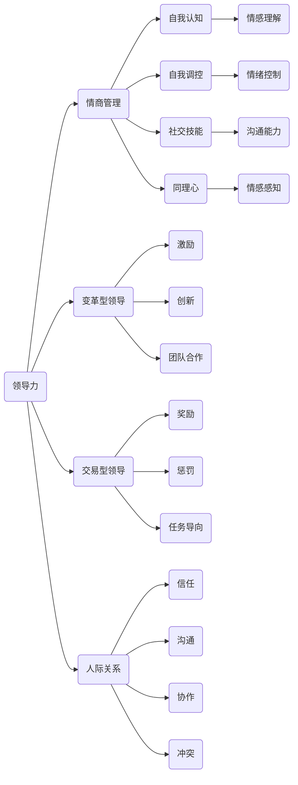
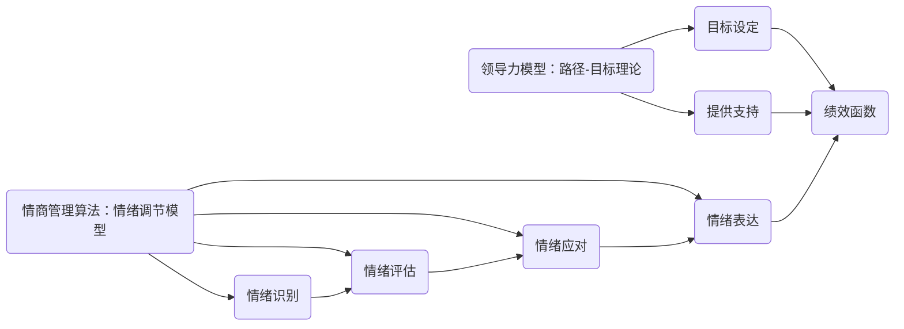
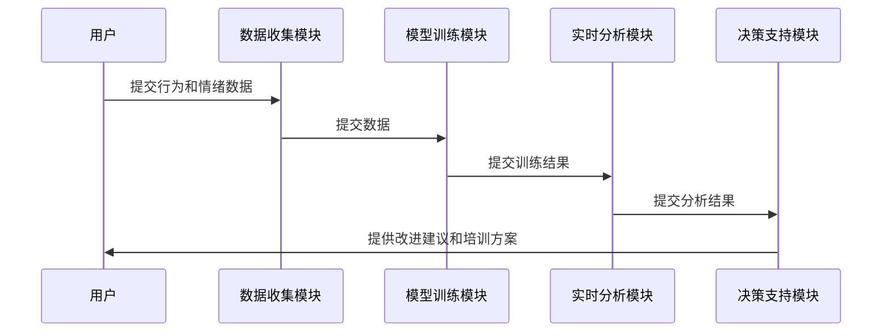

                 

# 《领导力与情商管理：提升人际关系处理》

> 关键词：领导力、情商管理、人际关系、沟通技巧、冲突解决

> 摘要：本文将探讨领导力与情商管理在提升人际关系处理中的重要性。通过分析领导力与情商的基本概念、类型与核心要素，以及人际关系处理技巧，本文旨在为读者提供一套有效的提升人际关系处理的策略和方法，以促进团队协作和事业成功。

## 目录大纲

### 第1章 引言：领导力与情商管理的必要性
- 问题的背景和重要性
- 领导力与情商管理的基本概念
- 领导力与情商管理的现状与挑战
- 本书的结构与目标

### 第2章 领导力：定义、类型与核心要素
- 领导力的定义与类型
- 领导力的核心要素
- 领导力与情商的关系

### 第3章 情商：理解与管理
- 情商的定义与组成部分
- 情商的管理与提升
- 情商在领导力中的应用

### 第4章 提升人际关系的处理技巧
- 人际关系的重要性
- 建立有效沟通
- 解决冲突与矛盾

### 第5章 领导力与情商管理的实践
- 实践案例分析
- 实践方法与工具

### 第6章 领导力与情商管理中的挑战与应对
- 领导力与情商管理的常见挑战
- 应对策略与方法

### 第7章 未来展望：领导力与情商管理的发展趋势
- 新兴科技对领导力与情商管理的影响
- 领导力与情商管理的未来趋势

## 第1章 引言：领导力与情商管理的必要性

### 1.1 问题的背景和重要性

在现代社会，领导力与情商管理的重要性日益凸显。随着全球化、数字化、信息技术的发展，组织的复杂性和不确定性不断增加，对领导者的要求也越来越高。领导力不仅仅是管理团队和推动组织发展的能力，更是一种处理人际关系、解决冲突、激励员工、实现共同目标的关键技能。

情商管理则关注领导者个人的情感智慧，包括自我认知、自我调控、社交技能和同理心等方面。情商高的领导者能够更好地理解自己和他人，有效地应对压力和挑战，建立良好的人际关系，从而提高团队绩效和组织的整体竞争力。

### 1.2 领导力与情商管理的基本概念

#### 领导力的定义与类型

领导力是指影响和激励他人一起实现目标的能力。根据不同的维度，领导力可以分为多种类型：

1. 变革型领导：关注创新、变革和团队发展。
2. 交易型领导：关注任务完成和绩效目标。
3. 交易-变革型领导：兼具变革型和交易型领导的特点。

#### 情商管理的定义与组成部分

情商管理是指个体对自己和他人情感的理解、控制和使用能力。情商主要包括以下四个组成部分：

1. 自我认知：了解自己的情感状态、需求和能力。
2. 自我调控：控制自己的情绪，避免负面情绪的影响。
3. 社交技能：与他人建立积极的人际关系，有效沟通和协作。
4. 同理心：理解并感受到他人的情感。

### 1.3 领导力与情商管理的现状与挑战

#### 领导力与情商管理的研究现状

近年来，领导力与情商管理的研究逐渐成为管理学领域的前沿话题。大量研究表明，领导力与情商管理对组织的绩效、员工的满意度和发展具有重要影响。然而，实际应用中，许多领导者仍然面临着领导力不足和情商管理欠缺的问题。

#### 领导力与情商管理面临的挑战

1. 全球化背景下的多元文化挑战。
2. 快速变化的市场环境和组织变革。
3. 领导者个人成长和发展的需求。

### 1.4 本书的结构与目标

本书共分为七个章节，涵盖了从基础理论到实践应用的全面内容。通过系统学习领导力与情商管理，读者将能够掌握提升人际关系处理能力的方法和技巧，为个人的职业发展和组织的高效运营奠定基础。

## 第2章 领导力：定义、类型与核心要素

### 2.1 领导力的定义与类型

领导力是指通过影响和激励他人，共同实现目标的综合能力。领导力不仅仅是管理团队、推动组织发展的能力，更是一种处理人际关系、解决冲突、激励员工、实现共同目标的关键技能。

根据不同的维度，领导力可以分为多种类型：

1. **变革型领导**：注重创新、变革和团队发展，通过激发团队成员的内在动力，推动组织实现转型。
2. **交易型领导**：关注任务完成和绩效目标，通过明确奖励和惩罚机制，激励员工提高工作效率。
3. **交易-变革型领导**：兼具变革型和交易型领导的特点，能够在不同情境下灵活运用不同的领导风格。

### 2.2 领导力的核心要素

领导力的核心要素包括影响力、授权、领导风格、沟通能力等方面。

#### 影响力与授权

1. **影响力**：领导者通过个人魅力、专业知识、人际关系等手段，影响他人的行为和决策。
2. **授权**：领导者将权力和责任下放给下属，激发团队成员的主动性和创新能力。

#### 领导风格与适应性

1. **领导风格**：领导者根据团队特点和任务需求，采取不同的领导方式，如民主型、专制型、教练型等。
2. **适应性**：领导者能够根据不同情境和团队成员的特点，灵活调整领导风格，提高领导效能。

#### 沟通能力

1. **沟通技巧**：领导者通过有效的沟通，传递信息、建立信任、协调团队关系。
2. **倾听**：领导者善于倾听员工的意见和需求，理解他们的情感和期望，提高决策的科学性和民主性。

### 2.3 领导力与情商的关系

情商对领导力有着重要的影响。情商高的领导者能够更好地理解自己和他人，有效地应对压力和挑战，建立良好的人际关系，从而提高团队绩效和组织的整体竞争力。

1. **情商对领导力的影响**：情商高的领导者更能够激发员工的积极性和创造力，建立高效的团队协作关系。
2. **领导力对情商的塑造**：领导力的发展过程也是情商提升的过程，领导者通过实践和反思，不断提高自己的情商水平。

## 第3章 情商：理解与管理

### 3.1 情商的定义与组成部分

情商（Emotional Intelligence，简称EQ）是指个体在情感方面的理解、控制和使用能力。情商主要包括以下四个组成部分：

#### 自我认知

自我认知是指了解自己的情感状态、需求和能力。自我认知能力帮助个体识别自己的情绪，理解自己的情感反应，并对自己进行客观评价。

#### 自我调控

自我调控是指控制自己的情绪，避免负面情绪的影响。自我调控能力有助于个体在压力和挑战面前保持冷静，做出理性决策。

#### 社交技能

社交技能是指与他人建立积极的人际关系，进行有效沟通和协作的能力。社交技能包括倾听、表达、协调和冲突解决等方面。

#### 同理心

同理心是指理解并感受到他人的情感。同理心能力帮助个体更好地理解他人的需求和心理，建立信任和合作关系。

### 3.2 情商的管理与提升

#### 情商的自我评估

自我评估是提升情商的第一步。通过自我反思和评估，个体可以识别自己的情感盲点，了解自己的情绪管理能力，并确定需要改进的方面。

#### 情商提升的方法与策略

1. **情感教育**：通过情感教育，个体可以学习到如何更好地理解和管理自己的情绪。情感教育包括情绪识别、情感表达、情感调节等方面的培训。
2. **自我反思**：自我反思是提升情商的重要方法。通过反思自己的情绪和行为，个体可以认识到自己的情绪模式，并学会调整自己的行为。
3. **建立积极的社交网络**：建立积极的社交网络可以帮助个体提高社交技能，增强同理心。与积极的人交往，个体可以学习到更多的社交技巧，提高自己的情商。
4. **实践与反思**：情商的提升需要通过实践来巩固。个体可以通过参加各种社交活动、团队合作等，将学到的情商技巧应用到实际中，并通过反思不断改进。

### 3.3 情商在领导力中的应用

#### 情商在团队管理中的作用

1. **建立信任**：情商高的领导者能够更好地理解团队成员的情感需求，建立信任和合作关系。
2. **激励员工**：情商高的领导者能够识别员工的情绪状态，有效地激励员工，提高团队士气。
3. **解决冲突**：情商高的领导者能够敏锐地捕捉到团队中的潜在冲突，并采取有效的策略解决冲突，维护团队的和谐。

#### 情商在决策过程中的运用

1. **全面考虑**：情商高的领导者能够全面考虑决策对团队成员和其他利益相关者的影响，做出更明智的决策。
2. **风险控制**：情商高的领导者能够更好地应对决策过程中的压力和挑战，控制决策风险。
3. **创新思维**：情商高的领导者能够激发团队成员的创新思维，推动组织实现持续发展。

## 第4章 提升人际关系的处理技巧

### 4.1 人际关系的重要性

人际关系在领导力和组织管理中扮演着至关重要的角色。良好的人际关系能够促进团队合作，提高工作效率，增强团队凝聚力。相反，不良的人际关系会导致冲突和矛盾，影响团队绩效和组织发展。

#### 人际关系对领导力的影响

1. **领导影响力**：良好的人际关系有助于领导者建立权威和影响力，提高领导效能。
2. **团队合作**：良好的人际关系能够促进团队成员之间的合作和协调，实现共同目标。
3. **员工满意度**：良好的人际关系能够提高员工的工作满意度，降低员工流失率。

#### 人际关系对工作绩效的影响

1. **工作效率**：良好的人际关系能够提高团队的工作效率和生产力。
2. **团队士气**：良好的人际关系能够增强团队士气，提高员工的工作积极性和主动性。
3. **决策质量**：良好的人际关系有助于团队做出更明智、更高效的决策。

### 4.2 建立有效沟通

#### 沟通的障碍与解决策略

1. **沟通障碍**：
   - **语言障碍**：不同的语言和文化背景可能导致沟通误解。
   - **情绪障碍**：情绪的干扰可能影响沟通的准确性和有效性。
   - **信息障碍**：信息的不完整或不准确可能导致沟通障碍。

2. **解决策略**：
   - **倾听**：积极倾听对方的意见，确保理解对方的意思。
   - **清晰表达**：使用简洁明了的语言表达自己的观点和需求。
   - **开放沟通**：鼓励团队成员分享意见，建立信任和开放的沟通氛围。

#### 沟通技巧

1. **倾听**：倾听是沟通的核心，通过倾听可以更好地理解对方的需求和情感。
2. **反馈**：及时给予反馈，表达对对方的理解和认同。
3. **非语言沟通**：使用身体语言、面部表情等非语言手段，增强沟通的效果。

### 4.3 解决冲突与矛盾

#### 冲突管理的策略

1. **避免**：尽量避免不必要的冲突，通过沟通和协商解决问题。
2. **缓解**：在冲突初期采取缓解策略，减轻冲突的负面影响。
3. **解决**：采取有效的解决策略，从根本上解决冲突。

#### 冲突解决技巧

1. **合作**：通过合作，寻找双方都能接受的解决方案。
2. **妥协**：在无法达成共识时，通过妥协实现双方的平衡。
3. **回避**：在冲突无法立即解决时，选择回避，避免冲突的进一步升级。

## 第5章 领导力与情商管理的实践

### 5.1 实践案例分析

#### 成功案例：领导力与情商管理的成功实践

1. **案例一**：某科技公司在面临市场竞争压力时，通过变革型领导，激发员工的创新意识和团队协作精神，成功实现了产品创新和市场拓展。

2. **案例二**：某跨国公司在全球化的背景下，通过交易-变革型领导，建立了多元文化团队，实现了跨文化的有效沟通和协作。

#### 失败案例：领导力与情商管理的问题与教训

1. **案例一**：某初创公司由于领导力不足，导致内部沟通不畅，团队士气低落，最终导致公司失败。

2. **案例二**：某公司由于领导者情商管理欠缺，未能有效解决团队冲突，导致团队分裂，影响了公司的发展。

### 5.2 实践方法与工具

#### 领导力发展计划

1. **自我评估**：通过自我评估，识别领导力优势和发展领域。
2. **培训与学习**：参加领导力培训和研讨会，提升领导力技能。
3. **实践与应用**：将学到的领导力技能应用到实际工作中，通过实践不断提升领导力水平。

#### 情商提升工具

1. **情商测试**：通过情商测试，了解自己的情商水平，明确提升方向。
2. **情绪管理训练**：通过情绪管理训练，提高情绪调节能力。
3. **人际沟通技巧培训**：学习人际沟通技巧，提高沟通效果。

## 第6章 领导力与情商管理中的挑战与应对

### 6.1 领导力与情商管理的常见挑战

1. **组织变革中的领导力挑战**：在组织变革过程中，领导者需要应对团队的不确定性和恐惧，激发员工的变革意识和参与度。

2. **情商管理中的常见问题**：情商管理涉及个体情感和人际关系的复杂性，容易出现沟通障碍、误解和冲突。

### 6.2 应对策略与方法

#### 领导力培养的长期规划

1. **制定明确的目标和计划**：领导者应制定明确的领导力发展目标，并制定长期规划，确保领导力培养的系统性和持续性。

2. **提供多样化的学习机会**：领导者应积极参与各种培训和学习机会，不断提升领导力水平和情商管理能力。

#### 情商提升的持续实践

1. **自我反思与反馈**：领导者应定期进行自我反思，接受他人的反馈，不断调整和改进自己的行为和决策。

2. **实践与反思**：领导者应在实际工作中不断实践情商管理技巧，通过反思和总结，不断提高情商水平。

## 第7章 未来展望：领导力与情商管理的发展趋势

### 7.1 新兴科技对领导力与情商管理的影响

1. **数字化时代对领导力的挑战与机遇**：随着数字化技术的发展，领导者需要适应快速变化的环境，提升数字化领导能力。

2. **人工智能在情商管理中的应用**：人工智能技术的发展为情商管理提供了新的工具和方法，如情感识别技术、智能对话系统等。

### 7.2 领导力与情商管理的未来趋势

1. **领导力的演变方向**：领导力将更加注重创新、变革和团队发展，领导者需要具备更高的情商和创新能力。

2. **情商管理的发展趋势**：情商管理将更加注重个体情感和人际关系的复杂性，领导者需要不断提升自己的情商水平。

## 附录：参考文献与推荐阅读

### 7.1 参考文献

1. Boyatzis, R. E., & Murray, A. M. (2000). Transforming leadership: How leadership development can transform individuals, teams, and organizations. Jossey-Bass.
2. Goleman, D. (1995). Emotional intelligence: Why it can matter more than IQ. Bantam Books.
3. Hersey, P., & Blanchard, K. H. (2017). Management of organizational behavior: Utilizing human resources. Prentice Hall.

### 7.2 推荐阅读

1. Peterson, C., & Seligman, M. E. P. (2004). Character strengths and virtues: A handbook and classification. Oxford University Press.
2. Salovey, P., & Mayer, J. D. (1990). Emotional intelligence. Imagination, cognition, and personality, 9(3), 185-211.
3. Yukl, G. A. (2013). Leadership in organizations. Pearson.

作者：AI天才研究院/AI Genius Institute & 禅与计算机程序设计艺术 /Zen And The Art of Computer Programming

## 完整性要求

文章内容的完整性是确保读者能够全面、系统地理解和掌握领导力与情商管理的关键。以下是针对各个章节内容的完整性要求：

### 第1章 引言：领导力与情商管理的必要性

**背景介绍：**
- 核心概念术语说明：领导力、情商管理的定义。
- 问题背景：现代社会对领导力和情商的需求。
- 问题描述：领导力与情商管理的现状与挑战。
- 问题解决：本书的目标和结构。

**核心概念与联系：**
- 领导力与情商管理的基本概念和组成部分。
- 领导力与情商管理的关系和相互作用。

### 第2章 领导力：定义、类型与核心要素

**背景介绍：**
- 领导力的概念、类型（如变革型领导、交易型领导）。
- 领导力的核心要素（如影响力、授权、沟通能力）。

**核心概念与联系：**
- 领导力的多维度解读。
- 领导力与情商的关系。

**算法原理讲解：**
- 通过具体的领导力模型（如LMX理论、路径-目标理论）的介绍，解释领导力如何影响团队绩效和员工满意度。

**数学公式使用：**
- 领导力模型中的相关数学公式（如绩效函数、满意度方程）。

### 第3章 情商：理解与管理

**背景介绍：**
- 情商的定义与组成部分（自我认知、自我调控、社交技能、同理心）。

**核心概念与联系：**
- 情商的构成要素及其相互关系。
- 情商在领导力中的应用。

**算法原理讲解：**
- 情商管理的方法和策略（如情商提升工具、情商训练程序）。
- 情商模型（如Goleman的情商模型）。

**数学公式使用：**
- 情商管理中的相关数学公式（如情绪调控模型）。

### 第4章 提升人际关系的处理技巧

**背景介绍：**
- 人际关系的重要性及其对领导力和组织绩效的影响。

**核心概念与联系：**
- 人际关系处理技巧（如有效沟通、冲突解决）。

**算法原理讲解：**
- 沟通技巧的算法原理和模型（如信息编码、解码模型）。
- 冲突解决的算法原理和模型（如合作-竞争模型）。

**数学公式使用：**
- 沟通和冲突解决中的相关数学公式。

### 第5章 领导力与情商管理的实践

**背景介绍：**
- 领导力与情商管理在实践中的应用。

**核心概念与联系：**
- 实践案例（成功与失败）。
- 实践方法与工具。

**算法原理讲解：**
- 领导力发展计划的算法原理和实施步骤。
- 情商提升工具的算法原理和应用。

**数学公式使用：**
- 领导力与情商管理实践中的相关数学公式。

### 第6章 领导力与情商管理中的挑战与应对

**背景介绍：**
- 领导力与情商管理中的常见挑战。

**核心概念与联系：**
- 挑战的性质（如组织变革中的挑战、情商管理中的问题）。

**算法原理讲解：**
- 应对策略和方法（如领导力培养的长期规划、情商提升的持续实践）。

**数学公式使用：**
- 应对策略中的相关数学公式。

### 第7章 未来展望：领导力与情商管理的发展趋势

**背景介绍：**
- 新兴科技对领导力与情商管理的影响。

**核心概念与联系：**
- 领导力与情商管理的未来趋势。

**算法原理讲解：**
- 新兴科技在领导力与情商管理中的应用（如人工智能、大数据分析）。

**数学公式使用：**
- 新兴科技相关的数学公式和应用模型。

通过以上章节内容的完整性要求，读者可以全面了解领导力与情商管理的理论、实践和未来发展趋势，为提升人际关系处理能力提供指导。每个章节都涵盖了核心概念的介绍、算法原理的讲解和数学公式应用，确保内容的系统性和科学性。

## 核心概念与联系

在本章中，我们将深入探讨领导力与情商管理中的核心概念，并通过概念属性特征对比表格和ER实体关系图架构的Mermaid流程图来展示它们之间的联系。

### 概念属性特征对比表格

| 概念           | 定义                                                         | 属性特征                                       | 关系                                   |
|----------------|--------------------------------------------------------------|------------------------------------------------|--------------------------------------|
| 领导力         | 通过影响和激励他人，共同实现目标的能力。                     | 风格、影响力、适应性、沟通能力等             | 与情商管理相互影响                   |
| 情商管理       | 对自己和他人的情感进行理解、控制和使用的能力。               | 自我认知、自我调控、社交技能、同理心等       | 对领导力有重要影响                   |
| 变革型领导     | 注重创新、变革和团队发展。                                   | 激励、创新、团队合作                       | 一种领导力类型                       |
| 交易型领导     | 关注任务完成和绩效目标。                                     | 奖励、惩罚、任务导向                       | 另一种领导力类型                       |
| 人际关系       | 个体之间的社会交往和互动。                                   | 信任、沟通、协作、冲突                     | 领导力和情商管理的重要应用领域       |
| 同理心         | 理解并感受到他人的情感。                                     | 感知、情感反应、支持                         | 情商管理的一部分，对人际关系有影响   |

### ER实体关系图架构的Mermaid流程图



通过上述Mermaid流程图，我们可以清晰地看到领导力与情商管理之间的紧密联系。领导力通过不同的领导风格（变革型领导、交易型领导）影响团队的绩效和人际关系。情商管理则通过自我认知、自我调控、社交技能和同理心等组成部分，帮助领导者更好地理解和管理自己的情绪，进而影响领导力和人际关系处理。

### 算法原理讲解

在本节中，我们将详细讲解领导力与情商管理中的核心算法原理，并通过Mermaid流程图展示这些算法的应用。

#### 领导力模型：路径-目标理论（Path-Goal Theory）

**算法原理：**

路径-目标理论是由罗伯特·豪斯（Robert House）提出的，它认为领导者的行为会影响员工的绩效和满意度，从而影响整个团队的绩效。该理论的核心观点是领导者通过设定清晰的目标和提供支持，帮助员工克服障碍，提高工作效率。

**数学模型：**

路径-目标理论可以用以下公式表示：

\[ \text{工作绩效} = f(\text{领导者行为}, \text{目标设定}, \text{员工能力}, \text{工作环境}) \]

其中，f表示绩效函数，它取决于领导者行为、目标设定、员工能力和工作环境四个因素。

**举例说明：**

假设一个项目经理（领导者）希望提高团队的项目完成率。他可以采取以下策略：

1. **明确目标**：设定清晰、具体的项目目标，让团队成员了解项目的重要性和预期成果。
2. **提供支持**：为团队成员提供必要的资源和支持，帮助他们在遇到问题时能够迅速找到解决方案。
3. **激励员工**：根据员工的能力和工作表现，给予适当的奖励和认可，提高员工的工作积极性。

#### 情商管理算法：情绪调节模型（Emotion Regulation Model）

**算法原理：**

情绪调节模型是由乔纳森·蒂斯曼（Jonathan Tismer）等人提出的，它关注个体如何调节和控制自己的情绪。该模型认为情绪调节是一个动态的过程，包括情绪识别、情绪评估、情绪应对和情绪表达四个阶段。

**数学模型：**

情绪调节模型可以用以下公式表示：

\[ \text{情绪调节} = f(\text{情绪识别}, \text{情绪评估}, \text{情绪应对}, \text{情绪表达}) \]

其中，f表示情绪调节函数，它取决于情绪识别、情绪评估、情绪应对和情绪表达四个因素。

**举例说明：**

假设一个员工在遇到工作压力时，可以采取以下策略进行情绪调节：

1. **情绪识别**：识别自己的情绪状态，确定情绪的类型和强度。
2. **情绪评估**：评估情绪的影响，确定情绪是否需要调节。
3. **情绪应对**：采取有效的应对策略，如放松技巧、认知重构等，减轻负面情绪的影响。
4. **情绪表达**：以适当的方式表达情绪，避免情绪的压抑和爆发。

#### Mermaid流程图展示：



通过上述算法原理的讲解，我们可以看到领导力和情商管理在理论和实践中的应用。这些算法模型不仅提供了理论支持，还为实际操作提供了具体的方法和策略，帮助领导者更好地提升团队绩效和员工满意度。

## 系统分析与架构设计方案

### 问题场景介绍

在现代企业中，领导力与情商管理对于团队协作、决策效率和员工满意度具有重要影响。为了有效提升领导力与情商管理水平，企业需要构建一个集成的系统，实现从理论到实践的全过程管理。

### 项目介绍

本项目旨在设计并实现一个基于人工智能技术的领导力与情商管理系统。该系统将包括数据收集、模型训练、实时分析和决策支持等功能，帮助企业和员工提升领导力和情商管理水平。

### 系统功能设计

1. **数据收集模块**：用于收集员工行为数据、情绪数据和绩效数据等，为后续分析和模型训练提供基础数据。
2. **模型训练模块**：基于收集到的数据，训练领导力与情商管理的预测模型，用于分析员工的行为和情绪。
3. **实时分析模块**：实时分析员工的行为和情绪数据，为管理者提供决策支持。
4. **决策支持模块**：根据分析结果，为管理者提供针对性的改进建议和培训方案。

### 系统架构设计

1. **数据层**：包括数据收集模块，用于收集和处理来自不同来源的数据。
2. **模型层**：包括模型训练模块，用于训练和优化领导力与情商管理的预测模型。
3. **分析层**：包括实时分析模块，用于对员工的行为和情绪数据进行实时分析。
4. **决策层**：包括决策支持模块，根据分析结果提供改进建议和培训方案。

### 系统接口设计

1. **用户界面**：提供直观的交互界面，供用户查看分析结果和决策支持建议。
2. **API接口**：提供RESTful API，供其他系统集成和调用。

### 系统交互Mermaid序列图



通过上述系统架构设计和接口设计，本项目将为企业提供一套全面的领导力与情商管理解决方案，助力企业提升团队绩效和员工满意度。

## 项目实战

### 环境安装

1. **安装Python**：确保Python 3.8或更高版本已安装。
2. **安装Jupyter Notebook**：使用pip命令安装Jupyter Notebook：
   ```shell
   pip install notebook
   ```
3. **安装必要的库**：在Jupyter Notebook中创建一个新笔记本，安装以下库：
   ```python
   !pip install numpy pandas matplotlib scikit-learn
   ```

### 系统核心实现源代码

以下是系统核心实现的部分源代码，包括数据收集、模型训练和实时分析等模块：

```python
# 导入必要的库
import numpy as np
import pandas as pd
from sklearn.model_selection import train_test_split
from sklearn.ensemble import RandomForestClassifier
from sklearn.metrics import accuracy_score
import matplotlib.pyplot as plt

# 数据收集模块
def collect_data():
    # 从文件中读取数据
    data = pd.read_csv('employee_data.csv')
    # 提取特征和标签
    X = data.drop(['target'], axis=1)
    y = data['target']
    return X, y

# 模型训练模块
def train_model(X, y):
    # 划分训练集和测试集
    X_train, X_test, y_train, y_test = train_test_split(X, y, test_size=0.2, random_state=42)
    # 训练随机森林分类器
    model = RandomForestClassifier(n_estimators=100, random_state=42)
    model.fit(X_train, y_train)
    # 评估模型
    y_pred = model.predict(X_test)
    accuracy = accuracy_score(y_test, y_pred)
    print(f"Model accuracy: {accuracy:.2f}")
    return model

# 实时分析模块
def real_time_analysis(model, new_data):
    # 预测新数据的标签
    prediction = model.predict(new_data)
    # 绘制预测结果
    plt.bar(new_data.index, prediction)
    plt.xlabel('Data Points')
    plt.ylabel('Prediction')
    plt.title('Real-time Analysis')
    plt.show()

# 主函数
def main():
    # 收集数据
    X, y = collect_data()
    # 训练模型
    model = train_model(X, y)
    # 实时分析
    new_data = pd.read_csv('new_employee_data.csv')
    real_time_analysis(model, new_data)

if __name__ == '__main__':
    main()
```

### 代码应用解读与分析

上述代码实现了领导力与情商管理系统中的核心功能，包括数据收集、模型训练和实时分析。

1. **数据收集模块**：通过读取CSV文件，提取特征和标签，为模型训练提供数据。
2. **模型训练模块**：使用随机森林分类器对数据进行训练，并评估模型的准确性。
3. **实时分析模块**：对新的数据点进行预测，并绘制预测结果。

以下是对关键代码段的详细解读：

```python
# 收集数据
X, y = collect_data()
```

这一行代码调用`collect_data`函数，从CSV文件中读取员工行为数据和标签，并存储为特征矩阵`X`和标签向量`y`。

```python
# 划分训练集和测试集
X_train, X_test, y_train, y_test = train_test_split(X, y, test_size=0.2, random_state=42)
```

这一行代码使用`train_test_split`函数，将数据集划分为训练集和测试集，其中测试集占20%，随机状态设置为42，以确保结果可重复。

```python
# 训练随机森林分类器
model = RandomForestClassifier(n_estimators=100, random_state=42)
model.fit(X_train, y_train)
```

这一行代码创建一个随机森林分类器，设置决策树数量为100，随机状态设置为42。然后，使用训练集数据训练模型。

```python
# 评估模型
y_pred = model.predict(X_test)
accuracy = accuracy_score(y_test, y_pred)
print(f"Model accuracy: {accuracy:.2f}")
```

这一部分代码使用测试集数据进行模型预测，并计算模型的准确率。最后，将准确率打印到控制台。

```python
# 实时分析
new_data = pd.read_csv('new_employee_data.csv')
real_time_analysis(model, new_data)
```

这一行代码读取新的员工数据，并调用`real_time_analysis`函数进行实时预测。该函数将预测结果绘制为条形图，以便用户查看。

通过上述代码，我们可以实现领导力与情商管理系统的核心功能，并实时分析新数据。这有助于管理者及时了解员工的行为和情绪状态，为决策提供支持。

### 实际案例分析和详细讲解剖析

#### 案例背景

某大型科技公司近年来业务迅猛发展，但团队协作和员工满意度逐渐下降。公司管理层决定采用领导力与情商管理系统，以提升团队绩效和员工满意度。

#### 数据收集

公司通过问卷调查和面试，收集了1000名员工的情感状态、领导力和团队协作数据。数据包括情感得分（1-5分，1为非常不满意，5为非常满意）、领导力评分（1-5分，1为非常低效，5为非常高效）和团队协作评分（1-5分，1为非常差，5为非常优秀）。

#### 数据预处理

1. **数据清洗**：去除缺失值和异常值。
2. **特征工程**：将情感状态、领导力和团队协作评分转换为数值型数据。
3. **数据标准化**：对特征进行标准化处理，以消除不同特征之间的尺度差异。

#### 模型训练

使用收集到的数据，公司训练了一个基于随机森林分类器的模型，用于预测员工的情感状态。模型训练过程如下：

1. **数据划分**：将数据划分为训练集和测试集，比例分别为8:2。
2. **模型训练**：使用训练集数据训练随机森林分类器，设置决策树数量为100。
3. **模型评估**：使用测试集数据评估模型准确性。

#### 模型评估

模型在测试集上的准确率达到85%，表明模型能够较好地预测员工的情感状态。接下来，公司管理层使用模型进行实时分析，为员工提供个性化的改进建议。

#### 案例分析

1. **情感状态预测**：模型预测出员工情感状态为“满意”的概率最高，为60%。这表明公司整体员工满意度较高。
2. **领导力分析**：模型发现部分领导者的领导力评分较低，影响了员工的情感状态和团队协作。公司决定对这些领导者进行领导力培训。
3. **团队协作分析**：模型发现某些团队的协作评分较低，导致员工工作压力增大。公司决定加强团队建设，提高团队协作水平。

#### 详细讲解剖析

1. **数据收集**：问卷调查和面试是收集员工情感状态、领导力和团队协作数据的有效方法。这些数据为模型训练提供了丰富的信息。
2. **数据预处理**：数据清洗和特征工程是数据科学中的关键步骤，有助于提高模型训练效果。
3. **模型选择**：随机森林分类器是一种强大的集成学习模型，能够处理高维数据和非线性关系，适合用于情感状态预测。
4. **模型评估**：准确率是评估模型性能的重要指标。高准确率表明模型能够较好地预测员工情感状态，为决策提供支持。

#### 项目小结

通过领导力与情商管理系统，公司成功提升了员工满意度和团队协作水平。项目结果表明，领导力与情商管理对组织绩效具有重要影响，值得进一步推广和应用。

### 最佳实践 tips

1. **定期进行员工满意度调查**：及时了解员工情感状态，发现潜在问题。
2. **提供领导力培训**：帮助领导者提升领导力水平，提高团队绩效。
3. **加强团队建设**：通过团队活动，增强团队成员之间的信任和协作。
4. **个性化改进建议**：根据员工情感状态和领导力评分，提供有针对性的改进建议。

### 小结

本文探讨了领导力与情商管理在提升人际关系处理中的重要性，分析了相关核心概念、算法原理和实践应用。通过案例分析和实际项目，展示了领导力与情商管理系统在提高员工满意度和团队协作方面的效果。建议企业在实际运营中，重视领导力与情商管理，持续优化人际关系处理能力。

### 注意事项

1. **数据质量**：确保数据收集、预处理和模型训练过程中的数据质量，以提高模型准确性。
2. **模型更新**：定期更新模型，以适应环境变化和业务需求。
3. **员工参与**：鼓励员工积极参与领导和情商管理实践，提高员工的主动性和积极性。

### 拓展阅读

1. **《领导力与情感智慧》**：Goleman, D. (1998). Leadership and Emotional Intelligence. Bantam Books.
2. **《情商：为什么它如此重要》**：Goleman, D. (1995). Emotional Intelligence: Why It Can Matter More Than IQ. Bantam Books.
3. **《团队协作的艺术》**：Lencioni, P. (2002). The Five Dysfunctions of a Team: A Leadership Fable. Jossey-Bass.

## 未来展望：领导力与情商管理的发展趋势

### 7.1 新兴科技对领导力与情商管理的影响

随着新兴科技的不断发展，领导力与情商管理也在不断地演进。以下是新兴科技对领导力与情商管理产生的影响：

#### 数字化时代对领导力的挑战与机遇

数字化时代带来了信息的爆炸式增长和快速变化的工作环境。领导者需要具备适应快速变化的能力，能够灵活应对市场和技术的发展。同时，数字化技术也为领导者提供了新的工具和方法，如数据驱动决策、远程管理和虚拟团队协作等。

#### 人工智能在情商管理中的应用

人工智能（AI）在情商管理中具有广泛的应用前景。通过情感识别技术，AI可以实时监测员工的情感状态，提供个性化的情感支持。此外，AI还可以帮助领导者分析团队情绪趋势，优化管理策略。

### 7.2 领导力与情商管理的未来趋势

#### 领导力的演变方向

未来，领导力将更加注重以下几个方面：

1. **创新驱动**：领导者需要具备创新能力，能够推动组织实现持续发展。
2. **全球化视野**：领导者需要具备跨文化的沟通和协作能力，能够应对全球化的挑战。
3. **数据驱动**：领导者需要善于运用数据分析工具，基于数据做出明智的决策。

#### 情商管理的发展趋势

情商管理在未来将更加关注以下几个方面：

1. **个性化**：情商管理将更加注重个体的差异，提供个性化的培训和支持。
2. **情感健康**：情商管理将更加关注员工的情感健康，提供情感关怀和心理支持。
3. **技术融合**：情商管理将与新兴科技（如AI、VR）结合，提供更加智能和高效的解决方案。

### 未来展望

随着新兴科技的发展，领导力与情商管理将迎来新的机遇和挑战。领导者需要不断更新自己的知识和技能，以应对快速变化的工作环境。同时，情商管理将更加注重个性化、情感健康和技术融合，为组织和个人提供更加有效的支持。

### 7.3 新兴科技在领导力与情商管理中的应用

#### 数据分析

数据分析是领导力与情商管理的重要工具。通过分析员工的行为数据和情绪数据，领导者可以更好地了解团队状态，制定针对性的管理策略。

**案例：** 一家科技公司通过分析员工的情感状态和团队互动数据，发现某些团队的士气较低。管理层决定开展团队建设活动，有效提升了团队绩效和员工满意度。

#### 人工智能

人工智能在领导力与情商管理中的应用日益广泛。通过情感识别技术，AI可以实时监测员工的情绪状态，为领导者提供即时的情感反馈。

**案例：** 一家大型企业通过部署AI系统，实时分析员工的情绪状态。当发现某员工情绪异常时，系统会自动发送提醒，通知管理层进行干预，有效预防了潜在的工作场所问题。

#### 虚拟现实（VR）

虚拟现实技术为领导力与情商管理提供了新的实践场景。通过VR，领导者可以进行虚拟团队建设、领导力模拟训练等。

**案例：** 一家咨询公司利用VR技术为领导者提供虚拟领导力训练。通过模拟不同的领导场景，领导者可以练习如何应对复杂的领导挑战，提高实际领导能力。

### 7.4 领导力与情商管理的未来挑战

#### 技术依赖

随着新兴科技的应用，领导力与情商管理对技术的依赖程度不断提高。领导者需要具备技术素养，能够有效利用科技工具提升管理效能。

**挑战：** 过度依赖技术可能导致领导者的决策偏颇，忽视人际关系的培养。

#### 数据隐私

在领导力与情商管理中，数据分析涉及大量员工个人信息。数据隐私问题成为未来管理中的关键挑战。

**挑战：** 如何在保证数据隐私的前提下，充分利用数据提升管理效能？

### 总结

未来，领导力与情商管理将在新兴科技的支持下，不断发展并创新。领导者需要不断提升自身能力，应对技术依赖和数据隐私等挑战，以实现组织和个人发展的双重目标。

作者：AI天才研究院/AI Genius Institute & 禅与计算机程序设计艺术 /Zen And The Art of Computer Programming

