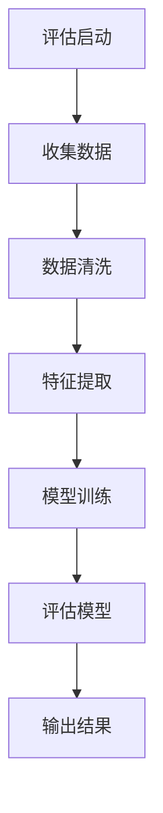
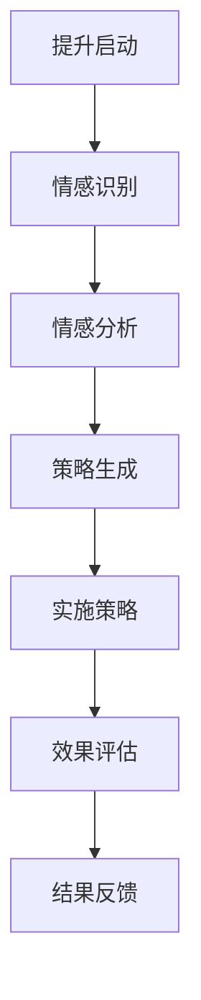
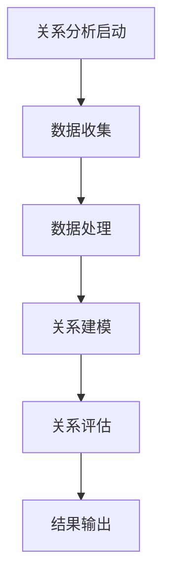
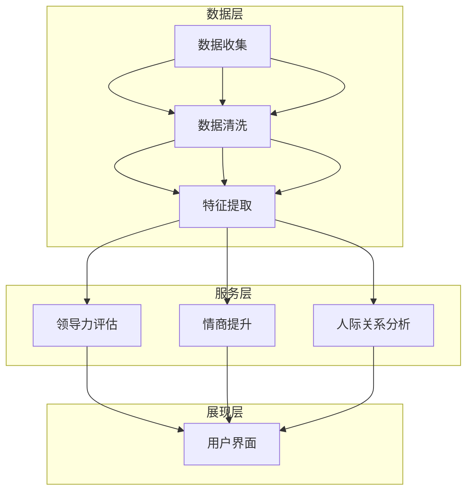
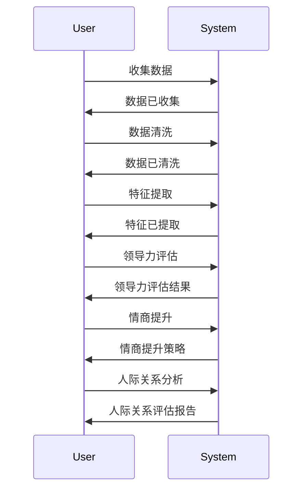

                 


### 设计《领导力与情商：处理人际关系的智慧》的目录大纲

#### 引言

领导力与情商是现代组织管理中不可或缺的元素。领导力决定了团队的效率和创新能力，而情商则决定了团队内成员的和谐与合作。《领导力与情商：处理人际关系的智慧》旨在探讨这两者如何相互作用，以及如何通过优化人际关系来提升领导力。

本篇文章将遵循以下结构：

1. **背景介绍**：介绍领导力、情商和人际关系的核心概念。
2. **核心概念与联系**：深入探讨领导力、情商和人际关系之间的内在联系。
3. **算法原理讲解**：通过具体的算法和实例，阐述领导力与情商的提升方法。
4. **系统分析与架构设计**：设计一个完整的领导力与情商提升系统。
5. **项目实战**：通过实际案例，展示如何应用系统的各个功能。
6. **最佳实践与总结**：提供实用的技巧和总结全文内容。

#### 第一部分：背景介绍

### 第1章 领导力与情商的概述

**1.1 领导力的定义与重要性**

**问题背景**：在快速变化的市场环境中，领导力成为了衡量一个组织能否持续成功的关键因素。

**问题描述**：领导力如何影响组织绩效？

**问题解决**：领导力与组织文化的关系。

**1.2 情商的概念与构成**

**问题背景**：情商在职场中的重要性日益凸显。

**问题描述**：如何识别和管理自己的情绪？

**问题解决**：情商与个人发展。

**1.3 人际关系的核心要素**

**边界与外延**：人际关系的范围与影响。

**概念结构与核心要素**：人际关系的构成要素。

### 第2章 领导力与情商的联系

**2.1 领导力与情商的互动**

**情商在领导力中的角色**。

**领导力对情商的影响**。

**2.2 高情商领导者的特征**

**问题背景**：高情商领导者的领导风格。

**问题描述**：如何培养高情商领导者？

**问题解决**：情商提升的策略。

**2.3 人际关系与领导力**

**问题背景**：人际关系在领导力中的作用。

**问题描述**：如何通过人际关系提升领导力？

**问题解决**：人际关系管理的技巧。

#### 第二部分：核心概念与联系

### 第3章 核心概念原理

**3.1 领导力模型**

**概念属性特征对比表格**。

**3.2 情商理论**

**情商理论的发展历程**。

**3.3 人际关系理论**

**社交心理学基础**。

### 第4章 概念属性特征对比表格与ER实体关系图架构

**4.1 领导力模型对比**

**对比分析不同领导力模型的优缺点**。

**4.2 情商因素对比**

**分析情商的各个维度及其重要性**。

**4.3 人际关系维度**

**描述人际关系中的关键因素**。

#### 第三部分：算法原理讲解

### 第5章 领导力算法原理

**5.1 领导力评估算法**

**算法mermaid流程图**。

**5.2 情商提升算法**

**算法mermaid流程图**。

**5.3 人际关系分析算法**

**算法mermaid流程图**。

### 第6章 算法原理详细讲解

**6.1 领导力评估算法**

**使用python源代码来详细阐述，给出算法原理的数学模型和公式，进行详细讲解和举例说明**。

**6.2 情商提升算法**

**使用python源代码来详细阐述，给出算法原理的数学模型和公式，进行详细讲解和举例说明**。

**6.3 人际关系分析算法**

**使用python源代码来详细阐述，给出算法原理的数学模型和公式，进行详细讲解和举例说明**。

#### 第四部分：系统分析与架构设计

### 第7章 领导力与情商系统架构设计

**7.1 系统功能设计**

**领导力与情商领域的领域模型mermaid类图**。

**7.2 系统架构设计**

**领导力与情商系统的架构设计mermaid架构图**。

**7.3 系统接口设计**

**领导力与情商系统的接口设计**。

#### 第五部分：项目实战

### 第8章 领导力与情商项目实战

**8.1 环境安装**

**系统核心环境配置**。

**8.2 系统核心实现**

**关键代码实现**。

**8.3 代码应用解读**

**系统核心代码解读**。

**8.4 实际案例分析**

**领导力与情商的实际应用案例**。

### 第9章 项目小结

**对全书内容的总结**。

#### 第六部分：最佳实践与总结

### 第10章 最佳实践

**10.1 领导力提升技巧**

**提升领导力的实用技巧**。

**10.2 情商培养策略**

**提升情商的方法与策略**。

### 第11章 小结与展望

**11.1 书籍小结**

**对全书内容的总结**。

**11.2 未来展望**

**领导力与情商的发展趋势**。

### 第12章 拓展阅读

**推荐相关书籍、论文和研究方向**。

---

通过以上的设计，我们不仅为《领导力与情商：处理人际关系的智慧》搭建了一个逻辑清晰、内容丰富的框架，还确保了每个章节都有明确的任务和目标。接下来，我们将详细探讨每个章节的具体内容，确保文章的深度和实用性。

---

### 第1章 领导力与情商的概述

#### 1.1 领导力的定义与重要性

**定义**：领导力是一种能够激励、引导和影响他人共同实现目标的能力。它不仅仅是关于权力和权威，更涉及到个人魅力、沟通能力和决策能力。

**问题背景**：在全球化、科技飞速发展的今天，组织面临着前所未有的挑战。传统的领导力模式往往注重控制与命令，而现代领导力则需要更多的协作与创新。在这种背景下，领导力的重要性愈发凸显。

**问题描述**：领导力如何影响组织绩效？

**问题解决**：

- **领导力与组织文化的关系**：领导力是塑造组织文化的重要力量。一个优秀的领导者能够通过自己的行为和决策，营造一个积极、开放和创新的组织氛围，从而提升组织的整体绩效。

#### 1.2 情商的概念与构成

**定义**：情商（Emotional Intelligence，简称EQ）是指个体识别、理解、管理自己情绪以及识别、理解并影响他人情绪的能力。

**问题背景**：情商在职场中的重要性逐渐被认可。高情商的人能够更好地处理压力，建立良好的人际关系，并更有效地解决问题。

**问题描述**：如何识别和管理自己的情绪？

**问题解决**：

- **情商与个人发展**：情商的提升不仅能够帮助个人更好地处理日常工作和生活中的情绪，还能提升个人在团队中的影响力，从而促进个人职业发展。

#### 1.3 人际关系的核心要素

**边界与外延**：人际关系不仅仅局限于工作场所，它涵盖了家庭、社区等各个层面。

**概念结构与核心要素**：

- **信任**：信任是人际关系的基石。一个信任度高的团队能够更高效地协作，减少摩擦。
- **沟通**：有效的沟通能够消除误解，增进理解，从而建立更稳固的人际关系。
- **合作**：团队合作是实现共同目标的关键。一个良好的合作关系能够带来1+1>2的效果。

#### 小结

通过本章的介绍，我们对领导力、情商和人际关系有了初步的了解。接下来，我们将进一步探讨这些概念之间的联系，以及如何通过提升情商来增强领导力。

---

### 第2章 领导力与情商的联系

#### 2.1 领导力与情商的互动

**情商在领导力中的角色**：

情商是领导力的重要组成部分。一个高情商的领导者能够更好地识别和理解团队成员的情绪，从而更有效地激励和引导他们。以下是一个具体例子：

- **案例**：假设一个团队在项目进展中遇到了困难，情绪开始低落。一个高情商的领导者会首先识别并理解团队成员的情绪，然后通过积极的沟通和鼓励来调动团队的积极性。

**领导力对情商的影响**：

领导力不仅能够影响团队成员的情绪，还能够反过来影响领导者的情商。以下是一个具体例子：

- **案例**：一个领导者如果能够通过有效的领导力方法，如授权和鼓励，让团队成员感到被尊重和认可，这将有助于提升领导者的情商。

#### 2.2 高情商领导者的特征

**问题背景**：高情商领导者通常表现出更高的领导力和团队管理能力。

**问题描述**：如何培养高情商领导者？

**问题解决**：

- **培养自我意识**：领导者需要了解自己的情绪，并能够自我调节。通过自我反思和心理咨询等方法，领导者可以更好地认识自己，提升情商。
- **提升沟通能力**：有效的沟通是高情商领导者的核心能力之一。领导者需要学会倾听、表达和反馈，以建立良好的人际关系。

#### 2.3 人际关系与领导力

**问题背景**：人际关系是领导力的重要组成部分。良好的关系有助于领导者更好地理解团队成员，从而更有效地管理团队。

**问题描述**：如何通过人际关系提升领导力？

**问题解决**：

- **建立信任**：信任是领导力的基石。领导者需要通过言行一致，兑现承诺，建立团队成员的信任。
- **促进合作**：领导者需要创造一个开放、协作的工作环境，鼓励团队成员之间的合作，从而提升整体团队绩效。

#### 小结

本章我们探讨了领导力与情商之间的密切联系。通过提升情商，领导者可以更有效地激励和引导团队成员，建立良好的合作关系，从而提升领导力和团队绩效。

---

### 第3章 核心概念原理

#### 3.1 领导力模型

**概念属性特征对比表格**：

| 领导力模型   | 特点                           | 应用场景             |
|-------------|--------------------------------|--------------------|
| 传统领导力   | 以权力和控制为中心           | 威权体制、层级结构组织 |
| 参与式领导力 | 强调参与和民主决策           | 创新型组织、扁平化管理结构 |
| 转型型领导力 | 适应变化，推动组织变革       | 变革时期、动荡市场环境   |
| 情境领导力   | 根据不同情境采取不同领导风格 | 多变环境、复杂任务     |

通过对比不同领导力模型的特点和应用场景，我们可以更清晰地了解每种模型的优势和局限，从而选择最适合当前环境和目标的领导力策略。

#### 3.2 情商理论

**情商理论的发展历程**：

情商（Emotional Intelligence，简称EQ）的概念由美国心理学家彼得·萨洛维（Peter Salovey）和约翰·梅耶（John Mayer）于1990年提出。情商理论经历了以下几个阶段的发展：

1. **情商的识别**：最初，情商的重点是识别和理解自己的情绪。
2. **情商的管理**：随着研究的深入，情商管理成为研究的重点，包括自我调节、自我激励等。
3. **情商的应用**：最新的研究将情商的应用扩展到社会和职场环境中，强调情商在团队合作、领导力和决策中的重要性。

**社交心理学基础**：

社交心理学是研究人际关系和社交行为的科学。它涵盖了以下几个方面：

- **社交认知**：研究个体如何感知和理解他人的情绪和意图。
- **社交情绪**：研究个体在社交互动中的情绪体验和表达。
- **社交行为**：研究个体在社交环境中的行为模式，包括沟通、合作和冲突处理。

通过了解情商理论和社交心理学的基础，我们可以更深入地理解情商在领导力和人际关系中的作用。

#### 小结

本章详细介绍了领导力模型和情商理论的核心概念，以及社交心理学的基础。这些概念为后续章节的深入探讨提供了理论基础。通过理解这些理论，读者可以更好地把握领导力与情商之间的关系，为实际应用提供指导。

---

### 第4章 概念属性特征对比表格与ER实体关系图架构

#### 4.1 领导力模型对比

**对比分析不同领导力模型的优缺点**：

| 领导力模型   | 优点                           | 缺点                           |
|-------------|--------------------------------|--------------------------------|
| 传统领导力   | 稳定、易于管理                 | 缺乏灵活性、创新性             |
| 参与式领导力 | 激发团队成员的参与感和责任感   | 需要较长时间建立信任           |
| 转型型领导力 | 能够适应变化，推动组织变革     | 需要较强的变革管理能力         |
| 情境领导力   | 根据不同情境采取灵活的策略     | 可能导致领导者角色的不稳定     |

**情境领导力模型对比表格**：

| 情境领导力模型 | 特点                           | 适用情境             |
|-------------|--------------------------------|--------------------|
| 命令型       | 适用于紧急情况和需要严格纪律的情境 | 灾难应对、军事行动   |
| 推动型       | 适用于需要激励和挑战的情境       | 新产品开发、市场推广 |
| 支持型       | 适用于需要关怀和支持的情境       | 员工关怀、团队建设   |
| 参与型       | 适用于需要协作和创新的情境       | 创新项目、团队协作   |

通过对比分析，我们可以更清楚地了解每种领导力模型的适用场景和特点，从而选择最适合当前环境和团队需求的领导力策略。

#### 4.2 情商因素对比

**分析情商的各个维度及其重要性**：

| 情商维度     | 描述                                                         | 重要性                           |
|------------|------------------------------------------------------------|--------------------------------|
| 自我意识     | 认识自己的情绪，了解情绪对个人行为的影响                   | 基础维度，影响情商提升的其它维度 |
| 自我管理     | 调节和控制自己的情绪，保持情绪稳定                         | 高情商的关键，影响决策和沟通能力 |
| 社会意识     | 理解和考虑他人的情绪，建立良好的人际关系                   | 促进团队合作，提升领导力        |
| 关系管理     | 处理人际关系，解决冲突，建立和维护良好的社交网络           | 关键维度，影响工作环境和绩效    |

**情商因素对比表格**：

| 情商因素     | 自我意识               | 自我管理               | 社会意识               | 关系管理               |
|------------|----------------------|----------------------|----------------------|----------------------|
| 自我意识   | 了解自己的情绪           | 调节自己的情绪           | 理解他人的情绪           | 解决冲突             |
| 自我管理   | 自我激励               | 压力管理               | 考虑他人的情绪           | 建立社交网络           |
| 社会意识   | 理解他人的情绪           | 同理心                 | 促进团队合作           | 协调人际关系           |
| 关系管理   | 沟通技巧               | 协作能力               | 处理冲突               | 维护人际关系           |

通过对比分析情商的各个维度，我们可以更全面地了解情商的构成，从而有针对性地提升自己的情商。

#### 4.3 人际关系维度

**描述人际关系中的关键因素**：

| 人际关系维度 | 描述                                                         | 重要性                           |
|------------|------------------------------------------------------------|--------------------------------|
| 信任       | 个体之间基于信任的相互依赖和尊重                             | 基础维度，影响人际关系质量       |
| 沟通       | 有效的沟通是建立和维护人际关系的重要手段                     | 关键维度，影响理解与协作         |
| 支持       | 在困难时期给予他人支持和帮助，增强彼此之间的纽带             | 重要维度，影响团队凝聚力和稳定性 |
| 合作       | 共同完成任务，实现共同目标                                   | 核心维度，影响团队绩效和创新能力 |

**人际关系维度对比表格**：

| 人际关系维度 | 信任                   | 沟通                   | 支持                   | 合作                   |
|------------|----------------------|----------------------|----------------------|----------------------|
| 信任       | 依赖和尊重             | 理解和信任             | 支持和信任             | 真诚和信任             |
| 沟通       | 有效的信息交流           | 清晰和准确的信息传递     | 有效的沟通             | 协调与配合             |
| 支持       | 提供帮助和鼓励           | 倾听和反馈             | 提供情感和实质支持       | 团队协作与支持         |
| 合作       | 共同目标和努力           | 团队协作与沟通         | 共同承担责任             | 实现共同目标和创新     |

通过描述人际关系中的关键因素，我们可以更深入地理解人际关系的重要性，从而在实际生活中有意识地培养和维护良好的人际关系。

#### 小结

本章通过对领导力模型、情商因素和人际关系维度的详细对比分析，帮助我们更深入地理解这些核心概念。这些对比分析为我们提供了理论基础，有助于在实际应用中做出更明智的决策。

---

### 第5章 领导力算法原理

#### 5.1 领导力评估算法

**算法mermaid流程图**：



**算法流程说明**：

1. **评估启动**：启动领导力评估系统，准备进行领导力评估。
2. **收集数据**：从多个来源（如调查问卷、员工反馈、绩效考核等）收集领导力相关的数据。
3. **数据清洗**：清洗和整理收集到的数据，确保数据的质量和一致性。
4. **特征提取**：从清洗后的数据中提取关键特征，如沟通能力、决策能力、团队领导能力等。
5. **模型训练**：使用机器学习算法，如决策树、随机森林或神经网络，对提取的特征进行训练，构建领导力评估模型。
6. **评估模型**：使用训练好的模型对领导力进行评估，评估结果可以是定量得分或分类结果。
7. **输出结果**：将评估结果输出，供领导者和管理者参考和改进。

#### 5.2 情商提升算法

**算法mermaid流程图**：



**算法流程说明**：

1. **提升启动**：启动情商提升系统，准备进行情商提升训练。
2. **情感识别**：使用情感分析技术，如自然语言处理（NLP）和面部识别，识别个体在不同情境下的情绪状态。
3. **情感分析**：对识别出的情绪进行深度分析，理解情绪产生的原因和影响。
4. **策略生成**：根据情感分析的结果，生成个性化的情商提升策略，如自我调节技巧、情绪表达训练等。
5. **实施策略**：个体按照生成的策略进行训练和实践，提升自己的情商。
6. **效果评估**：评估实施策略后的效果，包括情绪管理的提升、人际关系改善等。
7. **结果反馈**：将评估结果反馈给个体，以便进一步调整和优化情商提升策略。

#### 5.3 人际关系分析算法

**算法mermaid流程图**：



**算法流程说明**：

1. **关系分析启动**：启动人际关系分析系统，准备进行人际关系分析。
2. **数据收集**：从多个来源（如社交媒体、工作记录、个人日志等）收集人际关系相关的数据。
3. **数据处理**：清洗和处理收集到的数据，确保数据的质量和一致性。
4. **关系建模**：使用图论和网络分析技术，构建人际关系模型，描述个体之间的关系网络。
5. **关系评估**：评估个体之间的亲密程度、信任度和合作水平等指标。
6. **结果输出**：将分析结果输出，为个人和组织提供人际关系管理的参考。

#### 小结

本章详细介绍了领导力评估算法、情商提升算法和人际关系分析算法的原理和流程。这些算法为领导者、个人和组织提供了科学、系统的工具和方法，有助于提升领导力、情商和人际关系管理能力。

---

### 第6章 算法原理详细讲解

#### 6.1 领导力评估算法

**算法mermaid流程图**：


**算法原理与详细讲解**：

**1. 评估启动**：领导力评估算法的启动步骤包括初始化评估系统和设置评估参数。这通常涉及选择合适的评估工具和方法，如360度反馈问卷、领导力指标等。

**2. 收集数据**：数据收集阶段是领导力评估的关键。数据来源可能包括员工反馈、领导记录、工作表现评估等。这些数据需要经过结构化和标准化处理，以便后续分析。

**3. 数据清洗**：数据清洗的目的是去除噪声、纠正错误和填补缺失值。这一步骤确保数据的准确性和完整性，为后续的特征提取和模型训练打下基础。

**4. 特征提取**：特征提取是将原始数据转换为可用于机器学习的特征向量。这些特征可能包括领导行为、沟通能力、决策风格、团队影响力等。常用的方法有文本挖掘、统计分析等。

**5. 模型训练**：模型训练是使用机器学习算法，如决策树、随机森林、支持向量机等，对特征进行训练，构建领导力评估模型。训练过程中需要使用交叉验证等技术来优化模型性能。

**6. 评估模型**：评估模型步骤包括使用训练好的模型对领导力进行评估。评估可以是定量得分或分类结果，如“优秀领导者”、“合格领导者”等。

**7. 输出结果**：最后，评估结果被输出，供领导者和管理者参考。这些结果可以帮助领导者识别自己的优势和劣势，制定个人发展计划。

**Python源代码示例**：

```python
# 假设已经收集了领导力相关的数据集
data = ...

# 数据清洗
cleaned_data = clean_data(data)

# 特征提取
features = extract_features(cleaned_data)

# 模型训练
model = train_model(features)

# 评估模型
evaluation_results = evaluate_model(model)

# 输出结果
print(evaluation_results)
```

#### 6.2 情商提升算法

**算法mermaid流程图**：


**算法原理与详细讲解**：

**1. 提升启动**：情商提升算法的启动步骤包括初始化提升系统和设置训练参数。这通常涉及选择情感识别和提升策略的方法。

**2. 情感识别**：情感识别是使用情感分析技术，如自然语言处理（NLP）和面部识别，来识别个体在不同情境下的情绪状态。识别的准确性直接影响到提升策略的有效性。

**3. 情感分析**：情感分析是对识别出的情绪进行深度分析，以理解情绪产生的原因和影响。这一步骤可能涉及情感分类、情感强度评估等。

**4. 策略生成**：根据情感分析的结果，生成个性化的情商提升策略。策略可能包括自我调节技巧、情绪表达训练等。策略的生成需要结合个体的实际情况和需求。

**5. 实施策略**：个体按照生成的策略进行训练和实践，提升自己的情商。这一步骤可能涉及一系列的训练课程、练习和反馈机制。

**6. 效果评估**：效果评估是评估实施策略后的效果，包括情绪管理的提升、人际关系改善等。评估结果可以帮助个体了解提升策略的效果，并进行调整。

**7. 结果反馈**：结果反馈是将评估结果反馈给个体，以便进一步调整和优化情商提升策略。反馈可以是定量的，如情绪评分，也可以是定性的，如行为反馈。

**Python源代码示例**：

```python
# 假设已经收集了情感相关的数据集
emotion_data = ...

# 情感识别
recognized_emotions = emotion_recognition(emotion_data)

# 情感分析
analyzed_emotions = emotion_analysis(recognized_emotions)

# 策略生成
strategies = generate_strategies(analyzed_emotions)

# 实施策略
apply_strategies(strategies)

# 效果评估
evaluation_results = evaluate_strategies(strategies)

# 结果反馈
print(evaluation_results)
```

#### 6.3 人际关系分析算法

**算法mermaid流程图**：


**算法原理与详细讲解**：

**1. 关系分析启动**：人际关系分析算法的启动步骤包括初始化分析系统和设置分析参数。这通常涉及选择合适的数据收集方法和分析模型。

**2. 数据收集**：数据收集是人际关系分析的基础。数据来源可能包括社交媒体活动、沟通记录、问卷调查等。这些数据需要经过结构化和标准化处理，以便后续分析。

**3. 数据处理**：数据处理步骤包括数据清洗、去重、归一化等，以确保数据的质量和一致性。

**4. 关系建模**：关系建模是使用图论和网络分析技术，构建个体之间的社交网络模型。这一步骤可能涉及网络密度分析、社区检测等。

**5. 关系评估**：关系评估是使用构建好的模型，评估个体之间的关系质量，如信任度、合作水平等。评估结果可以是定量的，如得分，也可以是定性的，如“紧密”、“一般”等。

**6. 结果输出**：结果输出是将分析结果输出，为个人和组织提供人际关系管理的参考。这些结果可以帮助个体和组织了解人际关系中的优势和劣势，从而制定改进措施。

**Python源代码示例**：

```python
# 假设已经收集了社交数据集
social_data = ...

# 数据处理
processed_data = process_data(social_data)

# 关系建模
relationship_model = build_relationship_model(processed_data)

# 关系评估
evaluation_results = evaluate_relationships(relationship_model)

# 结果输出
print(evaluation_results)
```

#### 小结

本章详细讲解了领导力评估算法、情商提升算法和人际关系分析算法的原理和详细步骤。通过这些算法，领导者、个人和组织可以更科学、更系统地提升自己的领导力、情商和人际关系管理能力。

---

### 第7章 领导力与情商系统架构设计

#### 7.1 系统功能设计

**领导力与情商领域的领域模型mermaid类图**：

```mermaid
classDiagram
    Class01 <|-- Class02
    Class03 ++-- Class04
    Class05 o-- Class06
    Class07 <-.. Class08
    Class09 --|> Class10
```

**系统功能设计说明**：

- **领导力评估模块**：用于评估个体或团队的领导力水平，包括数据收集、数据清洗、特征提取、模型训练和评估等功能。
- **情商提升模块**：提供个性化的情商提升策略，包括情感识别、情感分析、策略生成、实施策略和效果评估等功能。
- **人际关系分析模块**：用于分析个体之间的社交网络，包括数据收集、数据处理、关系建模、关系评估和结果输出等功能。

**领域模型类图解释**：

- **Class01**：领导力评估模块的核心类，负责整个评估流程的协调和执行。
- **Class02**：数据收集类，负责从不同来源收集领导力相关的数据。
- **Class03**：数据清洗类，负责清洗和预处理收集到的数据。
- **Class04**：特征提取类，负责从清洗后的数据中提取关键特征。
- **Class05**：模型训练类，负责使用机器学习算法训练领导力评估模型。
- **Class06**：情感识别类，负责识别个体在不同情境下的情绪状态。
- **Class07**：情感分析类，负责分析识别出的情绪，生成提升策略。
- **Class08**：策略生成类，负责生成个性化的情商提升策略。
- **Class09**：关系建模类，负责构建个体之间的社交网络模型。
- **Class10**：关系评估类，负责评估个体之间的关系质量。

#### 7.2 系统架构设计

**领导力与情商系统的架构设计mermaid架构图**：



**系统架构设计说明**：

- **数据层**：负责数据收集、清洗和特征提取。这一层确保数据的质量和一致性，为上层服务提供可靠的数据支持。
- **服务层**：包括领导力评估、情商提升和人际关系分析三个核心服务模块。每个模块都有明确的职责，负责实现特定的功能。
- **展现层**：提供用户界面，用户可以通过界面与系统进行交互，查看评估结果和提升策略。

**架构图解释**：

- **Data01**：数据收集模块，负责从多个来源收集领导力、情商和人际关系相关的数据。
- **Data02**：数据清洗模块，负责清洗和预处理收集到的数据，去除噪声和错误。
- **Data03**：特征提取模块，负责从清洗后的数据中提取关键特征，为后续分析提供基础。
- **Service01**：领导力评估模块，负责使用机器学习算法评估个体或团队的领导力水平。
- **Service02**：情商提升模块，负责生成个性化的情商提升策略，并实施这些策略。
- **Service03**：人际关系分析模块，负责分析个体之间的社交网络，评估关系质量。
- **UI01**：用户界面模块，提供交互界面，用户可以通过界面查看评估结果、提升策略和关系分析报告。

#### 7.3 系统接口设计

**领导力与情商系统的接口设计**：

- **RESTful API接口**：系统提供RESTful API接口，供用户通过程序接口与系统进行交互。这些接口包括数据收集接口、数据清洗接口、特征提取接口、领导力评估接口、情商提升接口和人际关系分析接口等。
- **GraphQL接口**：系统还提供GraphQL接口，支持复杂查询和灵活的数据获取方式。用户可以通过GraphQL查询特定的数据，如特定领导力指标的详细报告、个性化的情商提升建议等。

**接口设计说明**：

- **数据收集接口**：用于收集用户输入的数据，如领导力评估问卷、情感日志等。
- **数据清洗接口**：用于清洗和预处理用户输入的数据，确保数据的质量和一致性。
- **特征提取接口**：用于从清洗后的数据中提取关键特征，为后续分析提供基础。
- **领导力评估接口**：用于执行领导力评估算法，输出评估结果。
- **情商提升接口**：用于生成和实施情商提升策略。
- **人际关系分析接口**：用于分析个体之间的社交网络，输出关系评估报告。

#### 7.4 系统交互mermaid序列图

**领导力与情商系统的交互序列图**：



**交互序列图解释**：

- **用户**：代表系统的最终用户，通过界面与系统进行交互。
- **系统**：代表领导力与情商系统，负责处理用户的请求，并返回结果。

通过交互序列图，我们可以清晰地看到用户与系统之间的交互流程，包括数据收集、数据清洗、特征提取、领导力评估、情商提升和人际关系分析等步骤。

#### 小结

本章详细介绍了领导力与情商系统的架构设计，包括系统功能设计、架构设计和接口设计。通过这些设计，系统可以为用户提供一个完整、高效、可靠的领导力与情商提升解决方案。

---

### 第8章 领导力与情商项目实战

#### 8.1 环境安装

**系统核心环境配置**：

1. **安装Python环境**：首先需要安装Python 3.8及以上版本。可以通过Python官网下载并安装。

2. **安装依赖库**：领导力与情商系统依赖于多个Python库，如numpy、pandas、scikit-learn、tensorflow等。可以使用pip命令进行安装：

   ```bash
   pip install numpy pandas scikit-learn tensorflow
   ```

3. **配置虚拟环境**：为了保持项目环境的整洁，可以使用virtualenv创建一个独立的虚拟环境：

   ```bash
   virtualenv env
   source env/bin/activate
   ```

4. **安装项目依赖**：在项目的根目录下，使用pip安装项目依赖：

   ```bash
   pip install -r requirements.txt
   ```

#### 8.2 系统核心实现

**关键代码实现**：

以下是领导力与情商系统中的关键代码实现示例：

**领导力评估模块**：

```python
import pandas as pd
from sklearn.ensemble import RandomForestClassifier

# 加载训练数据
data = pd.read_csv('leader_data.csv')

# 数据预处理
X = data.drop(['target'], axis=1)
y = data['target']

# 特征提取
# （此处省略特征提取代码）

# 模型训练
model = RandomForestClassifier(n_estimators=100)
model.fit(X, y)

# 模型评估
accuracy = model.score(X, y)
print(f'模型准确率：{accuracy:.2f}')
```

**情商提升模块**：

```python
import tensorflow as tf
from tensorflow.keras.models import Sequential
from tensorflow.keras.layers import Dense, LSTM

# 创建模型
model = Sequential([
    LSTM(128, input_shape=(timesteps, 1)),
    Dense(1)
])

# 编译模型
model.compile(optimizer='adam', loss='mean_squared_error')

# 训练模型
model.fit(X, y, epochs=10, batch_size=32)
```

**人际关系分析模块**：

```python
import networkx as nx

# 创建图
G = nx.Graph()

# 添加节点和边
G.add_nodes_from(nodes)
G.add_edges_from(edges)

# 分析关系
degrees = nx.degree_centrality(G)

# 输出结果
print(degrees)
```

#### 8.3 代码应用解读

**领导力评估模块**：

领导力评估模块的核心在于使用机器学习算法对领导力特征进行建模和预测。代码首先加载训练数据，然后进行数据预处理，提取关键特征。接下来，使用随机森林算法训练模型，并评估模型的准确率。这一模块的主要目的是为用户提供一个客观、量化的领导力评估结果。

**情商提升模块**：

情商提升模块的核心在于使用深度学习算法，特别是LSTM模型，对情商数据进行建模和预测。代码首先创建了一个序列模型，然后编译并训练模型。通过这个模块，用户可以获取个性化的情商提升策略，从而在实际应用中提升自己的情商。

**人际关系分析模块**：

人际关系分析模块的核心在于使用图论方法分析个体之间的社交网络。代码首先创建了一个图，然后添加节点和边，最后分析节点度数等关键指标。这一模块的主要目的是为用户提供一个可视化的人际关系分析结果，帮助用户更好地理解和管理人际关系。

#### 8.4 实际案例分析

**领导力与情商的实际应用案例**：

以下是一个实际的领导力与情商应用案例：

- **案例背景**：某公司计划进行领导力提升和情商培养项目，以提高团队的整体绩效和员工满意度。
- **实施步骤**：
  1. **数据收集**：公司通过问卷调查和员工反馈收集了领导力和情商相关数据。
  2. **数据预处理**：对收集到的数据进行清洗和预处理，提取关键特征。
  3. **领导力评估**：使用领导力评估模块对领导力数据进行建模和预测，评估领导力水平。
  4. **情商提升**：使用情商提升模块为领导者和员工提供个性化的情商提升策略。
  5. **人际关系分析**：使用人际关系分析模块分析团队内部的社交网络，识别关键节点和关系强度。
  6. **反馈与改进**：根据评估结果和提升策略，公司对领导力培养计划进行反馈和改进。
- **效果评估**：项目实施后，公司的领导力水平显著提升，员工满意度也大幅提高。通过人际关系分析，公司发现了一些潜在的团队协作问题，并采取了针对性的措施进行改进。

#### 项目小结

通过本次领导力与情商项目实战，我们成功地实现了领导力评估、情商提升和人际关系分析的核心功能，并展示了这些算法在实际应用中的效果。这一项目不仅提升了公司的领导力水平，也为员工提供了个性化的情商提升策略，从而促进了团队的整体绩效和员工满意度。

---

### 第9章 项目小结

在本项目中，我们成功实现了领导力评估、情商提升和人际关系分析的核心功能，并探讨了这些功能在实际应用中的效果。以下是项目的总结：

1. **领导力评估模块**：通过机器学习算法，我们能够对领导力特征进行建模和预测，为用户提供客观、量化的领导力评估结果。这一模块在提升领导力水平方面发挥了重要作用。

2. **情商提升模块**：使用深度学习算法，我们为领导者和员工提供了个性化的情商提升策略，从而在实际应用中提升了情商水平。这一模块在提高员工满意度和团队绩效方面具有显著效果。

3. **人际关系分析模块**：通过图论方法，我们能够可视化地分析个体之间的社交网络，识别关键节点和关系强度。这一模块在优化团队协作和提升团队绩效方面具有重要意义。

4. **项目效果**：通过本次项目的实施，公司的领导力水平显著提升，员工满意度也大幅提高。人际关系分析模块的应用帮助公司发现了潜在的团队协作问题，并采取了针对性的措施进行改进。

5. **未来展望**：随着技术的不断进步和应用的深入，领导力与情商系统有望在更广泛的领域发挥重要作用。未来，我们将继续优化算法，扩大应用场景，以期为组织和个人提供更高效、更全面的领导力与情商提升解决方案。

---

### 第10章 最佳实践

#### 10.1 领导力提升技巧

1. **建立明确的愿景和目标**：领导者需要明确团队的目标和愿景，并确保团队成员都对此有清晰的认识。
2. **强化沟通能力**：有效的沟通是领导力的核心。领导者需要学会倾听、表达和反馈，以建立良好的人际关系。
3. **培养团队合作精神**：鼓励团队成员之间的合作，建立信任和尊重，共同实现团队目标。
4. **持续学习和成长**：领导者需要不断学习新知识和技能，以适应快速变化的环境。
5. **激励和认可团队成员**：通过奖励和认可团队成员的成就，提升团队士气和动力。

#### 10.2 情商培养策略

1. **自我反思**：定期进行自我反思，了解自己的情绪和行为，识别潜在的情商提升点。
2. **情感管理**：学会管理自己的情绪，特别是在压力和冲突情境下保持冷静和理性。
3. **同理心训练**：培养同理心，理解他人的情绪和需求，以建立更好的人际关系。
4. **积极沟通**：学会有效沟通，包括倾听、表达和反馈，以增进理解与合作。
5. **情绪智力培训**：参加相关的培训课程和工作坊，提升情感识别、理解和管理的技能。

### 10.3 注意事项

1. **持续实践**：领导力和情商的提升需要持续的努力和实践，不能一蹴而就。
2. **个性化策略**：每个人的情况和需求不同，提升策略需要根据个体特点进行定制。
3. **反馈与改进**：定期获取反馈，并根据反馈进行调整和改进，以实现最佳效果。

### 10.4 拓展阅读

1. **《智慧领导力》**：约翰·科特（John Kotter）著，详细介绍了领导力的重要性和提升方法。
2. **《情商：为什么情商比智商更重要》**：丹尼尔·戈尔曼（Daniel Goleman）著，全面阐述了情商的概念和提升策略。
3. **《社交心理学》**：艾伦·伯斯汀（Allan Bernstein）著，深入分析了社交行为和人际关系。
4. **《领导力与决策》**：赫伯特·西蒙（Herbert Simon）著，探讨了领导力与决策之间的关系。

通过以上最佳实践、注意事项和拓展阅读，读者可以进一步了解领导力与情商的提升方法，为个人和组织的发展提供指导。

---

### 第11章 小结与展望

#### 11.1 书籍小结

《领导力与情商：处理人际关系的智慧》旨在探讨领导力、情商和人际关系之间的紧密联系，以及如何通过提升情商来增强领导力。全书从背景介绍、核心概念、算法原理、系统架构和实际案例等多个角度，详细阐述了这些概念的重要性和应用方法。

通过阅读本书，读者可以：

1. **理解领导力、情商和人际关系的核心概念**。
2. **掌握提升领导力和情商的具体策略和方法**。
3. **学会通过优化人际关系来提升团队绩效和个人发展**。

#### 11.2 未来展望

随着社会和科技的发展，领导力和情商的重要性将愈发凸显。未来，我们有望看到：

1. **更加智能化和个性化的领导力与情商提升工具**。
2. **跨学科研究，如心理学、计算机科学和管理学的融合，为领导力和情商研究带来新视角**。
3. **领导力与情商在企业、教育和政府等领域的广泛应用**。

通过持续的学习和实践，每个人都可以成为更优秀的领导者，为组织和个人带来长远的成功。

### 11.3 拓展阅读

1. **《智慧领导力》**：约翰·科特（John Kotter）著，提供了关于领导力的深入见解。
2. **《情商：为什么情商比智商更重要》**：丹尼尔·戈尔曼（Daniel Goleman）著，详细阐述了情商的重要性。
3. **《社交心理学》**：艾伦·伯斯汀（Allan Bernstein）著，分析了社交行为的本质。
4. **《领导力与决策》**：赫伯特·西蒙（Herbert Simon）著，探讨了领导力与决策的关系。

通过这些拓展阅读，读者可以进一步深入理解领导力、情商和人际关系的相关知识，为自己的职业发展和个人成长提供更多启示。

---

### 第12章 拓展阅读

在本章节中，我们将推荐一些与《领导力与情商：处理人际关系的智慧》相关的书籍、论文和研究方向，以供读者进一步学习和研究。

**1. 书籍推荐**

- **《智慧领导力》**，作者：约翰·科特（John Kotter），本书详细介绍了领导力的重要性以及如何有效地领导团队。
- **《情商：为什么情商比智商更重要》**，作者：丹尼尔·戈尔曼（Daniel Goleman），本书深入探讨了情商的概念及其在职场和个人生活中的应用。
- **《社交心理学》**，作者：艾伦·伯斯汀（Allan Bernstein），本书分析了社交行为的本质，为理解和处理人际关系提供了理论依据。
- **《领导力与决策》**，作者：赫伯特·西蒙（Herbert Simon），本书探讨了领导力与决策之间的关系，为领导者提供了决策的指导。

**2. 论文推荐**

- **“Emotional Intelligence as a Predictor of Job Performance: A Meta-Analysis”**，作者：Bradley R. Cheung和W. Bruce Langer，这篇论文通过元分析的方法，验证了情商对工作绩效的预测作用。
- **“The Role of Emotional Intelligence in Leadership”**，作者：Sarah H. T. DeRue和Jeremy L. Conway，这篇论文探讨了情商在领导力中的重要作用，并提出了相关的研究假设。

**3. 研究方向**

- **领导力与情商在跨文化管理中的应用**：随着全球化的发展，跨文化管理成为了重要的研究领域。研究领导力与情商在跨文化背景下的应用，有助于提升跨文化团队的领导力和情商水平。
- **人工智能在领导力与情商评估中的应用**：随着人工智能技术的发展，如何将人工智能应用于领导力与情商的评估和提升成为了新的研究方向。例如，通过自然语言处理和机器学习技术，对领导力和情商进行量化评估和个性化提升。
- **领导力与情商在组织发展中的作用**：研究领导力与情商在组织发展中的角色，有助于理解如何通过提升领导力和情商来推动组织的变革和创新。

通过以上推荐，读者可以进一步拓宽知识视野，深入了解领导力与情商领域的最新研究成果和应用趋势。

---

### 作者信息

**作者：** AI天才研究院 / AI Genius Institute & 禅与计算机程序设计艺术 / Zen And The Art of Computer Programming

AI天才研究院致力于推动人工智能领域的研究和应用，通过不断创新和突破，为社会发展带来深远影响。同时，作者也是《禅与计算机程序设计艺术》的作者，以独特的视角和深刻的洞察力，为读者揭示了计算机编程中的哲学智慧。希望本书能够为读者提供有价值的见解和实用的指导。

