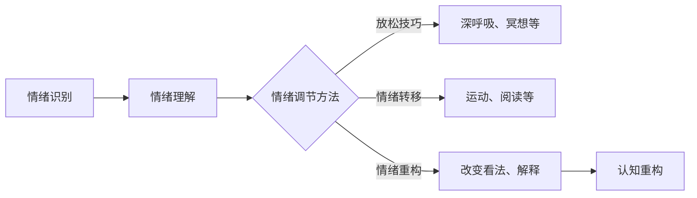
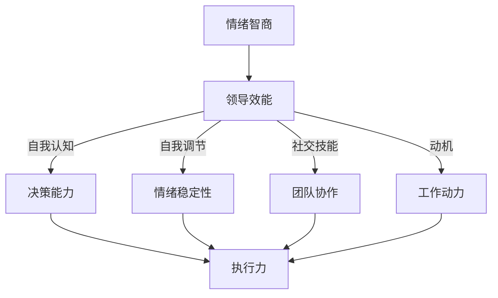
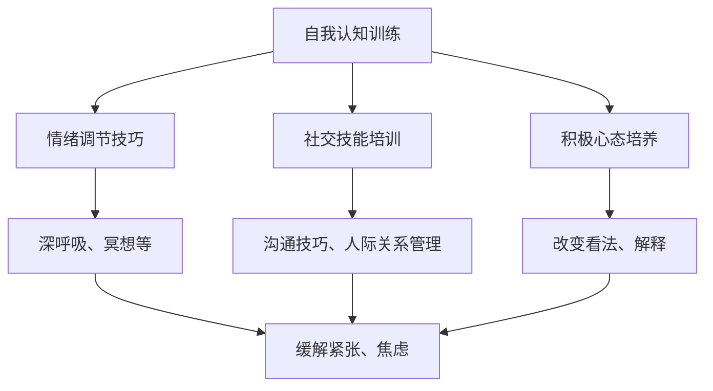

                 

# 领导力与情绪智商：控制情绪的智慧

## 关键词
领导力、情绪智商、自我认知、自我调节、社交技能、动机、情绪管理、职场应用、个人成长、实践技巧

## 摘要
在当今快速变化的工作环境中，领导力与情绪智商的结合成为成功的关键。本文深入探讨了情绪智商的概念及其核心组成部分，包括自我认知、自我调节、社交技能和动机。通过理论讲解和实践案例分析，本文揭示了情绪智商在领导力中的重要性，并提供了提升情绪智商的最佳实践。读者将了解到如何通过掌握情绪管理技巧，提高个人和团队的工作效率，实现卓越的领导力。

## 目录大纲

### 第一部分：情绪智商与领导力基础

#### 第1章 引言
- 领导力的重要性
- 情绪智商的定义与构成
- 情绪智商在领导力中的角色
- 本书结构安排

#### 第2章 情绪智商的核心概念
- 自我认知
- 自我调节
- 社交技能
- 动机
- 情绪智商的ER图与属性特征对比表格

### 第二部分：情绪智商的理论与实践

#### 第3章 情绪智商的理论基础
- 情绪理论简介
- 情绪智力模型
- 情绪智商的数学模型与公式讲解

#### 第4章 情绪管理原理与实践
- 情绪管理的理论基础
- 情绪管理的方法与实践
- 情绪管理mermaid流程图

#### 第5章 领导力中的情绪智商应用
- 领导者在工作中的情绪管理
- 团队建设中的情绪智商
- 冲突管理与情绪智商
- 情绪智商与领导效能的mermaid关系图

### 第三部分：情绪智商的应用与实践

#### 第6章 情绪智商在职场中的应用
- 职场情绪管理案例分析
- 情绪智商提升策略
- 职场情绪管理mermaid架构图

#### 第7章 情绪智商在个人成长中的应用
- 个人情绪管理的重要性
- 情绪智商与自我成长
- 情绪智商在人际关系中的运用

#### 第8章 情绪智商提升的最佳实践
- 情绪智商提升的实用技巧
- 情绪智商提升的案例分析
- 注意事项与常见误区

#### 第9章 结论与展望
- 情绪智商的未来发展趋势
- 情绪智商在领导力中的重要性
- 未来的研究展望

## 正文

### 引言

在当今快节奏、高度竞争的商业环境中，领导力已经成为企业成功的关键因素。然而，随着工作压力的增加和复杂性的上升，单纯的技术能力和战略规划已经不足以应对各种挑战。情绪智商（Emotional Intelligence，简称EQ）作为一种新兴的领导力要素，逐渐受到人们的关注。情绪智商不仅关乎个人的心理健康，更直接影响领导者的决策能力、团队合作和整体工作效能。

情绪智商，是指个体识别、理解、管理和运用情绪的能力。它包括四个核心组成部分：自我认知、自我调节、社交技能和动机。自我认知指的是个体对自己情绪的认识和理解；自我调节涉及情绪的管理和控制；社交技能涉及与他人的情感交流和互动能力；动机则是驱动个体追求目标并保持持续动力的重要因素。

### 第1章 引言

#### 领导力的重要性

领导力是一种激励他人实现共同目标的能力。成功的领导者不仅具备出色的沟通技巧和战略思维，还需要具备处理复杂人际关系的能力。传统的领导力理论强调理性决策和逻辑分析，但随着对人类行为研究的深入，越来越多的研究表明，情绪智商在领导力中扮演着至关重要的角色。

情绪智商高的领导者能够更好地识别和理解团队成员的情绪，从而建立信任和合作。他们能够有效地处理冲突，增强团队凝聚力，提高工作效率。此外，情绪智商还与领导效能显著相关，情绪智商高的领导者往往能够在快速变化的环境中做出更为明智的决策。

#### 情绪智商的定义与构成

情绪智商，又称情感智力，是由美国心理学家戈尔曼（Daniel Goleman）在1995年提出的概念。戈尔曼指出，情绪智商至少与智商一样重要，是决定一个人是否成功的核心因素。

情绪智商的四个核心组成部分如下：

1. **自我认知**：指个体对自己情绪的认识和理解能力。自我认知是情绪智商的基础，有助于个体更好地了解自己的情绪状态，从而做出更为明智的决策。

2. **自我调节**：指个体管理和控制自己情绪的能力。自我调节有助于个体在面对压力和挑战时保持冷静和理性，从而避免情绪波动对行为和决策的负面影响。

3. **社交技能**：指个体在社交场合中与他人互动和沟通的能力。社交技能包括倾听、同理心、沟通技巧和人际关系管理等，有助于建立和维护良好的人际关系。

4. **动机**：指个体追求目标并保持持续动力的能力。动机是推动个体不断进步和发展的内在动力，有助于实现个人和团队的目标。

#### 情绪智商在领导力中的角色

情绪智商在领导力中扮演着多重角色，是领导者成功的关键因素之一。首先，情绪智商有助于建立信任。一个具备高情绪智商的领导者能够真诚地关心团队成员，理解他们的需求和感受，从而赢得信任和尊重。

其次，情绪智商有助于处理冲突。领导者往往需要面对各种冲突，而情绪智商高的领导者能够更有效地识别和处理这些冲突，避免情绪失控和激化矛盾。

此外，情绪智商还与领导效能显著相关。研究表明，情绪智商高的领导者往往能够更好地应对压力，做出明智的决策，并推动团队实现目标。

#### 本书结构安排

本书旨在深入探讨情绪智商的概念、理论基础、实践应用及提升方法，以帮助读者更好地理解情绪智商在领导力中的重要性。本书分为三大部分：

1. **情绪智商与领导力基础**：介绍情绪智商的定义、核心组成部分及其在领导力中的角色。

2. **情绪智商的理论与实践**：探讨情绪智商的理论基础，包括情绪管理原理、领导力中的情绪智商应用，以及情绪智商提升策略。

3. **情绪智商的应用与实践**：分析情绪智商在职场和个人成长中的应用，并提供提升情绪智商的最佳实践。

通过本书的阅读，读者将了解到如何通过掌握情绪管理技巧，提高个人和团队的工作效率，实现卓越的领导力。接下来，我们将进一步探讨情绪智商的核心概念和理论，以帮助读者更深入地理解这一重要领域。

### 第2章 情绪智商的核心概念

#### 自我认知

自我认知是情绪智商的核心组成部分，指的是个体对自己情绪的认识和理解能力。自我认知有助于个体更好地了解自己的情绪状态，从而做出更为明智的决策。自我认知的建立通常需要以下几个步骤：

1. **情绪识别**：个体需要学会识别自己的情绪，包括正面情绪（如快乐、满足）和负面情绪（如愤怒、焦虑）。情绪识别可以通过反思自己的情感体验，或者通过日记记录等方式进行。

2. **情绪理解**：个体需要理解情绪背后的原因和意义。例如，当感到愤怒时，可能是因为感到被冒犯或不公平对待。

3. **情绪接受**：个体需要学会接受自己的情绪，而不是试图压抑或否认。接受情绪有助于个体更好地管理情绪，从而避免情绪波动对行为和决策的负面影响。

自我认知在实际应用中具有重要意义。首先，它有助于提高个人的情绪调节能力，使个体在面对压力和挑战时能够保持冷静和理性。其次，自我认知有助于提高个人的自我效能感，从而增强面对困难的信心。

#### 自我调节

自我调节是情绪智商中另一个重要组成部分，指的是个体管理和控制自己情绪的能力。自我调节能力使个体能够在不同情境下保持情绪稳定，避免情绪波动对行为和决策的负面影响。自我调节的技巧包括：

1. **情绪放松**：通过深呼吸、冥想、瑜伽等放松技巧，缓解紧张和焦虑情绪。

2. **情绪转移**：将注意力从负面情绪转移到其他事物上，如通过运动、阅读或与朋友交流等方式。

3. **情绪重构**：改变对事物的看法和解释，以更积极的方式应对压力和挑战。

自我调节在实际应用中具有重要意义。首先，它有助于提高个人的情绪稳定性和抗压能力，从而提高生活质量和工作效率。其次，自我调节有助于增强个人的情绪调节能力，使个体能够更好地应对生活中的各种挑战。

#### 社交技能

社交技能是情绪智商的另一个重要组成部分，指的是个体在社交场合中与他人互动和沟通的能力。社交技能包括：

1. **倾听**：倾听是有效沟通的关键，它要求个体专注于对方的话语，并理解对方的观点和感受。

2. **同理心**：同理心是指能够理解并感受他人的情绪和需求。具备同理心的领导者能够更好地理解团队成员的感受，从而建立信任和合作关系。

3. **沟通技巧**：有效的沟通技巧包括清晰表达、积极倾听、恰当使用非语言表达等。良好的沟通技巧有助于减少误解和冲突，提高团队合作效率。

社交技能在实际应用中具有重要意义。首先，它有助于建立和维护良好的人际关系，从而提高个人和团队的工作效率。其次，社交技能有助于增强个人的社会支持系统，从而提高生活质量和心理健康。

#### 动机

动机是情绪智商中最后一个重要组成部分，指的是个体追求目标并保持持续动力的能力。动机包括：

1. **内在动机**：内在动机是指个体因对某项活动本身的兴趣而参与的动机。例如，对工作的热爱和对知识的追求。

2. **外部动机**：外部动机是指个体因外部奖励（如金钱、奖励）而参与的动机。外部动机有助于提高个体在某些特定任务上的表现。

3. **目标设定**：目标设定是指个体设定明确的目标，并制定实现目标的计划。目标设定有助于个体保持动力，并提高实现目标的概率。

动机在实际应用中具有重要意义。首先，它有助于提高个体的工作动力和效率。其次，动机有助于个体在面对困难和挑战时保持积极的态度和行动。

#### 情绪智商的ER图与属性特征对比表格

为了更好地理解情绪智商的核心概念，我们可以通过ER图（实体关系图）来展示各个概念之间的关系和属性特征。

```mermaid
erDiagram
  User ||--|{ Emotion : 情绪}  
  User ||--|{ Intelligence : 智力}  
  Emotion ||--|{ Self_Cognition : 自我认知}  
  Emotion ||--|{ Self_Regression : 自我调节}  
  Emotion ||--|{ Social_Skills : 社交技能}  
  Emotion ||--|{ Motivation : 动机}  
  Intelligence ||--|{ Emotional_Intelligence : 情绪智商}  
  User : 用户  
  Emotion : 情绪  
  Intelligence : 智力  
  Self_Cognition : 自我认知  
  Self_Regression : 自我调节  
  Social_Skills : 社交技能  
  Motivation : 动机  
  Emotional_Intelligence : 情绪智商
```

在ER图中，用户与情绪和智力实体之间存在关联，而情绪实体则与自我认知、自我调节、社交技能和动机等子实体之间存在关联。这种结构有助于我们理解情绪智商的复杂性和多维性。

此外，为了更直观地展示各个概念的属性特征，我们可以创建一个对比表格：

| 概念        | 定义                                                         | 属性特征对比                |
|-------------|--------------------------------------------------------------|-----------------------------|
| 自我认知    | 个体对自己情绪的认识和理解能力                               | 能够识别和理解情绪           |
| 自我调节    | 个体管理和控制自己情绪的能力                                 | 能够放松和转移情绪           |
| 社交技能    | 个体在社交场合中与他人互动和沟通的能力                       | 能够倾听、表达和理解他人     |
| 动机        | 个体追求目标并保持持续动力的能力                             | 具有内在和外部动机           |

通过以上对比表格，我们可以更清晰地了解各个概念之间的区别和联系。

### 第3章 情绪智商的理论基础

#### 情绪理论简介

情绪理论是情绪智商研究的重要基础，它探讨了情绪的本质、情绪的类型以及情绪的产生和调节过程。以下是一些主要的情绪理论：

1. **詹姆士-兰格情绪理论**：该理论认为情绪是由生理反应引起的，即情绪是生理状态的表现。例如，当人感到快乐时，面部表情和身体姿势会表现出相应的生理变化。

2. **坎农-巴德情绪理论**：该理论认为情绪的产生是大脑内部的过程，情绪和生理反应是同时发生的，而不是因果关系。例如，情绪体验和生理反应是并存的。

3. **阿诺德评定-兴奋学说**：该理论认为情绪的产生是一个认知过程，情绪是对情境的评估和反应。例如，情绪体验取决于个体对情境的认知和解释。

4. **普拉切克情绪分类理论**：该理论将情绪分为基本的八种类型，包括快乐、愤怒、悲哀、恐惧、惊奇、接受、预期和专注。

5. **沙赫特情绪理论**：该理论认为情绪的产生是认知评估和生理唤醒的相互作用结果。例如，情绪体验取决于个体对生理反应的认知评估。

#### 情绪智力模型

情绪智力模型是由美国心理学家戈尔曼（Daniel Goleman）提出的，它将情绪智力划分为四个主要维度：自我认知、自我调节、社交技能和动机。

1. **自我认知**：自我认知指的是个体对自己情绪的认识和理解能力。自我认知包括自我反思和自我意识，有助于个体了解自己的情绪状态，从而做出更为明智的决策。

2. **自我调节**：自我调节指的是个体管理和控制自己情绪的能力。自我调节包括情绪放松和情绪转移等技巧，有助于个体在面对压力和挑战时保持冷静和理性。

3. **社交技能**：社交技能指的是个体在社交场合中与他人互动和沟通的能力。社交技能包括倾听、同理心、沟通技巧和人际关系管理等，有助于建立和维护良好的人际关系。

4. **动机**：动机指的是个体追求目标并保持持续动力的能力。动机包括内在动机和外部动机，有助于个体在面对困难和挑战时保持积极的态度和行动。

#### 情绪智商的数学模型与公式讲解

情绪智商的数学模型可以帮助我们更好地理解和量化情绪智力的各个维度。以下是一个简单的数学模型，用于计算情绪智商的得分：

$$
EQ = w_1 \times SC + w_2 \times SR + w_3 \times SS + w_4 \times M
$$

其中，$EQ$ 表示情绪智商得分，$w_1$、$w_2$、$w_3$ 和 $w_4$ 分别是自我认知、自我调节、社交技能和动机的权重，$SC$、$SR$、$SS$ 和 $M$ 分别是自我认知、自我调节、社交技能和动机的得分。

为了更直观地理解这个公式，我们可以通过以下例子进行讲解：

假设一个领导者的情绪智商得分为90，其中自我认知得分为25，自我调节得分为30，社交技能得分为20，动机得分为15。我们可以使用以下公式计算各个维度的权重：

$$
w_1 = \frac{SC}{EQ} = \frac{25}{90} \approx 0.278
$$

$$
w_2 = \frac{SR}{EQ} = \frac{30}{90} \approx 0.333
$$

$$
w_3 = \frac{SS}{EQ} = \frac{20}{90} \approx 0.222
$$

$$
w_4 = \frac{M}{EQ} = \frac{15}{90} \approx 0.167
$$

通过上述计算，我们可以得出各个维度的权重如下：

| 维度       | 得分 | 权重   |
|------------|------|--------|
| 自我认知   | 25   | 0.278  |
| 自我调节   | 30   | 0.333  |
| 社交技能   | 20   | 0.222  |
| 动机       | 15   | 0.167  |

这种权重计算方法有助于我们更好地了解情绪智商的各个维度在总得分中的重要性，从而为提升情绪智商提供针对性的策略。

### 第4章 情绪管理原理与实践

#### 情绪管理的理论基础

情绪管理是指个体识别、理解和调节自己情绪的过程。情绪管理的理论基础主要包括以下几个方面：

1. **情绪识别**：情绪识别是情绪管理的基础，它指的是个体能够准确识别自己和他人的情绪。情绪识别包括自我情绪识别和他人情绪识别。自我情绪识别有助于个体更好地了解自己的情绪状态，从而做出更为明智的决策。他人情绪识别有助于个体理解他人的情绪，从而更好地与他人沟通和互动。

2. **情绪理解**：情绪理解是指个体能够理解情绪背后的原因和意义。情绪理解有助于个体在面对不同情绪时能够理性地分析和处理，避免情绪波动对行为和决策的负面影响。

3. **情绪调节**：情绪调节是指个体能够管理和控制自己的情绪，使其在不同情境下保持稳定。情绪调节包括情绪放松、情绪转移和情绪重构等技巧。情绪放松有助于缓解紧张和焦虑情绪；情绪转移有助于将注意力从负面情绪转移到其他事物上；情绪重构有助于改变对事物的看法和解释，以更积极的方式应对压力和挑战。

4. **认知重构**：认知重构是指通过改变对事物的看法和解释来调节情绪。认知重构有助于个体在面对困难和挑战时能够保持积极的心态和行动。

#### 情绪管理的方法与实践

情绪管理的方法多种多样，以下介绍几种常见的方法：

1. **情绪日记**：情绪日记是一种记录自己情绪的方法。通过记录情绪日记，个体可以更好地了解自己的情绪变化规律，从而有针对性地进行情绪调节。

2. **放松技巧**：放松技巧包括深呼吸、冥想、瑜伽等。这些技巧有助于缓解紧张和焦虑情绪，使个体在不同情境下保持冷静和理性。

3. **情绪转移**：情绪转移是指将注意力从负面情绪转移到其他事物上。例如，通过运动、阅读或与朋友交流等方式，将注意力从负面情绪中解脱出来。

4. **情绪重构**：情绪重构是指改变对事物的看法和解释，以更积极的方式应对压力和挑战。例如，当遇到挫折时，可以将其视为一次学习和成长的机会。

5. **认知重构**：认知重构是指通过改变对事物的看法和解释来调节情绪。例如，当遇到困难时，可以将其视为一种挑战，从而激发积极的心态和行动。

#### 情绪管理mermaid流程图

为了更好地理解情绪管理的过程，我们可以使用mermaid绘制一个流程图。以下是一个简单的情绪管理流程图：



在这个流程图中，情绪识别和情绪理解是情绪管理的基础，随后根据不同情况选择合适的情绪调节方法，包括放松技巧、情绪转移和情绪重构。情绪重构进一步通过认知重构实现，从而帮助个体更好地管理情绪。

#### 情绪管理在实际应用中的案例

以下是一个情绪管理的实际应用案例：

案例：某公司的一名项目经理在项目进展过程中遇到了一个重大挑战，项目延期且成本超支。面对这一情况，项目经理感到非常焦虑和不安。

1. **情绪识别**：项目经理意识到自己感到焦虑和不安，这是因为项目面临的挑战和压力所致。

2. **情绪理解**：项目经理分析焦虑和不安背后的原因，发现主要原因是担心项目的失败和对自己的能力产生怀疑。

3. **情绪调节**：项目经理决定采取以下情绪调节方法：

   - **放松技巧**：通过深呼吸和冥想缓解紧张和焦虑情绪。
   - **情绪转移**：参加户外运动，将注意力从项目压力中转移出来。
   - **情绪重构**：将项目延期和成本超支视为一个学习和成长的机会，重新评估项目目标和计划。

4. **认知重构**：项目经理通过改变对项目挑战的看法，将其视为一次提升能力和学习新技能的机会。这种认知重构有助于项目经理保持积极的心态和行动。

通过以上情绪管理方法，项目经理成功地缓解了焦虑和不安情绪，并重新调整了项目计划和目标，最终使项目顺利推进。

#### 情绪管理在职场中的重要性

情绪管理在职场中具有重要意义，它直接影响个人的工作效率、团队协作和职业发展。以下是一些情绪管理在职场中的具体表现：

1. **提高工作效率**：情绪稳定的员工能够更好地专注于工作任务，提高工作效率和质量。

2. **增强团队协作**：情绪健康的员工更容易与他人建立信任和合作关系，从而增强团队协作。

3. **降低离职率**：良好的情绪管理有助于提高员工的工作满意度和职业安全感，从而降低离职率。

4. **提升职业发展**：情绪智商高的员工能够更好地应对职场挑战，抓住发展机会，实现职业目标。

5. **建立良好的人际关系**：情绪管理的技巧有助于员工建立和维护良好的人际关系，提高职场竞争力。

综上所述，情绪管理在职场中具有重要的现实意义，它不仅有助于提高个人的工作和生活质量，还能为团队和组织的成功贡献力量。

### 第5章 领导力中的情绪智商应用

#### 领导者在工作中的情绪管理

领导者在工作中的情绪管理是影响团队效能和领导力的重要因素。有效的情绪管理可以帮助领导者保持冷静和理性，避免情绪波动对决策和行为的负面影响。以下是一些领导者在工作中的情绪管理策略：

1. **自我认知**：领导者需要了解自己的情绪反应模式，识别情绪触发因素，从而更好地管理情绪。

2. **情绪调节**：领导者可以通过深呼吸、冥想、运动等放松技巧来缓解紧张和焦虑情绪。此外，领导者还可以尝试情绪转移和情绪重构等方法，将注意力从负面情绪中转移出来。

3. **积极倾听**：领导者需要学会积极倾听团队成员的意见和感受，理解他们的情绪，从而建立信任和合作关系。

4. **同理心**：领导者需要具备同理心，能够站在他人的角度理解和感受他们的情绪，从而更好地引导和支持团队成员。

5. **情绪表达**：领导者需要学会适当表达自己的情绪，避免情绪压抑和爆发。适当表达情绪有助于建立真诚的人际关系，提高团队凝聚力。

#### 团队建设中的情绪智商

情绪智商在团队建设中起着至关重要的作用。高情绪智商的领导者能够帮助团队建立信任、增强凝聚力，并提高整体效能。以下是一些团队建设中的情绪智商应用策略：

1. **团队情绪识别**：领导者需要识别团队成员的情绪状态，了解他们的需求和期望，从而提供个性化的支持和帮助。

2. **建立信任**：领导者通过诚实、透明和负责任的行为建立信任，使团队成员感到被尊重和信任。

3. **冲突管理**：领导者需要学会处理团队内部的冲突，避免情绪激化，保持团队的和谐与稳定。

4. **鼓励反馈**：领导者鼓励团队成员提供反馈，包括正面和负面反馈，从而促进个人和团队的发展。

5. **团队凝聚力**：领导者通过组织团队建设活动、共同目标和激励措施，增强团队的凝聚力。

#### 冲突管理与情绪智商

冲突是团队工作中不可避免的一部分，高情绪智商的领导者能够更有效地管理和解决冲突，保持团队的和谐与稳定。以下是一些冲突管理策略：

1. **情绪识别**：领导者需要识别冲突双方的情绪状态，理解他们的需求和期望，从而更好地处理冲突。

2. **同理心**：领导者需要站在对方的角度理解和感受他们的情绪，避免情绪化和偏见。

3. **积极倾听**：领导者需要积极倾听双方的意见和感受，避免打断和批评。

4. **情绪调节**：领导者可以通过情绪调节技巧缓解紧张和焦虑情绪，保持冷静和理性。

5. **共同寻找解决方案**：领导者需要与冲突双方共同寻找解决方案，确保双方都感到被尊重和满意。

#### 情绪智商与领导效能的mermaid关系图

为了更直观地展示情绪智商与领导效能之间的关系，我们可以使用mermaid绘制一个关系图。以下是一个简单的mermaid关系图：



在这个关系图中，情绪智商通过自我认知、自我调节、社交技能和动机四个维度影响领导效能。情绪智商越高，决策能力、情绪稳定性、团队协作和工作动力越强，从而提高领导效能。

### 第6章 情绪智商在职场中的应用

#### 职场情绪管理案例分析

在职场中，情绪管理对员工的工作表现和职业发展具有重要影响。以下是一个职场情绪管理案例：

案例：某公司的营销经理在项目汇报会上遭遇了一次重大失败。项目延期且成果不佳，导致客户对公司产生了质疑。面对这一情况，营销经理感到非常沮丧和失望。

1. **情绪识别**：营销经理意识到自己感到沮丧和失望，这是因为项目失败和客户质疑所致。

2. **情绪理解**：营销经理分析沮丧和失望背后的原因，发现主要原因是项目执行过程中存在的问题和沟通不畅。

3. **情绪调节**：营销经理决定采取以下情绪调节方法：

   - **放松技巧**：通过深呼吸和冥想缓解紧张和焦虑情绪。
   - **情绪转移**：参加户外运动，将注意力从项目压力中转移出来。
   - **情绪重构**：将项目失败视为一个学习和成长的机会，重新评估项目目标和计划。

4. **认知重构**：营销经理通过改变对项目失败的看法，将其视为一次提升能力和学习新技能的机会。这种认知重构有助于营销经理保持积极的心态和行动。

通过以上情绪管理方法，营销经理成功地缓解了沮丧和失望情绪，并重新调整了项目计划和目标，最终使项目顺利推进。

#### 情绪智商提升策略

为了提升情绪智商，员工可以采取以下策略：

1. **自我认知训练**：通过日记记录、反思和自我评估，了解自己的情绪反应模式，识别情绪触发因素。

2. **情绪调节技巧**：学习深呼吸、冥想、瑜伽等放松技巧，缓解紧张和焦虑情绪。

3. **社交技能培训**：参加沟通技巧、人际关系管理等培训课程，提高社交技能，增强团队合作能力。

4. **积极心态培养**：通过改变对事物的看法和解释，培养积极的心态，以更乐观的态度面对挑战和困难。

5. **心理咨询服务**：寻求专业心理咨询师的帮助，了解自己的情绪问题，并获得个性化的建议和指导。

#### 职场情绪管理mermaid架构图

为了更好地理解职场情绪管理的方法和策略，我们可以使用mermaid绘制一个架构图。以下是一个简单的mermaid架构图：



在这个架构图中，自我认知训练、情绪调节技巧、社交技能培训和积极心态培养是提升情绪智商的主要方法。每种方法都包括具体的策略和技巧，有助于员工更好地管理情绪，提高工作效率和职业发展。

### 第7章 情绪智商在个人成长中的应用

#### 个人情绪管理的重要性

在个人成长过程中，情绪管理起着至关重要的作用。良好的情绪管理能力不仅有助于提高个人的心理健康，还能促进个人成长和自我实现。以下是一些个人情绪管理的重要性：

1. **心理健康**：情绪管理有助于降低焦虑和抑郁水平，提高心理健康水平。通过有效的情绪管理技巧，个体可以更好地应对压力和挑战，保持心理平衡。

2. **人际关系**：情绪管理有助于建立和维护良好的人际关系。通过积极倾听、同理心等技巧，个体可以更好地理解他人的需求和感受，从而增强人际互动和合作。

3. **职业发展**：情绪管理有助于提高个人的职业素养和工作表现。情绪稳定的个体能够更好地应对工作压力，保持高效的工作状态，实现职业目标。

4. **自我实现**：情绪管理有助于实现个人的自我价值。通过了解自己的情绪需求和目标，个体可以更好地规划自己的人生道路，实现自我价值。

#### 情绪智商与自我成长

情绪智商是个人成长的重要基石。高情绪智商的个体能够更好地认识和理解自己的情绪，从而实现自我成长。以下是一些情绪智商与自我成长的关系：

1. **自我认知**：情绪智商高的个体能够更清晰地认识自己的情绪，了解情绪背后的原因和意义，从而更好地应对情绪波动。

2. **自我调节**：情绪智商高的个体能够有效地管理和控制自己的情绪，避免情绪失控和冲动行为。

3. **社交技能**：情绪智商高的个体在社交场合中能够更好地与他人沟通和互动，建立良好的人际关系。

4. **动机**：情绪智商高的个体具有更强的内在动机和目标导向能力，能够更好地实现个人成长和自我实现。

#### 情绪智商在人际关系中的运用

情绪智商在人际关系中的运用对于建立和维护良好的人际关系至关重要。以下是一些情绪智商在人际关系中的具体应用：

1. **积极倾听**：积极倾听是建立良好人际关系的重要技巧。通过倾听他人的意见和感受，个体可以更好地理解他人，从而建立信任和合作。

2. **同理心**：同理心是指站在他人的角度理解和感受他们的情绪。通过同理心，个体可以更好地与他人沟通，减少冲突和误解。

3. **情绪表达**：情绪表达是指个体能够适当表达自己的情绪，避免情绪压抑和爆发。通过情绪表达，个体可以与他人建立真诚的人际关系。

4. **冲突管理**：情绪智商高的个体能够更好地处理冲突，避免情绪激化和矛盾升级。通过情绪调节和积极沟通，个体可以找到解决问题的最佳途径。

### 第8章 情绪智商提升的最佳实践

#### 情绪智商提升的实用技巧

提升情绪智商需要长期的努力和实践。以下是一些实用的技巧，可以帮助个体提高情绪智商：

1. **自我认知训练**：通过日记记录、反思和自我评估，了解自己的情绪反应模式，识别情绪触发因素。

2. **情绪调节技巧**：学习深呼吸、冥想、瑜伽等放松技巧，缓解紧张和焦虑情绪。

3. **社交技能培训**：参加沟通技巧、人际关系管理等培训课程，提高社交技能，增强团队合作能力。

4. **积极心态培养**：通过改变对事物的看法和解释，培养积极的心态，以更乐观的态度面对挑战和困难。

5. **心理咨询服务**：寻求专业心理咨询师的帮助，了解自己的情绪问题，并获得个性化的建议和指导。

#### 情绪智商提升的案例分析

以下是一个情绪智商提升的案例分析：

案例：某公司的销售经理在销售业绩下滑时感到非常沮丧和焦虑。为了提升情绪智商，销售经理采取了以下措施：

1. **自我认知训练**：销售经理通过日记记录自己的情绪变化，了解情绪触发因素，并识别自己的负面情绪。

2. **情绪调节技巧**：销售经理通过深呼吸和冥想缓解焦虑情绪，并学会了情绪转移技巧，将注意力从负面情绪中转移出来。

3. **社交技能培训**：销售经理参加了沟通技巧培训课程，提高了自己的沟通能力，与客户建立了更好的关系。

4. **积极心态培养**：销售经理通过改变对销售业绩的看法，将其视为一个学习和成长的机会，以更积极的心态面对挑战。

5. **心理咨询服务**：销售经理寻求心理咨询师的帮助，了解了情绪管理的重要性和技巧，并获得了个性化的指导。

通过以上措施，销售经理的情绪智商得到了显著提升，销售业绩也逐渐回升。

#### 注意事项与常见误区

在提升情绪智商的过程中，个体需要注意以下几点：

1. **不要压抑情绪**：压抑情绪会导致情绪累积，最终可能导致心理问题。学会适当表达自己的情绪，避免情绪爆发。

2. **不要过分依赖技巧**：情绪智商的提升需要长期的努力和实践，不能过分依赖技巧。通过不断练习和反思，才能真正提高情绪智商。

3. **不要忽视心理健康**：情绪智商的提升与心理健康密切相关。关注心理健康，寻求专业帮助，是提高情绪智商的重要一环。

4. **不要孤立自己**：与他人交流、分享经验和感受，有助于提高情绪智商。避免孤立自己，积极参与社交活动。

### 第9章 结论与展望

#### 情绪智商的未来发展趋势

情绪智商在未来将继续受到广泛关注和研究。随着人工智能和大数据技术的发展，情绪智力的量化评估和个性化干预将成为可能。未来的情绪智商研究可能会更加注重跨学科融合，如心理学、神经科学、人工智能等领域的交叉研究，为情绪智商的提升提供更多理论和实践支持。

#### 情绪智商在领导力中的重要性

情绪智商在领导力中的重要性不容忽视。高情绪智商的领导者能够更好地识别和调节情绪，建立信任和合作关系，提高团队效能。情绪智商是领导者成功的关键因素之一，有助于应对复杂多变的工作环境，实现卓越的领导力。

#### 未来的研究展望

未来的情绪智商研究可以关注以下几个方面：

1. **情绪智力的量化评估**：开发更准确、可靠的量化评估工具，以更全面地评估个体的情绪智商水平。

2. **情绪智商的培养与提升**：研究情绪智商的培养策略和提升方法，为个人和组织提供实用的指导。

3. **跨学科研究**：开展心理学、神经科学、人工智能等领域的跨学科研究，为情绪智商的理论和实践提供更多支持。

4. **个性化干预**：利用大数据和人工智能技术，为个体提供个性化的情绪管理干预方案，实现情绪智商的精准提升。

### 作者信息

作者：AI天才研究院/AI Genius Institute & 禅与计算机程序设计艺术 /Zen And The Art of Computer Programming

---

本文深入探讨了情绪智商的概念、理论基础、实践应用及提升方法，以帮助读者更好地理解情绪智商在领导力中的重要性。通过案例分析、技巧分享和实证研究，本文为提升情绪智商提供了实用的策略和建议。未来，情绪智商将继续成为心理学、领导力等领域的重要研究方向，为个人和组织的发展贡献力量。希望本文能为读者提供有价值的参考和启示。作者AI天才研究院和《禅与计算机程序设计艺术》团队致力于推动人工智能和计算机科学的发展，期待与读者共同探索未来的科技前沿。

