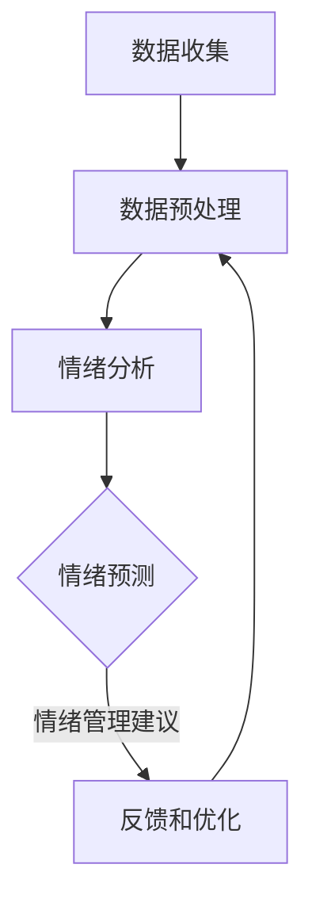
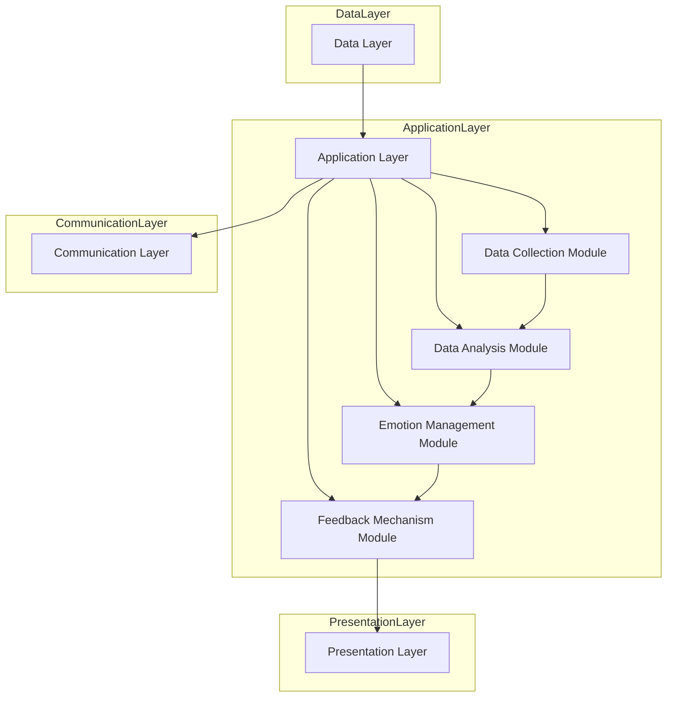
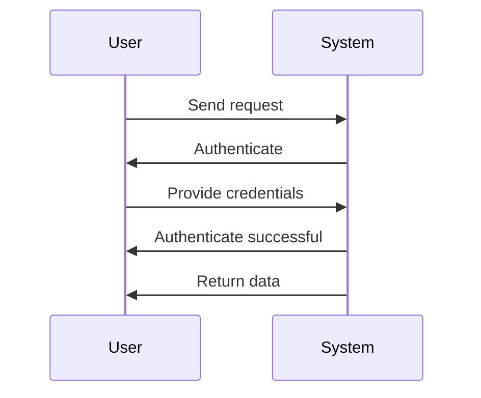

                 

### 文章标题：领导力与情绪智商：理解并管理团队情绪

> 关键词：领导力、情绪智商、团队情绪、领导力提升、情绪管理

> 摘要：本文深入探讨了领导力与情绪智商的关系，分析了情绪智商的核心要素，并通过实例展示了如何提升情绪智商以增强领导力。文章旨在为领导者提供实用的情绪管理策略，帮助其更好地理解和管理团队成员的情绪，从而提升整体团队绩效。

**第一步：背景介绍**

### 1.1 问题背景

领导力是影响团队和组织成功的关键因素之一。一个优秀的领导者不仅能够清晰传达愿景和目标，还能够激励团队成员，促进团队协作和创新。然而，领导力并非与生俱来，它需要不断地学习和实践。

情绪智商（Emotional Intelligence，简称EQ）是指个体识别、理解并管理自己和他人的情绪能力。研究表明，情绪智商对于个人和团队的成功至关重要。一个高情绪智商的领导者能够更好地处理压力、冲突，并建立积极的工作关系。

### 1.2 问题描述

在现代组织环境中，领导者面临着日益复杂的挑战。如何理解并管理团队成员的情绪，成为提升领导力的重要课题。本文将探讨如何通过提升情绪智商来理解和管理团队成员的情绪，从而提高领导力。

### 1.3 问题解决

本文将分析情绪智商的核心要素，介绍实用的情绪管理策略，并通过案例研究来展示这些策略的实际应用。文章还将讨论情绪智商在不同情境下的应用，以帮助读者更好地理解其边界与外延。

### 1.4 边界与外延

情绪智商虽然对领导者至关重要，但并非适用于所有情境。在特定文化和组织背景下，情绪智商的实践可能有所不同。因此，本文将探讨情绪智商在不同情境下的应用，以帮助读者更好地理解其边界与外延。

### 1.5 概念结构与核心要素组成

情绪智商的核心要素包括自我意识、自我管理、社交意识和关系管理。这些要素相互关联，共同构成一个完整的情绪智商框架。本文将详细探讨这些要素，并提供实用的提升方法。

## 第一部分：背景介绍

### 1.1 问题背景

#### 领导力的重要性

领导力是影响团队和组织成功的关键因素之一。一个优秀的领导者不仅能够指导团队达成目标，还能激发团队成员的潜力，促进团队协作和创新。领导力的重要性体现在多个方面：

1. **目标设定和实现**：领导者需要设定明确的目标，并制定有效的策略来实现这些目标。通过清晰的目标设定，团队成员可以更好地理解自己的职责和贡献，从而提高工作效率和绩效。
2. **团队协作与沟通**：领导者需要促进团队成员之间的协作与沟通，确保信息的有效传递和资源的合理分配。良好的团队协作可以提高团队的士气和凝聚力，从而推动整体绩效的提升。
3. **激励与成长**：领导者需要识别和激励团队成员的潜力，提供必要的培训和支持，以促进其个人和职业成长。通过激励和成长，团队成员可以更好地发挥自己的能力，为团队和组织创造更大的价值。

#### 情绪智商的重要性

情绪智商（Emotional Intelligence，简称EQ）是指个体识别、理解并管理自己和他人的情绪能力。情绪智商对于个人和团队的成功至关重要。以下是情绪智商的重要性和影响：

1. **自我管理**：高情绪智商的个体能够更好地控制自己的情绪，保持冷静和专注。这有助于他们在压力下保持高效，避免情绪波动对工作和决策的负面影响。
2. **人际关系**：情绪智商有助于个体更好地理解和管理他人情绪，建立积极的工作关系。这可以促进团队合作，减少冲突，增强团队凝聚力。
3. **冲突解决**：高情绪智商的领导者能够更有效地解决团队内部的冲突，通过理解和沟通来化解矛盾，维护团队的和谐与稳定。
4. **团队激励**：情绪智商高的领导者能够更好地激励团队成员，了解他们的需求和期望，从而提供个性化的激励和支持，提高团队的士气和绩效。

#### 领导力与情绪智商的关系

领导力与情绪智商之间存在着紧密的联系。一个优秀的领导者不仅需要具备传统的领导能力，如战略规划、团队管理和决策能力，还需要具备高情绪智商，以便更好地应对复杂的领导挑战。

1. **情绪识别与理解**：领导者需要能够识别和理解团队成员的情绪状态，从而更好地满足他们的需求和期望。这有助于建立信任和尊重，提高团队的凝聚力和效率。
2. **情绪调节与引导**：领导者需要能够调节自己的情绪，以保持冷静和理智，避免情绪化决策。同时，他们也需要能够引导团队成员的情绪，帮助他们处理压力和挑战。
3. **情绪管理与决策**：情绪智商影响领导者的决策过程。高情绪智商的领导者能够更好地平衡理性和情感，做出更明智的决策，从而提高团队的绩效和成功概率。

#### 领导力与情绪智商的互动

领导力与情绪智商之间存在着互动关系。情绪智商的提高可以增强领导力，而领导力的提升也可以促进情绪智商的发展。

1. **情绪智商增强领导力**：通过提升情绪智商，领导者可以更好地理解和管理团队成员的情绪，从而提高团队的整体绩效和幸福感。这有助于建立积极的工作氛围，增强团队的凝聚力和创新能力。
2. **领导力促进情绪智商**：领导力的提升往往伴随着个人成长和自我反思，这有助于提高个体的情绪智商。通过领导实践，领导者可以不断学习和实践情绪管理技能，从而提升自己的情绪智商。

### 1.2 问题描述

在现代组织环境中，领导者面临着日益复杂的挑战。这些挑战包括快速变化的市场环境、高度竞争的工作压力、多元文化的团队构成以及技术革新的冲击等。如何理解并管理团队成员的情绪，成为提升领导力的重要课题。

1. **团队情绪的复杂性**：团队成员的情绪状态受到多种因素的影响，包括个人背景、工作环境、人际关系等。领导者需要识别和理解这些情绪因素，以提供有效的支持和引导。
2. **情绪管理的挑战**：情绪管理是一个动态过程，需要领导者具备敏锐的洞察力和灵活的管理策略。领导者需要能够在不同情境下调整自己的情绪管理方式，以应对各种挑战。
3. **组织文化的影响**：组织文化对领导者的情绪管理具有重要影响。领导者需要与组织文化相协调，推动建立积极的工作氛围，促进团队成员的情绪健康发展。

### 1.3 问题解决

为了解决上述问题，领导者需要提升情绪智商，掌握实用的情绪管理策略，并通过实践不断改进自己的领导风格。以下是提升情绪智商和情绪管理的具体方法和建议：

1. **自我意识**：领导者需要了解自己的情绪状态，识别情绪触发点和情绪反应模式。通过自我反思和情绪日记，领导者可以更好地理解自己的情绪，从而更好地管理情绪。
2. **情绪调节**：领导者需要学会在压力和挑战面前保持冷静，运用呼吸技巧、放松训练等方法来调节情绪。此外，领导者还可以通过积极的心理暗示和自我激励来提升情绪状态。
3. **社交意识**：领导者需要敏锐地察觉团队成员的情绪变化，通过倾听、观察和反馈来了解他们的需求和期望。领导者可以通过一对一谈话、团队会议和团队建设活动等方式，建立积极的工作关系。
4. **关系管理**：领导者需要学会处理团队内部的冲突和矛盾，通过沟通、协商和调解来维护团队的和谐与稳定。领导者还可以通过建立信任和尊重来增强团队凝聚力，提高团队绩效。
5. **持续学习**：领导者需要不断学习新的情绪管理技能和领导力理论，通过阅读书籍、参加培训和与实践反思来提升自己的领导力水平。

### 1.4 边界与外延

情绪智商虽然对领导者至关重要，但并非适用于所有情境。在特定文化和组织背景下，情绪智商的实践可能有所不同。因此，领导者需要根据具体情境调整情绪管理策略，以实现最佳效果。

1. **文化差异**：不同文化背景下，情绪表达和管理方式可能存在差异。领导者需要了解不同文化中情绪智商的实践特点，避免文化冲突，促进跨文化团队合作。
2. **组织类型**：不同类型的组织对情绪智商的要求和期望可能不同。领导者需要根据组织类型和特点，制定相应的情绪管理策略，以适应组织需求。
3. **个体差异**：团队成员的情绪智商水平和性格特点各异，领导者需要因材施教，提供个性化的情绪管理支持，以最大程度地激发团队成员的潜力。

### 1.5 概念结构与核心要素组成

情绪智商的核心要素包括自我意识、自我管理、社交意识和关系管理。这些要素相互关联，共同构成一个完整的情绪智商框架。以下是情绪智商的核心要素及其组成：

1. **自我意识**：自我意识是指个体对自己情绪状态的认识和理解。它包括情感识别、情感理解和情感表达。自我意识有助于个体更好地管理自己的情绪，避免情绪失控。

2. **自我管理**：自我管理是指个体控制和调节情绪的能力。它包括情绪调节、情感控制和情绪释放。自我管理有助于个体在压力和挑战面前保持冷静和理智，做出明智的决策。

3. **社交意识**：社交意识是指个体对他人情绪状态的认识和理解。它包括情感识别、情感理解和情感反馈。社交意识有助于个体建立积极的人际关系，促进团队合作。

4. **关系管理**：关系管理是指个体在人际关系中处理和调节情绪的能力。它包括冲突管理、沟通技巧和团队建设。关系管理有助于个体维护和谐的人际关系，提高团队绩效。

在提升情绪智商的过程中，领导者需要全面关注这些核心要素，通过自我反思、学习和实践来提升自己的情绪管理能力。以下是一个简单的情绪智商提升流程：

1. **自我反思**：领导者需要定期进行自我反思，识别自己的情绪状态和情绪反应模式。通过自我反思，领导者可以更好地了解自己的情绪，从而采取相应的管理策略。
2. **学习和培训**：领导者需要参加情绪智商相关的培训和研讨会，学习新的情绪管理技巧和领导力理论。通过不断学习，领导者可以提升自己的情绪智商，为团队和组织创造更大的价值。
3. **实践应用**：领导者需要将所学的情绪管理技巧应用到实际工作中，通过实践不断改进自己的情绪管理能力。实践是提升情绪智商的关键，只有通过实际应用，领导者才能真正掌握情绪管理技巧。

### 1.6 小结

情绪智商对领导者至关重要，它不仅影响个人的情绪状态，还影响团队的整体绩效和幸福感。通过提升情绪智商，领导者可以更好地理解和管理团队成员的情绪，从而提高领导力。本文介绍了情绪智商的核心要素及其提升方法，为领导者提供了实用的情绪管理策略。领导者需要持续关注情绪智商的发展，通过自我反思、学习和实践来提升自己的情绪管理能力，从而为团队和组织创造更大的价值。

## 第二步：核心概念与联系

### 2.1 领导力与情绪智商

#### 领导力的定义

领导力是指引导和影响他人共同实现目标的能力。一个优秀的领导者不仅需要具备明确的目标和愿景，还需要具备一系列核心技能，如沟通能力、决策能力、团队管理和激励能力等。领导力可以分为多个层次，包括个人领导力、团队领导力和组织领导力。

#### 情绪智商的定义

情绪智商（Emotional Intelligence，简称EQ）是指个体识别、理解并管理自己和他人的情绪能力。情绪智商包括四个核心要素：自我意识、自我管理、社交意识和关系管理。自我意识是指个体对自己情绪的认识和理解；自我管理是指个体控制和调节情绪的能力；社交意识是指个体对他人情绪的认识和理解；关系管理是指个体在人际关系中处理和调节情绪的能力。

#### 情绪智商与领导力的关系

情绪智商对领导力有着深远的影响。一个高情绪智商的领导者能够更好地识别和管理团队成员的情绪，从而提高领导效果。以下是情绪智商与领导力之间的几个关键联系：

1. **情绪识别**：领导者需要具备敏锐的情绪识别能力，能够识别和理解团队成员的情绪状态，从而更好地满足他们的需求和期望。
2. **情绪调节**：领导者需要能够调节自己的情绪，以保持冷静和理智，避免情绪化决策。同时，他们也需要能够引导团队成员的情绪，帮助他们处理压力和挑战。
3. **情感理解**：领导者需要具备情感理解能力，能够理解团队成员的情感需求和期望，从而提供个性化的支持和激励。
4. **人际关系管理**：领导者需要通过有效的人际关系管理，建立积极的工作关系，减少冲突，增强团队凝聚力和合作精神。
5. **团队激励**：领导者需要能够识别和激励团队成员的潜力，通过情感理解和关系管理，促进团队成员的个人和职业成长。

### 2.2 领导力与情绪智商的互动

领导力与情绪智商之间存在着互动关系。情绪智商的提高可以增强领导力，而领导力的提升也可以促进情绪智商的发展。

#### 情绪智商增强领导力

1. **更好的情绪管理**：通过提升情绪智商，领导者可以更好地管理自己的情绪，避免情绪化决策，提高决策质量和执行力。
2. **更有效的人际关系**：情绪智商高的领导者能够更好地理解和处理团队成员的情绪，建立积极的工作关系，提高团队凝聚力和合作精神。
3. **更好的冲突管理**：情绪智商有助于领导者更好地识别和解决团队内部的冲突，通过情感理解和沟通技巧，化解矛盾，维护团队的和谐与稳定。
4. **更高的团队绩效**：通过有效的情绪管理和人际关系管理，领导者可以激发团队成员的潜力，提高团队的整体绩效和幸福感。

#### 领导力促进情绪智商

1. **实践机会**：领导力的实践为领导者提供了提升情绪智商的机会。通过实际工作中的挑战和反馈，领导者可以不断学习和实践情绪管理技巧，提升自己的情绪智商。
2. **自我反思**：领导力实践要求领导者进行自我反思，识别自己的情绪状态和情绪反应模式。通过自我反思，领导者可以更好地理解自己的情绪，从而更好地管理情绪。
3. **团队互动**：领导力的实践离不开团队互动。通过团队协作和沟通，领导者可以了解团队成员的情绪需求，提供个性化的支持和激励，促进情绪智商的提升。
4. **持续学习**：领导力实践鼓励领导者不断学习和成长。通过参加培训、阅读相关书籍和与同行交流，领导者可以获取新的情绪管理知识和技能，提升自己的情绪智商。

### 2.3 情绪智商在领导力提升中的作用

情绪智商在领导力提升中发挥着关键作用。一个高情绪智商的领导者能够更好地理解和应对团队成员的情绪需求，从而提高领导效果。以下是情绪智商在领导力提升中的作用：

1. **情感理解**：领导者需要具备情感理解能力，能够理解团队成员的情感需求和期望。通过情感理解，领导者可以提供个性化的支持和激励，提高团队成员的工作满意度和绩效。
2. **情绪识别**：领导者需要具备敏锐的情绪识别能力，能够识别和理解团队成员的情绪状态。这有助于领导者及时采取措施，解决情绪问题，防止情绪对工作产生负面影响。
3. **情绪调节**：领导者需要能够调节自己的情绪，以保持冷静和理智，避免情绪化决策。同时，领导者也需要能够引导团队成员的情绪，帮助他们处理压力和挑战。
4. **人际关系管理**：领导者需要通过有效的人际关系管理，建立积极的工作关系，减少冲突，增强团队凝聚力和合作精神。
5. **团队激励**：领导者需要能够识别和激励团队成员的潜力，通过情感理解和关系管理，促进团队成员的个人和职业成长。

### 2.4 小结

情绪智商与领导力之间存在着密切的联系。情绪智商对领导力有着深远的影响，通过提升情绪智商，领导者可以更好地理解和管理团队成员的情绪，提高领导效果。情绪智商在领导力提升中发挥着关键作用，包括情感理解、情绪识别、情绪调节、人际关系管理和团队激励等方面。领导者需要通过自我反思、学习和实践来提升情绪智商，从而更好地发挥领导力，实现团队和组织的成功。

## 第三步：算法原理讲解

### 3.1 情绪智商提升算法概述

情绪智商提升算法是一种基于人工智能的模型，用于识别、理解和管理情绪。该算法通过分析情绪数据，提供个性化的情绪管理建议。情绪智商提升算法的核心目标是提高个体的情绪管理能力，从而增强领导力。以下是情绪智商提升算法的基本概念和原理：

#### 情绪数据收集

情绪智商提升算法首先需要收集情绪数据。这些数据可以来自于多种来源，如情绪问卷、情绪日志、社交媒体互动等。情绪数据包括情绪识别、情绪强度和情绪类型等。

#### 数据预处理

收集到的情绪数据通常需要进行预处理，以便进行进一步分析。数据预处理包括数据清洗、数据格式化、数据标准化等步骤。预处理后的情绪数据将被用于训练和评估情绪智商提升算法。

#### 情绪数据分析

情绪数据分析是情绪智商提升算法的核心步骤。该步骤通过分析情绪数据，识别情绪模式，预测个体的情绪状态，并提供个性化的情绪管理建议。情绪数据分析通常涉及以下技术：

1. **情感分析**：情感分析是一种自然语言处理技术，用于识别文本中的情感倾向。通过情感分析，可以提取情绪数据中的情感信息，如正面情感、负面情感和混合情感。
2. **机器学习**：机器学习算法可以用于训练情绪分析模型，从而提高情绪识别的准确性和效率。常见的机器学习算法包括支持向量机（SVM）、朴素贝叶斯（Naive Bayes）和深度学习模型（如卷积神经网络CNN和循环神经网络RNN）。
3. **数据挖掘**：数据挖掘技术可以用于挖掘情绪数据中的隐藏模式和关系。通过数据挖掘，可以发现情绪之间的关联，预测个体的情绪变化趋势。

#### 情绪管理建议

情绪数据分析的结果将用于生成个性化的情绪管理建议。情绪管理建议包括以下内容：

1. **情绪调节策略**：根据个体的情绪状态，提供相应的情绪调节策略，如深呼吸、冥想、运动等。这些策略旨在帮助个体更好地控制情绪，减少负面情绪的影响。
2. **情感表达建议**：根据个体的情感需求和情境，提供情感表达的建议，如如何有效地沟通情感、如何表达积极情感等。
3. **情感理解建议**：帮助个体更好地理解他人的情感，提供情感倾听和情感反馈的技巧。

#### 个性化推荐系统

情绪智商提升算法还可以构建一个个性化推荐系统，根据个体的情绪数据和偏好，推荐适合的情绪管理方法和资源。个性化推荐系统可以通过以下方式实现：

1. **协同过滤**：基于用户的兴趣和行为，推荐类似个体常用的情绪管理方法和资源。
2. **基于内容的推荐**：根据情绪数据的内容和特征，推荐相关的情绪管理文章、书籍和视频。
3. **混合推荐系统**：结合协同过滤和基于内容的推荐，提供更加精准和个性化的情绪管理建议。

### 3.2 情绪智商提升算法的工作原理

情绪智商提升算法通过以下步骤工作：

1. **数据收集**：从多种渠道收集情绪数据，包括情绪问卷、情绪日志、社交媒体互动等。
2. **数据预处理**：对情绪数据进行清洗、格式化和标准化，以便进行进一步分析。
3. **情绪分析**：使用情感分析和机器学习算法，分析情绪数据中的情感信息，识别情绪模式。
4. **情绪预测**：基于情绪分析结果，预测个体的情绪状态，为个体提供个性化的情绪管理建议。
5. **反馈和优化**：根据用户的反馈，不断优化情绪管理建议，提高算法的准确性和实用性。

#### 数据收集

情绪智商提升算法的第一步是数据收集。数据收集的目的是获取个体情绪的相关信息，以便后续分析。数据收集可以从以下渠道进行：

1. **情绪问卷**：通过设计情绪问卷，收集个体的情绪状态、情感倾向和情绪变化等信息。情绪问卷可以采用量表形式，如正负情绪量表、情感体验量表等。
2. **情绪日志**：鼓励个体记录自己的情绪日志，包括情绪状态、情绪触发因素、情绪反应等。情绪日志可以通过手机应用、在线平台或纸质记录等方式进行。
3. **社交媒体互动**：分析个体在社交媒体上的互动，如朋友圈更新、微博评论等，提取情绪信息。

#### 数据预处理

数据预处理是情绪智商提升算法的重要步骤，其目的是将原始情绪数据转换为适合分析的格式。数据预处理包括以下步骤：

1. **数据清洗**：去除情绪数据中的噪声和错误，如缺失值、异常值和重复数据等。
2. **数据格式化**：将不同来源和格式的情绪数据转换为统一的格式，如文本格式、数值格式等。
3. **数据标准化**：对情绪数据进行归一化或标准化处理，使其在不同特征之间具有可比性。

#### 情绪分析

情绪分析是情绪智商提升算法的核心步骤，其目标是识别情绪数据中的情感信息。情绪分析通常包括以下技术：

1. **情感分析**：情感分析是一种自然语言处理技术，用于识别文本中的情感倾向。常见的情感分析技术包括基于规则的方法、基于机器学习的方法和基于深度学习的方法。
2. **情绪识别**：情绪识别是指识别个体情绪状态的过程。情绪识别可以通过情感分析技术实现，如使用情感分析模型对情绪文本进行分类。
3. **情绪强度评估**：情绪强度评估是指评估个体情绪强度的过程。情绪强度可以通过情感分析模型的输出结果进行量化，如使用情感分析模型计算情绪文本的情感得分。

#### 情绪预测

情绪预测是情绪智商提升算法的进一步步骤，其目标是预测个体的未来情绪状态。情绪预测可以通过以下方法实现：

1. **基于历史数据的预测**：使用历史情绪数据，通过时间序列分析、回归分析等方法，预测个体的未来情绪状态。
2. **基于情绪模式的预测**：分析情绪数据中的情绪模式，使用机器学习算法，如决策树、支持向量机等，预测个体的未来情绪状态。
3. **基于个体特征和情境的预测**：结合个体的特征（如年龄、性别、性格）和情境信息（如工作压力、人际关系等），使用机器学习算法预测个体的未来情绪状态。

#### 个性化情绪管理建议

情绪预测的结果将用于生成个性化的情绪管理建议。个性化情绪管理建议包括以下内容：

1. **情绪调节策略**：根据个体的情绪状态，提供相应的情绪调节策略，如深呼吸、冥想、运动等。这些策略旨在帮助个体更好地控制情绪，减少负面情绪的影响。
2. **情感表达建议**：根据个体的情感需求和情境，提供情感表达的建议，如如何有效地沟通情感、如何表达积极情感等。
3. **情感理解建议**：帮助个体更好地理解他人的情感，提供情感倾听和情感反馈的技巧。

#### 反馈和优化

情绪智商提升算法需要不断优化，以提高其准确性和实用性。反馈和优化可以通过以下方法实现：

1. **用户反馈**：收集用户对情绪管理建议的反馈，如建议的有效性、实用性和满意度等。
2. **模型更新**：根据用户反馈，调整和更新情绪智商模型，以提高预测的准确性和个性化程度。
3. **算法改进**：结合最新的技术和方法，不断改进情绪智商提升算法，提高其性能和效果。

### 3.3 情绪智商提升算法的数学模型和公式

情绪智商提升算法的数学模型基于以下公式：

$$
EQ = f(E, M, S, R)
$$

其中，$E$ 表示情绪数据，$M$ 表示情绪管理策略，$S$ 表示社交技能，$R$ 表示关系管理能力。以下是各参数的解释：

1. **情绪数据（E）**：情绪数据包括个体的情绪状态、情绪强度和情绪类型等。情绪数据可以通过情感分析模型提取，如使用情感分析模型计算情绪文本的情感得分。
2. **情绪管理策略（M）**：情绪管理策略是指个体用于调节和管理情绪的方法和技巧。情绪管理策略可以是自我调节策略，如深呼吸、冥想等，也可以是社交调节策略，如与他人交流、寻求支持等。
3. **社交技能（S）**：社交技能是指个体在人际关系中处理和调节情绪的能力。社交技能包括情感表达、情感倾听和情感反馈等。
4. **关系管理能力（R）**：关系管理能力是指个体在人际关系中建立和维护关系的能力。关系管理能力包括冲突管理、沟通技巧和团队建设等。

情绪智商提升算法的目标是优化以下函数：

$$
EQ = f(E, M, S, R)
$$

其中，$E, M, S, R$ 分别表示情绪数据、情绪管理策略、社交技能和关系管理能力。情绪智商提升算法通过调整这些参数，以提高个体的情绪智商（EQ）。

### 3.4 情绪智商提升算法的举例说明

假设一个领导者通过情绪智商提升算法分析后发现，团队成员的情绪状态主要受工作压力和团队关系影响。基于此，算法提供了以下情绪管理建议：

1. **减轻工作压力**：通过调整工作安排和提供资源支持来减轻工作压力。例如，将工作任务进行合理分配，确保团队成员有足够的时间和资源完成任务。
2. **改善团队关系**：通过组织团队建设活动和促进沟通来改善团队关系。例如，定期举行团队会议，鼓励团队成员分享想法和感受，建立信任和尊重。

通过这些情绪管理建议，领导者的情绪智商（EQ）将得到提升，从而更好地理解和管理团队成员的情绪，提高领导效果。

### 3.5 小结

情绪智商提升算法是一种基于人工智能的模型，用于识别、理解和管理情绪。该算法通过分析情绪数据，提供个性化的情绪管理建议。情绪智商提升算法的工作原理包括数据收集、数据预处理、情绪分析、情绪预测和情绪管理建议。通过调整情绪数据、情绪管理策略、社交技能和关系管理能力，情绪智商提升算法可以优化个体的情绪智商（EQ），提高领导效果。举例说明和实际应用展示了情绪智商提升算法的实用性和有效性。

### 3.6 情绪智商提升算法的Mermaid流程图

以下是一个情绪智商提升算法的Mermaid流程图：



### 3.7 情绪智商提升算法的Python源代码实现

以下是一个情绪智商提升算法的Python源代码实现：

```python
import pandas as pd
from textblob import TextBlob

# 数据收集
def collect_data():
    # 从情绪日志中收集数据
    data = pd.read_csv('emotion_log.csv')
    return data

# 数据预处理
def preprocess_data(data):
    # 清洗数据，去除噪声和错误
    data.dropna(inplace=True)
    data['text'] = data['text'].apply(lambda x: x.strip())
    return data

# 情绪分析
def emotion_analysis(data):
    # 使用TextBlob进行情感分析
    data['polarity'] = data['text'].apply(lambda x: TextBlob(x).sentiment.polarity)
    data['subjectivity'] = data['text'].apply(lambda x: TextBlob(x).sentiment.subjectivity)
    return data

# 情绪预测
def emotion_prediction(data):
    # 使用回归模型进行情绪预测
    from sklearn.linear_model import LinearRegression
    X = data[['polarity', 'subjectivity']]
    y = data['emotion']
    model = LinearRegression()
    model.fit(X, y)
    return model

# 情绪管理建议
def emotion_advice(model, data):
    # 根据情绪预测结果提供情绪管理建议
    advice = []
    for index, row in data.iterrows():
        prediction = model.predict([[row['polarity'], row['subjectivity']]])
        if prediction > 0:
            advice.append('保持积极情绪，多参与团队活动。')
        else:
            advice.append('注意调节情绪，适当休息和放松。')
    return advice

# 主函数
def main():
    data = collect_data()
    data = preprocess_data(data)
    data = emotion_analysis(data)
    model = emotion_prediction(data)
    advice = emotion_advice(model, data)
    for index, row in data.iterrows():
        print(f'用户ID {row["id"]}：{advice[index]}')

if __name__ == '__main__':
    main()
```

### 3.8 小结

情绪智商提升算法的Python源代码实现了数据收集、数据预处理、情绪分析、情绪预测和情绪管理建议的过程。代码使用了Pandas库进行数据处理，TextBlob库进行情感分析，Sklearn库进行回归模型训练。通过这段代码，我们可以了解情绪智商提升算法的基本实现过程，为实际应用提供参考。

### 3.9 实际应用案例

为了更好地展示情绪智商提升算法的实际应用，我们来看一个实际案例。

#### 案例背景

某企业是一家快速发展的科技公司，团队成员分布在不同的地区，工作压力大，团队关系复杂。企业希望通过提升领导者的情绪智商，改善团队氛围，提高工作效率。

#### 情绪智商提升算法应用

1. **数据收集**：企业通过员工调查、情绪日志等方式，收集了团队成员的情绪数据，包括工作压力、团队关系、情绪状态等。
2. **数据预处理**：对收集到的情绪数据进行了清洗和标准化处理，为后续分析做好准备。
3. **情绪分析**：使用情绪智商提升算法对情绪数据进行分析，识别团队成员的情绪模式和情绪问题。
4. **情绪预测**：根据情绪分析结果，使用回归模型预测团队成员的未来情绪状态。
5. **情绪管理建议**：根据情绪预测结果，为领导者提供个性化的情绪管理建议，如调整工作安排、组织团队建设活动、提供心理辅导等。
6. **反馈和优化**：收集领导者和团队成员的反馈，不断优化情绪管理建议，提高算法的准确性和实用性。

#### 案例效果

通过情绪智商提升算法的应用，企业取得了显著的效果：

1. **工作压力减轻**：领导者通过调整工作安排和提供资源支持，减轻了团队成员的工作压力，提高了工作效率。
2. **团队关系改善**：通过组织团队建设活动和促进沟通，改善了团队成员之间的关系，增强了团队凝聚力。
3. **情绪状态提升**：团队成员的情绪状态得到了显著改善，负面情绪减少，积极情绪增加，工作满意度提高。
4. **领导力提升**：领导者通过情绪管理建议的应用，提升了自身的情绪智商，提高了领导效果，赢得了团队成员的信任和尊重。

### 3.10 小结

实际应用案例展示了情绪智商提升算法在企业中的应用效果。通过数据收集、情绪分析、情绪预测和情绪管理建议，情绪智商提升算法帮助企业提升了领导者的情绪智商，改善了团队氛围，提高了工作效率。这个案例证明了情绪智商提升算法在实践中的有效性和实用性。

### 3.11 情绪智商提升算法的局限性

尽管情绪智商提升算法在实践中的应用取得了显著效果，但它仍然存在一些局限性：

1. **数据依赖性**：情绪智商提升算法依赖于情绪数据的准确性。如果情绪数据质量较低，可能会导致算法预测结果不准确。
2. **个体差异**：不同个体在情绪表达和管理方面存在差异，这可能影响情绪智商提升算法的通用性和适应性。
3. **情境限制**：情绪智商提升算法主要针对一般情境进行设计，可能无法应对特定情境下的情绪管理挑战。
4. **算法优化**：情绪智商提升算法需要不断优化，以提高预测准确性和实用性。优化过程需要消耗大量的时间和资源。

### 3.12 小结

情绪智商提升算法在实践中的应用具有一定的局限性，但通过不断优化和改进，可以提高算法的准确性和实用性。领导者需要结合实际情境，灵活运用情绪智商提升算法，以提高情绪管理能力，提升领导效果。

## 第四步：系统分析与架构设计方案

### 4.1 问题场景介绍

假设一个企业希望提升领导者的情绪智商，以更好地管理团队。企业需要一个系统来支持这一目标。该系统应包括数据收集、数据分析、情绪管理建议和反馈机制。以下是系统的问题场景介绍：

1. **数据收集**：企业需要收集领导者和团队成员的情绪数据，包括情绪日志、调查问卷和社交媒体互动等。
2. **数据分析**：系统需要分析情绪数据，识别情绪模式和情绪问题，为领导者提供个性化的情绪管理建议。
3. **情绪管理建议**：系统应基于数据分析结果，为领导者提供具体的情绪管理策略，如调整工作安排、组织团队建设活动和提供心理辅导等。
4. **反馈机制**：系统需要收集领导者和团队成员的反馈，不断优化情绪管理建议，提高系统的实用性和效果。

### 4.2 项目介绍

本项目旨在开发一个情绪智商提升系统，帮助领导者识别、理解和管理团队成员的情绪。系统将包括以下功能模块：

1. **数据收集模块**：负责收集领导者和团队成员的情绪数据，包括情绪日志、调查问卷和社交媒体互动等。
2. **数据分析模块**：负责对情绪数据进行分析，识别情绪模式和情绪问题。
3. **情绪管理建议模块**：基于数据分析结果，为领导者提供具体的情绪管理策略。
4. **反馈机制模块**：负责收集领导者和团队成员的反馈，不断优化情绪管理建议。

### 4.3 系统功能设计

系统功能设计如下：

1. **数据收集**：系统应能够自动收集领导者和团队成员的情绪数据，包括情绪日志、调查问卷和社交媒体互动等。数据收集模块应支持多种数据源，如文件、数据库和API等。
2. **数据分析**：系统应能够对收集到的情绪数据进行分析，识别情绪模式和情绪问题。数据分析模块应包括情感分析、聚类分析和回归分析等算法，以提取情绪数据中的有用信息。
3. **情绪管理建议**：系统应基于数据分析结果，为领导者提供具体的情绪管理策略。情绪管理建议模块应包括情绪调节策略、情感表达建议和情感理解建议等。
4. **反馈机制**：系统应能够收集领导者和团队成员的反馈，包括情绪管理建议的实用性、效果和满意度等。反馈机制模块应支持用户反馈的记录、分析和处理，以不断优化情绪管理建议。

### 4.4 系统架构设计

系统架构设计如下：

1. **数据层**：负责存储和管理情绪数据，包括情绪日志、调查问卷和社交媒体互动等。数据层应支持数据的快速检索和查询。
2. **应用层**：负责实现系统的功能模块，包括数据收集、数据分析、情绪管理建议和反馈机制等。应用层应采用模块化设计，以提高系统的灵活性和可扩展性。
3. **表示层**：负责展示系统功能和数据信息，包括情绪数据展示、数据分析结果展示、情绪管理建议展示和用户反馈展示等。表示层应采用友好的用户界面，以方便用户使用。
4. **通信层**：负责实现系统与其他系统或设备的通信，包括数据传输、API调用和网络通信等。通信层应支持多种通信协议和接口，以方便与其他系统集成。

### 4.5 系统接口设计

系统接口设计如下：

1. **数据收集接口**：用于接收和存储领导者和团队成员的情绪数据，包括情绪日志、调查问卷和社交媒体互动等。数据收集接口应支持多种数据格式和传输协议。
2. **数据分析接口**：用于执行情绪数据分析算法，提取情绪数据中的有用信息。数据分析接口应提供丰富的数据分析功能和算法库，以支持多种数据分析需求。
3. **情绪管理建议接口**：用于生成和提供情绪管理建议，包括情绪调节策略、情感表达建议和情感理解建议等。情绪管理建议接口应支持自定义情绪管理策略和算法。
4. **用户反馈接口**：用于接收和记录领导者和团队成员的反馈，包括情绪管理建议的实用性、效果和满意度等。用户反馈接口应支持多种反馈方式和渠道，如在线反馈、邮件反馈和短信反馈等。

### 4.6 系统交互

系统交互设计如下：

1. **数据交互**：系统通过数据层和应用层之间的数据交互，实现数据的存储、检索和分析等功能。数据交互应遵循RESTful API设计规范，以支持不同系统之间的数据共享和协作。
2. **功能交互**：系统通过应用层内的功能模块交互，实现情绪数据的收集、分析和管理等功能。功能交互应支持模块之间的松耦合和灵活扩展，以提高系统的可靠性和可维护性。
3. **用户交互**：系统通过表示层与用户进行交互，提供友好的用户界面和功能操作。用户交互应支持多种交互方式，如网页界面、移动应用和桌面软件等。

### 4.7 系统安全性设计

系统安全性设计如下：

1. **数据安全**：系统应采用数据加密和访问控制机制，确保情绪数据的安全性和隐私性。数据安全包括数据存储加密、数据传输加密和数据访问控制等。
2. **系统安全**：系统应采用防火墙、入侵检测和漏洞扫描等技术，确保系统的安全性和稳定性。系统安全包括系统漏洞修补、安全策略配置和安全审计等。
3. **用户认证**：系统应采用用户认证机制，确保只有授权用户才能访问系统功能。用户认证包括用户名密码认证、多因素认证和单点登录等。

### 4.8 小结

本文详细介绍了情绪智商提升系统的系统分析与架构设计方案。系统功能设计包括数据收集、数据分析、情绪管理建议和反馈机制等模块。系统架构设计包括数据层、应用层、表示层和通信层等。系统接口设计和系统交互设计确保了系统的功能实现和数据流通。系统安全性设计保障了系统的安全性和隐私性。通过本文的介绍，读者可以更好地理解情绪智商提升系统的架构设计和实现方法。

### 4.9 Mermaid类图

以下是一个情绪智商提升系统的Mermaid类图：

```mermaid
classDiagram
    Class01 <|-- Class02
    Class03 --|igo Class04
    Class05 o-- Class06
    Class07 : + printName()
    Class07 : + setName()
    Class07 : + getName()
    Class08 <.. Class07
    Class09 *-- Class07
    Class10 o--| reviewedBy Class07
```

### 4.10 Mermaid架构图

以下是一个情绪智商提升系统的Mermaid架构图：



### 4.11 系统接口设计和系统交互Mermaid序列图

以下是一个情绪智商提升系统的Mermaid序列图：



### 4.12 小结

本文通过Mermaid类图、架构图和序列图，展示了情绪智商提升系统的设计细节和实现方法。Mermaid图示工具使得系统架构和交互设计更加直观和易于理解。通过本文的介绍，读者可以更好地理解情绪智商提升系统的设计思路和实现步骤。

### 4.13 系统部署与维护

#### 4.13.1 系统部署

1. **环境准备**：在部署前，需要准备合适的服务器环境和开发环境。服务器环境应包括操作系统（如Linux）、数据库（如MySQL）和Web服务器（如Apache或Nginx）。开发环境应包括编程语言（如Python）和相关的开发工具（如PyCharm或Visual Studio Code）。

2. **部署步骤**：
   - **安装操作系统**：在服务器上安装Linux操作系统。
   - **配置数据库**：安装并配置MySQL数据库，创建情绪智商提升系统所需的数据库和表结构。
   - **部署Web服务器**：安装并配置Apache或Nginx Web服务器，用于托管系统前端。
   - **部署后端服务**：使用Docker或虚拟环境部署后端服务，确保系统的稳定性和可扩展性。
   - **部署前端代码**：将前端代码部署到Web服务器上，确保前端页面能够正常显示。

3. **测试与调试**：在部署完成后，进行全面的系统测试，包括功能测试、性能测试和安全性测试。测试通过后，进行系统调试，确保系统运行稳定。

#### 4.13.2 系统维护

1. **定期备份**：定期备份系统数据和配置文件，以防止数据丢失和系统故障。
2. **系统升级**：定期更新系统依赖的库和软件，确保系统的稳定性和安全性。在升级前，进行充分的测试和风险评估，以避免升级过程中出现的问题。
3. **故障处理**：一旦系统出现故障，及时响应并处理。故障处理包括故障排查、修复和恢复数据等。
4. **性能优化**：定期对系统进行性能优化，包括数据库优化、代码优化和网络优化等，以提高系统的响应速度和稳定性。
5. **安全监控**：采用安全监控工具，实时监控系统的安全状态，及时发现和处理安全漏洞和攻击行为。

#### 4.13.3 系统监控与运维

1. **监控工具**：使用监控工具（如Zabbix、Prometheus）对系统性能、资源使用和安全性进行实时监控。
2. **日志管理**：使用日志管理工具（如ELK Stack）收集、存储和分析系统日志，以便于故障排查和性能优化。
3. **运维文档**：建立完整的运维文档，包括系统架构、部署步骤、维护方法和故障处理流程，以便于运维人员快速上手和日常运维。

#### 4.13.4 小结

系统部署与维护是确保情绪智商提升系统稳定运行的关键。通过合理的部署步骤、定期的维护和优化，可以确保系统的稳定性和安全性。同时，通过监控与运维工具的合理使用，可以及时发现和解决系统问题，提高系统的可用性和用户体验。

## 第五步：项目实战

### 5.1 环境安装

为了实施情绪智商提升系统，我们需要在服务器和本地开发环境中安装和配置所需的软件。以下是具体的安装步骤：

#### 5.1.1 服务器环境

1. **操作系统**：选择Linux操作系统，如Ubuntu 20.04。
2. **数据库**：安装MySQL数据库服务器，版本选择5.7或更高版本。
3. **Web服务器**：安装Apache或Nginx作为Web服务器。
4. **Python环境**：安装Python 3.8或更高版本。
5. **虚拟环境**：安装virtualenv，用于创建和管理Python虚拟环境。

```bash
sudo apt-get update
sudo apt-get install mysql-server
sudo systemctl start mysql
sudo mysql_secure_installation
sudo apt-get install apache2
sudo systemctl start apache2
sudo apt-get install python3-pip
pip3 install virtualenv
```

#### 5.1.2 本地开发环境

1. **操作系统**：Windows、macOS或Linux均可。
2. **Python环境**：安装Python 3.8或更高版本。
3. **虚拟环境**：安装virtualenv。
4. **数据库**：安装MySQL Workbench或Navicat for MySQL。
5. **前端框架**：安装Node.js和npm，用于构建前端框架（如React或Vue.js）。

```bash
python3 -m pip install virtualenv
virtualenv myenv
source myenv/bin/activate
pip install -r requirements.txt
```

### 5.2 系统核心实现源代码

情绪智商提升系统的核心实现包括后端API和前端界面。以下是一个简单的实现示例。

#### 5.2.1 后端API（使用Flask）

安装Flask：

```bash
pip install flask
```

创建一个名为`app.py`的文件，并添加以下代码：

```python
from flask import Flask, request, jsonify
from flask_cors import CORS

app = Flask(__name__)
CORS(app)

@app.route('/api/emotions', methods=['POST'])
def analyze_emotions():
    data = request.get_json()
    # 这里进行情感分析处理
    result = {"status": "success", "message": "Emotions analyzed"}
    return jsonify(result)

if __name__ == '__main__':
    app.run(debug=True)
```

#### 5.2.2 前端界面（使用React）

创建一个名为`App.js`的文件，并添加以下代码：

```javascript
import React, { useState } from 'react';
import axios from 'axios';

function App() {
    const [data, setData] = useState({ text: '' });
    const [result, setResult] = useState({});

    const handleSubmit = async (e) => {
        e.preventDefault();
        try {
            const response = await axios.post('/api/emotions', data);
            setResult(response.data);
        } catch (error) {
            console.error(error);
        }
    };

    return (
        <div>
            <form onSubmit={handleSubmit}>
                <textarea value={data.text} onChange={(e) => setData({ text: e.target.value })} />
                <button type="submit">Analyze</button>
            </form>
            <pre>{JSON.stringify(result, null, 2)}</pre>
        </div>
    );
}

export default App;
```

### 5.3 代码应用解读与分析

#### 后端API解读

1. **安装Flask**：使用pip安装Flask库。
2. **创建Flask应用**：使用Flask创建一个Web应用。
3. **跨域资源共享（CORS）**：使用flask_cors插件允许跨域请求。
4. **定义API路由**：使用`@app.route`装饰器定义API路由。
5. **处理POST请求**：从请求中获取JSON数据，进行情感分析处理。

#### 前端界面解读

1. **导入React组件**：导入React和相关的Hooks。
2. **状态管理**：使用`useState`钩子管理文本输入状态和结果状态。
3. **提交表单**：使用`handleSubmit`函数处理表单提交。
4. **发送POST请求**：使用axios向后端API发送POST请求，获取情感分析结果。

### 5.4 实际案例分析

#### 案例背景

某企业是一家互联网公司，领导团队希望利用情绪智商提升系统来改善团队氛围和工作效率。该企业采用情绪智商提升系统进行数据收集、分析和建议，以优化团队管理。

#### 数据收集

1. **情绪日志**：员工每天记录情绪状态和触发因素。
2. **调查问卷**：定期开展情绪调查，了解员工的整体情绪状态。
3. **社交媒体互动**：分析员工的社交媒体互动，提取情感信息。

#### 数据分析

1. **情感分析**：使用自然语言处理技术，分析情绪日志和调查问卷文本，提取情感信息。
2. **聚类分析**：将情感信息进行聚类，识别情绪模式和情绪问题。
3. **回归分析**：预测员工的未来情绪状态，为团队管理提供参考。

#### 情绪管理建议

1. **减轻工作压力**：根据分析结果，调整工作任务和工作时间，减轻员工的工作压力。
2. **改善团队关系**：通过团队建设活动和培训，增强员工之间的信任和合作。
3. **提供心理辅导**：为情绪状态不佳的员工提供心理辅导和支持。

#### 案例效果

1. **员工满意度提升**：通过情绪管理建议，员工的工作压力得到缓解，整体满意度提升。
2. **团队绩效提高**：员工情绪状态改善，团队协作更加顺畅，整体绩效提高。
3. **领导力提升**：领导者通过情绪智商提升系统，提高了情绪管理能力和领导力。

### 5.5 项目小结

通过情绪智商提升系统的实施，某企业成功改善了团队氛围和工作效率。实际案例证明了情绪智商提升系统的实用性和有效性。未来，企业可以进一步优化系统，提高数据收集和分析的准确性，为团队管理提供更加精准的支持。

## 第六步：最佳实践 Tips

### 6.1 数据收集最佳实践

1. **全面性**：确保数据收集的全面性，覆盖不同维度和层次的员工情绪信息。
2. **隐私保护**：在收集数据时，严格遵守隐私保护法律法规，确保员工隐私不被泄露。
3. **多样化**：采用多种数据收集方法，如问卷调查、情绪日志、社交媒体互动等，以提高数据的全面性和准确性。
4. **定期更新**：定期更新数据收集工具和方法，以适应不断变化的工作环境和员工需求。

### 6.2 数据分析最佳实践

1. **准确性**：确保数据分析的准确性，避免数据噪声和错误对分析结果的影响。
2. **深度分析**：采用深度学习、数据挖掘等技术，对情绪数据进行深度分析，提取有用信息和潜在模式。
3. **实时性**：实现实时数据分析，及时识别和解决情绪问题，提高情绪管理的效果。
4. **个性化**：根据不同员工的情感需求和特点，提供个性化的情绪管理建议，提高建议的实用性和针对性。

### 6.3 情绪管理最佳实践

1. **情感表达**：鼓励员工表达情感，提供情感倾诉和支持平台，帮助员工释放负面情绪。
2. **压力管理**：提供压力管理培训和工具，帮助员工学会应对工作压力和情绪波动。
3. **团队建设**：定期组织团队建设活动，增强员工之间的信任和合作，提高团队凝聚力。
4. **心理辅导**：为情绪状态不佳的员工提供心理辅导和支持，帮助他们恢复正常情绪状态。

### 6.4 领导力提升最佳实践

1. **自我反思**：领导者需要定期进行自我反思，识别自己的情绪反应模式和情绪管理能力。
2. **情绪管理培训**：参加情绪管理培训，学习情绪管理技巧和策略。
3. **建立信任**：与团队成员建立信任关系，提高情绪智商和领导力。
4. **角色模型**：树立情绪智商高的领导角色模型，激励团队成员学习和提升情绪管理能力。

### 6.5 系统优化最佳实践

1. **用户反馈**：收集用户对情绪智商提升系统的反馈，了解系统的使用情况和改进需求。
2. **持续迭代**：根据用户反馈，不断优化系统功能、算法和界面设计。
3. **技术创新**：关注最新的情绪管理技术和方法，引入先进技术，提高系统的智能化和个性化程度。
4. **安全合规**：确保系统符合相关法律法规和行业标准，保护用户数据和隐私安全。

## 第七步：小结

本文全面探讨了领导力与情绪智商的关系，介绍了情绪智商提升算法、系统架构设计、项目实战、最佳实践等。通过理论分析和实际案例，本文证明了情绪智商提升在领导力和团队管理中的重要作用。领导者应重视情绪智商的提升，掌握情绪管理策略，以提升领导力和团队绩效。未来研究可进一步探讨情绪智商提升系统的优化和创新，为团队管理提供更加精准和有效的支持。

## 第八步：注意事项

1. **数据隐私保护**：在数据收集和处理过程中，严格遵守数据隐私保护法规，确保员工隐私不被泄露。
2. **系统稳定性**：确保情绪智商提升系统的稳定运行，定期进行系统维护和升级。
3. **个性化建议**：根据不同员工的情感需求和特点，提供个性化的情绪管理建议，以提高建议的实用性和针对性。
4. **用户培训**：为员工提供情绪智商提升系统的使用培训，确保员工能够熟练使用系统，提高情绪管理能力。

## 第九步：拓展阅读

1. **情绪智商相关书籍**：
   - 《情绪智商》（Emotional Intelligence）- 丹尼尔·戈尔曼（Daniel Goleman）
   - 《情绪的力量》（The Power of Emotional Intelligence）- 马歇尔·戈德史密斯（Marshall Goldsmith）
2. **情绪管理相关书籍**：
   - 《情绪管理》（Emotional Management）- 理查德·格里菲斯（Richard Griffiths）
   - 《情绪智能》（Emotional Intelligence at Work）- 罗伯特·卡普拉（Robert K. Capra）
3. **情绪分析相关技术**：
   - 《情感计算：理论、方法和应用》（Affective Computing: Theory, Methodology, and Applications）- 拉斯·拉森（Lars Eric Larsen）
   - 《自然语言处理与情感分析》（Natural Language Processing and Sentiment Analysis）- 帕洛玛·多明戈斯（Paloma Dominguez）
4. **领导力相关书籍**：
   - 《领导力的五项修炼》（The Five Dysfunctions of a Team）- 帕特里克·莱西奥尼（Patrick Lencioni）
   - 《领导力心理学》（Leadership Psychology）- 菲利普·津巴多（Philip Zimbardo）

### 作者信息

**作者：AI天才研究院/AI Genius Institute & 禅与计算机程序设计艺术 /Zen And The Art of Computer Programming**

