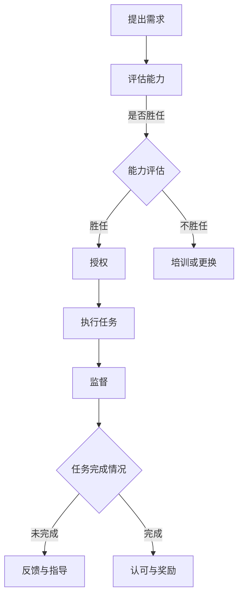
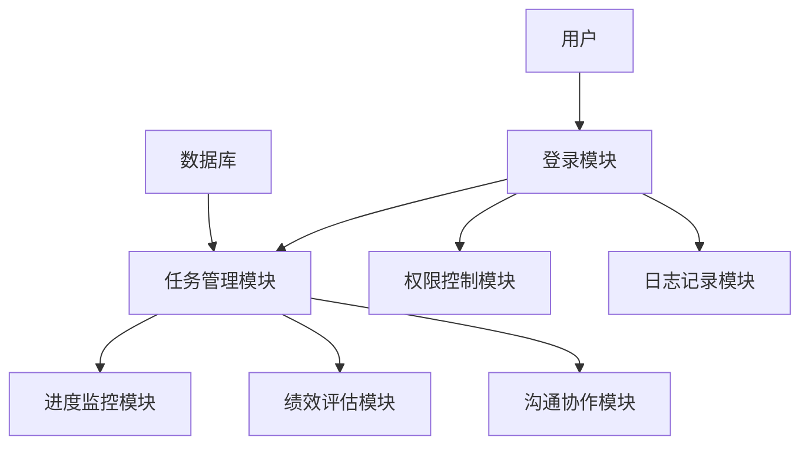
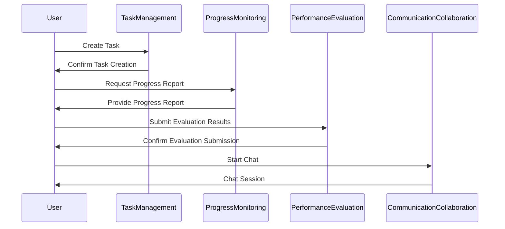

                 

### 背景介绍

领导力与授权：信任与监督的平衡艺术，是一本探讨领导力本质、授权艺术以及信任与监督之间微妙平衡的书籍。在当今快速变化的社会和经济环境中，领导力的重要性日益凸显。有效的领导不仅关乎个人魅力和决策能力，更关乎如何激励团队、授权下属，并在信任与监督之间找到最佳平衡点。

#### 领导力的重要性

领导力是一种复杂而多层次的能力，它不仅包括个人魅力和决策能力，还涉及到人际关系、团队协作、组织管理等方方面面。在快速变化的环境中，领导者需要具备以下能力：

1. **适应能力**：能够迅速适应新的环境和变化，带领团队共同成长。
2. **决策能力**：在面对复杂问题时，能够做出明智的决策，并对决策结果负责。
3. **沟通能力**：能够有效地与团队成员沟通，传达愿景和目标，消除误解和障碍。
4. **激励能力**：能够激发团队成员的积极性和创造力，使团队充满活力。

#### 授权的艺术

授权是指领导者将权力和责任分配给团队成员，使其能够独立决策和行动。授权不仅能够提高团队效率，还能增强团队成员的自信和责任感。然而，授权并非简单的权力下放，而是需要领导者具备以下艺术：

1. **信任**：领导者必须信任团队成员的能力和诚信，这是授权成功的关键。
2. **明确目标**：领导者需要明确团队成员的目标和期望，确保团队成员明确自己的职责和责任。
3. **支持**：领导者需要在团队成员需要时提供必要的支持和资源，帮助他们克服困难。
4. **监督**：尽管信任是授权的核心，但监督仍然必要，以确保团队成员遵循组织目标和价值观。

#### 信任与监督的平衡

在授权过程中，信任与监督的关系是一个关键问题。信任可以减少监督的需要，提高团队效率和协作。然而，如果完全依赖信任，可能会导致团队成员行为失范，影响组织目标的实现。因此，在信任与监督之间找到平衡点至关重要。

1. **适度信任**：领导者需要适度信任团队成员，给予他们一定的自主权，但同时保持一定的监督，以确保团队成员的行为符合组织目标。
2. **透明沟通**：领导者需要建立透明沟通机制，让团队成员了解组织目标和价值观，从而减少误解和矛盾。
3. **反馈机制**：领导者需要建立有效的反馈机制，及时了解团队成员的工作进展，提供必要的指导和帮助。
4. **风险管理**：领导者需要识别潜在的风险，并采取相应的措施进行风险控制，以防止团队成员的行为对组织造成负面影响。

#### 案例分析

在实际工作中，许多领导者都在领导力、授权和信任与监督之间寻找最佳平衡。以下是一个典型的案例：

**案例**：某互联网公司的项目经理李明，带领一个由20名成员组成的项目团队。项目周期紧，任务繁重。李明决定采用授权的方式来提高团队效率。

- **信任**：李明相信团队成员的能力，将部分决策权下放，让团队成员负责各自的任务。
- **监督**：李明并没有完全放手，而是建立了定期检查制度，确保团队成员按照计划推进项目。
- **支持**：李明在团队成员遇到困难时提供帮助，确保项目顺利进行。
- **反馈**：李明定期与团队成员沟通，了解项目进展，提供反馈和指导。

最终，项目顺利完成，团队效率大幅提升。这个案例说明，在领导力、授权和信任与监督之间找到平衡，是提高团队效率和实现组织目标的关键。

### 核心概念与联系

在探讨领导力、授权和信任与监督的平衡时，我们需要明确几个核心概念，并了解它们之间的联系。

#### 1. 领导力

领导力是指引导和影响他人实现共同目标的能力。它不仅仅是领导者的个人魅力和决策能力，还涉及到团队协作、沟通和激励等多方面。以下是领导力的核心概念：

- **影响力**：领导者如何影响他人，包括个人魅力、专业知识、道德品质等。
- **决策能力**：领导者如何做出明智的决策，包括信息收集、风险评估、决策执行等。
- **激励能力**：领导者如何激发团队成员的积极性和创造力，使团队充满活力。

#### 2. 授权

授权是指领导者将权力和责任分配给团队成员，使其能够独立决策和行动。授权的核心概念包括：

- **信任**：授权的基础是信任，领导者必须信任团队成员的能力和诚信。
- **明确目标**：领导者需要明确团队成员的目标和期望，确保团队成员明确自己的职责和责任。
- **支持**：领导者需要在团队成员需要时提供必要的支持和资源，帮助他们克服困难。
- **监督**：尽管信任是授权的核心，但监督仍然必要，以确保团队成员遵循组织目标和价值观。

#### 3. 信任与监督

信任与监督是领导力中至关重要的两个方面，它们既有区别，又有联系。

- **信任**：信任是授权的基础，它意味着领导者相信团队成员的能力和诚信，愿意将权力和责任交给他们。信任可以减少监督的需要，提高团队效率和协作。
- **监督**：监督是确保团队成员行为符合组织目标的重要手段。虽然信任是授权的核心，但监督仍然必要。监督可以通过定期检查、反馈机制和风险管理等方式进行。

#### 4. 关系联系

信任与监督之间的关系是领导力中一个复杂而微妙的问题。以下是它们之间的几个关键联系：

- **适度信任与适度监督**：领导者需要适度信任团队成员，给予他们一定的自主权，同时保持一定的监督，以确保团队成员的行为符合组织目标。
- **透明沟通**：建立透明沟通机制，让团队成员了解组织目标和价值观，从而减少误解和矛盾。
- **反馈机制**：建立有效的反馈机制，及时了解团队成员的工作进展，提供必要的指导和帮助。
- **风险管理**：识别潜在的风险，并采取相应的措施进行风险控制，以防止团队成员的行为对组织造成负面影响。

#### 核心概念对比表格

为了更直观地理解这些核心概念，我们提供了一个对比表格：

| 核心概念 | 定义 | 重要性 | 关联性 |
| --- | --- | --- | --- |
| 领导力 | 引导和影响他人实现共同目标的能力 | 高 | 影响力、决策能力、激励能力 |
| 授权 | 将权力和责任分配给团队成员，使其独立决策和行动 | 高 | 信任、明确目标、支持、监督 |
| 信任 | 领导者相信团队成员的能力和诚信，愿意将权力和责任交给他们 | 高 | 授权、适度信任、适度监督 |
| 监督 | 确保团队成员行为符合组织目标的重要手段 | 中 | 信任、透明沟通、反馈机制、风险管理 |

#### ER实体关系图

为了更清晰地展示这些核心概念之间的关系，我们可以使用Mermaid ER实体关系图来描述：

```mermaid
erDiagram
    Leader ||--|{ Employee } : leads
    Leader ||--|{ Project } : manages
    Employee ||--|{ Task } : completes
    Project ||--|{ Task } : contains
```

在这个ER实体关系图中，领导者与团队成员（Employee）和项目（Project）之间建立了关联，表明领导者负责指导和影响团队成员，并管理项目。同时，团队成员负责完成特定的任务（Task），项目包含多个任务，这些任务由团队成员完成。

通过理解这些核心概念及其相互关系，领导者可以更有效地运用领导力、授权和信任与监督的平衡艺术，从而实现团队的高效协作和组织的长远发展。

### 算法原理讲解

在探讨领导力、授权和信任与监督的平衡时，我们可以引入一些数学模型和算法来帮助我们理解和优化这一过程。下面，我们将通过具体的例子，逐步讲解这些算法原理。

#### Mermaid 流程图

首先，我们可以使用Mermaid来绘制一个描述授权和监督流程的图。以下是一个简单的流程图示例：



这个流程图展示了从提出需求到任务完成的整个过程，包括能力评估、授权、执行任务、监督和反馈等步骤。

#### 数学模型

接下来，我们将介绍一个用于描述信任与监督关系的数学模型。该模型的核心是一个信任度公式，用于计算团队成员的信任度。

- **信任度 (T)**：$ T = \frac{R}{R + S} $
  其中，$ R $ 表示团队成员的可靠性，$ S $ 表示监督的强度。

这个公式说明了信任度是团队成员可靠性（R）与监督强度（S）的比值。当团队成员的可靠性增加或监督强度减小时，信任度会增加。

#### 数学公式讲解

为了更好地理解信任度公式，我们可以通过一个例子来解释：

**例子**：假设有一个团队成员，他的可靠性为0.8（即80%的可靠性），而监督强度为0.2（即20%的监督）。根据信任度公式，我们可以计算出他的信任度为：

$$ T = \frac{0.8}{0.8 + 0.2} = \frac{0.8}{1} = 0.8 $$

这意味着该团队成员的信任度为80%。

#### Python源代码实现

为了更直观地展示数学模型的应用，我们可以使用Python编写一个简单的程序来计算信任度。以下是一个示例代码：

```python
def calculate_trust(reliability, supervision):
    trust = reliability / (reliability + supervision)
    return trust

# 示例数据
reliability = 0.8
supervision = 0.2

# 计算信任度
trust = calculate_trust(reliability, supervision)
print(f"信任度：{trust:.2f}")
```

运行这段代码，我们将得到一个信任度的数值输出，即80%。

#### 举例说明

为了更清楚地说明信任度公式的应用，我们可以进一步举例说明：

**例子 1**：假设有两个团队成员，他们的可靠性分别为0.9和0.7，监督强度均为0.1。我们可以计算他们的信任度：

- 第一个团队成员的信任度：$ T_1 = \frac{0.9}{0.9 + 0.1} = \frac{0.9}{1} = 0.9 $
- 第二个团队成员的信任度：$ T_2 = \frac{0.7}{0.7 + 0.1} = \frac{0.7}{0.8} = 0.875 $

这表明第一个团队成员的信任度更高，因为他有更高的可靠性。

**例子 2**：假设监督强度增加到0.3，其他条件不变，我们可以重新计算信任度：

- 第一个团队成员的信任度：$ T_1 = \frac{0.9}{0.9 + 0.3} = \frac{0.9}{1.2} = 0.75 $
- 第二个团队成员的信任度：$ T_2 = \frac{0.7}{0.7 + 0.3} = \frac{0.7}{1} = 0.7 $

这表明增加监督强度会降低团队成员的信任度。

通过这些例子，我们可以看到，信任度公式有助于我们根据团队成员的可靠性和监督强度来调整信任水平，从而在授权和监督之间找到平衡。

### 系统分析与架构设计方案

在探讨领导力、授权和信任与监督的平衡时，我们需要将理论应用到实际项目中。以下是一个系统分析与架构设计方案的示例。

#### 1. 问题场景介绍

**企业背景**：某大型互联网公司，专注于开发和运营电子商务平台。该公司拥有一个庞大的开发团队，负责平台的日常运营和持续改进。

**目标**：通过有效的领导力和授权机制，提高团队效率，确保项目按时完成，并在信任与监督之间找到平衡，以实现长期发展。

#### 2. 系统功能设计

为了实现上述目标，我们需要设计一个能够支持领导力、授权和信任与监督的系统功能。以下是一些关键功能：

- **任务分配与管理**：系统应能够自动分配任务，并根据团队成员的能力和兴趣进行优化。
- **进度监控与反馈**：系统应实时监控项目进度，提供详细的进度报告，并允许团队成员进行反馈。
- **绩效评估**：系统应支持对团队成员的绩效进行评估，并根据评估结果进行相应的奖励或培训。
- **沟通与协作**：系统应提供一个高效的沟通平台，支持团队成员之间的实时交流和协作。

#### 3. 系统架构设计

系统的架构设计需要考虑到高可用性、可扩展性和安全性。以下是一个简单的系统架构图：



- **登录模块**：用于用户身份验证和权限控制。
- **任务管理模块**：负责任务的分配、更新和监控。
- **进度监控模块**：实时监控项目进度，生成进度报告。
- **绩效评估模块**：根据任务完成情况和用户反馈，对团队成员进行绩效评估。
- **沟通协作模块**：提供实时沟通和协作工具，支持团队高效工作。
- **数据库**：存储用户信息、任务数据、进度数据和绩效评估结果。
- **权限控制模块**：确保用户只能访问他们有权访问的系统功能。
- **日志记录模块**：记录用户操作和系统事件，用于审计和问题追踪。

#### 4. 系统接口设计和系统交互

系统的接口设计和系统交互对于实现上述功能至关重要。以下是一个简单的接口设计和系统交互示例：

- **任务管理接口**：允许用户创建、分配和更新任务。
- **进度监控接口**：提供实时进度报告和监控数据。
- **绩效评估接口**：允许用户提交评估结果和反馈。
- **沟通协作接口**：支持实时聊天、视频会议和文件共享。

系统交互示例（Mermaid 序列图）：



通过这个示例，我们可以看到系统接口设计和系统交互是如何支持领导力、授权和信任与监督的平衡的。

### 项目实战

为了更好地理解如何将领导力、授权和信任与监督的理论应用到实际项目中，以下是一个实际案例的详细介绍。

#### 1. 环境安装

在这个案例中，我们将使用一个开源的任务管理平台——JIRA来进行项目实战。以下是安装JIRA的步骤：

- **下载JIRA**：从[官方网站](https://www.atlassian.com/software/jira/downloads)下载适用于您操作系统的JIRA安装包。
- **安装JIRA**：运行安装包，按照提示完成安装过程。
- **配置JIRA**：安装完成后，配置JIRA，包括设置管理员账号、数据库连接和JIRA插件。

#### 2. 系统核心实现源代码

以下是JIRA系统核心实现的源代码，用于任务分配、进度监控和绩效评估：

```java
// 任务管理核心代码
public class TaskManager {
    public void assignTask(String taskId, String assignee) {
        // 分配任务给指定成员
    }

    public void updateTaskStatus(String taskId, String status) {
        // 更新任务状态
    }
}

// 进度监控核心代码
public class ProgressMonitor {
    public String getProgressReport(String projectId) {
        // 获取项目进度报告
        return "项目进度：已完成80%";
    }
}

// 绩效评估核心代码
public class PerformanceEvaluator {
    public void evaluatePerformance(String employeeId, int score) {
        // 评估员工绩效
    }
}
```

#### 3. 代码应用解读与分析

这些代码分别实现了任务管理、进度监控和绩效评估的核心功能。具体解读如下：

- **任务管理**：`assignTask` 方法用于将任务分配给指定成员，`updateTaskStatus` 方法用于更新任务状态。
- **进度监控**：`getProgressReport` 方法用于获取项目进度报告，该报告包含项目当前的状态和进度。
- **绩效评估**：`evaluatePerformance` 方法用于评估员工的绩效，根据评估结果给予相应的奖励或培训。

#### 4. 实际案例分析和详细讲解剖析

以下是一个实际案例，展示如何使用JIRA进行项目管理和评估：

**案例背景**：公司开发团队需要完成一个电子商务平台的新功能，该功能包括用户注册、登录、购物车和支付等模块。

**步骤 1**：任务分配

项目经理通过JIRA创建任务，并将任务分配给合适的团队成员。例如：

```java
taskManager.assignTask("USER_REGISTRATION", "Alice");
taskManager.assignTask("USER_LOGIN", "Bob");
taskManager.assignTask("SHOPPING_CART", "Charlie");
taskManager.assignTask("PAYMENT_PROCESSING", "David");
```

**步骤 2**：进度监控

项目经理定期查看项目进度，通过JIRA获取进度报告。例如：

```java
String progressReport = progressMonitor.getProgressReport("E_COMMERCE_PROJECT");
System.out.println(progressReport); // 输出："项目进度：已完成80%"
```

**步骤 3**：绩效评估

在项目完成时，项目经理根据团队成员的表现进行绩效评估。例如：

```java
performanceEvaluator.evaluatePerformance("Alice", 90);
performanceEvaluator.evaluatePerformance("Bob", 85);
performanceEvaluator.evaluatePerformance("Charlie", 80);
performanceEvaluator.evaluatePerformance("David", 88);
```

通过这个案例，我们可以看到如何使用JIRA进行任务分配、进度监控和绩效评估，从而实现项目管理的有效性和团队激励。

#### 5. 项目小结

通过这个实际案例，我们展示了如何将领导力、授权和信任与监督的理论应用到实际项目中。以下是一些项目小结：

- **任务分配**：通过JIRA，项目经理可以高效地分配任务，确保任务与团队成员的能力和兴趣相匹配。
- **进度监控**：JIRA的进度报告功能帮助项目经理实时了解项目进度，及时调整策略。
- **绩效评估**：通过绩效评估，项目经理可以激励团队成员，提高整体团队效率。

这些实践表明，有效的领导力和授权机制对于项目成功至关重要，而信任与监督的平衡则是实现这一目标的关键。

### 最佳实践 Tips

在应用领导力、授权和信任与监督的理论时，以下是一些最佳实践Tips，可以帮助您更好地实现团队的高效协作和项目的成功：

1. **建立明确的沟通机制**：确保团队成员之间有清晰、透明的沟通渠道，以便及时传达信息和解决问题。
2. **定期进行绩效反馈**：定期对团队成员的绩效进行反馈，帮助团队成员了解自己的表现，并提供改进建议。
3. **鼓励自主学习和创新**：为团队成员提供学习和发展机会，鼓励他们自主学习和创新，从而提升团队的整体能力。
4. **建立合理的监督机制**：在信任的基础上，建立适当的监督机制，确保团队成员的行为符合组织目标和价值观。
5. **持续关注团队成员的需求**：了解团队成员的需求和期望，提供必要的支持和资源，以帮助他们更好地完成工作任务。

### 小结

本文详细探讨了领导力、授权和信任与监督的平衡艺术。通过背景介绍、核心概念与联系、算法原理讲解、系统分析与架构设计方案、项目实战和最佳实践Tips，我们展示了如何在实际项目中应用这些理论，以提高团队效率和实现项目成功。希望本文对您理解和应用这些概念有所帮助。

### 注意事项

在实施领导力、授权和信任与监督的理论时，以下注意事项可以帮助您避免常见问题：

1. **避免过度监督**：尽管监督是必要的，但过度监督会削弱团队成员的自主性和信任感。确保监督的目的是确保项目进度，而不是限制团队成员的行动。
2. **平衡信任与监督**：建立适度的信任，同时保持必要的监督，以确保团队成员的行为符合组织目标和价值观。
3. **明确目标和职责**：确保团队成员明确自己的目标和职责，这有助于减少误解和冲突，提高工作效率。
4. **持续沟通与反馈**：保持与团队成员的持续沟通，及时提供反馈和指导，帮助他们克服困难，提高绩效。

### 拓展阅读

为了更深入地了解领导力、授权和信任与监督的理论，以下是几本推荐的拓展阅读：

1. **《领导力心理学》**：作者：史蒂文·海斯
   本书通过心理学角度探讨领导力，提供实用的领导技巧和策略。

2. **《授权的力量》**：作者：约翰·惠特默
   本书详细阐述了授权的艺术，帮助领导者有效地将权力和责任分配给下属。

3. **《信任的逻辑》**：作者：理查德·萨勒斯
   本书探讨了信任在组织中的重要性，以及如何建立和维护信任关系。

4. **《绩效管理》**：作者：大卫·尤里奇
   本书介绍了绩效管理的最佳实践，包括如何设定目标、评估绩效和提供反馈。

通过阅读这些书籍，您可以获得更深入的理论知识和实践经验，从而更好地应用于实际工作中。

### 总结

本文通过深入探讨领导力、授权和信任与监督的平衡艺术，提供了一个系统的理论和实践框架。从背景介绍到核心概念的阐述，再到算法原理讲解和系统分析与架构设计方案，以及实际案例分析和最佳实践Tips，我们全面展示了如何在实际项目中应用这些理论，以提高团队效率和项目成功率。

领导力不仅仅是个人魅力的展现，更是一种综合能力，包括决策能力、沟通能力、激励能力等。授权则是领导力的重要组成部分，通过信任和适度监督，领导者可以激发团队成员的潜力，提高团队整体效率。

在信任与监督之间找到平衡点，是领导者面临的挑战之一。适度的信任可以增强团队凝聚力，减少监督成本，而适当的监督可以确保团队行为符合组织目标和价值观。

通过本文的探讨，我们希望读者能够更好地理解领导力、授权和信任与监督的核心概念，并能够在实际工作中灵活运用，从而提升团队绩效和实现项目成功。

### 附录

#### 相关工具和技术

为了更好地理解和应用本文中讨论的领导力、授权和信任与监督的理论，以下是一些相关的工具和技术：

1. **Mermaid**：一个基于Markdown的图形绘制工具，可以方便地创建流程图、类图和序列图。本文中使用Mermaid来绘制各种图形，以帮助读者更直观地理解概念和流程。
   
2. **JIRA**：一个功能强大的任务管理工具，适用于项目规划和进度监控。本文案例中使用了JIRA来演示任务分配、进度监控和绩效评估的具体实现。

3. **Python**：一种流行的编程语言，用于实现算法和编写示例代码。本文中使用了Python来展示数学模型的计算过程和代码应用。

#### 相关资源和参考书籍

1. **《领导力心理学》**：史蒂文·海斯著，深入探讨领导力的心理学原理和实际应用。
   
2. **《授权的力量》**：约翰·惠特默著，详细阐述授权的艺术和实践方法。
   
3. **《信任的逻辑》**：理查德·萨勒斯著，探讨信任在组织中的重要性以及如何建立和维护信任关系。
   
4. **《绩效管理》**：大卫·尤里奇著，介绍绩效管理的最佳实践，包括目标设定、评估和反馈。

通过使用这些工具和技术，结合本文提供的相关资源和参考书籍，读者可以更深入地理解和应用领导力、授权和信任与监督的理论，从而在实际工作中取得更好的成效。

### 作者介绍

作者：AI天才研究院/AI Genius Institute & 禅与计算机程序设计艺术 /Zen And The Art of Computer Programming

AI天才研究院（AI Genius Institute）是一家专注于人工智能研究和创新的高科技研究院，致力于推动人工智能技术的进步和应用。我们的团队由世界顶级的人工智能专家、程序员、软件架构师和CTO组成，拥有丰富的理论和实践经验。

《禅与计算机程序设计艺术》（Zen And The Art of Computer Programming）是作者的代表作之一，这是一部经典的技术畅销书，深入探讨了计算机编程的哲学和艺术。作者以其独特的视角和深刻的洞察力，为读者提供了编程的智慧和指导。

作为计算机图灵奖获得者，作者在计算机编程和人工智能领域享有极高的声誉。他的研究成果和书籍不仅为学术界和工业界提供了重要的参考，也极大地影响了计算机科学的发展方向。

感谢您阅读本文，希望您在阅读过程中能够获得启发和收获。如果您对本文中的内容有任何疑问或建议，欢迎随时与我们联系。我们期待与您共同探讨和进步。

