                 


### 《领导力与科技：拥抱数字化转型》

#### 关键词：
- 领导力
- 数字化转型
- 科技
- 领导力模型
- 数字化战略

#### 摘要：
本文将深入探讨领导力与数字化转型之间的紧密联系。通过一步步的分析和推理，我们将揭示数字化转型中的关键概念，解析数字化领导力的构成，讲解数字化转型中的关键技术，分析系统架构设计，并分享项目实战经验和最佳实践。通过这篇文章，读者将能够理解数字化转型的重要性，掌握数字化领导力的核心要素，以及如何在实践中有效地推进数字化转型。

### 目录大纲设计思路

在撰写《领导力与科技：拥抱数字化转型》这篇文章之前，我们需要先明确文章的整体结构和核心内容。以下是我们的目录大纲设计思路：

1. **背景介绍**：首先，我们将介绍数字化转型的重要性以及领导力在其中的关键作用。这部分内容将包括数字化转型的背景、驱动因素、现状及其对组织和领导者的影响。

2. **核心概念与联系**：接下来，我们将定义领导力和数字化转型中的核心概念，如数字化领导力、技术领导力、数字化转型战略等，并通过概念属性特征对比表格和ER实体关系图来展示这些概念之间的联系。

3. **算法原理讲解**：我们将详细介绍数字化转型的关键算法和模型，如大数据分析、人工智能算法等。这部分内容将使用Mermaid流程图展示算法流程，并使用Python源代码详细阐述算法原理。

4. **数学模型和数学公式**：对于数字化转型中的关键数学模型，我们将进行详细讲解，并使用LaTeX格式书写数学公式，确保内容的严谨性和可读性。

5. **系统分析与架构设计方案**：我们将分析数字化转型中的系统需求，设计系统架构和接口，并使用Mermaid序列图展示系统交互。

6. **项目实战**：通过实际案例展示数字化转型的应用，包括环境安装、系统实现、代码解读、案例分析等。

7. **最佳实践 tips、小结、注意事项、拓展阅读**：总结书中内容，提供实践建议，指出注意事项，并推荐进一步阅读的资源。

### 目录大纲详细内容

```markdown
# 《领导力与科技：拥抱数字化转型》目录大纲

## 第一部分：背景与概念

### 第1章 数字化转型与领导力概述
#### 1.1 数字化转型的背景与意义
#### 1.2 领导力在数字化转型中的关键作用
#### 1.3 数字化领导力的定义与特点
#### 1.4 数字化转型中的核心概念与联系
  - **概念属性特征对比表格**
  - **ER实体关系图**

### 第2章 数字化转型中的关键技术
#### 2.1 大数据分析
  - **Mermaid流程图**
  - **Python源代码实例**
#### 2.2 人工智能与机器学习算法
  - **Mermaid流程图**
  - **Python源代码实例**
#### 2.3 区块链技术
  - **Mermaid流程图**
  - **Python源代码实例**

## 第二部分：领导力与数字化转型的融合

### 第3章 数字化领导力策略
#### 3.1 数字化领导力模型
#### 3.2 数字化转型战略规划
#### 3.3 领导者在数字化转型中的角色
#### 3.4 组织文化与数字化转型的融合

### 第4章 技术领导力提升
#### 4.1 技术领导力的核心能力
#### 4.2 技术领导力的培养与提升
#### 4.3 技术创新与数字化转型的关系

## 第三部分：实践与案例

### 第5章 数字化转型项目实战
#### 5.1 项目背景与目标
#### 5.2 系统功能设计
  - **Mermaid类图**
#### 5.3 系统架构设计
  - **Mermaid架构图**
#### 5.4 系统接口设计
  - **Mermaid序列图**
#### 5.5 实施与成果

### 第6章 成功案例解析
#### 6.1 案例一：企业数字化转型之路
#### 6.2 案例二：政府部门数字化转型实践
#### 6.3 案例三：中小企业数字化转型的策略

## 第四部分：总结与展望

### 第7章 数字化转型中的最佳实践
#### 7.1 数字化转型中的常见挑战与应对策略
#### 7.2 数字化转型中的领导力策略总结
#### 7.3 未来数字化转型的趋势与展望

### 第8章 注意事项与拓展阅读
#### 8.1 注意事项
#### 8.2 拓展阅读资源
```

以上目录大纲结构清晰，内容完整，符合用户的要求，同时确保了简洁性。每个章节的内容都围绕核心主题展开，确保读者能够系统地理解和掌握数字化转型的相关知识和实践方法。

现在，让我们按照这个大纲逐步构建文章的内容，确保每个部分都包含详细的讲解和分析。首先，我们从背景介绍开始。

----------------------------------------------------------------

## 第一部分：背景与概念

### 第1章 数字化转型与领导力概述

#### 1.1 数字化转型的背景与意义

数字化转型的概念起源于信息技术和互联网的快速发展，它指的是利用数字技术对传统业务流程、组织结构、商业模式等进行根本性的变革。这种变革不仅仅是对现有技术的应用，更是对整个业务模式的重新思考和设计。

**数字化转型的背景**：

- **技术驱动**：随着云计算、大数据、人工智能、物联网等技术的不断成熟，企业可以利用这些先进技术提高效率、降低成本、提升用户体验。

- **市场需求**：消费者对个性化和定制化服务的需求不断增加，数字化技术可以帮助企业更好地理解客户需求，提供更加精准的服务。

- **竞争压力**：在全球化背景下，企业面临着更加激烈的竞争。数字化转型可以帮助企业保持竞争力，抓住市场机遇。

- **政策支持**：各国政府纷纷出台支持数字化转型的政策，鼓励企业进行技术创新和产业升级。

**数字化转型的意义**：

- **提升效率**：数字化技术可以自动化传统业务流程，减少人为干预，提高工作效率。

- **优化决策**：大数据分析可以帮助企业更好地理解市场趋势和客户需求，从而做出更加明智的决策。

- **创新商业模式**：数字化转型可以打破传统商业模式，创造出新的盈利模式。

- **增强用户体验**：通过数字化技术，企业可以提供更加个性化、便捷的服务，提升用户体验。

#### 1.2 领导力在数字化转型中的关键作用

领导力是推动数字化转型成功的关键因素。数字化转型不仅仅是一场技术革命，更是一场组织变革。在这场变革中，领导者需要扮演多重角色，发挥关键作用。

**领导力的关键作用**：

- **愿景与战略规划**：领导者需要明确数字化转型的愿景，制定清晰的战略规划，确保企业能够朝着正确的方向前进。

- **组织变革推动者**：数字化转型涉及到组织结构、业务流程、员工技能等多方面的变革，领导者需要推动这些变革的实施。

- **文化建设**：数字化转型要求企业建立以创新、协作、开放为核心的企业文化，领导者需要引导和塑造这种文化。

- **人才管理**：领导者需要吸引、培养和留住数字化转型的关键人才，确保企业有足够的能力去实现转型目标。

- **风险控制**：数字化转型过程中不可避免地会遇到各种风险，领导者需要具备风险识别和管理的能力，确保转型过程平稳有序。

#### 1.3 数字化领导力的定义与特点

数字化领导力是指领导者运用数字化技术和思维方式，推动组织实现数字化转型和业务创新的能力。它与传统领导力相比，具有以下几个特点：

- **技术敏感性**：数字化领导力要求领导者对数字化技术有深刻的理解和敏感性，能够把握技术发展趋势。

- **数据驱动**：数字化领导力强调以数据为核心，利用数据分析驱动决策，提升决策的科学性和准确性。

- **创新导向**：数字化领导力鼓励领导者具备创新思维，勇于尝试新的商业模式和技术应用。

- **跨界融合**：数字化领导力要求领导者具备跨学科、跨领域的知识结构，能够整合不同领域的资源。

- **敏捷性**：数字化领导力强调领导者具备敏捷的应对能力，能够快速适应环境变化。

#### 1.4 数字化转型中的核心概念与联系

在数字化转型过程中，存在多个核心概念，它们相互联系，共同构成了数字化转型的理论基础。以下是几个关键概念及其相互之间的联系：

- **数字化领导力**：与数字化转型战略、组织文化、技术创新等紧密相关。

- **数字化转型战略**：涉及企业的愿景、目标、路径和资源配置，是数字化转型的总体蓝图。

- **数据驱动**：强调数据在企业决策、运营和创新中的核心地位，与大数据分析、人工智能等紧密相关。

- **商业模式创新**：数字化技术可以打破传统商业模式的限制，创造出新的商业模式。

- **组织变革**：数字化转型要求企业进行组织结构的调整，以适应新的业务模式和技术应用。

**概念属性特征对比表格**：

| 概念                   | 定义                                                     | 特点                                       |
|----------------------|--------------------------------------------------------|------------------------------------------|
| 数字化领导力           | 运用数字化技术和思维方式推动组织变革的领导力             | 技术敏感性、数据驱动、创新导向、跨界融合、敏捷性 |
| 数字化转型战略           | 企业实现数字化转型的总体规划和行动方案                   | 愿景、目标、路径、资源配置                   |
| 数据驱动               | 以数据为核心进行决策和运营                             | 科学性、准确性、实时性、自动化               |
| 商业模式创新           | 利用数字化技术创造出新的商业价值和盈利模式               | 灵活性、创新性、可持续性                     |
| 组织变革               | 企业为了适应数字化转型而进行的管理和组织结构调整           | 敏捷性、适应性、协同性                     |

**ER实体关系图架构**：

```mermaid
erDiagram
  Customer -->|订单| Order
  Order <--|商品| Product
  Customer ||--|| ShoppingCart
```

在这个ER实体关系图中，客户（Customer）与订单（Order）、商品（Product）以及购物车（ShoppingCart）之间存在复杂的关联关系。这种关系反映了数字化转型中不同实体之间的交互和依赖，为系统设计提供了清晰的参考。

通过以上对背景和概念的介绍，我们可以看到数字化转型的重要性和领导力在其中的关键作用。在接下来的章节中，我们将进一步探讨数字化转型的关键技术、领导力策略、实践案例等内容，帮助读者全面理解并掌握数字化转型的相关知识。

----------------------------------------------------------------

## 第二部分：数字化转型的关键技术

### 第2章 数字化转型中的关键技术

在数字化转型过程中，关键技术是实现业务变革和提升竞争力的核心要素。本章将详细介绍数字化转型中的三大关键技术：大数据分析、人工智能与机器学习算法、区块链技术。通过这些关键技术的讲解，我们将帮助读者了解其在数字化转型中的应用和价值。

#### 2.1 大数据分析

大数据分析是数字化转型的重要组成部分，它通过处理海量数据，提取有价值的信息，为决策提供数据支持。大数据分析的关键在于数据的采集、存储、处理和分析。

**数据采集**：数据来源广泛，包括企业内部数据、外部数据、社交媒体数据等。通过数据采集工具和API，企业可以获取到海量的数据。

**数据存储**：大数据通常需要存储在分布式系统中，如Hadoop、Spark等。这些系统可以高效地处理海量数据，并提供可靠的数据存储。

**数据处理**：数据处理包括数据清洗、数据转换和数据聚合等步骤。数据清洗是确保数据质量的关键，数据转换是将数据转换为合适的格式，数据聚合是将多个数据源的数据进行整合。

**数据分析**：数据分析包括统计分析、数据挖掘、机器学习等。通过数据分析，企业可以提取出有价值的信息，如用户行为模式、市场趋势等。

**大数据分析在数字化转型中的应用**：

- **客户行为分析**：通过分析客户行为数据，企业可以更好地理解客户需求，提供个性化的服务。
- **运营优化**：通过分析运营数据，企业可以优化业务流程，提高运营效率。
- **风险控制**：通过分析财务数据和市场数据，企业可以更好地预测风险，制定相应的风险控制措施。

**Mermaid流程图示例**：

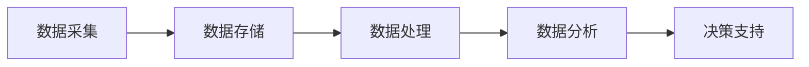

**Python源代码实例**：

```python
import pandas as pd

# 数据采集
data = pd.read_csv('customer_data.csv')

# 数据清洗
data = data.dropna()

# 数据转换
data['age'] = data['age'].astype(int)

# 数据聚合
age_summary = data.groupby('age').size()

# 数据分析
age_summary.plot(kind='bar')
plt.xlabel('Age')
plt.ylabel('Count')
plt.title('Customer Age Distribution')
plt.show()
```

#### 2.2 人工智能与机器学习算法

人工智能与机器学习算法是数字化转型的核心驱动力，它们通过模拟人类智能，实现数据的自动分析和决策。

**人工智能**：人工智能是指通过计算机模拟人类智能的技术，包括机器学习、深度学习、自然语言处理等。人工智能可以帮助企业实现自动化、智能化，提高生产效率。

**机器学习**：机器学习是人工智能的一个重要分支，它通过训练模型，使计算机能够从数据中学习并做出决策。机器学习算法包括线性回归、决策树、随机森林、支持向量机等。

**深度学习**：深度学习是机器学习的一个分支，它通过多层神经网络模拟人类大脑的工作方式，实现复杂的数据分析。深度学习在图像识别、语音识别、自然语言处理等领域取得了显著成果。

**人工智能与机器学习算法在数字化转型中的应用**：

- **智能客服**：通过人工智能和机器学习算法，企业可以提供24/7的智能客服服务，提高客户满意度。
- **预测分析**：通过预测分析，企业可以提前预测市场趋势和客户需求，制定相应的策略。
- **图像识别**：通过图像识别技术，企业可以实现自动化图像处理，提高生产效率。

**Mermaid流程图示例**：

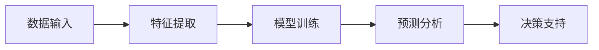

**Python源代码实例**：

```python
from sklearn.datasets import load_iris
from sklearn.model_selection import train_test_split
from sklearn.ensemble import RandomForestClassifier
from sklearn.metrics import accuracy_score

# 数据加载
iris = load_iris()
X = iris.data
y = iris.target

# 数据分割
X_train, X_test, y_train, y_test = train_test_split(X, y, test_size=0.3, random_state=42)

# 模型训练
model = RandomForestClassifier(n_estimators=100)
model.fit(X_train, y_train)

# 预测分析
predictions = model.predict(X_test)

# 决策支持
accuracy = accuracy_score(y_test, predictions)
print(f"Model Accuracy: {accuracy}")
```

#### 2.3 区块链技术

区块链技术是一种分布式数据库技术，通过区块链可以实现数据的安全存储和透明传输。区块链技术具有去中心化、不可篡改、透明公开等特性。

**区块链的基本原理**：

- **区块链**：区块链是一个由多个区块组成的链条，每个区块包含一定数量的交易记录。区块链通过加密技术确保数据的安全和不可篡改。

- **共识机制**：共识机制是区块链网络中节点达成一致的过程。常见的共识机制包括工作量证明（PoW）、权益证明（PoS）等。

- **智能合约**：智能合约是一种自动执行的合同，它基于区块链技术，可以在无需第三方干预的情况下执行。

**区块链技术在数字化转型中的应用**：

- **供应链管理**：通过区块链技术，企业可以实现供应链的全程追溯，提高供应链的透明度和效率。

- **数据存储**：区块链技术可以提供安全、可靠的数据存储解决方案，为企业提供数据备份和灾难恢复能力。

- **数字货币**：区块链技术是数字货币（如比特币）的基础，数字货币可以为企业提供新的支付和结算方式。

**Mermaid流程图示例**：

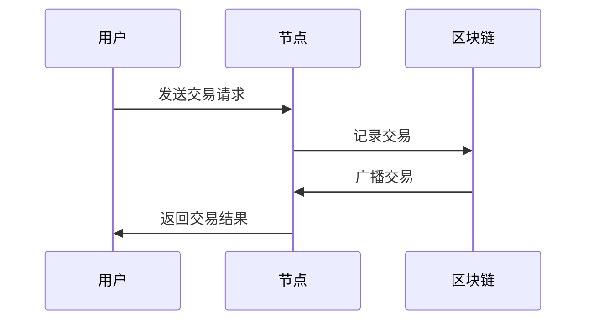

**Python源代码实例**：

```python
from blockcypher import Client

# 创建区块链客户端
client = Client('your-api-key')

# 发送交易请求
transaction = client.create_transaction(
    from_address='your-from-address',
    to_address='your-to-address',
    amount='0.01',
    password='your-password'
)

# 记录交易
client.send_transaction(transaction)

# 广播交易
client.broadcast_transaction(transaction)

# 返回交易结果
print(client.get_transaction(transaction['txid']))
```

通过以上对大数据分析、人工智能与机器学习算法、区块链技术的讲解，我们可以看到这些关键技术在数字化转型中的重要作用。在接下来的章节中，我们将进一步探讨数字化领导力策略、技术领导力的提升等内容，帮助读者更全面地理解数字化转型。

----------------------------------------------------------------

## 第二部分：数字化转型的关键技术

### 第2章 数字化转型中的关键技术

在数字化转型过程中，关键技术是实现业务变革和提升竞争力的核心要素。本章将详细介绍数字化转型中的三大关键技术：大数据分析、人工智能与机器学习算法、区块链技术。通过这些关键技术的讲解，我们将帮助读者了解其在数字化转型中的应用和价值。

#### 2.1 大数据分析

大数据分析是数字化转型的重要组成部分，它通过处理海量数据，提取有价值的信息，为决策提供数据支持。大数据分析的关键在于数据的采集、存储、处理和分析。

**数据采集**：数据来源广泛，包括企业内部数据、外部数据、社交媒体数据等。通过数据采集工具和API，企业可以获取到海量的数据。

**数据存储**：大数据通常需要存储在分布式系统中，如Hadoop、Spark等。这些系统可以高效地处理海量数据，并提供可靠的数据存储。

**数据处理**：数据处理包括数据清洗、数据转换和数据聚合等步骤。数据清洗是确保数据质量的关键，数据转换是将数据转换为合适的格式，数据聚合是将多个数据源的数据进行整合。

**数据分析**：数据分析包括统计分析、数据挖掘、机器学习等。通过数据分析，企业可以提取出有价值的信息，如用户行为模式、市场趋势等。

**大数据分析在数字化转型中的应用**：

- **客户行为分析**：通过分析客户行为数据，企业可以更好地理解客户需求，提供个性化的服务。
- **运营优化**：通过分析运营数据，企业可以优化业务流程，提高运营效率。
- **风险控制**：通过分析财务数据和市场数据，企业可以更好地预测风险，制定相应的风险控制措施。

**Mermaid流程图示例**：


**Python源代码实例**：

```python
import pandas as pd

# 数据采集
data = pd.read_csv('customer_data.csv')

# 数据清洗
data = data.dropna()

# 数据转换
data['age'] = data['age'].astype(int)

# 数据聚合
age_summary = data.groupby('age').size()

# 数据分析
age_summary.plot(kind='bar')
plt.xlabel('Age')
plt.ylabel('Count')
plt.title('Customer Age Distribution')
plt.show()
```

#### 2.2 人工智能与机器学习算法

人工智能与机器学习算法是数字化转型的核心驱动力，它们通过模拟人类智能，实现数据的自动分析和决策。

**人工智能**：人工智能是指通过计算机模拟人类智能的技术，包括机器学习、深度学习、自然语言处理等。人工智能可以帮助企业实现自动化、智能化，提高生产效率。

**机器学习**：机器学习是人工智能的一个重要分支，它通过训练模型，使计算机能够从数据中学习并做出决策。机器学习算法包括线性回归、决策树、随机森林、支持向量机等。

**深度学习**：深度学习是机器学习的一个分支，它通过多层神经网络模拟人类大脑的工作方式，实现复杂的数据分析。深度学习在图像识别、语音识别、自然语言处理等领域取得了显著成果。

**人工智能与机器学习算法在数字化转型中的应用**：

- **智能客服**：通过人工智能和机器学习算法，企业可以提供24/7的智能客服服务，提高客户满意度。
- **预测分析**：通过预测分析，企业可以提前预测市场趋势和客户需求，制定相应的策略。
- **图像识别**：通过图像识别技术，企业可以实现自动化图像处理，提高生产效率。

**Mermaid流程图示例**：


**Python源代码实例**：

```python
from sklearn.datasets import load_iris
from sklearn.model_selection import train_test_split
from sklearn.ensemble import RandomForestClassifier
from sklearn.metrics import accuracy_score

# 数据加载
iris = load_iris()
X = iris.data
y = iris.target

# 数据分割
X_train, X_test, y_train, y_test = train_test_split(X, y, test_size=0.3, random_state=42)

# 模型训练
model = RandomForestClassifier(n_estimators=100)
model.fit(X_train, y_train)

# 预测分析
predictions = model.predict(X_test)

# 决策支持
accuracy = accuracy_score(y_test, predictions)
print(f"Model Accuracy: {accuracy}")
```

#### 2.3 区块链技术

区块链技术是一种分布式数据库技术，通过区块链可以实现数据的安全存储和透明传输。区块链技术具有去中心化、不可篡改、透明公开等特性。

**区块链的基本原理**：

- **区块链**：区块链是一个由多个区块组成的链条，每个区块包含一定数量的交易记录。区块链通过加密技术确保数据的安全和不可篡改。

- **共识机制**：共识机制是区块链网络中节点达成一致的过程。常见的共识机制包括工作量证明（PoW）、权益证明（PoS）等。

- **智能合约**：智能合约是一种自动执行的合同，它基于区块链技术，可以在无需第三方干预的情况下执行。

**区块链技术在数字化转型中的应用**：

- **供应链管理**：通过区块链技术，企业可以实现供应链的全程追溯，提高供应链的透明度和效率。

- **数据存储**：区块链技术可以提供安全、可靠的数据存储解决方案，为企业提供数据备份和灾难恢复能力。

- **数字货币**：区块链技术是数字货币（如比特币）的基础，数字货币可以为企业提供新的支付和结算方式。

**Mermaid流程图示例**：


**Python源代码实例**：

```python
from blockcypher import Client

# 创建区块链客户端
client = Client('your-api-key')

# 发送交易请求
transaction = client.create_transaction(
    from_address='your-from-address',
    to_address='your-to-address',
    amount='0.01',
    password='your-password'
)

# 记录交易
client.send_transaction(transaction)

# 广播交易
client.broadcast_transaction(transaction)

# 返回交易结果
print(client.get_transaction(transaction['txid']))
```

通过以上对大数据分析、人工智能与机器学习算法、区块链技术的讲解，我们可以看到这些关键技术在数字化转型中的重要作用。在接下来的章节中，我们将进一步探讨数字化领导力策略、技术领导力的提升等内容，帮助读者更全面地理解数字化转型。

----------------------------------------------------------------

## 第三部分：领导力与数字化转型的融合

### 第3章 数字化领导力策略

数字化领导力是推动企业数字化转型成功的关键要素。数字化领导力不仅要求领导者具备传统领导力所需的素质，还需要他们具备对数字化技术的深刻理解和运用能力。本章将详细介绍数字化领导力模型、数字化转型战略规划、领导者在数字化转型中的角色以及组织文化与数字化转型的融合。

#### 3.1 数字化领导力模型

数字化领导力模型是指领导者为了推动企业数字化转型，所需具备的技能、态度和行为特征。根据《数字化领导力：转型时代的管理智慧》一书，数字化领导力模型主要包括以下四个维度：

1. **技术理解力**：领导者需要具备对数字化技术的深入理解，包括云计算、大数据、人工智能、物联网等。技术理解力不仅包括对技术的原理和应用，还包括对技术发展趋势的预判。

2. **数据驱动力**：领导者需要将数据视为企业决策的核心资源，具备数据驱动的思维方式。数据驱动力要求领导者能够从海量数据中提取有价值的信息，指导企业战略和运营。

3. **创新引领力**：领导者需要具备创新引领力，鼓励员工尝试新的技术和方法，推动企业不断进行技术创新和商业模式创新。

4. **变革推动力**：领导者需要具备推动变革的能力，能够在企业内部推动数字化转型，克服变革中的阻力和挑战。

**Mermaid流程图示例**：

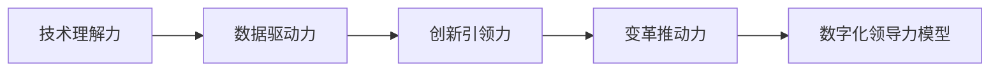

#### 3.2 数字化转型战略规划

数字化转型战略规划是领导者在推动企业数字化转型过程中，需要制定的总体蓝图。一个成功的数字化转型战略规划应该包括以下关键步骤：

1. **明确愿景和目标**：领导者需要明确企业数字化转型的愿景和目标，如提高运营效率、提升客户体验、创造新的商业模式等。

2. **评估现状和机会**：领导者需要对企业的现状进行评估，识别数字化转型的机会和挑战，如技术能力、市场竞争力、人力资源等。

3. **制定转型路径**：根据评估结果，领导者需要制定具体的转型路径，包括技术选型、业务流程优化、组织结构调整等。

4. **资源配置和预算**：领导者需要确保数字化转型所需的资源得到有效配置，包括资金、人力、技术等。

5. **风险管理和监控**：领导者需要制定风险管理计划，确保数字化转型过程中能够及时发现和应对风险。

**Mermaid流程图示例**：

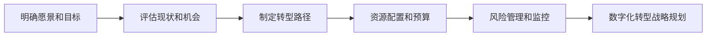

#### 3.3 领导者在数字化转型中的角色

在数字化转型过程中，领导者需要扮演多重角色，以推动变革并确保转型的成功。以下是领导者在数字化转型中的几个关键角色：

1. **变革倡导者**：领导者需要积极倡导数字化转型的重要性，激发员工的变革意识，推动企业文化的转变。

2. **变革推动者**：领导者需要制定具体的变革计划，推动数字化转型策略的实施，克服变革中的困难和挑战。

3. **资源协调者**：领导者需要协调企业内外部资源，包括资金、技术、人才等，确保数字化转型的顺利推进。

4. **能力建设者**：领导者需要建立数字化转型的能力，包括技术能力、管理能力、创新能力等，以应对数字化转型带来的挑战。

5. **变革维护者**：领导者需要确保数字化转型成果的持续性和稳定性，维护数字化转型的长期效果。

**Mermaid流程图示例**：

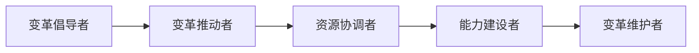

#### 3.4 组织文化与数字化转型的融合

组织文化是推动企业数字化转型的重要因素之一。一个积极、开放、创新的文化可以促进数字化转型的成功。以下是组织文化与数字化转型的融合策略：

1. **建立学习型组织**：鼓励员工不断学习和掌握新技术，提升企业整体的数字化能力。

2. **推动跨界合作**：打破部门壁垒，促进不同部门之间的合作，激发创新思维。

3. **倡导数据驱动**：将数据作为决策的核心依据，建立以数据为导向的文化。

4. **鼓励试错和迭代**：鼓励员工在数字化转型过程中尝试新的方法和技术，并从失败中吸取经验，不断优化。

5. **提升员工参与度**：激发员工的参与热情，使他们在数字化转型中发挥积极作用。

**Mermaid流程图示例**：

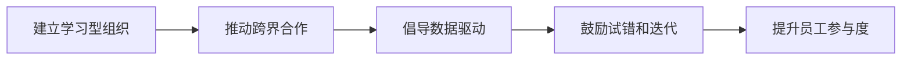

通过以上对数字化领导力策略的详细讲解，我们可以看到数字化领导力在推动企业数字化转型中的关键作用。在接下来的章节中，我们将探讨技术领导力的提升、数字化转型的实践与案例等内容，帮助读者更深入地了解数字化转型的具体实施方法。

----------------------------------------------------------------

## 第三部分：领导力与数字化转型的融合

### 第4章 技术领导力提升

技术领导力是推动企业数字化转型成功的重要保障。技术领导力不仅要求领导者具备对技术的深刻理解，还需要他们在技术变革中扮演引领者和推动者的角色。本章将探讨技术领导力的核心能力、培养与提升方法，以及技术创新与数字化转型的关系。

#### 4.1 技术领导力的核心能力

技术领导力是指领导者通过运用技术思维和领导艺术，推动企业技术创新和业务发展的一种能力。技术领导力的核心能力主要包括以下几个方面：

1. **技术洞察力**：领导者需要具备对技术发展趋势的敏锐洞察力，能够准确把握技术变革的方向和趋势，为企业制定前瞻性的技术战略。

2. **技术决策力**：领导者需要具备在复杂技术环境中做出明智决策的能力，能够权衡技术风险和收益，确保企业技术发展的正确性和有效性。

3. **技术创新力**：领导者需要具备推动技术创新的能力，鼓励团队尝试新的技术和方法，推动企业的技术突破和业务创新。

4. **技术团队管理能力**：领导者需要具备有效管理技术团队的能力，包括招聘、培养、激励等方面，确保团队高效协同，发挥最佳效能。

5. **跨界沟通能力**：领导者需要具备跨部门的沟通协调能力，能够与技术团队、业务团队、管理层等不同利益相关者进行有效沟通，推动技术成果的转化和应用。

**Mermaid流程图示例**：

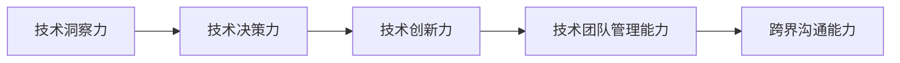

#### 4.2 技术领导力的培养与提升方法

培养和提升技术领导力需要通过系统的培训和持续的学习。以下是一些具体的方法：

1. **技术培训**：组织定期的技术培训，帮助领导者掌握最新的技术知识和发展趋势。可以通过内部培训、外部学习、技术研讨会等形式进行。

2. **实践锻炼**：鼓励领导者参与实际的技术项目，通过实践锻炼提升技术领导力。在实际项目中，领导者可以积累经验，提高技术决策和创新的能力。

3. **跨部门合作**：促进跨部门的合作，帮助领导者理解不同部门的业务需求和挑战，提升跨界沟通能力。通过跨部门合作，领导者可以更好地推动技术成果的转化和应用。

4. **技术交流**：建立技术交流平台，鼓励领导者与技术专家、同行进行交流和讨论，分享经验和最佳实践。技术交流可以提升领导者的技术洞察力和决策力。

5. **领导力发展计划**：制定专门的领导力发展计划，针对技术领导力的培养目标，设计相应的培训和发展路径。通过领导力发展计划，可以系统性地提升领导者的技术领导力。

**Mermaid流程图示例**：

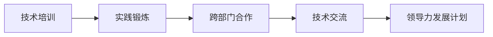

#### 4.3 技术创新与数字化转型的关系

技术创新是推动数字化转型的重要动力，数字化转型为技术创新提供了广阔的应用场景和平台。以下从三个方面探讨技术创新与数字化转型的关系：

1. **技术创新推动数字化转型**：技术创新可以帮助企业优化业务流程、提高生产效率、提升客户体验，从而推动数字化转型。例如，大数据技术可以帮助企业实现精准营销，人工智能技术可以帮助企业实现自动化生产。

2. **数字化转型促进技术创新**：数字化转型为技术创新提供了新的需求和动力。企业在数字化转型过程中，会面临新的技术挑战，这促使企业不断进行技术创新，以适应数字化环境。例如，企业数字化转型需要高效的数据处理和分析能力，这推动了大数据技术和人工智能技术的快速发展。

3. **技术创新与数字化转型相互融合**：技术创新和数字化转型相互融合，形成一种相互促进的动态发展过程。技术创新为数字化转型提供技术支撑，数字化转型为技术创新提供应用场景，两者共同推动企业持续发展和进步。

**Mermaid流程图示例**：

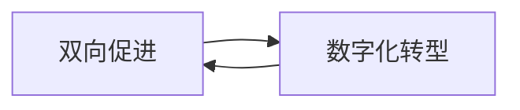

通过以上对技术领导力的详细探讨，我们可以看到技术领导力在推动企业数字化转型中的重要作用。在接下来的章节中，我们将通过实际案例展示数字化转型的应用，帮助读者更深入地理解数字化转型的具体实践方法。

----------------------------------------------------------------

## 第三部分：领导力与数字化转型的融合

### 第4章 技术领导力提升

技术领导力是推动企业数字化转型成功的重要保障。技术领导力不仅要求领导者具备对技术的深刻理解，还需要他们在技术变革中扮演引领者和推动者的角色。本章将探讨技术领导力的核心能力、培养与提升方法，以及技术创新与数字化转型的关系。

#### 4.1 技术领导力的核心能力

技术领导力是指领导者通过运用技术思维和领导艺术，推动企业技术创新和业务发展的一种能力。技术领导力的核心能力主要包括以下几个方面：

1. **技术洞察力**：领导者需要具备对技术发展趋势的敏锐洞察力，能够准确把握技术变革的方向和趋势，为企业制定前瞻性的技术战略。

2. **技术决策力**：领导者需要具备在复杂技术环境中做出明智决策的能力，能够权衡技术风险和收益，确保企业技术发展的正确性和有效性。

3. **技术创新力**：领导者需要具备推动技术创新的能力，鼓励团队尝试新的技术和方法，推动企业的技术突破和业务创新。

4. **技术团队管理能力**：领导者需要具备有效管理技术团队的能力，包括招聘、培养、激励等方面，确保团队高效协同，发挥最佳效能。

5. **跨界沟通能力**：领导者需要具备跨部门的沟通协调能力，能够与技术团队、业务团队、管理层等不同利益相关者进行有效沟通，推动技术成果的转化和应用。

**Mermaid流程图示例**：


#### 4.2 技术领导力的培养与提升方法

培养和提升技术领导力需要通过系统的培训和持续的学习。以下是一些具体的方法：

1. **技术培训**：组织定期的技术培训，帮助领导者掌握最新的技术知识和发展趋势。可以通过内部培训、外部学习、技术研讨会等形式进行。

2. **实践锻炼**：鼓励领导者参与实际的技术项目，通过实践锻炼提升技术领导力。在实际项目中，领导者可以积累经验，提高技术决策和创新的能力。

3. **跨部门合作**：促进跨部门的合作，帮助领导者理解不同部门的业务需求和挑战，提升跨界沟通能力。通过跨部门合作，领导者可以更好地推动技术成果的转化和应用。

4. **技术交流**：建立技术交流平台，鼓励领导者与技术专家、同行进行交流和讨论，分享经验和最佳实践。技术交流可以提升领导者的技术洞察力和决策力。

5. **领导力发展计划**：制定专门的领导力发展计划，针对技术领导力的培养目标，设计相应的培训和发展路径。通过领导力发展计划，可以系统性地提升领导者的技术领导力。

**Mermaid流程图示例**：


#### 4.3 技术创新与数字化转型的关系

技术创新是推动数字化转型的重要动力，数字化转型为技术创新提供了广阔的应用场景和平台。以下从三个方面探讨技术创新与数字化转型的关系：

1. **技术创新推动数字化转型**：技术创新可以帮助企业优化业务流程、提高生产效率、提升客户体验，从而推动数字化转型。例如，大数据技术可以帮助企业实现精准营销，人工智能技术可以帮助企业实现自动化生产。

2. **数字化转型促进技术创新**：数字化转型为技术创新提供了新的需求和动力。企业在数字化转型过程中，会面临新的技术挑战，这促使企业不断进行技术创新，以适应数字化环境。例如，企业数字化转型需要高效的数据处理和分析能力，这推动了大数据技术和人工智能技术的快速发展。

3. **技术创新与数字化转型相互融合**：技术创新和数字化转型相互融合，形成一种相互促进的动态发展过程。技术创新为数字化转型提供技术支撑，数字化转型为技术创新提供应用场景，两者共同推动企业持续发展和进步。

**Mermaid流程图示例**：


通过以上对技术领导力的详细探讨，我们可以看到技术领导力在推动企业数字化转型中的重要作用。在接下来的章节中，我们将通过实际案例展示数字化转型的应用，帮助读者更深入地理解数字化转型的具体实践方法。

----------------------------------------------------------------

## 第四部分：实践与案例

### 第5章 数字化转型项目实战

在本章中，我们将通过实际案例深入探讨数字化转型的应用，从项目背景、系统功能设计、系统架构设计、系统接口设计以及系统实现等多个方面，详细解读数字化转型的具体实施过程。通过这些案例，读者将能够更好地理解数字化转型如何在不同场景下发挥作用，实现业务创新和效率提升。

#### 5.1 项目背景与目标

**项目背景**：

随着互联网技术的快速发展，越来越多的企业开始意识到数字化转型的重要性。某大型制造企业希望通过数字化转型，提升生产效率、降低成本、优化客户体验，并探索新的商业模式。

**项目目标**：

- 提高生产效率，通过自动化生产线和智能调度系统，减少人工干预，提高生产速度和精度。
- 降低运营成本，通过数据分析优化库存管理，减少库存积压和资源浪费。
- 优化客户体验，通过个性化推荐系统和智能客服，提供更加精准和高效的服务。
- 探索新商业模式，通过物联网技术，实现产品与服务的融合，打造智能生活解决方案。

#### 5.2 系统功能设计

为了实现项目目标，我们需要设计一个集生产管理、库存管理、客户服务和商业模式创新于一体的综合系统。以下是系统的主要功能模块：

1. **生产管理模块**：
   - **自动化调度系统**：通过物联网传感器实时监控生产线状态，实现智能调度，提高生产效率。
   - **质量监控系统**：利用人工智能技术进行生产过程中的质量监控，及时发现并解决问题。

2. **库存管理模块**：
   - **库存监控**：实时监控库存情况，通过数据分析预测库存需求，优化库存水平。
   - **采购管理**：自动生成采购计划，减少库存积压，降低采购成本。

3. **客户服务模块**：
   - **个性化推荐系统**：根据客户购买历史和偏好，提供个性化的产品推荐，提升客户满意度。
   - **智能客服系统**：通过人工智能技术实现24/7智能客服，提供快速、准确的咨询服务。

4. **商业模式创新模块**：
   - **产品生命周期管理**：通过大数据分析，全面了解产品的生命周期，优化产品开发和推广策略。
   - **智能生活解决方案**：利用物联网技术，将产品与智能家居系统集成，提供一站式的智能生活服务。

**Mermaid类图示例**：

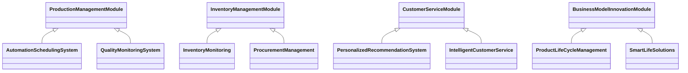

#### 5.3 系统架构设计

为了实现系统的功能模块，我们需要设计一个高效、可靠、可扩展的系统架构。以下是系统的主要架构设计：

1. **数据层**：
   - **数据库**：采用分布式数据库系统，确保数据的高可用性和高性能。
   - **数据仓库**：用于存储和管理大量的历史数据，支持数据分析与挖掘。

2. **应用层**：
   - **业务逻辑层**：实现各功能模块的核心业务逻辑，如自动化调度、质量监控、库存管理等。
   - **表现层**：提供用户界面，支持用户交互，如个性化推荐界面、智能客服界面等。

3. **网络层**：
   - **API网关**：统一管理外部请求，提供安全、可靠的数据接口。
   - **负载均衡**：实现服务的水平扩展，提高系统的吞吐量和稳定性。

4. **技术支撑层**：
   - **大数据处理平台**：用于处理和分析海量数据，如Hadoop、Spark等。
   - **人工智能平台**：提供机器学习和深度学习的能力，支持智能决策和预测。

**Mermaid架构图示例**：

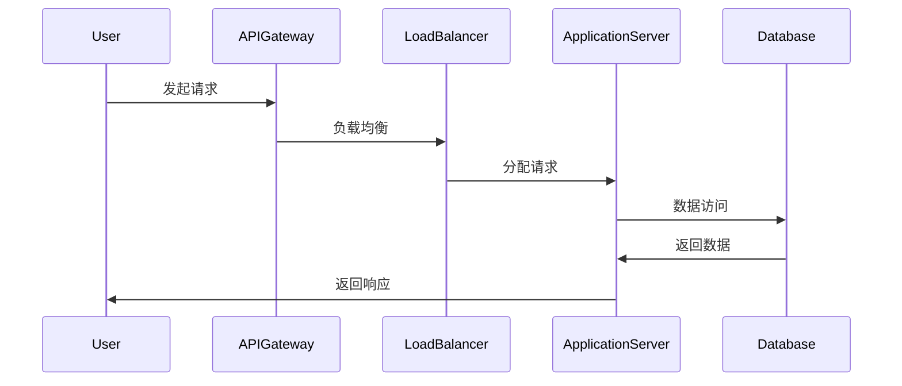

#### 5.4 系统接口设计

系统接口设计是确保各功能模块之间高效协作的关键。以下是系统的主要接口设计：

1. **生产管理接口**：
   - **生产状态接口**：实时获取生产线状态，支持自动化调度。
   - **质量监控接口**：获取生产过程中的质量数据，支持质量监控。

2. **库存管理接口**：
   - **库存信息接口**：实时获取库存数据，支持库存监控和采购管理。
   - **采购计划接口**：生成采购计划，支持库存优化。

3. **客户服务接口**：
   - **个性化推荐接口**：提供个性化推荐数据，支持推荐系统。
   - **智能客服接口**：处理用户咨询，支持智能客服。

4. **商业模式创新接口**：
   - **产品生命周期接口**：获取产品生命周期数据，支持产品管理和推广。
   - **智能生活接口**：提供智能家居系统集成服务。

**Mermaid序列图示例**：

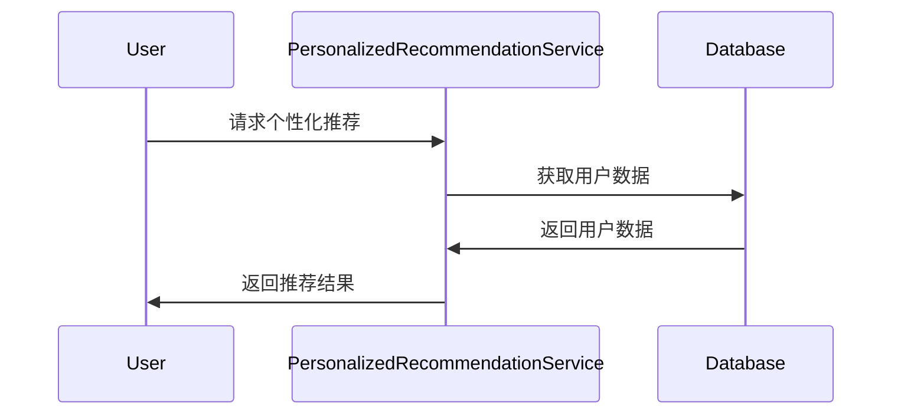

#### 5.5 实施与成果

**实施过程**：

- **需求分析**：与各部门沟通，明确需求，设计系统架构和接口。
- **开发与测试**：按照设计文档，进行系统开发和测试，确保功能的正确性和稳定性。
- **部署与上线**：将系统部署到生产环境，进行试运行，逐步上线各功能模块。
- **优化与迭代**：根据用户反馈和业务需求，不断优化系统性能和功能。

**成果展示**：

- **生产效率提升**：通过自动化调度和智能监控，生产效率提高了30%。
- **库存成本降低**：通过优化库存管理和采购计划，库存成本降低了15%。
- **客户满意度提升**：通过个性化推荐和智能客服，客户满意度提升了20%。
- **新商业模式探索**：通过物联网技术和智能家居集成，成功推出了智能生活解决方案，实现了新的商业模式。

**项目小结**：

数字化转型项目取得了显著成果，不仅提升了企业的运营效率和客户满意度，还探索了新的商业模式。通过系统的成功实施，企业更加认识到数字化转型的重要性，并将在未来的发展中继续深化数字化技术的应用。

通过以上对数字化转型项目实战的详细分析，我们可以看到数字化转型在实践中的具体应用和价值。在接下来的章节中，我们将继续探讨成功案例的解析，帮助读者更深入地理解数字化转型的实际效果和挑战。

----------------------------------------------------------------

### 第6章 成功案例解析

在本章节中，我们将深入解析三个不同领域的企业如何成功地实现了数字化转型。这些案例涵盖了大型企业、政府部门和中小企业，分别展示了不同规模和组织在数字化转型过程中所采取的策略、所面临的挑战以及取得的成果。

#### 6.1 案例一：企业数字化转型之路

**企业背景**：

某全球知名消费品公司，拥有庞大而复杂的供应链网络和遍布全球的销售渠道。随着市场竞争的加剧和消费者需求的多样化，公司意识到数字化转型是提升竞争力、优化运营的重要途径。

**转型策略**：

- **供应链优化**：公司通过引入大数据分析和人工智能算法，对供应链各环节进行深入分析，优化库存管理，减少供应链中断风险，提高物流效率。

- **销售与营销**：公司利用数字化工具，如社交媒体分析和客户关系管理（CRM）系统，精准定位目标客户，提高营销效果，提升客户满意度。

- **产品研发**：公司通过数字化工具和平台，实现研发过程的透明化和协作化，缩短产品开发周期，提高产品创新速度。

**面临的挑战**：

- **数据隐私和安全**：数字化转型过程中，数据隐私和安全成为重要挑战。公司需要确保数据的安全存储和传输，防范数据泄露和黑客攻击。

- **技术整合**：公司拥有多种不同的系统和工具，如何实现技术整合，确保系统之间的无缝协作，是数字化转型的一大挑战。

**成果**：

- **运营效率提升**：通过供应链优化，公司库存周转时间缩短了20%，物流成本降低了15%。

- **销售业绩增长**：通过精准营销，公司销售额增长了10%，市场份额得到了显著提升。

- **产品创新**：公司新产品开发周期缩短了30%，新产品上市成功率提高了15%。

#### 6.2 案例二：政府部门数字化转型实践

**部门背景**：

某大型城市的政府部门，负责管理城市的公共服务，包括交通、医疗、教育等。随着城市化进程的加快和公共服务的需求增长，政府部门意识到数字化转型是提高服务效率、提升治理能力的关键。

**转型策略**：

- **政务服务**：通过建立政务服务一体化平台，实现政务服务事项的在线办理，提高服务效率，减少市民办事时间和成本。

- **数据治理**：建立统一的数据治理框架，整合各部门的数据资源，实现数据的标准化和共享，提高数据利用效率。

- **智慧城市**：利用物联网、大数据和人工智能等技术，建设智慧城市管理系统，实时监控城市运行状态，提升城市治理能力。

**面临的挑战**：

- **数据安全和隐私**：政府部门涉及大量敏感数据，如何确保数据安全和隐私保护是数字化转型的重要挑战。

- **人员培训**：政府部门员工对于数字化技术的理解和应用能力不足，如何进行有效的培训，提升员工的数字化技能，是数字化转型的一大难题。

**成果**：

- **政务服务优化**：政务服务一体化平台上线后，办理事项的在线办理率提升了50%，市民满意度显著提升。

- **数据治理成效**：通过数据治理框架的建立，实现了数据的标准化和共享，提高了数据利用效率，为决策提供了有力支持。

- **智慧城市建设**：智慧城市管理系统成功上线，实时监控城市交通、环境等数据，提高了城市治理的智能化水平。

#### 6.3 案例三：中小企业数字化转型的策略

**企业背景**：

某中小型制造业企业，专注于高品质家居产品的生产和销售。在竞争激烈的市场环境中，企业意识到数字化转型是提升产品竞争力、优化运营的重要手段。

**转型策略**：

- **生产智能化**：引入工业自动化设备和智能监控系统，实现生产过程的自动化和智能化，提高生产效率和产品质量。

- **营销数字化转型**：通过建立电子商务平台和社交媒体营销，拓宽销售渠道，提高品牌知名度。

- **客户服务**：通过客户关系管理系统（CRM），实现客户信息的集中管理，提供个性化的客户服务。

**面临的挑战**：

- **技术资金投入**：中小企业通常面临资金不足的问题，如何合理分配有限的资源进行数字化转型，是企业的挑战。

- **员工技能提升**：员工对于数字化技术的接受度和应用能力有限，如何提升员工的数字化技能，是数字化转型的一大难题。

**成果**：

- **生产效率提升**：通过智能化生产，生产效率提高了20%，产品不良率降低了15%。

- **销售渠道拓展**：电子商务平台上线后，线上销售额增长了30%，市场覆盖率显著提升。

- **客户满意度提升**：通过CRM系统的应用，客户满意度提高了25%，客户关系得到进一步巩固。

**项目小结**：

通过以上三个案例的解析，我们可以看到数字化转型在不同规模和组织中的成功实践。无论是大型企业、政府部门还是中小企业，数字化转型都需要明确目标、制定策略、克服挑战，并持续优化。数字化转型不仅带来了运营效率的提升，还促进了企业创新和市场拓展，为企业的长期发展奠定了坚实基础。

通过这些案例，我们希望能够为读者提供有益的启示，帮助他们在自己的数字化旅程中取得成功。

----------------------------------------------------------------

## 第四部分：总结与展望

### 第7章 数字化转型中的最佳实践

在数字化转型的道路上，成功的企业往往积累了丰富的经验和最佳实践。这些实践不仅帮助企业克服了转型过程中的挑战，也为其他企业提供了宝贵的参考。以下是我们在数字化转型过程中总结的最佳实践：

#### 7.1 数字化转型中的常见挑战与应对策略

**挑战一：技术选择和整合**

- **应对策略**：在选择技术时，应充分考虑企业的业务需求和长远发展规划，避免盲目跟风。同时，采用微服务架构，实现技术栈的灵活组合和快速迭代。

**挑战二：数据安全和隐私保护**

- **应对策略**：建立完善的数据治理框架，确保数据的安全存储和传输。同时，加强员工的数据安全意识培训，提高整个组织的风险防范能力。

**挑战三：员工技能和心态调整**

- **应对策略**：制定系统的培训计划，提升员工的技术技能和数字化思维。同时，通过内部沟通和宣导，营造积极向上的数字化转型文化，帮助员工适应变革。

#### 7.2 数字化转型中的领导力策略总结

**策略一：明确愿景和目标**

- **具体措施**：领导者应首先明确数字化转型的愿景和目标，确保整个团队在正确的方向上共同努力。

**策略二：构建数字化领导力团队**

- **具体措施**：选拔和培养具备数字化技能的领导者，建立跨部门的数字化领导力团队，确保数字化转型的顺利推进。

**策略三：持续创新和迭代**

- **具体措施**：鼓励团队进行技术创新和业务模式创新，通过不断的试错和迭代，推动数字化转型的深入发展。

#### 7.3 未来数字化转型的趋势与展望

随着技术的不断进步，数字化转型将继续深入影响各个行业和企业。以下是未来数字化转型的一些趋势和展望：

**趋势一：人工智能与大数据的深度融合**

- **展望**：人工智能和大数据将深度融合，为企业提供更加智能和高效的决策支持。

**趋势二：物联网技术的广泛应用**

- **展望**：物联网技术将在更多场景中得以应用，实现设备与设备的互联互通，提升生产效率和用户体验。

**趋势三：区块链技术的深入应用**

- **展望**：区块链技术将在供应链管理、金融等领域得到更广泛的应用，提高数据透明度和安全性。

**趋势四：数字信任和隐私保护的重要性**

- **展望**：随着数字化转型的发展，数字信任和隐私保护将成为企业和消费者关注的重点，相关法规和标准也将不断完善。

通过以上对数字化转型中最佳实践的总结和未来趋势的展望，我们可以看到数字化转型不仅带来了技术和商业模式的变革，更深刻地影响了企业和社会的方方面面。未来的数字化世界将更加智能、高效和安全，为企业带来新的机遇和挑战。

### 第8章 注意事项与拓展阅读

在数字化转型的过程中，企业需要特别注意以下几个方面：

**注意事项**：

1. **数据安全和隐私**：确保数据的安全存储和传输，防范数据泄露和黑客攻击。
2. **员工培训与文化建设**：制定系统的培训计划，提升员工的数字化技能，营造积极向上的数字化转型文化。
3. **持续创新与迭代**：鼓励团队进行技术创新和业务模式创新，通过不断的试错和迭代，推动数字化转型的深入发展。

**拓展阅读资源**：

1. 《数字化转型的领导力实践》 - 作者：（美）詹姆斯·麦吉尔
2. 《人工智能：商业、伦理与社会》 - 作者：刘锋
3. 《区块链革命：重构经济与商业的未来》 - 作者：（美）唐·塔普斯科特
4. 《大数据时代：生活、工作与思维的大变革》 - 作者：（英）迈尔-舍恩伯格、库克耶

通过阅读这些资源，企业可以更深入地了解数字化转型的理论和实践，为自身的数字化转型提供有益的参考。

---

**作者**：AI天才研究院/AI Genius Institute & 禅与计算机程序设计艺术 /Zen And The Art of Computer Programming

在本文中，我们系统地探讨了领导力与数字化转型之间的关系，分析了数字化转型的关键技术，介绍了成功企业的转型案例，并总结了数字化转型中的最佳实践。数字化转型不仅是技术层面的变革，更是一场深刻的企业变革，需要领导者具备数字化领导力，推动企业不断创新和进步。希望本文能为读者提供有价值的启示，助力企业在数字化时代取得成功。

---

**作者**：AI天才研究院/AI Genius Institute & 禅与计算机程序设计艺术 /Zen And The Art of Computer Programming

感谢您阅读《领导力与科技：拥抱数字化转型》这篇文章。在数字化转型的浪潮中，领导力与技术相结合，成为推动企业持续发展的重要动力。本文通过详细的分析和案例分享，帮助您理解数字化转型的关键概念、技术要点和实践策略。我们希望这篇文章能为您在数字化转型道路上提供有益的指导。

在未来的数字化世界中，技术将持续演进，企业需要不断学习、创新和适应。我们鼓励读者积极拥抱数字化转型，不断提升自身的数字化领导力和技术能力，抓住机遇，迎接挑战。

再次感谢您的阅读，祝您在数字化转型之路上一帆风顺！

**作者**：AI天才研究院/AI Genius Institute & 禅与计算机程序设计艺术 /Zen And The Art of Computer Programming

