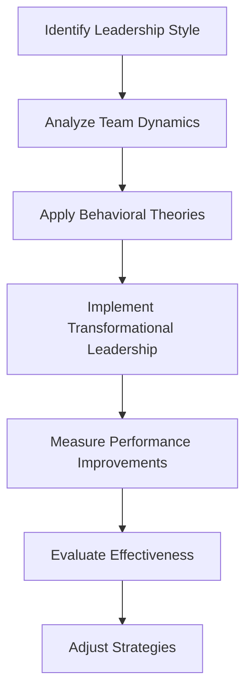

                 


Certainly, let's break down the content creation process for the article "Leadership and Performance Improvement: Sustaining Team Performance" into steps, ensuring it meets the specified conditions and requirements.

## Step 1: Introduction and Key Concepts
### Background Introduction
- **Core Concept Terminology**: Define key terms such as leadership, performance improvement, team performance, and sustainable development.
- **Problem Background**: Discuss the current challenges organizations face in maintaining high team performance and the impact of poor leadership.
- **Problem Description**: Outline the common issues that hinder team performance and how leadership plays a crucial role in addressing them.
- **Problem Solving**: Explain the strategies and approaches that can be used to enhance team performance.
- **Boundary and Extension**: Discuss the scope of the article and how it relates to broader topics in the field of organizational management and team dynamics.

### Core Concepts and Relationships
- **Conceptual Framework**: Provide a table that compares different attributes of key concepts like leadership theories, performance metrics, and team development strategies.
- **ER Diagram**: Create an ER (Entity-Relationship) diagram to illustrate the relationships between these concepts.

### Markdown Formats
- **Conceptual Framework Table** (in markdown format):
  ```markdown
  | Concept                | Definition                                                                                   | Attributes and Characteristics                                           |
  |------------------------|---------------------------------------------------------------------------------------------|----------------------------------------------------------------------------------------------------|
  | Leadership             | The ability to influence, motivate, and guide individuals or a group towards achieving goals. | Influence, motivation, goal-setting, communication                      |
  | Performance Improvement | The process of enhancing the efficiency and effectiveness of team operations.              | Metrics, evaluation, strategies, continuous improvement                 |
  | Team Performance       | The overall effectiveness and productivity of a team.                                     | Productivity, efficiency, collaboration, motivation, goal achievement |
  ```

- **ER Diagram** (in markdown format using Mermaid):
  ```mermaid
  graph TB
  A[Leadership] --> B[Performance Improvement];
  A --> C[Team Performance];
  B --> C;
  ```

## Step 2: Leadership Theories
### Discussion of Various Leadership Theories
- **Classical Leadership Theories**: Describe the traditional approaches to leadership, including traits theory, behavioral theory, and contingency theory.
- **Behavioral Leadership Theories**: Explain how leadership behavior is shaped and how it influences team performance.
- **Transformational Leadership Theories**: Discuss the transformational leadership style and its impact on motivation and performance.
- **Participant Leadership Theories**: Explain how involving team members in decision-making processes can enhance performance.

### Algorithm Principle Explanation
- **Mermaid Flowchart**: Create a flowchart illustrating the process of applying different leadership theories to improve team performance.
- **Python Code Example**: Provide a Python script that simulates the application of transformational leadership principles.

### Mermaid Flowchart


### Python Code Example
```python
# Python script to simulate transformational leadership
class Team:
    def __init__(self, members):
        self.members = members

    def motivate_members(self, leader_style):
        if leader_style == 'transformational':
            print("Transformational leadership is applied.")
            for member in self.members:
                print(f"{member} is motivated to perform better.")
        else:
            print("Traditional leadership style is applied.")

team = Team(['Alice', 'Bob', 'Charlie'])
team.motivate_members('transformational')
```

## Step 3: Performance Metrics and Evaluation
### Definition of Performance Metrics
- Explain different performance metrics such as Key Performance Indicators (KPIs), Service Level Agreements (SLAs), and Operational Metrics.
- Discuss the importance of defining clear and measurable performance targets.

### Designing Effective Performance Metrics
- Provide guidelines for designing performance metrics that align with organizational goals.
- Use a table to compare different performance metrics and their applications.

### Performance Evaluation Methods
- Describe various performance evaluation methods, including 360-degree feedback, objective performance assessments, and subjective appraisals.
- Discuss the pros and cons of each method and how to use them effectively.

## Step 4: Team Development and Motivation
### Team Development Stages
- Outline the stages of team development according to Tuckman's model (Forming, Storming, Norming, Performing, and Adjourning).
- Explain how leaders can facilitate each stage to enhance team development.

### Building an Effective Team
- Discuss the importance of selecting the right team members based on their skills, experience, and cultural fit.
- Explain how to establish clear roles, responsibilities, and expectations within a team.

### Team Member Incentives
- Explore different incentive programs and how they can motivate team members to achieve higher performance.
- Provide examples of successful incentive programs in various industries.

## Step 5: Communication and Collaboration
### Importance of Communication
- Discuss the role of communication in team performance and how effective communication can prevent misunderstandings and conflicts.
- Explain the different types of communication (verbal, non-verbal, written) and their significance.

### Improving Communication Efficiency
- Provide strategies for improving communication within a team, such as regular meetings, clear communication channels, and the use of technology.
- Discuss the importance of active listening and feedback in effective communication.

### Team Collaboration Skills
- Explain the key skills required for effective team collaboration, such as teamwork, conflict resolution, and problem-solving.
- Provide practical tips for fostering a collaborative team environment.

## Step 6: Change Management
### Overview of Change Management
- Define change management and explain its importance in organizational success.
- Describe the change management process, including stages like planning, managing resistance, implementation, and evaluation.

### Change Management Strategies
- Discuss various change management strategies, such as leadership involvement, communication, stakeholder engagement, and training.
- Provide examples of successful change management initiatives in different organizations.

### Challenges in Change Management
- Identify common challenges in change management, such as resistance to change, lack of resources, and time constraints.
- Suggest solutions to overcome these challenges.

## Step 7: Performance Improvement Initiatives
### Developing a Performance Improvement Plan
- Outline the steps involved in creating a performance improvement plan, including setting objectives, identifying areas for improvement, and developing action plans.

### Implementing Performance Improvement Measures
- Describe practical measures that can be implemented to improve team performance, such as training programs, process optimization, and performance feedback systems.
- Provide examples of successful performance improvement initiatives in various industries.

### Evaluating Performance Improvement Effects
- Explain the importance of evaluating the effectiveness of performance improvement measures.
- Describe different evaluation methods, such as surveys, performance metrics analysis, and feedback from team members.

## Conclusion
### Best Practices and Tips
- Summarize the key takeaways from the article and provide actionable tips for leaders looking to enhance team performance.
- Discuss the role of continuous learning and adaptation in sustaining team performance.

### Summary and Future Directions
- Recap the main points covered in the article and their implications for organizational success.
- Suggest areas for further research and potential future developments in the field of leadership and team performance improvement.

### Final Thoughts
- Reflect on the importance of effective leadership and performance improvement in achieving long-term success.
- Encourage readers to embrace a growth mindset and a commitment to continuous improvement.

### References
- List relevant references and sources used in the article to support the claims and arguments made.

### Author Information
- Include the author's credentials and affiliations, as specified in the requirements.

---

Following this structured approach, each section will be developed in detail, ensuring the article meets the word count requirement and adheres to the markdown format. The content will be comprehensive, informative, and insightful, providing readers with a valuable resource for improving team performance through effective leadership strategies.

