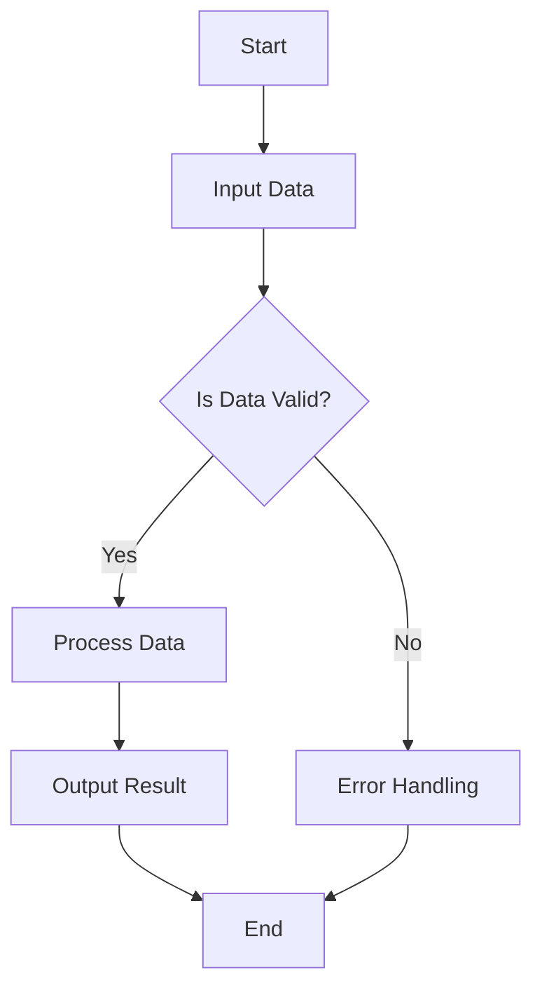
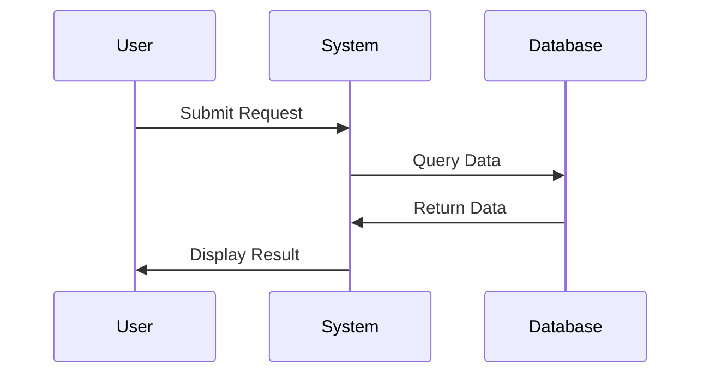

                 

### 文章标题

# 《领导力与职业道德：树立正直诚信的榜样》

### 文章关键词

- 领导力
- 职业道德
- 直正诚信
- 团队管理
- 组织文化
- 反思与展望

### 文章摘要

本文旨在探讨领导力与职业道德之间的关系，以及如何通过树立正直诚信的榜样来提升领导力和职业道德水平。文章分为六个部分，首先介绍了领导力的重要性，接着阐述了职业道德的核心原则，然后讨论了领导力与职业道德在实际应用中的挑战和机遇。随后，文章通过案例分析和实践指导，展示了如何塑造正直诚信的领导力榜样。最后，文章提出了对未来领导力与职业道德发展的反思与展望，以期为读者提供有益的思考和实践指导。  

----------------------------------------------------------------

## 第一部分：领导力概述

### 第1章：领导力的重要性

#### 1.1 领导力的定义与作用

领导力是一个多维度的概念，涉及到影响、激励、指导和塑造他人或团队的能力。根据《哈佛商业评论》的定义，领导力不仅仅是管理，它是一种能够在不确定性、复杂性和压力的环境中，引导他人共同实现目标的能力。

在IT行业中，领导力扮演着至关重要的角色。随着技术的快速发展，企业面临着前所未有的挑战和机遇。IT领导者需要具备前瞻性思维，能够预见未来的趋势，并制定有效的战略来应对。此外，他们还需要具备强大的沟通和团队管理能力，以协调不同部门和团队成员之间的工作，确保项目顺利进行。

**背景介绍**

领导力的起源可以追溯到古代社会，当时部落首领通过力量和智慧来领导部落。在现代社会，领导力的定义更加广泛和复杂。领导力不仅仅是个体的能力，还涉及到团队和组织的层面。根据彼得·德鲁克的定义，领导力是一种通过价值观、愿景和目标来影响他人共同实现目标的过程。

**问题背景**

随着IT行业的快速发展，领导力在其中的作用愈发凸显。然而，许多企业在领导力方面仍然存在一些问题，例如领导力不足、团队协作不畅、创新动力不足等。这些问题严重制约了企业的发展，因此，探讨领导力的重要性变得尤为重要。

**问题描述**

IT行业的领导力问题主要包括以下几个方面：

1. **缺乏愿景和战略规划**：许多IT领导者缺乏清晰的战略规划，无法为团队和公司指明方向。
2. **沟通不畅**：领导者与团队成员之间的沟通不畅，导致信息传递不准确，影响工作效率。
3. **团队协作不足**：团队成员之间缺乏有效的协作，影响项目进度和质量。
4. **创新动力不足**：缺乏创新思维和动力，导致企业无法跟上行业发展的步伐。

**问题解决**

为了解决上述问题，首先需要明确领导力的重要性，并从以下几个方面进行改进：

1. **提升领导力素质**：领导者需要通过学习和实践不断提升自己的领导力素质，包括沟通能力、团队管理能力、创新思维等。
2. **建立清晰的愿景和战略**：领导者需要明确公司的愿景和战略，并与团队成员进行有效沟通，确保大家齐心协力实现目标。
3. **加强团队协作**：领导者需要通过有效的团队管理，促进团队成员之间的协作，提高工作效率和质量。
4. **激发创新动力**：领导者需要营造一个鼓励创新的环境，激发团队成员的创新思维和动力，推动企业持续发展。

**边界与外延**

领导力不仅仅局限于IT行业，它适用于所有行业和领域。然而，由于IT行业的特殊性，领导力在其中扮演的角色更加重要。IT行业的快速发展和不确定性要求领导者具备更高的前瞻性思维和创新能力，以应对不断变化的市场环境。

**概念结构与核心要素组成**

领导力的核心要素包括：

1. **价值观**：领导者的价值观决定了其行为和决策，是领导力的基础。
2. **愿景**：领导者需要具备清晰的愿景，为公司指明方向。
3. **目标**：目标是将愿景转化为具体行动的步骤，是领导力的重要体现。
4. **影响力**：领导者需要具备影响力，能够影响和激励团队成员。

#### 1.2 领导力与职业道德的联系

领导力与职业道德之间存在着紧密的联系。一个正直诚信的领导者不仅能够在道德上为团队成员树立榜样，还能够提高团队的整体道德水平，促进企业的长期发展。

**背景介绍**

职业道德是指在工作中遵循的道德规范和行为准则。它涉及到诚实、正直、公正、尊重等核心价值观。在IT行业，职业道德尤为重要，因为技术的发展和互联网的普及使得信息的传播速度和影响力大大增强，任何不道德的行为都可能对个人和企业造成严重的影响。

**问题背景**

在IT行业中，职业道德问题时有发生，例如数据泄露、恶意攻击、虚假宣传等。这些问题不仅损害了企业的声誉，也影响了整个行业的健康发展。因此，探讨领导力与职业道德的联系，以及如何树立正直诚信的领导者，变得尤为重要。

**问题描述**

领导力与职业道德之间的联系主要体现在以下几个方面：

1. **领导者作为道德榜样**：领导者的行为和决策对团队成员产生深远的影响，一个正直诚信的领导者能够为团队成员树立良好的道德榜样。
2. **职业道德对企业文化的影响**：领导者的职业道德水平直接影响企业的文化氛围，一个正直诚信的领导者能够营造一个积极向上的企业文化，提高员工的道德水平和工作满意度。
3. **职业道德对团队协作的影响**：在一个正直诚信的领导者带领下，团队成员更愿意相互信任和合作，从而提高团队协作效率和项目成功率。

**问题解决**

为了解决上述问题，领导者需要从以下几个方面进行改进：

1. **树立正直诚信的榜样**：领导者需要通过自己的行为和决策，树立正直诚信的榜样，为团队成员树立良好的道德标杆。
2. **建立职业道德规范**：企业需要建立明确的职业道德规范，对员工进行职业道德培训，提高员工的道德素养。
3. **加强道德监督与问责**：企业需要建立道德监督机制，对违反职业道德的行为进行严厉问责，以维护企业的道德秩序。

**边界与外延**

领导力与职业道德之间的联系不仅限于IT行业，它适用于所有行业和领域。然而，由于IT行业的特殊性，领导者的职业道德水平对团队和企业的健康稳定发展具有更大的影响。

**概念结构与核心要素组成**

领导力与职业道德的核心要素包括：

1. **正直诚信**：领导者的正直诚信是其道德水平的重要体现，直接影响团队成员的道德观念和行为。
2. **道德榜样**：领导者作为道德榜样，对团队成员的道德观念和行为产生深远影响。
3. **职业道德规范**：企业需要建立明确的职业道德规范，对员工进行职业道德培训，提高员工的道德素养。
4. **道德监督与问责**：企业需要建立道德监督机制，对违反职业道德的行为进行严厉问责，以维护企业的道德秩序。

#### 1.3 领导力与个人素质

领导力不仅仅是一种能力，更是一种个人素质。一个优秀的领导者需要具备丰富的知识、良好的心态、强烈的责任感和卓越的沟通能力。这些个人素质是领导力的重要支撑，也是领导者能够带领团队走向成功的关键。

**背景介绍**

领导力与个人素质之间的关系已经被广泛研究。研究表明，领导力不仅仅依赖于外在的环境和条件，更依赖于领导者的内在素质。一个优秀的领导者需要具备高尚的个人品质和卓越的能力，才能在复杂多变的环境中应对挑战，带领团队实现目标。

**问题背景**

在当前的社会环境中，领导者面临的挑战日益增多。全球化、数字化、创新等趋势要求领导者具备更高的素质和能力。然而，许多领导者由于个人素质不足，无法应对这些挑战，导致团队和企业的绩效低下。

**问题描述**

领导力与个人素质之间的联系主要体现在以下几个方面：

1. **知识储备**：领导者需要具备丰富的知识储备，包括专业知识、行业知识、管理知识等，以便在决策过程中做出明智的选择。
2. **心态调整**：领导者需要具备良好的心态，包括乐观、自信、耐心等，以应对工作中的压力和挑战。
3. **责任感**：领导者需要具备强烈的责任感，对团队和企业的成功负责，确保团队目标的实现。
4. **沟通能力**：领导者需要具备卓越的沟通能力，包括倾听、表达、协调等，以便与团队成员有效沟通，促进团队协作。

**问题解决**

为了解决上述问题，领导者需要从以下几个方面进行改进：

1. **不断学习**：领导者需要不断学习，提升自己的知识水平和综合素质，以应对不断变化的环境和挑战。
2. **调整心态**：领导者需要调整心态，保持乐观、自信和耐心，以更好地应对工作中的压力和挑战。
3. **培养责任感**：领导者需要培养责任感，对团队和企业的成功负责，确保团队目标的实现。
4. **提升沟通能力**：领导者需要提升沟通能力，包括倾听、表达、协调等，以促进团队协作，提高工作效率。

**边界与外延**

领导力与个人素质之间的关系不仅限于IT行业，它适用于所有行业和领域。然而，由于IT行业的快速发展和变化，领导者需要具备更高的素质和能力，以应对不断变化的环境和挑战。

**概念结构与核心要素组成**

领导力与个人素质的核心要素包括：

1. **知识储备**：领导者需要具备丰富的知识储备，包括专业知识、行业知识、管理知识等。
2. **心态调整**：领导者需要具备良好的心态，包括乐观、自信、耐心等。
3. **责任感**：领导者需要具备强烈的责任感，对团队和企业的成功负责。
4. **沟通能力**：领导者需要具备卓越的沟通能力，包括倾听、表达、协调等。

## 第二部分：职业道德的基本原则

### 第2章：职业道德的核心原则

职业道德是职场人士在工作中应遵循的行为准则，它涉及到诚实、正直、公正、尊重等核心原则。这些原则不仅是个人品德的体现，也是企业文化和组织行为的基石。

#### 2.1 正直与诚信

正直与诚信是职业道德的基石，它们不仅关乎个人的声誉，也直接影响企业的文化和员工的工作态度。正直意味着坚持真理，不隐瞒事实，敢于面对问题，勇于承担责任。诚信则强调言行一致，遵守承诺，保持透明，不做欺骗行为。

**背景介绍**

在IT行业，数据安全和隐私保护是至关重要的。随着云计算、大数据和物联网的普及，数据泄露和网络安全事件时有发生。正直与诚信的职业道德原则要求IT从业人员在处理敏感数据时，严格遵守法律法规，保护用户隐私，不参与任何违法活动。

**问题背景**

近年来，一些IT企业因为职业道德问题而遭受重创。例如，数据泄露事件不仅损害了企业的声誉，还引发了用户的不信任。这些问题表明，职业道德在IT行业中具有至关重要的意义。

**问题描述**

正直与诚信在IT行业中的问题主要体现在以下几个方面：

1. **数据隐私保护**：不遵守数据隐私保护规定，导致用户数据泄露。
2. **网络安全**：参与黑客攻击或其他违法网络安全行为。
3. **业务诚信**：在商业活动中存在欺诈、虚假宣传等行为。

**问题解决**

为了解决上述问题，企业需要从以下几个方面进行改进：

1. **加强职业道德培训**：对员工进行职业道德培训，提高其职业道德意识。
2. **建立严格的监管机制**：对企业内部进行定期审查，确保员工遵守职业道德规范。
3. **强化法律法规教育**：对员工进行法律法规教育，使其了解违法行为的后果。

**边界与外延**

正直与诚信不仅适用于IT行业，也适用于所有行业和领域。然而，由于IT行业的特殊性质，如数据安全和隐私保护，正直与诚信在IT行业中的重要性更为突出。

**概念结构与核心要素组成**

正直与诚信的核心要素包括：

1. **坚持真理**：不隐瞒事实，敢于面对问题，勇于承担责任。
2. **言行一致**：遵守承诺，保持透明，不做欺骗行为。
3. **数据隐私保护**：严格遵守数据隐私保护规定，保护用户隐私。
4. **网络安全**：不参与任何违法网络安全行为。

#### 2.2 公平与公正

公平与公正是职业道德的另一个重要原则，它们确保了工作环境中的公平竞争和合理待遇。公平意味着在分配资源、评价绩效和处理问题时，不偏袒任何一方，给予每个人应有的机会和待遇。公正确保了决策的透明性和合理性，使员工对组织充满信任。

**背景介绍**

在IT行业，公平与公正是确保团队协作和项目成功的关键。在项目评审、奖金分配和晋升选拔等环节，如果存在不公平现象，可能会导致员工的不满和流失，影响团队的凝聚力和工作效率。

**问题背景**

一些企业在绩效评估和晋升选拔过程中，存在不公平现象，导致员工的不满和抱怨。这种不公平现象不仅损害了企业的声誉，也影响了员工的工作积极性。

**问题描述**

公平与公正在IT行业中的问题主要体现在以下几个方面：

1. **绩效评估不公平**：评价标准不明确，存在主观偏见。
2. **晋升选拔不公平**：选拔过程不透明，存在内部关系和裙带关系。
3. **资源分配不公平**：项目资源分配不合理，导致某些员工工作量过大或过小。

**问题解决**

为了解决上述问题，企业需要从以下几个方面进行改进：

1. **建立透明的评价体系**：制定明确的绩效评估标准和流程，确保评估过程的公开和透明。
2. **加强监督与问责**：设立监督机构，对不公平现象进行严厉问责。
3. **提供公平的发展机会**：为所有员工提供公平的发展机会，鼓励内部竞争。

**边界与外延**

公平与公正不仅适用于IT行业，也适用于所有行业和领域。然而，由于IT行业的竞争激烈和变化快，公平与公正在IT行业中的重要性更为突出。

**概念结构与核心要素组成**

公平与公正的核心要素包括：

1. **公平竞争**：在分配资源、评价绩效和处理问题时，不偏袒任何一方，给予每个人应有的机会和待遇。
2. **透明决策**：决策过程公开透明，使员工对组织的决策有信任感。
3. **合理待遇**：确保员工在绩效评估和晋升选拔中受到公正对待。

#### 2.3 尊重与同情

尊重与同情是职业道德中的软性要素，它们强调了人与人之间的尊重和关怀。尊重意味着对他人的人格、观点和工作成果给予应有的尊重。同情则体现在对他人困境的理解和帮助。

**背景介绍**

在IT行业，团队成员之间的协作和沟通至关重要。尊重与同情的职业道德原则有助于建立和谐的工作环境，提高团队凝聚力和工作效率。

**问题背景**

一些IT企业由于竞争激烈和工作压力大，忽视了团队成员之间的尊重和关怀，导致员工流失和工作效率下降。

**问题描述**

尊重与同情在IT行业中的问题主要体现在以下几个方面：

1. **缺乏尊重**：团队成员之间缺乏基本的尊重，导致沟通不畅和合作困难。
2. **缺乏同情**：领导者和同事在团队成员遇到困难时，缺乏理解和支持。

**问题解决**

为了解决上述问题，企业需要从以下几个方面进行改进：

1. **建立尊重文化**：通过培训和文化活动，培养团队成员之间的尊重意识。
2. **加强团队建设**：组织团队建设活动，增强团队成员之间的信任和理解。
3. **关注员工福利**：提供心理健康支持和福利，帮助员工应对工作压力。

**边界与外延**

尊重与同情不仅适用于IT行业，也适用于所有行业和领域。然而，由于IT行业的特殊性质，如高度专业化和团队合作，尊重与同情在IT行业中的重要性更为突出。

**概念结构与核心要素组成**

尊重与同情的核心要素包括：

1. **尊重他人**：对他人的人格、观点和工作成果给予应有的尊重。
2. **理解与关怀**：在团队成员遇到困难时，给予理解和支持。
3. **团队协作**：通过团队建设活动，增强团队成员之间的信任和理解。

## 第三部分：领导力与职业道德的实际应用

### 第3章：领导力在团队管理中的应用

#### 3.1 团队成员的发展与激励

在团队管理中，领导者的一个关键任务是推动团队成员的个人发展和激励。这不仅有助于提升团队的整体绩效，也能增强团队成员的归属感和忠诚度。

**背景介绍**

在IT行业，团队成员的专业技能和创新能力是企业的核心竞争力。领导者需要关注团队成员的成长，提供培训和发展机会，以适应不断变化的技术环境。

**问题背景**

许多企业在团队管理中存在以下问题：

1. **缺乏职业发展规划**：团队成员没有明确的职业发展路径，导致动力不足。
2. **激励不足**：团队成员的付出和贡献没有得到充分的认可和奖励。

**问题描述**

团队成员的发展与激励问题主要体现在以下几个方面：

1. **职业发展规划不明确**：团队成员不清楚未来的职业发展方向。
2. **培训机会不足**：企业未能提供足够的培训资源，导致团队成员技能滞后。
3. **激励制度不完善**：缺乏有效的激励机制，导致团队成员的积极性下降。

**问题解决**

为了解决上述问题，领导者可以采取以下措施：

1. **制定明确的职业发展规划**：与团队成员一起制定职业发展计划，明确短期和长期目标。
2. **提供培训和发展机会**：为团队成员提供各种培训机会，提升其专业技能。
3. **建立有效的激励机制**：通过绩效奖励、晋升机会等方式，激励团队成员的积极性和创造力。

**边界与外延**

团队成员的发展与激励不仅适用于IT行业，也适用于所有需要团队协作的领域。然而，由于IT行业的快速发展和变化，领导者需要更加关注团队成员的专业发展和技能提升。

**概念结构与核心要素组成**

团队成员的发展与激励的核心要素包括：

1. **职业发展规划**：为团队成员提供明确的职业发展路径。
2. **培训机会**：提供各种培训资源，提升团队成员的专业技能。
3. **激励机制**：通过绩效奖励、晋升机会等方式激励团队成员。

#### 3.2 冲突管理

冲突是团队管理中不可避免的现象。有效的冲突管理不仅能够解决矛盾，还能促进团队的凝聚力和创新力。

**背景介绍**

在IT行业，团队成员来自不同的背景和领域，拥有不同的观点和意见。当这些差异在项目执行过程中产生冲突时，如果处理不当，可能会影响项目的进度和质量。

**问题背景**

许多团队在冲突管理方面存在以下问题：

1. **沟通不畅**：团队成员之间的沟通不畅，导致冲突加剧。
2. **处理不及时**：冲突发生后，未能及时处理，导致问题恶化。

**问题描述**

冲突管理问题主要体现在以下几个方面：

1. **沟通障碍**：团队成员之间的沟通不畅，导致误解和冲突。
2. **处理不及时**：冲突发生后，未能及时解决，影响团队效率和士气。

**问题解决**

为了解决上述问题，领导者可以采取以下措施：

1. **建立有效的沟通机制**：通过定期的团队会议、一对一沟通等方式，加强团队成员之间的沟通。
2. **提供冲突管理培训**：对团队成员进行冲突管理培训，提高其处理冲突的能力。
3. **及时处理冲突**：在冲突发生时，及时介入，引导双方进行有效沟通，寻求解决方案。

**边界与外延**

冲突管理不仅适用于IT行业，也适用于所有需要团队协作的领域。然而，由于IT行业的快速发展和变化，领导者需要更加注重沟通和协调，以避免冲突对项目产生负面影响。

**概念结构与核心要素组成**

冲突管理的核心要素包括：

1. **沟通机制**：建立有效的沟通机制，加强团队成员之间的沟通。
2. **冲突管理培训**：提高团队成员处理冲突的能力。
3. **及时处理**：在冲突发生时，及时介入，引导双方进行有效沟通。

## 第四部分：塑造正直诚信的领导力榜样

### 第4章：塑造领导力的道德榜样

#### 4.1 个人道德建设的实践

个人道德建设是领导力的重要组成部分。一个正直诚信的领导者不仅能够在道德上为团队成员树立榜样，还能通过自身的实践来影响和塑造整个组织的道德文化。

**背景介绍**

在IT行业，个人道德建设对于维护企业的声誉和员工的工作积极性具有重要意义。一个正直诚信的领导者能够建立信任，提升团队的凝聚力和工作效率。

**问题背景**

一些企业在道德建设方面存在不足，导致员工道德水平不高，企业内部腐败现象严重。这些问题严重影响了企业的健康发展。

**问题描述**

个人道德建设问题主要体现在以下几个方面：

1. **道德意识不强**：部分员工缺乏道德意识，在工作中存在不诚信行为。
2. **道德标准不明确**：企业缺乏明确的道德标准，导致员工行为缺乏指导。
3. **道德教育不足**：企业对员工的道德教育不够，导致道德素质不高。

**问题解决**

为了解决上述问题，企业可以采取以下措施：

1. **加强道德教育**：通过培训、讲座等方式，提高员工的道德意识。
2. **建立明确的道德标准**：制定明确的道德标准，为员工提供行为准则。
3. **树立道德榜样**：通过表彰正直诚信的员工，树立道德榜样。

**边界与外延**

个人道德建设不仅适用于IT行业，也适用于所有行业和领域。然而，由于IT行业的特殊性质，如数据安全和隐私保护，个人道德建设在IT行业中的重要性更为突出。

**概念结构与核心要素组成**

个人道德建设的核心要素包括：

1. **道德意识**：提高员工的道德意识，使其在工作中保持正直和诚信。
2. **道德标准**：建立明确的道德标准，为员工提供行为准则。
3. **道德教育**：通过培训和教育，提高员工的道德素质。
4. **道德榜样**：树立道德榜样，引导员工学习和模仿。

#### 4.2 组织文化的塑造

组织文化是企业的灵魂，它对员工的行为和价值观产生深远影响。一个正直诚信的组织文化能够激发员工的积极性和创造力，提升企业的整体绩效。

**背景介绍**

在IT行业，组织文化的重要性日益凸显。一个积极向上的组织文化能够吸引和留住优秀人才，促进企业的创新和发展。

**问题背景**

一些企业在组织文化建设方面存在不足，导致员工流失、工作效率低下等问题。这些问题严重影响了企业的竞争力。

**问题描述**

组织文化塑造问题主要体现在以下几个方面：

1. **文化不明确**：企业缺乏明确的组织文化，员工行为缺乏指导。
2. **文化缺乏活力**：组织文化缺乏活力，无法激发员工的积极性和创造力。
3. **文化单一**：组织文化过于单一，无法满足多元员工的需求。

**问题解决**

为了解决上述问题，企业可以采取以下措施：

1. **明确组织文化**：制定明确的组织文化理念，为员工提供行为指导。
2. **丰富组织文化**：通过多样化的文化活动，丰富组织文化内涵。
3. **增强文化认同**：通过培训和沟通，增强员工对组织文化的认同。

**边界与外延**

组织文化塑造不仅适用于IT行业，也适用于所有行业和领域。然而，由于IT行业的快速发展和变化，领导者需要更加注重组织文化的多样性和创新性。

**概念结构与核心要素组成**

组织文化的核心要素包括：

1. **文化理念**：明确组织文化理念，为员工提供行为指导。
2. **文化内涵**：丰富组织文化内涵，满足多元员工的需求。
3. **文化认同**：增强员工对组织文化的认同，激发员工的积极性和创造力。

## 第五部分：案例分析

### 第5章：领导力与职业道德的实践案例

#### 5.1 案例分析一

**案例背景**

某大型IT公司因其领导层的道德问题而陷入舆论漩涡。公司CEO被曝出涉嫌财务造假和利益输送，导致公司股价暴跌，员工士气低落。

**问题描述**

该案例中的主要问题包括：

1. **领导力缺失**：CEO缺乏正直诚信，没有为员工树立良好的道德榜样。
2. **职业道德问题**：CEO的行为违反了职业道德，损害了公司的声誉。
3. **企业文化问题**：公司缺乏正直诚信的企业文化，导致领导层行为失范。

**解决方案**

为了解决上述问题，公司可以采取以下措施：

1. **更换领导层**：更换缺乏道德的领导层，引入正直诚信的新领导者。
2. **重塑企业文化**：通过培训和宣传，重塑正直诚信的企业文化。
3. **加强道德监督**：建立道德监督机制，对员工的行为进行严格监督。

**案例分析**

该案例表明，领导力与职业道德对企业的健康发展至关重要。一个正直诚信的领导层能够为企业树立良好的道德榜样，促进企业的长期发展。同时，企业文化也是塑造员工道德行为的重要途径。通过重塑企业文化，公司能够建立一套健康的道德规范，提高员工的道德素质。

#### 5.2 案例分析二

**案例背景**

某初创IT公司在快速发展的过程中，遭遇了严重的内部冲突。由于团队领导者的管理不善，导致团队成员之间的矛盾不断升级，影响了项目的进度和质量。

**问题描述**

该案例中的主要问题包括：

1. **领导力问题**：团队领导者缺乏有效的冲突管理能力，无法解决团队内部的矛盾。
2. **职业道德问题**：领导者没有树立良好的道德榜样，导致团队内部道德风气败坏。
3. **团队协作问题**：团队成员之间的协作不畅，影响了项目的整体进展。

**解决方案**

为了解决上述问题，公司可以采取以下措施：

1. **加强冲突管理**：培训领导者冲突管理技能，提高其解决冲突的能力。
2. **树立道德榜样**：通过表彰正直诚信的员工，树立道德榜样，引导团队行为。
3. **提升团队协作**：通过团队建设活动和沟通渠道，增强团队成员之间的协作。

**案例分析**

该案例表明，领导力与职业道德在团队管理中具有重要作用。有效的领导力能够解决团队内部的矛盾，提升团队协作效率。同时，职业道德的实践能够营造一个积极向上的团队氛围，提高员工的工作满意度和团队凝聚力。

## 第六部分：反思与展望

### 第6章：领导力与职业道德的反思

#### 6.1 反思与改进

在反思领导力与职业道德的实践过程中，我们可以发现，虽然大多数企业和领导者都认识到这两者的重要性，但在实际操作中仍存在不少问题和挑战。以下是对当前状况的反思以及改进建议。

**当前状况的反思**

1. **领导力培养不足**：许多领导者缺乏系统的领导力培训，导致领导力素质参差不齐。
2. **职业道德教育缺乏**：职业道德教育在许多企业中并未得到充分重视，导致员工道德意识薄弱。
3. **监督机制不完善**：一些企业的道德监督机制不健全，无法有效遏制不道德行为。
4. **企业文化不健全**：部分企业缺乏积极向上的企业文化，无法为员工提供良好的道德行为环境。

**改进建议**

1. **加强领导力培训**：企业应加大对领导力培训的投入，提高领导者的综合素质。
2. **推行职业道德教育**：企业应将职业道德教育纳入员工培训计划，提高员工的道德素养。
3. **完善监督机制**：建立健全的道德监督机制，对违反职业道德的行为进行严厉问责。
4. **塑造积极企业文化**：企业应积极塑造正直诚信的企业文化，为员工提供良好的道德行为环境。

#### 6.2 未来展望

随着科技的不断进步和社会的快速发展，领导力与职业道德也将面临新的挑战和机遇。以下是对未来领导力与职业道德发展的展望。

**未来展望**

1. **数字化转型**：随着数字化转型的推进，领导者和员工将面临更加复杂的工作环境和挑战，这对领导力与职业道德提出了更高的要求。
2. **人工智能与道德**：人工智能的发展将对职业道德产生深远影响，如何在人工智能应用中遵循道德原则，将成为重要议题。
3. **全球化背景下的领导力**：全球化趋势将使领导者需要具备跨文化的领导能力，以应对不同文化背景下的管理和道德问题。
4. **可持续发展与道德**：企业在追求经济效益的同时，也需要考虑社会责任和可持续发展，这对职业道德提出了新的要求。

总之，领导力与职业道德的发展需要与时俱进，适应不断变化的环境。通过不断学习和实践，领导者能够提升自身的素质，塑造正直诚信的领导力榜样，为企业和社会创造更大的价值。

## 第七部分：最佳实践 tips、小结、注意事项、拓展阅读

### 第七部分：最佳实践 tips、小结、注意事项、拓展阅读

#### 最佳实践 tips

1. **建立明确的职业道德准则**：企业应制定明确的职业道德准则，使员工在工作中有所遵循。
2. **定期开展职业道德培训**：企业应定期组织职业道德培训，提高员工的道德素养。
3. **建立道德监督机制**：企业应建立健全的道德监督机制，对违反职业道德的行为进行严格问责。
4. **鼓励员工反馈**：企业应鼓励员工提出意见和建议，营造一个开放和正直的工作环境。

#### 小结

本文通过详细的分析和案例研究，探讨了领导力与职业道德的重要性，以及如何在实际工作中树立正直诚信的榜样。领导力不仅仅是一种能力，更是一种个人素质，而职业道德则是职场行为的基本准则。通过不断学习和实践，领导者可以提升自身的领导力素质，塑造正直诚信的领导力榜样，为企业和社会创造更大的价值。

#### 注意事项

1. **避免道德模糊地带**：在实际工作中，领导者应避免陷入道德模糊地带，明确职业道德底线。
2. **重视团队道德建设**：团队领导者在提升自身道德素养的同时，也要关注团队成员的道德水平，共同营造良好的工作氛围。
3. **持续反思与改进**：领导者应不断反思自身的领导行为，发现并解决问题，持续提升领导力与职业道德水平。

#### 拓展阅读

1. **《领导力：练习手册》**：作者：吉姆·柯林斯
   本书通过丰富的案例和实践经验，深入探讨了领导力的本质和关键要素，对领导者的自我提升有很好的指导作用。

2. **《道德视野》**：作者：彼得·德鲁克
   本书从道德哲学的角度出发，探讨了职业道德的核心原则和实践方法，对职场人士的道德修养具有深刻的启示。

3. **《正直的力量》**：作者：蒂莫西·马奇
   本书通过生动的案例和深刻的分析，阐述了正直对个人和组织的巨大价值，对于树立正直诚信的领导力榜样具有重要参考价值。

作者：AI天才研究院/AI Genius Institute & 禅与计算机程序设计艺术 /Zen And The Art of Computer Programming

---

## 附录：Mermaid 图示例

以下是一些使用Mermaid语法绘制的图表示例，用于展示核心概念和算法流程。

### ER实体关系图

```mermaid
erDiagram
  Customer ||--o{ Order : "places" }
  Product ||--o{ Order : "contains" }
  Order ||--|{ Payment : "made by" }
```

### 类图

```mermaid
classDiagram
  Person <|-- Student
  Employee <|-- Manager
  Employee : +name : String
  Manager : +manage : List[Person]
  Person : +age : int
  Student : +major : String
```

### 算法流程图



### 系统架构图



这些图表示例可以帮助读者更好地理解文章中的概念和算法原理。通过Mermaid语法，读者可以在markdown文档中轻松绘制各种图表，增强文章的可读性和理解性。作者：AI天才研究院/AI Genius Institute & 禅与计算机程序设计艺术 /Zen And The Art of Computer Programming

