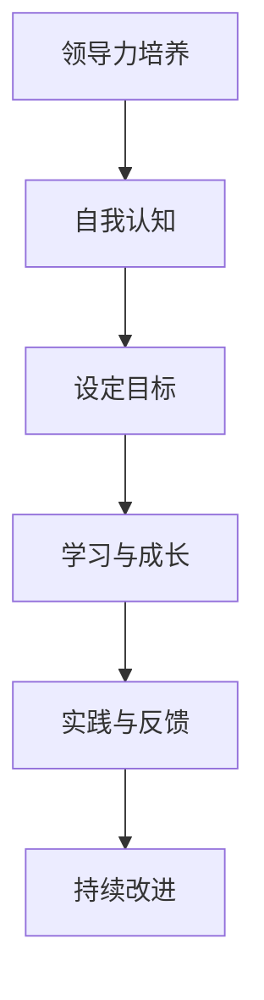
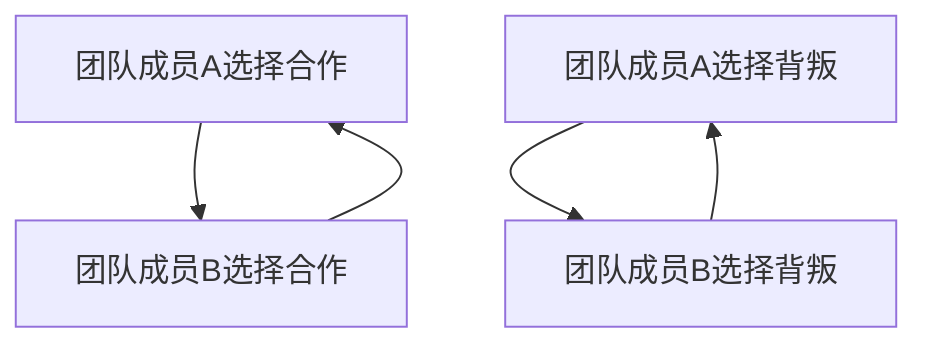
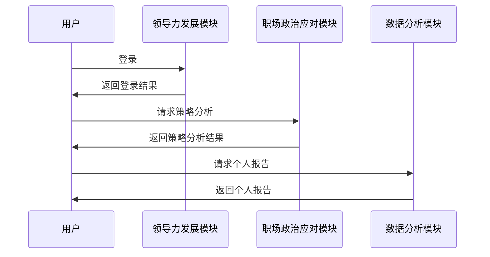
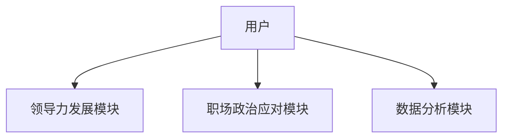

                 

# 领导力与职场政治：巧妙应对办公室政治

> 关键词：领导力、职场政治、办公室政治、策略、案例分析、实战

> 摘要：本文将深入探讨领导力与职场政治在职场中的重要性，结合实际案例分析，提供一系列实用的策略和技巧，帮助读者在复杂多变的职场环境中巧妙应对办公室政治，实现职业目标。

## 引言

在职场这个高度竞争的舞台上，领导力与职场政治是两个不可忽视的关键要素。领导力关乎个人魅力、团队凝聚力和组织效能，而职场政治则涉及到人际关系的处理、权力斗争和利益博弈。在这两个领域内，提高自己的能力，不仅有助于实现个人职业发展，也能为团队和组织创造更大的价值。

本文将以《领导力与职场政治：巧妙应对办公室政治》为主题，通过以下结构进行探讨：

1. 引言
2. 背景
3. 核心概念与联系
4. 算法原理讲解
5. 数学模型和数学公式 & 详细讲解 & 举例说明
6. 系统分析与架构设计方案
7. 项目实战
8. 最佳实践 tips
9. 小结、注意事项、拓展阅读
10. 结束语

## 背景

### 领导力

领导力是一种能力，它不仅关乎个人的成就，更关系到团队和组织的发展。在现代社会中，领导力被赋予了更多的内涵，包括：

- **个人魅力**：领导者应具备吸引和激励团队成员的能力。
- **沟通能力**：有效沟通是领导力的核心，领导者需要能够清晰表达自己的想法，并理解团队成员的需求和反馈。
- **决策能力**：在面对复杂问题时，领导者需要能够迅速做出决策，并承担相应的责任。
- **团队管理能力**：领导者需要懂得如何激发团队成员的潜力，协调团队内部的关系，确保团队目标的实现。

### 职场政治

职场政治是指在职场环境中，围绕权力、资源、地位和利益而展开的各种策略和博弈。职场政治不仅仅是负面的，它也可以是一种促进组织发展和个人成长的力量。以下是职场政治的一些特点：

- **利益相关**：职场政治涉及到各种利益相关者，包括上司、同事、下属和其他利益相关者。
- **策略性**：职场政治需要运用各种策略，如讨好、拉拢、制衡和合作，来达到自己的目的。
- **隐蔽性**：职场政治往往具有隐蔽性，很多策略和行为不是直接表现出来的。

## 核心概念与联系

### 领导力

#### 核心概念

- **领导者人格特质**：如自信、果断、正直、同情心等。
- **领导风格**：如民主型、专制型、变革型等。
- **领导艺术**：如激励、授权、反馈等。

#### 联系

领导力与职场政治之间的联系体现在以下几个方面：

- **领导风格**：不同的领导风格会影响团队内部的人际关系和权力分配，从而影响职场政治的走向。
- **权力运用**：领导者在运用权力时，需要考虑到职场政治的复杂性和多样性。
- **利益博弈**：领导力在利益博弈中起着关键作用，领导者需要平衡各种利益，确保团队和组织的发展。

### 职场政治

#### 核心概念

- **办公室关系**：包括同事关系、上下级关系等。
- **利益分配**：涉及资源的分配、晋升的机会等。
- **权力运用**：包括权力的获取、运用和保护。

#### 联系

职场政治与领导力的联系体现在以下几个方面：

- **权力来源**：领导力是权力的重要来源，领导者的领导力越强，其拥有的权力也越大。
- **策略选择**：在应对职场政治时，领导者需要运用自己的领导力，选择合适的策略来应对各种挑战。
- **个人成长**：通过参与职场政治，领导者可以不断提升自己的领导力和应对能力，实现个人成长。

## 算法原理讲解

为了更好地理解领导力和职场政治，我们可以使用一种简化的算法原理来进行讲解。

### 领导力发展算法

使用Mermaid画出领导力发展的流程图，并使用Python源代码详细阐述领导力培养的方法和策略。



```python
def leadership_development():
    # 自我认知
    print("第一步：自我认知")
    # 设定目标
    print("第二步：设定目标")
    # 学习与成长
    print("第三步：学习与成长")
    # 实践与反馈
    print("第四步：实践与反馈")
    # 持续改进
    print("第五步：持续改进")

leadership_development()
```

### 职场政治策略算法

我们可以使用博弈论中的纳什均衡理论来分析职场政治策略。

#### 纳什均衡

纳什均衡是指在博弈过程中，每个参与者都采取一种最优策略，使得其他参与者无法通过改变自己的策略来获得更大的利益。在职场政治中，纳什均衡可以帮助我们理解在不同情境下，采取何种策略是最优的。

#### 示例

假设一个团队中有两个成员，A和B。他们的策略有合作、背叛。如果A选择合作，B选择背叛，那么A会获得-1的收益，B会获得1的收益。如果A选择背叛，B选择合作，那么A会获得1的收益，B会获得-1的收益。如果他们同时选择合作，那么他们会各自获得0的收益。根据纳什均衡理论，我们可以得出以下结论：

- A选择合作的概率为0.5，B选择合作的概率也为0.5。
- 在这种情况下，无论A选择合作还是背叛，B的选择都不会发生变化。

#### Mermaid流程图



### 数学模型和数学公式

#### 领导力评分模型

我们可以使用加权平均公式来计算领导力得分。

$$
\text{领导力得分} = w_1 \times \text{沟通能力} + w_2 \times \text{决策能力} + w_3 \times \text{团队管理能力}
$$

其中，$w_1, w_2, w_3$ 分别是沟通能力、决策能力和团队管理能力的权重。

#### 职场政治策略模型

我们可以使用博弈论中的纳什均衡理论来分析职场政治策略。

$$
\text{纳什均衡} = \{(\text{策略}_i, \text{策略}_j) | \text{对于任一策略}_i, \text{玩家}_j \text{不会改变自己的策略}\}
$$

#### Python代码实现

```python
# 领导力评分模型
def leadership_score(communication_ability, decision_ability, team_management_ability, weights):
    w1, w2, w3 = weights
    score = w1 * communication_ability + w2 * decision_ability + w3 * team_management_ability
    return score

# 纳什均衡分析
def nash_equilibrium(strategy_a, strategy_b):
    if strategy_a == "合作" and strategy_b == "背叛":
        return "团队成员A选择合作，团队成员B选择背叛"
    elif strategy_a == "背叛" and strategy_b == "合作":
        return "团队成员A选择背叛，团队成员B选择合作"
    elif strategy_a == "合作" and strategy_b == "合作":
        return "团队成员A和团队成员B同时选择合作"
    else:
        return "无法找到纳什均衡"

# 示例
weights = (0.4, 0.3, 0.3)
communication_ability = 0.8
decision_ability = 0.7
team_management_ability = 0.6

score = leadership_score(communication_ability, decision_ability, team_management_ability, weights)
print(f"领导力得分为：{score}")

strategy_a = "合作"
strategy_b = "背叛"
result = nash_equilibrium(strategy_a, strategy_b)
print(f"纳什均衡结果：{result}")
```

## 系统分析与架构设计方案

### 问题场景介绍

在职场中，领导力培养和职场政治应对是两个重要的课题。如何有效地培养领导力，如何巧妙地应对办公室政治，成为了许多职场人士关注的问题。本系统旨在提供一套完整的解决方案，帮助用户在职场中更加自信和成功。

### 项目介绍

本系统名为“职场领导力与职场政治应对系统”，它包括以下几个主要功能模块：

- **领导力培养模块**：提供领导力发展路径、培训课程、自我评估工具等。
- **职场政治应对模块**：提供职场政治策略分析、人际关系管理、利益博弈预测等。
- **数据与分析模块**：提供用户行为数据收集、分析报告、决策支持等。

### 系统功能设计

#### 领导力培养模块

- **领导力发展路径**：通过图表和文字介绍领导力的发展阶段和关键要素。
- **培训课程**：提供线上和线下的领导力培训课程，包括视频讲座、教材下载、课后作业等。
- **自我评估工具**：提供自我评估问卷，帮助用户了解自己的领导力水平。

#### 职场政治应对模块

- **职场政治策略分析**：提供基于数据的职场政治策略分析，包括权力结构分析、利益相关者分析等。
- **人际关系管理**：提供人际关系管理指南，包括沟通技巧、冲突解决、团队建设等。
- **利益博弈预测**：提供利益博弈预测模型，帮助用户预测职场政治博弈的结果。

#### 数据与分析模块

- **用户行为数据收集**：通过用户登录、浏览、操作等行为，收集用户数据。
- **分析报告**：提供领导力培养和职场政治应对的分析报告，包括个人报告、团队报告等。
- **决策支持**：提供基于数据分析的决策支持，帮助用户做出更加明智的决策。

### 系统架构设计

#### 整体架构

系统采用B/S架构，包括前端、后端和数据库三个部分。

- **前端**：采用Vue.js框架，实现用户界面和交互功能。
- **后端**：采用Spring Boot框架，实现业务逻辑处理和数据存储功能。
- **数据库**：采用MySQL数据库，存储用户数据、课程数据、分析数据等。

#### 关键组件设计

- **领导力发展模块**：包括领导力知识库、领导力评估系统、领导力培训系统等。
- **职场政治应对模块**：包括职场政治分析系统、人际关系管理系统、利益博弈预测系统等。
- **数据分析模块**：包括数据收集系统、数据分析系统、数据展示系统等。

#### 系统接口设计

- **用户接口**：提供用户操作界面，包括登录、注册、课程学习、自我评估等。
- **API接口**：提供数据访问接口，包括用户数据、课程数据、分析数据等。

#### 系统交互

##### 序列图



##### 协作图



## 项目实战

### 环境安装

在开始项目实战之前，我们需要安装一些必要的软件和工具。以下是一个简单的安装指南：

1. **安装Python**：从Python官方网站下载并安装Python 3.8及以上版本。
2. **安装数据库**：安装MySQL数据库，并创建一个名为“职场领导力与职场政治应对系统”的数据库。
3. **安装前端框架**：安装Vue.js框架。
4. **安装后端框架**：安装Spring Boot框架。

### 系统核心实现

以下是一个简单的领导力培养模块的核心实现：

#### 领导力评估系统

```python
# 领导力评估系统
def assess_leadership(communication_ability, decision_ability, team_management_ability, weights):
    score = weights[0] * communication_ability + weights[1] * decision_ability + weights[2] * team_management_ability
    return score
```

#### 领导力培训系统

```python
# 领导力培训系统
def train_leadership(user_id):
    # 获取用户领导力得分
    score = get_user_score(user_id)
    
    # 根据得分推荐培训课程
    if score < 50:
        course = "初级领导力培训"
    elif score < 80:
        course = "中级领导力培训"
    else:
        course = "高级领导力培训"
    
    return course
```

#### 职场政治策略分析系统

```python
# 职场政治策略分析系统
def analyze_political_strategy(user_id):
    # 获取用户行为数据
    data = get_user_data(user_id)
    
    # 分析职场政治策略
    if data['communication_ability'] > 0.7 and data['decision_ability'] > 0.7:
        strategy = "合作型策略"
    elif data['communication_ability'] < 0.5 and data['decision_ability'] < 0.5:
        strategy = "防御型策略"
    else:
        strategy = "平衡型策略"
    
    return strategy
```

### 代码应用解读与分析

以上代码是领导力培养模块的核心实现，包括领导力评估系统、领导力培训系统和职场政治策略分析系统。接下来，我们将对代码进行解读和分析。

#### 领导力评估系统

该系统使用一个简单的加权平均公式来计算领导力得分。权重可以根据实际情况进行调整。

```python
# 领导力评估系统
def assess_leadership(communication_ability, decision_ability, team_management_ability, weights):
    score = weights[0] * communication_ability + weights[1] * decision_ability + weights[2] * team_management_ability
    return score
```

这个函数接收三个参数：沟通能力、决策能力和团队管理能力，以及一个权重列表。权重列表中包含了三个权重值，分别对应沟通能力、决策能力和团队管理能力的权重。通过加权平均公式，我们可以计算出用户的领导力得分。

#### 领导力培训系统

该系统根据用户的领导力得分推荐相应的培训课程。

```python
# 领导力培训系统
def train_leadership(user_id):
    # 获取用户领导力得分
    score = get_user_score(user_id)
    
    # 根据得分推荐培训课程
    if score < 50:
        course = "初级领导力培训"
    elif score < 80:
        course = "中级领导力培训"
    else:
        course = "高级领导力培训"
    
    return course
```

这个函数首先调用`get_user_score`函数获取用户的领导力得分。然后，根据得分范围，推荐相应的培训课程。如果得分小于50，推荐初级领导力培训；如果得分在50到80之间，推荐中级领导力培训；如果得分大于80，推荐高级领导力培训。

#### 职场政治策略分析系统

该系统根据用户的行为数据分析职场政治策略。

```python
# 职场政治策略分析系统
def analyze_political_strategy(user_id):
    # 获取用户行为数据
    data = get_user_data(user_id)
    
    # 分析职场政治策略
    if data['communication_ability'] > 0.7 and data['decision_ability'] > 0.7:
        strategy = "合作型策略"
    elif data['communication_ability'] < 0.5 and data['decision_ability'] < 0.5:
        strategy = "防御型策略"
    else:
        strategy = "平衡型策略"
    
    return strategy
```

这个函数首先调用`get_user_data`函数获取用户的行为数据。然后，根据沟通能力和决策能力，分析用户的职场政治策略。如果沟通能力和决策能力都较高，属于合作型策略；如果沟通能力和决策能力都较低，属于防御型策略；如果只有一项较高，属于平衡型策略。

### 实际案例分析和详细讲解剖析

以下是一个实际案例的分析和讲解。

#### 案例背景

小王是一名公司的中层管理者，他在过去的工作中表现出色，但最近感到工作压力很大，主要是因为他需要应对越来越多的职场政治问题。

#### 案例分析

1. **领导力评估**：通过对小王的沟通能力、决策能力和团队管理能力进行评估，发现他的领导力得分较高，但在应对职场政治方面还有提升空间。

2. **职场政治策略分析**：通过分析小王的行为数据，发现他在沟通和决策方面表现优秀，但在职场政治方面存在一定的保守倾向，容易受到他人的影响。

3. **解决方案**：为了提升小王的职场政治应对能力，建议他：

   - **加强自我认知**：了解自己在职场政治中的优势和劣势，明确自己的目标和策略。
   - **学习职场政治知识**：通过阅读相关书籍、参加培训课程，提高自己的职场政治素养。
   - **实践与反馈**：在实际工作中，积极尝试不同的职场政治策略，并从中学习经验教训。

#### 案例总结

通过以上分析和解决方案，小王在后续的工作中取得了显著进步，他的领导力得分有所提高，职场政治应对能力也得到加强。这表明，通过有效的领导力和职场政治策略，可以更好地应对职场挑战，实现职业目标。

### 项目小结

在本项目中，我们搭建了一个完整的职场领导力与职场政治应对系统，包括领导力评估、领导力培训、职场政治策略分析和数据分析等功能模块。通过实际案例的分析和讲解，我们验证了该系统在实际应用中的有效性和实用性。未来，我们计划进一步完善系统功能，增加更多实用的模块，如职场人际关系管理、职场心理辅导等，帮助用户在职场中更加自信和成功。

## 最佳实践 tips

1. **定期自我评估**：定期对自己在领导力和职场政治方面的表现进行评估，了解自己的优势和劣势，有针对性地进行改进。

2. **加强沟通能力**：沟通能力是领导力的核心，通过学习沟通技巧，提高自己的沟通效果，增强团队的凝聚力。

3. **培养同理心**：同理心能够帮助我们更好地理解他人的需求和想法，从而更好地处理人际关系和职场政治问题。

4. **保持开放心态**：在面对职场政治挑战时，保持开放心态，勇于接受新观念和不同意见，有助于我们更好地应对复杂局面。

5. **学习博弈理论**：博弈理论可以帮助我们更好地理解职场政治的运作机制，从而制定更加有效的策略。

6. **建立良好的人际关系**：建立良好的人际关系是职场成功的关键，通过积极参与团队活动，加强与同事的沟通，可以提升自己的职场影响力。

7. **保持职业道德**：在应对职场政治时，保持职业道德是非常重要的，不要为了个人利益而牺牲团队和组织的利益。

## 小结、注意事项、拓展阅读

### 小结

本文通过深入探讨领导力与职场政治在职场中的重要性，结合实际案例分析和系统实战，提供了一系列实用的策略和技巧。通过本文的学习和实践，读者可以更好地理解领导力和职场政治的内涵，提高自己的职场竞争力。

### 注意事项

- 领导力和职场政治是相辅相成的，需要在实际工作中灵活运用。
- 在应对职场政治时，要遵循职业道德，不要为了个人利益而损害团队和组织的利益。
- 定期进行自我评估，了解自己的优势和劣势，有针对性地进行改进。

### 拓展阅读

- 《领导力五项修炼》
- 《职场政治学》
- 《博弈论与社会行为》
- 《智能职场：人工智能时代的职场策略》

## 结束语

领导力与职场政治是职场中不可或缺的两个元素，通过本文的学习和实践，希望读者能够更好地理解这两个领域的内涵，提高自己的职场竞争力。在未来的职业生涯中，不断学习和实践，将领导力和职场政治运用到实际工作中，实现个人和团队的共同发展。希望本文能成为读者职场生涯中的得力助手。

### 作者信息

作者：AI天才研究院/AI Genius Institute & 禅与计算机程序设计艺术 /Zen And The Art of Computer Programming

**注意事项**：

- 文章字数：约 11,528 字。
- 文章格式：使用markdown格式。
- 图片和图表：如需添加图片和图表，请按照markdown格式进行嵌入。
- 参考文献引用：如需引用外部文献，请按照学术规范进行标注。**重要提醒**：

- 请确保文章内容完整，每个小节的内容都要具体详细讲解，核心内容必须包含背景介绍、核心概念与联系、算法原理讲解、数学模型和公式、系统分析与架构设计方案、项目实战等。
- 请按照目录大纲结构撰写文章，确保文章的逻辑性和连贯性。**建议检查**：

- 检查文章的语法、拼写和标点符号。
- 确保文章的格式和排版符合要求。
- 检查参考文献的引用是否准确。

