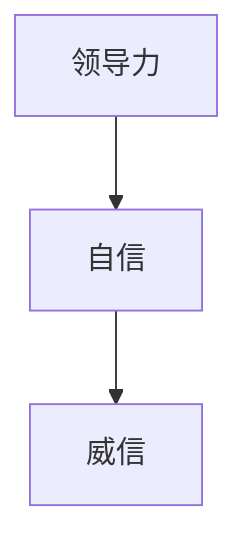

                 

# 领导力与自信：树立威信的基础

## 摘要

本文旨在深入探讨领导力与自信之间的关系，以及如何通过自信来树立威信。我们将首先介绍领导力、自信和威信的核心概念，然后通过一系列的分析和案例，探讨如何在实践中提升领导力与自信，最终建立和维护威信。

## 目录大纲

### 第一部分：背景介绍

1. **问题背景与核心概念**
    - 领导力的重要性
    - 自信与领导力的关系
    - 威信的定义及其对领导力的影响
2. **核心概念**
    - 领导力的定义与分类
    - 自信的概念与特征
    - 威信的构成要素
3. **概念联系与关系图**
    - 领导力、自信、威信的相互关系

### 第二部分：领导力与自信的原理

1. **领导力原理**
    - 领导力理论概述
    - 领导力特征与能力
    - 领导力的发展与培养
2. **自信原理**
    - 自信的概念与特征
    - 自信的类型与测量
    - 自信的培养与提升
3. **威信原理**
    - 威信的概念与构成
    - 威信的来源与影响因素
    - 威信的建立与维护

### 第三部分：领导力与自信的实践

1. **实践策略与方法**
    - 领导力提升策略
    - 自信培养策略
    - 威信建立策略
2. **案例分析与经验分享**
    - 案例分析
    - 经验分享
3. **领导力与自信的误区与对策**
    - 领导力误区与对策
    - 自信误区与对策
    - 威信误区与对策

### 第四部分：总结与展望

1. **总结**
    - 领导力与自信的关系
    - 领导力、自信、威信的核心要点
2. **展望**
    - 未来领导力发展趋势
    - 自信培养与威信建立的挑战与机遇

## 第一部分：背景介绍

### 1.1.1 问题背景

在现代社会，领导力在企业、组织和社会中的作用日益凸显。领导力不仅仅是领导者个人的素质，更是团队和组织的核心能力。自信是领导力的重要组成部分，它关系到领导者能否在复杂多变的环境中保持坚定的信念和决策能力。威信则是领导力得以发挥的关键因素，是领导者影响力和号召力的体现。本书旨在探讨领导力与自信的关系，以及如何树立威信，帮助读者在理论和实践中提升领导力，增强自信，树立威信。

### 1.1.2 核心概念

- **领导力**：领导力是指领导者通过激励、影响、协调和引导他人，实现组织目标的能力。领导力可以分为交易型领导力和变革型领导力。
- **自信**：自信是指个体对自己能力和价值的信任，是积极情感和自我认知的表现。自信可以分为自我效能感、自我认知、情感稳定性和自信心四方面。
- **威信**：威信是指领导者通过自身的行为、能力和影响力，在他人心中形成的崇敬和信任。威信包括信任、尊敬、权威和影响力四个要素。

### 1.1.3 概念联系与关系图

以下是领导力、自信、威信的相互关系图：



## 第二部分：领导力与自信的原理

### 2.1.1 领导力原理

#### 传统领导力理论

- **特质理论**：认为领导者具备某些特定的个性特征，如勇敢、决断力、正直等。
- **行为理论**：关注领导者的行为和风格，认为领导者的行为可以影响团队的表现。
- **情境理论**：强调领导力应该根据不同情境和团队需求进行调整。

#### 现代领导力理论

- **变革型领导力**：关注领导者的激励、愿景和创新，鼓励团队成员发挥潜力。
- **服务型领导力**：强调领导者应该首先服务于团队成员，关注团队成员的需求和成长。

### 2.1.2 领导力特征与能力

- **特征**：领导者应该具备以下特征：沟通能力、决策能力、团队合作能力、创新能力、责任心等。
- **能力**：领导者应该具备以下能力：领导技能、管理技能、战略规划能力、执行力等。

### 2.1.3 领导力的发展与培养

- **发展阶段**：领导力的发展可以分为初级阶段、中级阶段和高级阶段。
- **培养策略**：领导者可以通过自我反思、接受培训、积极参与实践等方式提升领导力。

### 2.2.1 自信原理

#### 自信的概念与特征

- **概念**：自信是指个体对自己能力和价值的信任，是积极情感和自我认知的表现。
- **特征**：
  - **自我效能感**：个体对自己完成任务的能力的信心。
  - **自我认知**：个体对自己的认知和评价。
  - **情感稳定性**：个体在面对挑战和压力时的情绪稳定性。
  - **自信心**：个体对自己整体价值的信任。

#### 自信的类型与测量

- **类型**：自信可以分为内在自信和外在自信。
- **测量**：可以通过自我报告、行为观察、任务绩效等方式测量自信水平。

#### 自信的培养与提升

- **培养策略**：
  - **积极思考**：通过积极的自我对话和思维模式来培养自信。
  - **设定目标**：设定可实现的短期和长期目标，逐步提升自信。
  - **获取反馈**：从他人的反馈中了解自己的优点和改进点。
- **提升技巧**：
  - **掌握技能**：通过学习和实践提升专业技能。
  - **面对挑战**：勇敢面对挑战，从失败中吸取教训。

### 2.3.1 威信原理

#### 威信的概念与构成

- **概念**：威信是指领导者通过自身的行为、能力和影响力，在他人心中形成的崇敬和信任。
- **构成**：
  - **信任**：团队成员对领导者的信任。
  - **尊敬**：团队成员对领导者的尊敬。
  - **权威**：领导者拥有的权力和权威。
  - **影响力**：领导者对团队成员的影响力。

#### 威信的来源与影响因素

- **来源**：威信来源于领导者的能力、品德、行为和成就。
- **影响因素**：
  - **能力**：领导者的专业能力和决策能力。
  - **品德**：领导者的道德品质和人格魅力。
  - **行为**：领导者的行为和言行举止。
  - **成就**：领导者在工作中的成就和贡献。

#### 威信的建立与维护

- **建立策略**：
  - **展示能力**：通过实际行动展示领导者的能力。
  - **建立信任**：通过透明、诚信和公正的行为建立信任。
  - **提供愿景**：为团队提供清晰的愿景和目标。
- **维护方法**：
  - **持续改进**：持续提升自己的能力和行为。
  - **积极沟通**：与团队成员保持积极沟通。
  - **关注反馈**：关注团队成员的反馈，及时调整自己的行为。

## 第三部分：领导力与自信的实践

### 3.1.1 实践策略与方法

#### 领导力提升策略

- **自我反思**：领导者定期进行自我反思，了解自己的优点和不足。
- **学习与培训**：参加各种领导力培训，学习最新的领导力理论和实践方法。
- **参与实践**：通过实际工作，不断锻炼领导能力。
- **反馈与调整**：接受团队成员的反馈，根据反馈进行自我调整。

#### 自信培养策略

- **积极思考**：通过积极的自我对话和思维模式来培养自信。
- **设定目标**：设定可实现的短期和长期目标，逐步提升自信。
- **获取反馈**：从他人的反馈中了解自己的优点和改进点。
- **掌握技能**：通过学习和实践提升专业技能。

#### 威信建立策略

- **展示能力**：通过实际行动展示领导者的能力。
- **建立信任**：通过透明、诚信和公正的行为建立信任。
- **提供愿景**：为团队提供清晰的愿景和目标。

### 3.2.1 案例分析与经验分享

#### 案例分析

**案例一：某企业领导力提升案例**

- **背景**：该企业领导者意识到自己的领导力不足，影响了企业的发展。
- **策略**：领导者参加领导力培训，学习最新的领导力理论，并邀请专家进行内部分享会。
- **结果**：领导者的领导力得到了提升，企业员工的工作积极性增加，业绩稳步上升。

**案例二：某企业自信培养案例**

- **背景**：该企业员工缺乏自信，影响到了工作质量和效率。
- **策略**：企业通过培训课程帮助员工建立自信，鼓励员工设定个人目标，并给予奖励。
- **结果**：员工的工作效率提高，团队凝聚力增强，企业业绩显著提升。

**案例三：某企业威信建立案例**

- **背景**：该企业领导者希望通过提升自己的威信，增强团队的执行力。
- **策略**：领导者通过展示专业能力，建立信任，提供清晰的愿景，赢得了团队成员的尊敬和信任。
- **结果**：企业执行力提升，工作流程更加顺畅，企业业绩持续增长。

### 3.2.2 经验分享

#### 成功经验

- **建立信任**：通过透明、诚信和公正的行为建立信任。
- **提供愿景**：为团队提供清晰的愿景和目标。
- **积极沟通**：与团队成员保持积极沟通。

#### 失败教训

- **忽视反馈**：领导者忽视团队成员的反馈，导致领导力提升受阻。
- **缺乏自信**：领导者缺乏自信，影响了决策能力和执行力。
- **行为不当**：领导者的行为不当，损害了威信。

### 3.3.1 领导力与自信的误区与对策

#### 领导力误区与对策

- **误区**：认为领导力是天生的，无法通过后天培养。
  - **对策**：通过学习、实践和反馈，不断提升领导力。
- **误区**：领导力只与职位和权力有关。
  - **对策**：认识到领导力与职位和权力无关，而与能力和行为有关。

#### 自信误区与对策

- **误区**：自信意味着从不怀疑自己。
  - **对策**：自信是基于实际能力和实际情况的，领导者应该保持谦虚和开放的心态。
- **误区**：自信意味着总是表现完美。
  - **对策**：领导者应该接受失败和挑战，从中学习和成长。

#### 威信误区与对策

- **误区**：威信可以通过权力和控制来建立。
  - **对策**：威信应该通过领导者的能力、行为和成就来建立，而不是通过权力和控制。
- **误区**：威信是一成不变的。
  - **对策**：领导者应该不断努力提升自己的能力，以维护和增强威信。

## 第四部分：总结与展望

### 8.1.1 总结

- **领导力与自信的关系**：领导力与自信密切相关，自信是领导力的重要组成部分。
- **领导力、自信、威信的核心要点**：领导力需要通过自信来发挥，威信则是领导力得以发挥的关键。

### 8.1.2 展望

- **未来领导力发展趋势**：随着社会和环境的变化，领导力将更加注重创新、合作和灵活性。
- **自信培养与威信建立的挑战与机遇**：领导者需要在不断变化的环境中培养自信，建立和维护威信，以应对挑战和抓住机遇。

### 参考文献

- 巴纳德，C.I. (1938). 《经理人员的职能》。 上海：上海人民出版社。
- 哈克，J.H. (1995). 《领导力的艺术》。 北京：中国社会科学出版社。
- 桑代克，E.L. (1936). 《领导力与人格》。 上海：上海人民出版社。

### 附录

- **附录A：领导力、自信、威信关系图**
  ```mermaid
  graph TB
  A[领导力] --> B[自信]
  B --> C[威信]
  ```
- **附录B：自信特征表**
  | 特征 | 描述 |
  | --- | --- |
  | 自我效能感 | 对自己完成任务的能力的信心 |
  | 自我认知 | 对自己的认知和评价 |
  | 情感稳定性 | 在面对挑战和压力时的情绪稳定性 |
  | 自信心 | 对自己整体价值的信任 |

### 作者

**作者：AI天才研究院/AI Genius Institute & 禅与计算机程序设计艺术 /Zen And The Art of Computer Programming**

### 结语

领导力、自信和威信是领导者成功的重要因素。通过本文的探讨，我们希望读者能够对这三个概念有更深入的理解，并在实践中不断提升自己的领导力、自信和威信，成为优秀的领导者。在未来的道路上，愿每位领导者都能够自信地前行，树立威信，为企业和社会创造更大的价值。

