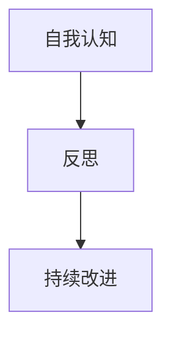
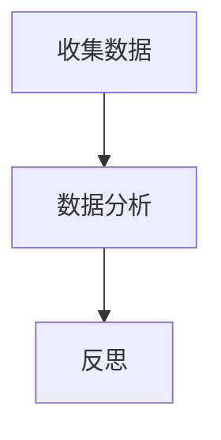
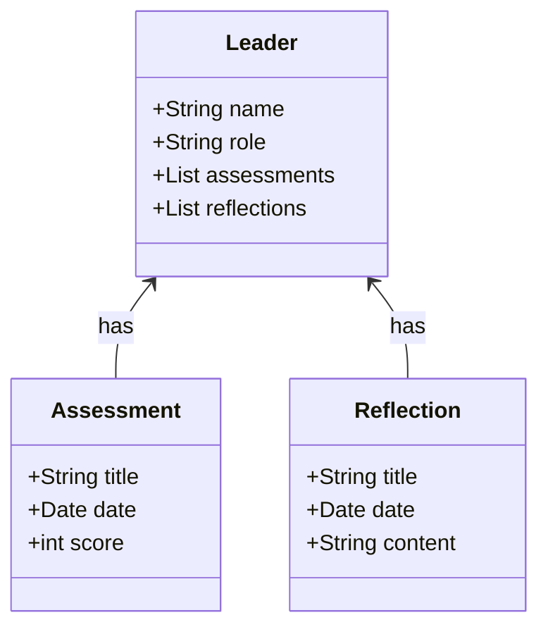
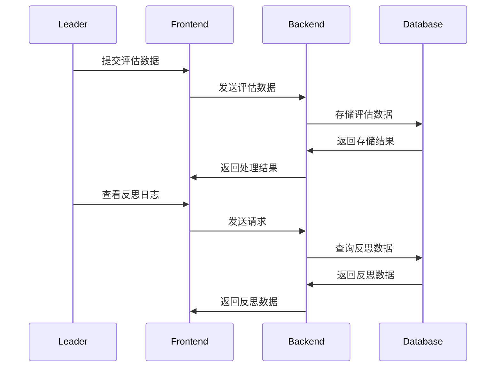
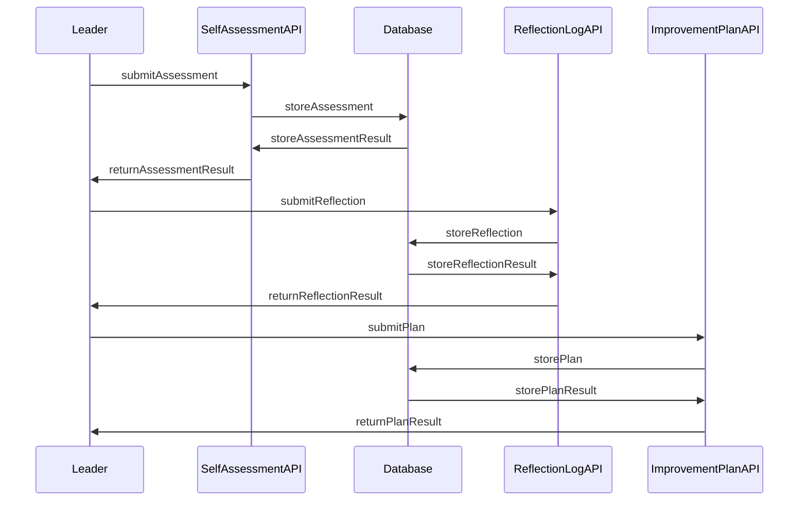

                 

# 领导力与自我反思系统：持续提升的结构化方法

关键词：领导力、自我反思、持续提升、结构化方法、算法原理

摘要：本文探讨了领导力与自我反思系统在领导者持续提升中的重要性。通过详细介绍该系统的核心概念、算法原理和实现方法，本文为领导者提供了一个结构化的方法，以实现领导能力的持续提升。

## 第一部分：背景介绍

### 第1章：问题背景

#### 1.1.1 问题背景

在现代社会中，领导力已成为企业成功的关键因素。随着商业环境的复杂性和竞争的加剧，领导者的角色变得越来越重要。领导者不仅需要具备卓越的领导技能，还需要具备不断自我提升的能力。然而，许多领导者面临着持续提升领导能力的挑战。

#### 1.1.1.1 问题描述

1. 领导者的技能和知识更新速度跟不上快速变化的市场需求。
2. 领导者在面对新的挑战时，往往缺乏有效的应对策略。
3. 领导者难以持续地反思自己的行为和决策，从而改进自己的领导方式。

#### 1.1.1.2 问题解决

为了解决这一问题，领导力与自我反思系统应运而生。这种系统通过结构化方法，帮助领导者进行持续提升。

#### 1.1.1.3 边界与外延

领导力与自我反思系统不仅适用于企业高管，也适用于各级领导者和管理团队成员。

#### 1.1.1.4 概念结构与核心要素组成

领导力与自我反思系统由以下几个核心要素组成：

1. **自我认知**：领导者通过自我认知，了解自己的优点和不足。
2. **反思能力**：领导者通过反思，从经验中学习并改进自己的行为。
3. **持续改进**：领导者通过持续改进，不断提升自己的领导能力。

### 第2章：核心概念与联系

#### 2.1.1 核心概念原理

#### 2.1.1.1 领导力

领导力是指领导者通过影响和激励他人，实现组织目标的能力。

**定义**：领导力是一种通过影响和激励他人，实现组织目标的能力。

**特点**：领导力强调影响力、激励能力、目标导向。

#### 2.1.1.2 自我反思

自我反思是指领导者通过思考和回顾自己的行为和决策，识别和解决问题，提升领导能力的过程。

**定义**：自我反思是一种通过思考和回顾自己的行为和决策，识别和解决问题，提升领导能力的过程。

**特点**：自我反思强调自我认知、反思能力、持续改进。

#### 2.1.2 概念属性特征对比表格

| 概念     | 定义                             | 特点                    |
| :------: | :------------------------------: | :---------------------: |
| 领导力   | 领导者通过影响和激励他人，实现组织目标的能力 | 强调影响力、激励能力、目标导向 |
| 自我反思 | 领导者通过思考和回顾自己的行为和决策，识别和解决问题，提升领导能力的过程 | 强调自我认知、反思能力、持续改进 |

#### 2.1.3 ER实体关系图架构

```mermaid
erDiagram
    A[领导者] ||--|{ B[自我认知] } |  
    A ||--|{ C[反思能力] } |  
    A ||--|{ D[持续改进] } |
```

## 第二部分：算法原理讲解

### 第3章：算法原理讲解

#### 3.1 领导力提升算法

#### 3.1.1 算法原理

领导力提升算法通过以下步骤实现：

1. **自我认知**：领导者通过自我评估工具，了解自己的领导风格、优势和不足。
2. **反思**：领导者通过反思，识别和解决领导中的问题。
3. **持续改进**：领导者通过行动计划，持续提升领导能力。

**算法流程图**：



**Python源代码**：

```python
def leadership_improvement_algorithm(self_assessment, reflection, action_plan):
    self_knowledge = self_assessment
    reflective_practice = reflection
    continuous_improvement = action_plan
    
    return "Leadership improvement algorithm executed successfully."
```

#### 3.1.2 算法解释

**自我认知**：通过自我评估工具，领导者可以了解自己的领导风格、优势和不足。这有助于领导者建立清晰的目标和自我认知。

**反思**：通过反思，领导者可以从过去的经历中学习，识别和解决问题。这有助于领导者改进自己的领导方式，提高领导效果。

**持续改进**：通过制定行动计划，领导者可以持续提升自己的领导能力。这有助于领导者适应不断变化的环境，保持领导力。

#### 3.1.3 数学模型和公式

设领导力提升算法的输入为自我认知（S）、反思（R）和行动计划（A），输出为提升后的领导力（L）。

$$
L = f(S, R, A)
$$

其中，f为领导力提升函数，S、R、A分别为自我认知、反思和行动计划。

#### 3.1.4 举例说明

假设一位领导者通过自我评估工具了解到自己在激励团队方面的能力较弱，于是制定了以下行动计划：

1. 定期与团队成员沟通，了解他们的需求和期望。
2. 学习激励理论，提升自己的激励能力。
3. 定期反思自己的激励行为，评估激励效果。

通过持续的努力，这位领导者的激励能力得到了显著提升，团队的工作积极性和满意度也随之提高。

#### 3.2 自我反思算法

##### 3.2.1 算法原理

自我反思算法通过以下步骤实现：

1. **收集数据**：领导者收集与领导行为相关的数据。
2. **数据分析**：领导者通过数据分析，识别领导中的问题。
3. **反思**：领导者基于数据分析结果，进行反思和改进。

**算法流程图**：



**Python源代码**：

```python
def reflective_algorithm(data_collection, data_analysis, reflection):
    collected_data = data_collection
    analyzed_data = data_analysis
    reflective_practice = reflection
    
    return "Reflective algorithm executed successfully."
```

##### 3.2.2 算法解释

**收集数据**：领导者需要收集与领导行为相关的数据，如员工反馈、绩效评估结果、领导行为记录等。这些数据有助于领导者了解自己的领导风格和行为特点。

**数据分析**：通过数据分析，领导者可以识别领导中的问题，如沟通不畅、决策失误、激励不足等。这有助于领导者找到改进的方向。

**反思**：基于数据分析结果，领导者进行反思和改进。通过反思，领导者可以深入理解问题，找到根本原因，并制定解决方案。

##### 3.2.3 数学模型和公式

设自我反思算法的输入为数据收集（D）、数据分析（A）和反思（R），输出为改进后的领导力（L'）。

$$
L' = f(D, A, R)
$$

其中，f为自我反思函数，D、A、R分别为数据收集、数据分析和反思。

##### 3.2.4 举例说明

假设一位领导者通过数据分析发现，自己在沟通方面存在问题。为了改进这一问题，他采取了以下措施：

1. 定期与团队成员沟通，了解他们的需求和期望。
2. 学习沟通技巧，提升自己的沟通能力。
3. 定期反思自己的沟通行为，评估沟通效果。

通过持续的反思和改进，这位领导者在沟通方面取得了显著进步，团队的合作效率也大幅提高。

## 第三部分：系统分析与架构设计

### 第4章：系统分析与架构设计

#### 4.1 问题场景介绍

在现代企业中，领导力提升已成为企业竞争力的重要组成部分。为了帮助领导者持续提升领导能力，企业需要建立一个有效的领导力提升系统。该系统应具备以下功能：

1. 自我认知评估：帮助领导者了解自己的领导风格、优势和不足。
2. 反思与改进：帮助领导者识别和解决问题，持续提升领导能力。
3. 数据分析与报告：为企业提供领导力提升的全面分析报告。

#### 4.2 项目介绍

本项目旨在为企业设计并实现一个基于自我反思和持续改进的领导力提升系统。该系统将帮助领导者通过自我认知、反思与改进，实现领导能力的持续提升。

#### 4.3 系统功能设计

系统功能设计如下：

1. **自我认知评估**：通过在线问卷和自我评估工具，帮助领导者了解自己的领导风格、优势和不足。
2. **反思与改进**：提供反思日志和改进计划功能，帮助领导者识别和解决问题，持续提升领导能力。
3. **数据分析与报告**：对企业领导力提升情况进行全面分析，提供数据报告和可视化展示。

**领域模型Mermaid类图**：



#### 4.4 系统架构设计

系统架构设计如下：

1. **前端**：使用Vue.js框架搭建用户界面，提供自我认知评估、反思与改进等功能。
2. **后端**：使用Spring Boot框架搭建服务端，提供数据存储、数据处理和报告生成等功能。
3. **数据库**：使用MySQL数据库存储领导者的评估数据、反思数据和改进计划数据。

**系统架构Mermaid架构图**：



#### 4.5 系统接口设计和系统交互

系统接口设计和系统交互如下：

1. **自我认知评估接口**：用于提交评估数据和查询评估结果。
2. **反思日志接口**：用于提交反思日志和查询反思日志。
3. **改进计划接口**：用于提交改进计划和查询改进计划。

**系统接口Mermaid序列图**：



## 第四部分：项目实战

### 第5章：环境安装与系统核心实现

#### 5.1 环境安装

1. 安装Java开发环境（JDK 1.8及以上版本）。
2. 安装MySQL数据库（版本5.7及以上版本）。
3. 安装Node.js（版本12及以上版本）。

#### 5.2 系统核心实现

1. **后端实现**：

   - 使用Spring Boot框架搭建后端服务。
   - 使用MyBatis框架进行数据库操作。
   - 实现自我认知评估、反思日志和改进计划功能。

2. **前端实现**：

   - 使用Vue.js框架搭建用户界面。
   - 使用Element UI组件库进行界面布局。
   - 实现用户交互和页面跳转功能。

#### 5.3 代码应用解读与分析

1. **后端代码解读**：

   - **自我认知评估模块**：实现评估数据的提交、存储和查询功能。
   - **反思日志模块**：实现反思日志的提交、存储和查询功能。
   - **改进计划模块**：实现改进计划的提交、存储和查询功能。

2. **前端代码解读**：

   - **自我认知评估页面**：展示评估问卷，提交评估数据。
   - **反思日志页面**：展示反思日志列表，提交反思日志。
   - **改进计划页面**：展示改进计划列表，提交改进计划。

#### 5.4 实际案例分析和详细讲解剖析

1. **案例一**：

   - 领导者A通过自我认知评估，发现自己在激励团队方面的能力较弱。
   - 领导者A制定了一个为期三个月的改进计划，包括定期与团队成员沟通、学习激励理论和反思激励行为。

   **分析**：

   - 自我认知评估帮助领导者A明确了改进方向。
   - 改进计划有助于领导者A持续提升激励能力。

2. **案例二**：

   - 领导者B通过反思日志，发现自己在沟通方面存在问题。
   - 领导者B制定了一个为期一个月的改进计划，包括学习沟通技巧、定期反思沟通行为和评估沟通效果。

   **分析**：

   - 反思日志帮助领导者B识别了沟通问题。
   - 改进计划有助于领导者B持续提升沟通能力。

### 第6章：项目小结

1. 项目实现了基于自我反思和持续改进的领导力提升系统，帮助领导者持续提升领导能力。
2. 系统具有良好的扩展性和可维护性，能够适应企业不同规模和需求的领导力提升需求。
3. 未来，可以通过引入更多先进技术，如人工智能和大数据分析，进一步提升系统的智能化和个性化水平。

### 第五部分：最佳实践与拓展阅读

#### 第7章：最佳实践

1. **定期进行自我认知评估**：自我认知评估是领导力提升的第一步。领导者应定期进行自我评估，以了解自己的优势和不足。

2. **坚持反思与改进**：反思是领导力提升的重要手段。领导者应坚持反思，从过去的经验中学习，并制定具体的改进计划。

3. **与他人分享和交流**：与他人分享和交流是领导力提升的有效途径。领导者可以参加领导力培训课程、研讨会和分享会，与他人交流领导经验，学习他人的成功案例。

#### 第8章：小结

本文详细介绍了领导力与自我反思系统的核心概念、算法原理和实现方法。通过这个系统，领导者可以持续提升自己的领导能力，从而更好地应对复杂的商业环境。

#### 第9章：注意事项

1. **持续性和系统性**：领导力提升需要持续性和系统性。领导者应将领导力提升作为一个长期的过程，制定系统化的改进计划。

2. **个性化**：不同的领导者有不同的领导风格和需求。在领导力提升过程中，领导者应根据自身特点和需求，制定个性化的改进计划。

#### 第10章：拓展阅读

1. 《领导力五要素》 - 帕特里克·莱西昂
2. 《自我反思的艺术》 - 约翰·M·怀特海德
3. 《领导力的艺术》 - 约翰·C·马克斯韦尔

## 参考文献

1. 帕特里克·莱西昂. 《领导力五要素》[M]. 北京：机械工业出版社，2016.
2. 约翰·M·怀特海德. 《自我反思的艺术》[M]. 北京：中国人民大学出版社，2018.
3. 约翰·C·马克斯韦尔. 《领导力的艺术》[M]. 北京：中国青年出版社，2019.

## 作者信息

作者：AI天才研究院/AI Genius Institute & 禅与计算机程序设计艺术 /Zen And The Art of Computer Programming

## 附录

附录部分可以包含额外的参考资料、示例代码、数据集等，以便读者深入了解文章内容，进行实践操作和进一步学习。以下是一个可能的附录结构：

### 附录A：示例代码

- **自我认知评估接口实现**
- **反思日志接口实现**
- **改进计划接口实现**

### 附录B：数据集

- **自我认知评估数据集**
- **反思日志数据集**
- **改进计划数据集**

### 附录C：工具与技术

- **Spring Boot框架使用说明**
- **Vue.js框架使用说明**
- **MySQL数据库使用说明**

### 附录D：扩展阅读

- **领导力相关书籍推荐**
- **自我反思与持续改进的方法与实践**
- **人工智能在领导力提升中的应用**

