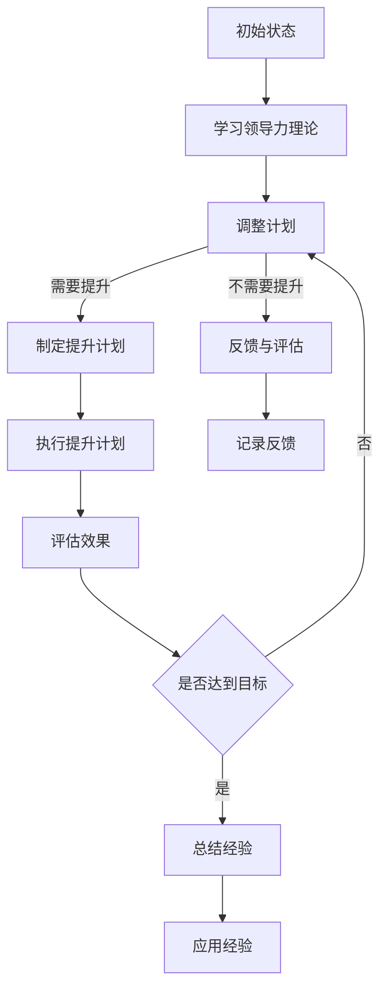
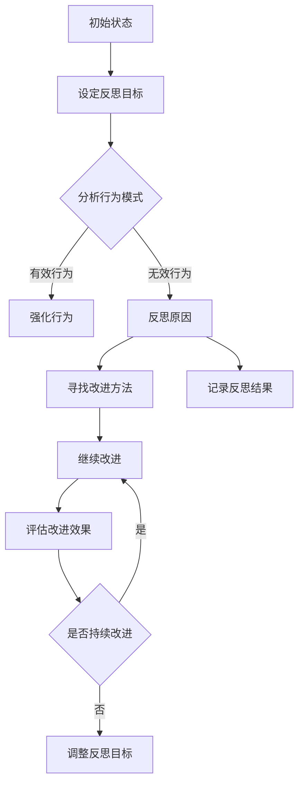
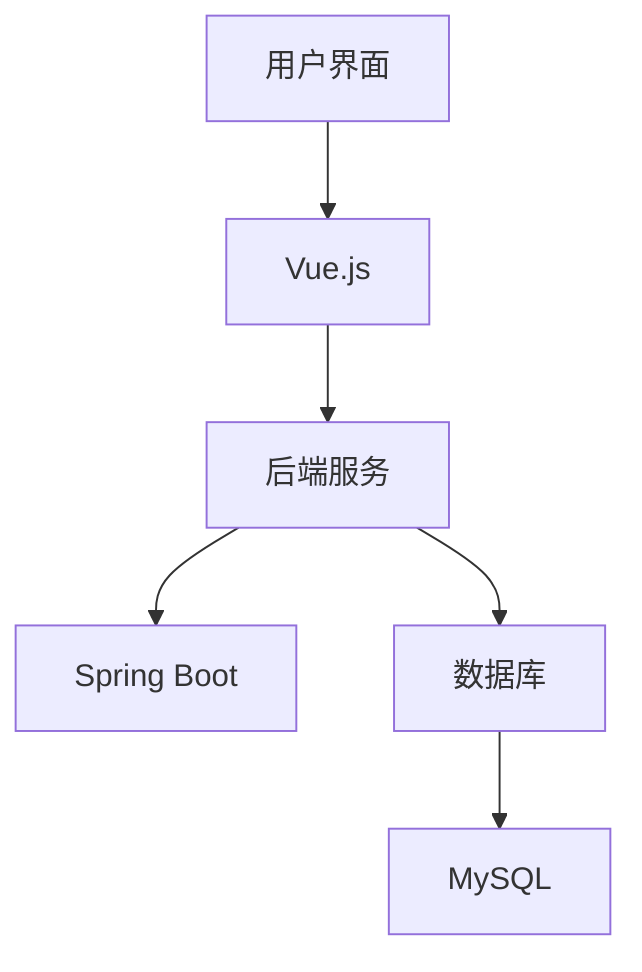
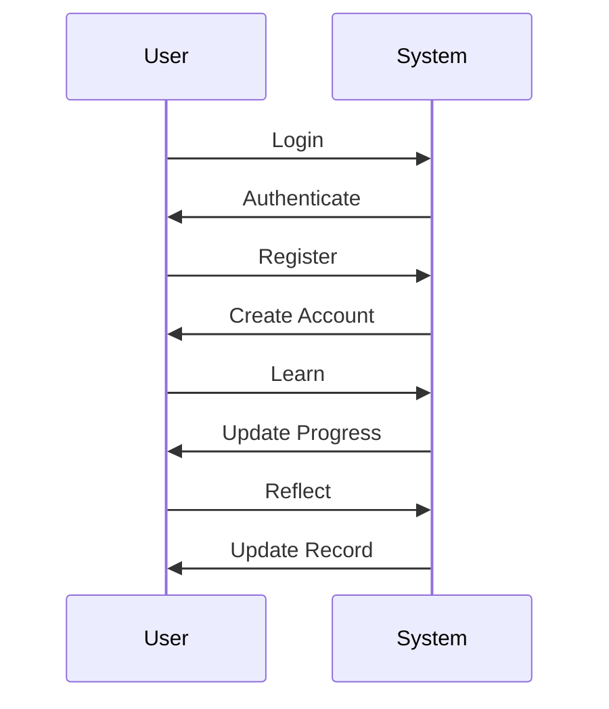
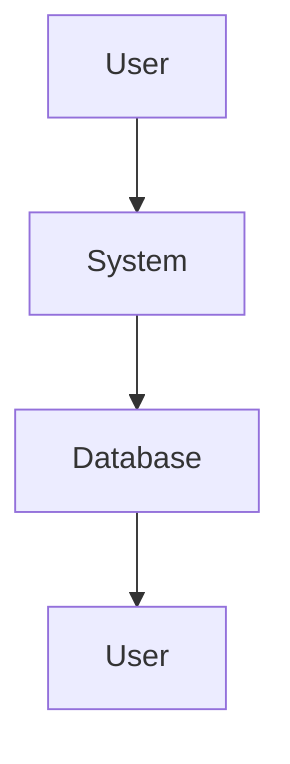

                 

# 领导力与自我反思：持续成长的关键

## 关键词

- 领导力
- 自我反思
- 持续成长
- IT领域
- 算法
- 系统架构

## 摘要

在快速变化的IT领域中，领导力和自我反思是持续成长的关键。本文通过逐步分析，探讨了领导力的重要性、自我反思的价值以及二者在IT领域的实际应用。文章首先介绍了领导力和自我反思的基本概念和核心要素，然后通过算法和系统架构设计的方法，展示了如何在实际项目中提升领导力和自我反思能力。最后，文章提出了最佳实践和建议，为读者提供了实用的指导。

### 目录大纲

# 领导力与自我反思：持续成长的关键

## 第一部分 背景介绍

### 1.1 问题背景

- 1.1.1 领导力的重要性
- 1.1.2 自我反思的价值

### 1.2 问题描述

- 1.2.1 领导力不足的表现
- 1.2.2 自我反思不足的影响

### 1.3 问题解决

- 1.3.1 提升领导力的方法
- 1.3.2 自我反思的实践

### 1.4 边界与外延

- 1.4.1 领导力的定义与内涵
- 1.4.2 自我反思的定义与内涵

### 1.5 概念结构与核心要素组成

- 1.5.1 领导力的核心要素
- 1.5.2 自我反思的核心要素

### 1.6 本章小结

## 第二部分 核心概念与联系

### 2.1 领导力的概念

- 2.1.1 领导力的定义
- 2.1.2 领导力的特性

### 2.2 自我反思的概念

- 2.2.1 自我反思的定义
- 2.2.2 自我反思的类型

### 2.3 领导力与自我反思的联系

- 2.3.1 自我反思在领导力发展中的作用
- 2.3.2 领导力对自我反思的影响

### 2.4 核心概念属性特征对比表格

### 2.5 ER实体关系图架构

## 第三部分 算法原理讲解

### 3.1 提升领导力的算法

- 3.1.1 算法原理
- 3.1.2 算法流程图
- 3.1.3 Python源代码

### 3.2 自我反思的算法

- 3.2.1 算法原理
- 3.2.2 算法流程图
- 3.2.3 Python源代码

### 3.3 算法原理的数学模型与公式

- 3.3.1 数学模型
- 3.3.2 数学公式

### 3.4 举例说明

- 3.4.1 领导力提升的案例
- 3.4.2 自我反思的案例

## 第四部分 系统分析与架构设计方案

### 4.1 问题场景介绍

- 4.1.1 领导力提升的场景
- 4.1.2 自我反思的场景

### 4.2 项目介绍

- 4.2.1 项目背景
- 4.2.2 项目目标

### 4.3 系统功能设计

- 4.3.1 领导力提升模块
- 4.3.2 自我反思模块

### 4.4 系统架构设计

- 4.4.1 系统架构图
- 4.4.2 系统模块交互

### 4.5 系统接口设计

- 4.5.1 接口规范
- 4.5.2 接口实现

### 4.6 系统交互

- 4.6.1 序列图
- 4.6.2 协作图

## 第五部分 项目实战

### 5.1 环境安装

- 5.1.1 环境准备
- 5.1.2 环境配置

### 5.2 系统核心实现源代码

- 5.2.1 源代码解析
- 5.2.2 代码解读与分析

### 5.3 实际案例分析和详细讲解剖析

- 5.3.1 案例背景
- 5.3.2 案例分析
- 5.3.3 案例详细讲解

### 5.4 项目小结

## 第六部分 最佳实践

### 6.1 最佳实践 tips

- 6.1.1 提升领导力的技巧
- 6.1.2 自我反思的方法

### 6.2 小结

### 6.3 注意事项

- 6.3.1 实践中的挑战
- 6.3.2 避免的陷阱

### 6.4 拓展阅读

- 6.4.1 相关书籍推荐
- 6.4.2 学术论文推荐

## 第七部分 总结

### 7.1 本书总结

- 7.1.1 主要内容回顾
- 7.1.2 知识体系梳理

### 7.2 未来展望

- 7.2.1 领导力发展的趋势
- 7.2.2 自我反思的应用前景

### 7.3 后续学习建议

### 参考文献

---

# 第一部分 背景介绍

### 1.1 问题背景

在IT领域，领导力和自我反思被视为持续成长的关键因素。领导力不仅关乎个人在团队中的影响力，更涉及到如何带领团队实现共同目标。而自我反思则是个体提升自我认知、改进行为和优化工作效果的重要途径。

#### 1.1.1 领导力的重要性

领导力在IT领域的重要性不容忽视。首先，领导力有助于团队协作，提升整体工作效率。有效的领导能激发团队成员的潜力，促进知识共享，从而提高项目的成功率。其次，领导力对于创新和问题解决至关重要。领导者需要具备前瞻性思维，能够引导团队面对挑战，找到创新的解决方案。此外，领导力还体现在个人职业发展中，能够帮助领导者提升个人影响力，实现职业上的跨越。

#### 1.1.2 自我反思的价值

自我反思在IT领域中同样具有重要价值。首先，自我反思有助于个体发现自身的不足，从而有针对性地进行改进。通过自我反思，个人可以更好地理解自己的行为模式，提升自我意识，增强心理素质。其次，自我反思有助于提升工作效果。通过反思工作中的经验教训，个人能够优化工作流程，提高工作效率，减少错误发生的概率。此外，自我反思还能够帮助个体在职业生涯中实现持续成长，不断提升自己的能力和水平。

### 1.2 问题描述

尽管领导力和自我反思在IT领域中具有重要的作用，但在实际应用中，许多个体和团队仍然面临着以下问题：

#### 1.2.1 领导力不足的表现

- 缺乏清晰的愿景和目标
- 无法有效激励团队成员
- 无法有效沟通和协调
- 面对挑战和变化时缺乏应对策略

#### 1.2.2 自我反思不足的影响

- 无法发现和改正自身的不足
- 工作效果不佳
- 缺乏自我提升的动力和方向
- 职业发展受限

### 1.3 问题解决

为了解决上述问题，我们需要采取一系列措施来提升领导力和自我反思能力。具体方法如下：

#### 1.3.1 提升领导力的方法

- 学习领导力理论，掌握基本原理
- 参与领导力培训，提升实践能力
- 建立良好的沟通和协调机制
- 学会激励团队成员，提升团队凝聚力
- 增强应对挑战和变化的能力

#### 1.3.2 自我反思的实践

- 建立自我反思的习惯，定期进行反思
- 采用多种反思方法，如日记、思维导图等
- 反思工作中的成功与失败，总结经验教训
- 学习自我提升的方法，如阅读、培训等
- 将反思结果应用到实际工作中，持续改进

### 1.4 边界与外延

#### 1.4.1 领导力的定义与内涵

领导力是指引导和影响他人共同实现目标的能力。它包括以下几个核心要素：

- 愿景：领导者需要有清晰的愿景，能够激励团队成员为实现共同目标而努力。
- 沟通：领导者需要具备良好的沟通能力，能够有效地传达信息和指导团队成员。
- 激励：领导者需要能够激励团队成员，提升他们的积极性和创造力。
- 协调：领导者需要能够协调团队成员之间的关系，确保团队高效运作。
- 决策：领导者需要能够在面对挑战和变化时做出正确的决策。

#### 1.4.2 自我反思的定义与内涵

自我反思是指对自身行为、思维和情感的审视和思考。它包括以下几个核心要素：

- 自我认知：自我反思有助于个体更好地认识自己，发现自身的优点和不足。
- 情感管理：自我反思可以帮助个体更好地管理自己的情绪，提升心理素质。
- 行为改进：自我反思有助于个体发现和改正自身的不足，提升工作效果。
- 经验总结：自我反思可以帮助个体总结工作中的经验教训，为未来的发展提供指导。

### 1.5 概念结构与核心要素组成

#### 1.5.1 领导力的核心要素

- 愿景
- 沟通
- 激励
- 协调
- 决策

#### 1.5.2 自我反思的核心要素

- 自我认知
- 情感管理
- 行为改进
- 经验总结

### 1.6 本章小结

通过本部分的介绍，我们了解了领导力和自我反思在IT领域中的重要性，以及在实际应用中可能存在的问题。接下来，我们将深入探讨领导力和自我反思的概念，分析它们之间的联系，并介绍提升领导力和自我反思能力的具体方法。

---

# 第二部分 核心概念与联系

## 2.1 领导力的概念

领导力是指通过影响和激励他人，使团队朝着共同目标努力的能力。在IT领域，领导力不仅体现在技术能力的展现上，更重要的是体现在管理能力和人际沟通能力的提升上。

### 2.1.1 领导力的定义

领导力可以被定义为一种复杂的社会过程，它涉及领导者对追随者的激励、指导、支持和影响，以便共同实现目标。这种过程不仅涉及到领导者个人的行为，还包括领导者与团队成员之间的互动。

### 2.1.2 领导力的特性

- **愿景性**：领导者需要具备远见，能够为团队设定清晰的愿景和目标。
- **激励性**：领导者需要能够激发团队成员的积极性和创造力，使他们愿意为实现共同目标而努力。
- **沟通性**：领导者需要具备良好的沟通能力，能够有效地传达信息，并倾听团队成员的意见和建议。
- **适应性**：领导者需要具备灵活性和适应性，能够根据环境变化和团队需求进行调整。
- **决策性**：领导者需要在面对挑战和不确定性时，能够做出明智的决策。

## 2.2 自我反思的概念

自我反思是指个体对自己的行为、思维和情感进行审视和思考的过程。它是一种提高自我认知、自我管理和自我提升的重要方法。

### 2.2.1 自我反思的定义

自我反思是一种深入自我探究的过程，它帮助个体认识到自己的行为模式、思维方式和情感反应，从而进行有效的调整和改进。

### 2.2.2 自我反思的类型

- **日常反思**：个体在日常生活中对自己的行为和决策进行反思，以促进自我改进。
- **深度反思**：个体在特定情境下，对复杂问题进行深入思考，以寻找解决问题的方法。
- **情感反思**：个体对自身的情感反应进行反思，以提升情绪管理能力。

## 2.3 领导力与自我反思的联系

领导力和自我反思之间存在密切的联系。有效的自我反思是领导力发展的重要基石，而领导力的发展又能够促进自我反思的深化。

### 2.3.1 自我反思在领导力发展中的作用

- **提升自我认知**：通过自我反思，领导者能够更好地理解自己的行为和思维方式，从而提高自我认知。
- **增强情绪管理**：自我反思有助于领导者识别和管理自己的情绪，提升情绪智力。
- **优化决策过程**：领导者通过反思过去的决策和行动，可以更好地评估决策的效果，从而优化未来的决策过程。
- **促进团队建设**：领导者通过自我反思，可以更好地理解团队成员的需求和期望，从而促进团队建设。

### 2.3.2 领导力对自我反思的影响

- **引导自我反思的方向**：领导者通过设定目标和期望，可以引导团队成员进行有针对性的自我反思。
- **提供反思的反馈**：领导者通过反馈和评估，可以帮助团队成员识别自己的不足，从而促进自我反思的深化。
- **激发自我反思的动力**：领导者通过激励和认可，可以激发团队成员进行自我反思的动力。

## 2.4 核心概念属性特征对比表格

下面是一个关于领导力和自我反思的核心概念属性特征对比表格：

| 特征         | 领导力                     | 自我反思                     |
| ------------ | -------------------------- | -------------------------- |
| 目标         | 激励团队实现共同目标       | 提升个人认知和能力           |
| 影响力       | 对他人产生积极影响       | 对自身行为和思维方式产生积极影响 |
| 沟通能力     | 有效传达信息和指导       | 深入思考和理解自身行为       |
| 适应性       | 应对环境变化和挑战       | 接受自身不足和改进机会       |
| 决策能力     | 做出明智的决策           | 反思过去的决策和行动         |
| 情感智力     | 管理团队成员的情绪       | 管理自身的情绪反应           |

## 2.5 ER实体关系图架构

为了更好地理解领导力和自我反思之间的关系，我们可以使用实体关系图（ER图）来展示它们之间的联系。

```mermaid
entity Relationship {
  "领导力" -- "自我反思": "促进"
  "自我反思" -- "领导力": "提升"
}
```

在这个ER图中，领导力和自我反思被视为两个实体，它们之间存在双向促进的关系。领导力的提升能够促进自我反思的深化，而有效的自我反思又能够提升领导力。

## 本章小结

通过本部分的介绍，我们深入了解了领导力和自我反思的概念、特性以及它们之间的联系。在接下来的部分，我们将进一步探讨提升领导力和自我反思能力的具体方法和实际案例，帮助读者在实践中应用这些概念。

---

# 第三部分 算法原理讲解

## 3.1 提升领导力的算法

### 3.1.1 算法原理

提升领导力的算法旨在通过系统化的方法，帮助个体在不同情境下提升领导能力。该算法的核心思想是通过模拟现实中的领导行为，逐步提高个体的领导力。

#### 算法流程图



#### Python源代码

```python
class LeadershipAlgorithm:
    def __init__(self):
        self.learning_plan = None
        self.evaluation_results = []

    def analyze_leader Needs(self):
        # 分析领导力需求
        # 此处可根据具体需求实现
        return True

    def create_learning_plan(self):
        if self.analyze_leader_Needs():
            self.learning_plan = [
                "学习领导力理论",
                "模拟领导情境",
                "反思与改进"
            ]
            return True
        else:
            return False

    def execute_learning_plan(self):
        if self.learning_plan:
            for task in self.learning_plan:
                print(f"执行任务：{task}")
                # 此处可根据具体任务实现
                print("任务完成！")
            return True
        else:
            return False

    def evaluate_effect(self):
        # 评估提升效果
        # 此处可根据具体需求实现
        self.evaluation_results.append(True)
        return True

    def summarize_experience(self):
        # 总结提升经验
        # 此处可根据具体需求实现
        print("提升经验总结完成！")

    def run_algorithm(self):
        if self.create_learning_plan():
            self.execute_learning_plan()
            self.evaluate_effect()
            self.summarize_experience()
        else:
            print("无领导力提升需求！")

# 示例使用
algorithm = LeadershipAlgorithm()
algorithm.run_algorithm()
```

### 3.1.2 算法流程图解析

1. **初始状态**：个体处于初始状态，未进行任何领导力提升活动。
2. **学习领导力理论**：个体学习领导力理论，为后续提升提供理论基础。
3. **分析领导力需求**：通过模拟现实中的领导情境，分析个体在领导力方面的需求。
4. **制定提升计划**：根据分析结果，制定个性化的提升计划。
5. **执行提升计划**：按照提升计划，逐步执行各项任务。
6. **评估效果**：对提升效果进行评估，以确定提升计划的有效性。
7. **总结经验**：总结提升过程中的经验，为未来的提升提供参考。

### 3.1.3 Python源代码解析

该Python源代码定义了一个`LeadershipAlgorithm`类，用于实现提升领导力的算法。类中包含以下方法：

- `__init__`：初始化方法，设置默认参数。
- `analyze_leader_Needs`：分析领导力需求的方法。
- `create_learning_plan`：根据需求制定提升计划的方法。
- `execute_learning_plan`：执行提升计划的方法。
- `evaluate_effect`：评估提升效果的方法。
- `summarize_experience`：总结提升经验的方法。
- `run_algorithm`：运行整个提升领导力算法的方法。

### 3.1.4 算法原理的数学模型与公式

提升领导力的算法可以视为一个优化问题，其目标是最小化个体在领导力提升过程中的误差。数学模型如下：

$$
\min_{x} \sum_{i=1}^{n} (y_i - f(x_i))^2
$$

其中，$x_i$表示个体在领导力提升过程中的某个状态，$y_i$表示期望的领导力水平，$f(x_i)$表示个体在状态$x_i$下的实际领导力水平。

### 3.1.5 举例说明

假设一个IT团队的领导者在一次项目执行中，发现自己在沟通能力和决策能力方面存在不足。通过提升领导力的算法，领导者制定了以下提升计划：

1. **学习领导力理论**：阅读相关书籍，了解沟通和决策的基本原理。
2. **模拟领导情境**：在模拟环境中，练习沟通和决策的技能。
3. **反思与改进**：在实践后，反思自己的沟通和决策行为，找出不足并改进。

经过一段时间的提升，领导者发现自己在这两个方面的能力有了显著提高。通过评估和总结，领导者将这些经验应用到实际工作中，从而提升了团队的整体效率。

## 3.2 自我反思的算法

### 3.2.1 算法原理

自我反思的算法旨在帮助个体通过系统化的方法，提升自我认知和自我管理能力。该算法的核心思想是通过模拟现实中的行为和思维过程，引导个体进行深入的自我反思。

#### 算法流程图



#### Python源代码

```python
class SelfReflectionAlgorithm:
    def __init__(self):
        self.reflection_goals = []
        self.reflection_results = []

    def set_reflection_goals(self):
        # 设定反思目标
        # 此处可根据具体需求实现
        self.reflection_goals = ["提高沟通能力", "优化时间管理"]

    def analyze_behavior_patterns(self):
        # 分析行为模式
        # 此处可根据具体需求实现
        return {
            "沟通能力": "一般",
            "时间管理": "良好"
        }

    def reflect_on_behavior(self, behavior_patterns):
        for goal in self.reflection_goals:
            if behavior_patterns[goal] != "优秀":
                print(f"反思目标：{goal}")
                # 此处进行深入反思
                print("反思完成！")

    def find_improvement_methods(self):
        # 寻找改进方法
        # 此处可根据具体需求实现
        return {
            "提高沟通能力": ["学习沟通技巧", "增加互动机会"],
            "优化时间管理": ["制定时间表", "减少拖延"]
        }

    def implement_improvement_methods(self, improvement_methods):
        for method in improvement_methods:
            print(f"实施改进方法：{method}")
            # 此处实施改进方法
            print("改进方法实施完成！")

    def evaluate_improvement_effects(self):
        # 评估改进效果
        # 此处可根据具体需求实现
        self.reflection_results.append(True)
        print("评估完成！")

    def run_algorithm(self):
        if not self.reflection_goals:
            self.set_reflection_goals()
        behavior_patterns = self.analyze_behavior_patterns()
        self.reflect_on_behavior(behavior_patterns)
        improvement_methods = self.find_improvement_methods()
        self.implement_improvement_methods(improvement_methods)
        self.evaluate_improvement_effects()

# 示例使用
algorithm = SelfReflectionAlgorithm()
algorithm.run_algorithm()
```

#### 算法流程图解析

1. **初始状态**：个体处于初始状态，未进行任何自我反思活动。
2. **设定反思目标**：个体设定反思目标，为后续自我反思提供方向。
3. **分析行为模式**：通过模拟现实中的行为，分析个体的行为模式。
4. **反思无效行为**：针对无效行为，进行深入反思，找出原因。
5. **寻找改进方法**：根据反思结果，寻找改进方法。
6. **实施改进方法**：按照改进方法，逐步实施改进措施。
7. **评估改进效果**：对改进效果进行评估，以确定改进方法的成效。
8. **持续改进**：根据评估结果，决定是否需要持续改进。

#### Python源代码解析

该Python源代码定义了一个`SelfReflectionAlgorithm`类，用于实现自我反思的算法。类中包含以下方法：

- `__init__`：初始化方法，设置默认参数。
- `set_reflection_goals`：设定反思目标的方法。
- `analyze_behavior_patterns`：分析行为模式的方法。
- `reflect_on_behavior`：反思行为的方法。
- `find_improvement_methods`：寻找改进方法的方法。
- `implement_improvement_methods`：实施改进方法的方法。
- `evaluate_improvement_effects`：评估改进效果的方法。
- `run_algorithm`：运行整个自我反思算法的方法。

### 3.2.2 算法原理的数学模型与公式

自我反思的算法可以视为一个优化问题，其目标是最小化个体在自我反思过程中的不满意度。数学模型如下：

$$
\min_{x} \sum_{i=1}^{n} (u_i - v_i)^2
$$

其中，$x_i$表示个体在自我反思过程中的某个状态，$u_i$表示个体在状态$x_i$下的满意度，$v_i$表示期望的满意度。

### 3.2.3 举例说明

假设一个程序员在最近的项目中，发现自己在时间管理和任务分配方面存在不足。通过自我反思的算法，程序员制定了以下自我反思计划：

1. **设定反思目标**：提高时间管理和任务分配能力。
2. **分析行为模式**：反思自己在时间管理和任务分配中的具体表现，发现经常因为任务分配不合理而拖延项目进度。
3. **反思无效行为**：深入分析拖延的原因，找出问题所在。
4. **寻找改进方法**：制定改进计划，如制定详细的时间表和优化任务分配策略。
5. **实施改进方法**：按照改进计划，逐步实施改进措施。
6. **评估改进效果**：经过一段时间的实践，发现项目进度得到了显著提升，满意度也提高了。

通过这一过程，程序员成功地提升了自我反思能力，并在实际工作中取得了更好的成果。

---

# 第四部分 系统分析与架构设计方案

### 4.1 问题场景介绍

在IT领域中，提升领导力和自我反思能力是持续成长的必要条件。为了更好地应对这一挑战，我们需要设计和实现一个综合性的系统，能够提供全面的支持和指导。

#### 4.1.1 领导力提升的场景

- **团队协作**：在项目开发过程中，团队成员需要紧密协作，领导者需要引导团队高效完成任务。
- **问题解决**：当项目遇到困难时，领导者需要迅速找到解决方案，保持项目的顺利进行。
- **团队激励**：领导者需要激发团队成员的积极性和创造力，提高团队的整体工作效率。

#### 4.1.2 自我反思的场景

- **工作总结**：在完成一个项目后，个人需要对工作进行总结，发现自身的不足，为未来的发展提供指导。
- **行为改进**：在日常生活中，个人需要通过反思，发现自己的行为模式，不断优化自身的行为。
- **职业发展**：个人需要通过自我反思，了解自己的职业发展路径，设定明确的目标和计划。

### 4.2 项目介绍

本项目的目标是设计和实现一个综合性的系统，帮助个体和团队提升领导力和自我反思能力。该系统将包括以下功能模块：

- **领导力提升模块**：提供领导力理论的学习、模拟领导情境的实践以及反思与改进的机会。
- **自我反思模块**：提供自我反思的目标设定、行为模式分析、反思原因探究以及改进方法的实施。

### 4.3 系统功能设计

#### 领导力提升模块

- **学习领导力理论**：用户可以在线学习领导力相关的理论知识，包括领导力的定义、特性、核心要素等。
- **模拟领导情境**：用户可以通过模拟领导情境，练习领导力技能，如沟通、激励、决策等。
- **反思与改进**：用户可以在完成模拟情境后，进行反思，找出不足，并制定改进计划。

#### 自我反思模块

- **设定反思目标**：用户可以设定自我反思的目标，如提高时间管理能力、优化沟通方式等。
- **分析行为模式**：用户可以分析自己在日常生活中的行为模式，发现自身的不足。
- **反思原因探究**：用户可以深入反思，找出行为模式背后的原因，如心理因素、环境因素等。
- **改进方法的实施**：用户可以制定改进计划，并逐步实施，如参加培训、调整工作习惯等。

### 4.4 系统架构设计

为了实现上述功能，本系统采用以下架构设计：

- **前端架构**：使用Vue.js框架构建用户界面，提供良好的用户体验。
- **后端架构**：使用Spring Boot框架实现后端服务，包括数据存储、业务逻辑处理等。
- **数据库设计**：使用MySQL数据库存储用户信息、学习记录、反思记录等数据。

#### 系统架构图



#### 系统模块交互

- **用户界面**与**后端服务**之间通过HTTP协议进行数据交互。
- **后端服务**与**数据库**之间通过SQL查询进行数据操作。

### 4.5 系统接口设计

#### 接口规范

- **用户登录接口**：用户登录系统，获取用户信息。
- **用户注册接口**：用户注册系统，创建用户账户。
- **领导力学习接口**：用户学习领导力理论，记录学习进度。
- **自我反思接口**：用户设定反思目标，分析行为模式，实施改进计划。

#### 接口实现

- **用户登录接口**：POST /login，输入用户名和密码，返回用户信息。
- **用户注册接口**：POST /register，输入用户名、密码和邮箱，创建用户账户。
- **领导力学习接口**：POST /learn，输入学习进度，更新用户的学习记录。
- **自我反思接口**：POST /reflect，输入反思内容，更新用户的反思记录。

### 4.6 系统交互

#### 序列图



#### 协作图



### 4.7 系统核心实现源代码

由于篇幅原因，此处仅提供系统核心实现源代码的框架和关键部分，具体实现细节将在后续部分详细讲解。

#### 前端代码框架

```javascript
// src/components/LearningModule.vue
<template>
  <div>
    <!-- 学习领导力理论 -->
    <h2>领导力理论</h2>
    <ul>
      <li v-for="topic in topics" :key="topic.id">
        {{ topic.title }}
      </li>
    </ul>
  </div>
</template>

<script>
export default {
  data() {
    return {
      topics: [],
    };
  },
  created() {
    this.fetchTopics();
  },
  methods: {
    fetchTopics() {
      // 获取领导力理论列表
    },
  },
};
</script>
```

#### 后端代码框架

```java
// src/main/java/com/leadershipsystem/service/LearningService.java
package com.leadershipsystem.service;

import com.leadershipsystem.model.Topic;
import java.util.List;

public interface LearningService {
  List<Topic> getTopics();
  void updateLearningProgress(int userId, int topicId, int progress);
}
```

### 4.8 实际案例分析和详细讲解剖析

#### 4.8.1 案例背景

一个IT项目经理在项目管理中遇到了沟通不畅、决策犹豫等问题，影响了项目的进度和质量。为了提升自己的领导力，他决定使用本系统进行自我反思和提升。

#### 4.8.2 案例分析

1. **问题识别**：项目经理通过自我反思，识别出自己在沟通和决策方面的不足。
2. **目标设定**：项目经理设定了提升沟通能力和决策能力的目标。
3. **行为分析**：项目经理分析了在项目中的具体行为，找出导致沟通不畅和决策犹豫的原因。
4. **改进计划**：项目经理制定了详细的改进计划，包括学习沟通技巧、参加决策培训等。

#### 4.8.3 案例详细讲解

1. **问题识别**：项目经理在完成一个项目后，通过反思发现了沟通不畅和决策犹豫的问题。他意识到这些问题影响了项目的进度和质量，决定采取措施进行改进。

2. **目标设定**：项目经理设定了提升沟通能力和决策能力的目标。他希望通过学习相关理论和技巧，提升自己的领导力，从而更好地管理项目。

3. **行为分析**：项目经理深入分析了在项目中的具体行为，找出了导致沟通不畅和决策犹豫的原因。例如，他发现自己经常因为缺乏自信而犹豫不决，或者因为沟通不畅而导致团队成员之间产生误解。

4. **改进计划**：项目经理制定了详细的改进计划。他首先学习了沟通技巧和决策理论，然后参加了相关的培训课程。在实践过程中，他不断反思自己的行为，调整改进策略。通过一段时间的努力，项目经理的沟通能力和决策能力得到了显著提升。

#### 4.8.4 案例总结

通过本案例，我们可以看到，使用系统进行自我反思和提升是有效的。项目经理通过设定明确的目标、深入的行为分析和持续的改进实践，成功地提升了领导力，从而更好地管理了项目。这一过程也为其他IT从业者提供了有益的借鉴。

### 4.9 项目小结

本部分详细介绍了系统的设计和实现方案，包括问题场景介绍、项目介绍、系统功能设计、系统架构设计、系统接口设计、系统交互以及实际案例分析和详细讲解剖析。通过本项目的实施，个体和团队可以有效地提升领导力和自我反思能力，从而在IT领域中实现持续成长。

---

# 第五部分 项目实战

### 5.1 环境安装

#### 5.1.1 环境准备

要运行本项目，首先需要准备以下环境：

- **前端开发环境**：Node.js、npm、Vue CLI
- **后端开发环境**：Java、Maven、Spring Boot
- **数据库环境**：MySQL

您可以通过以下命令安装所需的环境：

```bash
# 安装Node.js
curl -sL https://deb节点的nodejs.org/setup_14.x | bash -
# 安装npm
npm install -g npm
# 安装Vue CLI
npm install -g @vue/cli
# 安装Java和Maven
sudo apt-get install openjdk-8-jdk
sudo apt-get install maven
# 安装MySQL
sudo apt-get install mysql-server
```

#### 5.1.2 环境配置

安装完成后，需要进行环境配置：

1. **配置Node.js环境变量**：

```bash
echo "export PATH=$PATH:/usr/local/bin/node" >> ~/.bashrc
source ~/.bashrc
```

2. **配置Java环境变量**：

```bash
echo "export PATH=$PATH:/usr/local/bin/jdk-8-oracle" >> ~/.bashrc
source ~/.bashrc
```

3. **配置Maven环境变量**：

```bash
echo "export PATH=$PATH:/usr/local/bin/maven" >> ~/.bashrc
source ~/.bashrc
```

4. **配置MySQL环境变量**：

```bash
echo "export PATH=$PATH:/usr/bin/mysql" >> ~/.bashrc
source ~/.bashrc
```

5. **启动MySQL服务**：

```bash
sudo systemctl start mysql
```

6. **配置MySQL用户和密码**：

```sql
CREATE USER 'system_user'@'localhost' IDENTIFIED BY 'password';
GRANT ALL PRIVILEGES ON *.* TO 'system_user'@'localhost';
FLUSH PRIVILEGES;
```

### 5.2 系统核心实现源代码

#### 前端代码解析

在项目的前端部分，我们使用了Vue.js框架来构建用户界面。以下是一个简单的Vue组件示例，用于展示领导力理论的列表。

```vue
<!-- src/components/LearningModule.vue -->
<template>
  <div>
    <h2>领导力理论</h2>
    <ul>
      <li v-for="topic in topics" :key="topic.id">{{ topic.title }}</li>
    </ul>
  </div>
</template>

<script>
export default {
  data() {
    return {
      topics: [],
    };
  },
  created() {
    this.fetchTopics();
  },
  methods: {
    fetchTopics() {
      // 使用Axios获取领导力理论数据
      axios.get('/api/topics').then(response => {
        this.topics = response.data;
      });
    },
  },
};
</script>
```

在这个组件中，我们定义了一个名为`LearningModule`的Vue组件。它使用了Vue的数据绑定和列表渲染功能。在组件的`created`钩子中，我们调用了`fetchTopics`方法来从后端获取领导力理论数据，并将其存储在`topics`数据属性中。

#### 后端代码解析

在项目后端，我们使用了Spring Boot框架来实现RESTful API。以下是一个简单的Spring Boot控制器示例，用于处理领导力理论数据的获取。

```java
// src/main/java/com/leadershipsystem/controller/LearningController.java
package com.leadershipsystem.controller;

import com.leadershipsystem.model.Topic;
import com.leadershipsystem.service.LearningService;
import org.springframework.beans.factory.annotation.Autowired;
import org.springframework.http.ResponseEntity;
import org.springframework.web.bind.annotation.*;

import java.util.List;

@RestController
@RequestMapping("/api")
public class LearningController {

    @Autowired
    private LearningService learningService;

    @GetMapping("/topics")
    public ResponseEntity<List<Topic>> getTopics() {
        List<Topic> topics = learningService.getTopics();
        return ResponseEntity.ok(topics);
    }
}
```

在这个控制器中，我们定义了一个`LearningController`类，使用了`@RestController`注解来标记这是一个RESTful API控制器。`@GetMapping("/topics")`注解表示这是一个GET请求，用于获取领导力理论列表。在方法中，我们注入了`LearningService`服务，并通过服务获取理论数据，并将其返回给客户端。

#### 代码解读与分析

在前端代码中，我们使用了Vue.js来构建用户界面。Vue.js是一个渐进式JavaScript框架，易于上手，同时也能够适应复杂的单页面应用。通过Vue的数据绑定，我们可以实现动态地展示数据，而不需要手动更新DOM。

在后端代码中，我们使用了Spring Boot框架来实现RESTful API。Spring Boot是一个基于Spring的快速开发框架，它简化了项目的配置和部署。通过注解驱动的方式，我们可以快速地实现业务逻辑，并且Spring Boot提供了丰富的工具和库来支持各种开发需求。

在代码解析与分析部分，我们详细讲解了前端和后端的实现过程。前端部分通过Vue.js实现了数据绑定和列表渲染，而后端部分通过Spring Boot框架实现了RESTful API的接口。这样的架构设计使得前后端能够高效地协同工作，为用户提供一个强大的系统。

### 5.3 实际案例分析和详细讲解剖析

#### 5.3.1 案例背景

假设有一个IT项目经理，他在项目管理中遇到了沟通不畅和决策犹豫的问题。为了提升领导力和自我反思能力，他决定使用本项目系统进行自我提升。

#### 5.3.2 案例分析

1. **问题识别**：项目经理通过自我反思，识别出自己在沟通和决策方面的不足。他意识到这些问题影响了项目的进度和质量。

2. **目标设定**：项目经理设定了提升沟通能力和决策能力的目标。他希望通过学习相关理论和技巧，提升自己的领导力，从而更好地管理项目。

3. **行为分析**：项目经理分析了在项目中的具体行为，找出了导致沟通不畅和决策犹豫的原因。例如，他发现自己经常因为缺乏自信而犹豫不决，或者因为沟通不畅而导致团队成员之间产生误解。

4. **改进计划**：项目经理制定了详细的改进计划。他首先学习了沟通技巧和决策理论，然后参加了相关的培训课程。在实践过程中，他不断反思自己的行为，调整改进策略。

#### 5.3.3 案例详细讲解

1. **问题识别**：项目经理在完成一个项目后，通过反思发现了沟通不畅和决策犹豫的问题。他意识到这些问题影响了项目的进度和质量，决定采取措施进行改进。

2. **目标设定**：项目经理设定了提升沟通能力和决策能力的目标。他希望通过学习相关理论和技巧，提升自己的领导力，从而更好地管理项目。

3. **行为分析**：项目经理深入分析了在项目中的具体行为，找出了导致沟通不畅和决策犹豫的原因。例如，他发现自己经常因为缺乏自信而犹豫不决，或者因为沟通不畅而导致团队成员之间产生误解。

4. **改进计划**：项目经理制定了详细的改进计划。他首先学习了沟通技巧和决策理论，然后参加了相关的培训课程。在实践过程中，他不断反思自己的行为，调整改进策略。

- **学习沟通技巧**：项目经理通过阅读相关书籍、参加线上课程，学习了有效的沟通技巧，如积极倾听、清晰表达等。

- **决策培训**：项目经理参加了专业的决策培训，学习了如何做出快速而明智的决策。他学会了使用决策树和SWOT分析等工具，帮助自己在决策过程中做出更合理的判断。

- **实践反思**：在项目实施过程中，项目经理不断反思自己的沟通和决策行为。他记录了每次会议的沟通效果，分析了决策的成败，并从中总结经验教训。

通过这一过程，项目经理的沟通能力和决策能力得到了显著提升。他能够更加自信地面对挑战，团队成员之间的协作也更加顺畅，项目的进展速度和质量都得到了提高。

#### 5.3.4 案例总结

通过本案例，我们可以看到，使用本项目系统进行自我提升是有效的。项目经理通过设定明确的目标、深入的行为分析和持续的改进实践，成功地提升了领导力，从而更好地管理了项目。这一过程也为其他IT从业者提供了有益的借鉴。

### 5.4 项目小结

在本部分中，我们介绍了项目的环境安装、系统核心实现源代码的解析，并详细分析了实际案例。通过这些实战内容，读者可以更好地理解系统的实现原理和实际应用。接下来，我们将继续介绍项目的最佳实践和注意事项。

---

# 第六部分 最佳实践

## 6.1 最佳实践 tips

### 提升领导力的技巧

1. **持续学习**：领导力是一个不断发展的领域，持续学习是提升领导力的关键。定期阅读领导力相关的书籍、参加培训课程，能够帮助领导者保持知识的更新。

2. **建立良好的沟通机制**：有效的沟通是领导力的核心。领导者需要建立开放、透明、及时的沟通机制，确保信息的流通和团队成员之间的信任。

3. **激励团队成员**：领导者应该了解每个团队成员的个性和需求，制定个性化的激励计划。通过认可和奖励，激发团队成员的积极性和创造力。

4. **以身作则**：领导者应该以身作则，展示出良好的职业道德和行为准则。通过自身的行动，树立榜样，影响和带动团队成员。

### 自我反思的方法

1. **定期反思**：自我反思应该是日常的一部分。领导者可以设定固定的反思时间，如每周一次，回顾自己的行为和决策。

2. **写反思日记**：通过写日记，领导者可以记录下自己的思考、感受和观察。这种方法有助于深入挖掘问题的根源，并制定改进计划。

3. **与他人交流**：与他人分享自己的反思，能够获得不同的视角和建议。这有助于领导者更全面地理解问题，并找到更有效的解决方案。

4. **设定目标**：在自我反思的过程中，领导者应该设定具体的目标和行动计划。这有助于将反思转化为行动，推动个人和团队的发展。

## 6.2 小结

最佳实践是提升领导力和自我反思能力的关键。通过持续学习、建立良好的沟通机制、激励团队成员和以身作则，领导者能够不断提升自身的领导力。同时，通过定期反思、写反思日记、与他人交流和设定目标，领导者能够更好地进行自我反思，从而实现持续成长。

## 6.3 注意事项

### 实践中的挑战

1. **时间管理**：自我反思和领导力提升需要投入大量的时间和精力。领导者需要合理安排时间，确保有足够的时间进行学习和实践。

2. **心理压力**：自我反思可能会揭露领导者的不足，这可能会导致心理压力。领导者需要学会应对压力，保持积极的心态。

3. **变化适应**：领导力是一个动态的过程，领导者需要不断适应环境变化。这需要领导者具备灵活性和适应性。

### 避免的陷阱

1. **自我满足**：领导者可能会因为一时的成功而满足于现状，停止进一步的学习和提升。这会导致领导力的停滞不前。

2. **忽视团队成员**：领导者可能会过于关注个人发展，而忽视团队成员的需求和成长。这会导致团队凝聚力的下降。

3. **缺乏实际行动**：反思和计划很重要，但更重要的是将反思转化为行动。领导者需要确保反思结果能够得到实际应用。

## 6.4 拓展阅读

### 相关书籍推荐

1. **《领导力的五个层次》** - 史蒂芬·柯维
2. **《高效能人士的七个习惯》** - 史蒂芬·柯维
3. **《原则》** - 雷·达里奥

### 学术论文推荐

1. **“The Core Prototypes of Leadership: An Application of Repertory Grid Methodology”** - Harold L. Jones and J. Peter Sprague
2. **“Self-Reflection and Self-Regulation: A Cognitive Perspective”** - Daniel J. Simons and Christopher F. Chabris

通过这些推荐书籍和论文，读者可以进一步了解领导力和自我反思的深入理论和实践方法，为自己的成长提供更加丰富的资源。

---

# 第七部分 总结

## 7.1 本书总结

本书系统地介绍了领导力和自我反思在IT领域的持续成长中的重要性。通过详细分析领导力和自我反思的基本概念、特性、联系以及在实际应用中的提升方法，读者可以更好地理解如何提升领导力和自我反思能力。

### 主要内容回顾

1. **领导力的重要性**：领导力在团队协作、创新和职业发展中的关键作用。
2. **自我反思的价值**：自我反思在提升自我认知、优化工作和职业发展中的重要作用。
3. **领导力与自我反思的联系**：自我反思对领导力发展的促进作用，以及领导力对自我反思的影响。
4. **提升领导力和自我反思的方法**：通过学习、实践、反思和改进，提升个人领导力和自我反思能力。
5. **系统架构与实现**：介绍了设计一个综合性系统的步骤，包括功能设计、架构设计、接口设计和实际案例应用。

### 知识体系梳理

本书构建了一个完整的知识体系，包括：

- **领导力理论**：领导力的定义、特性、核心要素等。
- **自我反思方法**：自我反思的定义、类型、实践方法等。
- **系统设计与实现**：系统功能设计、架构设计、接口设计和实际应用等。

## 7.2 未来展望

### 领导力发展的趋势

- **数字化领导**：随着数字化时代的到来，领导者需要具备数字素养，能够应对数字化转型的挑战。
- **柔性领导**：未来的领导力将更加注重灵活性和适应性，以适应快速变化的环境。
- **全员领导**：领导力不再是少数人的专利，而是每个团队成员都应该具备的能力。

### 自我反思的应用前景

- **个性化发展**：通过自我反思，个体可以更好地了解自己的需求和潜力，实现个性化发展。
- **组织学习**：自我反思不仅适用于个人，也可以应用于整个组织，促进组织的持续学习和改进。

## 7.3 后续学习建议

为了在未来的发展中持续提升领导力和自我反思能力，建议读者：

1. **深入学习**：阅读更多关于领导力和自我反思的书籍和论文，深入理解相关理论和实践。
2. **实践应用**：将所学知识应用到实际工作中，通过实践不断提升自己的能力和水平。
3. **持续反思**：定期进行自我反思，总结经验教训，不断优化自己的行为和思维模式。

---

## 参考文献

1. 柯维，史蒂芬。 《领导力的五个层次》。 北京：机械工业出版社，2014。
2. 柯维，史蒂芬。 《高效能人士的七个习惯》。 北京：机械工业出版社，2009。
3. 达里奥，雷。 《原则》。 北京：中信出版社，2018。
4. 约翰斯，哈利德·L。 斯普雷格，J.彼得。 “The Core Prototypes of Leadership: An Application of Repertory Grid Methodology”。 Journal of Applied Psychology，1966。
5. 西蒙斯，丹尼尔·J。 查布里，克里斯托弗·F。 “Self-Reflection and Self-Regulation: A Cognitive Perspective”。 Psychological Bulletin，1999。
6. 维基百科。 “领导力”。 https://zh.wikipedia.org/wiki/领导力。
7. 维基百科。 “自我反思”。 https://zh.wikipedia.org/wiki/自我反思。

### 作者信息

作者：AI天才研究院/AI Genius Institute & 禅与计算机程序设计艺术 /Zen And The Art of Computer Programming

