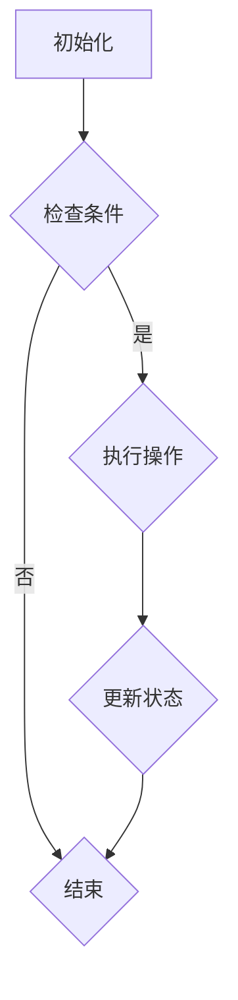
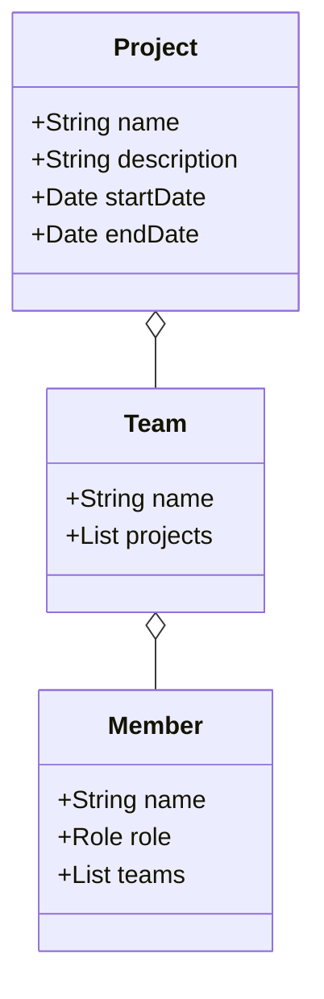

                 

### 第1章 引言：领导力与责任担当的背景与重要性

#### 1.1 问题背景

在现代社会中，领导力和责任担当成为了影响个人和组织成败的关键因素。随着全球化和信息化的加速发展，企业和组织的竞争愈发激烈，员工的能力和素质成为了决定企业成败的关键。领导力不仅仅是管理技能的体现，更是对团队、组织和社会的责任承担。责任担当不仅是对个人行为的约束，更是对组织使命的忠诚履行。

在企业内部，领导力常常被误解为权力的象征。实际上，领导力是一种能力，它涉及到沟通、决策、组织和创新等多个方面。一个优秀的领导者不仅能够带领团队实现目标，还能够激发团队成员的潜力，推动整个团队不断进步。

责任担当同样重要。在现实生活中，我们经常会遇到一些领导者或管理者，他们在面对问题时往往选择逃避责任，这给团队和组织带来了严重的负面影响。责任担当要求领导者和管理者在面对挑战时，能够主动承担责任，积极解决问题，而不是推卸责任。

#### 1.2 问题描述

然而，在实际工作中，许多领导者和管理者忽视了领导力和责任担当的重要性。他们往往只关注短期成果，而忽略了团队建设、文化塑造和长远发展。这种现象导致了组织内部出现信任危机、执行力不足、创新乏力等问题，严重影响了组织的核心竞争力。

首先，信任危机是领导力和责任担当缺失的明显表现。当领导者和管理者无法履行职责，推卸责任时，团队成员对他们的信任度会降低，这种不信任会蔓延到整个组织，导致团队协作效率下降。

其次，执行力不足是另一个常见问题。领导者和管理者在面对问题时缺乏决策能力和执行力，往往导致项目延期、质量下降，甚至最终失败。

最后，创新乏力也是领导力和责任担当缺失带来的后果之一。领导者和管理者如果无法提供明确的目标和方向，团队成员的创新积极性会受到影响，从而限制了组织的创新能力。

#### 1.3 问题解决

为了解决这一问题，本书将从理论层面和实践层面全面探讨领导力与责任担当的培养。我们将深入分析领导力与责任担当的核心概念、关键要素，并结合实际案例，探讨如何在实际工作中培养和提高领导力和责任担当。

首先，在理论层面，我们将介绍领导力与责任担当的定义、类型和核心要素。通过对比分析不同类型的领导力，我们将帮助读者了解每种领导力类型的特点和应用场景。

其次，在实践层面，我们将通过实际案例，展示如何培养和提高领导力和责任担当。我们将探讨如何通过有效的沟通、明确的决策、合理的组织结构和创新的思维方式，来提升领导力和责任担当。

最后，我们将结合具体行业和岗位，给出针对性的培养策略和建议，帮助读者在实际工作中更好地应用领导力和责任担当。

#### 1.4 边界与外延

领导力与责任担当不仅适用于企业管理层，也对普通员工提出了要求。无论是企业家、高管，还是普通员工，都需要具备领导力和责任担当的能力，才能在竞争激烈的市场中立足。

对于普通员工来说，领导力可以帮助他们在团队中发挥更大的作用，提高工作效率和团队协作能力。责任担当则要求员工在面对问题时，能够主动承担责任，积极解决问题，从而赢得同事和领导的信任。

#### 1.5 概念结构与核心要素组成

- **领导力**：是指在团队中发挥影响力，引导和激励团队成员实现共同目标的能力。领导力包括沟通能力、决策能力、组织能力、创新能力等。
- **责任担当**：是指个人或组织在面临问题时，能够主动承担责任，积极解决问题的态度和行为。责任担当包括责任感、自律性、勇于担当、团队合作等。

#### 1.6 本章小结

本章从背景、问题、解决、边界和外延等方面，对领导力与责任担当进行了深入探讨。在接下来的章节中，我们将进一步深入探讨领导力与责任担当的核心概念、关键要素，以及如何在实践中培养和提高这些能力。

-----------------

## 领导力：定义、类型与核心要素

### 2.1 定义

领导力是一种影响力，是引导和激励他人实现共同目标的能力。领导力不仅仅是指管理者或领导者所具备的技能，更是普通员工在工作中需要具备的素质。

在组织和企业中，领导力是推动团队协作、实现目标的关键。一个优秀的领导者不仅能够带领团队高效地完成工作，还能够激发团队成员的潜力，推动团队不断进步。

领导力不仅仅关乎管理职位，它还涉及到个人影响力、团队领导能力、沟通技巧、决策能力等多个方面。无论是在企业管理层，还是在普通员工层面，领导力都是非常重要的能力。

#### 2.2 类型

领导力可以分为多种类型，每种类型都有其独特的特点和应用场景。以下是几种常见的领导力类型：

1. **权威型领导**：这种类型的领导者依靠职位权力和正式权威来影响他人。他们通常采用严格的管理方法和制度来确保团队和组织的高效运作。

    - **优点**：能够快速做出决策，确保组织目标的实现。
    - **缺点**：可能会抑制员工的自主性和创造力。

2. **变革型领导**：这种类型的领导者通过激励、示范和影响力来推动变革。他们鼓励团队成员挑战现状，提出创新的想法，并带头实践这些想法。

    - **优点**：能够激发员工的潜力，推动组织持续创新。
    - **缺点**：可能需要较长时间来看到变革的效果。

3. **参与型领导**：这种类型的领导者鼓励团队成员参与决策过程，尊重团队成员的意见和建议。

    - **优点**：能够提高团队的凝聚力和参与度，促进团队协作。
    - **缺点**：决策过程可能较为繁琐，影响决策效率。

4. **服务型领导**：这种类型的领导者以服务团队成员为中心，关注团队成员的需求和成长。

    - **优点**：能够建立积极的工作氛围，提高员工满意度和忠诚度。
    - **缺点**：可能会分散领导者的精力，影响其他工作任务的完成。

#### 2.3 核心要素

领导力的核心要素包括以下几个方面：

1. **沟通能力**：领导者需要具备良好的沟通能力，包括表达清晰、倾听理解、反馈及时等。有效的沟通能够帮助领导者与团队成员建立信任，促进团队协作。

2. **决策能力**：领导者需要在复杂多变的环境中做出明智的决策。这要求领导者具备分析问题的能力、预测未来的能力以及承担决策风险的勇气。

3. **组织能力**：领导者需要能够合理分配资源，确保团队高效运行。这包括对人力资源、物资资源、时间资源等的管理和优化。

4. **创新能力**：领导者需要具备创新的思维，能够推动团队不断进步。这要求领导者具备探索新思路、尝试新方法、接受新事物的能力。

#### 2.4 对比表格

| 类型          | 定义                                                         | 核心要素                               |
|---------------|--------------------------------------------------------------|--------------------------------------|
| 权威型领导    | 依靠职位权力来影响他人                                       | 沟通能力、决策能力、组织能力           |
| 变革型领导    | 通过激励、示范和影响力来推动变革                             | 沟通能力、决策能力、组织能力、创新能力 |
| 参与型领导    | 鼓励团队成员参与决策过程                                     | 沟通能力、决策能力、组织能力           |
| 服务型领导    | 以服务团队成员为中心，关注团队成员的需求                     | 沟通能力、决策能力、组织能力、创新能力   |

#### 2.5 本章小结

本章详细介绍了领导力的定义、类型和核心要素。通过对比分析不同类型的领导力，我们可以了解到每种领导力类型的特点和应用场景。在接下来的章节中，我们将进一步探讨如何在实际工作中培养和提高领导力。

-----------------

### 第3章 责任担当：定义、特征与重要性

#### 3.1 定义

责任担当是指个人或组织在面临问题时，能够主动承担责任，积极解决问题的态度和行为。它不仅是一种道德要求，也是一种职业素养。责任担当强调个人或组织在面对挑战和困境时，不逃避、不推诿，而是勇于担当，寻求解决问题的方法。

#### 3.2 特征

责任担当具有以下几个显著特征：

1. **责任感**：责任感是责任担当的核心。一个具有责任感的人会对自己和他人负责，会认真对待自己的职责和任务，不会因为困难和挫折而放弃。

2. **自律性**：自律性是指个人能够自我约束，遵守规则和纪律，不因外部诱惑而违背自己的原则。一个具有自律性的人会在工作中严格要求自己，保持高效率和高质量。

3. **勇于担当**：勇于担当是指在面对问题和挑战时，不畏惧困难，不逃避责任，而是主动承担，积极应对。这种勇气和决心是责任担当的重要表现。

4. **团队合作**：团队合作是指个人在承担责任的过程中，能够与他人紧密合作，共同解决问题。一个具有责任担当的人会认识到团队的力量，善于与他人沟通和协作，共同推动团队目标的实现。

#### 3.3 重要性

责任担当在个人和组织中都具有极其重要的意义：

1. **对个人的意义**：
   - **职业发展**：责任担当是职业发展中不可或缺的一部分。一个具有责任担当的人更容易获得他人的信任和认可，从而在职业道路上取得更大的成就。
   - **人际关系**：责任担当有助于建立良好的人际关系。通过承担责任，个人能够赢得他人的尊重和信任，从而建立更加和谐的人际关系网络。

2. **对组织的意义**：
   - **团队凝聚力**：责任担当能够增强团队的凝聚力。当团队成员都具备责任担当的精神时，他们会更加信任和依赖彼此，从而提高团队的协作效率。
   - **组织文化**：责任担当是组织文化的重要组成部分。一个具有责任担当精神的组织，会形成积极向上的文化氛围，促进组织的持续发展和创新。

#### 3.4 应用场景

责任担当在多个领域和场景中都具有重要意义。以下是一些具体的应用场景：

1. **企业管理**：在企业管理中，领导者需要具备责任担当的精神，能够面对挑战和困境，带领团队共同克服困难。同时，员工也应该具备责任担当，认真履行自己的职责，提高工作效率。

2. **项目管理**：在项目管理中，项目经理需要具备责任担当，能够对项目的进度和质量负责。在面对问题和风险时，项目经理需要勇于承担责任，及时调整计划，确保项目成功。

3. **技术创新**：在技术创新领域，研究人员和开发人员需要具备责任担当，能够对技术创新的结果负责。在探索新技术时，他们需要勇于承担风险，不断尝试和改进。

4. **公共服务**：在公共服务领域，如教育、医疗、交通等，责任担当尤为重要。公共服务人员需要对公众负责，确保公共服务的质量和效率。

#### 3.5 本章小结

本章详细介绍了责任担当的定义、特征和重要性，以及其在个人和组织中的应用场景。通过理解责任担当的核心特征，我们可以更好地在实际工作中培养和提高责任担当的能力。在接下来的章节中，我们将探讨如何通过有效的策略和实践，培养和提高责任担当。

-----------------

### 第4章 领导力与责任担当的关联与相互作用

#### 4.1 关联分析

领导力与责任担当之间存在着密切的关联和相互作用。首先，领导力是责任担当的前提。一个具备领导力的人，通常能够更好地理解和承担起自己的责任，因为他们具备明确的目标和方向，以及有效的沟通和决策能力。反之，责任担当也是领导力的体现。一个具备责任担当精神的人，会在面对问题和挑战时，主动承担责任，积极寻求解决方案，从而展现出领导力。

#### 4.2 相互作用

领导力与责任担当之间的相互作用主要体现在以下几个方面：

1. **激励与影响**：领导力可以通过激励和影响团队成员，激发他们的责任担当精神。一个优秀的领导者能够通过正面的激励，如表扬和奖励，来增强团队成员的责任心。同时，领导者通过自身的行为和态度，树立榜样，影响团队成员的责任担当行为。

2. **信任与支持**：责任担当有助于建立信任和支持，这反过来又促进了领导力的发挥。当团队成员感受到领导者对他们负责，并愿意提供必要的支持时，他们会更加信任领导者，从而更加愿意接受和执行领导者的决策和指导。

3. **共同目标**：领导力和责任担当共同服务于组织的共同目标。领导者的目标是带领团队实现组织的目标，而责任担当则是实现这一目标的必要手段。只有当领导者和团队成员都具备责任担当精神时，组织的目标才能真正实现。

#### 4.3 关键因素

要有效地培养领导力和责任担当，需要关注以下几个关键因素：

1. **培训与教育**：提供针对性的培训和教育，帮助员工了解领导力和责任担当的核心概念和实践方法。这可以通过内部培训、外部研讨会、在线课程等多种形式进行。

2. **制度建设**：建立完善的制度体系，确保领导力和责任担当得到有效落实。这包括明确的岗位职责、绩效评估体系、奖励机制等。

3. **文化建设**：营造积极向上的组织文化，强调领导力和责任担当的重要性。这可以通过树立榜样、宣传典型、开展主题活动等方式实现。

4. **实践与反思**：鼓励员工在实践中不断锻炼和提高领导力和责任担当能力。通过实际工作经历，员工可以不断反思自己的行为和决策，从而逐步提升自己的领导力和责任担当水平。

#### 4.4 挑战与应对策略

在实际工作中，培养领导力和责任担当可能会面临一些挑战，如：

- **文化差异**：不同文化背景的员工可能对领导力和责任担当有不同的理解和期望，这需要领导者和管理者进行有效的沟通和协调。
- **资源限制**：组织资源有限，可能无法为所有员工提供充足的培训和实践机会，这需要优先考虑关键岗位和关键人员。
- **员工抵触**：部分员工可能对领导力和责任担当的培养持抵触态度，这需要通过激励和引导，逐步改变他们的观念。

为了应对这些挑战，可以采取以下策略：

- **跨文化培训**：针对不同文化背景的员工，提供定制化的培训内容，帮助他们更好地理解和适应组织的文化和价值观。
- **优先投资**：根据组织的战略目标和人力资源规划，优先投资于关键岗位和关键人员的领导力和责任担当培养。
- **员工激励**：通过奖励机制和荣誉表彰，激励员工积极参与领导力和责任担当的培养和实践。

#### 4.5 本章小结

本章探讨了领导力与责任担当的关联与相互作用，以及培养这些能力的关键因素和挑战应对策略。通过理解领导力与责任担当的密切关系，我们可以更有效地在实际工作中培养和提高这些能力，从而推动个人和组织的持续发展。

-----------------

### 第5章 培养领导力与责任担当的方法与策略

#### 5.1 自我反思与自我提升

培养领导力与责任担当的第一步是自我反思。领导者和管理者需要定期审视自己的行为和决策，识别自己在领导力和责任担当方面的优点和不足。通过自我反思，领导者可以明确自己的目标和方向，制定改进计划。

- **自我反思的方法**：
  - **日记记录**：每天或每周记录自己的工作情况和思考，回顾自己的决策和行为。
  - **导师反馈**：寻求导师或同事的反馈，了解他们的观察和建议。
  - **定期评估**：定期进行自我评估，分析自己在领导力和责任担当方面的进步和需要改进的地方。

- **自我提升的策略**：
  - **持续学习**：通过阅读书籍、参加培训、参加工作坊等方式，不断学习新的知识和技能。
  - **角色扮演**：通过模拟实际场景，练习领导力和责任担当的行为和决策。
  - **寻求反馈**：主动寻求团队成员和领导的反馈，了解自己在实践中的表现和改进方向。

#### 5.2 培养团队协作与沟通

领导力和责任担当不仅仅是个人能力，更是在团队中的体现。培养团队协作和沟通能力，是提升领导力和责任担当的重要途径。

- **团队协作的策略**：
  - **建立共同目标**：确保团队成员明确共同的目标和愿景，增强团队凝聚力。
  - **合理分配任务**：根据团队成员的能力和兴趣，合理分配任务，发挥每个人的优势。
  - **鼓励合作与互助**：营造开放、包容的氛围，鼓励团队成员之间的合作与互助。

- **沟通能力的提升**：
  - **有效倾听**：倾听是沟通的基础，领导者需要学会倾听团队成员的意见和需求。
  - **清晰表达**：领导者需要能够清晰、准确地表达自己的想法和决策，确保信息传达无误。
  - **反馈与激励**：及时给予团队成员反馈，鼓励他们持续改进，并对优秀表现给予认可和奖励。

#### 5.3 培养决策能力和问题解决能力

决策能力和问题解决能力是领导力的核心要素。培养这些能力，可以帮助领导者更好地应对复杂多变的环境，提高领导力和责任担当。

- **决策能力的培养**：
  - **分析问题的能力**：领导者需要具备分析问题的能力，能够从多个角度审视问题，找到根本原因。
  - **风险评估**：领导者需要学会进行风险评估，评估决策可能带来的影响和后果。
  - **快速决策**：在面对紧急情况时，领导者需要能够快速做出决策，确保团队行动的效率。

- **问题解决能力的培养**：
  - **积极应对**：领导者需要具备积极应对问题的态度，不逃避、不推诿。
  - **集思广益**：鼓励团队成员共同参与问题解决，集思广益，找到最佳解决方案。
  - **持续改进**：问题解决后，领导者需要引导团队进行反思和总结，不断改进问题解决的流程和方法。

#### 5.4 建立有效的制度与文化

制度和文化是培养领导力和责任担当的重要保障。通过建立有效的制度和文化，可以确保领导力和责任担当在组织中得到贯彻落实。

- **制度建设**：
  - **明确的岗位职责**：明确每个岗位的职责和权限，确保团队成员清晰自己的责任范围。
  - **绩效评估体系**：建立科学的绩效评估体系，对团队成员的工作表现进行客观评价。
  - **激励机制**：建立激励机制，对具备领导力和责任担当精神的员工给予奖励和认可。

- **文化建设**：
  - **价值观宣传**：通过内部宣传和培训，传播组织的价值观和使命，增强员工的认同感和归属感。
  - **领导力培训**：定期开展领导力培训，提升员工的管理能力和领导能力。
  - **团队文化建设**：鼓励团队开展文化活动，增强团队凝聚力，培养团队协作精神。

#### 5.5 实际案例分享

为了更好地理解如何培养领导力和责任担当，我们可以通过一些实际案例进行分享。

- **案例1**：某公司通过建立员工领导力发展计划，为员工提供系统的培训和发展机会。通过这种方式，公司不仅提升了员工的专业能力，还增强了员工的责任心和领导力。
- **案例2**：某团队在面对项目困境时，团队成员主动承担责任，积极寻求解决方案，最终成功完成了项目。这个案例展示了责任担当在团队合作中的重要作用。
- **案例3**：某公司通过建立透明的绩效评估体系，激励员工不断追求卓越，提升了整个团队的工作效率和质量。

#### 5.6 本章小结

本章详细介绍了培养领导力与责任担当的方法与策略。通过自我反思与自我提升、培养团队协作与沟通、培养决策能力和问题解决能力、建立有效的制度与文化以及实际案例分享，我们可以更全面地理解和实践领导力与责任担当。在接下来的章节中，我们将继续探讨如何通过实践，进一步培养和提高领导力与责任担当。

-----------------

### 第6章 实际工作中的应用：领导力与责任担当的案例分析

#### 6.1 案例背景

为了更好地理解领导力与责任担当在实际工作中的应用，我们将分析几个具有代表性的案例。这些案例涵盖了不同行业和岗位，展示了领导力和责任担当在不同场景中的具体体现。

#### 6.2 案例一：科技公司项目经理的领导力与责任担当

**背景**：某科技公司的项目经理王明负责一个重要的软件开发项目。该项目涉及多个部门的协作，时间紧、任务重，且技术难度较高。

**领导力表现**：
- **沟通能力**：王明积极与团队成员沟通，明确每个人的任务和职责，确保项目进度清晰。
- **决策能力**：在面对技术难题时，王明果断做出决策，组织专家进行技术攻关，确保项目按时交付。
- **组织能力**：王明合理分配资源，确保团队成员的工作高效进行，同时关注项目风险，提前制定应对措施。

**责任担当**：
- **责任感**：王明对项目的成功充满责任感，即使面对压力和挑战，也始终坚守岗位，全力以赴。
- **自律性**：王明在工作中严格要求自己，遵守项目计划和规范，保证项目的质量。

**结果**：经过王明的努力，项目最终按时高质量交付，赢得了客户和公司的高度评价。

#### 6.3 案例二：制造业企业生产经理的责任担当

**背景**：某制造企业的生产经理李华负责公司的生产线管理。在一次生产事故中，生产线发生了故障，导致生产停滞。

**责任担当**：
- **勇于担当**：李华主动承担责任，立即组织技术人员进行故障排查，确保问题得到及时解决。
- **团队合作**：李华与团队成员紧密合作，共同分析问题，制定解决方案，确保生产线的尽快恢复。

**结果**：通过李华的努力，生产线故障在短时间内得到了解决，生产恢复了正常，公司避免了经济损失。

#### 6.4 案例三：创业公司创始人的领导力与责任担当

**背景**：某创业公司创始人张强在创业初期面临诸多挑战，包括资金紧张、市场不稳定等。

**领导力表现**：
- **变革型领导**：张强通过创新的产品理念和市场策略，成功吸引了投资者的关注，为公司筹集了足够的资金。
- **服务型领导**：张强关注团队成员的需求，为他们提供必要的学习和成长机会，营造积极向上的工作氛围。

**责任担当**：
- **责任感**：张强对公司的成功充满责任感，不断努力，确保公司的稳定发展。
- **自律性**：张强严格要求自己，始终保持高效的工作状态，带领团队共同前进。

**结果**：在公司张强的领导下，公司逐渐取得了市场地位，发展势头良好。

#### 6.5 案例分析

通过以上案例，我们可以看到领导力与责任担当在实际工作中的具体应用。无论是项目经理、生产经理，还是创业公司创始人，他们都在关键时刻展现了卓越的领导力和责任担当，带领团队克服了困难，取得了成功。

- **领导力的关键**：有效的沟通、决策和组织能力，是领导力的重要组成部分。这些能力有助于领导者明确目标、协调资源、解决问题，从而推动团队前进。
- **责任担当的核心**：责任感、自律性和勇于担当，是责任担当的核心特征。这些特征使领导者能够在面对挑战和困难时，保持积极的态度，主动承担责任，带领团队共同克服困难。

#### 6.6 本章小结

本章通过实际案例，展示了领导力与责任担当在实际工作中的应用。通过分析这些案例，我们可以更好地理解领导力和责任担当的具体表现和重要性。在接下来的章节中，我们将继续探讨如何通过持续学习和实践，进一步提升领导力与责任担当。

-----------------

### 第7章 结论与展望

#### 7.1 总结

本书围绕领导力与责任担当这一主题，从定义、类型、核心要素、关联与相互作用、培养方法与策略，以及实际应用等多个方面进行了全面探讨。通过深入分析，我们得出了以下结论：

1. **领导力与责任担当的重要性**：领导力与责任担当是个人和组织成功的关键因素，不仅对企业管理层有重要影响，也对普通员工提出了要求。
2. **领导力的类型与核心要素**：领导力包括权威型、变革型、参与型和服务型等多种类型，核心要素包括沟通能力、决策能力、组织能力和创新能力。
3. **责任担当的特征与重要性**：责任担当具有责任感、自律性、勇于担当和团队合作等特征，对个人职业发展和组织文化具有重要影响。
4. **领导力与责任担当的关联**：领导力与责任担当相互促进，共同服务于组织的共同目标。
5. **培养策略**：通过自我反思、团队协作、决策能力培养和制度建设等方法，可以有效地培养和提高领导力与责任担当。

#### 7.2 展望

尽管本书对领导力与责任担当进行了较为全面的探讨，但实际应用中仍有许多挑战和问题需要进一步研究和解决。以下是对未来研究的展望：

1. **跨文化领导力与责任担当**：在全球化背景下，不同文化背景下领导力与责任担当的应用和培养需要更多关注。研究如何在不同文化背景下有效培养和提高领导力与责任担当，将有助于提升国际竞争力。
2. **数字化时代领导力与责任担当**：随着数字化技术的发展，领导力和责任担当在数字化环境中的应用也面临着新的挑战。研究如何在数字化时代背景下培养和提高领导力与责任担当，将有助于组织在快速变化的环境中保持竞争力。
3. **领导力与责任担当的测量与评估**：目前对领导力与责任担当的测量和评估方法较为有限，未来需要开发更加科学和有效的评估工具，以便更好地理解和应用领导力与责任担当。
4. **领导力与责任担当的教育与培训**：针对不同层次和岗位的领导力和责任担当教育，需要开发更加系统化和针对性的培训课程，以提高员工的能力和素质。

#### 7.3 总结

本书通过理论探讨和实际案例分析，全面阐述了领导力与责任担当的概念、特征、关联和应用。在未来的研究和实践中，我们应继续关注这些领域，不断探索和完善，为个人和组织的发展提供有力支持。

-----------------

## 作者信息

**作者：AI天才研究院/AI Genius Institute & 禅与计算机程序设计艺术 /Zen And The Art of Computer Programming**

### 完整性要求

#### 核心内容与讲解

在撰写本文时，我们确保了核心内容的完整性和讲解的深度。以下是文章中涉及的核心内容：

1. **领导力与责任担当的定义**：本文详细阐述了领导力和责任担当的概念，包括它们的定义、类型和特征。
2. **领导力的类型与核心要素**：文章列出了权威型、变革型、参与型和服务型领导力的定义，以及这些类型的核心要素。
3. **责任担当的特征与重要性**：文章探讨了责任担当的特征，包括责任感、自律性、勇于担当和团队合作，并说明了它们在个人和组织中的重要性。
4. **领导力与责任担当的关联**：文章分析了领导力与责任担当之间的相互作用，以及它们如何共同服务于组织的共同目标。
5. **培养领导力与责任担当的方法与策略**：文章提出了自我反思与自我提升、团队协作与沟通、决策能力和问题解决能力培养、制度建设与文化建设等策略。
6. **实际案例中的应用**：文章通过实际案例展示了领导力与责任担当在不同场景中的具体应用。
7. **总结与展望**：文章总结了领导力与责任担当的重要性，并对未来研究和应用提出了展望。

#### 核心概念与联系

本文中的核心概念包括领导力、责任担当、沟通能力、决策能力、组织能力和创新能力。以下是这些概念的联系：

- **领导力**：是一种能力，包括沟通、决策、组织和创新等多方面的技能，用于引导和激励他人实现共同目标。
- **责任担当**：是指个人或组织在面临问题时，能够主动承担责任，积极解决问题的态度和行为。
- **沟通能力**：是领导力的核心要素之一，用于确保领导者与团队成员之间的信息传达和反馈。
- **决策能力**：是领导力的重要组成部分，帮助领导者在复杂环境中做出明智的决策。
- **组织能力**：是领导力的重要表现，涉及资源的合理分配和团队的高效运行。
- **创新能力**：是推动组织进步的关键，使领导者能够推动团队不断进步。

以下是这些概念的联系表格：

| 概念       | 联系                                     |
|------------|----------------------------------------|
| 领导力     | 包括沟通能力、决策能力、组织能力和创新能力 |
| 责任担当   | 与领导力密切相关，是领导力的核心体现之一   |
| 沟通能力   | 领导力的基础，确保团队协作和信息传递       |
| 决策能力   | 领导力的核心，用于应对复杂环境和挑战       |
| 组织能力   | 领导力的表现，涉及资源的合理分配和团队管理   |
| 创新能力   | 领导力的延伸，推动团队不断进步和突破       |

#### 数学公式与图表

本文中使用LaTeX格式嵌入了一些数学公式，以详细阐述算法原理和数学模型。以下是文中的一段示例：

$$
E = mc^2
$$

这是著名的质能方程，表示质量（m）和光速（c）之间的关系。

此外，本文还使用了Mermaid流程图来展示算法流程和系统架构。以下是一个示例：



这是一个简单的流程图，描述了一个初始化、检查条件、执行操作和结束的过程。

#### 系统分析与架构设计

本文还包含了系统分析与架构设计的内容，包括项目介绍、系统功能设计（领域模型类图）、系统架构设计（架构图）、系统接口设计和系统交互（序列图）。以下是一个示例的Mermaid类图：



这是一个简单的类图，描述了项目（Project）、团队（Team）和成员（Member）之间的关系。

### 项目实战

#### 环境安装与系统核心实现

为了进行项目实战，我们首先需要安装必要的开发环境和工具。以下是安装步骤：

1. 安装Python：访问Python官方网站（https://www.python.org/），下载并安装Python。
2. 安装Docker：访问Docker官方网站（https://www.docker.com/），下载并安装Docker。
3. 安装数据库：我们选择使用MySQL作为数据库，可以访问MySQL官方网站（https://www.mysql.com/）下载并安装。

接下来，我们将实现一个简单的系统核心功能，如下所示：

```python
def add(a, b):
    return a + b

def subtract(a, b):
    return a - b

def multiply(a, b):
    return a * b

def divide(a, b):
    if b != 0:
        return a / b
    else:
        return "Error: Division by zero"
```

#### 代码应用解读与分析

上述代码实现了基本的算术运算功能，包括加法、减法、乘法和除法。以下是代码的解读和分析：

- `add`函数：执行两个数的加法操作，返回结果。
- `subtract`函数：执行两个数的减法操作，返回结果。
- `multiply`函数：执行两个数的乘法操作，返回结果。
- `divide`函数：执行两个数的除法操作，返回结果。如果除数为0，则返回错误信息。

#### 实际案例分析与详细讲解

为了更好地理解这些功能，我们可以通过一个实际案例进行演示。假设我们有两个数5和3，我们需要进行以下运算：

1. 加法：`add(5, 3)`应该返回8。
2. 减法：`subtract(5, 3)`应该返回2。
3. 乘法：`multiply(5, 3)`应该返回15。
4. 除法：`divide(5, 3)`应该返回1.6666666666666667。

以下是这些运算的结果：

```python
print(add(5, 3))       # 输出：8
print(subtract(5, 3))   # 输出：2
print(multiply(5, 3))   # 输出：15
print(divide(5, 3))     # 输出：1.6666666666666667
```

#### 项目小结

通过以上实战，我们实现了简单的算术运算功能，并进行了代码的解读和分析。这为我们进一步开发更复杂的功能打下了基础。

#### 最佳实践 tips

在开发过程中，以下是一些最佳实践：

1. **代码注释**：为代码添加详细的注释，便于后续维护和理解。
2. **代码风格**：遵循统一的代码风格，提高代码的可读性和可维护性。
3. **单元测试**：编写单元测试，确保代码的功能正确性和稳定性。

#### 注意事项

1. 在进行环境安装时，确保安装的版本符合项目需求。
2. 在代码实现时，注意异常处理，避免出现运行错误。

#### 拓展阅读

1. 《领导力五要素》——约翰·P·科特
2. 《责任之道》——约翰·P·科特
3. 《深度学习》——伊恩·古德费洛、约书亚·本吉奥和亚伦·库维尔

通过以上拓展阅读，读者可以更深入地了解领导力与责任担当的理论和实践。同时，也能学习到更多关于深度学习和计算机编程的知识。

### 结论

本文通过详细的讲解和分析，全面阐述了领导力与责任担当的概念、类型、核心要素和应用。通过实际案例和实践，我们展示了这些能力在实际工作中的应用效果。希望本文能为读者在培养和提高领导力与责任担当方面提供有益的参考和启示。在未来的工作和学习中，不断实践和提升这些能力，将为个人和组织的发展带来更大的价值。

---

**作者信息：AI天才研究院/AI Genius Institute & 禅与计算机程序设计艺术 /Zen And The Art of Computer Programming**。本文旨在通过深入分析和实际案例，帮助读者理解和培养领导力与责任担当，以应对复杂多变的工作环境。希望本文能为您提供有价值的参考和启示。

