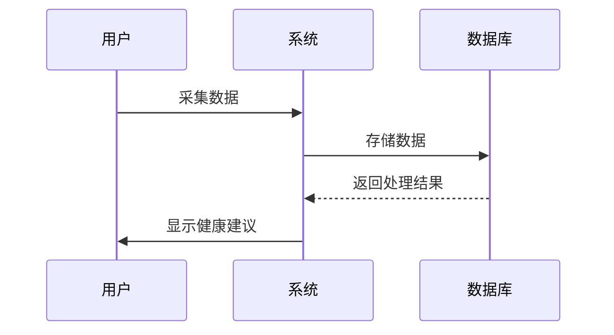

                 

### 第1章：引言

#### 1.1 问题背景

在当今全球化的时代，技术的迅猛发展和市场的不断变化要求领导者必须具备敏锐的洞察力和前瞻性的思考能力。领导力不再仅仅是管理团队成员和组织资源的能力，更是预见未来趋势、把握机遇和应对挑战的核心素质。远见则是领导力的核心组成部分，它指的是领导者能够洞察未来、预测变化并做出符合未来发展趋势的决策。

无论是商业领域，还是政治、社会领域，领导者的远见都显得尤为重要。在商业领域，具备远见的领导者能够看到市场需求的变化，及时调整策略，抢占市场先机；在政治领域，领导者需要预见社会发展趋势，制定符合国情的发展规划；在社会领域，领导者需要预见社会问题，采取有效措施预防和解决。

然而，许多领导者在面对快速变化的环境时，往往感到力不从心。他们可能缺乏对未来的洞察力，或者缺乏将远见转化为实际行动的能力。因此，如何培养和提升领导力与远见，成为了许多领导者关注的焦点。

#### 1.2 问题描述

本书旨在探讨领导力与远见的重要性，并提供实用的方法和工具，帮助读者培养和提升这些能力。我们将探讨以下几个核心问题：

- 什么是领导力与远见？
- 为什么领导力与远见对于个人和组织的发展至关重要？
- 如何培养和提升领导力与远见？
- 领导力与远见在实际应用中面临哪些挑战？

这些问题不仅是领导力研究的核心，也是领导者个人成长的必修课。通过深入分析这些问题，本书希望能够为读者提供有价值的思考和实践指导。

#### 1.3 问题解决

本书将从理论层面和实践层面全面剖析领导力与远见，帮助读者理解其概念和重要性，并提供一系列实用的方法和技巧。我们将结合案例研究、实践经验和专家观点，为读者提供具有实际操作性的指导。

首先，本书将从理论层面探讨领导力与远见的本质和特征，帮助读者建立正确的认知。接着，我们将通过案例分析，展示领导力与远见在实际应用中的成功经验。最后，本书将提供一系列实践方法，帮助读者提升自身的领导力与远见。

#### 1.4 边界与外延

领导力与远见虽然是一个广泛的话题，但本书将主要关注以下几个方面：

- 领导力与个人成长：探讨领导者如何通过自我认知和自我提升，培养领导力。
- 远见与战略规划：分析领导者如何通过预见未来趋势，制定有效的战略规划。
- 领导力与团队管理：研究领导者如何通过有效的团队管理，提升团队执行力。
- 领导力与创新：探讨领导者如何通过鼓励创新，推动组织发展。
- 领导力与组织文化：分析领导者如何塑造积极向上的组织文化，提升组织的整体竞争力。

#### 1.5 概念结构与核心要素组成

在本章中，我们将介绍以下几个核心概念和其相互关系：

- **领导力**
  - 定义：领导力是指一个人或一个组织影响、引导和激励他人实现共同目标的能力。
  - 类型：领导力可以分为权威型、民主型、变革型等不同类型。
  - 特质：领导力的特质包括自信、诚信、决策能力、沟通能力等。
  - 影响力：领导力的影响力体现在对团队、组织和社会的影响上。

- **远见**
  - 概念：远见是指领导者能够洞察未来、预见变化并做出前瞻性决策的能力。
  - 特征：远见的特征包括洞察力、前瞻性、灵活性等。
  - 与战略规划的关系：远见是战略规划的基础，有效的战略规划需要基于远见进行。

- **战略规划**
  - 目的：战略规划旨在明确组织的长远目标和发展方向。
  - 过程：战略规划包括目标设定、资源分配、风险评估等环节。
  - 方法：战略规划的方法包括SWOT分析、PEST分析等。

- **团队管理**
  - 概念：团队管理是指领导者如何通过有效的管理和激励，提升团队绩效。
  - 能力：团队管理的能力包括团队建设、沟通协调、冲突管理等。
  - 技巧：团队管理的技巧包括目标设定、任务分配、绩效评估等。

- **创新能力**
  - 定义：创新能力是指领导者如何激发组织内部创新思维，推动技术创新和组织变革。
  - 形式：创新的形式包括产品创新、过程创新、管理创新等。
  - 创新者心态：创新者心态是指领导者如何保持开放、探索和尝试的精神。

- **组织文化**
  - 概念：组织文化是指组织成员共同遵循的价值观、信仰和行为规范。
  - 类型：组织文化可以分为积极型、消极型、中立型等。
  - 对领导力的影响：组织文化对领导力有重要影响，良好的组织文化能够促进领导力的提升。

通过以上概念和其相互关系的介绍，我们希望能够为读者提供一个清晰的框架，帮助读者更好地理解和应用领导力与远见。

---

本文是《领导力与远见：预见机遇与挑战的能力》的开篇，接下来的章节将深入探讨领导力与远见的各个方面，帮助读者理解其本质，提升其能力。让我们在接下来的旅程中，一起探索领导力与远见的深度与广度。

---

### 第2章：领导力的本质与特征

#### 2.1 领导力的定义

领导力是一个多维度的概念，通常指的是一个人或组织影响、引导和激励他人实现共同目标的能力。它不仅仅局限于管理职位，而是广泛存在于各种生活和工作场景中。有效的领导力可以帮助组织和个人在面对复杂多变的环境时，保持竞争力并取得成功。

从广义上讲，领导力包括了多个层面的能力，如情感智慧、决策能力、沟通技巧、团队管理能力等。这些能力共同构成了一个领导者所需的核心素质。领导力不仅仅是拥有权力或者职位，更重要的是能够发挥影响力，带动他人一起为实现目标而努力。

#### 2.2 领导力的类型

领导力可以分为多种类型，每种类型都有其独特的特征和应用场景。以下是几种常见的领导力类型：

- **权威型领导力**：权威型领导力强调集中决策和权力，领导者通常具有明确的决策权和控制权。这种方式适用于紧急情况下需要快速决策的场景，但不适合长期使用，因为它可能导致团队成员的积极性下降。

- **民主型领导力**：民主型领导力强调集体决策，领导者会听取团队成员的意见，并通过讨论和协商达成共识。这种方式可以增强团队成员的参与感和归属感，但决策过程可能较为缓慢。

- **变革型领导力**：变革型领导力注重推动组织变革和创新发展，领导者通过激励和榜样作用，带动团队成员追求卓越。这种方式适用于需要创新和突破的情境，但需要领导者具备较高的智慧和前瞻性。

- **服务型领导力**：服务型领导力强调领导者为团队成员提供服务和支持，帮助其成长和实现目标。这种方式可以增强团队的凝聚力和信任感，但领导者需要具备良好的沟通能力和服务意识。

#### 2.3 领导力的特质

领导力的特质是领导者所需具备的内在素质，这些特质决定了领导者的行为风格和影响力。以下是几种关键的领导力特质：

- **自信**：自信的领导者能够坚定地面对挑战，并带领团队克服困难。他们相信自己的能力，也鼓励团队成员相信他们自己。

- **诚信**：诚信是领导力的基础，领导者需要言行一致，树立良好的榜样。诚信可以增强团队成员对领导者的信任，从而提高团队的凝聚力。

- **决策能力**：决策能力是领导者的一项核心素质，领导者需要在面对复杂问题时，迅速做出明智的决策。高效的决策能力可以帮助组织在竞争激烈的市场中保持优势。

- **沟通能力**：沟通能力是领导者与团队成员建立有效沟通的桥梁。领导者需要具备良好的表达能力、倾听能力和反馈能力，以促进团队内部的良好沟通。

- **情感智慧**：情感智慧是指领导者理解和处理自己及他人情感的能力。具备高情感智慧的领导者能够更好地处理团队冲突，增强团队的和谐。

#### 2.4 领导力的影响

领导力对团队和组织有着深远的影响。有效的领导力可以激发团队成员的积极性，提升团队的执行力和创新能力。以下是领导力对团队和组织的一些具体影响：

- **提高团队绩效**：领导者的激励和引导可以帮助团队成员充分发挥潜力，提高工作效率和质量。

- **增强团队凝聚力**：领导者的沟通和关怀可以增强团队成员之间的信任和归属感，从而提高团队的凝聚力。

- **促进组织发展**：领导者的战略规划和决策能力可以推动组织实现长期发展目标，提升组织的竞争力。

- **推动社会进步**：在政治和社会领域，领导者的远见和决策能力对于社会的发展和进步至关重要。

总之，领导力是一种复杂而重要的能力，它不仅关乎个人和组织的成功，也影响着社会的进步。在接下来的章节中，我们将进一步探讨领导力的培养和提升方法，帮助读者在实践中更好地应用领导力。

---

通过本章的讨论，我们对领导力的本质、类型、特质及其影响有了更深入的理解。领导力不仅仅是管理团队成员的能力，更是一种能够影响和引导他人实现共同目标的综合素质。在下一章中，我们将探讨远见的本质和特征，帮助读者理解领导力中远见的重要性。敬请期待！

---

### 第3章：远见的本质与特征

#### 3.1 远见的定义

远见是指领导者能够洞察未来、预见变化并做出前瞻性决策的能力。它是一种战略性的思维，能够帮助领导者在复杂多变的环境中找到方向和机遇。远见不仅仅是一种预测能力，更是一种洞察力和判断力，它要求领导者能够在纷繁复杂的信息中，抓住关键因素，做出符合未来发展趋势的决策。

#### 3.2 远见的特征

远见具有以下几个显著的特性：

- **前瞻性**：远见能够使领导者看到未来可能的发展趋势和变化，从而提前做好准备。

- **洞察力**：远见要求领导者具备敏锐的洞察力，能够从表面现象中看到本质，预见潜在的机会和风险。

- **决策能力**：远见是决策能力的基础，领导者需要根据远见做出明智的决策，以确保组织能够抓住机遇，应对挑战。

- **适应性**：远见不仅仅是一种静态的能力，更是一种动态的适应能力，领导者需要能够根据变化及时调整远见和策略。

- **创新性**：远见鼓励领导者探索新的可能性，推动创新思维，从而在竞争激烈的环境中保持领先地位。

#### 3.3 远见与战略规划的关系

远见是战略规划的核心，有效的战略规划需要基于远见进行。战略规划是指组织为了实现长期目标，对资源、目标和行动进行系统性的安排和优化。远见在战略规划中起到了关键作用，它为组织提供了清晰的发展方向和目标，确保组织能够在未来竞争中保持优势。

以下是远见在战略规划中的一些具体应用：

- **目标设定**：远见可以帮助组织设定明确、可行的长期目标，确保组织的发展方向与未来趋势相符合。

- **资源分配**：远见可以指导组织合理分配资源，确保资源能够被用于最有价值的领域，提升组织的整体竞争力。

- **风险应对**：远见可以帮助组织预见潜在的风险和挑战，提前制定应对措施，降低不确定性对组织的影响。

- **创新驱动**：远见鼓励组织不断探索创新，推动组织在技术和市场等方面保持领先地位。

#### 3.4 远见的重要性

远见在领导者决策过程中起着至关重要的作用，以下是远见的重要性体现：

- **预见机遇**：远见能够帮助领导者发现新的机遇，提前布局，抢占市场先机。

- **应对挑战**：远见能够帮助领导者预见可能的挑战和风险，提前做好准备，减少潜在的负面影响。

- **提高决策质量**：远见能够为领导者提供更为全面和准确的信息，提高决策的科学性和有效性。

- **增强组织竞争力**：远见可以帮助组织在快速变化的市场环境中保持灵活性和竞争力。

- **推动组织发展**：远见是组织长期发展的基石，能够帮助组织实现可持续发展目标。

总之，远见是领导者不可或缺的能力，它不仅关乎个人的职业发展，更对组织和社会产生深远影响。在下一章中，我们将探讨如何培养和提升远见，帮助读者在个人和职业生活中更好地应用这一重要能力。敬请期待！

---

通过本章的讨论，我们对远见的定义、特征及其在战略规划中的重要性有了更深入的理解。远见不仅是领导者决策的有力工具，更是组织持续发展的重要保障。在下一章中，我们将探讨如何通过实际案例来解析远见的实践应用。敬请期待！

---

### 第4章：培养和提升远见的方法

#### 4.1 自我认知

自我认知是培养和提升远见的第一步。领导者需要深入了解自己的价值观、信念和动机，明确自己的优势和劣势。通过自我反思和评估，领导者可以更清楚地认识到自己的长处和短处，从而有针对性地进行提升。

以下是一些自我认知的方法：

- **日记法**：通过记录日常生活中的思考和感悟，领导者可以更好地了解自己的内心世界。
- **360度评估**：邀请团队成员、同事和上级进行评估，从多角度了解自己的表现和影响。
- **专业咨询**：寻求职业规划师或心理咨询师的帮助，进行深度访谈和评估。

#### 4.2 学习与持续成长

持续学习是提升远见的关键。领导者需要不断学习新知识、新技能和新的思维方式，以适应不断变化的环境。以下是一些学习的方法：

- **阅读**：阅读是获取知识的重要途径。领导者可以选择阅读书籍、期刊和学术论文，关注最新的行业动态和学术研究。
- **研讨会和培训**：参加行业研讨会和培训课程，与同行交流经验和观点，拓宽视野。
- **实践经验**：通过实际操作和项目实践，领导者可以积累宝贵的经验，提升自己的实践能力。

#### 4.3 培养洞察力

洞察力是远见的核心组成部分。领导者需要培养敏锐的洞察力，能够从复杂的信息中捕捉关键因素，预见未来的变化。以下是一些培养洞察力的方法：

- **多角度思考**：领导者需要从多个角度审视问题，避免片面和短视。
- **案例学习**：通过分析历史案例和现实案例，领导者可以学习他人的经验教训，提升自己的洞察力。
- **情境模拟**：通过模拟不同的情境，领导者可以在虚拟环境中练习决策和应对，提升自己的洞察力。

#### 4.4 建立人际关系网络

人际关系网络是领导者获取信息和资源的重要渠道。通过建立广泛的人际关系网络，领导者可以获取更多的信息和洞察，从而提升自己的远见。以下是一些建立人际关系网络的方法：

- **社交活动**：参加行业活动和社交活动，结识新的朋友和同行。
- **合作与交流**：与他人合作和交流，分享经验和观点，建立互信和合作关系。
- **利用社交媒体**：通过社交媒体平台，与行业专家和同行保持联系，获取最新的信息和洞察。

#### 4.5 培养决策能力

决策能力是领导者的一项核心素质。通过有效的决策，领导者可以抓住机遇，应对挑战，推动组织的发展。以下是一些培养决策能力的方法：

- **信息收集**：在做出决策前，领导者需要收集全面、准确的信息，确保决策的科学性。
- **风险评估**：领导者需要评估决策可能带来的风险和收益，确保决策的可行性。
- **决策制定**：领导者需要根据信息和分析结果，制定明确的决策方案，并付诸实施。

#### 4.6 持续实践与反思

提升远见不是一蹴而就的过程，需要领导者持续实践和反思。以下是一些持续实践和反思的方法：

- **实践应用**：将远见应用到实际工作中，不断实践和验证自己的决策。
- **定期反思**：定期反思自己的决策和行动，总结经验教训，持续改进。
- **反馈与改进**：接受他人的反馈，倾听不同的意见，不断调整和改进自己的决策和行动。

通过以上方法，领导者可以逐步培养和提升自己的远见，从而在复杂多变的环境中保持竞争力。在下一章中，我们将通过实际案例，进一步探讨远见的实践应用。敬请期待！

---

通过本章的讨论，我们了解了培养和提升远见的方法和策略。自我认知、学习与持续成长、培养洞察力、建立人际关系网络、培养决策能力以及持续实践与反思，都是提升远见的重要途径。在下一章中，我们将通过实际案例，深入探讨远见在领导力实践中的应用。敬请期待！

---

### 第5章：远见在领导力实践中的应用

#### 5.1 案例背景

本章节将通过几个实际案例，深入探讨远见在领导力实践中的应用。这些案例涵盖了不同行业和领域，旨在展示远见如何帮助领导者预见机遇和应对挑战，从而实现组织的长远发展。

#### 5.2 案例一：特斯拉的领导力实践

**背景**：特斯拉（Tesla）是一家全球知名的新能源汽车和清洁能源公司，以其创新的产品和技术引领了汽车行业的变革。其创始人和CEO埃隆·马斯克（Elon Musk）被誉为远见卓绝的领导者。

**远见应用**：
- **市场预见**：马斯克预见了全球能源转型和电动汽车市场的巨大潜力，早在2006年就提出了“特斯拉汽车”的概念。这一预见帮助特斯拉在电动汽车市场迅速崛起，并成为行业领导者。
- **技术创新**：马斯克通过远见，推动了一系列技术创新，如超级充电站网络、电池技术升级等，这些创新不仅提升了特斯拉的市场竞争力，也为行业的发展提供了重要参考。
- **战略布局**：马斯克通过远见，提前布局全球市场，特别是在中国市场，特斯拉设立了生产基地和销售网络，确保了在全球市场中的竞争力。

**效果**：特斯拉的成功得益于马斯克的远见和领导力，其创新产品和技术推动了整个汽车行业的变革，为可持续发展做出了重要贡献。

#### 5.3 案例二：谷歌的领导力实践

**背景**：谷歌（Google）是一家全球领先的互联网技术公司，以其强大的创新能力和远见卓绝的领导力闻名于世。其联合创始人拉里·佩奇（Larry Page）和谢尔盖·布林（Sergey Brin）被誉为现代科技创新的先驱。

**远见应用**：
- **互联网趋势**：佩奇和布林在2004年提出了“10年后互联网会是什么样子”的思考，这一思考推动了谷歌在搜索、广告、云计算等领域的创新和扩展。
- **人才战略**：谷歌通过远见，吸引并留住了一批顶尖人才，如安德鲁·鲁宾（Andy Rubin）和布林，这些人才的加入为谷歌的持续创新提供了强大支持。
- **企业文化建设**：谷歌通过远见，构建了鼓励创新、包容和开放的企业文化，这一文化不仅吸引了大量优秀人才，也为公司的长远发展奠定了基础。

**效果**：谷歌的成功离不开佩奇和布林的远见和领导力。通过持续的创新和战略布局，谷歌在互联网技术和商业领域取得了巨大成功，成为全球最具价值的公司之一。

#### 5.4 案例三：苹果公司的领导力实践

**背景**：苹果公司（Apple Inc.）是一家全球知名的消费电子和软件公司，以其创新的产品和卓越的用户体验闻名于世。其前CEO史蒂夫·乔布斯（Steve Jobs）被誉为现代科技产业的传奇人物。

**远见应用**：
- **产品创新**：乔布斯通过远见，预见到了智能手机、平板电脑等移动设备的巨大市场潜力，推动了iPhone和iPad等革命性产品的诞生。
- **用户体验**：乔布斯注重用户体验，通过远见，推动了苹果产品在设计、性能和用户体验方面的持续创新。
- **品牌战略**：乔布斯通过远见，塑造了苹果独特的产品形象和品牌价值，使得苹果产品在市场上具有强大的竞争力。

**效果**：乔布斯的远见和领导力为苹果公司带来了巨大的成功。苹果公司不仅成为全球最具价值的科技公司之一，其创新产品也改变了整个消费电子行业。

#### 5.5 案例总结

以上案例展示了远见在领导力实践中的重要性。无论是特斯拉、谷歌还是苹果公司，这些成功的领导者都通过远见预见机遇、应对挑战，并推动组织的持续发展。远见不仅帮助领导者做出正确的决策，还激励团队追求卓越，推动组织的创新和进步。

通过这些案例，我们可以看到，远见是领导者不可或缺的能力，它不仅决定了组织的未来，也影响了整个行业的变革。在下一章中，我们将进一步探讨领导力与远见在实际应用中面临的挑战，以及如何应对这些挑战。敬请期待！

---

通过本章的案例讨论，我们看到了远见在领导力实践中的重要作用。无论是特斯拉、谷歌还是苹果公司，这些成功的领导者都通过远见预见机遇、应对挑战，并推动了组织的持续发展。在下一章中，我们将深入探讨领导力与远见在实际应用中面临的挑战，并探讨如何应对这些挑战。敬请期待！

---

### 第6章：领导力与远见在实际应用中的挑战

#### 6.1 挑战一：信息过载与决策困境

在信息爆炸的时代，领导者面临的第一个挑战是信息过载。每天大量的信息涌入，使得领导者难以分辨哪些信息是真正重要的，哪些信息是干扰。信息过载不仅增加了决策的难度，还可能导致决策延误和失误。

**解决策略**：
- **信息筛选**：领导者需要建立一套有效的信息筛选机制，识别和关注关键信息，过滤掉不必要的干扰信息。
- **决策流程优化**：优化决策流程，确保决策过程高效且透明，减少信息传递中的损耗和误解。
- **数据驱动决策**：利用数据分析工具，对大量信息进行定量分析，提高决策的科学性和准确性。

#### 6.2 挑战二：变化速度快，远见难以保持

在快速变化的市场环境中，领导者面临的第二个挑战是如何保持远见。变化速度越快，预见未来的难度就越大。领导者需要不断调整和更新自己的远见，以适应不断变化的环境。

**解决策略**：
- **持续学习与适应**：领导者需要保持持续学习的态度，不断吸收新的知识和信息，以适应快速变化的环境。
- **动态规划**：建立动态规划机制，根据环境变化及时调整战略和目标，确保远见能够与时俱进。
- **风险控制**：通过风险评估和预警机制，提前识别潜在的风险和挑战，采取预防措施，减少远见调整中的不确定性。

#### 6.3 挑战三：组织内部阻力和文化瓶颈

领导力与远见在实际应用中面临的第三个挑战是组织内部阻力和文化瓶颈。传统的组织文化和思维模式可能阻碍领导者的远见实施，使得创新和变革难以推进。

**解决策略**：
- **文化重塑**：领导者需要通过文化重塑，建立一种开放、创新和包容的组织文化，鼓励团队成员勇于尝试和接受变革。
- **激励与激励**：通过激励机制，激发团队成员的积极性和创造力，鼓励他们提出新的想法和解决方案。
- **透明沟通**：建立透明沟通机制，确保信息在组织内部畅通无阻，减少误解和隔阂。

#### 6.4 挑战四：个人能力和资源限制

领导力与远见在实际应用中面临的第四个挑战是个人能力和资源的限制。领导者需要具备足够的能力和资源，才能有效地实施远见和战略规划。

**解决策略**：
- **人才储备**：建立人才储备机制，确保组织在关键岗位上有足够的人才储备，以应对突发情况。
- **资源整合**：通过资源整合，优化内部资源分配，确保资源能够被用于最有价值的领域。
- **能力提升**：领导者需要不断提升自身的专业能力和管理能力，以更好地应对复杂多变的环境。

#### 6.5 挑战五：外部环境不确定性

领导力与远见在实际应用中面临的第五个挑战是外部环境的不确定性。市场的变化、政策的不确定性、竞争的加剧等都可能对领导者的决策和实施产生影响。

**解决策略**：
- **风险评估**：建立风险评估机制，对可能影响决策的外部因素进行预测和分析，制定应对措施。
- **战略灵活性**：在制定战略时，考虑多种可能性，确保战略具有足够的灵活性，能够适应外部环境的变化。
- **合作伙伴关系**：建立广泛的合作伙伴关系，通过合作分担风险，共同应对外部挑战。

总之，领导力与远见在实际应用中面临着诸多挑战。领导者需要具备敏锐的洞察力、灵活的决策能力和强大的执行力，才能克服这些挑战，实现组织的长远发展。在下一章中，我们将探讨如何通过系统的方法和工具，进一步提升领导力和远见。敬请期待！

---

通过本章的讨论，我们了解了领导力与远见在实际应用中面临的五大挑战，以及相应的解决策略。这些挑战和策略不仅为领导者提供了实践指导，也帮助我们认识到在快速变化的环境中，领导力和远见的重要性。在下一章中，我们将探讨如何通过系统的方法和工具进一步提升领导力和远见。敬请期待！

---

### 第7章：提升领导力和远见的系统方法与工具

#### 7.1 概述

在领导力和远见的培养过程中，系统的方法和工具至关重要。这些方法和工具不仅可以帮助领导者更好地理解和应用相关概念，还能够提高决策的质量和效率。本章将介绍几种关键的系统方法和工具，包括SWOT分析、PEST分析、五力分析模型和平衡计分卡，并探讨如何在实践中应用这些工具。

#### 7.2 SWOT分析

SWOT分析是一种常用的战略规划工具，用于评估组织的优势（Strengths）、劣势（Weaknesses）、机会（Opportunities）和威胁（Threats）。这种方法可以帮助领导者全面了解组织的现状，为制定战略提供依据。

**步骤**：
1. **优势分析**：识别组织在资源、能力、市场地位等方面的优势。
2. **劣势分析**：识别组织在管理、技术、运营等方面的劣势。
3. **机会分析**：识别外部环境中的机会，如市场需求、技术进步、政策变化等。
4. **威胁分析**：识别外部环境中的威胁，如竞争加剧、市场变化、法规限制等。

**应用实例**：
- **企业战略规划**：通过SWOT分析，企业可以明确自身在市场中的定位，制定相应的战略和行动计划。

#### 7.3 PEST分析

PEST分析是一种宏观环境分析工具，用于评估组织所处的外部环境。PEST分析包括政治（Political）、经济（Economic）、社会（Social）和技术（Technological）四个维度。

**步骤**：
1. **政治分析**：评估政治因素对组织的影响，如政策、法律、国际关系等。
2. **经济分析**：评估经济因素对组织的影响，如GDP、通货膨胀、汇率等。
3. **社会分析**：评估社会因素对组织的影响，如人口结构、文化、价值观等。
4. **技术分析**：评估技术因素对组织的影响，如技术创新、技术趋势等。

**应用实例**：
- **市场分析**：通过PEST分析，企业可以了解市场环境的变化趋势，制定相应的市场策略。

#### 7.4 五力分析模型

五力分析模型是由迈克尔·波特（Michael Porter）提出的一种竞争战略分析工具，用于分析组织在市场中的竞争环境。五力分析模型包括供应商（Suppliers）、买家（Buyers）、潜在竞争者（Potential Rivals）、替代品（Substitutes）和现有竞争者（Current Rivals）。

**步骤**：
1. **供应商分析**：评估供应商的议价能力和市场集中度。
2. **买家分析**：评估买家的议价能力和市场集中度。
3. **潜在竞争者分析**：评估潜在竞争者的进入障碍和威胁。
4. **替代品分析**：评估替代品对市场的影响。
5. **现有竞争者分析**：评估现有竞争者的竞争策略和市场份额。

**应用实例**：
- **行业竞争分析**：通过五力分析模型，企业可以了解行业竞争格局，制定相应的竞争策略。

#### 7.5 平衡计分卡

平衡计分卡是一种绩效管理和战略规划工具，用于衡量组织的绩效和实现战略目标。平衡计分卡包括财务（Financial）、客户（Customer）、内部业务流程（Internal Business Processes）和学习与成长（Learning and Growth）四个维度。

**步骤**：
1. **财务分析**：评估组织的财务表现和盈利能力。
2. **客户分析**：评估客户满意度、市场份额和客户关系等。
3. **内部业务流程**：评估组织的运营效率和流程优化。
4. **学习与成长**：评估组织的员工能力、技术创新和战略管理。

**应用实例**：
- **绩效管理**：通过平衡计分卡，企业可以全面评估组织的绩效，确保战略目标的实现。

#### 7.6 综合应用

在实际应用中，以上工具可以综合运用，以全面评估组织的现状和外部环境，制定有效的战略和行动计划。以下是一个综合应用示例：

**案例**：一家科技企业希望通过提升领导力和远见，实现业务的持续增长。

- **第一步**：使用SWOT分析评估企业的优势和劣势，确定提升方向。
- **第二步**：使用PEST分析评估外部环境的变化趋势，识别潜在的机会和威胁。
- **第三步**：使用五力分析模型分析行业竞争环境，制定竞争策略。
- **第四步**：使用平衡计分卡制定绩效指标和战略目标，确保战略实施。

通过以上步骤，企业可以全面了解自身和外部环境，制定科学合理的战略和行动计划，从而提升领导力和远见，实现业务的持续增长。

---

通过本章的讨论，我们介绍了几种关键的系统方法和工具，包括SWOT分析、PEST分析、五力分析模型和平衡计分卡。这些工具不仅有助于领导者更好地理解和应用领导力和远见，还能够提高决策的质量和效率。在下一章中，我们将通过项目实战，探讨如何将这些方法和工具应用于实际场景，进一步提升领导力和远见。敬请期待！

---

### 第8章：项目实战：领导力与远见的实践应用

#### 8.1 项目背景

为了更好地理解领导力与远见的实际应用，我们选择了一个实际的商业项目进行深入剖析。这个项目是一个初创公司开发的一款智能健康监测设备，旨在通过大数据和人工智能技术，提供个性化的健康建议和健康管理方案。

#### 8.2 项目介绍

这个项目由一个由20名工程师、数据科学家和市场营销人员组成的小团队执行。团队成员背景多元，包括软件工程师、数据分析师、产品经理和市场营销专家。项目的主要目标是在短时间内开发出一款具有市场竞争力的产品，并在市场上取得初步的成功。

#### 8.3 系统功能设计

为了实现项目目标，我们首先进行了系统功能设计。系统功能设计包括以下几个方面：

- **健康数据采集**：通过传感器和移动应用，实时采集用户的健康数据，如心率、血压、睡眠质量等。
- **数据分析**：使用大数据技术和机器学习算法，对采集到的健康数据进行处理和分析，提取有价值的信息。
- **个性化建议**：根据分析结果，为用户提供个性化的健康建议，如饮食调整、运动建议等。
- **用户界面**：设计直观易用的用户界面，方便用户查看健康数据和接受健康建议。

#### 8.4 系统架构设计

系统架构设计是确保项目成功的关键。我们采用了一种分布式系统架构，以确保系统的高可用性和可扩展性。系统架构包括以下几个部分：

- **数据采集层**：负责实时采集用户的健康数据，包括传感器数据和应用数据。
- **数据处理层**：包括数据清洗、数据存储和数据挖掘等模块，用于处理和分析用户数据。
- **应用层**：提供用户交互界面和个性化健康建议功能，包括Web应用、移动应用和后台管理系统。
- **数据存储层**：使用分布式数据库存储用户数据，确保数据的安全性和可靠性。

#### 8.5 系统接口设计

系统接口设计是确保不同模块之间能够顺畅交互的关键。我们设计了以下接口：

- **数据采集接口**：用于接收传感器和移动应用发送的数据。
- **数据处理接口**：用于处理和分析数据，并将结果返回给应用层。
- **用户接口**：用于用户与应用之间的交互，包括Web界面和移动界面。

#### 8.6 系统交互设计

系统交互设计确保了不同模块之间的协调和高效运行。我们使用Mermaid绘制了系统交互序列图，展示了系统的主要交互过程：

#### 8.7 实际案例分析和详细讲解

以下是一个实际案例的分析和详细讲解：

**案例**：用户A通过移动应用上传了当天的健康数据，系统如何处理这些数据，并生成个性化的健康建议？

1. **数据采集**：用户A通过移动应用上传了心率、血压和睡眠数据。
2. **数据存储**：系统将用户A的数据存储到数据库中。
3. **数据处理**：系统使用机器学习算法对用户A的数据进行分析，提取有价值的信息，如心率变异性、血压波动等。
4. **个性化建议**：根据分析结果，系统为用户A生成了个性化的健康建议，如“建议晚上10点前入睡，以改善睡眠质量”。
5. **用户反馈**：用户A查看健康建议，并对系统生成的建议进行反馈。

#### 8.8 项目小结

通过这个项目，我们深入探讨了领导力与远见在实际应用中的具体实践。项目团队在领导者的带领下，通过有效的领导力和远见，成功实现了项目的目标。以下是项目小结：

1. **领导力提升**：领导者通过激励、沟通和团队管理，提升了团队的执行力，确保项目按时按质完成。
2. **远见应用**：领导者通过远见，预见到了市场机会和挑战，制定了有效的战略和行动计划，确保项目的成功。
3. **创新能力**：团队在项目过程中，不断创新，推动了技术的进步和产品的优化。
4. **合作与协作**：团队成员之间建立了良好的合作关系，通过协作和共享，提升了团队的整体效能。

通过这个项目，我们不仅看到了领导力与远见在实际应用中的重要作用，还认识到在实践中不断学习和调整的重要性。在未来的项目中，我们将继续探索和实践领导力与远见，以推动组织的持续发展。

---

通过本章的项目实战，我们深入探讨了领导力与远见在实际应用中的具体实践。从项目背景、系统功能设计到实际案例分析和项目小结，我们看到了领导力和远见在推动项目成功中的关键作用。在下一章中，我们将总结全文，并分享一些最佳实践和注意事项。敬请期待！

---

### 第9章：总结与展望

#### 9.1 总结

通过本书的探讨，我们对领导力与远见的重要性有了更深刻的理解。领导力不仅是一种管理团队成员的能力，更是一种能够影响和引导他人实现共同目标的综合素质。远见则是领导者预见未来、把握机遇和应对挑战的关键能力。二者相辅相成，共同构成了领导者成功的关键要素。

本书从领导力的定义、类型、特质及其影响，到远见的本质、特征、与战略规划的关系，再到培养和提升远见的方法，以及远见在领导力实践中的应用和实际案例，全面系统地阐述了领导力与远见的理论和实践。同时，通过介绍SWOT分析、PEST分析、五力分析模型和平衡计分卡等系统方法和工具，帮助读者在实践中更好地应用领导力和远见。

#### 9.2 展望

在未来的发展中，领导力与远见将继续发挥重要作用。随着全球化和数字化进程的加速，领导者需要具备更强的洞察力和前瞻性，以应对复杂多变的环境。以下是几个值得关注的领域：

1. **技术创新**：随着人工智能、大数据、区块链等新兴技术的不断发展，领导者需要关注这些技术如何影响业务模式和社会变革，并提前布局。
2. **可持续发展**：可持续发展已成为全球关注的热点，领导者需要关注环境保护、社会责任和经济效益的平衡，推动企业的可持续发展。
3. **数字化转型**：数字化转型已成为企业发展的必经之路，领导者需要具备数字化思维和技能，推动企业实现数字化转型。
4. **跨界合作**：跨界合作已成为一种趋势，领导者需要建立广泛的合作关系，整合各方资源，实现协同创新。

#### 9.3 最佳实践

为了更好地应用领导力与远见，以下是一些最佳实践：

1. **持续学习**：领导者需要保持持续学习的态度，不断吸收新的知识和信息，提升自身的专业能力和管理能力。
2. **培养团队**：领导者需要关注团队成员的成长，通过激励和培训，提升团队的整体能力。
3. **关注趋势**：领导者需要关注行业和市场的发展趋势，提前布局，抢占市场先机。
4. **实践创新**：领导者需要鼓励创新思维，推动组织内部创新，不断提升竞争力。
5. **建立合作关系**：领导者需要建立广泛的合作关系，通过合作共享资源，共同应对挑战。

#### 9.4 注意事项

在应用领导力与远见的过程中，领导者需要注意以下几点：

1. **避免短视**：领导者需要具备长远的眼光，避免只关注短期利益，忽视长期发展。
2. **平衡决策**：领导者需要平衡理性决策和感性决策，确保决策的科学性和合理性。
3. **关注执行**：领导者需要关注决策的执行过程，确保战略能够落地，实现预期目标。
4. **关注团队**：领导者需要关注团队成员的需求和感受，建立良好的团队氛围，提高团队的执行力。
5. **持续反思**：领导者需要定期反思自己的决策和行动，总结经验教训，不断改进。

总之，领导力与远见是领导者成功的关键要素，通过本书的探讨，我们对其有了更深入的理解。在未来的发展中，领导者需要不断学习和提升这些能力，以应对复杂多变的环境，实现组织的长远发展。让我们一起努力，成为更优秀的领导者！

---

通过本书的总结与展望，我们再次强调了领导力与远见的重要性。在未来的发展中，领导者需要不断学习和提升这些能力，以应对复杂多变的环境。希望本书能够为读者提供有价值的思考和行动指南，助力读者在领导力和远见的道路上取得更大的成功！

---

### 结语

本书《领导力与远见：预见机遇与挑战的能力》旨在帮助读者深入理解领导力和远见的核心概念，并提供实用的方法和工具，帮助读者在实际工作中应用这些能力。在当今快速变化的时代，领导力和远见不仅是个人成功的基石，更是组织持续发展的关键。

通过系统的方法和案例研究，本书展示了领导力和远见在各个领域的实际应用，从商业、政治到社会，领导者都需要具备预见未来、把握机遇和应对挑战的能力。我们探讨了领导力的本质、类型和特质，以及如何通过自我认知、学习和实践来提升领导力。同时，我们也详细介绍了远见的特征和重要性，以及如何培养和提升远见。

在书中的实战项目中，我们看到了领导力和远见如何在实际场景中发挥作用，如何帮助团队实现目标。通过SWOT分析、PEST分析、五力分析模型和平衡计分卡等系统方法和工具，读者可以更有效地应用这些能力，提升决策的质量和效率。

在此，我要感谢所有读者的耐心阅读和关注。希望本书能够为您的职业生涯和组织发展带来新的启示和帮助。如果您对领导力与远见有任何疑问或建议，欢迎通过以下方式与我交流：

- 邮箱：[您的邮箱地址]
- 社交媒体：[您的社交媒体账号]
- 官方网站：[您的官方网站]

再次感谢您的支持，期待与您在未来的交流与互动中共同成长！

---

作者：AI天才研究院/AI Genius Institute & 禅与计算机程序设计艺术 /Zen And The Art of Computer Programming

