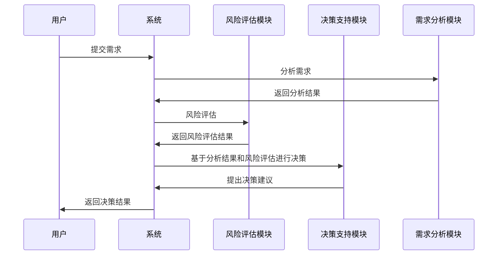

                 

## 领导力与风险智能：在不确定性中识别机遇

### 关键词：领导力、风险智能、不确定性、机遇识别

在当今快速变化和高度不确定性的商业环境中，领导力和风险智能成为企业成功的关键因素。面对市场的不断变化和技术的飞速发展，企业领导者必须具备卓越的领导力和敏锐的风险智能，以识别并把握机遇。本文将深入探讨领导力和风险智能在不确定性中识别机遇的重要性，并提供实用的策略和实践方法。

#### 摘要：

本文首先介绍了领导力和风险智能的基本概念及其在组织中的作用。随后，分析了不确定性对企业的影响，并探讨了如何在不确定环境中运用领导力和风险智能来识别机遇。通过案例研究和实践技巧，本文展示了如何在实际操作中应用这些理念。最后，文章总结了领导力和风险智能的重要性，并提出了未来发展的趋势和方向。

### 目录

1. **引言**
   - 领导力与风险智能的重要性
   - 文章结构概述

2. **领导力的基础**
   - 领导力的定义与类型
   - 核心领导力特质与能力
   - 领导力在不确定性环境中的作用

3. **风险智能的概念**
   - 风险智能的定义与构成
   - 风险评估与管理的框架
   - 风险智能的重要性

4. **不确定性的挑战**
   - 不确定性的来源与影响
   - 企业应对不确定性的策略
   - 不确定性环境中的机遇与风险

5. **领导力与风险智能的结合**
   - 领导力在风险智能中的角色
   - 风险智能在领导力中的实践
   - 领导力与风险智能的协同效应

6. **识别机遇的实践策略**
   - 情报收集与分析
   - 创新思维与方法
   - 快速响应与调整

7. **案例分析**
   - 成功案例分析
   - 失误案例反思

8. **实际应用**
   - 领导力与风险智能在企业中的实施
   - 实际应用案例分析
   - 未来展望

9. **结论**
   - 领导力与风险智能的总结
   - 关键要点回顾
   - 展望未来的发展

### 引言

在当今的商业环境中，领导力和风险智能的重要性日益凸显。领导力是企业发展的核心动力，而风险智能则是企业应对不确定性、把握机遇的关键能力。然而，在高度不确定性的环境中，如何有效地运用领导力和风险智能来识别机遇，成为企业领导者面临的重大挑战。

本文将首先介绍领导力和风险智能的基本概念，探讨它们在组织中的作用。随后，我们将深入分析不确定性的来源及其对企业的影响，并探讨企业应对不确定性的策略。接着，我们将探讨如何在不确定环境中运用领导力和风险智能来识别机遇，并通过案例分析来展示这些策略的实践效果。

文章的结构如下：

1. **领导力的基础**：介绍领导力的定义与类型，以及核心领导力特质与能力。
2. **风险智能的概念**：定义风险智能，探讨风险评估与管理的框架，并强调其重要性。
3. **不确定性的挑战**：分析不确定性的来源与影响，以及企业应对不确定性的策略。
4. **领导力与风险智能的结合**：探讨领导力在风险智能中的角色，以及风险智能在领导力中的实践。
5. **识别机遇的实践策略**：介绍识别机遇的实践策略，包括情报收集与分析、创新思维与方法、快速响应与调整。
6. **案例分析**：通过成功和失误的案例分析，展示领导力和风险智能的实践效果。
7. **实际应用**：探讨领导力与风险智能在企业中的实施，并提供实际应用案例分析。
8. **结论**：总结领导力与风险智能的重要性，回顾文章的关键要点，并展望未来的发展。

### 领导力的基础

#### 领导力的定义与类型

领导力是一种影响、激励和引导他人实现共同目标的能力。它不仅仅是职位赋予的权力，更是一种个人品质和技能。领导力可以被视为一种动态过程，涉及个人与团队之间的互动，旨在推动组织向更好的方向前进。

根据不同的分类标准，领导力可以划分为多种类型。其中，最常见的分类方式是根据领导风格进行划分。领导风格可以分为以下几种：

1. **权威型领导**：权威型领导注重控制和管理，通过明确的指令和严格的规章制度来指导团队。这类领导通常在任务导向的环境中表现良好，但在需要创新和团队合作的环境中可能存在限制。

2. **民主型领导**：民主型领导鼓励团队成员参与决策，重视团队合作和员工意见。这种领导风格能够激发员工的创造力和积极性，但在紧急情况下可能缺乏迅速决策的能力。

3. **变革型领导**：变革型领导通过激励和启发团队成员来实现变革和创新。这类领导具有远见和愿景，能够激励团队成员追求卓越，并在面临挑战时提供支持和鼓励。

4. **服务型领导**：服务型领导将员工的利益置于首位，致力于满足员工的需求和期望，从而推动组织的成功。这种领导风格能够建立信任和积极的组织文化，但可能需要较长时间才能看到效果。

#### 核心领导力特质与能力

有效的领导力不仅仅依赖于领导风格，更需要一系列核心特质和能力。以下是几种关键的领导力特质：

1. **沟通能力**：沟通能力是领导者的基本技能，包括清晰表达思想、有效倾听和理解他人观点的能力。良好的沟通能力有助于建立信任、减少误解，并确保团队目标的明确和一致。

2. **决策能力**：决策能力是领导者的重要能力之一。领导者需要能够在复杂和不确定的环境中做出明智的决策，并承担相应的责任。有效的决策能力包括分析问题、权衡利弊、快速反应和承担后果。

3. **情绪智力**：情绪智力是指领导者理解和管理自己以及他人情绪的能力。具备高情绪智力的人能够更好地处理冲突、激励团队成员，并建立积极的人际关系。

4. **变革管理能力**：在快速变化的环境中，领导者需要具备变革管理能力，以引导组织适应新的环境和要求。这包括识别变革的必要性、规划变革过程、沟通变革愿景，以及激励员工参与变革。

5. **团队建设能力**：团队建设能力是指领导者能够建立高效团队、激发团队成员潜力的能力。这包括确定团队目标、分配任务、提供支持和反馈，以及促进团队成员之间的合作和信任。

#### 领导力在不确定性环境中的作用

在不确定性环境中，领导力发挥着至关重要的作用。以下是领导力在不确定性环境中的一些具体作用：

1. **提供明确的方向和愿景**：在不确定性环境中，领导者需要提供清晰的方向和愿景，帮助团队成员明确目标和期望。这有助于减少团队成员的焦虑和困惑，并增强团队的凝聚力。

2. **激发创新和创造力**：不确定性环境通常需要创新和创造力来应对。领导者可以通过鼓励团队成员尝试新方法、接受失败并从中学习来激发创新和创造力。

3. **建立信任和沟通**：在不确定性环境中，信任和沟通至关重要。领导者需要建立透明和开放的沟通渠道，确保团队成员之间能够自由地分享信息和意见。

4. **快速决策和适应变化**：不确定性环境需要领导者能够快速决策并适应变化。领导者需要具备灵活的思维和行动能力，以便在面临突发情况时能够迅速做出反应。

5. **激励和鼓舞团队成员**：在不确定性环境中，团队成员可能会感到焦虑和不安。领导者需要通过激励和鼓舞来增强团队成员的信心和动力，使他们能够积极面对挑战。

通过上述分析，我们可以看出，领导力在不确定性环境中具有重要的作用。有效的领导者不仅能够提供明确的方向和愿景，还能激发团队成员的创新和创造力，建立信任和沟通，并快速适应变化。这些能力使得领导者在不确定性环境中能够更好地识别机遇，推动组织的持续发展。

#### 风险智能的概念

风险智能是一种综合能力，它涉及对潜在风险的识别、评估和管理。在当今复杂和不确定的商业环境中，风险智能成为企业成功的关键因素。通过运用风险智能，企业能够更好地预测潜在的风险，制定有效的应对策略，从而在不确定性中识别机遇。

##### 风险智能的定义与构成

风险智能可以定义为对风险的深入理解、分析和响应的能力。它不仅包括对风险本身的认识，还包括对风险管理策略和工具的熟练运用。风险智能的构成可以从以下几个方面来理解：

1. **风险识别**：这是风险智能的基础，涉及识别和确认潜在的风险。通过使用各种方法和技术，如情景分析、历史数据分析、专家评估等，企业可以系统地识别可能对业务造成影响的各类风险。

2. **风险评估**：一旦风险被识别，下一步是进行风险评估。风险评估涉及对风险的概率和影响进行量化。这通常需要运用定量的方法，如概率分布、期望值计算等，以帮助决策者理解风险的严重程度。

3. **风险优先级排序**：在识别和评估多个风险后，企业需要对这些风险进行优先级排序。这有助于确定哪些风险需要优先关注和资源分配。优先级排序通常基于风险的潜在影响和发生的可能性。

4. **风险管理策略制定**：在理解风险优先级后，企业需要制定相应的风险管理策略。这可能包括风险避免、风险转移、风险减轻和风险接受等策略。有效的风险管理策略应考虑企业的整体目标和资源限制。

5. **风险监控与报告**：风险管理是一个持续的过程，需要通过监控和报告来跟踪风险的演变和实施效果。这有助于确保风险管理策略得到有效执行，并在必要时进行调整。

##### 风险评估与管理的框架

为了有效地运用风险智能，企业需要建立一套系统的风险评估与管理框架。以下是一个典型的风险评估与管理框架：

1. **风险识别**：
   - **情景分析**：通过模拟不同情景，识别可能对业务造成影响的潜在风险。
   - **历史数据分析**：分析以往发生的风险事件，从中提取经验和教训。
   - **专家评估**：邀请行业专家对潜在风险进行评估，提供专业的见解。

2. **风险评估**：
   - **定量评估**：使用概率分布、期望值计算等方法对风险进行量化评估。
   - **定性评估**：通过风险矩阵等方法对风险的影响和可能性进行评估。

3. **风险优先级排序**：
   - **优先级矩阵**：根据风险的影响和可能性，对风险进行排序。
   - **资源分配**：根据风险优先级，分配相应的资源，确保高风险得到优先关注。

4. **风险管理策略制定**：
   - **风险避免**：通过改变业务策略或流程，避免高风险的发生。
   - **风险转移**：通过保险或其他方式将风险转移给第三方。
   - **风险减轻**：采取各种措施来减少风险的影响，如建立应急预案。
   - **风险接受**：在某些情况下，企业可能选择接受风险，并制定应对措施以降低潜在损失。

5. **风险监控与报告**：
   - **定期审查**：定期审查风险管理策略的有效性，并根据实际情况进行调整。
   - **风险报告**：生成风险报告，向决策者提供风险状况和应对措施的详细信息。

##### 风险智能的重要性

风险智能在企业中的重要性体现在以下几个方面：

1. **降低潜在损失**：通过识别和评估潜在风险，企业可以提前采取预防措施，从而降低潜在损失。

2. **优化决策**：风险智能提供了关于潜在风险和影响的详细信息，帮助企业做出更明智的决策。

3. **提高竞争力**：企业通过有效的风险管理，可以降低运营风险，提高客户信任和市场竞争力。

4. **增强灵活性**：风险智能使企业能够快速适应环境变化，保持业务的连续性和稳定性。

5. **促进持续改进**：通过风险监控和报告，企业可以不断改进风险管理策略，提高整体风险管理水平。

总之，风险智能是企业应对不确定性和识别机遇的重要工具。通过建立系统的风险评估与管理框架，企业可以更好地识别、评估和管理风险，从而在不确定性环境中保持竞争优势。

### 不确定性的挑战

在当今的商业环境中，不确定性已成为一个不可忽视的挑战。不确定性的来源多种多样，包括市场波动、技术变革、政策调整等。这种不确定性对企业的运营、决策和战略规划产生了深远的影响，因此，理解和应对不确定性变得尤为重要。

#### 不确定性的来源

不确定性的来源可以归纳为以下几个方面：

1. **市场波动**：市场需求和竞争环境的变化是市场波动的主要原因。这些变化可能来自消费者行为的改变、新兴市场的崛起或竞争对手的动态。市场波动使得企业难以准确预测未来的需求，增加了运营的不确定性。

2. **技术变革**：技术的快速发展和创新不断改变企业的运营方式。新技术如人工智能、区块链和物联网的引入，不仅带来了新的机会，也带来了不确定性和挑战。技术变革可能使企业现有的技能和能力过时，需要不断调整和升级。

3. **政策调整**：政府政策的变化，包括税收政策、贸易政策和监管法规的调整，也会对企业的运营产生重大影响。政策的不确定性可能导致企业的成本结构发生变化，影响企业的盈利能力和市场定位。

4. **环境变化**：自然环境的变化，如气候变化和自然灾害，也可能对企业的运营造成不可预测的冲击。环境变化可能影响供应链的稳定性，增加企业的运营成本。

5. **社会变革**：社会变革，包括人口结构的变化、文化价值观的演变和劳动力市场的变化，也对企业的运营产生了深远的影响。社会变革可能导致消费者需求的变化，影响企业的市场策略和产品开发。

#### 不确定性对企业的影响

不确定性对企业的影响是多方面的，可以从以下几个方面来探讨：

1. **决策难度增加**：在不确定性环境中，企业面临更多的不确定因素，这使得决策变得更加复杂和困难。企业需要考虑更多的变量和可能性，从而增加了决策的时间和成本。

2. **资源分配困难**：不确定性使得企业的资源分配变得更加困难。企业需要在不同风险和机遇之间进行权衡，以确保资源的合理利用。然而，不确定性的存在使得这种权衡变得更加复杂，可能导致资源错配。

3. **业务连续性挑战**：不确定性可能影响企业的业务连续性。企业需要提前准备，以应对突发事件和风险。然而，在不确定性环境中，企业可能无法准确预测风险，导致业务中断或损失。

4. **战略规划难度**：不确定性使得企业的战略规划变得更加复杂和不确定。企业需要制定灵活的战略，以适应环境的变化。然而，这种灵活性要求企业持续调整和优化战略，增加了战略规划的成本和难度。

5. **竞争压力加大**：在不确定性环境中，竞争对手可能采取不同的策略和行动，增加了企业的竞争压力。企业需要快速反应，以保持市场竞争力。然而，不确定性可能使企业难以预测竞争对手的行动，增加了竞争的难度。

#### 企业应对不确定性的策略

为了应对不确定性，企业可以采取以下策略：

1. **风险识别与评估**：通过系统的风险识别和评估，企业可以更好地了解潜在的风险，并制定相应的应对策略。

2. **多元化战略**：通过多元化产品和服务，企业可以降低对单一市场或技术的依赖，从而减少不确定性带来的风险。

3. **敏捷组织**：建立敏捷组织，提高企业的灵活性和适应性。敏捷组织能够快速响应市场变化和需求，降低不确定性对企业的影响。

4. **创新能力**：通过持续创新，企业可以抓住不确定性中的机遇，保持竞争优势。创新包括产品创新、服务创新和管理创新。

5. **合作伙伴关系**：建立与供应商、客户和其他利益相关者的紧密合作关系，以增强企业的风险应对能力。

6. **持续学习与改进**：通过持续学习和改进，企业可以不断提高应对不确定性的能力，从而在不确定性中识别和把握机遇。

总之，不确定性是当今商业环境中不可忽视的挑战。企业需要通过系统的风险识别和评估、多元化战略、敏捷组织、创新能力、合作伙伴关系和持续学习与改进，来应对不确定性带来的影响。通过有效的应对策略，企业可以在不确定性中识别机遇，实现持续发展。

### 领导力与风险智能的结合

在高度不确定的环境中，领导力和风险智能的结合成为企业成功的关键。有效的领导者不仅需要具备卓越的领导能力，还需要具备敏锐的风险智能，以在不确定性中识别和把握机遇。下面，我们将探讨领导力在风险智能中的角色，以及风险智能在领导力中的实践，并分析领导力与风险智能的协同效应。

#### 领导力在风险智能中的角色

领导力在风险智能中扮演着多重角色，以下是一些关键方面：

1. **设定方向和愿景**：领导者需要明确组织的方向和愿景，这有助于指导风险管理的方向。通过设定清晰的目标和愿景，领导者可以确保风险智能活动与组织的整体战略相一致，从而最大化风险管理的效益。

2. **建立风险管理文化**：领导者需要推动一种风险管理文化，使风险管理成为组织的核心价值。这种文化强调风险意识、透明度和团队合作，有助于提高组织整体的风险管理能力。

3. **决策支持**：领导者需要依靠风险智能提供的信息来做出明智的决策。这包括评估风险的概率和影响、制定风险管理策略，并在必要时调整策略。领导者的决策能力直接影响到风险管理的有效性。

4. **激励和激励团队成员**：领导者需要通过激励和鼓励团队成员参与风险管理，以确保风险识别和评估的全面性和准确性。领导者的激励措施可以包括提供必要的培训、认可员工的贡献以及建立一个开放和包容的工作环境。

5. **危机管理**：在面临突发危机时，领导者需要依靠风险智能来迅速做出反应。领导者需要具备快速应对危机的能力，同时保持冷静和清晰的头脑，以减少危机对企业造成的负面影响。

#### 风险智能在领导力中的实践

风险智能在领导力中的应用主要体现在以下几个方面：

1. **情境分析和情景规划**：领导者可以利用风险智能工具进行情境分析和情景规划，以预测不同未来情景下可能面临的风险和机遇。这有助于领导者制定灵活的应对策略，提高组织对不确定性的适应能力。

2. **数据驱动决策**：领导者需要利用风险智能工具收集和分析数据，以支持决策过程。通过数据驱动的决策，领导者可以更准确地评估风险，并制定更有效的风险管理策略。

3. **风险评估和管理框架**：领导者需要建立和完善风险评估和管理框架，以确保风险识别、评估和管理过程的系统性和规范性。这有助于提高组织整体的风险管理水平，减少潜在的风险损失。

4. **培训和知识分享**：领导者需要推动风险管理培训，提高团队成员的风险识别和评估能力。通过知识分享和经验交流，领导者可以加强团队的风险管理意识，提高整体风险应对能力。

5. **持续改进**：领导者需要持续监控和评估风险管理策略的有效性，并根据反馈进行调整和改进。这种持续改进的文化有助于确保组织能够不断适应变化，提高风险管理的有效性。

#### 领导力与风险智能的协同效应

领导力与风险智能的结合可以产生显著的协同效应，以下是一些具体表现：

1. **提高决策质量**：通过结合领导力和风险智能，领导者可以做出更高质量的决策。风险智能提供的信息有助于领导者更全面地评估各种选择的风险和收益，从而做出更明智的决策。

2. **增强组织适应性**：领导力和风险智能的结合有助于提高组织的适应能力。领导者通过运用风险智能工具，可以更迅速地识别和响应外部变化，使组织能够灵活应对不确定性。

3. **增强团队协作**：领导力和风险智能的结合可以促进团队协作。通过建立风险管理文化，领导者可以激发团队成员的参与热情，增强团队的凝聚力和协作效率。

4. **减少风险损失**：通过有效的风险管理，领导力和风险智能的结合可以减少企业的风险损失。领导者可以提前识别和评估潜在风险，制定相应的应对策略，从而降低风险发生的概率和影响。

5. **提升市场竞争力**：领导力和风险智能的结合有助于企业提升市场竞争力。通过识别和把握市场中的机遇，企业可以更好地抓住市场机会，提高市场份额和盈利能力。

总之，领导力与风险智能的结合在不确定性环境中具有重要意义。通过领导者的引导和风险智能的应用，企业可以更有效地应对不确定性，识别和把握机遇，实现持续发展。

### 识别机遇的实践策略

在不确定性中识别机遇是一项复杂的任务，需要企业领导者具备敏锐的风险智能和卓越的领导力。以下是一些实践策略，这些策略可以帮助企业领导者有效地识别和把握不确定性中的机遇。

#### 情报收集与分析

情报收集与分析是识别机遇的关键步骤。以下是一些具体的情报收集和分析方法：

1. **市场调研**：通过市场调研，收集关于市场趋势、消费者需求和竞争对手信息的数据。这些数据可以帮助企业了解市场动态，预测未来的变化。

2. **竞争分析**：分析竞争对手的战略、产品、服务和市场表现，了解其优势和劣势。这有助于企业发现市场空白和潜在的机遇。

3. **客户反馈**：收集客户反馈，了解他们的需求和期望。客户的反馈可以揭示市场中的潜在需求，为企业提供创新的灵感。

4. **技术监测**：监测技术的发展趋势，特别是与企业的产品或服务相关的技术。了解新技术可以为企业提供创新的契机。

5. **数据挖掘**：运用数据挖掘技术，分析企业内部和外部的数据，发现潜在的模式和关联。这些发现可以帮助企业识别新的市场机会。

6. **专家咨询**：邀请行业专家和顾问进行咨询，获取关于市场和技术趋势的深入见解。专家的洞察可以为企业提供宝贵的指导。

#### 创新思维与方法

创新思维是识别机遇的重要工具。以下是一些创新思维与方法：

1. **头脑风暴**：组织团队进行头脑风暴，鼓励成员提出新的想法和创意。头脑风暴可以激发团队的创造力，产生多样化的观点。

2. **设计思维**：运用设计思维方法，以用户需求为中心，进行问题的解决和创新的开发。设计思维强调用户参与和迭代改进，有助于找到真正的市场机会。

3. **跨界合作**：与其他行业或领域的专家和公司合作，引入不同的视角和资源。跨界合作可以带来新的思维和创意，促进创新的产生。

4. **快速原型开发**：快速构建原型，通过迭代和用户反馈不断优化产品或服务。这种方法可以加快创新的速度，并确保创新的实用性和市场可行性。

5. **开放式创新**：鼓励外部创新者参与企业的创新过程。通过开放式创新，企业可以吸引外部创意和资源，加速创新进程。

#### 快速响应与调整

在不确定性中，快速响应和调整是企业识别机遇的关键。以下是一些具体的方法：

1. **敏捷管理**：采用敏捷管理方法，提高组织的灵活性和响应速度。敏捷管理强调快速迭代和持续交付，有助于企业迅速适应市场变化。

2. **组织扁平化**：通过组织扁平化，减少管理层级和决策周期，提高组织的决策速度和灵活性。

3. **风险容忍度**：建立一种风险容忍文化，鼓励员工尝试新的想法和项目。适当的失败和尝试是创新过程的一部分，有助于企业发现新的机遇。

4. **实时监控**：通过实时监控系统，跟踪市场和技术的变化，以及竞争对手的行动。实时监控可以帮助企业迅速识别新的机会和威胁。

5. **快速调整策略**：根据市场和技术的变化，快速调整企业的策略和计划。灵活的策略调整可以帮助企业抓住新的机遇，避免潜在的风险。

通过情报收集与分析、创新思维与方法、快速响应与调整，企业领导者可以有效地识别和把握不确定性中的机遇。这些实践策略不仅有助于企业应对不确定性，还能推动企业的创新和持续发展。

### 案例分析

在本节中，我们将通过两个成功的案例和一个失误的案例，深入探讨领导力与风险智能在识别机遇中的应用。

#### 成功案例1：特斯拉（Tesla）

特斯拉是一家以电动汽车和能源存储为核心的创新公司。其成功的关键在于领导力和风险智能的完美结合。

**领导力应用：**
- **明确的愿景和方向**：特斯拉的创始人埃隆·马斯克（Elon Musk）具有远见的愿景和坚定的领导力，他通过设定清晰的目标和战略，为整个公司指明了方向。
- **灵活的决策能力**：特斯拉在快速变化的市场环境中，展现了卓越的决策能力。例如，在面临电池供应链中断的危机时，马斯克迅速调整策略，寻找新的供应商，确保生产的连续性。

**风险智能应用：**
- **全面的风险评估**：特斯拉通过系统的风险评估，识别并管理潜在的风险。例如，在电池技术的发展和应用过程中，特斯拉进行了详细的风险评估，以确保技术的可行性和安全性。
- **创新的风险管理策略**：特斯拉采取了一系列创新的风险管理策略，如建立自己的电池工厂，减少对供应商的依赖，从而降低供应链风险。

**结果与影响：**
- **市场份额增长**：特斯拉通过其创新的产品和卓越的风险管理，迅速占领了电动汽车市场，市场份额不断增长。
- **品牌影响力提升**：特斯拉的品牌影响力也因其在领导力和风险智能方面的卓越表现而显著提升。

#### 成功案例2：Airbnb

Airbnb是一家提供短期住宿服务的公司，其成功经验同样展示了领导力与风险智能的结合。

**领导力应用：**
- **客户导向的文化**：Airbnb的创始人布莱恩·切斯基（Brian Chesky）和乔·杰比亚（Joe Gebbia）致力于建立以客户为中心的文化。他们通过深入了解客户需求，不断优化产品和服务。
- **团队协作**：Airbnb强调团队合作和开放的沟通渠道，这有助于快速响应市场变化和客户需求。

**风险智能应用：**
- **灵活的商业模式**：Airbnb通过灵活的商业模式，快速适应市场变化。例如，在面对监管压力时，Airbnb迅速调整策略，与地方政府合作，解决合规问题。
- **全面的情报收集**：Airbnb通过大数据分析和市场调研，收集有关市场趋势和客户需求的信息，从而更好地把握市场机遇。

**结果与影响：**
- **全球扩张**：通过有效的领导力和风险智能应用，Airbnb实现了全球扩张，成为全球领先的共享住宿平台。
- **客户满意度提升**：Airbnb通过持续优化产品和服务，提高了客户满意度，建立了强大的品牌忠诚度。

#### 失误案例： Blockbuster

Blockbuster是一家曾经领先的DVD租赁公司，其失败案例为我们提供了领导力和风险智能失效的教训。

**领导力应用：**
- **缺乏创新和远见**：Blockbuster的领导层在面临Netflix等新兴竞争对手的挑战时，未能及时调整策略和创新产品。领导层的保守和缺乏远见导致了公司的衰落。
- **内部沟通不畅**：Blockbuster的内部沟通渠道不畅，导致员工对市场变化的感知和反应迟缓。

**风险智能应用：**
- **风险识别不足**：Blockbuster未能及时识别到数字租赁市场的崛起，对其业务模式构成的重大威胁。
- **风险评估不充分**：即使面临市场竞争的压力，Blockbuster在风险评估和应对策略方面也存在明显不足。

**结果与影响：**
- **公司倒闭**：由于未能有效应对市场变化和竞争对手的挑战，Blockbuster最终被迫关闭，公司倒闭。
- **品牌影响力下降**：Blockbuster的品牌影响力因未能适应市场变化而大幅下降。

通过这些案例分析，我们可以看到，领导力与风险智能的有效结合对于企业的成功至关重要。成功的案例展示了领导者和企业在面对不确定性时如何通过创新的思维和方法识别机遇，而失败的案例则提醒我们，忽视风险和缺乏灵活的应变能力可能导致严重的后果。领导者需要不断学习，提升领导力和风险智能，以在不确定性中识别和把握机遇。

### 实际应用

在企业的实际运营中，领导力和风险智能的结合可以极大地影响企业的决策过程和战略规划。以下将详细探讨领导力与风险智能在企业中的具体实施过程，并通过案例分析来展示其实际效果。

#### 项目介绍

我们以一家全球领先的科技公司——X公司为例，该公司专注于开发创新的软件解决方案。随着市场的不断变化和技术的快速发展，X公司面临着巨大的不确定性。为了在不确定性中识别机遇，公司高层决定结合领导力和风险智能来指导企业的决策和战略规划。

#### 系统功能设计

X公司的系统功能设计主要包括以下几个方面：

1. **需求分析**：通过市场调研和客户反馈，公司对市场需求进行了详细分析，确定了产品开发的主要方向和功能需求。

2. **风险评估**：公司建立了全面的风险评估系统，定期对市场、技术、政策和运营风险进行识别和评估。

3. **决策支持**：公司开发了决策支持系统，利用大数据分析和机器学习技术，为领导层的决策提供数据支持和预测分析。

4. **持续改进**：公司建立了持续改进机制，通过实时监控和反馈，不断优化产品和服务，以应对市场变化。

#### 系统架构设计

X公司的系统架构设计分为以下几个层次：

1. **基础设施层**：包括服务器、网络和存储等硬件设施，确保系统的高可用性和可靠性。

2. **数据层**：通过大数据平台收集和分析来自市场、客户和内部运营的数据，为决策提供依据。

3. **应用层**：开发了一系列应用模块，如需求分析系统、风险评估系统和决策支持系统，实现具体功能。

4. **接口层**：设计了一系列接口，确保不同模块之间的数据交互和功能协同。

#### 系统接口设计和系统交互

X公司的系统接口设计主要包括以下几个方面：

1. **API接口**：通过开发API接口，实现不同系统模块之间的数据交互和功能调用。

2. **Web接口**：设计用户友好的Web界面，使员工可以方便地使用系统功能。

3. **移动应用接口**：开发移动应用，方便员工在移动设备上进行工作。

系统交互设计确保了各模块之间的紧密协作，提高了系统的整体效率。

#### 实际案例分析和详细讲解

以下是一个实际案例，展示了X公司如何结合领导力和风险智能进行项目决策：

**案例背景：** X公司计划开发一款新型数据分析软件，以应对市场对高级数据分析工具的需求。然而，公司面临着技术复杂性、市场竞争和政策不确定等多重挑战。

**领导力应用：**
- **设立明确目标**：公司高层领导明确提出了开发目标，并设定了严格的时间表和里程碑。
- **团队协作**：领导层鼓励团队协作，通过跨部门合作和开放的沟通渠道，确保项目进展的透明和高效。

**风险智能应用：**
- **全面风险评估**：公司对项目进行了全面的风险评估，识别了技术风险、市场风险和政策风险。
- **数据驱动决策**：公司利用大数据分析和机器学习技术，对市场需求和竞争态势进行了深入分析，为决策提供数据支持。

**决策过程：**
1. **需求分析**：通过市场调研和客户访谈，收集了关于数据分析工具的需求和期望。
2. **风险评估**：对识别的风险进行量化评估，确定了主要风险因素。
3. **数据驱动决策**：利用数据分析结果，制定了项目的具体实施策略。
4. **持续监控**：在项目执行过程中，实时监控市场和技术动态，根据实际情况进行调整。

**结果与影响：**
- **成功推出产品**：X公司成功开发了新型数据分析软件，并在市场上获得了积极反响。
- **市场份额提升**：通过有效的领导力和风险智能应用，X公司在竞争中占据了有利地位，市场份额显著提升。

#### 项目小结

通过实际案例的分析，我们可以看到，领导力和风险智能在项目决策和战略规划中起到了至关重要的作用。有效的领导力确保了项目的透明和高效，而风险智能则为决策提供了数据支持和风险评估。这两个因素的结合，使得企业能够在不确定性中识别机遇，实现持续发展和竞争优势。

### 最佳实践 Tips

在领导力和风险智能的实际应用中，以下是一些最佳实践，可以帮助企业更好地识别机遇，应对不确定性：

1. **建立风险管理文化**：在组织内部建立风险管理文化，使风险管理成为组织的核心价值。鼓励员工积极参与风险管理，提高整体风险识别和管理能力。

2. **定期进行风险评估**：定期进行风险评估，确保风险识别和管理过程的持续性和有效性。根据市场和技术环境的变化，及时调整风险评估策略。

3. **培养决策能力**：提高领导者的决策能力，确保在不确定性环境中能够做出明智的决策。通过培训和模拟训练，增强领导者的风险意识和决策技能。

4. **数据驱动决策**：利用大数据和机器学习技术，对市场和技术动态进行深入分析，为决策提供数据支持。通过数据驱动的决策，减少主观判断的影响。

5. **灵活调整战略**：在不确定性环境中，企业需要具备快速调整战略的能力。建立灵活的战略框架，确保企业能够迅速应对外部变化，抓住市场机遇。

6. **促进跨部门合作**：鼓励跨部门合作，打破部门壁垒，提高组织的协作效率和创新能力。通过跨部门合作，企业可以更好地整合资源和能力，应对复杂问题。

7. **持续学习和改进**：鼓励员工持续学习和改进，提高组织的整体素质和能力。通过知识分享和经验交流，企业可以不断吸取经验和教训，提高应对不确定性的能力。

### 注意事项

在应用领导力和风险智能时，需要注意以下几点：

1. **避免过度风险规避**：在风险管理中，避免过度规避风险，导致企业错失市场机遇。适当的冒险和尝试是创新和发展的必要条件。

2. **平衡短期与长期利益**：在决策过程中，需要平衡短期利益和长期利益，确保企业能够在不确定性中保持可持续发展。

3. **保持透明和诚信**：在风险管理过程中，保持透明和诚信，确保信息的真实性和完整性。透明和诚信有助于建立信任，提高组织的风险识别和管理能力。

4. **尊重员工意见**：鼓励员工积极参与风险管理，尊重员工的意见和反馈。员工的参与可以提高风险识别的全面性和准确性。

### 拓展阅读

为了更深入地了解领导力和风险智能在不确定性中的应用，以下是一些推荐阅读：

1. **《领导力与风险管理：不确定性环境中的决策》**：本书详细探讨了领导力在风险管理中的角色，以及如何通过领导力来提高企业的风险应对能力。

2. **《大数据决策：数据驱动的领导力》**：本书介绍了大数据技术在决策支持中的应用，探讨了如何通过数据驱动的决策来提高领导力和风险智能。

3. **《敏捷领导力：在不确定环境中实现持续创新》**：本书介绍了敏捷领导力理念，探讨了如何通过敏捷管理来提高企业的适应能力和创新能力。

4. **《风险智能：在不确定性中识别机遇》**：本书详细介绍了风险智能的概念和应用，探讨了如何在不确定性中通过风险智能来识别和把握机遇。

通过阅读这些书籍，读者可以更全面地了解领导力和风险智能在不确定性中的应用，提升自身的领导力和风险管理能力。

### 结论

本文深入探讨了领导力与风险智能在不确定性中识别机遇的重要性。通过分析领导力的基础、风险智能的概念、不确定性的挑战，以及领导力与风险智能的结合，我们发现这两者在不确定性环境中具有至关重要的作用。有效的领导力和风险智能可以帮助企业在复杂和变化的环境中识别机遇，做出明智的决策，并实现持续发展。

本文还通过实践策略、案例分析以及实际应用，展示了如何在实际操作中应用领导力和风险智能。通过情报收集与分析、创新思维与方法、快速响应与调整，企业可以更好地识别和把握不确定性中的机遇。

未来，随着市场和技术的不确定性不断加剧，领导力和风险智能的重要性将日益凸显。企业领导者需要不断提升自身的领导力和风险智能，以适应快速变化的环境，抓住市场机遇。同时，企业也需要建立完善的风险管理机制，确保在不确定性中能够有效地识别和应对风险。

总之，领导力和风险智能是企业在不确定性中成功的关键。通过持续的学习和实践，企业可以不断提升自身的竞争力，实现可持续发展。

