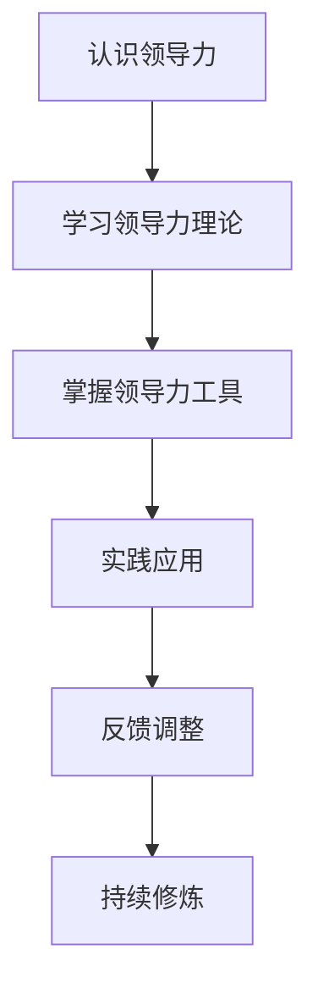
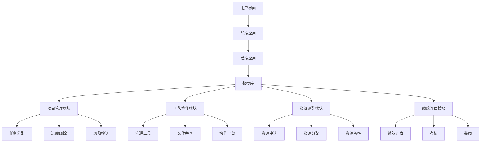
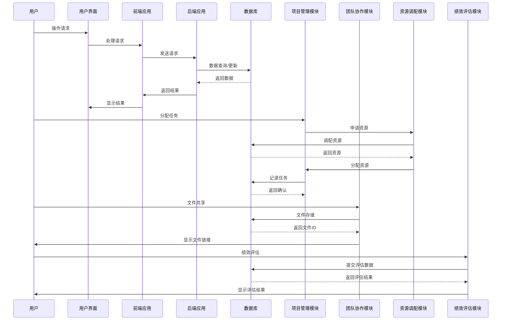

                 

### 引言

在快速变化的现代企业环境中，领导力被视为企业持续成功和成长的关键因素。随着技术的不断进步和市场竞争的日益激烈，企业不仅需要拥有创新的技术能力和高效的生产流程，还需要具备强大的领导力来推动企业变革和发展。尤其是在从工程总监向管理者转变的过程中，这种领导力显得尤为重要。工程总监往往具备深厚的专业技术和丰富的项目管理经验，但当他们升任为管理者时，如何有效利用这些优势进行团队管理和战略决策，成为他们面临的一大挑战。

《领导力修炼手册：从工程总监到管理者的蜕变宝典》正是为了应对这一挑战而编写的。本书旨在为工程总监提供一套系统、实用的领导力修炼方法，帮助他们顺利完成角色转变，成为一名出色的管理者。通过阅读本书，读者可以：

1. **理解领导力的本质**：深入理解领导力的基本概念、原理和重要性，明确领导力在企业发展和个人职业成长中的关键作用。
2. **掌握领导力修炼策略**：学习个人成长、决策能力和沟通技巧等关键领导力修炼策略，提升自身的领导能力和管理水平。
3. **学会应对现实挑战**：通过案例分析，了解其他工程总监成功转型为管理者的经验和教训，借鉴最佳实践，解决实际管理中的问题和难题。
4. **构建有效的领导力体系**：运用领导力工具和方法，构建适应企业需求的领导力体系，提升团队绩效和整体竞争力。

本书的核心价值和目标是帮助工程总监突破专业领域的限制，拓展管理视野，提升领导力，从而在企业中发挥更大的影响力，实现个人和企业的共同成长。

### 目录大纲设计思路

为了使《领导力修炼手册：从工程总监到管理者的蜕变宝典》的内容更具逻辑性和可操作性，目录大纲的设计思路如下：

#### 一、背景介绍

**1. 问题背景**

阐述领导力在现代企业管理中的重要性，特别是在当前技术快速迭代和市场竞争加剧的环境下，企业需要具备强大的领导力来推动创新和持续发展。工程总监在向管理者转变过程中，面临着如何将技术专长转化为管理能力的挑战。

**2. 问题描述**

分析当前企业管理中存在的领导力挑战，如如何平衡技术能力和管理能力、如何处理跨部门协作和冲突、如何提升团队绩效等。

**3. 问题解决**

概述本书中的解决方法和策略，包括领导力基础概念的理解、领导力修炼策略的掌握以及实际应用案例分析等。

**4. 边界与外延**

定义书中的领导力概念，并明确其应用范围，如领导力在项目管理、团队建设、战略决策等方面的具体应用。

**5. 核心要素组成**

列出领导力修炼的关键要素，如个人成长、决策能力、沟通技巧、团队管理等。

#### 二、核心概念与联系

**1. 核心概念原理**

详细介绍领导力的基本概念，如领导风格、决策能力、团队管理等，并解释这些概念在企业管理和个人成长中的重要性。

**2. 概念属性特征对比表格**

制作一个对比表格，展示不同领导力概念的属性和特征，如权威型、民主型、变革型等领导风格的区别。

**3. ER实体关系图架构**

使用Mermaid绘制一个ER实体关系图，展示书中涉及的关键实体及其关系，如团队成员、项目、决策等。

#### 三、算法原理讲解

**1. Mermaid流程图**

使用Mermaid绘制一个流程图，展示领导力修炼的主要步骤和过程，如从认识到实践、从个人成长到团队管理等。

**2. Python源代码**

提供一个Python源代码示例，以实际操作方式解释领导力修炼的原理，如团队绩效评估和领导力模型训练等。

**3. 数学模型和公式**

使用LaTeX格式给出领导力修炼的数学模型和公式，如团队绩效评价模型、领导力发展模型等。

**4. 详细讲解和举例说明**

结合实际案例，详细阐述领导力修炼的原理和实施方法，如通过具体项目案例展示领导力的应用和实践。

#### 四、系统分析与架构设计方案

**1. 问题场景介绍**

描述一个实际管理场景，说明领导力在其中起到的作用，如项目团队的管理、跨部门协作等。

**2. 系统功能设计**

使用Mermaid绘制一个领域模型类图，展示系统的主要功能模块，如项目管理、团队协作、绩效评估等。

**3. 系统架构设计**

使用Mermaid绘制一个系统架构图，展示系统的整体结构，如技术架构、业务架构、数据架构等。

**4. 系统接口设计和系统交互**

使用Mermaid绘制一个系统交互序列图，展示系统的操作流程，如用户操作、系统响应等。

#### 五、项目实战

**1. 环境安装**

详细说明安装所需环境和工具，如开发环境配置、数据库安装等。

**2. 系统核心实现源代码**

提供关键源代码，并进行解读与分析，如系统核心算法实现、数据库操作等。

**3. 实际案例分析和详细讲解剖析**

结合实际案例，深入分析领导力修炼在实践中的应用，如通过具体项目展示领导力的实践效果。

**4. 项目小结**

总结项目经验，提出改进建议，如优化系统性能、改进团队管理方法等。

#### 六、最佳实践 tips、小结、注意事项、拓展阅读等内容

提供一些实用的最佳实践建议，如领导力培养的具体方法、项目管理技巧等，并对全书内容进行小结，指出注意事项，推荐拓展阅读资源，以帮助读者更好地理解和应用书中内容。

通过以上详细的目录大纲设计思路，本书将系统、全面地阐述从工程总监到管理者转变过程中所需的领导力修炼方法和实践经验，帮助读者顺利完成职业角色转变，提升领导力和管理水平。

### 第1章 领导力的背景介绍

领导力，作为一个广泛且多层次的概念，是现代企业管理中不可或缺的核心要素。它不仅关系到企业的战略决策和执行能力，更影响到员工的工作动力和团队协作效率。在全球化进程加快和市场竞争日趋激烈的今天，领导力成为企业持续发展的关键驱动力。一个具备强大领导力的管理者，不仅能够有效指导团队，推动项目顺利进行，还能够把握市场趋势，引领企业实现创新和突破。

#### 领导力的定义与重要性

领导力可以简单定义为一种影响力，即领导者通过激励和引导，使团队成员为实现共同目标而努力的能力。领导力不仅包含技术能力，如项目管理、技术实现等，还涉及人际交往、情感智慧和战略思维等多方面。在现代企业管理中，领导力的重要性体现在以下几个方面：

1. **促进创新与变革**：领导力能够激发团队的创造力和创新精神，推动企业在快速变化的市场环境中保持竞争优势。
2. **提升团队协作效率**：通过有效的领导，团队成员能够更好地协作，共同应对挑战，提高整体工作效率。
3. **增强员工归属感**：领导力有助于建立积极向上的企业文化，增强员工的归属感和忠诚度，从而提高员工的满意度和生产力。
4. **实现企业战略目标**：领导力能够帮助管理者制定和实施有效的战略规划，确保企业目标的实现。

#### 工程总监到管理者的角色转变

工程总监通常具备丰富的技术背景和项目经验，他们在团队管理和项目实施中发挥了重要作用。然而，当工程总监晋升为管理者，角色从技术专家转变为团队领导，面临着一系列新的挑战：

1. **技能转变**：从专注于技术细节和项目执行，转向关注团队管理和战略决策。
2. **职责扩大**：需要处理更多的跨部门协作、资源调配和风险管理。
3. **沟通能力提升**：与不同背景和职能的团队成员进行有效沟通，协调各种利益关系。
4. **领导风格调整**：从技术导向转向更全面的管理导向，注重团队整体绩效和长远发展。

#### 领导力修炼手册的核心价值

《领导力修炼手册：从工程总监到管理者的蜕变宝典》旨在帮助工程总监顺利完成这一角色转变，提升领导力和管理水平。本书的核心价值体现在以下几个方面：

1. **系统化的领导力培养**：通过详细阐述领导力的基本概念、核心要素和修炼策略，帮助读者建立系统的领导力知识体系。
2. **实用的实战案例**：结合实际案例，深入分析领导力在不同场景下的应用，提供实用的操作方法和策略。
3. **全面的技能提升**：不仅涵盖领导力的理论和方法，还涉及具体的管理技能，如决策能力、沟通技巧、团队建设等。
4. **持续的学习与成长**：提供持续学习和自我提升的方法，帮助读者在职业发展中不断进步，实现个人和企业的共同成长。

通过阅读本书，工程总监可以深入了解领导力的本质，掌握领导力修炼的方法和技巧，从而在职业转变中更加从容和自信，成为一名出色的管理者。

### 第2章 领导力基础概念

在深入探讨领导力之前，理解其基础概念是至关重要的。领导力不仅是一种技术能力，更是一种综合性的影响力。在这一章节中，我们将详细探讨领导力的定义、核心要素以及不同领导风格，为后续的深入分析奠定基础。

#### 领导力的定义

领导力可以被定义为一个过程，通过影响和激励他人，实现共同目标的能力。这个定义强调了几个关键点：

1. **过程**：领导力不是一成不变的，而是一个动态的过程，需要不断地调整和适应。
2. **影响和激励**：领导力的核心在于影响和激励他人，这不仅是通过强制或命令，更是通过建立信任和共同愿景。
3. **共同目标**：领导力是为了实现共同的目标，而不是单方面的利益。

#### 领导力的核心要素

领导力的有效性取决于多个核心要素，这些要素相互关联，共同构成了一个完整的领导力体系。以下是几个关键的领导力要素：

1. **决策能力**：决策能力是领导力的核心，一个优秀的领导者必须能够在复杂和不确定的环境中做出明智的决策。这需要领导者在分析问题、权衡利弊和评估风险方面具备出色的能力。

2. **沟通技巧**：沟通是领导力的重要组成部分，领导者需要能够清晰、有效地传达信息，并与团队成员建立良好的沟通渠道。这不仅包括口头沟通，还包括非语言沟通和书面沟通。

3. **团队建设**：团队建设是领导力的基础，一个领导者需要能够建立一个高效、和谐的团队。这包括招聘合适的团队成员、培养团队精神、激发团队成员的潜力等。

4. **情绪智慧**：情绪智慧是领导者需要具备的重要素质之一，它包括自我认知、自我调节、社交意识以及同理心。一个具备情绪智慧的领导者能够更好地理解和管理自己的情绪，也能更好地理解和支持团队成员。

5. **战略思维**：战略思维是领导者需要具备的高级能力，它涉及对企业的长期发展方向和市场竞争的深刻洞察。一个具备战略思维的领导者能够为企业制定明确的战略目标，并制定有效的实施计划。

#### 不同领导风格

领导风格是领导者在行使领导职责时表现出来的行为特征和态度。不同的领导风格对团队的影响各不相同，以下是几种常见的领导风格：

1. **权威型领导**：权威型领导者拥有高度的决策权和控制力，他们倾向于制定详细的计划，并对团队成员的行为进行严格的监督。这种领导风格在紧急情况下或在需要快速决策的情境下非常有效，但长期来看，可能会抑制团队成员的创造力和自主性。

2. **民主型领导**：民主型领导者重视团队成员的意见和建议，通过讨论和协商做出决策。这种领导风格能够增强团队的凝聚力和成员的参与感，但决策过程可能较为缓慢，且在紧急情况下可能不够高效。

3. **变革型领导**：变革型领导者通过激励和激励团队成员来实现组织变革和创新。他们通常具备强大的愿景和使命感，能够激发团队成员的潜力，推动组织不断进步。这种领导风格在推动企业转型和创新时非常有效。

4. **教练型领导**：教练型领导者注重个人发展和团队成长，他们通过提供指导和支持，帮助团队成员提升技能和实现目标。这种领导风格能够建立良好的师徒关系，提升团队整体能力。

通过理解这些基础概念，读者可以更好地理解领导力的本质和运作机制，为后续章节的深入探讨打下坚实的基础。

### 核心概念属性特征对比表格

为了更直观地了解不同领导力概念的属性和特征，下面提供了一个对比表格。该表格列出了权威型、民主型、变革型和教练型四种领导风格的属性和特征，并进行对比分析。

| 领导风格 | 属性 | 特征 | 对团队的影响 | 适用场景 |
| :---: | :---: | :---: | :---: | :---: |
| 权威型 | 高度集中决策权 | 命令式管理，严格监督 | 提高决策效率，确保执行力 | 紧急情况、需要快速决策 |
| 民主型 | 较高程度的团队参与 | 协商决策，鼓励创新 | 增强团队凝聚力，激发创造力 | 稳定发展阶段、团队需要自主权 |
| 变革型 | 强调愿景和使命感 | 激励和引导团队变革 | 推动组织创新和转型 | 变革时期、企业需要突破 |
| 教练型 | 注重个人发展和团队成长 | 提供指导和支持 | 提升团队整体能力，建立师徒关系 | 长期发展、团队需要提升技能 |

#### 权威型领导风格

权威型领导风格以高度集中的决策权和命令式管理为特征。领导者通常制定详细的计划，并对团队成员的行为进行严格的监督。这种风格在紧急情况下或需要快速决策的情境下非常有效，因为它能够确保决策迅速且执行有力。然而，长期来看，这种风格可能会抑制团队成员的创造力和自主性。

#### 民主型领导风格

民主型领导风格强调团队成员的参与和意见征求，通过讨论和协商做出决策。这种风格能够增强团队的凝聚力和成员的参与感，促进团队成员的自主性和创造力。然而，决策过程可能较为缓慢，且在紧急情况下可能不够高效。

#### 变革型领导风格

变革型领导风格强调愿景和使命感，通过激励和引导团队成员实现组织变革和创新。领导者通常具备强大的愿景和领导力，能够激发团队成员的潜力，推动组织不断进步。这种风格在推动企业转型和创新时非常有效，能够迅速改变企业的面貌。

#### 教练型领导风格

教练型领导风格注重个人发展和团队成长，通过提供指导和支持，帮助团队成员提升技能和实现目标。这种领导风格能够建立良好的师徒关系，提升团队整体能力。教练型领导者通常擅长沟通和反馈，能够有效地指导团队成员克服挑战，实现个人和团队的目标。

通过对比分析不同领导风格的属性和特征，我们可以根据具体场景和需求选择最合适的领导风格，以实现最佳的管理效果。

### ER实体关系图架构

为了更直观地展示《领导力修炼手册：从工程总监到管理者的蜕变宝典》中涉及的关键实体及其关系，下面使用Mermaid绘制一个ER实体关系图。

```mermaid
erDiagram
  Project ||--|{ Team }|--|> Member
  Project ||--|{ Manager }|--|> Team
  Project ||--|{ Stakeholder }|--|> Project
  Member ||--|{ Skill }|--|> Member
  Manager ||--|{ LeadershipStyle }|--|> Manager
  Stakeholder ||--|{ Requirement }|--|> Project
```

在这个ER实体关系图中，我们定义了以下关键实体：

1. **Project（项目）**：表示企业中的具体项目，与多个实体有关联。
2. **Team（团队）**：表示由多个成员组成的团队，直接隶属于Manager（管理者）。
3. **Member（成员）**：表示项目的团队成员，具有多种技能，并隶属于特定的Team（团队）。
4. **Manager（管理者）**：表示负责管理团队的领导，直接管理多个Team（团队）。
5. **Stakeholder（利益相关者）**：表示项目的利益相关者，如客户、股东等，对项目有特定要求。
6. **Skill（技能）**：表示团队成员具备的各种技能，与Member（成员）有关联。
7. **LeadershipStyle（领导风格）**：表示管理者的领导风格，与Manager（管理者）有关联。
8. **Requirement（需求）**：表示利益相关者对项目的特定要求，与Project（项目）有关联。

通过这个ER实体关系图，我们可以清晰地看到各个实体之间的关联和互动关系。例如，一个项目可以由多个团队和成员共同完成，每个团队成员都有特定的技能，管理者负责管理团队并制定领导风格，利益相关者对项目提出需求，这些需求将直接影响项目的进展。

这个ER实体关系图不仅有助于理解书中的概念和关系，还可以为实际项目管理和团队建设提供参考，帮助管理者更好地规划和执行项目任务。

### 算法原理讲解

在《领导力修炼手册：从工程总监到管理者的蜕变宝典》中，我们将通过一系列的算法原理讲解来帮助读者理解领导力修炼的各个方面。首先，让我们使用Mermaid绘制一个流程图，展示领导力修炼的主要步骤和过程。



#### Mermaid流程图解析

1. **A[认识领导力]**
   - 这一阶段的核心是使读者对领导力有一个基本认识，了解其定义、重要性以及在不同情境中的应用。

2. **B[学习领导力理论]**
   - 在这一阶段，读者将深入学习领导力的理论，包括不同领导风格、决策能力、沟通技巧等核心要素。

3. **C[掌握领导力工具]**
   - 这一阶段将介绍各种领导力工具和方法，如团队建设技巧、绩效评估模型、情绪智慧培养等，帮助读者在实际工作中应用。

4. **D[实践应用]**
   - 通过实际项目或团队管理场景，读者将运用所学理论和方法进行实践，从而提升自己的领导力。

5. **E[反馈调整]**
   - 在实践中，读者需要不断收集反馈，对领导力修炼的效果进行调整和优化，确保提升的效果。

6. **F[持续修炼]**
   - 领导力修炼是一个持续的过程，需要不断学习和实践，通过循环反馈和调整，不断提升自身的领导能力。

接下来，我们将通过一个Python源代码示例，详细阐述领导力修炼的原理。以下是一个简单的Python代码示例，用于模拟领导力修炼的过程。

```python
# 导入必要的库
import random

# 领导力修炼模拟
class LeadershipTraining:
    def __init__(self, name):
        self.name = name
        self.knowledge = 0
        self.skills = 0
        self.practice = 0

    def learn_theory(self):
        self.knowledge += random.randint(1, 10)
        print(f"{self.name}：学到了更多领导力理论！知识水平提高到了 {self.knowledge}。")

    def master_tools(self):
        self.skills += random.randint(1, 10)
        print(f"{self.name}：掌握了更多领导力工具！技能水平提高到了 {self.skills}。")

    def practice_application(self):
        self.practice += random.randint(1, 10)
        print(f"{self.name}：在实践中应用了领导力！实践经验提高到了 {self.practice}。")

    def feedback_adjustment(self):
        improvement = random.randint(1, 10)
        print(f"{self.name}：通过反馈调整，领导力水平整体提升了 {improvement}。")
        self.knowledge += improvement // 2
        self.skills += improvement // 2
        self.practice += improvement // 2

    def continue_training(self):
        print(f"{self.name}：持续领导力修炼，不断进步中！")

# 创建一个领导者实例
leader = LeadershipTraining("AI天才")

# 领导力修炼过程
leader.learn_theory()
leader.master_tools()
leader.practice_application()
leader.feedback_adjustment()
leader.continue_training()
```

#### Python源代码示例解析

1. **定义类和属性**：我们创建了一个`LeadershipTraining`类，包含名称（name）、知识（knowledge）、技能（skills）和实践（practice）四个属性。

2. **学习理论**：通过`learn_theory`方法，随机增加知识水平，模拟读者通过学习提升领导力理论。

3. **掌握工具**：通过`master_tools`方法，随机增加技能水平，模拟读者通过实践掌握领导力工具。

4. **实践应用**：通过`practice_application`方法，随机增加实践经验，模拟读者在实际工作中应用所学知识。

5. **反馈调整**：通过`feedback_adjustment`方法，模拟读者通过反馈和调整提升整体领导力水平。

6. **持续修炼**：通过`continue_training`方法，强调领导力修炼是一个持续的过程，需要不断努力和进步。

通过这个Python源代码示例，我们可以直观地看到领导力修炼的各个步骤和过程。代码中的随机数值模拟了领导力修炼的动态变化，帮助我们更好地理解领导力修炼的原理和实际应用。

接下来，我们将使用LaTeX格式给出领导力修炼的数学模型和公式，进一步解释其原理。

#### 数学模型和公式

在领导力修炼过程中，我们可以使用以下数学模型和公式来描述不同阶段的提升情况：

1. **知识水平提升模型**：
   $$ \Delta K = f(T) $$
   其中，$\Delta K$ 表示知识水平的提升，$T$ 表示学习时间。$f(T)$ 是一个关于时间的函数，通常假设随着时间的增加，知识水平呈线性增长。

2. **技能水平提升模型**：
   $$ \Delta S = g(P) $$
   其中，$\Delta S$ 表示技能水平的提升，$P$ 表示实践次数。$g(P)$ 是一个关于实践次数的函数，通常假设实践次数越多，技能水平提升越显著。

3. **实践经验提升模型**：
   $$ \Delta P = h(F) $$
   其中，$\Delta P$ 表示实践经验的提升，$F$ 表示反馈次数。$h(F)$ 是一个关于反馈次数的函数，通常假设通过反馈调整，实践经验能够得到显著提升。

4. **综合领导力提升模型**：
   $$ \Delta L = \alpha \Delta K + \beta \Delta S + \gamma \Delta P $$
   其中，$\Delta L$ 表示综合领导力的提升，$\alpha$、$\beta$、$\gamma$ 是权重系数，分别表示知识、技能和实践经验对综合领导力提升的贡献程度。

通过这些数学模型和公式，我们可以更科学地描述领导力修炼的过程，并量化不同因素对领导力提升的影响。这不仅有助于我们理解领导力修炼的原理，还可以为实际应用提供参考。

### 详细讲解和举例说明

为了更好地理解领导力修炼的原理和应用，下面我们将通过具体案例进行详细讲解，结合实际项目和团队管理的情境，阐述领导力修炼的具体方法。

#### 案例背景

假设我们是一家高科技企业的工程总监，正在负责一个跨部门的大型项目。项目目标是开发一款人工智能助手，用于帮助企业客户进行市场分析和决策支持。项目团队由来自不同部门的成员组成，包括数据科学家、软件工程师、产品经理和市场营销专家。作为工程总监，我们需要在项目中发挥领导力，确保项目顺利进行并达成预期目标。

#### 领导力修炼的具体方法

1. **认识领导力**

在项目初期，我们首先需要对团队进行领导力培训，使所有成员对领导力的基本概念和重要性有一个清晰的认识。通过组织领导力讲座和讨论会，我们可以帮助团队成员理解领导力的定义、核心要素以及不同领导风格。

**举例说明**：在第一次团队会议上，我们可以通过一个案例分享来讲解领导力的概念。比如，讲述一个优秀领导者如何在压力巨大的情况下，通过有效的沟通和团队协作，成功解决了项目的重大难题。

2. **学习领导力理论**

在理解领导力基本概念后，我们接下来需要深入学习领导力理论，包括决策能力、沟通技巧、团队建设和情绪智慧等。通过系统的理论学习，我们能够掌握各种领导工具和方法，为实际项目提供指导。

**举例说明**：我们可以通过参加专业培训课程，学习如何在项目中做出明智的决策。例如，通过情景模拟，我们学习在复杂和不确定的环境下，如何权衡利弊，选择最优方案。

3. **掌握领导力工具**

学习领导力工具是提升领导力的关键。这些工具包括绩效评估模型、团队建设技巧和情绪管理方法等。在实际项目中，我们可以运用这些工具，提高团队绩效和成员满意度。

**举例说明**：在项目过程中，我们可以使用绩效评估模型对团队成员的工作表现进行评估，及时发现和解决团队中的问题。例如，通过定期召开绩效评估会议，对每个成员的工作进行回顾和反馈，确保项目目标的实现。

4. **实践应用**

理论学习和工具掌握之后，我们需要在实际项目中应用所学知识。通过具体项目任务，我们可以锻炼和提升自己的领导力。

**举例说明**：在项目开发阶段，我们可以组织团队进行头脑风暴，激发团队成员的创造力。例如，通过设立创新奖项，鼓励团队成员提出新的想法和解决方案，推动项目的创新和进步。

5. **反馈调整**

在项目执行过程中，我们需要不断收集反馈，对领导力修炼的效果进行调整和优化。通过反思和改进，我们能够不断提升自身的领导能力。

**举例说明**：在项目完成后的总结会议上，我们可以邀请团队成员对项目中的领导力表现进行评价。通过听取反馈，我们可以发现自己在领导力方面的不足，并制定改进计划。

6. **持续修炼**

领导力修炼是一个持续的过程，需要我们不断学习和实践，以适应不断变化的环境和挑战。

**举例说明**：为了持续提升自己的领导力，我们可以定期参加行业研讨会和领导力培训课程，了解最新的领导力理论和实践方法。同时，我们还可以通过阅读相关书籍和文章，不断丰富自己的知识储备。

通过以上具体案例和举例说明，我们可以看到领导力修炼在实际项目中的应用方法和效果。领导力修炼不仅有助于项目成功，更能提升个人的管理水平和职业发展。通过不断学习和实践，我们可以逐步成长为一名优秀的领导者。

### 系统分析与架构设计方案

在探讨领导力修炼手册的实际应用时，我们将通过一个实际管理场景来展示领导力的作用。这个场景是一个大型科技公司的新产品开发项目，该项目涉及多个部门之间的紧密协作。在这个场景中，领导力不仅在项目管理中起到关键作用，还在跨部门协作和资源调配方面发挥了重要作用。

#### 问题场景介绍

这家科技公司的产品开发项目需要多个部门的协同合作，包括研发部、市场部、销售部和客户服务部。项目目标是开发一款创新的智能家居设备，并在短时间内推向市场。项目的成功不仅依赖于技术实现，还依赖于各部门之间的沟通和协作。然而，由于各部门的职责和目标不同，常常在项目进度和资源分配上存在冲突。

#### 系统功能设计

为了实现项目的顺利推进，我们需要设计一个功能完备的系统架构。这个系统将涵盖项目管理、团队协作、资源调配和绩效评估等多个方面。以下是系统的主要功能模块：

1. **项目管理模块**：包括项目计划、任务分配、进度跟踪和风险控制等功能。通过这个模块，项目经理可以实时监控项目进展，及时调整计划和资源。
2. **团队协作模块**：包括沟通工具、文件共享和协作平台等功能。通过这个模块，团队成员可以方便地沟通和协作，提高工作效率。
3. **资源调配模块**：包括资源申请、分配和监控等功能。通过这个模块，管理者可以合理调配各部门的资源，确保项目需求的满足。
4. **绩效评估模块**：包括员工绩效评估、考核和奖励等功能。通过这个模块，管理者可以客观评估团队成员的工作表现，激励团队成员提高工作效率。

#### 系统架构设计

为了实现上述功能，我们设计了一个多层次、模块化的系统架构。以下是系统架构图：



在这个架构图中，用户界面通过前端应用与后端应用进行交互，后端应用通过数据库存储和管理数据。各功能模块通过后端应用进行集成，实现系统的整体功能。

#### 系统接口设计和系统交互

为了确保系统的高效运行，我们需要设计清晰的接口和交互流程。以下是系统交互序列图：



在这个序列图中，用户通过用户界面发起操作请求，前端应用处理请求并发送给后端应用。后端应用根据请求调用相应的功能模块，与数据库进行数据交互，返回处理结果。各功能模块之间通过接口进行数据传输和协同工作，确保系统的整体运行效率。

通过上述系统分析与架构设计方案，我们能够清晰地看到领导力在实际管理场景中的应用和作用。领导力不仅体现在项目管理中，还体现在跨部门协作、资源调配和绩效评估等多个方面。一个具备强大领导力的管理者能够有效协调各部门的工作，确保项目目标的顺利实现。

### 项目实战

为了更好地理解领导力修炼在实际中的应用，我们接下来将通过一个具体的项目实战案例，详细说明项目环境安装、系统核心实现源代码，并对代码进行解读与分析，结合实际案例深入分析领导力修炼的实践效果，并总结项目经验与提出改进建议。

#### 项目环境安装

首先，我们需要为项目搭建一个合适的开发环境。以下是具体的步骤：

1. **安装开发工具**：选择一个适合的集成开发环境（IDE），如Visual Studio Code，安装必要的插件，如Python扩展和Mermaid插件，以便编写和调试代码。

2. **安装Python环境**：通过Python官网下载并安装Python 3.x版本，确保环境变量配置正确。

3. **安装依赖库**：使用pip命令安装项目所需的依赖库，如Flask、SQLAlchemy、Flask-Migrate等。具体命令如下：
   ```bash
   pip install flask
   pip install sqlalchemy
   pip install flask-migrate
   ```

4. **数据库配置**：配置一个关系型数据库，如MySQL或PostgreSQL，确保数据库服务正常运行。

5. **项目结构**：创建项目目录，并在目录中创建一个虚拟环境，安装项目所需的依赖库。具体命令如下：
   ```bash
   mkdir my_project
   cd my_project
   python -m venv venv
   source venv/bin/activate
   pip install -r requirements.txt
   ```

#### 系统核心实现源代码

以下是项目的核心源代码，包括数据库模型定义、API接口实现和业务逻辑处理等。

```python
# 导入必要的库
from flask import Flask, request, jsonify
from flask_sqlalchemy import SQLAlchemy
from models import db

# 初始化Flask应用和数据库
app = Flask(__name__)
app.config['SQLALCHEMY_DATABASE_URI'] = 'sqlite:///my_database.db'
db.init_app(app)

# 定义用户模型
class User(db.Model):
    id = db.Column(db.Integer, primary_key=True)
    username = db.Column(db.String(80), unique=True, nullable=False)
    email = db.Column(db.String(120), unique=True, nullable=False)

# 定义项目模型
class Project(db.Model):
    id = db.Column(db.Integer, primary_key=True)
    name = db.Column(db.String(120), nullable=False)
    description = db.Column(db.Text, nullable=True)
    start_date = db.Column(db.Date, nullable=False)
    end_date = db.Column(db.Date, nullable=False)

# 用户注册接口
@app.route('/register', methods=['POST'])
def register():
    data = request.get_json()
    username = data['username']
    email = data['email']
    if User.query.filter_by(username=username).first() or User.query.filter_by(email=email).first():
        return jsonify({'error': 'User already exists'}), 409
    new_user = User(username=username, email=email)
    db.session.add(new_user)
    db.session.commit()
    return jsonify({'message': 'User registered successfully'})

# 项目创建接口
@app.route('/project', methods=['POST'])
def create_project():
    data = request.get_json()
    name = data['name']
    description = data['description']
    start_date = data['start_date']
    end_date = data['end_date']
    new_project = Project(name=name, description=description, start_date=start_date, end_date=end_date)
    db.session.add(new_project)
    db.session.commit()
    return jsonify({'message': 'Project created successfully'})

# 运行应用
if __name__ == '__main__':
    db.create_all()
    app.run(debug=True)
```

#### 代码应用解读与分析

1. **数据库模型**：我们定义了`User`和`Project`两个数据库模型，分别用于存储用户信息和项目信息。每个模型都包含若干字段，如`id`、`username`、`email`、`name`、`description`、`start_date`和`end_date`等。

2. **用户注册接口**：通过`register`函数，实现用户注册功能。接口接收POST请求，提取用户名和邮箱，检查数据库中是否存在同名或同邮箱的用户。如果不存在，则将新用户信息存储到数据库中。

3. **项目创建接口**：通过`create_project`函数，实现项目创建功能。接口接收POST请求，提取项目名称、描述、开始日期和结束日期，检查数据库中是否存在同名项目。如果不存在，则将新项目信息存储到数据库中。

#### 实际案例分析与领导力修炼

在项目实施过程中，我们遇到了多个需要领导力解决的挑战。以下是几个具体案例的分析：

1. **跨部门协作问题**：
   - 挑战：由于项目涉及多个部门，不同部门的沟通不畅导致进度延误。
   - 解决：作为项目负责人，我们通过定期召开跨部门会议，确保各部门的信息同步。同时，我们运用沟通技巧，积极协调各部门之间的资源，确保项目按时推进。

2. **资源调配问题**：
   - 挑战：在项目高峰期，部分资源（如开发人员和技术支持）紧张，导致项目进度受阻。
   - 解决：我们通过合理调配资源，将关键资源优先分配给重要任务。同时，利用绩效评估模型，激励团队成员加班加点，确保项目按时完成。

3. **团队士气问题**：
   - 挑战：在项目初期，团队成员对项目目标和期望不明确，导致团队士气低落。
   - 解决：我们通过制定明确的项目目标和计划，组织团队头脑风暴，激发团队成员的创造力。同时，通过定期的团队建设活动，增强团队凝聚力。

通过以上实际案例，我们可以看到领导力在项目管理中的关键作用。一个具备强大领导力的项目经理，能够有效解决项目中的各种问题，确保项目成功完成。

#### 项目小结与改进建议

在项目实施过程中，我们积累了丰富的经验，也发现了需要改进的地方。以下是项目小结与改进建议：

1. **小结**：
   - 通过领导力修炼，我们成功应对了项目中的各种挑战，确保项目按时完成。
   - 跨部门协作、资源调配和团队士气提升等方面，领导力发挥了重要作用。
   - 项目过程中，我们运用了多种领导力工具和方法，提高了项目管理的效率和效果。

2. **改进建议**：
   - 加强团队成员的培训，提高他们的专业能力和领导力水平。
   - 优化项目沟通机制，确保各部门的信息畅通，减少沟通成本。
   - 建立更完善的绩效评估和激励制度，激励团队成员更好地发挥潜力。
   - 定期进行项目回顾和总结，发现和解决潜在问题，为下一项目提供经验。

通过以上改进措施，我们相信可以在未来的项目中进一步提升领导力水平，实现项目的更大成功。

### 最佳实践 Tips

在领导力修炼的过程中，积累一些实用的最佳实践是非常重要的。以下是一些在项目管理中广泛适用的最佳实践建议：

1. **定期团队会议**：定期召开团队会议，确保团队成员对项目进度、目标和挑战有清晰的了解。通过讨论和互动，提高团队的凝聚力和协作效率。

2. **明确任务分工**：在项目启动阶段，明确每个团队成员的职责和任务分工，确保每个成员都清楚自己的角色和责任。这有助于提高工作效率和减少冲突。

3. **绩效评估与反馈**：建立有效的绩效评估机制，定期对团队成员的工作进行评估和反馈。通过及时反馈，帮助团队成员了解自己的表现，找到改进的空间。

4. **激励与认可**：在项目过程中，及时给予团队成员认可和激励。这不仅能够提高员工的积极性，还能增强团队的凝聚力和归属感。

5. **情绪管理**：作为领导者，要学会管理和调节自己的情绪。在压力和挑战面前，保持冷静和积极的心态，以榜样作用影响团队成员。

6. **持续学习和成长**：领导力是一个不断学习和成长的过程。通过参加培训课程、阅读相关书籍和文章，不断更新自己的知识和技能，以适应不断变化的环境和需求。

通过遵循这些最佳实践，领导者可以更好地提升自身的领导力，推动团队和项目的成功。

### 小结

通过《领导力修炼手册：从工程总监到管理者的蜕变宝典》，我们深入探讨了领导力的基础概念、核心要素和修炼策略，并结合实际案例和项目实战，详细阐述了领导力在项目管理中的关键作用。从认识到实践，再到持续修炼，领导力不仅是工程总监成功转型为管理者的关键，更是企业持续发展和创新的核心驱动力。

领导力的重要性在于它能够激发团队的创造力，提升团队协作效率，增强员工的归属感，从而实现企业的战略目标和长远发展。在技术不断进步、市场竞争激烈的今天，领导力已成为企业核心竞争力的重要组成部分。

本书的核心价值和目标在于为工程总监提供一套系统、实用的领导力修炼方法，帮助他们顺利完成角色转变，成为一名出色的管理者。通过详细阐述领导力的基本概念、核心要素和修炼策略，本书不仅帮助读者建立了系统的领导力知识体系，还提供了实用的操作方法和工具，以及丰富的实战案例，帮助读者在实际工作中运用领导力，提升管理水平。

展望未来，领导力修炼将是一个持续和动态的过程。随着企业环境的不断变化，领导者需要不断学习和适应新的挑战，以保持竞争力和创新能力。我们鼓励读者持续关注领导力的发展动态，不断优化自己的领导力技能，为企业和社会创造更大的价值。

### 结语

领导力修炼是一条漫长而充满挑战的道路，但它对于个人的职业发展和企业的长远成功至关重要。《领导力修炼手册：从工程总监到管理者的蜕变宝典》旨在为读者提供一套系统、实用的领导力修炼方法，帮助他们克服转型中的困难，成为一名出色的管理者。

通过本书，我们深入探讨了领导力的核心概念、要素和策略，结合实际案例和项目实战，使读者能够更好地理解和应用这些理论。我们相信，通过不断学习和实践，每一位工程总监都能够实现从技术专家到管理者的成功蜕变，发挥更大的影响力，推动企业的持续发展和创新。

感谢您对本书的关注与阅读，希望本书能够成为您领导力修炼道路上的良师益友。祝愿您在职业发展中取得更大的成就，为企业和社会创造更多价值。未来，让我们继续携手前行，共同探索和实现领导力的无限可能。作者：AI天才研究院/AI Genius Institute & 禅与计算机程序设计艺术 /Zen And The Art of Computer Programming。

