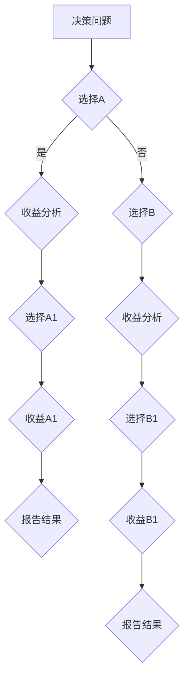

                 


## 领导力修炼手册：从销售总监到管理者的进阶指南

### 关键词：
- 销售总监
- 领导力
- 管理进阶
- 变革领导力
- 路径-目标理论

### 摘要：
本手册旨在为销售总监提供一套实用的领导力提升方案，帮助他们在从销售专家向管理者转变的过程中，更好地领导团队、提升业绩。通过深入探讨变革领导力和路径-目标理论，以及结合实际案例和实践，读者将获得关于领导力核心概念和实际应用的全面理解。

### 目录：

**第一部分：领导力的核心概念**

**第1章：领导力的定义与背景**
1. 领导力的概念探讨
2. 销售总监的角色转变
3. 领导力的重要性

**第2章：领导力的主要方面**
1. 变革领导力模型
2. 路径-目标理论

**第3章：领导力与数学模型**
1. 决策制定模型
2. 风险评估模型

**第二部分：系统分析与架构设计方案**

**第4章：领导力作为系统的分析**
1. 领导力系统的构成
2. 领导力系统运作方式

**第5章：项目实战**
1. 实际案例研究
2. 领导力应用案例分析

**第三部分：最佳实践与拓展**

**第6章：最佳实践 tips**
1. 实用的领导力技巧
2. 领导力提升策略

**第7章：小结**
1. 总结关键点和实践建议
2. 领导力修炼的重要性

**第8章：注意事项**
1. 领导力提升的挑战
2. 应对策略

**第9章：拓展阅读**
1. 推荐相关书籍
2. 资源链接

### 背景介绍

领导力是一种影响力，它能够激励和引导他人共同实现目标。在商业环境中，领导力尤为重要，它不仅影响个人绩效，更能够影响整个团队的效率和业绩。销售总监作为团队的核心领导者，他们的角色不仅仅是完成销售目标，更重要的是如何通过领导力来提升整个团队的士气和效率。

本手册的核心目的是帮助销售总监从销售专家转型为管理者，通过提升领导力，从而更好地领导团队、提升业绩。在这个过程中，我们将探讨变革领导力和路径-目标理论等核心概念，并结合实际案例，为销售总监提供实用的工具和方法。

**核心概念与联系**

变革领导力模型和路径-目标理论是领导力研究中两个非常重要的理论。变革领导力模型主要关注如何引导团队进行变革，它包括变革愿景、领导风格、变革过程等核心要素。而路径-目标理论则关注如何通过设定明确的目标和提供路径支持，来激励团队成员实现目标。

这两个理论并不是孤立存在的，它们之间存在紧密的联系。例如，在实施变革时，销售总监需要设定清晰的目标，并提供实现目标的路径支持，这就是路径-目标理论在变革领导力中的应用。此外，变革领导力模型中的领导风格也会影响目标的设定和路径的选择。

**算法原理讲解**

虽然领导力不是纯粹的数学领域，但我们可以使用一些数学模型来解释决策制定和风险评估。例如，决策制定模型可以使用决策树或效用理论来帮助销售总监做出最优决策。风险评估模型则可以使用概率和统计方法来评估不同风险的概率和影响。

以下是一个简单的决策制定模型的mermaid流程图示例：



在决策制定过程中，销售总监需要根据收益分析来选择最佳方案。这个模型可以帮助销售总监在面临复杂决策时，通过系统化的方法来选择最优方案。

**数学模型和数学公式**

在领导力提升过程中，数学模型和公式可以帮助销售总监更好地理解和管理团队。例如，在风险评估中，可以使用以下公式来计算风险值：

$$
风险值 = 概率 \times 影响程度
$$

这个公式可以帮助销售总监评估不同风险的概率和影响程度，从而制定相应的风险管理策略。

**系统分析与架构设计方案**

领导力可以被看作是一个复杂的系统，它由多个相互关联的要素组成。例如，领导力系统包括领导风格、团队氛围、沟通机制等核心要素。这些要素相互影响，共同决定了领导力的效果。

以下是一个领导力系统的mermaid类图示例：

```mermaid
classDiagram
Class1 <|-- Class2
Class1 {"属性1", "属性2"}
Class2 {"属性3", "属性4"}
```

在这个类图中，Class1代表领导风格，Class2代表团队氛围，它们之间有直接的关联。

**项目实战**

为了更好地理解领导力在实践中的应用，我们来看一个实际案例。

**案例背景**：某销售团队在过去几个月的业绩一直不理想，销售总监需要通过提升领导力来改善这一状况。

**解决方案**：

1. **变革领导力应用**：销售总监首先通过变革领导力模型，明确了团队的目标和愿景，并采用了变革领导力模型中的四种领导风格（指导型、支持型、参与型和成就型），以适应不同团队成员的需求。

2. **路径-目标理论应用**：销售总监根据路径-目标理论，设定了明确的目标，并为团队成员提供了实现目标的路径支持。例如，为销售团队设定了短期和长期的销售目标，并为每个目标提供了具体的实施步骤。

3. **决策制定与风险评估**：销售总监使用决策制定模型和风险评估模型，对市场趋势、客户需求和竞争对手进行了分析，并制定了相应的销售策略和风险管理计划。

**案例结果**：通过上述措施，销售团队的业绩逐步提升，团队士气也得到了显著提高。

**最佳实践 tips**

1. **定期反馈与沟通**：销售总监应定期与团队成员进行沟通，了解他们的需求和反馈，并根据反馈进行调整。

2. **培养团队文化**：建立一个积极、开放和合作的团队文化，鼓励团队成员之间的相互支持和学习。

3. **持续学习和提升**：销售总监应不断学习新的领导力理论和实践方法，以适应不断变化的市场环境。

**小结**

通过本手册，销售总监可以更好地理解领导力的核心概念和应用方法。在实际工作中，他们可以结合具体案例，灵活运用这些方法和技巧，提升领导力，从而实现个人和团队的共同成长。

**注意事项**

1. **领导力提升是一个长期过程**：销售总监应认识到领导力提升需要时间和持续的努力。

2. **个性化领导**：每个团队和个体都有其独特性，销售总监应根据实际情况，灵活运用领导力方法和技巧。

**拓展阅读**

1. **《领导力五项修炼》**：作者：彼得·德鲁克
2. **《变革之舞》**：作者：约翰·科特
3. **《路径-目标理论》**：作者：罗伯特·豪斯

作者：AI天才研究院/AI Genius Institute & 禅与计算机程序设计艺术 /Zen And The Art of Computer Programming

