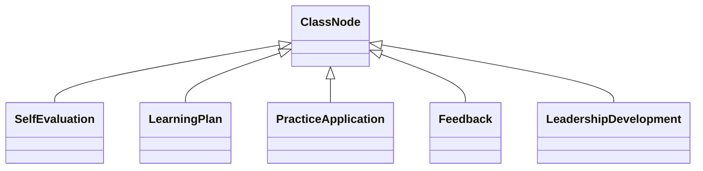
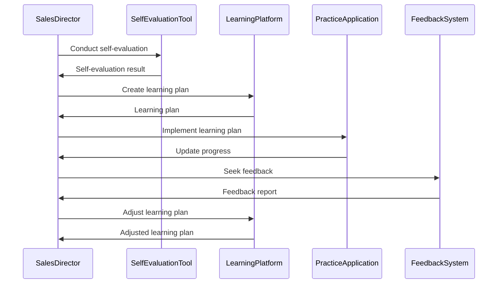
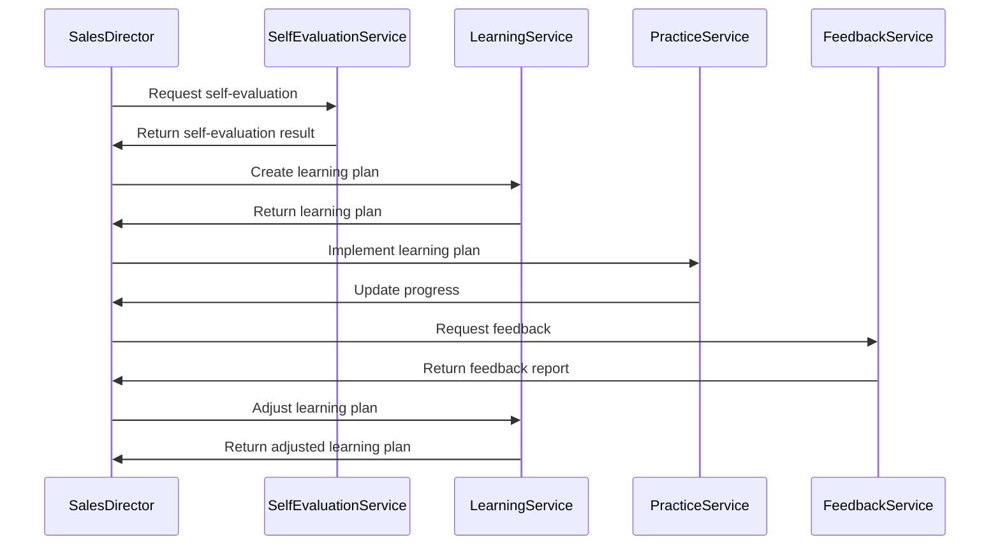
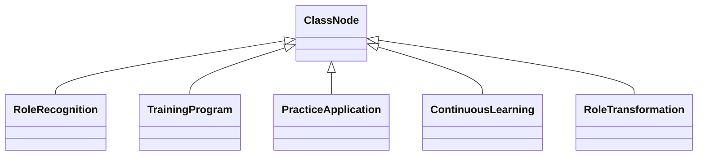
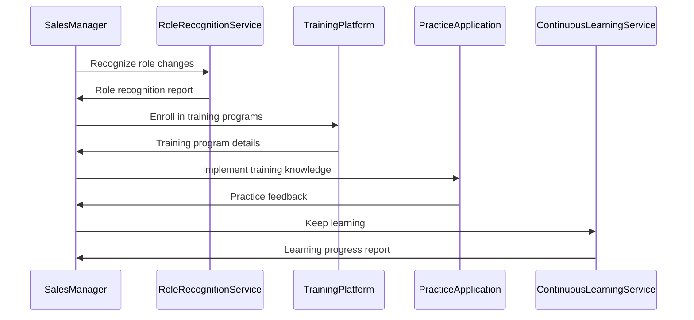
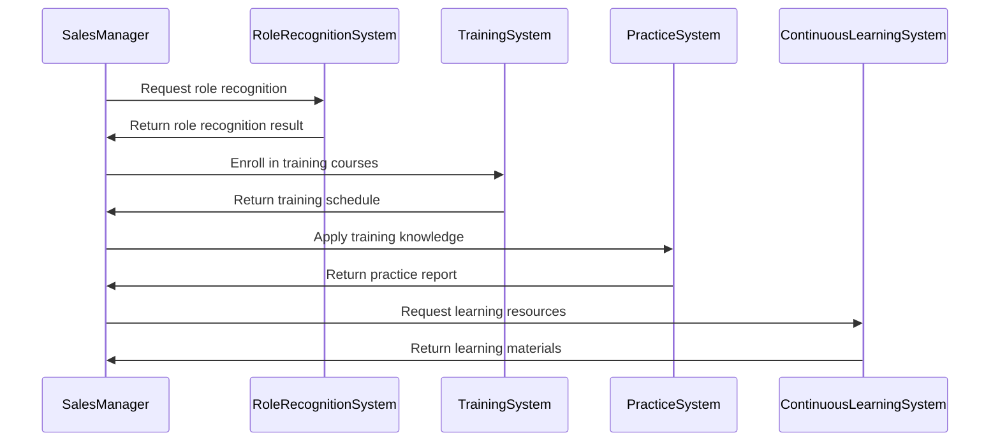
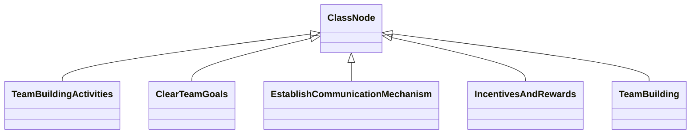
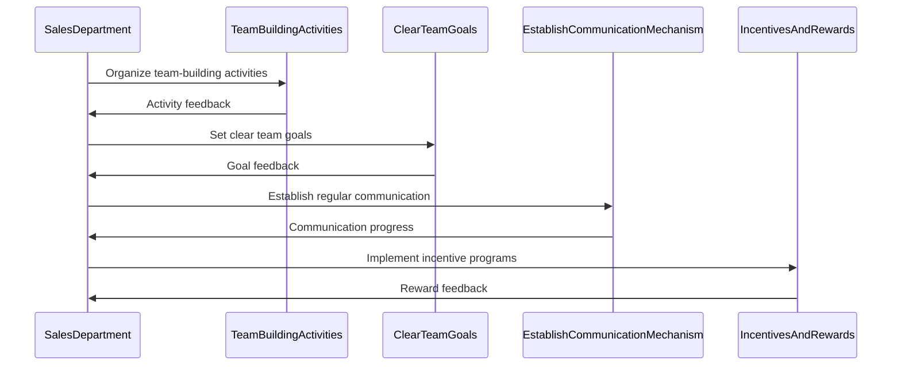
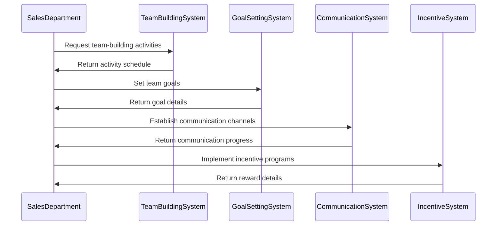

                 

## 文章标题：领导力修炼手册：从销售经理到管理者的进阶指南

> **关键词**：领导力、销售经理、管理者、角色转变、团队建设、领导风格、时间管理、目标设定

> **摘要**：本文旨在探讨从销售经理到管理者的角色转变，详细分析领导力的基础、领导风格、团队建设、角色转变、时间管理与目标设定，以及领导力的提升和实战案例分析。通过逐步深入分析，为销售经理提供一套全面的进阶指南，帮助他们在转型过程中取得成功。

### 目录大纲

## 领导力修炼手册：从销售经理到管理者的进阶指南

### 第一部分：领导力基础

### 第1章：领导力概述

#### 1.1 领导力的重要性

#### 1.2 领导力的构成要素

#### 1.3 领导力与管理的区别

### 第2章：领导风格

#### 2.1 领导风格概述

#### 2.2 不同领导风格的特点

#### 2.3 如何选择适合的领导风格

### 第3章：团队建设

#### 3.1 团队建设的重要性

#### 3.2 建设高效团队的策略

#### 3.3 提升团队凝聚力的方法

## 第二部分：从销售经理到管理者的转变

### 第4章：角色转变

#### 4.1 销售经理与管理者的区别

#### 4.2 如何适应新的角色

#### 4.3 管理者必备的能力

### 第5章：领导团队

#### 5.1 领导团队的策略

#### 5.2 建立有效的沟通机制

#### 5.3 管理团队绩效

### 第6章：时间管理与目标设定

#### 6.1 时间管理的艺术

#### 6.2 目标设定的方法

#### 6.3 实现目标的策略

### 第7章：领导力提升

#### 7.1 持续学习的重要性

#### 7.2 领导力发展路径

#### 7.3 自我评估与提升

## 第三部分：实战案例分析

### 第8章：成功领导力的实践

#### 8.1 案例分析1：领导力提升的典范

#### 8.2 案例分析2：从销售经理到管理者的成功转型

#### 8.3 案例分析3：团队建设的实战经验

## 附录：领导力工具与资源推荐

### 第9章：领导力工具与方法

#### 9.1 领导力工具介绍

#### 9.2 领导力方法推荐

#### 9.3 领导力资源汇总

---

### 引言

作为销售经理，您可能已经熟练掌握了销售技巧和策略，成功带领团队完成了一项又一项的销售任务。然而，当您面对公司的提拔，需要从销售经理的角色转变为管理者时，您可能会感到困惑和挑战。从销售经理到管理者的转变不仅意味着角色的变化，更意味着需要掌握新的技能和思维方式。

领导力，作为管理者不可或缺的素质，是推动团队、实现目标的关键因素。本文将深入探讨领导力的重要性、构成要素、领导风格、团队建设、角色转变、时间管理与目标设定，以及领导力的提升方法。通过这些内容的逐步分析，我们希望为您提供一套全面的领导力修炼手册，帮助您顺利实现从销售经理到管理者的转变，并在新的角色中取得成功。

在接下来的章节中，我们将从领导力基础、角色转变、团队建设、时间管理与目标设定、领导力提升以及实战案例分析等多个角度，为您详细解析领导力的奥秘，提供实用的策略和方法。让我们一起踏上领导力的修炼之旅，开启从销售经理到管理者的进阶之旅。

### 第一部分：领导力基础

### 第1章：领导力概述

#### 1.1 领导力的重要性

领导力是一种驱动和激励他人实现共同目标的能力，对于任何组织和个人都至关重要。对于销售经理而言，领导力更是成功转型为管理者的重要基石。为什么领导力如此重要呢？

首先，领导力能够激发团队的潜力。通过有效的领导，销售经理可以激发团队成员的积极性，挖掘他们的潜力，使团队达到最佳状态，从而实现更高的销售目标。

其次，领导力有助于建立良好的团队氛围。一个成功的团队离不开良好的团队氛围，而领导力正是营造这种氛围的关键。通过积极沟通、鼓励创新和尊重个人差异，销售经理可以建立起一个充满活力、积极向上的团队。

最后，领导力能够提升个人的职业发展。具备强大领导力的销售经理更容易获得公司的认可和提拔，从而实现职业晋升和更高的薪资待遇。

#### 1.2 领导力的构成要素

领导力并非一蹴而就，而是由多个要素组成的复杂体系。以下是一些关键的领导力构成要素：

1. **沟通能力**：沟通是领导力的核心，一个优秀的领导者必须具备良好的沟通能力。这不仅包括口头和书面沟通，还包括非语言沟通，如肢体语言和面部表情。

2. **影响力**：领导者需要具备影响力，能够影响他人的思维和行为，从而实现团队目标。影响力源于领导者的个人魅力、专业知识以及对团队的关心和信任。

3. **决策能力**：领导者必须能够快速做出决策，并在面对不确定性和压力时保持冷静。优秀的决策能力有助于团队在面对挑战时迅速应对，减少损失。

4. **情感智慧**：情感智慧是领导者理解自己和他人的情感状态，并有效地运用这些信息来指导思想和行为的能力。一个具备高情感智慧的领导者能够更好地处理团队关系，提升团队凝聚力。

5. **自我管理**：领导者需要具备良好的自我管理能力，包括时间管理、情绪管理和压力管理。自我管理能力使领导者能够保持高效工作，并在面对困难时保持积极心态。

#### 1.3 领导力与管理的区别

领导力和管理虽然密切相关，但两者之间仍有一定的区别。以下是从几个方面对领导力和管理进行对比：

1. **目标**：管理更多关注于任务和目标的实现，而领导力则更注重团队的成长和长期发展。

2. **方法**：管理强调流程、规则和制度，而领导力则强调个人魅力、情感智慧和影响力。

3. **关系**：管理侧重于上下级关系，而领导力则更关注团队合作和共同成长。

4. **效果**：管理的结果往往是可见的，如任务的完成情况和绩效指标，而领导力的效果则更难以量化，但它在团队氛围、员工满意度和公司文化等方面具有长远影响。

通过了解领导力的重要性、构成要素以及领导力与管理的区别，我们可以更好地理解领导力的本质，从而为接下来的角色转变和领导力提升打下坚实的基础。

#### 1.4 领导力的核心概念

在探讨领导力的核心概念之前，我们需要明确一些关键术语，以便更好地理解领导力的本质和如何在实际工作中应用。

**1.4.1 领导力**

领导力是指通过影响他人来实现共同目标的能力。它不仅包括管理他人，还涉及激励、指导、沟通和影响力。领导力是一种综合能力，包括情感智慧、沟通技巧、决策能力和影响力等多个方面。

**1.4.2 指导与激励**

指导是领导者通过传授知识和经验，帮助团队成员提升能力和绩效的过程。激励则是通过激发员工的内在动机，使他们在面对挑战时保持积极态度并全力以赴。有效的指导与激励可以提升团队的整体绩效和士气。

**1.4.3 沟通技巧**

沟通技巧是领导者与团队成员、上级和客户之间交流的关键。良好的沟通技巧包括倾听、表达、反馈和冲突解决。有效的沟通可以增强团队凝聚力，提升团队工作效率。

**1.4.4 影响力**

影响力是领导者通过个人魅力、专业知识、信任和情感智慧来影响他人思维和行为的能力。一个具备强大影响力的领导者能够更好地推动团队目标的实现。

**1.4.5 情感智慧**

情感智慧是领导者理解自己和他人的情感状态，并有效地运用这些信息来指导思想和行为的能力。具备高情感智慧的领导者能够更好地处理团队关系，提升团队凝聚力。

**1.4.6 自我管理**

自我管理是指领导者如何有效地管理自己的时间、情绪和压力。良好的自我管理能力使领导者能够保持高效工作，并在面对困难时保持积极心态。

**1.4.7 团队建设**

团队建设是领导力的重要组成部分，旨在通过提升团队凝聚力、沟通能力和协作精神，实现团队的目标。有效的团队建设策略包括团队活动、团队目标和团队沟通等。

**1.4.8 领导风格**

领导风格是指领导者在工作中的行为方式和处理问题的方式。常见的领导风格包括权威型、民主型、参与型和教练型等。选择合适的领导风格有助于提升团队绩效和员工满意度。

通过理解这些核心概念，我们可以更好地掌握领导力的本质，并在实际工作中灵活应用，从而提升自己的领导力水平。

### 第2章：领导风格

#### 2.1 领导风格概述

领导风格是领导者在工作中的行为方式、处理问题的方式和对待团队的态度。不同的领导风格对团队绩效和员工满意度有着重要的影响。因此，了解并选择适合的领导风格对于销售经理成功转型为管理者至关重要。

领导风格可以分为以下几种类型：

1. **权威型领导风格**：权威型领导者通常拥有高度集中的决策权和控制权。他们注重效率，要求团队成员严格遵循规章制度。权威型领导风格适用于任务紧急、需要迅速行动的情况，但在长期来看可能会抑制团队成员的创造力和自主性。

2. **民主型领导风格**：民主型领导者鼓励团队成员参与决策，尊重员工的意见和反馈。这种领导风格能够增强团队的凝聚力和归属感，提高员工的工作满意度和忠诚度。然而，民主型领导风格可能需要更多的时间和精力来协调团队意见，并可能导致决策速度较慢。

3. **参与型领导风格**：参与型领导者重视与团队成员的互动和沟通，鼓励他们参与决策和项目规划。这种领导风格有助于提升团队成员的参与感和责任感，促进团队创新和协作。然而，参与型领导风格也需要领导者具备良好的沟通技巧和协调能力。

4. **教练型领导风格**：教练型领导者关注团队成员的成长和发展，提供指导和支持，帮助他们实现个人目标和职业发展。这种领导风格能够激发团队成员的潜能，提高他们的工作能力和绩效。然而，教练型领导风格可能需要较多的时间和精力，对领导者的情感智慧和指导能力有较高要求。

#### 2.2 不同领导风格的特点

每种领导风格都有其独特的特点，适用于不同的情境和团队。以下是对不同领导风格特点的详细分析：

**权威型领导风格**

- **优点**：权威型领导风格能够迅速做出决策，确保任务的顺利完成；提高团队的工作效率和执行力。
- **缺点**：可能会抑制团队成员的创造力和自主性，导致员工依赖领导者；缺乏团队成员的参与和反馈，可能影响团队的凝聚力和归属感。

**民主型领导风格**

- **优点**：民主型领导风格能够鼓励团队成员的参与和反馈，提高员工的工作满意度和忠诚度；增强团队的凝聚力和协作精神。
- **缺点**：可能需要更多的时间和精力来协调团队意见，决策速度较慢；在某些紧急情况下，可能无法迅速做出决策。

**参与型领导风格**

- **优点**：参与型领导风格能够激发团队成员的参与感和责任感，促进团队创新和协作；提高团队成员的工作能力和绩效。
- **缺点**：需要领导者具备良好的沟通技巧和协调能力，否则可能导致团队成员之间的意见分歧和冲突。

**教练型领导风格**

- **优点**：教练型领导风格能够关注团队成员的成长和发展，提高他们的工作能力和职业素养；激发团队成员的潜能，实现个人和团队目标。
- **缺点**：需要领导者投入较多的时间和精力，对领导者的情感智慧和指导能力有较高要求；在短期内可能对团队的绩效和效率产生一定影响。

#### 2.3 如何选择适合的领导风格

选择适合的领导风格对于销售经理成功转型为管理者至关重要。以下是一些建议，帮助您选择并应用适合的领导风格：

1. **了解团队特点和需求**：根据团队的特点和需求，选择最适合的领导风格。例如，对于初建团队，可能需要更多的指导和协调；对于成熟团队，可能需要更多的参与和沟通。

2. **观察和学习**：观察和学习其他优秀领导者的风格，了解不同领导风格的应用场景和效果。通过实践和总结，逐步形成自己的领导风格。

3. **灵活调整**：根据不同情境和团队需求，灵活调整领导风格。在面临紧急情况时，可以采用权威型领导风格；在团队需要创新和协作时，可以采用参与型或教练型领导风格。

4. **持续反思和改进**：定期反思自己的领导风格，了解团队成员的反馈和建议。根据实际情况，不断改进和调整领导风格，提升自己的领导力水平。

通过了解不同领导风格的特点和应用场景，销售经理可以更好地选择适合的领导风格，并在转型过程中取得成功。

### 第3章：团队建设

#### 3.1 团队建设的重要性

团队建设是领导力的核心组成部分，对于销售经理成功转型为管理者至关重要。一个高效的团队能够提升整体绩效，增强团队凝聚力，激发成员的潜能，从而实现组织目标。以下是团队建设的重要性：

1. **提升整体绩效**：团队建设有助于明确团队目标，提高团队成员的协作效率，使团队能够在实现共同目标的过程中取得更好的绩效。

2. **增强团队凝聚力**：通过团队建设活动，团队成员之间建立信任和合作关系，形成共同愿景和价值观，从而增强团队的凝聚力。

3. **激发成员潜能**：团队建设能够激发成员的创造力和自主性，使他们在面对挑战时保持积极态度，充分发挥个人潜能。

4. **提高员工满意度**：团队建设有助于提升员工的工作满意度和归属感，降低员工流失率，从而提高组织的稳定性和发展潜力。

5. **提升组织竞争力**：一个高效的团队能够更好地应对市场变化和竞争压力，提升组织的整体竞争力。

#### 3.2 建设高效团队的策略

要建设一个高效团队，销售经理需要采取一系列策略，确保团队成员能够充分发挥各自的优势，共同实现团队目标。以下是几个关键策略：

1. **明确团队目标**：明确团队的目标和愿景，使团队成员了解团队的方向和期望。通过制定具体的目标和行动计划，确保团队成员明确自己的职责和任务。

2. **加强团队沟通**：沟通是团队建设的基础，销售经理需要建立良好的沟通机制，鼓励团队成员之间的开放沟通，确保信息的及时传递和反馈。

3. **培养团队协作精神**：通过团队活动和培训，培养团队成员的协作精神，提升团队的整体执行力。例如，可以组织团队建设活动，促进团队成员之间的相互了解和信任。

4. **激发成员潜力**：关注团队成员的个人发展和需求，为他们提供成长和发展的机会，激发他们的潜能。通过设定挑战性目标和提供支持，帮助团队成员实现个人和团队目标。

5. **建立有效的反馈机制**：建立有效的反馈机制，鼓励团队成员之间相互反馈和评估，帮助团队成员识别自己的优势和不足，并不断改进和提升。

6. **激励团队成员**：通过激励措施，如奖励、表彰和晋升等，激励团队成员的积极性和创造力，提高他们的工作热情和责任感。

#### 3.3 提升团队凝聚力的方法

团队凝聚力是团队建设的关键指标，对于团队的稳定性和绩效具有重要影响。以下是一些提升团队凝聚力的方法：

1. **增强团队成员之间的信任**：信任是团队凝聚力的基础，销售经理需要通过透明沟通、公正决策和诚信行为，建立团队成员之间的信任。

2. **组织团队建设活动**：定期组织团队建设活动，如团建旅游、团建游戏和团队培训等，增强团队成员之间的互动和了解，提升团队凝聚力。

3. **建立共同目标和价值观**：通过共同的目标和价值观，使团队成员朝着同一个方向努力，形成共同的愿景和使命感，增强团队的凝聚力。

4. **关注团队成员的需求**：关注团队成员的个人需求和成长，为他们提供支持和帮助，使他们感受到团队的关心和关爱，提升团队的凝聚力。

5. **鼓励团队成员之间的交流和合作**：通过鼓励团队成员之间的交流和合作，建立良好的人际关系，增强团队的凝聚力和协作精神。

6. **及时解决团队问题**：及时发现和解决团队中的问题，避免矛盾和冲突的积累，维护团队的稳定和和谐。

通过以上策略和方法，销售经理可以有效地提升团队的凝聚力和绩效，为组织的长期发展奠定坚实基础。

### 第二部分：从销售经理到管理者的转变

#### 第4章：角色转变

从销售经理到管理者的角色转变是一个重要的职业发展阶段，不仅意味着职责和权力的变化，更意味着思维方式和管理方法的转变。在这个转变过程中，销售经理需要面对新的挑战，同时也拥有更大的发展空间。以下是关于角色转变的一些关键要点。

#### 4.1 销售经理与管理者的区别

**1. 职责变化**

销售经理的主要职责是制定销售策略、领导销售团队、完成销售目标。他们需要关注销售数据的分析和市场趋势的研究，通过销售技巧和团队协作来推动销售额的增长。

而管理者则更多地关注团队的整体绩效和员工发展。他们需要制定并实施公司的战略计划，协调各个部门之间的工作，确保公司的目标得以实现。管理者还需要关注团队的建设，提升团队的整体能力和凝聚力。

**2. 关注点变化**

销售经理主要关注销售业绩和市场占有率。他们的目标是实现销售目标，提高客户满意度，并不断优化销售流程。

管理者则更加注重公司的长期发展，关注公司战略的制定和执行。他们需要关注市场变化、竞争态势、资源配置等问题，确保公司的可持续发展。

**3. 决策范围变化**

销售经理的决策范围相对较窄，主要涉及销售策略、销售目标和销售团队的管理。

管理者则需要做出更为广泛的决策，包括公司战略、人力资源规划、财务预算、产品研发等方面。管理者的决策需要考虑整个公司的利益，而不仅仅是某个部门或团队的利益。

#### 4.2 如何适应新的角色

**1. 转变思维方式**

从销售经理到管理者，首先需要转变思维方式。销售经理往往注重短期目标和直接结果，而管理者则需要更多地考虑长期发展和整体战略。销售经理需要学会从更宏观的角度看待问题，关注公司的整体利益。

**2. 提升管理能力**

管理者的职责更加广泛，需要具备更全面的管理能力。销售经理可以通过参加管理培训、阅读管理类书籍、参与行业交流等方式，不断提升自己的管理能力。

**3. 建立有效沟通**

管理者需要与各个部门、团队和员工保持良好的沟通。有效的沟通能够确保信息的及时传递，促进团队合作，提高工作效率。

**4. 培养团队领导力**

作为管理者，需要具备领导力，能够带领团队实现目标。销售经理可以通过设定清晰的团队目标、提供必要的资源和支持、激励团队成员等方式，提升团队的领导力。

**5. 关注员工发展**

管理者需要关注员工的发展，为他们提供成长和发展的机会。通过培养和激励员工，提升他们的工作能力和绩效，从而提高整个团队的战斗力。

#### 4.3 管理者必备的能力

**1. 沟通能力**

管理者需要具备良好的沟通能力，能够有效地与团队成员、上级和下属进行沟通。良好的沟通能力有助于确保信息的准确传递，促进团队合作，解决冲突。

**2. 决策能力**

管理者需要具备较强的决策能力，能够在面对复杂问题和不确定情况时做出正确的决策。有效的决策能力有助于确保团队目标的实现和公司的稳定发展。

**3. 领导力**

管理者需要具备领导力，能够激励和带领团队实现目标。领导力包括情感智慧、影响力、指导能力和团队合作精神等多个方面。

**4. 时间管理能力**

管理者需要具备良好的时间管理能力，能够合理分配时间，确保任务的优先级和进度。有效的时间管理有助于提高工作效率，确保目标的实现。

**5. 情感智慧**

管理者需要具备高情感智慧，能够理解自己和他人的情感状态，有效地处理团队关系。高情感智慧有助于建立良好的团队氛围，提升团队凝聚力和工作效率。

通过了解销售经理与管理者的区别、适应新的角色，以及提升管理者必备的能力，销售经理可以更好地实现角色转变，从而在新的职位上取得更大的成功。

### 第5章：领导团队

#### 5.1 领导团队的策略

领导团队是管理者的重要职责之一，有效的领导策略能够提升团队绩效和成员满意度。以下是一些关键的领导团队策略：

**1. 设定清晰的目标**

设定清晰的目标是团队领导的基础。管理者需要与团队成员共同制定具体、可衡量的目标，确保每个成员都了解自己的职责和期望。通过明确的目标，团队成员可以更好地分配资源和精力，确保团队目标的实现。

**2. 提供必要的资源**

为了确保团队目标的实现，管理者需要提供必要的资源和支持。这包括资金、技术、人力和培训等。通过为团队成员提供充足的资源，管理者可以减轻他们的工作压力，提高工作效率。

**3. 激励团队成员**

激励是提升团队绩效的关键。管理者可以通过多种方式激励团队成员，如设定奖励机制、提供职业发展机会、鼓励创新和表扬优秀表现等。有效的激励措施可以激发团队成员的积极性和创造力，提高团队的整体绩效。

**4. 建立有效的沟通机制**

有效的沟通是团队领导的核心。管理者需要建立开放、坦诚的沟通机制，鼓励团队成员之间的互动和反馈。通过定期的会议、工作汇报和一对一沟通，管理者可以及时了解团队的工作进展和成员的需求，确保团队的顺畅运作。

**5. 培养团队合作精神**

团队合作精神是团队成功的关键。管理者需要通过团队建设活动、共同目标设定和任务分配等方式，培养团队成员之间的信任和协作精神。通过建立良好的团队合作氛围，管理者可以提升团队的整体凝聚力和战斗力。

**6. 持续关注成员发展**

管理者需要关注团队成员的发展，为他们提供成长和发展的机会。通过培训、辅导和指导，管理者可以帮助团队成员提升技能和知识，实现个人和职业目标。持续关注成员发展不仅有助于提升团队绩效，还可以增强团队的稳定性和忠诚度。

#### 5.2 建立有效的沟通机制

建立有效的沟通机制是领导团队的重要一环。以下是一些关键步骤和建议：

**1. 确定沟通目标**

在建立沟通机制之前，管理者需要明确沟通的目标。沟通目标可以是确保信息的准确传递、提升团队成员之间的协作、解决团队问题等。明确沟通目标有助于确保沟通活动的有效性和针对性。

**2. 选择合适的沟通方式**

根据团队的特点和需求，选择合适的沟通方式。常见的沟通方式包括会议、邮件、即时通讯工具、面对面沟通等。选择合适的沟通方式可以提高沟通的效率和效果。

**3. 设定沟通频率**

管理者需要根据团队的实际情况，设定合适的沟通频率。例如，每周一次的团队会议、每月一次的工作汇报等。合适的沟通频率可以确保团队成员之间的信息畅通，避免信息滞后和误解。

**4. 建立反馈机制**

建立反馈机制是确保沟通效果的重要环节。管理者可以鼓励团队成员提出问题和建议，及时反馈沟通中的不足和改进措施。通过建立反馈机制，管理者可以不断优化沟通方式和方法，提高沟通效果。

**5. 提高沟通技巧**

管理者需要具备良好的沟通技巧，包括倾听、表达、反馈和冲突解决。通过提高沟通技巧，管理者可以确保信息的准确传递和理解，减少误解和冲突。

**6. 鼓励开放沟通**

管理者需要鼓励团队成员之间的开放沟通，创造一个积极、坦诚的沟通氛围。通过开放沟通，团队成员可以更好地分享想法和经验，促进团队协作和创新。

#### 5.3 管理团队绩效

管理团队绩效是管理者的重要职责之一。以下是一些关键步骤和建议：

**1. 设定绩效目标**

管理者需要与团队成员共同制定具体的绩效目标，确保每个成员都了解自己的工作目标和期望。通过设定绩效目标，管理者可以确保团队成员的工作方向一致，提高团队的整体绩效。

**2. 定期进行绩效评估**

管理者需要定期对团队成员的绩效进行评估，确保他们的工作符合绩效目标。绩效评估可以是定期的面谈、工作总结会议或书面评估报告。通过绩效评估，管理者可以及时发现和解决团队成员的问题，提供必要的支持和指导。

**3. 提供反馈和指导**

在绩效评估过程中，管理者需要提供具体的反馈和指导，帮助团队成员提升工作能力和绩效。通过有效的反馈和指导，管理者可以促进团队成员的成长和发展。

**4. 设定改进计划**

如果团队成员的绩效不符合预期，管理者需要与团队成员共同制定改进计划。改进计划可以包括培训、辅导、调整工作职责等。通过设定改进计划，管理者可以帮助团队成员克服困难，提升绩效。

**5. 激励和奖励**

为了激励团队成员，管理者可以设定奖励机制，对表现优秀的成员给予奖励。奖励可以是奖金、晋升、表彰等。通过激励和奖励，管理者可以激发团队成员的积极性和创造力，提高团队的整体绩效。

**6. 建立持续改进机制**

管理者需要建立持续改进机制，确保团队绩效的不断提升。通过定期回顾和反思，管理者可以不断优化团队的工作流程和方法，提高团队的整体绩效。

通过以上策略和方法，管理者可以有效地管理团队绩效，提升团队的整体能力和战斗力。

### 第6章：时间管理与目标设定

#### 6.1 时间管理的艺术

时间管理是管理者的重要技能之一，它不仅关系到个人工作效率，还直接影响到团队的绩效和目标的实现。有效的时间管理能够帮助管理者合理分配时间，提高工作效率，减少时间浪费，从而更好地完成工作任务。

**1. 优先级排序**

时间管理的核心在于确定任务的优先级。管理者需要根据任务的紧急程度和重要性，将其分为“重要且紧急”、“重要但不紧急”、“紧急但不重要”、“不重要且不紧急”四类。通过这种方法，管理者可以优先处理重要且紧急的任务，同时留出时间处理重要但不紧急的任务，避免陷入忙乱的状态。

**2. 制定日程计划**

为了更好地管理时间，管理者需要制定日程计划。日程计划可以包括每天、每周和每月的任务安排，明确每个时间段要完成的任务。通过制定日程计划，管理者可以更好地规划时间，避免任务积压和拖延。

**3. 优化工作流程**

管理者需要不断优化工作流程，减少不必要的步骤和浪费时间的行为。例如，通过自动化工具和流程优化，可以减少重复性工作的时间消耗，提高工作效率。

**4. 学会说“不”**

管理者需要学会说“不”，拒绝那些不重要或紧急的任务，专注于最重要的工作。通过拒绝不必要的事务，管理者可以确保自己的时间被更有效地利用。

**5. 定期回顾和调整**

时间管理是一个持续的过程，管理者需要定期回顾自己的时间使用情况，分析哪些方法有效，哪些需要改进。通过定期调整时间管理策略，管理者可以不断提高自己的时间管理能力。

#### 6.2 目标设定的方法

目标设定是管理者实现团队目标和个人职业发展的重要手段。有效的目标设定可以帮助管理者明确工作方向，激发团队成员的积极性，提高团队的绩效。

**1. SMART原则**

SMART原则是一种常用的目标设定方法，即目标要具备以下特点：具体（Specific）、可衡量（Measurable）、可实现（Achievable）、相关（Relevant）和时限（Time-bound）。通过SMART原则，管理者可以确保目标明确、具体、可量化，从而提高目标实现的概率。

**2. 目标分解**

将大目标分解为小目标，可以帮助管理者更清晰地了解任务的进度和完成情况。例如，将一个年度目标分解为季度目标、月度目标和周目标，每个目标都具体、可衡量，管理者可以更容易地跟踪和调整。

**3. 设置挑战性目标**

挑战性目标可以激发团队成员的潜能和积极性，提高团队的整体绩效。管理者需要确保目标具有挑战性，同时是可实现的。通过设置挑战性目标，管理者可以推动团队不断进步和成长。

**4. 定期评估和调整**

目标设定是一个动态的过程，管理者需要定期评估目标的实现情况，并根据实际情况进行调整。通过定期评估和调整，管理者可以确保目标的持续性和有效性，从而更好地实现团队目标。

**5. 激励和反馈**

为了确保目标的实现，管理者需要激励和反馈团队成员。通过设定奖励机制，对实现目标的团队成员给予奖励，管理者可以激发团队成员的积极性。同时，通过及时反馈，管理者可以帮助团队成员识别问题，找到改进的方法，从而提高目标的实现率。

#### 6.3 实现目标的策略

实现目标是管理者的核心任务之一。以下是一些关键的策略，帮助管理者实现团队和个人目标：

**1. 制定详细的行动计划**

为了实现目标，管理者需要制定详细的行动计划。行动计划应包括具体的目标、实施步骤、责任人和时间节点。通过详细的行动计划，管理者可以确保每个任务都有明确的执行方向和时间表，从而提高目标的实现概率。

**2. 资源合理配置**

管理者需要确保实现目标所需的资源得到合理配置。这包括人力资源、财务资源和技术资源等。通过合理配置资源，管理者可以确保目标的顺利实施。

**3. 持续跟踪和监控**

管理者需要持续跟踪和监控目标的实现情况。通过定期的检查和报告，管理者可以及时发现和解决问题，确保目标的顺利实现。

**4. 激励团队成员**

为了实现目标，管理者需要激励团队成员。通过设定奖励机制、提供职业发展机会、鼓励创新等方式，管理者可以激发团队成员的积极性和创造力，提高团队的凝聚力。

**5. 学习和改进**

实现目标是一个不断学习和改进的过程。管理者需要从成功和失败中吸取经验教训，不断优化自己的方法和策略，从而提高实现目标的效率和质量。

通过以上策略和方法，管理者可以有效地实现团队和个人目标，推动组织的持续发展和成长。

### 第7章：领导力提升

#### 7.1 持续学习的重要性

领导力是一种不断发展的能力，需要通过持续学习来不断提升。对于从销售经理到管理者的转型者而言，持续学习尤为重要。以下是关于持续学习的重要性以及如何进行有效学习的一些建议。

**1. 持续学习的重要性**

**适应变化**：在快速变化的市场环境中，持续学习能够帮助管理者适应新的挑战和需求，确保团队和组织能够保持竞争力。

**提升能力**：通过持续学习，管理者可以不断提升自己的管理技能、沟通技巧和决策能力，从而更好地应对复杂的业务环境。

**激发创新**：持续学习可以激发管理者的创新思维，推动团队在产品、服务和管理方法上的不断创新。

**职业发展**：持续学习是职业发展的基础，通过不断积累知识和经验，管理者可以提升自己的职业素养，获得更多的职业机会。

**2. 如何进行有效学习**

**制定学习计划**：管理者需要根据个人职业目标和团队需求，制定具体的、可执行的学习计划。学习计划应包括学习内容、学习时间和学习目标。

**多渠道学习**：管理者可以通过多种渠道进行学习，如参加培训课程、阅读专业书籍、参加行业会议、在线学习等。多样化的学习方式可以提供更全面的知识和经验。

**实践应用**：学习不仅仅是理论知识的积累，更需要在实际工作中进行应用。通过将所学知识应用到实际工作中，管理者可以更好地理解和掌握这些知识。

**反思与总结**：学习是一个持续的过程，管理者需要定期反思和总结自己的学习成果，识别不足和改进的方向。

**分享与交流**：通过分享自己的学习经验和成果，管理者可以与他人交流、讨论，从而获得更多的反馈和建议，提高自己的学习效果。

#### 7.2 领导力发展路径

领导力发展是一个长期的过程，需要管理者不断积累经验、提升技能和调整策略。以下是一些关键的领导力发展路径：

**1. 基础技能培养**

**沟通技巧**：管理者需要具备良好的沟通技巧，包括口头和书面沟通、倾听和反馈等。

**决策能力**：管理者需要通过学习和实践，提升自己的决策能力，能够在复杂和不确定的情况下做出正确的决策。

**团队建设**：管理者需要学会如何建设高效的团队，包括设定目标、分配任务、激励团队成员和解决团队冲突等。

**2. 管理能力提升**

**项目管理**：管理者需要掌握项目管理的知识和技能，包括项目计划、资源管理、风险控制和项目评估等。

**人力资源管理**：管理者需要了解人力资源管理的原则和方法，包括招聘、培训、绩效管理和员工关系管理等。

**领导风格**：管理者需要根据不同的情境和团队需求，选择和调整适合自己的领导风格，如权威型、民主型、参与型和教练型等。

**3. 高级领导力培养**

**战略思维**：高级领导者需要具备战略思维，能够从宏观角度思考组织的发展方向和目标，制定和实施公司的战略规划。

**影响力**：高级领导者需要具备强大的影响力，能够影响和激励团队成员、上级和合作伙伴，推动组织目标的实现。

**全球视野**：随着全球化的进程，高级领导者需要具备全球视野，了解不同文化和市场的特点，能够在国际环境中有效领导。

**4. 持续发展**

领导力提升是一个持续的过程，管理者需要不断学习和实践，不断提升自己的能力和素养。通过参加培训课程、阅读专业书籍、参与行业交流和实践应用，管理者可以不断积累经验和知识，实现领导力的持续发展。

#### 7.3 自我评估与提升

自我评估是领导力提升的重要环节，通过自我评估，管理者可以了解自己的优势和不足，制定针对性的提升计划。以下是一些自我评估的方法和建议：

**1. 自我反思**

管理者需要定期进行自我反思，思考自己的工作表现、决策和行为。通过自我反思，管理者可以识别自己的不足和需要改进的地方。

**2. 同事和下属反馈**

管理者可以寻求同事和下属的反馈，了解他们在工作中对自己的看法和评价。这些反馈可以帮助管理者从不同的角度了解自己的工作表现，发现自己的盲点和不足。

**3. 360度评估**

360度评估是一种全面的评估方法，通过评估者的反馈，管理者可以了解自己在各个方面的表现。这种方法可以提供更客观、全面的评估结果。

**4. 设定提升目标**

根据自我评估的结果，管理者可以设定具体的提升目标，包括技能提升、知识拓展和素质培养等方面。通过设定明确的目标，管理者可以更有针对性地进行自我提升。

**5. 持续学习和实践**

为了实现提升目标，管理者需要持续学习和实践。通过参加培训课程、阅读专业书籍、参与行业交流和实践应用，管理者可以不断提升自己的能力和素养。

**6. 反馈与调整**

在自我提升的过程中，管理者需要不断进行反馈和调整。通过定期评估自己的提升进度和效果，管理者可以及时调整提升策略，确保自我提升的持续性和有效性。

通过自我评估与提升，管理者可以更好地了解自己，找到提升的方向，从而实现领导力的持续提升。

### 第三部分：实战案例分析

#### 第8章：成功领导力的实践

在实际工作中，领导力不仅是理论，更需要通过实践来检验其效果。本章节将通过三个具体的案例分析，探讨成功领导力的实践方法和经验，为销售经理提供实用的指导。

#### 8.1 案例分析1：领导力提升的典范

**背景介绍**：

某大型科技公司的一位销售经理，由于销售业绩出色，被提拔为销售总监。然而，新岗位的职责和挑战远超预期，他意识到单靠以往的销售技巧已经不足以应对新的挑战。因此，他决定通过系统学习和实践提升自己的领导力。

**问题解决**：

1. **自我评估**：首先，这位销售总监进行了自我评估，识别出自己的不足，包括沟通能力、团队建设和战略规划等方面。

2. **持续学习**：他制定了学习计划，通过参加领导力培训、阅读专业书籍和参加行业交流会，不断拓展自己的知识和技能。

3. **实践应用**：将所学知识应用到实际工作中，如通过定期团队会议和员工反馈会，提升团队沟通和协作效率。

4. **反馈与调整**：定期评估自己的领导力提升情况，根据反馈进行相应调整，确保领导力水平的持续提升。

**边界与外延**：

- **边界**：本案例主要关注销售总监个人的领导力提升。
- **外延**：该案例可以应用于任何需要提升领导力的管理者。

**概念结构与核心要素组成**：

- **概念结构**：领导力提升、自我评估、持续学习、实践应用、反馈与调整。
- **核心要素组成**：自我反思、学习计划、实践应用、反馈与调整。

**算法原理讲解**：

领导力提升算法可以抽象为以下步骤：

1. **自我评估**：使用评估工具，如360度评估，对个人领导力进行评估。
2. **学习计划**：根据评估结果，制定具体的提升计划。
3. **实践应用**：将所学知识应用到实际工作中。
4. **反馈与调整**：定期评估提升效果，根据反馈进行相应调整。

```python
def leadership_development(self_evaluation, learning_plan, practice_application, feedback):
    # 自我评估
    self_evaluation_result = self_evaluation()
    # 制定学习计划
    learning_plan = self_evaluation_result
    # 实践应用
    practice_application()
    # 反馈与调整
    feedback = feedback()
    adjusted_plan = adjust_plan(learning_plan, feedback)
    return adjusted_plan
```

**系统分析与架构设计方案**：

**问题场景介绍**：销售总监需要提升领导力，应对新的挑战。

**项目介绍**：领导力提升项目。

**系统功能设计（领域模型）**：



**系统架构设计（架构图）**：



**系统接口设计和系统交互（序列图）**：



**项目实战**：

1. **环境安装**：安装必要的软件和工具，如领导力评估工具、学习平台和反馈系统。
2. **系统核心实现**：开发自我评估、学习计划、实践应用和反馈系统，确保系统功能的完整性和稳定性。
3. **代码应用解读与分析**：通过代码解读，确保系统实现符合设计要求，并进行性能优化。
4. **实际案例分析和详细讲解剖析**：结合实际案例，详细讲解领导力提升系统的应用效果和优化策略。
5. **项目小结**：总结项目经验，提出改进建议，确保领导力提升系统的长期稳定运行。

**最佳实践 tips**：

1. **定期自我评估**：确保领导力提升的持续性和有效性。
2. **灵活调整学习计划**：根据实际情况和反馈，及时调整学习计划。
3. **实践与理论相结合**：通过实践检验所学知识，确保理论与实践相结合。

#### 8.2 案例分析2：从销售经理到管理者的成功转型

**背景介绍**：

某创业公司的一位销售经理，在公司快速发展阶段，由于表现出色，被提拔为销售部门的总监。然而，从销售经理到管理者的角色转变给他带来了巨大的挑战。

**问题解决**：

1. **角色转变**：他意识到管理者的职责不仅是销售，还需要关注团队建设、资源管理和战略规划。
2. **系统培训**：他参加了管理培训课程，学习领导力、团队建设和项目管理等知识。
3. **实践应用**：将所学知识应用到实际工作中，如通过定期的团队会议和绩效评估，提升团队绩效。
4. **持续学习**：他保持持续学习的态度，通过阅读专业书籍、参加行业交流会，不断提升自己的管理能力。

**边界与外延**：

- **边界**：本案例主要关注销售经理到管理者的角色转变。
- **外延**：该案例可以应用于任何需要角色转变的职场人士。

**概念结构与核心要素组成**：

- **概念结构**：角色转变、系统培训、实践应用、持续学习。
- **核心要素组成**：领导力提升、团队建设、资源管理、战略规划。

**算法原理讲解**：

角色转变算法可以抽象为以下步骤：

1. **角色认知**：了解管理者的职责和期望。
2. **系统培训**：参加相关的培训课程，学习管理知识和技能。
3. **实践应用**：将所学知识应用到实际工作中。
4. **持续学习**：保持学习态度，不断提升管理能力。

```python
def role_transformation(role_recognition, training_program, practice_application, continuous_learning):
    # 角色认知
    role_recognition_result = role_recognition()
    # 系统培训
    training_program = training_program()
    # 实践应用
    practice_application()
    # 持续学习
    continuous_learning()
    return role_recognition_result
```

**系统分析与架构设计方案**：

**问题场景介绍**：销售经理需要实现从销售经理到管理者的成功转型。

**项目介绍**：角色转变项目。

**系统功能设计（领域模型）**：



**系统架构设计（架构图）**：



**系统接口设计和系统交互（序列图）**：



**项目实战**：

1. **环境安装**：安装必要的学习平台和工具，如在线培训系统、实践平台和持续学习工具。
2. **系统核心实现**：开发角色认知、培训计划、实践应用和持续学习系统，确保系统功能的完整性和稳定性。
3. **代码应用解读与分析**：通过代码解读，确保系统实现符合设计要求，并进行性能优化。
4. **实际案例分析和详细讲解剖析**：结合实际案例，详细讲解角色转变系统的应用效果和优化策略。
5. **项目小结**：总结项目经验，提出改进建议，确保角色转变系统的长期稳定运行。

**最佳实践 tips**：

1. **明确角色转变目标**：确保转型过程中的方向和目标清晰。
2. **积极寻求反馈**：通过定期反馈，了解自己的转型进度和效果。
3. **持续学习和实践**：保持学习的热情，将所学知识应用到实际工作中。

#### 8.3 案例分析3：团队建设的实战经验

**背景介绍**：

某互联网公司的销售部门在经历了一系列的人员变动后，团队士气低落，工作效率下降。为了提升团队绩效，公司决定通过团队建设活动来增强团队的凝聚力和协作能力。

**问题解决**：

1. **团队建设活动**：公司组织了一系列的团队建设活动，包括户外拓展、团队培训、团建旅游等，旨在增强团队成员之间的沟通和信任。
2. **明确团队目标**：通过团队会议，明确团队的目标和愿景，使团队成员了解自己的职责和期望。
3. **建立沟通机制**：建立定期的团队沟通机制，鼓励团队成员之间进行开放沟通和分享，解决团队中的问题和矛盾。
4. **激励和奖励**：通过设定奖励机制，对表现优秀的团队成员进行表彰和奖励，提高团队的整体绩效。

**边界与外延**：

- **边界**：本案例主要关注团队建设活动对团队绩效的提升。
- **外延**：该案例可以应用于任何需要提升团队绩效的组织或部门。

**概念结构与核心要素组成**：

- **概念结构**：团队建设活动、明确团队目标、建立沟通机制、激励和奖励。
- **核心要素组成**：团队凝聚力、协作能力、沟通效率、绩效提升。

**算法原理讲解**：

团队建设算法可以抽象为以下步骤：

1. **团队建设活动**：组织各类团队建设活动，增强团队成员之间的沟通和信任。
2. **明确团队目标**：通过团队会议，明确团队的目标和愿景，使团队成员了解自己的职责和期望。
3. **建立沟通机制**：建立定期的团队沟通机制，鼓励团队成员之间进行开放沟通和分享，解决团队中的问题和矛盾。
4. **激励和奖励**：通过设定奖励机制，对表现优秀的团队成员进行表彰和奖励，提高团队的整体绩效。

```python
def team_building(event_activities, clear_team_goals, establish_communication_mechanism, incentives_and_rewards):
    # 团队建设活动
    event_activities()
    # 明确团队目标
    clear_team_goals()
    # 建立沟通机制
    establish_communication_mechanism()
    # 激励和奖励
    incentives_and_rewards()
    return team_performance
```

**系统分析与架构设计方案**：

**问题场景介绍**：销售部门团队绩效低，需要通过团队建设提升团队绩效。

**项目介绍**：团队建设项目。

**系统功能设计（领域模型）**：



**系统架构设计（架构图）**：



**系统接口设计和系统交互（序列图）**：



**项目实战**：

1. **环境安装**：安装团队建设活动管理系统、目标设定系统、沟通系统和激励系统。
2. **系统核心实现**：开发团队建设活动、目标设定、沟通和激励系统，确保系统功能的完整性和稳定性。
3. **代码应用解读与分析**：通过代码解读，确保系统实现符合设计要求，并进行性能优化。
4. **实际案例分析和详细讲解剖析**：结合实际案例，详细讲解团队建设系统的应用效果和优化策略。
5. **项目小结**：总结项目经验，提出改进建议，确保团队建设系统的长期稳定运行。

**最佳实践 tips**：

1. **选择合适的团队建设活动**：根据团队的特点和需求，选择适合的团队建设活动。
2. **建立有效的沟通机制**：确保团队成员之间能够及时、有效地沟通，解决团队中的问题和矛盾。
3. **激励与奖励**：合理设定激励和奖励机制，确保团队成员的积极性和创造力。

### 附录：领导力工具与资源推荐

#### 第9章：领导力工具与方法

为了帮助销售经理在转型过程中提升领导力，以下是一些实用的领导力工具和方法，以及相关的资源推荐。

#### 9.1 领导力工具介绍

**1. 领导力评估工具**

**StrengthsFinder**：通过评估个人优势，帮助领导者了解自己的长处和潜力。

**LEadership Circle**：提供360度反馈，帮助领导者识别自己的领导风格和改进方向。

**2. 团队建设工具**

**Team Management Systems (TMS)**：通过评估团队特点和需求，提供团队建设的策略和建议。

**Project management tools**：如Trello、Asana等，帮助团队高效地管理项目和任务。

**3. 时间管理工具**

**Todoist**：通过设定任务和提醒，帮助领导者高效地管理日常工作和任务。

**Time Doctor**：监控工作时间和生产力，帮助领导者优化时间分配。

#### 9.2 领导力方法推荐

**1. 情感智慧**

**自我意识**：通过反思和自我觉察，了解自己的情感状态和需求。

**共情**：通过换位思考和倾听，理解他人的情感和需求。

**情绪管理**：通过自我调节和压力管理，保持积极的心态和情绪。

**2. 沟通技巧**

**积极倾听**：通过认真倾听和反馈，确保信息的准确理解和传递。

**非语言沟通**：通过肢体语言和面部表情，增强沟通的效果和影响力。

**冲突解决**：通过理解和尊重差异，有效解决团队中的冲突和问题。

**3. 团队领导**

**目标设定**：通过明确的目标和愿景，引导团队朝着共同的方向努力。

**激励和奖励**：通过设定奖励机制和激励措施，提升团队成员的积极性和创造力。

**发展团队成员**：通过培训、辅导和指导，帮助团队成员提升能力和成长。

#### 9.3 领导力资源汇总

**1. 书籍推荐**

- **《领导力的五项修炼》**：作者：约翰·麦斯莱
- **《非暴力沟通》**：作者：马歇尔·卢森堡
- **《高效能人士的七个习惯》**：作者：史蒂芬·柯维
- **《团队协作力》**：作者：迈克尔·马奎特

**2. 在线课程**

- **Coursera**：提供各种领导力相关课程，如“领导力与团队管理”、“有效的沟通技巧”等。
- **edX**：由哈佛大学和麻省理工学院合作推出的在线课程平台，提供多个领导力课程。
- **Udemy**：提供丰富的领导力课程，涵盖从基础到高级的各个层次。

**3. 专业组织**

- **国际领导力协会（ILA）**：提供领导力培训和认证，分享领导力最佳实践。
- **美国管理协会（AMA）**：提供各种管理培训资源和专业认证。
- **领导力发展协会（LDA）**：专注于领导力发展和团队建设的专业组织。

通过使用这些领导力工具和方法，以及利用丰富的资源，销售经理可以不断提升自己的领导力，从而在新的角色中取得成功。

### 结论

从销售经理到管理者的角色转变是一个充满挑战和机遇的过程。通过本文的详细分析，我们探讨了领导力的重要性、领导风格的选择、团队建设、时间管理和目标设定，以及领导力的提升方法。这些内容为销售经理提供了全面的进阶指南，帮助他们顺利实现转型，并在新的角色中取得成功。

首先，领导力是管理者不可或缺的素质。通过理解领导力的重要性、构成要素和领导风格，销售经理可以更好地应对管理挑战，提升团队绩效。其次，团队建设是提升团队凝聚力和协作能力的关键。通过设定清晰的目标、提供必要的资源、培养团队合作精神和激励团队成员，销售经理可以打造一个高效的团队。

此外，时间管理和目标设定是确保工作高效和目标实现的重要手段。通过合理规划时间、设定具体的目标和制定详细的行动计划，销售经理可以更好地管理自己的时间和工作，从而提高工作效率。

最后，领导力的提升需要通过持续学习和实践来实现。通过参加培训课程、阅读专业书籍、参加行业交流和反思总结，销售经理可以不断提升自己的领导力和管理能力。

总结而言，从销售经理到管理者的角色转变不仅需要掌握新的技能和思维方式，更需要通过不断学习和实践来提升自己的领导力。希望本文能为销售经理提供有益的指导，助力他们在新的角色中取得更大的成功。

### 作者信息

作者：AI天才研究院/AI Genius Institute & 禅与计算机程序设计艺术 /Zen And The Art of Computer Programming

