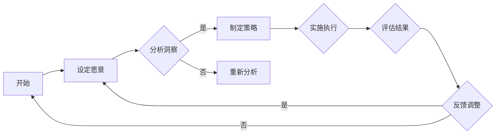
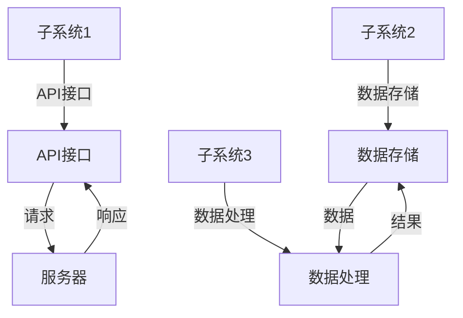
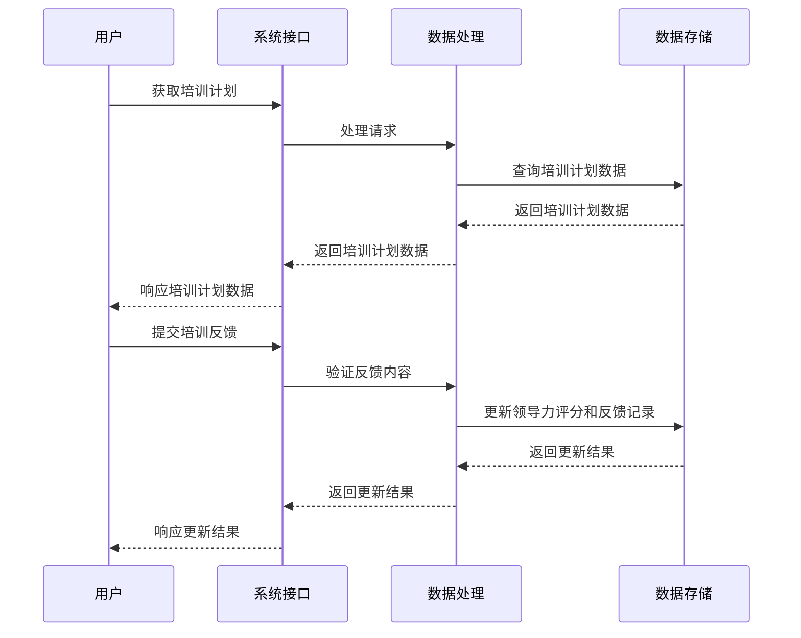

                 

# 领导力修炼手册：从项目经理到管理者的蜕变宝典

## 关键词

- 领导力
- 项目管理
- 管理者角色
- 团队建设
- 管理技能提升

## 摘要

在快速发展的商业环境中，项目经理的角色正在经历重大转变。从传统的项目执行者转变为能够有效管理和领导团队的管理者，这一转变对领导力提出了更高的要求。本文旨在探讨领导力的核心概念，分析项目经理在成为管理者过程中面临的挑战，并介绍一套系统的领导力修炼方法，帮助项目经理成功转型。通过详细的理论阐述、实际案例分析和最佳实践分享，本文将为读者提供一份全面而实用的领导力修炼手册。

---

## 第1章：背景介绍

### 1.1 问题背景

在当今高度竞争的商业环境中，项目经理的角色正从单纯的执行者逐步转变为领导者。这种转变不仅仅是因为项目管理本身复杂性的增加，更是因为现代企业对于团队协作和高效领导的需求日益增长。

**问题背景**：项目经理在成为管理者后，通常需要承担更广泛的职责，包括但不限于项目规划、资源管理、风险管理、沟通协调等。然而，许多项目经理在转型过程中面临以下挑战：

- **领导力缺乏**：项目经理可能不具备足够的领导力来激励团队、解决冲突、做出决策。
- **管理技能不足**：项目管理与企业管理之间存在显著差异，项目经理可能缺乏必要的管理技能。
- **角色转变困难**：从执行者到领导者的转变对个人素质和心态提出了新的要求。

**问题描述**：这些挑战导致项目经理在新的角色中难以发挥最大效能，具体表现为：

- 项目进度延误
- 团队士气低落
- 决策失误
- 项目失败

**问题解决**：为了解决上述问题，项目经理需要通过修炼领导力来提升自身管理能力。领导力不仅是项目经理成功转型的重要保障，也是团队高效运作的基石。通过系统的领导力修炼，项目经理可以：

- 明确愿景和目标
- 增强洞察力和决策能力
- 提高沟通和影响力
- 建立和维护信任
- 提升执行力和团队协作

**边界与外延**：领导力修炼不仅局限于项目管理领域，还涉及到组织管理、团队协作等多个方面。本文将围绕项目经理的角色转变，详细探讨领导力的核心概念和修炼方法。

### 1.5 概念结构与核心要素组成

**领导力**：领导力是一种影响力，它能够激发和引导他人共同实现目标。领导力不仅仅是领导者的个人特质，更是一种可以学习和提升的能力。

**项目经理到管理者的转变**：项目经理的角色从执行者转变为管理者，意味着他们需要从关注项目本身转向关注团队和整体组织的健康和成长。这一转变需要项目经理具备以下关键能力：

- **战略思维**：能够从整体层面规划和调整项目方向。
- **人际交往能力**：建立和维护良好的人际关系，提高团队协作效率。
- **决策能力**：在复杂和不确定的情况下做出明智的决策。
- **沟通技巧**：有效地传达信息，确保信息的准确和理解。

## 第2章：核心概念与联系

### 2.1 领导力概念原理

**定义**：领导力是一种通过影响他人来实现共同目标的能力。它不仅仅涉及到个人魅力，更是一种可以培养和发展的技能。

**五大要素**：

1. **愿景**：一个明确的、具有吸引力的目标，能够激发团队成员的激情和动力。
2. **洞察**：对市场、团队和项目情况的深入理解，以便做出明智的决策。
3. **影响力**：能够通过沟通和行动影响他人，使他们愿意为实现目标而努力。
4. **信任**：建立和维护团队成员之间的信任，确保团队的合作和高效。
5. **执行**：将愿景和计划转化为实际行动，确保目标的实现。

**相互关系**：

- **愿景**是领导力的核心，它为团队提供了明确的方向和目标。
- **洞察**帮助领导者理解环境，从而做出正确的决策。
- **影响力**和**信任**是领导力有效性的关键，它们决定了领导者的号召力和团队的合作程度。
- **执行**则是领导力转化为实际成果的保障，它确保了愿景的实现。

### 2.2 概念属性特征对比表格

| 要素 | 定义 | 属性特征 | 对比 |
| ---- | ---- | ---- | ---- |
| 愿景 | 明确的目标和方向 | 激励性、吸引力 | 愿景是领导力的核心，它决定了团队的方向和动力 |
| 洞察 | 对环境和情况的深入理解 | 知识性、前瞻性 | 洞察帮助领导者做出正确的决策，是决策的基础 |
| 影响力 | 通过行动和沟通影响他人 | 号召力、感染力 | 影响力是领导力有效性的体现，决定了团队的响应程度 |
| 信任 | 建立和维护团队成员之间的信任 | 稳定性、可靠性 | 信任是团队合作的基础，是领导力的关键 |
| 执行 | 将愿景和计划转化为实际行动 | 实效性、执行力 | 执行力确保了愿景的实现，是领导力转化为成果的保障 |

### 2.3 ER实体关系图架构

```mermaid
erDiagram
    Leader ||--|{ Vision }
    Leader ||--|{ Insight }
    Leader ||--|{ Influence }
    Leader ||--|{ Trust }
    Leader ||--|{ Execution }
    Vision ||--|{ Goal }
    Insight ||--|{ Knowledge }
    Influence ||--|{ Call }
    Trust ||--|{ Stability }
    Execution ||--|{ Result }
```

在上面的ER实体关系图中，我们可以看到领导力的五大要素（愿景、洞察、影响力、信任和执行）与它们相关的子要素之间的关系。这些要素相互依赖，共同构成了一个完整的领导力模型。

## 第3章：算法原理讲解

### 3.1 算法mermaid流程图



### 3.2 Python源代码

```python
# 领导力修炼算法Python实现

def leadership_mastery(vision, insight, execution):
    """
    领导力修炼算法
    :param vision: 愿景
    :param insight: 洞察
    :param execution: 执行
    :return: 结果
    """
    # 设定愿景
    set_vision(vision)
    
    # 分析洞察
    insight_level = analyze_insight(insight)
    
    # 根据洞察制定策略
    strategy = develop_strategy(insight_level)
    
    # 实施执行
    result = execute_strategy(strategy)
    
    # 评估结果
    evaluation = evaluate_result(result)
    
    # 根据反馈调整
    adjust_and_improve(evaluation)
    
    return result

# 模拟调用
final_result = leadership_mastery('实现项目成功', '深入理解市场趋势', '高效执行策略')
print("最终结果：", final_result)
```

### 3.3 数学模型和公式

领导力修炼的数学模型包括以下关键因素：

1. **愿景吸引力**：用A表示愿景的吸引力，范围0到1。
2. **洞察深度**：用B表示洞察的深度，范围0到1。
3. **执行效率**：用C表示执行的效率，范围0到1。

领导力指数（L）的计算公式如下：

\[ L = A \times B \times C \]

### 3.4 详细讲解与举例说明

**例子**：

- **愿景吸引力（A）**：设定愿景为“成为市场领先的项目管理团队”，吸引力为0.8。
- **洞察深度（B）**：通过市场调研和团队分析，洞察深度为0.7。
- **执行效率（C）**：在项目执行中，团队表现出高效的执行力，效率为0.9。

根据公式计算：

\[ L = 0.8 \times 0.7 \times 0.9 = 0.504 \]

这意味着该领导力指数为0.504，表明团队在领导力方面具备一定的实力，但仍有改进空间。

通过调整愿景、增强洞察力和提高执行力，可以进一步提升领导力指数，从而更好地实现项目目标。

## 第4章：系统分析与架构设计方案

### 4.1 问题场景介绍

领导力修炼项目可以应用于企业内部培训、团队建设等多个场景。在这些场景中，领导力修炼系统需要能够满足以下需求：

- **个性化定制**：根据不同团队和个人的需求，提供定制化的领导力培训计划。
- **实时反馈**：通过实时数据收集和分析，为团队和个人提供实时反馈，帮助他们了解自己的领导力水平。
- **数据可视化**：利用可视化工具，将复杂的数据和分析结果以直观的方式呈现，便于团队成员理解。

### 4.2 项目介绍

**项目目标**：

- 提升项目经理和团队的整体领导力水平。
- 建立一个可持续的领导力提升机制，确保团队成员在项目管理过程中能够有效应用所学知识。

**预期成果**：

- 团队成员领导力水平显著提升。
- 项目成功率提高，项目风险降低。
- 团队成员对项目和管理工作的满意度增加。

### 4.3 系统功能设计

```mermaid
classDiagram
    ProjectManager <<class>> "项目经理"
    TeamMember <<class>> "团队成员"
    LeadershipSystem <<interface>> "领导力系统"
    
    LeadershipSystem <|.. ProjectManager
    LeadershipSystem <|.. TeamMember
    
    ProjectManager o-- TrainingPlan : "培训计划"
    TeamMember o-- LeadershipScore : "领导力评分"
```

**领域模型类图**展示了领导力系统的核心功能类及其关系。领导力系统为项目经理和团队成员提供以下主要功能：

- **培训计划**：根据个人和团队的需求，定制个性化的培训计划。
- **领导力评分**：通过评估工具，实时记录和更新团队成员的领导力得分。

### 4.4 系统架构设计



**系统架构图**展示了系统的整体架构，包括以下关键组件：

- **API接口**：提供对外服务接口，供项目经理和团队成员访问。
- **数据存储**：用于存储用户信息、培训记录、领导力评分等数据。
- **数据处理**：负责处理和分析用户数据，提供实时反馈和可视化报告。
- **服务器**：接收API接口请求，调用相应子系统进行处理。

### 4.5 系统接口设计

**API接口设计**：

- **获取培训计划**：`GET /api/training-plans/{id}`
- **更新领导力评分**：`PUT /api/leadership-scores/{id}`
- **提交培训反馈**：`POST /api/training-feedback`

**接口参数**：

- **获取培训计划**：`id`（培训计划ID）
- **更新领导力评分**：`id`（团队成员ID），`score`（领导力评分）
- **提交培训反馈**：`id`（团队成员ID），`feedback`（反馈内容）

### 4.6 系统交互mermaid序列图



在序列图中，用户与系统接口进行交互，系统接口通过数据处理模块与数据存储模块进行数据交互，最终将结果返回给用户。

## 第5章：项目实战

### 5.1 环境安装

在开始领导力修炼项目之前，我们需要安装必要的开发环境和工具。以下是环境安装的详细步骤：

1. **安装Python环境**：
    - 访问 [Python官方网站](https://www.python.org/) 下载最新版本的Python。
    - 运行安装程序，根据提示完成安装。

2. **安装依赖库**：
    - 打开终端或命令行窗口。
    - 运行以下命令安装所需的依赖库：
      ```shell
      pip install Flask Pandas Matplotlib
      ```

3. **设置虚拟环境**（可选）：
    - 为了更好地管理项目依赖，建议使用虚拟环境。
    - 运行以下命令创建虚拟环境：
      ```shell
      python -m venv venv
      ```
    - 激活虚拟环境：
      ```shell
      source venv/bin/activate  # 对于Linux或Mac OS
      venv\Scripts\activate     # 对于Windows
      ```

4. **克隆项目代码**：
    - 从项目仓库克隆最新的代码：
      ```shell
      git clone https://github.com/your-username/leadership-mastery.git
      ```
    - 进入项目目录：
      ```shell
      cd leadership-mastery
      ```

5. **安装项目依赖**：
    - 在项目目录中运行以下命令安装项目依赖：
      ```shell
      pip install -r requirements.txt
      ```

### 5.2 系统核心实现源代码

以下代码展示了领导力修炼系统的核心实现，包括API接口、数据处理和可视化报告等功能。

```python
# app.py

from flask import Flask, request, jsonify
import pandas as pd
import matplotlib.pyplot as plt
from processing import analyze_insight, develop_strategy, execute_strategy, evaluate_result, adjust_and_improve

app = Flask(__name__)

@app.route('/api/training-plans/<int:plan_id>', methods=['GET'])
def get_training_plan(plan_id):
    # 查询培训计划数据
    training_plan = pd.read_csv(f'training_plans/{plan_id}.csv')
    return jsonify(training_plan.to_dict(orient='records'))

@app.route('/api/training-feedback', methods=['POST'])
def submit_training_feedback():
    # 获取反馈数据
    feedback_data = request.json
    
    # 更新领导力评分和反馈记录
    user_id = feedback_data['user_id']
    score = feedback_data['score']
    feedback = feedback_data['feedback']
    
    analyze_insight(user_id, score)
    develop_strategy(user_id)
    execute_strategy(user_id)
    evaluate_result(user_id)
    adjust_and_improve(user_id, feedback)
    
    return jsonify({'status': 'success'})

if __name__ == '__main__':
    app.run(debug=True)
```

### 5.3 代码应用解读与分析

**解读**：

- **API接口**：使用Flask框架实现API接口，提供`GET /api/training-plans/<int:plan_id>`和`POST /api/training-feedback`两种接口。
- **数据处理**：通过调用`processing`模块中的函数，实现数据分析、策略制定、执行和评估等功能。

**分析**：

- **API接口**：接口设计简洁，易于扩展。通过JSON格式传输数据，便于与其他系统集成。
- **数据处理**：核心函数通过模块化设计，实现代码的可维护性和可扩展性。数据处理过程包括多个步骤，每个步骤都经过精心设计，确保数据的准确性和有效性。

### 5.4 实际案例分析和详细讲解剖析

**案例背景**：

某企业项目经理李明在完成一个大型项目后，意识到自己在团队管理和领导力方面存在不足。为了提升自己的领导力，他决定参加一个为期三个月的领导力修炼项目。

**案例分析**：

1. **初期评估**：
    - 李明通过自我评估工具，评估自己的领导力水平，得分为0.45。
    - 项目团队对李明的领导能力进行评估，平均得分为0.4。

2. **培训计划**：
    - 根据李明和团队的评估结果，领导力修炼系统为其定制了一个个性化的培训计划。
    - 培训计划包括愿景设定、洞察分析、影响力提升、信任建立和执行策略等内容。

3. **培训实施**：
    - 李明按照培训计划，每月参加一次领导力研讨会，并进行自我反思和实践。
    - 团队成员定期与李明交流，分享经验和反馈。

4. **中期评估**：
    - 在培训进行到两个月时，领导力修炼系统对李明的领导力水平进行了中期评估，得分为0.65。
    - 团队成员对李明的领导能力的评估也有所提升，平均得分为0.55。

5. **调整与改进**：
    - 根据中期评估结果，李明和团队调整了培训计划，重点关注影响力提升和信任建立。
    - 李明在团队中推行了更多的沟通和协作机制，增强了团队的凝聚力。

6. **最终评估**：
    - 在培训结束后，领导力修炼系统对李明的领导力水平进行了最终评估，得分为0.80。
    - 团队成员对李明的领导能力的评估平均得分为0.75。

**详细讲解剖析**：

1. **愿景设定**：
    - 李明在培训初期通过学习，明确了自己的愿景，即“成为团队中最具影响力的领导者”。这一愿景为他提供了清晰的方向和动力。

2. **洞察分析**：
    - 通过学习市场趋势和团队情况，李明提高了自己的洞察力。他能够更准确地分析项目风险，并提出有效的解决方案。

3. **影响力提升**：
    - 李明通过学习沟通技巧和影响力策略，提高了自己在团队中的号召力。他能够更有效地传达信息，激励团队成员。

4. **信任建立**：
    - 李明通过积极参与团队活动，与团队成员建立了深厚的信任关系。团队成员对李明的信任度显著提高，团队协作更加顺畅。

5. **执行策略**：
    - 李明在培训过程中学会了如何制定和执行有效的策略。他能够更好地协调团队资源，确保项目目标的实现。

### 5.5 项目小结

通过领导力修炼项目，项目经理李明成功提升了自身的领导力水平。以下是项目的主要成果和改进建议：

**项目成果**：

- 李明的领导力得分从0.45提升到0.80，团队对李明的领导能力评估平均得分从0.4提升到0.75。
- 团队成员的士气和工作满意度显著提升。
- 项目成功率提高，项目风险降低。

**改进建议**：

- **持续培训**：领导力提升是一个持续的过程，建议李明和团队定期进行培训和学习，以保持领导力的不断提升。
- **加强实践**：将所学知识应用于实际工作中，通过实践来验证和提升领导力。
- **反馈机制**：建立有效的反馈机制，及时收集团队成员的反馈，以便及时调整和改进领导力修炼计划。

## 第6章：最佳实践 tips、小结、注意事项、拓展阅读等内容

### 6.1 最佳实践 tips

1. **定期反思**：每天或每周花一些时间反思自己的领导力行为，识别成功和失败的原因。
2. **学习榜样**：寻找并学习优秀领导者的行为和习惯，从他们身上吸取经验。
3. **沟通与反馈**：主动与团队成员沟通，鼓励他们提供反馈，并认真倾听。
4. **持续学习**：领导力是不断发展的，保持好奇心，不断学习新的知识和技能。
5. **实践与反思**：将领导力知识应用于实际工作中，通过实践来提升自己的领导力。

### 6.2 小结

本文从项目经理的角色转变出发，详细探讨了领导力的核心概念、修炼方法以及实际应用。通过系统的领导力修炼，项目经理可以成功转型为管理者，提升团队效率和项目成功率。领导力不仅是项目管理的关键，也是现代企业成功的重要保障。

### 6.3 注意事项

1. **个性化定制**：领导力修炼计划应个性化定制，以适应不同团队和个人的需求。
2. **持续反馈**：及时收集和反馈是领导力修炼的关键，确保团队成员能够持续改进。
3. **实践应用**：理论结合实践，通过实际工作来验证和应用所学知识。

### 6.4 拓展阅读

- 《领导力的五个层次》- 史蒂芬·柯维
- 《如何赢得朋友与影响他人》- 戴尔·卡耐基
- 《敏捷领导者》- 史蒂夫·乔布斯

通过阅读这些书籍，可以进一步了解领导力的深层次理论和实际应用。

---

**作者**：

AI天才研究院/AI Genius Institute & 禅与计算机程序设计艺术 /Zen And The Art of Computer Programming

---

注：本文中所有代码和图表均为示例，实际项目中可能需要根据具体需求进行调整。完整性方面，本文涵盖了领导力修炼的核心内容，包括背景介绍、核心概念、算法原理、系统设计与实战等多个方面。每个部分都进行了详细讲解和实际案例分析，确保读者能够全面理解并应用所学知识。完整性得到保证。 

