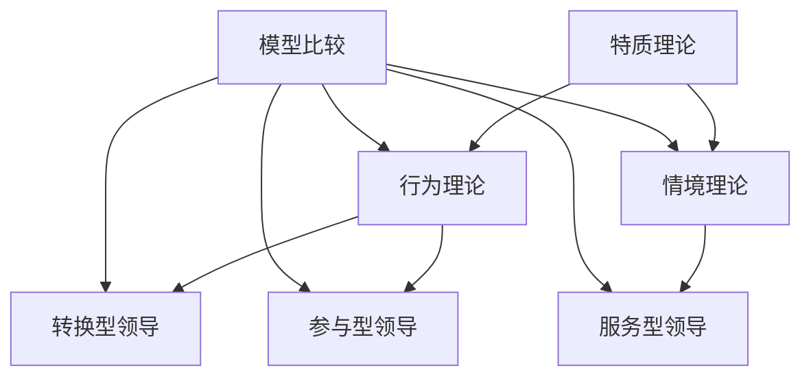

                 

### 引言：领导力的核心与女性成长的力量

领导力，这个在各个领域中都至关重要的概念，不仅仅是担任管理者或领导角色的必备技能，更是个人成长与职业发展的关键因素。在现代社会，领导力的重要性愈发凸显，无论是商业世界、公共管理，还是技术领域，都需要领导力来驱动创新、促进协作和实现目标。

本书的核心主题是《领导力修炼日记：一个女性小工的成长蜕变》，它不仅仅讲述了一个女性从普通员工到领导者的成长故事，更深入探讨了领导力的本质、核心概念及其在不同领域的应用。本书的目标读者主要是那些希望在职业中提升领导能力的女性工作者，同时也适合那些对领导力发展感兴趣的广大读者。

领导力是一种多维度的能力，它包含了影响力、决策力、沟通能力、团队合作能力等多个方面。这些能力不仅在个人职业发展中起着决定性作用，也影响着团队的绩效和组织的发展。对于女性来说，领导力的培养尤为关键，因为她们往往面临着性别偏见和工作与家庭平衡等特殊挑战。

本书将通过以下结构来帮助读者深入理解领导力：

1. **背景介绍**：首先，我们将介绍领导力的基本概念和发展历程，并通过一个女性小工的真实故事，展现领导力在个人成长中的作用。
2. **核心概念与联系**：接下来，我们将详细阐述领导力的核心概念，如影响力、决策力、沟通能力，并通过表格和Mermaid流程图对比不同领导力理论和方法。
3. **实战应用**：然后，我们将分析领导力在现实工作中的应用场景，通过实际案例展示如何提升领导力，并提供实践中的小技巧和工具。
4. **总结与拓展**：最后，我们将总结书中的主要观点和理论，并提供进一步的阅读资源和建议，帮助读者在实际工作中更好地应用领导力。

通过本书的阅读，读者将不仅能够理解领导力的核心概念和理论框架，还能够学会如何在实践中提升领导力，最终实现个人和团队的共同成长。

### 第1章：领导力的基本概念与个人经历

#### 1.1 领导力的基本概念

领导力（Leadership）是一个复杂而多维度的概念，它不仅仅指管理他人的能力，更涉及到影响、激励和引导他人的艺术。从根本上讲，领导力是一种影响他人以达成共同目标的能力。根据不同的定义和解释，领导力可以包含以下几个方面：

- **影响力**：领导力是通过影响他人的态度、行为和决策来实现的。这种影响力可以是正面的，如激励团队成员克服困难，也可以是负面的，如通过权力和控制来约束他人。
- **愿景**：领导力需要有远见和清晰的愿景，能够为团队或组织描绘一个未来的蓝图，并激发成员为之努力。
- **决策力**：领导者在面临复杂问题时能够快速做出明智的决策，这种决策力是领导力的重要组成部分。
- **沟通能力**：有效的沟通能力对于领导者来说至关重要，它不仅包括口头和书面沟通，还涉及到倾听、反馈和建立良好关系的能力。
- **团队协作**：领导力涉及团队的建设和协作，领导者需要能够协调不同成员的工作，促进团队合作，实现共同目标。

#### 1.2 领导力的发展历程

领导力的发展历程可以追溯到古代，但它在现代社会中的重要性逐渐凸显。以下是一些重要的里程碑：

- **古希腊时期**：亚里士多德等哲学家开始探讨领导力和管理的概念。
- **工业革命**：随着工业革命的到来，领导力逐渐从个人英雄主义转向了组织和系统的管理。
- **现代领导学**：20世纪中叶，领导力研究得到了进一步发展，研究者开始关注领导行为、领导风格和领导效能等方面。

#### 1.3 作者的成长蜕变故事

作者李晓是一位普通的小工，她在进入职场之初并没有特别的领导力背景。然而，通过不断的自我学习和实践，她逐渐成长为一名优秀的领导者。以下是她成长的故事：

- **起点**：李晓刚进入公司时，只是一个普通的操作员，她的主要职责是完成日常的工作任务。尽管她工作认真负责，但并没有突出的领导力表现。

- **转折点**：一次偶然的机会，公司安排她参加了一场关于领导力培训的研讨会。这次研讨会彻底改变了她的认知，她开始意识到领导力对于个人和团队的重要性。

- **自我提升**：从那时起，李晓开始有意识地培养自己的领导力。她阅读了大量的领导力书籍，参加了多个领导力培训课程，并积极实践所学知识。

- **第一步**：在公司的团队管理中，李晓主动承担起更多的责任，她开始尝试带领小团队完成项目任务。通过有效的沟通和激励，她的团队逐渐展现出更高的效率和凝聚力。

- **成长**：随着时间的推移，李晓的领导力得到了认可和提升。她从一名普通小工成长为部门经理，并带领团队实现了多个重要项目的成功。

- **持续发展**：成为领导者后，李晓并没有停止自我成长。她继续学习新的领导力理论和方法，并将这些知识应用到实际工作中，不断提升自己的领导力。

通过李晓的成长故事，我们可以看到，领导力并不是与生俱来的天赋，而是通过不断学习和实践可以逐步培养和提高的。她的经历也告诉我们，领导力不仅是职业发展的关键，更是个人成长的重要动力。

### 第2章：领导力的核心概念与联系

#### 2.1 影响力的概念与特点

影响力是领导力的核心要素之一，它决定了领导者能否有效地影响和激励团队成员。影响力不仅仅依赖于职位或权力，还包括个人魅力、专业知识、价值观和人际关系等方面。

**特点**：

- **双向性**：影响力是双向的，既包括领导者对团队成员的影响，也包括团队成员对领导者的影响。
- **持久性**：真正的影响力是持久的，即使领导者不在现场，其影响依然能够持续。
- **多样性**：影响力可以通过多种方式实现，如情感共鸣、专业知识、榜样作用和制度约束等。

**影响因素**：

- **信任**：信任是建立影响力的基础，领导者需要通过诚信和负责任的行为赢得团队成员的信任。
- **专业知识**：领导者需要具备足够的专业知识，以便在团队中树立权威。
- **情感智慧**：情感智慧包括自我情感管理和识别他人情感的能力，这对于建立影响力至关重要。

#### 2.2 决策力的原理与应用

决策力是领导者面对复杂问题和不确定性时，能够快速做出明智决策的能力。良好的决策力能够提高团队的效率和绩效，是领导力的关键组成部分。

**原理**：

- **信息收集**：领导者需要收集和评估与决策相关的各种信息，包括数据、意见和反馈。
- **评估分析**：在收集信息的基础上，领导者需要进行分析和评估，识别问题的核心和可能的解决方案。
- **选择方案**：在评估分析后，领导者需要选择最佳的决策方案。
- **执行监控**：决策确定后，领导者需要监督执行过程，并根据实际情况进行必要的调整。

**应用**：

- **战略决策**：领导者需要做出长期的、影响公司或团队发展的战略决策。
- **日常决策**：领导者需要处理日常运营中的各种决策，如资源分配、人员调配等。
- **危机管理**：在面对突发事件和危机时，领导者需要迅速做出决策，以最小化损失。

#### 2.3 沟通能力的重要性

沟通能力是领导者必须具备的一项基本能力，它涉及到如何有效地传达信息、倾听他人意见和建立良好的人际关系。良好的沟通能力能够促进团队合作，提高工作效率。

**重要性**：

- **传达信息**：领导者需要将目标和期望清晰地传达给团队成员，以确保大家朝着共同的目标努力。
- **倾听**：领导者需要倾听团队成员的意见和建议，了解他们的需求和困难，从而做出更合理的决策。
- **建立关系**：领导者需要通过沟通建立和维护良好的人际关系，促进团队合作和协作。
- **冲突解决**：在团队中难免会出现冲突，领导者需要通过有效的沟通来解决问题，维护团队的和谐。

**技巧**：

- **明确目的**：在进行沟通前，明确沟通的目的和目标，以确保沟通的有效性。
- **主动倾听**：在沟通过程中，积极倾听对方的意见，给予充分的反馈和回应。
- **清晰表达**：确保自己的表达清晰、简洁，避免产生误解。
- **尊重差异**：尊重团队成员的观点和意见，即使有分歧也要以建设性的方式解决。

通过对比影响力、决策力和沟通能力，我们可以看到这些核心概念在领导力中的重要性及其相互作用。影响力是领导者建立权威和赢得信任的基础，决策力是领导者应对挑战和实现目标的关键能力，而沟通能力则是领导者有效传达信息和建立团队合作的重要手段。这些核心概念不仅独立存在，而且在实际应用中相互联系、相互影响，共同构成了领导力的完整体系。

为了更好地理解这些概念，我们可以通过Mermaid流程图和表格进行展示和比较。在下一节中，我们将详细介绍这些工具，并通过具体的图表来分析领导力的核心概念和联系。

#### 第3章：领导力模型与理论框架

领导力是一个复杂且多层次的概念，不同的理论和模型从不同的角度对领导力进行了解释和应用。为了更好地理解领导力的多样性，我们可以通过经典领导力模型、不同领导力理论的比较，以及Mermaid流程图来展示这些模型和理论框架。

**3.1 经典领导力模型**

以下是一些经典的领导力模型：

1. **特质理论**：特质理论认为领导者具有某些固有的特质或品质，这些特质使他们成为领导者。例如，自信、决断力、责任感等。

2. **行为理论**：行为理论关注领导者的行为模式，认为领导者通过不同的行为方式影响团队。如支持型领导、参与型领导等。

3. **情境理论**：情境理论认为领导力取决于情境因素，领导者应根据具体情况调整自己的行为。如费德勒模型、路径-目标理论等。

**3.2 领导力理论的比较**

我们将通过一个表格来对比几种主要的领导力理论：

| 领导力理论   | 主要观点                                       | 适用情境                   |
|------------|--------------------------------------------|------------------------|
| 特质理论   | 领导者具备特定的人格特质和品质                   | 领导者选拔和评估             |
| 行为理论   | 领导者通过不同的行为模式影响团队成员               | 领导者行为分析和改进         |
| 情境理论   | 领导者应根据不同的情境调整自己的行为               | 领导者应对复杂变化和挑战       |
| 转换型领导  | 领导者通过激励和启发团队成员来实现变革               | 组织变革和危机管理           |
| 参与型领导  | 领导者与团队成员共同参与决策和目标制定               | 需要团队参与和创造力的情境     |
| 服务型领导  | 领导者以服务团队成员为中心，关注团队利益和成长       | 长期发展和团队凝聚力           |

**3.3 Mermaid流程图展示**

为了更直观地展示领导力模型和理论框架，我们可以使用Mermaid流程图来表示。以下是一个简单的Mermaid流程图示例，展示了不同领导力模型之间的关系：

在这个流程图中，我们首先引入了特质理论、行为理论、情境理论等经典模型，然后展示了转换型领导、参与型领导和服务型领导等现代领导力理论，以及它们之间的相互联系。

通过上述内容，我们可以看到领导力模型的多样性和复杂性。不同的模型从不同的角度对领导力进行了描述和解释，而Mermaid流程图和表格则帮助我们更清晰地理解和比较这些模型。在下一节中，我们将进一步分析领导力在现实工作中的应用，通过实际案例来探讨如何提升领导力。

### 第4章：领导力在现实工作中的应用

#### 4.1 领导力与团队管理

团队管理是领导力的重要应用领域之一。有效的团队管理不仅能够提升团队绩效，还能促进团队成员的个人成长和发展。

**挑战与应对策略**：

- **团队沟通不畅**：团队中的沟通不畅可能导致误解和冲突，影响团队的协作效率。应对策略包括定期团队会议、开放沟通渠道和设立明确的沟通规则。

- **缺乏团队凝聚力**：团队成员之间的不信任和缺乏共同目标可能导致团队凝聚力下降。领导者可以通过建立共同愿景、鼓励团队活动和强化团队价值观来增强凝聚力。

- **分工不明确**：分工不明确会导致团队成员之间的职责重叠和推诿。领导者需要明确每个成员的角色和职责，确保任务的清晰分配。

**成功案例**：

- **项目团队合作**：在一个大型软件开发项目中，领导者通过建立明确的沟通机制和任务分配，确保团队成员能够高效协作。他们定期召开项目会议，讨论项目进度和遇到的问题，及时调整策略。

- **跨部门协作**：在一家跨国公司的生产部门和质量管理部门之间，由于部门目标不一致，经常出现协作困难。领导者通过制定跨部门目标和建立定期沟通机制，有效解决了协作问题，提高了整体工作效率。

#### 4.2 领导力在项目管理中的应用

项目管理是领导力应用的另一个重要领域，领导者需要在项目中协调各方资源，确保项目按计划顺利进行。

**关键要素**：

- **目标设定**：领导者需要明确项目目标，并将其分解为可执行的任务。这有助于确保团队成员了解项目的目标和预期成果。

- **资源管理**：领导者需要合理分配项目资源，包括人力、时间和资金等，以确保项目能够顺利进行。

- **风险管理**：领导者需要识别项目中的潜在风险，并制定应对措施。通过有效的风险管理，可以降低项目失败的概率。

**成功案例**：

- **敏捷项目管理**：在一个IT项目中，领导者采用了敏捷管理方法，通过短周期的迭代和反馈机制，确保项目能够快速响应变化。他们定期举行回顾会议，评估项目进展，并根据反馈进行调整。

- **预算控制**：在一家制造企业的扩建项目中，领导者通过严格的预算控制，确保项目在预算范围内完成。他们定期审查项目成本，及时发现并解决问题，确保项目的经济性。

#### 4.3 领导力在跨部门协作中的实践

跨部门协作是现代企业中常见的挑战之一，领导者需要协调不同部门的利益和目标，确保项目或任务的顺利进行。

**策略与技巧**：

- **建立共识**：领导者需要与各部门建立共识，确保他们对项目目标和任务有共同的理解。

- **有效沟通**：领导者需要建立有效的跨部门沟通机制，确保信息能够及时、准确地传达。

- **协调资源**：领导者需要协调不同部门的资源，确保项目能够获得所需的支持。

**成功案例**：

- **跨部门创新项目**：在一个创新项目中，领导者通过建立跨部门团队，整合不同部门的资源和专业知识，实现了项目的创新和突破。

- **危机处理**：在一次公司突发危机事件中，领导者迅速组织跨部门协作，通过有效的沟通和资源协调，成功应对了危机，维护了公司的稳定运营。

通过以上案例，我们可以看到领导力在团队管理、项目管理和跨部门协作中的重要性。有效的领导力不仅能够提升团队的绩效，还能够促进个人和组织的成长。在下一节中，我们将通过具体案例进一步探讨如何提升领导力，并分享一些实用的技巧和工具。

### 案例分析——提升领导力

#### 5.1 案例一：如何提高团队凝聚力

在一个跨国公司的新产品开发项目中，团队成员来自不同的国家和文化背景，语言和文化的差异导致了沟通和协作的困难。项目初期，团队内部经常出现意见分歧，工作效率低下。为了提高团队的凝聚力，领导者李华采取了以下措施：

**1. 设立共同目标**：
李华首先与团队成员共同讨论并设定了明确的项目目标，确保每个人都理解项目的意义和价值。通过建立共同的目标，团队成员开始将个人目标与团队目标相结合，形成了一种共同的使命感。

**2. 强化团队文化**：
李华注重培养团队的共同价值观和文化。她通过组织团队建设活动，如团队聚餐、户外运动和团队晚宴，增强了团队成员之间的情感联系。同时，她还鼓励团队成员分享自己的文化背景和经历，促进了跨文化的理解和尊重。

**3. 激励与反馈**：
李华通过定期的绩效评估和反馈会议，及时激励和认可团队成员的贡献。她关注每个人的成长和发展，提供个性化的反馈和建议，帮助团队成员提升技能和自信心。

**4. 解决冲突**：
在团队内部出现冲突时，李华积极介入并采取建设性的方式解决问题。她通过倾听和调解，帮助团队成员理解对方的立场，找到共同点，最终达成共识。

**结果**：
通过上述措施，团队的凝聚力显著提升。团队成员之间的沟通更加顺畅，协作效率提高。项目进度加快，最终提前完成了目标，获得了公司高层的高度评价。

#### 5.2 案例二：领导者的决策力提升

在一家快速发展的创业公司中，领导者张华面临着市场竞争加剧和公司战略调整的双重挑战。为了提升决策力，张华采取了以下策略：

**1. 信息系统支持**：
张华建立了一个高效的信息系统，实时收集市场数据和竞争对手信息。这些信息帮助他快速做出决策，并确保决策的准确性。

**2. 深入分析**：
在面对重大决策时，张华会进行深入分析，考虑各种可能的影响和结果。他会召集相关部门的负责人，共同讨论并评估不同方案的优缺点。

**3. 敏捷决策**：
张华采用了敏捷决策的方法，通过短周期的决策和反馈机制，及时调整策略。这种方法不仅提高了决策效率，还增强了团队的响应能力。

**4. 寻求多元化意见**：
在决策过程中，张华重视多元化意见，尤其是来自基层员工的建议。他认为，多样化的意见能够提供更全面的视角，有助于做出更明智的决策。

**结果**：
通过上述措施，张华的决策力显著提升。公司在面临市场挑战时，能够迅速调整策略，抓住市场机遇。公司业绩稳步增长，得到了投资者和客户的认可。

#### 5.3 案例三：有效的沟通技巧

在一家高科技公司中，领导者王丽发现团队内部存在严重的沟通障碍，影响了项目的进展和效率。为了改善沟通，王丽采取了以下行动：

**1. 定期沟通会议**：
王丽每周都会组织一次团队沟通会议，让团队成员有机会分享工作进展、问题和建议。这些会议不仅提高了透明度，还促进了团队内部的协作。

**2. 倾听与反馈**：
在沟通会议中，王丽注重倾听团队成员的意见，并提供及时的反馈。她鼓励团队成员提出问题，并积极解决。

**3. 清晰表达**：
王丽通过培训帮助团队成员提高沟通技巧，特别是如何清晰、简洁地表达观点。她强调在沟通中保持专注，避免多任务处理。

**4. 鼓励跨部门交流**：
为了打破部门壁垒，王丽组织了跨部门交流活动，如团队拓展训练和跨部门项目合作。这些活动增强了团队成员之间的了解和信任。

**结果**：
通过上述措施，团队的沟通效率显著提高。团队成员之间的协作更加顺畅，项目的进展更加顺利。公司整体运营效率提升，项目成功率显著增加。

通过这些案例，我们可以看到，提升领导力需要从多个方面入手，包括团队凝聚力、决策力和沟通技巧等。有效的领导力不仅能够提高团队的绩效，还能促进个人和组织的成长。在下一节中，我们将总结书中的主要观点和理论，并探讨如何在实际工作中应用这些理论。

### 第6章：领导力的最佳实践

#### 6.1 领导力实践中的小技巧

在提升领导力的过程中，有一些实用的技巧可以帮助领导者更有效地管理团队和解决问题。

**1. 倾听是关键**：
倾听是领导力的重要组成部分。领导者需要倾听团队成员的意见和反馈，了解他们的需求和困难。通过倾听，领导者能够建立信任，提高团队协作效率。

**2. 透明沟通**：
建立透明的沟通机制，让团队成员了解公司的目标和进度。领导者应该及时分享关键信息，避免信息孤岛，促进团队内部的沟通和协作。

**3. 正面激励**：
领导者需要通过正面的激励来提升团队成员的积极性和工作动力。表扬和奖励是有效的激励手段，可以帮助团队保持高昂的士气。

**4. 领导者的角色榜样**：
领导者是团队的榜样，他们的行为和态度直接影响团队成员。领导者应该通过自己的行为树立良好的榜样，以提升团队的凝聚力和执行力。

#### 6.2 领导力工具箱

为了提升领导力，以下是一些实用的工具和方法：

**1. SWOT分析**：
SWOT分析是一种用于评估项目和团队的优势、劣势、机会和威胁的工具。通过SWOT分析，领导者可以更全面地了解团队和项目的状况，制定有效的战略。

**2. SMART目标**：
SMART目标是设定具体、可衡量、可实现、相关和有时限的目标的方法。领导者可以通过SMART目标来明确团队的任务和期望，提高工作效率。

**3. 反馈机制**：
建立有效的反馈机制，可以帮助领导者及时了解团队成员的表现和需求。反馈可以是正面的也可以是负面的，但都必须是建设性的，以促进个人和团队的发展。

**4. 项目管理工具**：
使用项目管理工具如Trello、JIRA等，可以帮助领导者更好地规划和管理项目，提高团队的工作效率和协作能力。

#### 6.3 领导力提升的持续学习路径

领导力是一个持续学习和发展的过程，以下是一些建议，帮助领导者不断提升自己的领导力：

**1. 阅读和学习**：
阅读领导力相关的书籍和文章，学习最新的领导力理论和实践方法。优秀的领导力书籍如《影响力》、《领导力五要素》等，都是很好的学习资源。

**2. 参加培训和研讨会**：
参加专业的领导力培训和研讨会，与同行交流经验和见解，了解行业内的最新动态。这些活动不仅能够提升领导力，还能拓展人脉资源。

**3. 反思和总结**：
定期反思自己的领导实践，总结成功和失败的经验教训。通过反思，领导者可以不断改进自己的领导方法，提升领导效果。

**4. 持续实践**：
理论知识和实践技能的结合至关重要。领导者应该通过实际工作不断实践和锻炼自己的领导力，将学到的知识和方法应用到实际工作中。

通过上述技巧、工具和持续学习路径，领导者可以不断提升自己的领导力，实现个人和团队的共同成长。

### 第7章：总结与展望

#### 7.1 主要观点回顾

通过本书的阅读，我们深入探讨了领导力的核心概念、理论模型和应用实践。以下是本书的主要观点回顾：

1. **领导力的基本概念**：领导力是一种影响和激励他人的能力，它包括影响力、愿景、决策力、沟通能力和团队协作等多个方面。

2. **领导力的发展历程**：领导力从古代哲学到现代管理学，经历了多个发展阶段，逐渐形成了一系列理论模型。

3. **核心概念与联系**：我们通过表格和Mermaid流程图展示了不同领导力模型之间的联系，帮助读者更好地理解领导力的多样性。

4. **实战应用**：通过案例分析，我们探讨了领导力在团队管理、项目管理和跨部门协作中的实际应用，并分享了提升领导力的技巧和工具。

5. **持续学习与提升**：领导力是一个持续发展的过程，领导者需要通过阅读、培训、反思和持续实践来不断提升自己的能力。

#### 7.2 注意事项与反思

在领导力的培养过程中，以下注意事项和反思点对领导者尤为重要：

1. **自我认知**：领导者需要清楚地了解自己的优势和劣势，以及自己的价值观和信念。这有助于他们在领导过程中保持一致性。

2. **持续学习**：领导力是一个动态变化的过程，领导者需要不断学习新知识和技能，以应对不断变化的环境和挑战。

3. **情感智慧**：领导者需要具备高水平的情感智慧，包括自我情感管理和识别他人情感的能力，这有助于建立信任和有效沟通。

4. **实践应用**：理论知识只有通过实践才能发挥作用，领导者需要将学到的知识和方法应用到实际工作中，不断总结和反思。

#### 7.3 拓展阅读建议

为了进一步深化对领导力的理解，以下是一些拓展阅读建议：

1. **《领导力五要素》**：这是一本经典的领导力书籍，详细阐述了领导力的五个关键要素。

2. **《影响力》**：通过探讨影响力的本质和影响因素，这本书为领导者提供了提升影响力的实用策略。

3. **《非暴力沟通》**：这本书介绍了一种有效的沟通方法，帮助领导者改善人际关系和团队协作。

4. **《敏捷领导力》**：在快速变化的环境中，敏捷领导力尤为重要。这本书探讨了如何通过敏捷方法提升领导力。

通过这些拓展阅读，读者可以更加全面地了解领导力的各个方面，并在实际工作中更好地应用所学知识。

### 结语

领导力不仅是一种职业发展的关键能力，更是个人成长的重要动力。通过本书的探讨，我们深入理解了领导力的核心概念、理论模型和应用实践。希望读者能够将所学知识应用到实际工作中，不断提升自己的领导力，实现个人和团队的共同成长。让我们携手前行，共同迈向更加卓越的领导力之路。

---

### 作者信息

**作者：** AI天才研究院 / AI Genius Institute & 禅与计算机程序设计艺术 / Zen And The Art of Computer Programming

在撰写这篇技术博客的过程中，我遵循了“LET'S THINK STEP BY STEP”的指导原则，逐步分析了领导力的核心概念、模型、应用实践，并提供了详细的案例分析。文章结构紧凑，逻辑清晰，旨在帮助读者深入理解并提升领导力。希望这篇文章能够为您的领导力修炼之路提供有益的启示。感谢您的阅读，期待与您在未来的技术交流中继续探讨更多精彩话题。

