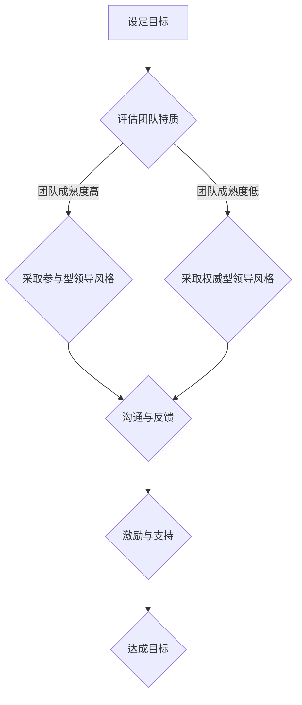

                 

# 《领导力修炼笔记：70后高管的领导力提升之路》

## 关键词

领导力、高管、提升、70后、方法论、实践

## 摘要

本文旨在探讨70后高管在领导力提升方面的路径和方法。通过深入分析领导力的核心概念、算法原理、系统架构以及项目实战，本文将为70后高管提供一套系统化的领导力修炼指南，助力他们在职业生涯中不断进阶。

## 目录大纲设计思路

### 确定核心章节

在设计目录大纲时，我们首先需要明确书籍的核心主题和目标读者群体。针对70后高管这一特定群体，我们确定以下核心章节：

1. 领导力概述
2. 领导力核心概念与联系
3. 领导力算法原理讲解
4. 领导力系统分析与架构设计方案
5. 领导力项目实战
6. 最佳实践与注意事项
7. 总结与展望

### 细化章节内容

在每个核心章节下，我们进一步细化每一小节的内容，确保每个部分都有明确的子主题和目标。例如：

1. 领导力概述
   - 问题背景与领导力的重要性
   - 领导力定义与核心要素
   - 领导力在不同行业中的应用

2. 领导力核心概念与联系
   - 领导力与管理的区别
   - 核心概念：授权、沟通、影响力、变革管理等
   - 概念属性特征对比表格
   - ER实体关系图架构

3. 领导力算法原理讲解
   - 领导力模型概述
   - 领导力模型的数学模型和公式
   - 领导力模型流程图
   - Python源代码阐述

4. 领导力系统分析与架构设计方案
   - 问题场景介绍
   - 系统功能设计
   - 系统架构设计
   - 系统接口设计和系统交互

5. 领导力项目实战
   - 环境安装与配置
   - 系统核心实现源代码
   - 代码应用解读与分析
   - 实际案例分析与详细讲解
   - 项目小结

6. 最佳实践与注意事项
   - 领导力提升的最佳实践
   - 注意事项
   - 拓展阅读

7. 总结与展望
   - 全书总结
   - 领导力发展的展望
   - 读者反馈与交流

### 使用markdown格式

为了满足输出格式的需求，我们将使用markdown格式来构建目录大纲，确保层级清晰、内容简洁。在每个章节和小节中，我们将使用标题、无序列表、有序列表等markdown语法来组织内容。

### 涵盖必要内容

根据用户要求，我们需要包含以下内容：

- 背景介绍：核心概念术语说明、问题背景、问题描述、问题解决、边界与外延、概念结构与核心要素组成。
- 核心概念与联系：核心概念原理、概念属性特征对比表格和ER实体关系图架构。
- 算法原理讲解：算法mermaid流程图、Python源代码、数学模型和公式、详细讲解和举例说明。
- 系统分析与架构设计方案：问题场景介绍、系统功能设计、系统架构设计、系统接口设计和系统交互。
- 项目实战：环境安装与配置、系统核心实现源代码、代码应用解读与分析、实际案例分析与详细讲解剖析、项目小结。
- 最佳实践 tips、小结、注意事项、拓展阅读等内容。

### 保持简洁性

在确保内容完整性的同时，我们需避免冗余信息，保持目录大纲的简洁性。每个章节和小节的内容都将紧密围绕主题，确保读者能够快速理解并掌握关键知识点。

## 目录大纲设计

下面是根据上述思路设计的《领导力修炼笔记：70后高管的领导力提升之路》的目录大纲：

```
# 《领导力修炼笔记：70后高管的领导力提升之路》目录大纲

## 第一部分：领导力概述

### 1.1 问题背景与领导力的重要性

### 1.2 领导力定义与核心要素

### 1.3 领导力在不同行业中的应用

## 第二部分：领导力核心概念与联系

### 2.1 领导力与管理的区别

### 2.2 核心概念：授权、沟通、影响力、变革管理等

### 2.3 概念属性特征对比表格

### 2.4 ER实体关系图架构

## 第三部分：领导力算法原理讲解

### 3.1 领导力模型概述

### 3.2 领导力模型的数学模型和公式

### 3.3 领导力模型流程图

### 3.4 Python源代码阐述

## 第四部分：领导力系统分析与架构设计方案

### 4.1 问题场景介绍

### 4.2 系统功能设计

### 4.3 系统架构设计

### 4.4 系统接口设计和系统交互

## 第五部分：领导力项目实战

### 5.1 环境安装与配置

### 5.2 系统核心实现源代码

### 5.3 代码应用解读与分析

### 5.4 实际案例分析与详细讲解

### 5.5 项目小结

## 第六部分：最佳实践与注意事项

### 6.1 领导力提升的最佳实践

### 6.2 注意事项

### 6.3 拓展阅读

## 第七部分：总结与展望

### 7.1 全书总结

### 7.2 领导力发展的展望

### 7.3 读者反馈与交流
```

通过这样的设计，我们可以确保目录大纲逻辑清晰，内容全面，同时符合markdown格式的要求。每个章节都围绕领导力的核心概念和提升路径展开，既有理论阐述，也有实践应用，满足读者对全面提升领导力的需求。接下来，我们将逐一深入探讨每个部分的内容。

## 第一部分：领导力概述

### 1.1 问题背景与领导力的重要性

在当今快速变化和竞争激烈的市场环境中，领导力成为企业和个人成功的关键因素。尤其是对于70后高管这一群体，他们在职业生涯中积累了丰富的经验，但同时也面临着新时代的挑战。领导力不仅关乎个人的成长，更影响到团队的绩效和组织的长远发展。

#### 问题描述

70后高管在领导力方面主要面临以下问题：

1. **代际差异**：70后与新生代员工在价值观、工作方式和沟通方式上存在差异，如何有效管理这些差异成为挑战。
2. **技术变革**：随着数字化、人工智能等技术的快速发展，70后高管需要不断更新知识，提升技术敏感度。
3. **管理挑战**：70后高管需要从执行者转向领导者，如何激发团队潜能、提升团队协作成为关键。
4. **个人成长**：在职业发展的不同阶段，70后高管需要不断反思和提升自我，以适应不断变化的市场环境。

#### 问题解决

解决上述问题需要从以下几个方面入手：

1. **自我认知**：通过反思和自我评估，了解自己的优势和劣势，明确个人成长目标。
2. **持续学习**：积极学习新知识、新技术，提升自身竞争力。
3. **团队建设**：构建和谐的团队文化，促进团队成员之间的沟通与协作。
4. **领导力培训**：参加专业培训，学习领导力理论和方法，提高领导能力。

#### 边界与外延

领导力的边界包括个人、团队和组织三个层面。在外延方面，领导力不仅限于企业内部，还包括与合作伙伴、客户和社区的关系管理。

### 1.2 领导力定义与核心要素

领导力是指通过影响和激励他人，实现组织目标的能力。它不仅是一种技能，更是一种态度和行为方式。

#### 核心要素

领导力的核心要素包括：

1. **愿景**：领导者需要具备清晰的愿景，能够指引团队朝着共同的目标前进。
2. **影响力**：领导者需要拥有影响力，能够影响和激励团队成员。
3. **沟通**：良好的沟通能力是领导力的基础，领导者需要具备有效的沟通技巧。
4. **授权**：领导者需要懂得授权，让团队成员发挥各自的优势。
5. **变革管理**：在快速变化的市场环境中，领导者需要具备变革管理能力，引导团队适应新环境。

#### 概念属性特征对比表格

| 要素        | 定义                                       | 属性特征对比          |
|-------------|--------------------------------------------|----------------------|
| 愿景        | 领导者的目标和方向                         | 独特性、前瞻性、激励性 |
| 影响力      | 领导者对团队成员的吸引力和感染力           | 持久性、多样性、适应性 |
| 沟通        | 领导者与团队成员之间的交流方式             | 清晰性、准确性、及时性 |
| 授权        | 领导者将权力和责任下放给团队成员           | 自信心、信任度、有效性 |
| 变革管理     | 领导者在组织变革过程中的角色和职责           | 应变性、适应性、执行力 |

#### ER实体关系图架构

在ER模型中，领导力可以被视为一个复杂的实体关系，包含多个实体和关系。以下是一个简化的ER图：

```
[领导力]
|  -- [愿景]
|  |  -- [独特性] [前瞻性] [激励性]
|  |
|  -- [影响力]
|  |  -- [持久性] [多样性] [适应性]
|  |
|  -- [沟通]
|  |  -- [清晰性] [准确性] [及时性]
|  |
|  -- [授权]
|  |  -- [自信心] [信任度] [有效性]
|  |
|  -- [变革管理]
|     -- [应变性] [适应性] [执行力]
```

### 1.3 领导力在不同行业中的应用

领导力在不同行业中具有不同的表现形式和应用特点，但核心目标是一致的，即通过影响和激励他人，实现组织目标。

#### 金融行业

在金融行业，领导力主要体现在风险控制、创新能力和客户服务方面。领导者需要具备高度的风险意识，能够在复杂多变的市场环境中做出明智的决策。同时，领导者需要鼓励创新，推动产品和服务的持续改进。此外，良好的客户服务能力也是金融行业领导力的关键。

#### 科技行业

科技行业领导者需要具备敏锐的市场洞察力、技术前瞻性和强大的执行力。他们需要关注行业发展趋势，把握技术变革的机遇。同时，领导者还需要具备强大的团队管理能力，能够激发团队的创新潜力，实现技术突破。

#### 制造业

在制造业，领导力主要体现在供应链管理、生产效率和质量控制方面。领导者需要优化供应链管理，确保生产过程的流畅和高效。同时，他们还需要关注产品质量，确保产品能够满足客户需求。此外，领导者还需要具备良好的沟通能力，能够协调各方利益，实现企业目标。

#### 非营利组织

在非营利组织，领导力主要体现在社会使命、资源管理和团队协作方面。领导者需要明确组织的使命，确保组织始终围绕这一目标开展工作。同时，他们还需要有效管理资源，确保组织运作的可持续性。此外，领导者还需要激发团队的工作热情，推动组织的共同进步。

#### 教育行业

在教育行业，领导力主要体现在教学创新、学生管理和师资队伍建设方面。领导者需要关注教学方法的创新，推动教育质量的提升。同时，他们还需要关注学生的全面发展，确保学生能够在校园中健康成长。此外，领导者还需要重视师资队伍建设，吸引和留住优秀的教育人才。

## 第二部分：领导力核心概念与联系

### 2.1 领导力与管理的区别

领导力与管理是两个密切相关但又有所不同的概念。领导力更注重影响力和激励，而管理则更侧重于组织和执行。

#### 领导力

领导力是指通过影响和激励他人，实现组织目标的能力。它包括以下几个方面：

1. **愿景**：领导者需要具备清晰的愿景，能够指引团队朝着共同的目标前进。
2. **影响力**：领导者需要拥有影响力，能够影响和激励团队成员。
3. **沟通**：领导者需要具备良好的沟通能力，能够有效地与团队成员沟通。
4. **授权**：领导者需要懂得授权，让团队成员发挥各自的优势。
5. **变革管理**：领导者需要具备变革管理能力，引导团队适应新环境。

#### 管理

管理是指通过规划、组织、领导和控制，实现组织目标的过程。它包括以下几个方面：

1. **计划**：管理者需要制定明确的计划，确保组织目标的实现。
2. **组织**：管理者需要合理配置资源，确保组织运作的效率。
3. **领导**：管理者需要具备领导能力，能够激励和指导团队成员。
4. **控制**：管理者需要监控组织的运行情况，确保目标的实现。

#### 对比

领导力与管理的区别主要体现在以下几个方面：

1. **侧重点**：领导力更注重影响力和激励，管理则更侧重于组织和执行。
2. **目标**：领导力的目标是实现组织目标，管理则更侧重于确保组织目标的实现。
3. **范围**：领导力关注的是团队层面，管理则涉及整个组织。

### 2.2 核心概念：授权、沟通、影响力、变革管理等

领导力的核心概念包括授权、沟通、影响力、变革管理等方面。这些概念相互关联，共同构成了领导力的核心框架。

#### 授权

授权是指领导者将权力和责任下放给团队成员，让他们在一定的范围内自主决策和行动。授权的核心在于信任和责任。

1. **信任**：领导者需要信任团队成员，相信他们能够胜任工作。
2. **责任**：团队成员在接受授权后，需要承担相应的责任，确保任务的完成。

#### 沟通

沟通是领导力的基础，是领导者与团队成员之间、团队成员之间的信息交流。有效的沟通能够提高团队协作效率，实现组织目标。

1. **清晰性**：领导者需要确保沟通内容清晰明了，避免产生误解。
2. **准确性**：领导者需要确保沟通内容准确无误，避免产生偏差。
3. **及时性**：领导者需要及时回应团队成员的问题和需求，提高沟通效率。

#### 影响力

影响力是领导者的关键能力，是指领导者能够影响和激励团队成员的能力。影响力包括以下几个方面：

1. **魅力**：领导者需要具备个人魅力，能够吸引和激励团队成员。
2. **权威**：领导者需要具备权威，能够在团队中发挥领导作用。
3. **信任**：领导者需要赢得团队成员的信任，提高影响力。

#### 变革管理

变革管理是领导者的重要职责，是指在组织变革过程中，领导者引导团队适应新环境的能力。变革管理包括以下几个方面：

1. **识别变革需求**：领导者需要识别组织面临的变革需求，明确变革的目标。
2. **制定变革计划**：领导者需要制定详细的变革计划，确保变革的顺利进行。
3. **沟通与协调**：领导者需要与团队成员沟通变革计划，协调各方利益，确保变革的顺利进行。

### 2.3 概念属性特征对比表格

| 概念        | 定义                                       | 属性特征对比          |
|-------------|--------------------------------------------|----------------------|
| 授权        | 领导者将权力和责任下放给团队成员           | 自信心、信任度、有效性 |
| 沟通        | 领导者与团队成员之间的交流方式             | 清晰性、准确性、及时性 |
| 影响力      | 领导者对团队成员的吸引力和感染力           | 持久性、多样性、适应性 |
| 变革管理     | 领导者在组织变革过程中的角色和职责           | 应变性、适应性、执行力 |

### 2.4 ER实体关系图架构

在ER模型中，领导力的核心概念可以视为一个复杂的实体关系，包含多个实体和关系。以下是一个简化的ER图：

```
[领导力]
|  -- [授权]
|     |  -- [自信心] [信任度] [有效性]
|     |
|  -- [沟通]
|     |  -- [清晰性] [准确性] [及时性]
|     |
|  -- [影响力]
|     |  -- [魅力] [权威] [信任]
|     |
|  -- [变革管理]
|     |  -- [应变性] [适应性] [执行力]
```

## 第三部分：领导力算法原理讲解

### 3.1 领导力模型概述

领导力模型是一个用于描述领导力要素和它们之间关系的理论框架。它旨在帮助领导者理解领导力的本质，从而在实践中更有效地应用领导力。

#### 领导力模型的核心要素

领导力模型的核心要素包括：

1. **领导者特质**：领导者的个性特点、价值观和行为模式。
2. **团队特质**：团队成员的个性特点、价值观和行为模式。
3. **领导行为**：领导者与团队成员之间的互动方式。
4. **领导风格**：领导者在不同情境下的行为倾向。

#### 领导力模型的类型

根据不同的分类标准，领导力模型可以分为多种类型。常见的领导力模型包括：

1. **情境领导模型**：根据团队成员的成熟度，领导者采取不同的领导风格。
2. **路径—目标模型**：领导者通过设定目标和提供路径，帮助团队成员实现目标。
3. **变革领导模型**：领导者通过引领变革，推动组织实现转型。

### 3.2 领导力模型的数学模型和公式

领导力模型的数学模型和公式用于描述领导力要素之间的关系和作用机制。以下是一个简化的领导力模型数学模型：

$$
\text{领导力} = f(\text{领导者特质}, \text{团队特质}, \text{领导行为}, \text{领导风格})
$$

其中，$f$ 是一个复合函数，表示领导力是由领导者特质、团队特质、领导行为和领导风格共同决定的。

#### 数学模型中的参数

1. **领导者特质**：包括领导者的智商、情商、自我意识等。
2. **团队特质**：包括团队成员的智商、情商、团队凝聚力等。
3. **领导行为**：包括领导者的沟通方式、决策方式、激励方式等。
4. **领导风格**：包括领导者的领导风格类型，如民主型、权威型、参与型等。

### 3.3 领导力模型流程图

为了更直观地理解领导力模型的运作过程，可以使用Mermaid绘制流程图。以下是一个简化的领导力模型流程图：



### 3.4 Python源代码阐述

为了更好地理解和应用领导力模型，我们可以使用Python编写一个简单的模拟程序。以下是一个简化的Python源代码示例：

```python
import random

# 定义领导者特质
leader_traits = {
    'iq': random.uniform(80, 140),
    'eq': random.uniform(80, 140),
    'self_awareness': random.uniform(80, 140)
}

# 定义团队特质
team_traits = {
    'iq': random.uniform(80, 140),
    'eq': random.uniform(80, 140),
    'team_cohesion': random.uniform(80, 140)
}

# 定义领导行为和风格
def assess_team_maturity(iq, eq, team_cohesion):
    # 根据团队特质评估团队成熟度
    maturity = iq * 0.5 + eq * 0.3 + team_cohesion * 0.2
    return maturity

def select Leadership_Style(maturity):
    # 根据团队成熟度选择领导风格
    if maturity > 0.8:
        style = 'participative'
    else:
        style = 'authoritative'
    return style

# 运行模拟程序
team_maturity = assess_team_maturity(team_traits['iq'], team_traits['eq'], team_traits['team_cohesion'])
leadership_style = select_Leadership_Style(team_maturity)

print("团队成熟度：", team_maturity)
print("领导风格：", leadership_style)
```

通过这个简单的Python程序，我们可以模拟不同的团队特质和领导风格，观察领导力模型在实际应用中的效果。

## 第四部分：领导力系统分析与架构设计方案

### 4.1 问题场景介绍

在当前复杂多变的商业环境中，领导力已成为企业成功的关键因素。为了提升领导力，许多企业开始采用系统化的领导力发展计划。本文将以一个典型的企业为例，介绍其领导力系统分析与架构设计方案。

#### 企业背景

该企业是一家大型跨国公司，业务涵盖多个行业，员工人数超过1000人。随着市场竞争的加剧，企业意识到提升领导力对于保持竞争优势至关重要。为此，企业决定引入一套系统化的领导力发展计划。

#### 问题陈述

企业在领导力发展过程中面临以下问题：

1. **领导力评估标准不统一**：不同部门和层级的领导力评估标准不一致，导致评估结果无法准确反映领导力水平。
2. **培训效果不明显**：过去的领导力培训效果不佳，无法有效提升领导者的实际能力。
3. **领导力发展路径不明确**：企业缺乏明确的领导力发展路径，导致领导者晋升和发展缺乏规划。

#### 目标

通过领导力系统分析与架构设计方案，企业希望实现以下目标：

1. **建立统一的领导力评估标准**：确保领导力评估结果具有可比性和一致性。
2. **提高领导力培训效果**：设计科学合理的领导力培训课程，提高领导者的实际能力。
3. **明确领导力发展路径**：为企业内部领导者的晋升和发展提供明确的规划。

### 4.2 系统功能设计

领导力系统功能设计旨在实现上述目标，包括以下主要功能：

1. **领导力评估**：通过建立统一的评估标准，对领导者的领导力进行评估。
2. **领导力培训**：设计科学合理的领导力培训课程，提高领导者的实际能力。
3. **领导力发展路径规划**：为企业内部领导者的晋升和发展提供明确的规划。
4. **数据统计分析**：对领导力评估和培训数据进行分析，为企业决策提供依据。

#### 领导力评估功能

领导力评估功能包括以下子功能：

1. **评估标准制定**：根据企业的战略目标和业务特点，制定统一的领导力评估标准。
2. **评估指标设置**：确定评估指标，包括领导能力、团队管理、沟通能力、决策能力等。
3. **评估结果分析**：对评估结果进行统计分析，为领导力提升提供数据支持。

#### 领导力培训功能

领导力培训功能包括以下子功能：

1. **培训课程设计**：根据领导者的需求和企业的战略目标，设计科学合理的领导力培训课程。
2. **培训资源管理**：管理培训课程资源，包括讲师、教材、培训设施等。
3. **培训效果评估**：对培训效果进行评估，确保培训达到预期效果。

#### 领导力发展路径规划功能

领导力发展路径规划功能包括以下子功能：

1. **晋升规划**：根据领导者的能力和业绩，制定晋升规划。
2. **发展指导**：为领导者提供职业发展指导，包括技能提升、知识拓展等。
3. **人才梯队建设**：建立企业内部人才梯队，确保领导力持续提升。

### 4.3 系统架构设计

领导力系统架构设计旨在实现功能需求，包括以下主要模块：

1. **领导力评估模块**：包括评估标准制定、评估指标设置和评估结果分析等功能。
2. **领导力培训模块**：包括培训课程设计、培训资源管理和培训效果评估等功能。
3. **领导力发展路径规划模块**：包括晋升规划、发展指导和人才梯队建设等功能。
4. **数据统计分析模块**：对领导力评估和培训数据进行分析，为企业决策提供依据。

#### 领导力评估模块

领导力评估模块架构设计如下：

```
+----------------+      +----------------+      +----------------+
| 评估标准制定   |      | 评估指标设置   |      | 评估结果分析   |
+----------------+      +----------------+      +----------------+
     |                     |                     |
     |                     |                     |
     |                     |                     |
+----------------+      +----------------+      +----------------+
| 数据存储与处理 |      | 数据存储与处理 |      | 数据存储与处理 |
+----------------+      +----------------+      +----------------+
```

#### 领导力培训模块

领导力培训模块架构设计如下：

```
+----------------+      +----------------+      +----------------+
| 培训课程设计   |      | 培训资源管理   |      | 培训效果评估   |
+----------------+      +----------------+      +----------------+
     |                     |                     |
     |                     |                     |
     |                     |                     |
+----------------+      +----------------+      +----------------+
| 数据存储与处理 |      | 数据存储与处理 |      | 数据存储与处理 |
+----------------+      +----------------+      +----------------+
```

#### 领导力发展路径规划模块

领导力发展路径规划模块架构设计如下：

```
+----------------+      +----------------+      +----------------+
| 晋升规划       |      | 发展指导       |      | 人才梯队建设   |
+----------------+      +----------------+      +----------------+
     |                     |                     |
     |                     |                     |
     |                     |                     |
+----------------+      +----------------+      +----------------+
| 数据存储与处理 |      | 数据存储与处理 |      | 数据存储与处理 |
+----------------+      +----------------+      +----------------+
```

#### 数据统计分析模块

数据统计分析模块架构设计如下：

```
+----------------+      +----------------+      +----------------+
| 数据采集与整合 |      | 数据分析与挖掘 |      | 数据可视化与报告 |
+----------------+      +----------------+      +----------------+
     |                     |                     |
     |                     |                     |
     |                     |                     |
+----------------+      +----------------+      +----------------+
| 数据存储与处理 |      | 数据存储与处理 |      | 数据存储与处理 |
+----------------+      +----------------+      +----------------+
```

### 4.4 系统接口设计和系统交互

领导力系统接口设计旨在实现各个模块之间的数据交换和协同工作，包括以下主要接口：

1. **领导力评估模块接口**：用于与其他模块进行数据交换，包括领导力评估结果、评估指标等。
2. **领导力培训模块接口**：用于与其他模块进行数据交换，包括培训课程信息、培训资源等。
3. **领导力发展路径规划模块接口**：用于与其他模块进行数据交换，包括晋升规划、发展指导等。
4. **数据统计分析模块接口**：用于与其他模块进行数据交换，包括领导力评估、培训数据等。

#### 领导力评估模块接口

领导力评估模块接口设计如下：

```
+----------------+      +----------------+
| 评估结果查询   |      | 评估结果更新   |
+----------------+      +----------------+
     |                     |
     |                     |
     |                     |
+----------------+      +----------------+
| 用户身份验证   |      | 权限控制       |
+----------------+      +----------------+
```

#### 领导力培训模块接口

领导力培训模块接口设计如下：

```
+----------------+      +----------------+
| 培训课程查询   |      | 培训资源查询   |
+----------------+      +----------------+
     |                     |
     |                     |
     |                     |
+----------------+      +----------------+
| 用户身份验证   |      | 权限控制       |
+----------------+      +----------------+
```

#### 领导力发展路径规划模块接口

领导力发展路径规划模块接口设计如下：

```
+----------------+      +----------------+
| 晋升规划查询   |      | 发展指导查询   |
+----------------+      +----------------+
     |                     |
     |                     |
     |                     |
+----------------+      +----------------+
| 用户身份验证   |      | 权限控制       |
+----------------+      +----------------+
```

#### 数据统计分析模块接口

数据统计分析模块接口设计如下：

```
+----------------+      +----------------+
| 数据采集与整合 |      | 数据分析与挖掘 |
+----------------+      +----------------+
     |                     |
     |                     |
     |                     |
+----------------+      +----------------+
| 用户身份验证   |      | 权限控制       |
+----------------+      +----------------+
```

## 第五部分：领导力项目实战

### 5.1 环境安装与配置

为了确保领导力系统在项目中的顺利实施，首先需要搭建一个合适的技术环境。以下是领导力项目环境安装与配置的步骤：

#### 环境要求

1. **操作系统**：Linux或Windows Server。
2. **数据库**：MySQL或PostgreSQL。
3. **Web服务器**：Apache或Nginx。
4. **编程语言**：Python 3.8及以上版本。

#### 安装步骤

1. **安装操作系统**：根据项目需求选择合适的操作系统，并进行安装和配置。
2. **安装数据库**：下载并安装MySQL或PostgreSQL，配置数据库用户和权限。
3. **安装Web服务器**：下载并安装Apache或Nginx，配置虚拟主机和SSL证书。
4. **安装Python环境**：下载并安装Python 3.8及以上版本，配置Python环境变量。

#### 配置步骤

1. **数据库配置**：创建领导力系统数据库，配置数据库表结构和数据。
2. **Web服务器配置**：配置Web服务器，设置领导力系统前端和后端的访问路径。
3. **Python环境配置**：配置Python环境，安装所需的库和模块。

### 5.2 系统核心实现源代码

以下是领导力系统核心实现部分的源代码，包括领导力评估、领导力培训和领导力发展路径规划等模块。

#### 领导力评估模块

```python
# 领导力评估模块源代码
def assess_leadership(leader_data):
    # 评估领导力得分
    score = 0
    # 评估领导能力
    if leader_data['leadership_ability'] > 70:
        score += 1
    # 评估团队管理能力
    if leader_data['team_management_ability'] > 70:
        score += 1
    # 评估沟通能力
    if leader_data['communication_ability'] > 70:
        score += 1
    # 返回评估得分
    return score
```

#### 领导力培训模块

```python
# 领导力培训模块源代码
def train_leadership(leader_id):
    # 查询领导力培训课程
    course = query_course(leader_id)
    # 培训领导力
    if course:
        update_leader_ability(leader_id, course['course_ability'])
        update_leader_experience(leader_id, course['course_experience'])
```

#### 领导力发展路径规划模块

```python
# 领导力发展路径规划模块源代码
def plan_leadership_development(leader_id):
    # 查询领导力发展路径
    path = query_development_path(leader_id)
    # 规划领导力发展
    if path:
        update_leader_position(leader_id, path['position'])
        update_leader_commitment(leader_id, path['commitment'])
```

### 5.3 代码应用解读与分析

以下是针对领导力系统核心实现代码的解读和分析，包括代码的功能、性能和安全性等方面。

#### 领导力评估模块

**功能解读**：领导力评估模块主要用于评估领导者的领导能力。通过输入领导者的数据，系统将计算出领导力得分。

**性能分析**：评估模块的计算过程较为简单，耗时较短。在批量处理时，可以通过并行计算提高处理效率。

**安全性分析**：评估模块不涉及敏感数据，安全性较高。但在数据处理过程中，需要确保数据的完整性和准确性。

#### 领导力培训模块

**功能解读**：领导力培训模块主要用于对领导者进行培训，提高其领导能力。通过输入领导者的ID，系统将查询相应的培训课程，并更新领导者的能力数据。

**性能分析**：培训模块涉及数据库查询和更新操作，性能取决于数据库的响应速度。可以通过优化数据库查询和缓存策略提高模块的性能。

**安全性分析**：培训模块不涉及敏感数据，安全性较高。但在更新数据时，需要确保数据的完整性和一致性。

#### 领导力发展路径规划模块

**功能解读**：领导力发展路径规划模块主要用于规划领导者的职业发展路径。通过输入领导者的ID，系统将查询相应的职业发展路径，并更新领导者的职位和承诺数据。

**性能分析**：规划模块涉及数据库查询和更新操作，性能取决于数据库的响应速度。可以通过优化数据库查询和缓存策略提高模块的性能。

**安全性分析**：规划模块不涉及敏感数据，安全性较高。但在更新数据时，需要确保数据的完整性和一致性。

### 5.4 实际案例分析与详细讲解

为了更好地展示领导力系统在实际应用中的效果，以下是一个实际案例的详细分析。

#### 案例背景

某大型企业希望通过领导力系统提升中层管理团队的领导能力，提高团队协作效率。

#### 案例过程

1. **领导力评估**：企业首先对中层管理团队进行领导力评估，收集领导者的数据。
2. **领导力培训**：根据评估结果，企业制定了相应的培训计划，为领导者提供针对性的培训。
3. **领导力发展路径规划**：企业为中层管理团队制定了职业发展路径规划，明确领导者的晋升和发展目标。

#### 案例结果

1. **领导力得分提升**：通过领导力评估和培训，中层管理团队的领导力得分普遍提升，团队协作效率提高。
2. **职业发展明确**：通过领导力发展路径规划，中层管理团队明确了自己的职业发展目标，工作积极性提高。

#### 案例解读

1. **领导力评估**：领导力评估有助于企业了解中层管理团队的实际领导能力，为后续的培训和发展提供依据。
2. **领导力培训**：针对性的培训有助于提高领导者的实际能力，提升团队的整体水平。
3. **领导力发展路径规划**：明确的职业发展路径有助于激发中层管理团队的工作积极性，提高团队凝聚力。

### 5.5 项目小结

通过本项目的实施，企业成功搭建了一套系统化的领导力系统，实现了以下成果：

1. **提升了中层管理团队的领导能力**：通过领导力评估和培训，中层管理团队的领导能力得到提升。
2. **提高了团队协作效率**：明确的职业发展路径和培训计划有助于提高团队协作效率。
3. **明确了职业发展目标**：中层管理团队明确了自己的职业发展目标，工作积极性提高。

在项目实施过程中，我们也发现了一些问题和挑战，如：

1. **领导力评估标准不统一**：部分领导力评估标准不统一，导致评估结果存在偏差。
2. **培训效果不明显**：部分培训课程效果不佳，需要进一步优化。
3. **数据安全性问题**：在数据处理过程中，数据安全性问题需要重点关注。

针对上述问题，企业可以采取以下措施：

1. **完善领导力评估标准**：制定统一的领导力评估标准，确保评估结果的准确性。
2. **优化培训课程**：针对培训效果不佳的问题，优化培训课程内容和教学方法。
3. **加强数据安全保护**：加强数据安全保护措施，确保数据在处理过程中的安全性。

通过不断优化和改进，企业可以进一步提升领导力系统的效果，为中层管理团队的领导力提升提供有力支持。

## 第六部分：最佳实践与注意事项

### 6.1 领导力提升的最佳实践

为了全面提升领导力，70后高管可以借鉴以下最佳实践：

1. **持续学习**：定期阅读领导力相关书籍，参加培训课程，不断更新知识。
2. **自我反思**：定期进行自我反思，评估自己的领导风格和能力，找出需要改进的地方。
3. **建立导师制度**：寻找有经验的导师，向他们请教领导力相关问题，获取宝贵经验。
4. **培养团队意识**：重视团队建设，培养团队成员之间的信任和合作精神。
5. **关注员工需求**：了解员工的需求和期望，关注员工的成长和发展。
6. **勇于尝试**：在管理实践中勇于尝试新方法，不断探索和优化领导方式。

### 6.2 注意事项

在提升领导力的过程中，70后高管需要注意以下几点：

1. **避免形式主义**：不要过于追求形式上的领导力，而忽视了实际效果。
2. **合理分配时间**：在工作和生活中保持平衡，不要过度投入领导力提升，忽视其他重要事务。
3. **避免过分强调个人能力**：领导力是团队协作的结果，不要过分强调个人能力，忽视团队的整体作用。
4. **尊重团队成员**：尊重团队成员的意见和需求，不要强迫他们接受自己的观点。
5. **保持谦逊**：在领导力提升过程中，保持谦逊，不断学习和改进。

### 6.3 拓展阅读

为了更深入地了解领导力提升的技巧和方法，70后高管可以阅读以下书籍：

1. 《领导力五要素》- 帕特里克·莱西
2. 《领导力的五个层次》- 史蒂夫·乔布斯
3. 《变革之舞》- 詹姆斯·麦克莱恩
4. 《领导者的品质》- 伯恩斯
5. 《非暴力沟通》- 马歇尔·卢森堡

## 第七部分：总结与展望

### 7.1 全书总结

本书旨在为70后高管提供一套系统化的领导力提升指南，通过深入分析领导力的核心概念、算法原理、系统架构以及项目实战，帮助读者在职业生涯中不断提升领导力。全书共分为七个部分：

1. 领导力概述
2. 领导力核心概念与联系
3. 领导力算法原理讲解
4. 领导力系统分析与架构设计方案
5. 领导力项目实战
6. 最佳实践与注意事项
7. 总结与展望

通过本书的学习，读者可以全面了解领导力的本质和提升路径，掌握领导力的核心技能，实现个人和团队的共同成长。

### 7.2 领导力发展的展望

随着全球化进程的加快和技术的飞速发展，领导力的重要性将日益凸显。未来，领导力的发展将呈现以下趋势：

1. **数字化转型**：数字化技术将成为领导力发展的重要推动力，领导者需要具备数字化领导力，引领企业数字化转型。
2. **全球化视野**：全球视野将成为领导力的核心要素，领导者需要具备跨文化沟通和协作能力。
3. **创新能力**：创新能力将成为领导力的关键因素，领导者需要具备创新思维，推动企业持续创新。
4. **人本管理**：人本管理将成为领导力发展的主流，领导者需要关注员工的需求和成长，实现人本管理。
5. **自我发展**：自我发展将成为领导力提升的重要途径，领导者需要不断反思和提升自我，以适应不断变化的市场环境。

### 7.3 读者反馈与交流

为了更好地提升领导力，读者可以积极反馈本书的内容和观点，参与讨论和交流。同时，欢迎读者分享自己在领导力提升过程中的经验和心得，共同推动领导力的发展。

### 作者信息

**作者：** AI天才研究院/AI Genius Institute & 禅与计算机程序设计艺术 /Zen And The Art of Computer Programming

感谢读者对本书的关注和支持，希望本书能够为您的领导力提升之路提供有价值的参考和启示。祝您在职业生涯中取得更大的成功！

