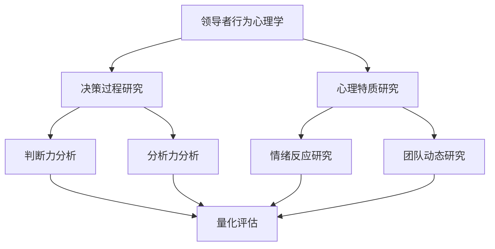

                 

## 文章标题

《领导力心法：成就一代领袖的领导力法则》

关键词：领导力、领导力法则、领袖、成就、领导力提升

摘要：本文旨在深入探讨领导力的本质及其在现代社会中的重要性，通过一系列具体的领导力法则，帮助读者理解并掌握成为一代领袖的关键技巧。文章将分为四个主要部分，首先介绍领导力的定义、历史和发展，接着详细分析各种领导力法则，最后提供实践中的提升策略和跨文化管理的应用。通过一步步的思考和推理，本文希望能够为读者提供一条清晰、实用的领导力成长之路。

### 目录大纲设计思路

在设计《领导力心法：成就一代领袖的领导力法则》的目录大纲时，我们首先明确了书的核心主题和目标读者。核心主题围绕领导力的本质和法则，目标读者则是希望提升自身领导能力的管理者、企业主以及对领导力有兴趣的读者。

#### 整体框架规划

整个书的框架分为四个部分，每部分对应不同的核心内容：

1. **领导力的本质与背景**：介绍领导力的定义、历史和发展，帮助读者建立对领导力的基本理解。
2. **领导力法则**：深入探讨各种领导力法则，如愿景领导力、变革领导力和赋能领导力，通过具体案例和策略来展示这些法则的应用。
3. **领导力提升**：提供提升领导力的策略和技巧，包括自我认知、持续学习和实战技巧等。
4. **领导力实践**：讨论领导力在危机管理和跨文化管理中的应用，结合实际案例进行详细分析。

#### 背景介绍

在书的开始部分，我们设置了一个引言和背景介绍章节。这一部分的主要目的是介绍领导力的背景和现状，包括领导力的定义、类型、要素等，并使用图表和图解来展示概念之间的联系。通过这部分内容，读者可以初步了解领导力的基础知识和重要性。

#### 核心概念与联系

接下来，我们设计了一个章节专门介绍领导力的核心概念，包括自我认知、情绪管理、决策能力、沟通技巧等。这一部分的内容将通过定义、属性特征对比表格和ER实体关系图架构的Mermaid流程图来展示概念之间的联系，帮助读者深入理解领导力的构成。

#### 领导力法则

主体部分将分为多个章节，每个章节深入探讨一种或多种领导力法则。这些法则包括愿景领导力、变革领导力和赋能领导力等。每个章节都将详细阐述法则的定义、实践方法和实际案例分析，通过具体案例和策略来展示这些法则的应用。

#### 实战技巧与工具

在领导力法则讲解后，我们加入了一个章节专门介绍提升领导力的实战技巧和工具，包括沟通技巧、团队建设、目标设定等。这一部分的内容将通过具体案例和实战技巧来帮助读者在实际工作中应用领导力法则。

#### 反思与总结

最后，我们设置了一个反思与总结章节，让读者回顾书中的重点，并结合个人情况思考如何应用所学。这一部分的内容将通过总结和反思来帮助读者巩固所学，并为未来的领导力提升提供方向。

### 目录大纲具体设计

**# 第一部分：领导力的本质与背景**

## 第1章：领导力的概念与历史

### 1.1 领导力的定义与特征

领导力是一种引导和影响他人共同实现目标的能力。它不仅仅是管理技能的集合，更是一种内心的力量，体现在领导者如何激发团队成员的潜能，创造积极的工作环境。

#### 领导力的特征：

- **影响力**：领导者通过影响力来推动团队行动，而不仅仅是依靠权威或命令。
- **适应性**：领导者需要能够适应不同的情况和环境，灵活调整领导风格。
- **沟通能力**：良好的沟通能力是领导者的重要特质，它能够确保信息的准确传达和团队的凝聚力。
- **决策力**：领导者需要能够做出明智的决策，并在关键时刻保持冷静和果断。

### 1.2 领导力的发展历程

领导力的发展历程可以追溯到古代，但现代领导力观念的形成主要在20世纪。以下是领导力理论的重要演变：

- **传统领导力**：基于权威和命令式的领导方式，强调领导者的权威和控制。
- **现代领导力**：强调领导者的影响力、沟通能力和团队建设能力，更加注重领导者的个人特质和团队互动。
- **情境领导力**：认为领导风格应该根据不同情境和团队成员的特点进行调整。

### 1.3 领导力在当代的重要性

在当代社会，领导力的重要性体现在以下几个方面：

- **组织发展的需要**：领导力是推动组织发展的重要动力，一个优秀的领导者能够带领团队实现更高的目标。
- **社会变革的影响**：社会变革要求领导者具备更强的创新能力和适应性，以应对快速变化的环境。
- **全球化背景下的角色**：全球化使得领导者需要具备跨文化沟通和管理能力，以在全球市场中取得成功。

**# 第二部分：领导力的核心概念**

## 第2章：领导力的核心概念

领导力的核心概念是理解领导力的基础，它涵盖了自我认知、情绪管理、决策能力、沟通技巧等多个方面。以下是对这些核心概念的详细讨论：

### 2.1 领导力的要素

领导力的要素是指构成领导力的关键因素，它们相互作用，共同影响领导效果。以下是几个关键要素：

- **自我认知**：自我认知是指领导者对自己内在特质和外部行为的认识。通过自我反思，领导者可以更好地了解自己的优势和不足，从而进行有效的自我提升。

- **情绪管理**：情绪管理是指领导者控制和调节自己情绪的能力。有效的情绪管理能够帮助领导者保持冷静和理性，在面对压力和挑战时做出明智的决策。

- **决策能力**：决策能力是领导者的一项核心技能，它涉及判断力、分析力和决策的效率。一个优秀的领导者能够在复杂的环境中迅速做出正确的决策。

- **沟通技巧**：沟通技巧是领导者与团队成员、利益相关者有效沟通的能力。良好的沟通技巧能够提高团队凝聚力，促进信息共享和协作。

### 2.2 领导力类型

领导力类型是指根据领导者的风格和行为方式，对领导力进行的分类。以下是几种常见的领导力类型：

- **权威型领导**：权威型领导者依靠职位权力来指挥和监督团队成员。他们通常具有明确的指令和严格的规章制度。

- **参与型领导**：参与型领导者鼓励团队成员参与决策过程，尊重他们的意见和贡献。这种领导方式能够增强团队凝聚力和创新能力。

- **情境型领导**：情境型领导者根据不同的情况和团队成员的特点，灵活调整领导风格。他们能够识别团队成员的不同需求，并采取相应的领导策略。

### 2.3 领导力与心理学的关系

心理学在领导力研究中的应用十分广泛，它帮助我们理解领导者的行为和团队成员的反应。以下是心理学对领导力的影响：

- **领导者的行为心理学**：研究领导者的行为模式、决策过程和心理特质，为领导者提供自我提升的参考。

- **团队成员的心理反应**：研究团队成员对领导者行为和领导风格的反应，帮助领导者更好地理解团队动态。

- **领导力评估和心理测量**：通过心理测量工具和评估方法，对领导者的能力进行量化评估，以便进行针对性的培训和提升。

### 2.4 领导力的要素与类型对比

下表对比了领导力的几个核心要素和类型的特点，帮助读者更好地理解它们之间的关系：

| 要素/类型 | 权威型领导 | 参与型领导 | 情境型领导 |
| -------- | ---------- | ---------- | ---------- |
| 自我认知 | 高度依赖权威 | 强调自我反思 | 根据情境调整 |
| 情绪管理 | 强调控制情绪 | 关注情绪互动 | 根据情境调节 |
| 决策能力 | 快速决策 | 慎重决策 | 情境决策 |
| 沟通技巧 | 直接沟通 | 沟通互动 | 适应沟通 |

### 2.5 领导力与心理学关系的Mermaid流程图

以下是一个Mermaid流程图，展示了领导力与心理学的关系：

通过这个流程图，我们可以看到心理学在领导力研究中的多层次应用，从领导者行为和决策到团队成员的反应和团队动态，心理学为我们提供了一个全面的分析框架。

### 2.6 领导力核心概念的总结

领导力的核心概念不仅仅是几个要素的简单组合，而是相互关联、共同作用的一个整体。通过自我认知、情绪管理、决策能力和沟通技巧等要素，领导者能够在不同的情境下灵活运用不同的领导力类型，实现团队的目标。

- **自我认知**是领导力的基石，它帮助领导者了解自己的内在特质和外在行为，从而更好地发挥领导力。

- **情绪管理**是领导力的关键，它帮助领导者保持冷静和理性，在面对压力和挑战时做出明智的决策。

- **决策能力**是领导力的核心，它决定领导者在复杂环境中能否迅速做出正确的决策。

- **沟通技巧**是领导力的桥梁，它帮助领导者与团队成员建立有效的沟通，促进信息共享和协作。

通过深入理解这些核心概念，读者可以更好地掌握领导力的本质，并在实践中不断提升自己的领导能力。

## 第3章：愿景领导力

### 3.1 愿景的重要性

愿景是领导力的核心要素之一，它为团队和组织提供了明确的方向和目标。一个清晰的愿景不仅能够激发团队成员的积极性，还能在不确定和复杂的环境中为团队提供指引。

#### 愿景的定义

愿景（Vision）是指一个组织或团队期望在将来实现的长远目标。它不仅仅是一个目标，更是一个富有激励性的愿景，能够激发团队成员的热情和创造力。

#### 愿景的作用

- **指导方向**：愿景为团队和组织指明了发展的方向，使团队成员能够明确自己的工作目标。
- **激励人心**：一个具有吸引力的愿景能够激发团队成员的内在动机，提高工作热情和创造力。
- **凝聚团队**：愿景是团队成员共同追求的目标，能够增强团队的凝聚力和归属感。
- **适应变革**：愿景为团队和组织提供了适应环境变化的灵活性，使团队能够在面对挑战时保持稳定和持续发展。

#### 如何构建有吸引力的愿景

构建一个有吸引力的愿景需要以下几个步骤：

- **明确目标**：首先需要明确团队和组织期望达到的长期目标，这个目标应该是具体、可衡量和具有挑战性的。
- **广泛参与**：愿景的构建需要广泛参与，通过团队讨论和意见征集，确保愿景能够代表团队的利益和期望。
- **明确传达**：愿景需要通过明确的语言和图像传达给团队成员，使他们能够理解和认同这个愿景。
- **持续更新**：愿景需要随着环境的变化和组织的发展进行更新和调整，确保其始终保持相关性和吸引力。

### 3.2 愿景领导力的实践

愿景领导力（Visionary Leadership）是一种通过明确愿景来激励和引导团队成员的领导方式。以下是一些愿景领导力的实践方法：

#### 倾听与共识

- **倾听**：领导者需要倾听团队成员的意见和需求，通过了解他们的期望和想法来构建更具有吸引力的愿景。
- **共识**：在愿景构建过程中，领导者需要与团队成员达成共识，确保愿景能够代表团队的整体利益。

#### 目标设定与时间规划

- **目标设定**：领导者需要将愿景分解为具体的目标和里程碑，为团队成员提供明确的工作目标。
- **时间规划**：为每个目标设定明确的时间节点，确保团队能够按计划推进愿景的实现。

#### 资源配置与优先级

- **资源配置**：领导者需要合理分配资源，确保团队能够有足够的资源来实现愿景。
- **优先级**：领导者需要明确团队工作的优先级，确保团队能够集中精力完成最重要的任务。

### 3.3 愿景领导力的案例分析

#### 企业成功案例：苹果公司

苹果公司（Apple Inc.）的创始人史蒂夫·乔布斯（Steve Jobs）是一位典型的愿景领导者。他的愿景是将创新科技融入人们的生活，使科技产品更加易用和美观。以下是苹果公司愿景领导力的几个成功要素：

- **明确愿景**：乔布斯在苹果公司早期就明确了“为消费者提供最好的产品和服务”的愿景，这个愿景成为了公司发展的方向和动力。
- **广泛参与**：乔布斯通过团队讨论和市场调研，确保愿景能够代表团队和市场利益。
- **持续更新**：随着科技和市场环境的变化，乔布斯不断更新苹果的愿景，使公司始终保持创新和竞争力。

#### 个人领导力成长案例：约翰·F·肯尼迪

美国总统约翰·F·肯尼迪（John F. Kennedy）也是一位著名的愿景领导者。他在任期内提出了“登月计划”，这个愿景不仅激发了整个国家的创新热情，也提升了美国在全球的领导地位。以下是肯尼迪愿景领导力的几个成功要素：

- **激励人心**：肯尼迪通过演讲和宣传，将“登月计划”塑造成一个富有激励性的愿景，激发了全民的参与热情。
- **时间规划**：肯尼迪为“登月计划”设定了明确的时间节点，使整个国家能够按计划推进这个宏伟的目标。
- **资源配置**：肯尼迪通过调整国家资源，确保“登月计划”能够获得足够的支持和资源。

### 3.4 愿景领导力的挑战与应对

尽管愿景领导力具有强大的激励作用，但在实践中也会面临一些挑战：

#### 挑战一：愿景模糊

- **应对策略**：领导者需要通过明确的沟通和图解，确保愿景的清晰性和可理解性。

#### 挑战二：资源不足

- **应对策略**：领导者需要合理规划和分配资源，确保团队能够有足够的资源来实现愿景。

#### 挑战三：团队分歧

- **应对策略**：领导者需要通过有效的沟通和共识构建，确保团队成员能够共同支持愿景。

### 3.5 愿景领导力的总结

愿景领导力是一种通过明确和传达愿景来激励和引导团队成员的领导方式。它不仅为团队和组织提供了明确的方向，还能激发团队成员的内在动机和创造力。通过倾听与共识、目标设定与时间规划、资源配置与优先级等实践方法，领导者能够实现愿景的落地和成功。同时，通过案例分析，我们可以看到愿景领导力在不同领域和情境中的应用和效果。

## 第4章：变革领导力

### 4.1 变革的必要性

在当今快速变化的世界，企业和社会组织都需要具备强大的变革能力，以应对外部环境的变化和内部发展的需求。变革领导力因此成为领导者的一项关键技能。以下讨论变革的必要性、原因和影响。

#### 变革的必要性

变革（Change）是组织持续发展的重要推动力。以下是变革必要性的几个关键点：

- **适应外部环境**：随着全球经济、技术和社会的快速发展，企业必须适应新的环境和趋势，否则将面临被淘汰的风险。
- **提升竞争力**：通过变革，企业可以优化内部流程、提升产品和服务质量，从而在竞争激烈的市场中保持优势。
- **创新驱动**：变革鼓励创新思维和新的业务模式，推动企业持续发展和成长。
- **组织发展**：变革有助于组织适应新的发展需求，提升组织整体效能和员工满意度。

#### 变革的原因

企业进行变革的主要原因包括以下几个方面：

- **市场变化**：市场环境的变化，如客户需求、竞争对手策略和技术革新，迫使企业进行变革以保持竞争力。
- **技术进步**：新技术的应用，如云计算、大数据和人工智能，为企业提供了新的发展机遇，同时也带来了变革的需求。
- **组织成长**：随着企业规模的扩大，组织结构和流程也需要相应调整，以适应新的发展需求。
- **政策法规**：政策和法规的变化，如税收政策、劳动法规和环保要求，也要求企业进行变革。

#### 变革的影响

变革对组织的影响是多方面的，以下是一些主要的影响：

- **文化变革**：变革往往会带来组织文化的变化，新的文化价值观和行为规范需要被建立和推广。
- **员工态度**：变革可能会引起员工的焦虑和抵触情绪，需要通过有效的沟通和培训来缓解。
- **业务流程**：变革可能导致业务流程的重新设计，优化和自动化，以提高效率和降低成本。
- **组织结构**：变革可能会影响组织的结构，包括部门调整、岗位职责变化和权力分配等。

### 4.2 变革领导力的策略

变革领导力（Change Leadership）是指领导者通过引导和推动变革来实现组织目标的能力。以下是一些关键的变革领导力策略：

#### 领导层共识

- **明确变革目标**：领导者需要与高层团队达成共识，明确变革的目标和预期成果，确保全体领导者的目标一致。
- **沟通与共识构建**：通过定期的会议、讨论和培训，确保团队成员了解变革的必要性和目标，从而达成共识。

#### 员工参与

- **鼓励员工参与**：领导者需要鼓励员工参与变革过程，包括提出建议、参与讨论和制定实施方案。
- **建立支持机制**：为员工提供必要的培训和支持，帮助他们在变革中成长和适应。

#### 文化变革

- **塑造新文化**：领导者需要塑造新的组织文化，包括价值观、行为规范和工作方式，以支持变革的实施。
- **文化传递**：通过领导者的言行和组织的各种活动，传递新的文化价值观和行为规范。

### 4.3 案例分析

#### 成功变革案例：丰田汽车

丰田汽车（Toyota）在20世纪80年代面临巨大的竞争压力，为了提升竞争力，公司实施了一系列变革措施。以下是丰田汽车变革领导力的几个成功要素：

- **领导层共识**：丰田的领导者与高层团队达成共识，明确了提升生产效率和质量的目标。
- **员工参与**：丰田鼓励员工参与变革，通过实施“员工提案制度”，激发员工的创新热情和参与感。
- **文化变革**：丰田塑造了以“精益生产”为核心的新文化，通过不断优化流程和提高效率，实现了生产效率的显著提升。

#### 失败变革案例：柯达公司

柯达公司（Kodak）曾是摄影行业的领导者，但在面对数字摄影的变革时，公司未能及时进行有效的变革，最终导致了失败。以下是柯达公司变革领导力的几个失败要素：

- **领导层分歧**：柯达的高层领导在变革方向上存在分歧，导致决策迟缓和行动不一致。
- **员工抵触**：由于缺乏有效的沟通和培训，员工对变革产生了抵触情绪，影响了变革的推进。
- **文化滞后**：柯达的文化滞后于市场变化，未能及时适应新的业务模式和技术进步。

### 4.4 变革领导力的挑战与应对

尽管变革领导力具有强大的推动力，但在实际操作中也会面临一些挑战。以下是一些常见的挑战及其应对策略：

#### 挑战一：领导层分歧

- **应对策略**：通过建立共识和加强沟通，确保领导层在变革方向上的一致性。

#### 挑战二：员工抵触

- **应对策略**：通过有效的沟通、培训和激励，缓解员工的抵触情绪，增强他们的参与感和归属感。

#### 挑战三：资源不足

- **应对策略**：通过合理规划和优化资源配置，确保变革的顺利推进。

#### 挑战四：文化滞后

- **应对策略**：通过文化变革和价值观塑造，推动组织文化的更新和适应。

### 4.5 变革领导力的总结

变革领导力是领导者面对外部环境和内部需求变化时的重要能力。通过领导层共识、员工参与和文化变革等策略，领导者能够有效推动变革，实现组织的持续发展。同时，通过成功和失败案例的分析，我们可以看到变革领导力在不同情境中的应用和效果。领导者需要不断学习和实践，提升自己的变革领导力，以应对不断变化的环境和挑战。

## 第5章：赋能领导力

### 5.1 赋能的含义

赋能领导力（Empowering Leadership）是一种通过授权和激励，赋予团队成员自主权和成长机会的领导方式。这种领导方式强调领导者不仅仅是任务的分配者和监督者，更是团队成员的支持者和激励者。

#### 赋能的定义

赋能（Empowerment）是指领导者通过授权和资源支持，使团队成员能够自主决策和完成任务的过程。它不仅仅是赋予团队成员权力，更重要的是赋予他们信心和能力，使他们在工作中能够发挥最大潜力。

#### 赋能的优势

赋能领导力具有以下几个优势：

- **提高员工满意度**：赋能使员工感受到信任和尊重，从而提高他们的工作满意度和忠诚度。
- **增强创新能力**：赋予团队成员自主权和创新空间，可以激发他们的创造力和创新能力。
- **提升团队绩效**：通过自主决策和团队合作，团队能够更高效地完成任务，提升整体绩效。
- **建立高效团队**：赋能领导力能够促进团队成员之间的沟通和合作，建立高效的团队关系。

#### 赋能的挑战

尽管赋能领导力具有显著的优势，但在实际应用中也存在一些挑战：

- **管理控制问题**：领导者需要平衡授权与控制，确保团队成员在自主决策的过程中不会失去方向和目标。
- **资源分配问题**：领导者需要合理分配资源和时间，确保每个团队成员都有足够的资源和支持来完成工作任务。
- **团队协调问题**：在赋能环境中，团队成员可能更倾向于独立工作，这可能导致团队协调和沟通的问题。

### 5.2 赋能领导力的实践

赋能领导力的实践包括以下几个关键步骤：

#### 激励与认可

- **激励**：领导者需要通过积极的反馈和奖励机制，激励团队成员在工作中表现出色。这可以通过奖金、晋升和表彰等方式实现。
- **认可**：领导者需要公开认可团队成员的贡献，使他们在工作中感受到成就感和认可。

#### 能力发展

- **培训**：领导者需要为团队成员提供培训机会，帮助他们提升技能和知识，以适应不断变化的工作需求。
- **成长计划**：制定个人成长计划，帮助团队成员设定职业发展目标，并提供相应的支持和资源。

#### 自我领导

- **信任**：领导者需要建立对团队成员的信任，使他们在工作中能够自主决策和承担责任。
- **授权**：领导者需要赋予团队成员足够的自主权和决策权，使他们能够在工作中发挥自己的才能。

### 5.3 案例分析

#### 高效团队案例：谷歌

谷歌（Google）以其独特的赋能领导力而闻名，这种领导方式在公司内部营造了一种创新和自由的工作环境。以下是谷歌赋能领导力的几个成功要素：

- **透明沟通**：谷歌的领导者通过透明的沟通渠道，使团队成员能够了解公司的战略目标和业务方向。
- **自主权**：谷歌鼓励员工自主工作，提供灵活的工作时间和地点，使员工能够根据自己的节奏完成任务。
- **创新支持**：谷歌为员工提供大量的资源和支持，鼓励他们进行创新和尝试，以推动公司的持续发展。

#### 赋能失败案例：某初创企业

某初创企业在尝试实施赋能领导力时遇到了一些挑战，导致团队效率和员工满意度下降。以下是该案例的几个失败要素：

- **授权过度**：领导者过度授权，导致团队成员在缺乏指导和监督的情况下迷失方向，工作效率下降。
- **缺乏资源**：尽管领导者鼓励员工自主工作，但公司未能提供足够的资源和支持，导致员工感到无助和困惑。
- **沟通不畅**：团队成员之间的沟通不畅，导致信息传递错误和工作冲突。

### 5.4 赋能领导力的挑战与应对

赋能领导力在实践中可能会面临一些挑战，以下是这些挑战及应对策略：

#### 挑战一：管理失控

- **应对策略**：领导者需要建立有效的监控和反馈机制，确保团队成员在自主决策的过程中不会偏离目标和方向。

#### 挑战二：资源不足

- **应对策略**：领导者需要合理规划和优化资源分配，确保团队成员有足够的资源和支持来完成工作任务。

#### 挑战三：团队协调问题

- **应对策略**：通过加强团队沟通和协作，建立有效的沟通渠道和协作工具，确保团队成员之间的信息传递和协作顺畅。

#### 挑战四：员工抵触

- **应对策略**：通过有效的沟通、培训和激励，缓解员工的抵触情绪，增强他们的参与感和归属感。

### 5.5 赋能领导力的总结

赋能领导力是一种通过授权、激励和能力发展，使团队成员能够自主决策和成长的新型领导方式。它能够提高员工满意度、增强创新能力和提升团队绩效。然而，在实际应用中，赋能领导力也面临一些挑战，如管理失控、资源不足和团队协调问题。通过有效的应对策略，领导者可以克服这些挑战，实现赋能领导力的成功应用。通过案例分析，我们可以看到赋能领导力在不同情境中的应用和效果，为领导者提供了宝贵的经验和启示。

## 第6章：领导力提升的策略

### 6.1 自我认知

自我认知是领导力提升的基础，它帮助领导者了解自己的内在特质、优点和不足。通过自我认知，领导者可以更好地发挥自身优势，改进不足，实现自我提升。

#### 自我评估工具

为了进行有效的自我认知，领导者可以使用以下几种自我评估工具：

- **360度反馈**：360度反馈是一种综合性的评估方法，通过收集来自团队成员、上级、同事和下属的反馈，全面了解自己的领导风格、行为和绩效。
- **MBTI（迈尔斯-布里格斯性格类型指标）**：MBTI是一种基于性格类型的评估工具，帮助领导者了解自己和他人的性格特点，从而更好地进行沟通和协作。
- **领导力问卷调查**：通过领导力问卷调查，领导者可以评估自己在领导力各个方面的表现，识别需要提升的领域。

#### 自我反思方法

自我反思是自我认知的关键步骤，以下是一些自我反思的方法：

- **日记记录**：定期记录自己在工作中的经历、感受和思考，通过反思日记，深入分析自己的行为和决策。
- **定期回顾**：在每周或每月的固定时间，回顾自己的工作表现，分析成功和失败的原因，总结经验教训。
- **导师辅导**：与经验丰富的导师进行定期对话，通过导师的指导和建议，深入了解自己的领导风格和能力。

### 6.2 持续学习

持续学习是领导力提升的重要途径，它帮助领导者不断更新知识和技能，适应不断变化的环境。

#### 学习资源

为了进行有效的持续学习，领导者可以利用以下几种学习资源：

- **在线课程**：通过在线学习平台，如Coursera、edX和Udemy，领导者可以学习各种领导力相关的课程和资源。
- **专业书籍**：阅读领导力相关的专业书籍，可以帮助领导者深入了解领导理论、实践和方法。
- **研讨会和讲座**：参加领导力相关的研讨会和讲座，可以与行业专家和同行交流，获取最新的领导力知识和实践经验。

#### 学习方法

以下是一些有效的学习方法：

- **深度学习**：通过深入阅读和思考，理解领导力的核心概念和原理，形成系统的知识体系。
- **实践应用**：将学到的知识和技能应用到实际工作中，通过实践检验和改进，提升自己的领导能力。
- **反思与总结**：在学习过程中，定期进行反思和总结，分析学习效果和不足，调整学习策略。

### 6.3 培训与发展

培训与发展是提升领导力的系统方法，通过有针对性的培训和职业发展计划，领导者可以不断提升自己的能力和素质。

#### 内部培训

内部培训是指企业在内部组织的一系列培训活动，旨在提升员工的领导能力和专业素养。以下是内部培训的几个关键点：

- **培训需求分析**：通过调查和分析，确定员工的培训需求，确保培训内容的针对性和有效性。
- **培训内容设计**：根据培训需求，设计有针对性的培训课程和内容，包括领导力理论、实践技巧和案例分析。
- **培训实施**：通过培训课程、研讨会和模拟演练等多种形式，确保培训内容的传授和员工的吸收。

#### 外部培训

外部培训是指企业组织员工参加外部的培训课程和活动，以获取专业知识和技能。以下是外部培训的几个关键点：

- **选择合适的培训机构**：选择具有良好声誉和优质课程的培训机构，确保培训的质量和效果。
- **参加行业会议**：通过参加行业会议和研讨会，与行业专家和同行交流，获取最新的行业动态和领导力实践。
- **外部导师辅导**：通过与外部导师的交流和辅导，获取专业的指导和建议，提升领导能力。

### 6.4 领导力提升的总结

领导力提升是一个持续的过程，它需要领导者通过自我认知、持续学习和培训与发展等多种方式，不断提升自己的能力和素质。通过自我评估工具和反思方法，领导者可以深入了解自己的内在特质和领导风格；通过持续学习和实践，领导者可以不断更新知识和技能，适应不断变化的环境；通过内部和外部培训，领导者可以系统地提升自己的领导能力和专业素养。通过这些策略，领导者可以逐步实现自我提升，成为更优秀的领导者。

## 第7章：沟通技巧

### 7.1 沟通的重要性

沟通（Communication）是领导力的核心要素之一，它不仅是领导者与团队成员、上级和利益相关者之间的重要桥梁，也是团队协作和决策的关键。有效的沟通能够确保信息的准确传递，提高工作效率，增强团队的凝聚力。

#### 沟通的定义

沟通是指信息的传递和理解过程，包括口头、书面和肢体语言等多种形式。有效的沟通不仅涉及信息的内容，还包括信息的传递方式、接收方式和反馈机制。

#### 沟通的目的

沟通的主要目的是：

- **信息传递**：确保信息能够准确、及时地传递到接收者。
- **共识建立**：通过沟通，使团队成员对目标、策略和行动计划达成共识。
- **问题解决**：通过沟通，团队成员可以共同探讨和解决工作中的问题和挑战。
- **关系建立**：良好的沟通能够建立信任和合作关系，增强团队的凝聚力。

#### 沟通的影响

有效的沟通对组织和个人都有深远的影响：

- **提高工作效率**：准确的沟通可以避免误解和重复工作，提高工作效率。
- **增强团队凝聚力**：通过沟通，团队成员能够更好地理解彼此的需求和期望，增强团队的凝聚力。
- **改善工作氛围**：良好的沟通可以减少冲突和误解，营造积极的工作氛围。
- **提升个人能力**：有效的沟通技巧可以帮助个人在职业发展中获得更多的机会和成功。

### 7.2 沟通技巧

为了实现有效的沟通，领导者需要掌握一系列的沟通技巧。以下是一些关键的沟通技巧：

#### 语言沟通

- **明确表达**：在沟通时，领导者需要清晰、准确地表达自己的观点和需求，避免使用模糊的措辞。
- **倾听**：有效的倾听是沟通的重要部分，领导者需要认真聆听对方的意见和需求，给予充分的理解和回应。
- **提问**：通过提问，领导者可以引导对话的方向，获取更多的信息，并确保双方对问题有共同的理解。

#### 非语言沟通

- **肢体语言**：肢体语言包括姿势、面部表情、眼神交流等，它们可以补充和强化语言表达，帮助传递更准确的信息。
- **面部表情**：积极的面部表情可以传达出友好和尊重，增强沟通的亲和力。
- **眼神交流**：适当的眼睛接触可以表示关注和尊重，有助于建立信任和合作关系。

#### 高效沟通策略

- **简洁明了**：避免使用过于复杂和冗长的语言，尽量用简单、直接的表达方式。
- **结构清晰**：在沟通过程中，领导者需要确保信息的结构清晰，逻辑性强，使接收者能够更容易理解和接受。
- **适时反馈**：在沟通过程中，领导者需要给予及时的反馈，确保信息的准确传递和理解。

### 7.3 案例分析

#### 成功沟通案例：微软公司

微软公司（Microsoft）以其卓越的沟通技巧而闻名，公司在内部和外部沟通中都取得了显著的成效。以下是微软成功沟通的几个关键要素：

- **透明沟通**：微软鼓励开放和透明的沟通文化，使员工能够自由地表达观点和意见。
- **多元沟通渠道**：微软提供了多种沟通渠道，如内部邮件、即时通讯、面对面会议等，确保信息能够及时传递。
- **领导者的示范作用**：微软的领导者以身作则，通过积极的沟通和互动，树立了良好的沟通榜样。

#### 沟通失败案例：某初创企业

某初创企业在发展中遇到了沟通障碍，导致项目进展缓慢，团队士气低落。以下是该案例中沟通失败的几个原因：

- **沟通不畅**：团队成员之间的沟通渠道不畅，信息传递存在障碍，导致误解和冲突。
- **缺乏反馈**：团队成员在沟通过程中缺乏及时的反馈，导致信息理解偏差和错误。
- **领导者的不作为**：领导者在沟通中未能发挥应有的作用，缺乏有效的引导和协调，导致沟通效率低下。

### 7.4 沟通技巧的总结

沟通技巧是领导者必须掌握的重要能力，它直接影响团队的工作效率和成员的满意度。有效的沟通能够确保信息的准确传递，建立共识，解决冲突，增强团队凝聚力。通过语言沟通、非语言沟通和高效沟通策略，领导者可以不断提升自己的沟通能力。同时，通过成功和失败案例的分析，我们可以看到沟通技巧在不同情境中的应用和效果，为领导者提供了宝贵的经验和启示。

## 第8章：领导力在危机管理中的应用

### 8.1 危机管理的原则

危机管理（Crisis Management）是领导力中至关重要的一环，它涉及到如何应对各种突发事件，确保组织在危机中保持稳定和持续发展。有效的危机管理需要遵循以下原则：

#### 快速响应

在危机发生的第一时间，领导者需要迅速做出反应，确保危机得到及时控制和处理。这包括：

- **立即启动危机响应机制**：建立一套完善的危机响应流程，确保在危机发生时，相关人员能够迅速行动，按照预案进行应对。
- **及时通报**：及时向内部和外部利益相关者通报危机情况，保持信息的透明度和公开性，减少恐慌和不确定性。

#### 全面沟通

危机管理离不开有效的沟通，领导者需要确保信息在组织内部和外部得到准确、及时地传递。具体措施包括：

- **内部沟通**：通过会议、内部邮件、即时通讯等方式，确保员工了解危机的实际情况和处理进展。
- **外部沟通**：与客户、供应商、合作伙伴和媒体等外部利益相关者保持沟通，及时回应他们的关切，维护组织形象。

#### 系统性解决

危机管理不是一次性的行动，而是一个系统性的解决过程。领导者需要从以下方面进行系统性解决：

- **问题诊断**：对危机的根源进行深入分析，找出问题的根本原因，制定针对性的解决方案。
- **资源整合**：整合内部和外部资源，包括人力资源、财务资源和合作伙伴，确保危机得到有效解决。
- **持续监控**：在危机解决过程中，持续监控危机的影响和解决方案的执行情况，及时调整和优化策略。

### 8.2 领导力在危机管理中的作用

领导力在危机管理中发挥着至关重要的作用，领导者需要通过以下方式发挥作用：

#### 领导力危机管理案例分析

#### 成功案例：亚马逊公司在2000年互联网泡沫破裂中的表现

在2000年互联网泡沫破裂期间，亚马逊公司（Amazon）面临巨大的财务压力和市场不确定性。然而，领导者杰夫·贝索斯（Jeff Bezos）通过卓越的领导力，成功引领公司渡过危机。以下是贝索斯在危机管理中发挥的关键作用：

- **决策果断**：贝索斯在危机中保持了冷静和果断，迅速做出战略调整，包括削减成本、优化库存和提高效率。
- **透明沟通**：贝索斯与全体员工保持透明沟通，公开分享公司的财务状况和战略调整，赢得了员工的信任和支持。
- **员工激励**：贝索斯通过激励员工，确保他们在危机中保持积极和专注，继续推动公司的发展。

#### 失败案例：通用电气公司在2019年能源危机中的表现

通用电气公司（General Electric，简称GE）在2019年遭遇了严重的能源危机，导致公司股价大幅下跌，市场份额下降。领导者约翰·弗兰纳里（John Flannery）在危机管理中的表现受到广泛质疑。以下是弗兰纳里在危机管理中的几个失败点：

- **决策犹豫**：弗兰纳里在面临关键决策时犹豫不决，导致公司错过了应对危机的最佳时机。
- **沟通不畅**：弗兰纳里与投资者、员工和媒体之间的沟通不畅，导致信息传递不准确，引发了市场恐慌。
- **内部矛盾**：公司内部管理层的分歧和矛盾，进一步加剧了危机的严重性。

### 8.3 领导力在危机中的提升

为了在危机中更好地发挥领导力，领导者需要不断提升自己的能力和素质，以下是一些提升策略：

#### 领导力危机管理技巧

- **危机预判**：通过风险管理和预测，提前识别潜在危机，制定应对预案。
- **决策能力**：提高快速决策的能力，确保在危机中能够做出正确的决策。
- **情绪管理**：学会在压力和紧张的环境中保持冷静和理性，做出明智的决策。
- **沟通技巧**：提升沟通技巧，确保信息在危机中得到准确、及时地传递。

#### 领导力危机后的反思与改进

危机过后，领导者需要进行反思和总结，从危机中吸取教训，改进领导力。以下是一些反思和改进的方法：

- **反思危机处理过程**：回顾危机处理的全过程，分析成功和失败的原因，总结经验教训。
- **调整管理策略**：根据危机中的表现和反馈，调整管理策略和方法，提高领导效果。
- **持续学习和提升**：通过培训、学习和实践，不断提升自身的领导能力和素质。

### 8.4 危机管理的总结

危机管理是领导力的重要组成部分，它涉及到如何快速响应、全面沟通和系统性解决危机。有效的危机管理能够帮助组织在危机中保持稳定和持续发展。通过领导力危机管理技巧和反思与改进，领导者可以不断提升自己的危机管理能力，为组织的发展提供坚实保障。同时，通过成功和失败案例的分析，我们可以看到危机管理在不同情境中的应用和效果，为领导者提供了宝贵的经验和启示。

## 第9章：领导力在跨文化管理中的应用

### 9.1 跨文化管理的挑战

跨文化管理（Cross-Cultural Management）是指企业在全球化背景下，如何有效地管理和协调不同文化背景的员工和利益相关者。在跨文化管理中，领导者面临以下几大挑战：

#### 文化差异

文化差异是跨文化管理中最显著的挑战之一。不同文化背景的员工在价值观、行为规范和工作方式上存在显著差异。例如，一些文化强调集体主义，重视团队合作和集体荣誉；而另一些文化则更倾向于个人主义，重视个人成就和自我实现。这些文化差异可能导致误解、冲突和效率低下。

#### 价值观冲突

价值观冲突是跨文化管理中的另一个重要挑战。不同文化背景的员工可能有不同的核心价值观，这些价值观可能在工作态度、工作方式和工作目标上产生冲突。例如，在一些文化中，守时和严格遵守规则是重要的价值观；而在另一些文化中，灵活性和适应性则更为重要。这些冲突可能导致员工之间的不和谐，影响团队合作和生产力。

#### 沟通障碍

跨文化管理中的沟通障碍主要体现在语言、非语言沟通和文化符号等方面。语言障碍是最直接的沟通障碍，不同语言的词汇、语法和表达方式可能导致误解和信息传递不准确。非语言沟通，如肢体语言、面部表情和眼神交流等，也可能因文化差异而引发误解。此外，文化符号和隐喻在不同文化中可能有不同的含义，这也可能成为沟通的障碍。

#### 管理方式差异

跨文化管理中的管理方式差异也是领导者面临的一大挑战。不同文化的管理方式可能存在显著差异，例如，一些文化更倾向于权威型管理，强调领导者的权威和控制；而另一些文化则更倾向于参与型管理，鼓励员工参与决策。这些管理方式的差异可能导致领导者在管理过程中面临挑战，需要灵活调整管理策略。

### 9.2 领导力在跨文化管理中的应用

为了有效应对跨文化管理的挑战，领导者需要掌握一系列跨文化管理策略和技巧，以下是一些关键的应用方法：

#### 文化敏感性培训

文化敏感性培训（Cultural Sensitivity Training）是提升跨文化管理能力的重要手段。通过文化敏感性培训，领导者可以了解不同文化的价值观、行为规范和工作方式，增强跨文化沟通和协作的能力。以下是一些常见的文化敏感性培训方法：

- **文化认知课程**：通过课程学习和案例分析，帮助领导者了解不同文化的特点，提高文化认知水平。
- **互动体验**：通过角色扮演、情景模拟和跨文化团队建设活动，让领导者亲身体验不同文化的差异，提高跨文化沟通和协作能力。
- **案例研究**：通过研究成功的跨文化管理案例，领导者可以学习如何在不同文化背景下实施有效的管理策略。

#### 沟通策略

有效的沟通策略是跨文化管理成功的关键。以下是一些关键的沟通策略：

- **明确表达**：在跨文化沟通中，领导者需要更加明确地表达自己的观点和需求，避免使用模糊或歧义的措辞。
- **倾听与理解**：领导者需要认真倾听对方的意见和需求，通过提问和反馈确保信息的准确传递和理解。
- **避免文化偏见**：领导者需要避免文化偏见，尊重和理解不同文化的行为规范和价值观，避免因文化差异而产生的误解和冲突。
- **建立共同语言**：通过建立共同的语言和符号系统，领导者可以减少跨文化沟通中的障碍，提高沟通效率。

#### 管理方式调整

为了应对跨文化管理的挑战，领导者需要灵活调整管理方式，以适应不同文化的需求。以下是一些常见的管理方式调整策略：

- **权威型与参与型相结合**：领导者可以在权威型管理的基础上，适当引入参与型管理的元素，鼓励员工参与决策和提供反馈，提高员工的参与感和满意度。
- **灵活的时间管理**：领导者需要灵活调整工作时间安排，尊重不同文化的作息习惯和时间观念。
- **文化包容性**：领导者需要营造一种包容性的文化氛围，尊重和保护不同文化的多样性和差异，促进跨文化的融合和协作。

### 9.3 跨文化管理的案例分析

#### 成功案例：谷歌在全球化背景下的跨文化管理

谷歌（Google）作为全球领先的技术公司，在全球化背景下取得了显著的跨文化管理成果。以下是谷歌成功跨文化管理的几个关键要素：

- **多元文化团队**：谷歌鼓励员工来自不同文化背景，建立多元文化团队，促进跨文化的交流和合作。
- **文化敏感性培训**：谷歌为员工提供文化敏感性培训，帮助员工了解不同文化的价值观和行为规范，提高跨文化沟通和协作能力。
- **透明沟通**：谷歌通过内部邮件、内部博客和团队会议等多种渠道，保持透明沟通，确保员工了解公司的战略和文化，增强员工的归属感和参与感。

#### 失败案例：某跨国公司的跨文化管理困境

某跨国公司在拓展海外市场时，由于缺乏有效的跨文化管理，导致项目失败，团队效率低下。以下是该案例中跨文化管理失败的几个原因：

- **文化偏见**：公司管理层对本地员工存在文化偏见，导致员工不满和抵触，影响团队合作和效率。
- **沟通不畅**：公司内部缺乏有效的沟通渠道，导致信息传递不准确，员工对公司的战略和文化缺乏理解。
- **管理方式不适应**：公司管理层采用的管理方式不适应本地文化，导致员工工作积极性低，团队凝聚力下降。

### 9.4 跨文化管理的总结

跨文化管理是全球化背景下领导者必须掌握的重要能力。通过文化敏感性培训、沟通策略和管理方式调整，领导者可以有效应对跨文化管理的挑战，促进跨文化的融合和协作。同时，通过成功和失败案例的分析，我们可以看到跨文化管理在不同情境中的应用和效果，为领导者提供了宝贵的经验和启示。领导者需要不断学习和实践，提升自己的跨文化管理能力，以在全球市场中取得成功。

### 全书总结

《领导力心法：成就一代领袖的领导力法则》通过对领导力的深入探讨，帮助读者理解领导力的本质和核心概念，掌握了愿景领导力、变革领导力、赋能领导力等关键法则，并提供了实践中的提升策略和跨文化管理的应用。全书结构紧凑，逻辑清晰，从理论到实践，从历史到当下，全面阐述了领导力的方方面面。

首先，书中通过定义和案例分析，介绍了领导力的基本概念和特征，帮助读者建立对领导力的基础理解。接着，详细探讨了领导力的核心概念，包括自我认知、情绪管理、决策能力和沟通技巧，使读者对领导力的构成有了深入的认识。

在核心法则部分，书中深入分析了愿景领导力、变革领导力和赋能领导力等关键法则，并通过实际案例展示了这些法则的应用。这些法则不仅是理论上的指导，更是实践中可行的策略，为领导者提供了具体的行动指南。

随后，书中提供了领导力提升的策略，包括自我认知、持续学习和培训与发展，帮助读者不断提升自己的领导能力。同时，通过沟通技巧的详细讲解，读者可以掌握有效的沟通方法，提升团队协作和效率。

最后，书中讨论了领导力在危机管理和跨文化管理中的应用，通过成功和失败案例的分析，提供了宝贵的经验和启示。这些内容不仅有助于读者理解领导力在不同情境下的应用，也为他们在实际工作中提供了实用的指导。

通过阅读本书，读者不仅能够深入理解领导力的本质，掌握关键法则和提升策略，还能提升自己的领导能力和实践能力，为成为一代领袖打下坚实的基础。希望本书能够成为读者领导力成长道路上的良师益友。

### 最佳实践 tips

为了将书中所学的领导力法则应用到实际工作中，以下是一些最佳实践建议：

1. **定期反思与自我评估**：每天或每周花时间反思自己的领导行为，识别优点和不足，制定改进计划。

2. **培养同理心**：努力理解团队成员的需求和期望，通过有效沟通和倾听，建立信任和合作关系。

3. **持续学习**：定期参加培训课程和阅读专业书籍，保持对最新领导力理论和实践的了解。

4. **制定明确目标**：为团队设定具体、可衡量和有挑战性的目标，确保每个人都清楚自己的职责和目标。

5. **激励与认可**：通过奖励和表彰来激励团队成员，增强他们的工作热情和积极性。

6. **跨文化沟通**：在全球化背景下，重视跨文化沟通，了解不同文化背景的团队成员，促进团队协作。

7. **危机管理**：制定危机应对预案，定期进行危机演练，确保在危机发生时能够迅速响应和有效处理。

通过这些最佳实践，读者可以不断提升自己的领导力，为团队和组织的发展提供有力支持。

### 小结

总结全书，我们可以看到领导力不仅是一种管理技能，更是一种内心的力量和综合素质的体现。通过本书，我们深入探讨了领导力的核心概念、关键法则和实践策略，帮助读者建立了对领导力的全面理解，并提供了具体的操作方法。

书中首先明确了领导力的定义和特征，通过历史和现代领导力理论的对比，展示了领导力的发展过程。接着，详细介绍了领导力的核心概念，如自我认知、情绪管理、决策能力和沟通技巧，帮助读者构建坚实的领导力基础。

在核心法则部分，我们探讨了愿景领导力、变革领导力和赋能领导力等关键法则，通过实际案例展示了这些法则的应用，为读者提供了实践中的指导。同时，书中还提供了领导力提升的策略，如自我认知、持续学习和培训与发展，帮助读者不断提升自己的领导能力。

此外，书中还讨论了领导力在不同情境下的应用，如危机管理和跨文化管理，通过成功和失败案例的分析，提供了宝贵的经验和启示。

通过本书，读者不仅可以深入理解领导力的本质，掌握关键法则和提升策略，还能提升自己的领导能力和实践能力，为成为一代领袖打下坚实的基础。希望本书能够成为读者领导力成长道路上的良师益友。

### 注意事项

在领导力实践过程中，以下注意事项对于确保领导力策略的有效实施至关重要：

1. **持续学习与适应**：领导力是一个不断发展的领域，领导者需要保持对最新理论和实践的敏感度，持续学习和适应环境变化。
2. **文化敏感性**：在跨文化管理中，领导者需要尊重和理解不同文化的价值观和行为规范，避免因文化差异而产生的误解和冲突。
3. **激励与认可**：激励和认可对于提升团队士气和员工积极性至关重要，领导者需要制定明确的激励策略，并定期进行认可和表彰。
4. **透明沟通**：领导者需要建立开放的沟通渠道，确保信息在组织内部和外部得到准确、及时地传递，避免信息不对称和误解。
5. **情感管理**：领导者需要具备良好的情感管理能力，特别是在面对团队冲突和危机时，保持冷静和理性，以实现有效的危机管理和团队凝聚。

通过关注这些注意事项，领导者可以更有效地应用所学的领导力法则，提升自身的领导能力，为团队和组织的发展提供有力支持。

### 拓展阅读

为了进一步深化对领导力的理解和应用，以下是几本推荐的专业书籍，以及相关的拓展资源：

1. **《领导力的五个层次》（The Five Levels of Leadership）** - 史蒂夫·柯维（Stephen R. Covey）
   - 推荐理由：本书详细阐述了领导力的五个层次，从个体自我领导到组织领导，为读者提供了全面的领导力发展路径。
   - 拓展资源：[史蒂夫·柯维官方网站](https://stephencovey.com/)

2. **《变革之舞》（The Dance of Change）** - 约翰·P·科特（John P. Kotter）
   - 推荐理由：本书通过详细的理论和实践案例，探讨了如何有效推动组织变革，为领导者提供了变革管理的具体策略。
   - 拓展资源：[约翰·P·科特官方网站](https://johnkpotters.org/)

3. **《赋能：开启人类最大潜能》（Exponential Organizations）** - 瑞恩·霍利迪（Ryan Holiday）
   - 推荐理由：本书探讨了如何通过赋能和激发团队成员的潜力，实现组织的快速成长和成功。
   - 拓展资源：[瑞恩·霍利迪官方网站](https://ryanholiday.net/)

4. **《非暴力沟通》（Nonviolent Communication）** - 马歇尔·卢森堡（Marshall B. Rosenberg）
   - 推荐理由：本书介绍了非暴力沟通的原理和技巧，帮助领导者提高沟通效果，建立积极的人际关系。
   - 拓展资源：[非暴力沟通国际中心](https://centerfornonviolentcommunication.org/)

通过阅读这些书籍和访问相关资源，读者可以进一步拓展对领导力的理解，提升自身的领导能力。

### 作者信息

作者：AI天才研究院/AI Genius Institute & 禅与计算机程序设计艺术 /Zen And The Art of Computer Programming

感谢您阅读《领导力心法：成就一代领袖的领导力法则》。希望这本书能够帮助您在领导力道路上取得显著进步。如果您有任何问题或建议，欢迎随时与我们联系。我们期待与您一起探讨领导力，共创美好未来。作者团队将不断努力，为您提供更多高质量的内容。再次感谢您的支持！

