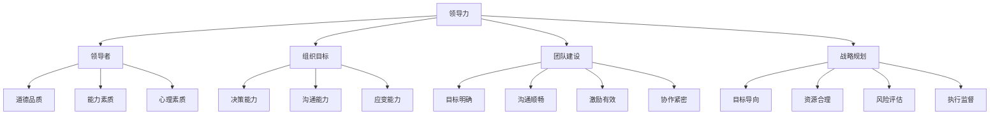

                 

# 领导力心经：成就一代伟人的领导力法则

> 关键词：领导力、伟人、领导力法则、管理、决策、团队建设

> 摘要：本文深入探讨领导力的本质、重要性以及领导者应具备的素质和风格。通过分析领导力的实战技巧、发展和提升方法，以及领导力在组织中的实践和未来趋势，为读者提供一部全面、系统的领导力指南。

## 目录

----------------------------------------------------------------

## 引言

### 领导力的重要性

在当今快速变化的社会环境中，领导力已经成为企业和个人成功的关键因素。一位优秀的领导者不仅能够激发团队的潜力，还能引领组织走向繁荣。然而，领导力的本质和重要性究竟是什么呢？本文将带领读者走进领导力的世界，逐步揭示其核心法则。

### 目标读者

本文旨在为以下读者提供指导：

1. 企业高层管理者
2. 领导力培训课程参与者
3. 对领导力感兴趣的读者

## 第1章：领导力的本质与重要性

### 1.1 领导力的定义

领导力是指领导者通过影响和激励他人，实现组织目标的能力。它不仅涉及到权力和权威，更重要的是影响力、信任和共鸣。

### 1.2 领导力的重要性

领导力对个人和组织发展具有重要的影响：

1. **个人层面**：领导力能够帮助个人提升自我认知、增强自信，并在职业生涯中取得更大的成就。
2. **组织层面**：领导力能够提升组织的竞争力、创造力和创新力，推动组织实现长期发展。

### 1.3 领导力对个人和组织发展的影响

领导力对个人和组织发展的影响主要体现在以下几个方面：

1. **决策能力**：领导者能够做出明智的决策，为组织指明方向。
2. **团队建设**：领导者能够建立高效的团队，激发团队成员的潜力。
3. **文化塑造**：领导者能够塑造积极向上的组织文化，提升组织的凝聚力和执行力。

## 第2章：领导者应具备的素质

### 2.1 道德品质

领导者应具备高尚的道德品质，包括诚实、正直、责任心和同理心。这些品质是赢得他人信任和尊重的基础。

### 2.2 能力素质

领导者应具备以下能力素质：

1. **沟通能力**：能够清晰、有效地表达自己的想法，并与他人建立良好的沟通。
2. **决策能力**：能够快速、准确地做出决策，并在决策过程中保持冷静和理性。
3. **应变能力**：能够灵活应对变化和挑战，调整策略以适应新环境。

### 2.3 心理素质

领导者应具备良好的心理素质，包括自信、坚韧、乐观和自律。这些素质有助于领导者面对压力和挑战，保持积极的心态。

## 第3章：领导力的风格与类型

### 3.1 领导力风格的特点

领导力风格可以分为以下几种：

1. **权威型**：领导者通过权力和权威来影响他人。
2. **民主型**：领导者尊重团队成员的意见，共同决策。
3. **参与型**：领导者鼓励团队成员参与决策，共同实现目标。

### 3.2 领导力风格的适用场景

不同的领导力风格适用于不同的场景：

1. **危机管理**：权威型领导力有助于迅速应对危机。
2. **创新驱动**：民主型领导力有助于激发团队的创造力和创新力。
3. **稳定发展**：参与型领导力有助于建立和谐的团队关系，推动组织稳定发展。

### 3.3 领导力风格的效果分析

领导力风格的效果取决于领导者的能力和团队的实际情况。合适的领导力风格能够提升团队绩效，激发员工潜力，推动组织发展。

## 第4章：领导力的实战技巧

### 4.1 沟通技巧

良好的沟通技巧是领导力的核心之一。领导者应具备以下沟通技巧：

1. **倾听**：倾听是沟通的关键，领导者要学会倾听他人的意见和需求。
2. **表达**：领导者要学会清晰、简洁地表达自己的观点和想法。
3. **反馈**：领导者要能够给予团队成员及时的反馈，帮助他们成长和改进。

### 4.2 决策技巧

领导者应具备以下决策技巧：

1. **信息收集**：领导者要在决策前收集全面、准确的信息。
2. **风险评估**：领导者要能够评估决策的风险和收益，做出明智的决策。
3. **执行监督**：领导者要确保决策得到有效执行，并对执行过程进行监督。

### 4.3 团队建设

团队建设是领导力的关键任务之一。领导者应具备以下团队建设技巧：

1. **明确目标**：领导者要明确团队的目标和任务，确保团队成员了解并致力于实现这些目标。
2. **激励员工**：领导者要能够激发员工的潜能，提升团队士气。
3. **培养团队文化**：领导者要培养积极向上的团队文化，提升团队的凝聚力和执行力。

## 第5章：领导力的发展与提升

### 5.1 自我发展

领导者要不断提升自我，包括以下方面：

1. **知识更新**：领导者要不断学习新知识，跟上行业发展的步伐。
2. **能力提升**：领导者要提升自己的能力，包括沟通、决策、领导等方面。
3. **心态调整**：领导者要调整自己的心态，保持积极向上的态度。

### 5.2 持续提升领导力

领导者要持续提升领导力，包括以下方面：

1. **定期反思**：领导者要定期反思自己的领导行为，总结经验教训。
2. **寻求反馈**：领导者要主动寻求他人的反馈，了解自己的优点和不足。
3. **实践锻炼**：领导者要通过实践锻炼自己的领导能力，不断提升自己的领导水平。

### 5.3 领导力提升的方法与工具

领导者可以通过以下方法和工具提升自己的领导力：

1. **领导力培训**：参加领导力培训，学习领导力的理论知识。
2. **阅读书籍**：阅读领导力相关的书籍，了解领导力的发展趋势和实践方法。
3. **实践经验**：通过实践经验，不断积累和提升自己的领导能力。

## 第6章：领导力在组织中的实践

### 6.1 组织文化

组织文化是领导力在组织中的实践基础。领导者要积极塑造组织文化，包括以下方面：

1. **价值观传递**：领导者要传递组织的核心价值观，让员工认同并践行。
2. **文化建设**：领导者要积极参与组织文化建设，营造积极向上的氛围。
3. **文化传承**：领导者要确保组织文化的传承和发展。

### 6.2 战略规划

领导者要制定和实施有效的战略规划，包括以下方面：

1. **目标设定**：领导者要明确组织的目标，并制定实现这些目标的策略。
2. **资源分配**：领导者要合理分配资源，确保组织目标的实现。
3. **执行监督**：领导者要确保战略规划得到有效执行，并对执行过程进行监督。

### 6.3 组织变革

领导者要积极推动组织变革，以适应外部环境和内部需求的变化。包括以下方面：

1. **变革策划**：领导者要制定变革方案，明确变革的目标、方法和步骤。
2. **变革实施**：领导者要确保变革方案得到有效实施，推动组织变革的落地。
3. **变革评估**：领导者要评估变革的效果，持续优化变革方案。

## 第7章：领导力的未来发展趋势

### 7.1 趋势分析

随着社会的进步和科技的发展，领导力也将面临新的挑战和机遇。以下是一些领导力的未来发展趋势：

1. **数字化转型**：领导者要适应数字化转型，提升组织的数字竞争力。
2. **全球视野**：领导者要具备全球视野，推动组织在全球范围内发展。
3. **可持续发展**：领导者要关注可持续发展，推动组织履行社会责任。

### 7.2 挑战与机遇

领导力在未来将面临以下挑战和机遇：

1. **变革**：领导者要应对组织内部的变革，推动组织发展。
2. **人才竞争**：领导者要吸引和保留优秀人才，提升组织的竞争力。
3. **社会责任**：领导者要关注社会责任，推动组织履行社会责任。

### 7.3 未来领导力的发展方向

未来领导力的发展方向将包括以下方面：

1. **创新**：领导者要推动组织创新，提升组织的创新能力和竞争力。
2. **协作**：领导者要促进团队协作，提升团队的执行力和创造力。
3. **智能化**：领导者要利用智能化工具提升领导效能，推动组织发展。

## 结论

领导力是个人和组织成功的关键因素。本文通过分析领导力的本质、重要性、领导者应具备的素质和风格，以及领导力的实战技巧、发展和提升方法，为读者提供了一部全面、系统的领导力指南。希望本文能够帮助读者深入了解领导力，提升自己的领导能力，实现个人和组织的共同发展。

### 作者信息

作者：AI天才研究院/AI Genius Institute & 禅与计算机程序设计艺术 /Zen And The Art of Computer Programming

----------------------------------------------------------------

## 第1章：领导力的本质与重要性

### 1.1 领导力的定义

领导力是指领导者通过影响和激励他人，实现组织目标的能力。它不仅涉及到权力和权威，更重要的是影响力、信任和共鸣。领导力是一种复杂的能力体系，它包括道德品质、能力素质、心理素质等多方面要素。

在组织中，领导力扮演着至关重要的角色。一个优秀的领导者能够激发团队的潜力，提升组织的绩效，实现组织的战略目标。领导力不仅是企业管理者的必备能力，也是每一个希望在职业生涯中取得成功的人所应具备的素质。

### 1.2 领导力的重要性

领导力对个人和组织发展具有重要的影响。以下是领导力在个人和组织层面的重要性：

**个人层面：**

1. **提升自我认知**：领导力要求领导者深入理解自己，包括自己的价值观、信念、优点和缺点。这种自我认知有助于个人在职业生涯中更好地发展自己。
   
2. **增强自信**：通过领导力的实践，领导者能够逐渐建立自信，面对挑战和困难时更加坚定。

3. **职业发展**：领导力是职业发展的关键因素，它有助于领导者获得更多的机会和资源，实现更高的职业目标。

**组织层面：**

1. **决策能力**：领导力能够帮助领导者做出明智的决策，为组织指明方向。

2. **团队建设**：领导力有助于建立高效的团队，提升团队的合作力和执行力。

3. **文化塑造**：领导力能够塑造积极向上的组织文化，提升组织的凝聚力和执行力。

4. **创新驱动**：领导力能够激发组织的创新能力和创造力，推动组织实现持续发展。

### 1.3 领导力对个人和组织发展的影响

领导力对个人和组织发展的影响是多方面的。以下是一些具体的影响：

**个人层面：**

1. **领导力的提升能够帮助个人更好地理解自己的优势和劣势，从而在职业生涯中做出更明智的选择。

2. **领导力的实践有助于个人培养沟通、决策、团队建设等关键技能，提升个人竞争力。

3. **领导力的锻炼能够增强个人的自信心和应变能力，使个人在面对压力和挑战时更加从容。

**组织层面：**

1. **领导力能够提升组织的决策效率，使组织能够迅速应对市场变化和竞争压力。

2. **领导力能够促进团队的协作和沟通，提升团队的执行力和创新力。

3. **领导力能够塑造积极向上的组织文化，提升员工的满意度和忠诚度。

4. **领导力能够推动组织的创新和发展，使组织在激烈的市场竞争中保持优势。

### 1.4 领导力的核心概念与联系

为了更好地理解领导力的核心概念，我们通过一个概念属性特征对比表格和ER实体关系图架构的Mermaid流程图来详细阐述。

#### 概念属性特征对比表格

| 概念 | 定义 | 特征 |
| :--: | :--: | :--: |
| 领导力 | 通过影响和激励他人实现组织目标的能力 | 影响力、信任、共鸣、道德品质、能力素质、心理素质 |
| 领导者 | 具备领导力的人 | 诚实、正直、责任心、同理心、沟通能力、决策能力、应变能力、心理素质 |
| 组织目标 | 组织期望实现的目标 | 明确、具体、可行、激励性 |
| 团队建设 | 建立高效团队的过程 | 目标明确、沟通顺畅、激励有效、协作紧密 |
| 战略规划 | 制定和实施组织发展战略的过程 | 目标导向、资源合理、风险评估、执行监督 |

#### ER实体关系图架构的Mermaid流程图

通过以上概念属性特征对比表格和ER实体关系图架构的Mermaid流程图，我们可以清晰地看到领导力的核心概念及其相互联系。这些核心概念是理解领导力本质和重要性的重要基础。

## 第2章：领导者应具备的素质

### 2.1 道德品质

道德品质是领导者的基石，是赢得他人信任和尊重的关键。以下是一些关键的道德品质：

1. **诚实**：诚实是领导者最基本的品质。领导者应该言行一致，保持诚信，树立良好的榜样。
2. **正直**：领导者应坚持正义，不畏权势，不谋私利，以正直的态度面对困难和挑战。
3. **责任心**：领导者应对组织和团队成员负责，勇于承担决策带来的后果，并努力实现组织目标。
4. **同理心**：领导者应具备同理心，能够理解和关心团队成员的需求和感受，建立良好的人际关系。

### 2.2 能力素质

领导者应具备以下能力素质，这些素质是领导者有效管理和领导团队的基础：

1. **沟通能力**：良好的沟通能力有助于领导者表达清晰、准确，同时也能够倾听和理解团队成员的意见和需求。
2. **决策能力**：领导者应具备快速、准确做出决策的能力，并能够在决策过程中保持客观和理性。
3. **应变能力**：在复杂多变的环境中，领导者应具备灵活应对变化和挑战的能力。
4. **团队建设能力**：领导者应能够激发团队的潜力，建立和谐、高效的团队氛围。
5. **激励能力**：领导者应能够激励团队成员，激发他们的积极性和创造力。

### 2.3 心理素质

领导者的心理素质直接影响到其领导效果。以下是一些关键的心理素质：

1. **自信**：自信是领导者应对挑战和压力的重要心理素质。领导者应相信自己的能力和决策。
2. **坚韧**：在困难和挫折面前，领导者应具备坚韧不拔的品质，不断努力直至成功。
3. **乐观**：领导者应保持乐观的心态，积极面对问题和挑战，传递正能量给团队成员。
4. **自律**：领导者应具备高度的自律能力，以身作则，遵守规则和纪律。

### 2.4 领导者素质的整合与评价

领导者的素质不是孤立存在的，而是相互联系、相互作用的。以下是一个领导者素质整合与评价的框架：

1. **道德品质**：道德品质是领导者素质的基础，决定领导者的可信度和公信力。
2. **能力素质**：能力素质是领导者有效执行领导职责的关键，包括沟通、决策、应变等能力。
3. **心理素质**：心理素质是领导者应对压力和挑战的心理准备，包括自信、坚韧、乐观、自律等品质。
4. **领导效果**：领导效果是领导者素质的最终体现，包括团队的绩效、团队的满意度、组织的整体发展等。

通过这个框架，领导者可以全面地评估自己的素质，发现自身的优势和不足，并制定相应的提升计划。

### 2.5 领导者素质的实际应用

在实际工作中，领导者素质的应用体现在以下几个方面：

1. **团队管理**：领导者应通过沟通、激励和团队建设能力，提升团队的绩效和凝聚力。
2. **决策制定**：领导者应通过决策能力，确保组织目标的实现，并在决策过程中保持客观和理性。
3. **危机应对**：领导者应通过应变能力和心理素质，迅速应对突发事件，减少负面影响。
4. **个人发展**：领导者应通过自我反思和提升，不断提升自己的领导能力，为组织发展贡献更多。

通过以上实际应用，领导者可以更好地发挥自己的素质优势，提升领导效果，推动组织发展。

### 2.6 领导者素质的持续发展

领导者的素质不是一成不变的，而是需要通过不断的学习和实践来持续发展的。以下是一些持续发展领导者素质的方法：

1. **持续学习**：领导者应不断学习新知识、新技能，保持自己的竞争力。
2. **经验积累**：领导者应通过实际工作经验，不断总结和反思，提升自己的领导能力。
3. **反馈与改进**：领导者应主动寻求他人的反馈，并根据反馈进行改进，提升自己的领导素质。
4. **心理调适**：领导者应学会心理调适，保持积极向上的心态，应对工作中的压力和挑战。

通过以上方法，领导者可以持续提升自己的素质，为组织发展提供更强大的动力。

## 第3章：领导力的风格与类型

### 3.1 领导力风格的特点

领导力风格是指领导者运用领导力方式的不同特点，包括领导者的行为、决策方式、沟通方式等。不同的领导力风格适用于不同的管理场景和团队环境。以下是几种常见的领导力风格及其特点：

1. **权威型领导力**：权威型领导力强调领导者的权力和权威，领导者做出决策，团队成员执行。这种风格在需要迅速决策和执行的任务中非常有效，但可能导致团队成员的参与度低。

2. **民主型领导力**：民主型领导力强调团队成员的参与和共同决策，领导者鼓励团队成员提出意见和建议。这种风格有助于提升团队的凝聚力和创造力，但决策过程可能较长。

3. **参与型领导力**：参与型领导力强调领导者与团队成员之间的互动和合作，领导者鼓励团队成员参与决策和任务执行。这种风格有助于建立信任和合作关系，但需要领导者有较强的协调和管理能力。

4. **变革型领导力**：变革型领导力强调领导者的愿景和影响力，领导者通过激励和榜样作用，推动团队实现变革。这种风格适用于组织变革和创新发展，但需要领导者有较强的创新能力和领导魅力。

### 3.2 领导力风格的适用场景

不同的领导力风格适用于不同的管理场景和团队环境。以下是几种常见场景和相应的领导力风格：

1. **危机管理**：在危机管理中，权威型领导力最为适用。领导者需要迅速做出决策，指挥团队应对危机。

2. **创新驱动**：在创新驱动场景中，民主型领导力较为有效。领导者鼓励团队成员提出创新想法，共同探索解决方案。

3. **团队协作**：在团队协作场景中，参与型领导力有助于建立信任和合作关系，提升团队协作效率。

4. **组织变革**：在组织变革中，变革型领导力能够推动团队适应变革，实现组织目标。

### 3.3 领导力风格的效果分析

领导力风格的效果取决于领导者的能力和团队的实际情况。以下是几种领导力风格的效果分析：

1. **权威型领导力**：权威型领导力在紧急情况下能够迅速决策，确保任务的完成。但长期使用可能导致团队成员的积极性下降，缺乏参与感。

2. **民主型领导力**：民主型领导力有助于提升团队的凝聚力和创造力，团队成员更有参与感和归属感。但决策过程可能较长，效率较低。

3. **参与型领导力**：参与型领导力能够建立信任和合作关系，团队成员更愿意为共同目标努力。但领导者需要较强的协调和管理能力，否则可能导致团队目标不明确。

4. **变革型领导力**：变革型领导力能够推动团队适应变革，实现组织目标。但需要领导者具备较强的创新能力和领导魅力，否则难以激发团队成员的变革动力。

### 3.4 领导力风格的适应与转变

领导者应根据不同的管理场景和团队环境，灵活调整自己的领导力风格。以下是一些适应和转变的方法：

1. **场景分析**：领导者应分析当前的管理场景和团队环境，确定最适合的领导力风格。

2. **能力提升**：领导者应不断提升自己的能力，包括沟通、决策、团队建设等，以便在不同场景中灵活应用。

3. **反馈与调整**：领导者应主动寻求团队成员的反馈，根据反馈调整自己的领导力风格，以提升领导效果。

4. **持续学习**：领导者应不断学习新的管理理论和实践，适应不断变化的管理环境。

通过以上方法，领导者可以更好地适应不同的领导力风格，提升领导效果，推动组织发展。

## 第4章：领导力的实战技巧

### 4.1 沟通技巧

沟通技巧是领导者的重要能力之一。有效的沟通可以增强团队凝聚力，提高工作效率，确保信息传递的准确性。以下是几个关键的沟通技巧：

1. **倾听**：倾听是沟通的关键。领导者要学会倾听团队成员的意见和建议，理解他们的需求和困惑。

2. **表达**：领导者应学会清晰、简洁地表达自己的观点和想法，确保团队成员能够准确理解。

3. **反馈**：领导者要能够给予团队成员及时的反馈，帮助他们改进工作，提升能力。

4. **非语言沟通**：领导者要学会运用肢体语言、面部表情等非语言手段，增强沟通效果。

### 4.2 决策技巧

决策技巧是领导者的重要素质之一。有效的决策可以确保组织目标的实现，提升团队士气。以下是几个关键的决策技巧：

1. **信息收集**：在决策前，领导者要收集全面、准确的信息，确保决策有据可依。

2. **风险评估**：领导者要能够评估决策的风险和收益，做出明智的决策。

3. **时间管理**：领导者要合理安排决策时间，确保决策过程的效率。

4. **团队参与**：领导者应鼓励团队成员参与决策，提升决策的公正性和接受度。

### 4.3 团队建设

团队建设是领导者的重要任务之一。一个高效的团队可以提升组织的整体绩效，实现组织目标。以下是几个关键的团队建设技巧：

1. **明确目标**：领导者要明确团队的目标和任务，确保团队成员了解并致力于实现这些目标。

2. **激励员工**：领导者要能够激发员工的潜能，提升团队士气。

3. **培养团队文化**：领导者要培养积极向上的团队文化，提升团队的凝聚力和执行力。

4. **协作与沟通**：领导者要促进团队成员之间的协作和沟通，确保团队工作的顺利进行。

### 4.4 应对挑战

在领导过程中，领导者难免会遇到各种挑战。有效的应对策略可以帮助领导者克服困难，提升领导效果。以下是几个应对挑战的策略：

1. **积极应对**：领导者要积极面对挑战，勇于承担责任，寻找解决方案。

2. **资源整合**：领导者要善于整合内外部资源，寻求支持，解决问题。

3. **团队协作**：领导者要鼓励团队成员共同应对挑战，发挥团队的力量。

4. **心理调适**：领导者要学会心理调适，保持积极向上的心态，应对工作中的压力和挑战。

### 4.5 实战案例分析

为了更好地理解这些实战技巧，我们通过一个实际案例来分析领导者的应对策略。

**案例背景**：某企业面临市场变化，需要快速调整产品策略，以应对竞争对手的挑战。

**领导者的决策过程**：

1. **信息收集**：领导者组织团队收集市场信息，了解竞争对手的产品策略和消费者需求。

2. **风险评估**：领导者评估调整产品策略的风险和收益，确保决策的合理性。

3. **团队参与**：领导者鼓励团队成员提出意见和建议，共同制定产品策略。

4. **决策实施**：领导者确保决策得到有效实施，监督团队成员的工作进度。

**领导效果**：通过有效的决策和团队建设，企业成功调整了产品策略，提升了市场竞争力。

通过这个案例，我们可以看到领导者如何运用沟通技巧、决策技巧和团队建设技巧，应对挑战，提升领导效果。

## 第5章：领导力的发展与提升

### 5.1 自我发展

领导者的发展是一个持续的过程，自我发展是提升领导力的重要途径。以下是几个自我发展的方法：

1. **学习与反思**：领导者要不断学习新知识、新技能，并反思自己的领导行为，发现不足，持续改进。

2. **实践经验**：领导者要通过实践锻炼自己的领导能力，积累经验，提升自己的领导素质。

3. **反馈与改进**：领导者要主动寻求他人的反馈，并根据反馈改进自己的领导行为，提升领导效果。

4. **心理调适**：领导者要学会心理调适，保持积极向上的心态，应对工作中的压力和挑战。

### 5.2 持续提升领导力

领导力的提升不是一蹴而就的，需要领导者持续努力和投入。以下是几个持续提升领导力的方法：

1. **参加培训**：领导者可以参加各种领导力培训课程，学习领导力的理论和实践方法。

2. **阅读书籍**：领导者可以阅读领导力相关的书籍，了解领导力的发展趋势和实践经验。

3. **实践锻炼**：领导者要在实际工作中不断实践和锻炼自己的领导能力，提升自己的领导水平。

4. **交流与分享**：领导者可以与其他领导者交流经验和心得，共同学习和进步。

### 5.3 领导力提升的方法与工具

以下是几种常用的领导力提升方法和工具：

1. **领导力模型**：领导者可以使用各种领导力模型，如赫塞模型、情境领导模型等，了解自己的领导风格，并优化领导行为。

2. **360度评估**：领导者可以通过360度评估了解自己在团队成员、上级和下属眼中的领导效果，发现自身的优势和不足，制定改进计划。

3. **领导力工作坊**：领导者可以参加领导力工作坊，通过角色扮演、案例分析等活动，提升领导力和沟通能力。

4. **教练辅导**：领导者可以寻求专业教练的辅导，帮助自己发现领导力提升的关键点，制定个性化的提升计划。

通过以上方法和工具，领导者可以持续提升自己的领导力，为组织发展贡献力量。

## 第6章：领导力在组织中的实践

### 6.1 组织文化

组织文化是领导力在组织中的实践基础。它是组织的灵魂，决定了组织的核心价值观和行为规范。以下是组织文化的几个关键要素：

1. **价值观**：组织价值观是组织文化的核心，它决定了组织的使命、愿景和目标。

2. **行为规范**：组织文化通过行为规范来约束和激励员工，确保员工在行为上符合组织的期望。

3. **团队氛围**：组织文化塑造了团队的工作氛围，影响着员工的工作态度和行为。

4. **沟通方式**：组织文化影响了组织内部的沟通方式，包括沟通频率、沟通风格等。

### 6.2 战略规划

战略规划是组织发展的重要手段。领导者在组织中的实践，很大程度上体现在战略规划的制定和实施上。以下是战略规划的几个关键要素：

1. **目标设定**：领导者要明确组织的目标，确保目标具有明确性、可行性和激励性。

2. **资源分配**：领导者要合理分配资源，确保组织目标的实现。

3. **风险评估**：领导者要评估战略规划的风险，制定相应的风险应对策略。

4. **执行监督**：领导者要确保战略规划得到有效执行，并对执行过程进行监督和评估。

### 6.3 领导力在组织管理中的应用

领导力在组织管理中的应用体现在多个方面，包括：

1. **团队建设**：领导者要培养积极向上的团队文化，提升团队的凝聚力和执行力。

2. **人才管理**：领导者要吸引、培养和保留优秀人才，提升组织的竞争力。

3. **激励与反馈**：领导者要建立有效的激励和反馈机制，激发员工的积极性和创造力。

4. **创新推动**：领导者要推动组织的创新，提升组织的创造力和竞争力。

### 6.4 领导力在组织变革中的应用

在组织变革中，领导力发挥着至关重要的作用。以下是领导力在组织变革中的应用：

1. **变革策划**：领导者要制定详细的变革方案，明确变革的目标、方法和步骤。

2. **变革实施**：领导者要确保变革方案得到有效实施，推动组织变革的落地。

3. **变革评估**：领导者要评估变革的效果，持续优化变革方案。

4. **员工沟通**：领导者要积极与员工沟通，解释变革的必要性和意义，缓解员工的抵触情绪。

### 6.5 领导力在组织中的效果评估

领导力在组织中的效果可以通过以下几个方面进行评估：

1. **组织绩效**：领导力对组织绩效的提升程度，可以通过关键绩效指标（KPI）来衡量。

2. **员工满意度**：领导力对员工满意度的提升程度，可以通过员工满意度调查来衡量。

3. **团队凝聚力**：领导力对团队凝聚力的提升程度，可以通过团队活动和员工互动来衡量。

4. **创新能力**：领导力对组织创新能力的提升程度，可以通过新产品开发、技术创新等来衡量。

通过以上评估，领导者可以了解自己在组织中的领导效果，发现自身的优势和不足，持续提升领导力。

## 第7章：领导力的未来发展趋势

### 7.1 趋势分析

随着科技的进步和社会的发展，领导力也将面临新的挑战和机遇。以下是领导力的未来发展趋势：

1. **数字化转型**：在数字化时代，领导者需要具备数字思维和数字化管理能力，以适应数字化工作方式。

2. **全球视野**：随着全球化的发展，领导者需要具备全球视野，能够理解和应对不同国家和地区的文化、经济环境。

3. **可持续发展**：领导者需要关注可持续发展，推动组织履行社会责任，实现经济、社会和环境的协调发展。

4. **智能化**：随着人工智能和大数据技术的发展，领导者需要运用智能化工具提升领导效能，实现高效决策和管理。

### 7.2 挑战与机遇

领导力在未来将面临以下挑战和机遇：

1. **变革**：领导者需要应对组织内部的变革，推动组织适应外部环境的变化。

2. **人才竞争**：领导者需要吸引和保留优秀人才，提升组织的竞争力。

3. **社会责任**：领导者需要关注社会责任，推动组织履行社会责任，实现可持续发展。

### 7.3 未来领导力的发展方向

未来领导力的发展方向将包括以下几个方面：

1. **创新**：领导者需要推动组织的创新，提升组织的创造力和竞争力。

2. **协作**：领导者需要促进团队协作，提升团队的执行力和创造力。

3. **智能化**：领导者需要运用智能化工具提升领导效能，实现高效决策和管理。

通过以上发展趋势、挑战与机遇以及未来领导力的发展方向，我们可以看到领导力在未来的重要性和发展方向。领导者需要不断提升自己的领导能力，适应未来的变化和挑战，为组织发展贡献力量。

## 结论

领导力是个人和组织成功的关键因素。通过本文的分析，我们可以看到领导力的本质、重要性、领导者应具备的素质和风格，以及领导力的实战技巧和发展趋势。希望本文能够为读者提供一部全面、系统的领导力指南，帮助读者提升自己的领导能力，实现个人和组织的共同发展。

### 作者信息

作者：AI天才研究院/AI Genius Institute & 禅与计算机程序设计艺术 /Zen And The Art of Computer Programming

通过本文的详细探讨，我们可以看到领导力不仅是一种技能，更是一种艺术。领导者需要不断学习、实践和反思，提升自己的领导能力，以应对快速变化的环境和挑战。让我们共同努力，成为卓越的领导者，为个人和组织创造更美好的未来。

