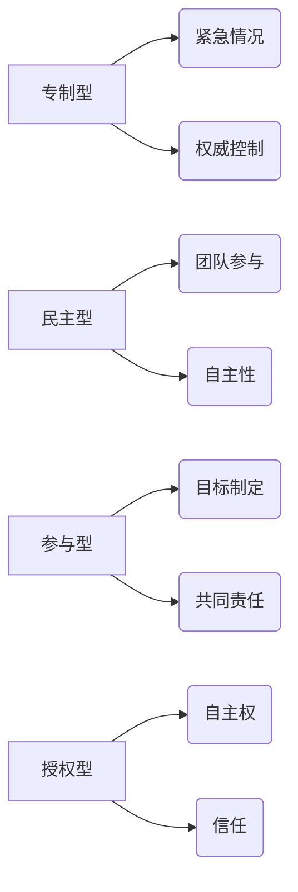
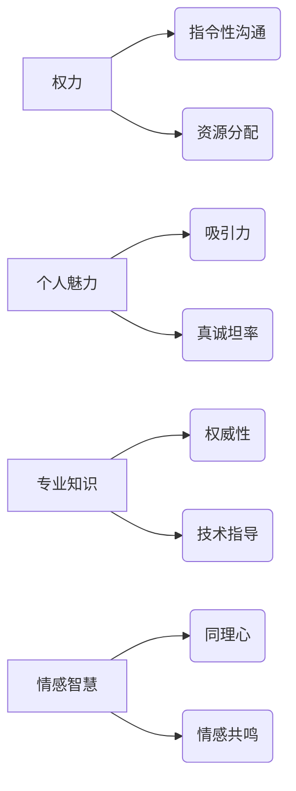
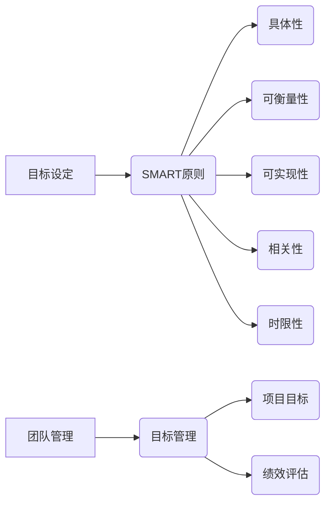
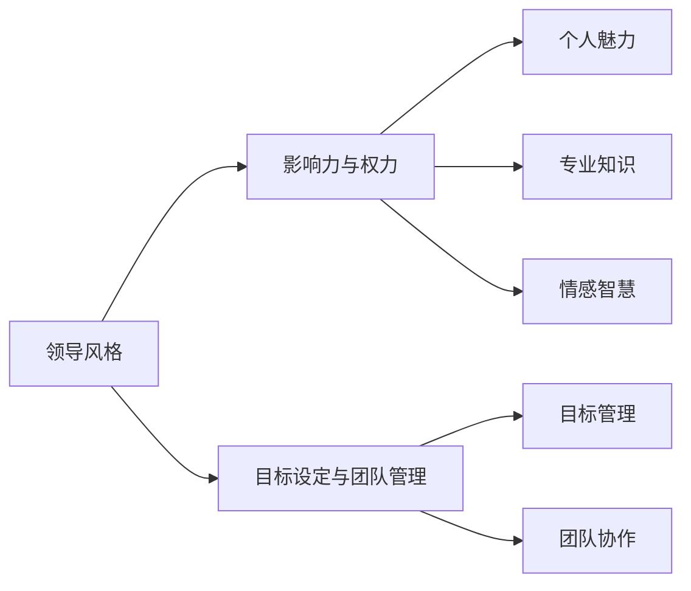

                 

## 领导力的进阶：从管理者到领导者的蜕变

### 关键词：领导力、管理者、领导者、变革、团队协作

### 摘要：

在快速变化的商业环境中，领导力已经成为企业和组织成功的关键因素。本文旨在探讨从管理者到领导者的蜕变，深入分析领导力的核心概念、提升路径和实践方法。通过系统的分析和详实的案例，本文为专业人士提供了切实可行的领导力提升策略，帮助他们在职业生涯中实现从管理者到领导者的成功转变。

## 目录大纲设计过程

在设计《领导力的进阶：从管理者到领导者的蜕变》的目录大纲时，我们需要首先理解书籍的主题和目标读者群体，确保大纲结构清晰、内容完整且具有逻辑性。以下是详细的目录大纲设计过程：

### 第一步：确定书籍主题和目标读者

- **书籍主题**：《领导力的进阶：从管理者到领导者的蜕变》。这本书主要探讨如何从管理者角色过渡到领导者角色，涉及领导力的核心概念、实践方法和提升路径。

- **目标读者**：企业中层管理者、未来希望提升领导力的专业人士以及希望深入理解领导力理论的学术研究者。

### 第二步：大纲结构设计

我们设计的大纲结构包含以下几个主要部分：

- **背景介绍**：介绍领导力的重要性和当前管理者面临的挑战。
- **核心概念与联系**：介绍领导力的核心概念，如领导风格、影响力、目标设定等，并使用表格和关系图展示各概念之间的联系。
- **算法原理讲解**：使用Mermaid画出领导力提升过程中的关键流程，并使用Python源代码和数学公式详细阐述。
- **系统分析与架构设计方案**：分析领导者应具备的技能和素质，设计领导力发展的系统和架构。
- **项目实战**：通过案例和实战，展示领导力提升的具体方法和实践。
- **最佳实践 Tips、小结、注意事项、拓展阅读**：总结书中的关键点，给出实践建议和后续学习的方向。

### 第三步：细化目录内容

- **第1章：引言——领导力的时代背景与个人成长需求**
  - **1.1** 领导力的时代背景
  - **1.2** 个人成长的需求与挑战
  - **1.3** 书籍结构概述与目标

- **第2章：领导力的核心概念**
  - **2.1** 领导风格与类型
    - **2.1.1** 领导风格的定义与分类
    - **2.1.2** 领导风格的影响与适应性
  - **2.2** 影响力与权力
    - **2.2.1** 影响力的来源与建立
    - **2.2.2** 权力的运用与限制
  - **2.3** 目标设定与团队管理
    - **2.3.1** 目标设定的SMART原则
    - **2.3.2** 团队管理的关键要素

- **第3章：领导力提升的路径与方法**
  - **3.1** 自我认知与成长
    - **3.1.1** 自我评估的工具与方法
    - **3.1.2** 自我提升的实践策略
  - **3.2** 沟通技巧与团队协作
    - **3.2.1** 高效沟通的技巧
    - **3.2.2** 团队协作的最佳实践
  - **3.3** 决策与问题解决
    - **3.3.1** 决策模型与策略
    - **3.3.2** 问题解决的步骤与方法

- **第4章：领导力在实践中的应用**
  - **4.1** 项目管理与团队领导
    - **4.1.1** 项目管理的核心要素
    - **4.1.2** 团队领导的关键技巧
  - **4.2** 创新与变革领导
    - **4.2.1** 创新的动力与障碍
    - **4.2.2** 变革领导的方法与挑战
  - **4.3** 持续学习与领导力发展
    - **4.3.1** 持续学习的途径
    - **4.3.2** 领导力发展的长期规划

- **第5章：领导力的挑战与应对**
  - **5.1** 领导者的角色冲突
    - **5.1.1** 角色冲突的来源与影响
    - **5.1.2** 解决角色冲突的策略
  - **5.2** 应对压力与挫折
    - **5.2.1** 压力与挫折的应对策略
    - **5.2.2** 心理素质的锻炼与提升
  - **5.3** 领导力的边界与局限性
    - **5.3.1** 领导力的边界
    - **5.3.2** 领导力的局限性与超越

- **第6章：领导力与组织文化**
  - **6.1** 组织文化的定义与类型
    - **6.1.1** 组织文化的概念与内涵
    - **6.1.2** 组织文化的类型与特征
  - **6.2** 领导力与组织文化的互动
    - **6.2.1** 领导力对组织文化的影响
    - **6.2.2** 组织文化对领导力的影响
  - **6.3** 建设积极组织文化的领导策略
    - **6.3.1** 建设积极组织文化的目标
    - **6.3.2** 建设积极组织文化的具体措施

- **第7章：领导力的未来趋势与发展方向**
  - **7.1** 数字化时代领导力的新特点

### 第1章：引言——领导力的时代背景与个人成长需求

#### 1.1 领导力的时代背景

在当今全球化和数字化浪潮下，企业面临着前所未有的挑战和机遇。市场的快速变化、技术的迅猛发展、消费者需求的多变，这些都要求企业领导者具备更高的领导力素质。领导力不仅仅是管理者的个人能力，更是企业持续竞争力的关键因素。

随着互联网和人工智能技术的普及，企业运营模式、商业模式和组织结构都发生了深刻变革。传统的层级管理方式已经无法适应快速变化的环境，领导者需要更加开放、灵活和创新的思维来引领团队。这种背景下，领导力的内涵和外延也在不断扩展，从传统的权力控制和管理转变为了激励和引导团队共同成长。

#### 1.2 个人成长的需求与挑战

在个人职业发展中，从管理者向领导者的转变是一个重要的里程碑。管理者主要负责任务的执行和团队的管理，而领导者则需要更多地关注愿景的制定、战略的规划和团队的发展。这种角色转变对个人的成长提出了更高的要求：

1. **自我认知**：领导者需要深入了解自己的价值观、优势和短板，具备自我反思和自我提升的能力。

2. **持续学习**：领导力的提升离不开不断学习和积累。领导者需要保持好奇心，主动学习新的知识和技能，以适应快速变化的商业环境。

3. **情感管理**：领导者需要具备良好的情感管理能力，能够理解和回应团队成员的情感需求，建立信任和积极的团队氛围。

4. **决策能力**：领导者需要具备快速决策和应对复杂问题的能力，能够在不确定性和压力下做出明智的决策。

#### 1.3 书籍结构概述与目标

本书旨在为那些希望提升领导力、实现角色转变的管理者提供系统的指导。本书的结构如下：

- **第1章：引言**：介绍领导力的时代背景和个人成长需求。

- **第2章：领导力的核心概念**：详细探讨领导风格、影响力、目标设定等核心概念，并分析它们之间的联系。

- **第3章：领导力提升的路径与方法**：介绍自我认知与成长、沟通技巧与团队协作、决策与问题解决等提升领导力的方法和路径。

- **第4章：领导力在实践中的应用**：通过项目管理、创新与变革领导、持续学习与领导力发展等实践案例，展示领导力的应用。

- **第5章：领导力的挑战与应对**：探讨领导者的角色冲突、压力与挫折、领导力的边界与局限性等问题。

- **第6章：领导力与组织文化**：分析领导力与组织文化的互动，探讨如何建设积极组织文化。

- **第7章：领导力的未来趋势与发展方向**：探讨数字化时代领导力的新特点和发展方向。

通过本书的阅读和实践，读者将能够深入理解领导力的本质，掌握提升领导力的方法和路径，从而实现从管理者到领导者的成功转变。

### 第2章：领导力的核心概念

领导力是一个复杂而多维的概念，它涵盖了多个核心要素，如领导风格、影响力、目标设定等。理解这些核心概念及其相互关系，是提升领导力的第一步。本章节将详细探讨这些核心概念，并通过表格和关系图展示它们之间的联系。

#### 2.1 领导风格与类型

领导风格是指领导者指导、激励和影响下属的方式。不同的领导风格适用于不同的情境和团队，因此了解和选择合适的领导风格对提升领导力至关重要。

| 领导风格类型 | 定义 | 适用情境 |
| :---: | :---: | :---: |
| **专制型** | 领导者决策果断，强调权威和控制 | 紧急情况或需要快速行动时 |
| **民主型** | 领导者鼓励团队参与决策，尊重团队成员的意见 | 团队成员具备较高专业素养和自主性时 |
| **参与型** | 领导者与团队成员共同制定目标，共同分担责任 | 需要团队成员高度参与和创新能力时 |
| **授权型** | 领导者赋予团队成员更多自主权，信任他们完成任务 | 高度信任和低风险环境下的团队 |

图1：领导风格类型关系图

#### 2.2 影响力与权力

影响力是指领导者通过个人魅力、专业知识、情感智慧等手段影响和激励团队成员的能力。权力是影响力的基础，但影响力不仅仅来源于权力，还包括个人魅力、专业知识、情感智慧等因素。

| 影响力来源 | 描述 | 具体表现 |
| :---: | :---: | :---: |
| **权力** | 基于职位和权威的正式影响力 | 指令性沟通、资源分配 |
| **个人魅力** | 基于个人品质和气质的吸引力 | 言行一致、真诚坦率 |
| **专业知识** | 基于专业知识和技能的权威性 | 技术指导、专业建议 |
| **情感智慧** | 基于理解和处理情感的能力 | 情感共鸣、同理心 |

图2：影响力与权力关系图

#### 2.3 目标设定与团队管理

目标设定是领导力的核心要素之一，它不仅关乎团队的工作效率，更关系到团队的长期发展。有效的目标设定需要遵循SMART原则，即目标应具备具体性、可衡量性、可实现性、相关性和时限性。

| SMART原则 | 含义 | 应用场景 |
| :---: | :---: | :---: |
| **具体性（Specific）** | 目标应明确、具体，避免模糊 | 项目目标、个人发展目标 |
| **可衡量性（Measurable）** | 目标应有明确的衡量标准 | 销售目标、绩效评估 |
| **可实现性（Achievable）** | 目标应具有挑战性，但应可实现 | 资源限制下的目标设定 |
| **相关性（Relevant）** | 目标应与团队整体目标一致 | 部门目标与公司战略 |
| **时限性（Time-bound）** | 目标应设定明确的完成时间 | 项目里程碑、季度目标 |

图3：目标设定与团队管理关系图

通过本章节的学习，读者将能够深入理解领导力的核心概念，掌握不同领导风格的特点和应用，理解影响力的来源和运用，以及如何有效设定和达成目标。这些核心概念将为读者后续的领导力提升和实践提供坚实的基础。

#### 2.4 领导力核心概念的综合分析与联系

在上一节中，我们分别探讨了领导风格、影响力与权力、目标设定与团队管理这三个核心概念。为了更全面地理解领导力的本质，我们需要将这些核心概念综合起来进行分析，并探讨它们之间的相互联系。

首先，领导风格是领导力的外在表现形式，不同的领导风格会影响领导者与团队成员之间的关系。例如，专制型的领导风格可能在紧急情况下能够迅速做出决策，但长期来看可能会抑制团队成员的主动性和创造力。而民主型和参与型的领导风格则更能激发团队成员的参与感和责任感，从而提高团队的协作效率和创新能力。

影响力与权力则是领导力的内在基础。一个领导者的影响力不仅取决于其职位和权力，更取决于其个人魅力、专业知识和情感智慧。个人魅力能够吸引和激励团队成员，专业知识和情感智慧则能够建立领导者的权威性和信任度。这些影响力来源共同作用，使得领导者能够在团队中发挥有效的影响力，推动团队达成目标。

目标设定与团队管理是领导力的具体应用。通过设定具体、可衡量、可实现、相关和时限性的目标，领导者能够为团队提供清晰的愿景和方向。这些目标不仅能够指导团队的工作，还能激励团队成员为实现目标而努力。同时，有效的团队管理能够确保目标的顺利实现，包括资源的合理分配、任务的明确分工、绩效的及时评估等。

图4展示了这些核心概念之间的相互关系：

通过综合分析这些核心概念，我们可以看到领导力是一个多维度的综合体，不仅包括领导风格、影响力与权力，还涉及目标设定和团队管理。领导者需要根据不同的情境和团队特点，灵活运用这些核心概念，以实现团队的目标和愿景。

综合这些核心概念，领导者可以采取以下策略：

1. **识别情境**：根据不同的工作环境和团队特点，选择合适的领导风格。
2. **提升自身素质**：通过学习和实践，提升个人魅力、专业知识和情感智慧，增强影响力。
3. **设定明确目标**：遵循SMART原则，设定具体、可衡量、可实现、相关和时限性的目标。
4. **有效管理团队**：通过目标管理和团队协作，确保目标的实现。

通过这些策略，领导者不仅能够提升自身的领导力，还能推动团队的发展和成功。综合分析这些核心概念，领导者可以更好地理解领导力的本质，从而在实际工作中更有效地发挥领导作用。

### 第3章：领导力提升的路径与方法

提升领导力并非一蹴而就的过程，它需要系统的规划和持续的努力。在这一章中，我们将探讨提升领导力的几个关键路径与方法，包括自我认知与成长、沟通技巧与团队协作、决策与问题解决。通过这些方法，领导者可以更好地实现个人与团队的成长。

#### 3.1 自我认知与成长

自我认知是提升领导力的基础。一个有效的领导者需要深入了解自己的价值观、优势和短板，并通过不断的反思和自我提升来完善自己。

**自我评估的工具与方法**

自我评估是自我认知的第一步。以下是一些常用的自我评估工具：

1. **360度反馈**：通过收集来自不同层次和不同角色的反馈，领导者可以全面了解自己在团队中的表现和影响。
2. **能力模型**：使用能力模型，如MBTI（性格类型指标）或DISC（行为风格指标），领导者可以了解自己的行为特点和潜在的优势与劣势。
3. **心理测试**：如情商测试（EQ-I）、价值观测试等，可以帮助领导者更深入地了解自己的情感智慧和核心价值观。

**自我提升的实践策略**

1. **持续学习**：领导者应保持好奇心，不断学习新的知识和技能。这包括参加培训课程、阅读相关书籍、参与行业研讨会等。
2. **反馈与反思**：定期进行自我反思，分析过去的成功和失败，从经验中学习。同时，积极接受他人的反馈，并尝试从不同的角度看待问题。
3. **角色扮演**：通过模拟不同领导场景，领导者可以提升应对复杂问题和压力的能力。这有助于增强自信和决策能力。
4. **锻炼心理素质**：领导者应通过冥想、运动等方式，锻炼自己的心理素质，提高应对压力和挫折的能力。

#### 3.2 沟通技巧与团队协作

有效的沟通是领导力的核心要素之一。良好的沟通技巧能够帮助领导者更好地理解团队成员的需求，激发团队的潜力和创造力。

**高效沟通的技巧**

1. **明确目标**：在沟通前，确保自己和团队成员都清楚沟通的目标和预期成果。
2. **倾听**：倾听是沟通的关键，领导者应给予团队成员充分的发言机会，理解他们的观点和需求。
3. **表达清晰**：领导者应确保自己的表达简洁明了，避免使用复杂的术语和语言。
4. **非语言沟通**：肢体语言、面部表情和语调等非语言元素同样重要。领导者应学会如何有效地使用这些元素来增强沟通效果。
5. **及时反馈**：沟通后，领导者应及时给予团队成员反馈，确保他们理解了沟通的内容并能够采取行动。

**团队协作的最佳实践**

1. **建立信任**：信任是团队协作的基础。领导者应通过诚实、透明和公平的行为来建立和维护团队的信任。
2. **分工合作**：明确团队成员的职责和角色，确保每个成员都能发挥自己的优势，并相互支持。
3. **共同目标**：确保团队成员都明确团队的目标和愿景，并努力朝着这个方向前进。
4. **激励与认可**：领导者应通过激励和认可来鼓励团队成员，提高他们的工作积极性和满意度。
5. **冲突管理**：领导者应具备良好的冲突管理能力，通过有效的方法解决团队中的冲突，确保团队合作的顺利进行。

#### 3.3 决策与问题解决

决策和问题解决是领导者必须面对的日常挑战。一个有效的领导者需要具备快速决策和高效解决问题的能力。

**决策模型与策略**

1. **信息收集**：在做出决策前，领导者应收集尽可能多的信息，确保自己有充分的依据。
2. **分析评估**：使用SWOT分析（优势、劣势、机会、威胁）等方法，对收集到的信息进行深入分析。
3. **制定方案**：根据分析结果，制定多个备选方案，并评估每个方案的优缺点。
4. **决策制定**：综合考虑各种因素，选择最合适的方案并制定实施计划。
5. **执行与监控**：将决策付诸行动，并持续监控执行情况，及时调整和优化方案。

**问题解决的步骤与方法**

1. **识别问题**：通过观察、沟通和数据分析，准确识别问题的本质和原因。
2. **分析原因**：使用因果图、鱼骨图等方法，分析问题产生的原因，找出关键因素。
3. **制定解决方案**：根据问题原因，制定具体的解决方案，并评估每个方案的成本和效果。
4. **实施解决方案**：将解决方案付诸行动，并监控实施过程，确保问题得到有效解决。
5. **反馈与改进**：在问题解决后，收集反馈信息，评估解决方案的效果，并不断改进和完善。

通过自我认知与成长、沟通技巧与团队协作、决策与问题解决这三个关键路径和方法，领导者可以不断提升自身的领导力，实现个人与团队的共同成长。这些方法不仅适用于企业管理者，也对其他领域的领导力提升具有普遍的指导意义。

#### 3.4 领导力提升路径与方法的具体实践

在实际应用中，提升领导力的路径和方法需要通过具体的实践来验证和优化。以下我们将通过三个具体案例，展示如何在实际工作中运用自我认知与成长、沟通技巧与团队协作、决策与问题解决这三个关键路径和方法。

**案例一：自我认知与成长**

公司项目经理李明在项目初期面临团队士气低落的困境。通过360度反馈和自我反思，他意识到自己在沟通和激励方面存在不足。于是，他决定通过以下方式提升自我认知与成长：

1. **参加领导力培训**：李明报名参加了一个领导力提升的在线培训课程，学习了多种沟通技巧和激励方法。
2. **定期反思**：每周写反思日记，回顾自己在工作中的表现，识别不足并制定改进计划。
3. **角色扮演**：通过模拟会议和团队讨论，练习如何更好地与团队成员沟通，提高决策能力。

经过一段时间的努力，李明成功地提升了团队的士气，项目进展顺利，并获得了上级的认可。

**案例二：沟通技巧与团队协作**

某公司研发团队在项目开发过程中遇到了严重的沟通障碍，导致项目进度延迟。为了改善这一情况，团队领导者王芳采取了以下措施：

1. **建立定期沟通机制**：王芳每周组织一次团队会议，确保团队成员能够及时交流进展和问题。
2. **倾听与反馈**：在会议中，王芳鼓励团队成员充分表达意见，并给予积极的反馈，确保每个人都感到被尊重和理解。
3. **使用可视化工具**：王芳引入了项目管理软件，将项目进度和任务分配可视化，方便团队成员了解整体情况。

通过这些措施，团队成员的沟通效率大幅提升，项目进度得以恢复正常，团队协作更加顺畅。

**案例三：决策与问题解决**

公司市场部经理陈丽在制定新产品推广策略时遇到了重大问题。为了解决这一问题，她采取了以下步骤：

1. **信息收集**：陈丽组织了市场调研，收集了大量的市场数据和消费者反馈。
2. **分析评估**：使用SWOT分析，对收集到的信息进行了深入分析，找出推广策略的关键因素。
3. **制定方案**：根据分析结果，陈丽制定了三个推广方案，并评估了每个方案的优缺点。
4. **决策制定**：综合考虑市场环境和公司资源，陈丽选择了最适合的推广方案，并制定了详细的实施计划。
5. **执行与监控**：陈丽将推广方案付诸行动，并设立了监控机制，确保推广活动顺利进行。

最终，陈丽的新产品推广策略取得了显著的成功，为公司带来了可观的收益。

通过这些具体案例，我们可以看到，提升领导力不仅仅是理论上的学习，更需要通过实践来验证和优化。领导者需要根据自己的实际情况，灵活运用自我认知与成长、沟通技巧与团队协作、决策与问题解决这三个关键路径和方法，从而在实际工作中不断提升自身的领导力。

### 第4章：领导力在实践中的应用

在了解了领导力的核心概念和提升方法后，我们接下来探讨领导力在实际工作中的具体应用。这一章将重点讨论领导力在项目管理、创新与变革领导、以及持续学习与领导力发展方面的实践。

#### 4.1 项目管理与团队领导

项目管理是领导者日常工作中不可或缺的一部分。一个成功的项目经理需要具备良好的领导力和项目管理的核心要素。

**项目管理的核心要素**

1. **项目目标**：明确项目的目标和预期成果，确保项目方向正确。
2. **项目范围**：定义项目的范围，明确项目的工作内容和边界。
3. **项目进度**：监控项目的进度，确保项目按计划进行。
4. **项目资源**：合理分配资源，确保项目有足够的资源支持。
5. **项目风险**：识别和评估项目风险，制定应对策略。

**团队领导的关键技巧**

1. **目标一致**：确保团队成员明确项目的目标和愿景，共同努力。
2. **沟通协调**：定期与团队成员沟通，确保信息畅通，解决团队中的问题和冲突。
3. **激励与认可**：通过激励和认可来激发团队成员的积极性和创造力。
4. **团队建设**：组织团队建设活动，增强团队成员之间的信任和协作。

**案例：成功项目管理实践**

某公司在开发一个新产品的过程中，项目领导张伟采取了以下措施：

1. **明确目标**：张伟组织了项目启动会议，明确了项目的目标和预期成果，确保团队成员对项目有清晰的认识。
2. **团队协作**：张伟建立了跨部门的协作机制，确保各个团队在项目中的紧密合作。
3. **风险控制**：通过定期风险评估和会议，张伟及时识别和解决了项目中的风险问题。
4. **激励与认可**：张伟通过设立项目奖励机制，激励团队成员积极参与项目，并表彰优秀的团队成员。

最终，该项目成功完成，并在市场上取得了良好的反响。

#### 4.2 创新与变革领导

在快速变化的商业环境中，创新和变革是企业持续发展的重要动力。领导者需要具备创新思维和变革领导能力，引导团队实现创新和变革。

**创新的动力与障碍**

1. **动力**：
   - **市场需求**：新的市场需求和消费者偏好推动企业创新。
   - **技术进步**：技术进步为企业创新提供了新的机会和工具。
   - **竞争压力**：竞争压力促使企业寻求创新和变革以保持竞争力。

2. **障碍**：
   - **文化阻力**：企业文化可能对创新和变革产生阻碍。
   - **资源限制**：资源限制可能影响创新项目的实施。
   - **风险规避**：企业可能因风险规避而放弃创新。

**变革领导的方法与挑战**

1. **变革领导的方法**：
   - **明确愿景**：领导者需要明确变革的愿景和目标，为团队提供清晰的方向。
   - **建立共识**：通过沟通和协作，建立团队对变革的共识和支持。
   - **激励与支持**：通过激励和资源支持，鼓励团队成员参与变革。
   - **持续监控**：持续监控变革的进展和效果，及时调整和优化变革策略。

2. **变革领导的挑战**：
   - **抵制变革**：团队成员可能对变革产生抵触情绪，需要领导者通过有效的沟通和激励来化解。
   - **适应变化**：领导者需要具备快速适应变化的能力，并在团队中培养这种能力。
   - **保持稳定**：在变革过程中，领导者需要平衡变革和稳定之间的关系，确保企业运营不受影响。

**案例：成功变革领导实践**

某公司在面临激烈的市场竞争时，决定进行一次重大的业务转型。公司CEO李强采取了以下措施：

1. **明确愿景**：李强明确了公司转型的目标和愿景，为团队提供了清晰的方向。
2. **建立共识**：李强通过多次内部会议和讨论，建立了团队对变革的共识和支持。
3. **激励与支持**：李强设立了专项激励基金，鼓励团队成员积极参与变革项目。
4. **持续监控**：李强定期召开项目进展会议，监控变革的进展和效果，及时调整和优化变革策略。

最终，该公司成功完成了业务转型，并在市场中取得了显著的优势。

#### 4.3 持续学习与领导力发展

持续学习是领导者保持竞争力的重要途径。领导者需要不断学习新的知识和技能，以适应快速变化的商业环境。

**持续学习的途径**

1. **专业培训**：参加专业的领导力培训和研讨会，学习最新的领导力理论和实践方法。
2. **阅读与研究**：阅读领导力相关的书籍和研究论文，深入理解领导力的本质和应用。
3. **经验分享**：通过参加行业交流和研讨会，与其他领导者分享经验和见解。
4. **实践应用**：将学到的知识和方法应用到实际工作中，通过实践来检验和优化。

**领导力发展的长期规划**

1. **设立目标**：明确个人和团队的长期发展目标，制定具体的计划和行动步骤。
2. **定期评估**：定期评估领导力发展的进展，识别不足并制定改进措施。
3. **持续反思**：通过反思和总结，不断优化领导力提升的策略和方法。
4. **建立支持系统**：建立导师制度和团队支持系统，为领导者提供指导和帮助。

通过项目管理、创新与变革领导、持续学习与领导力发展这三个方面的实践，领导者可以不断提升自身的领导力，带领团队实现卓越的业绩和持续的发展。

### 第5章：领导力的挑战与应对

在领导力的实践中，领导者常常面临各种挑战，这些挑战不仅影响个人的职业发展，也可能对整个团队和组织产生深远的影响。本章将探讨领导者面临的主要挑战，包括角色冲突、压力与挫折、以及领导力的边界与局限性，并提出相应的应对策略。

#### 5.1 领导者的角色冲突

领导者的角色冲突是领导力实践中一个常见的问题。角色冲突指的是领导者在不同角色之间感到的压力和矛盾，这些角色可能包括管理者、团队成员、家长、朋友等。以下是一些常见的角色冲突及其应对策略：

**常见角色冲突**

1. **管理者与团队成员的冲突**：领导者作为管理者，需要制定规则和监督执行，但作为团队成员，他们可能希望自由和轻松的工作环境。
2. **家庭与工作的冲突**：领导者需要在家庭和工作中找到平衡，但往往因为工作职责而忽视家庭需求。
3. **个人价值观与企业文化的冲突**：领导者的个人价值观可能与企业或组织文化不符，导致内心矛盾。

**应对策略**

1. **明确角色定位**：领导者需要明确自己的角色定位，了解不同角色的职责和要求，避免混淆。
2. **设定优先级**：领导者应根据不同角色的紧急程度和重要性，设定优先级，合理安排时间和资源。
3. **沟通与协商**：通过有效的沟通和协商，与相关角色建立共识，寻求解决方案。
4. **寻求外部支持**：领导者可以寻求心理咨询师、家庭顾问等外部支持，帮助自己更好地处理角色冲突。

#### 5.2 应对压力与挫折

领导者的工作往往伴随着巨大的压力和挫折。这些压力可能来自于工作负荷、绩效要求、团队问题等。长期的压力和挫折会对领导者的身心健康产生负面影响，降低领导效能。以下是一些应对压力和挫折的策略：

**应对策略**

1. **时间管理**：领导者应合理规划时间，避免过度工作，确保有足够的休息和放松时间。
2. **情绪调节**：领导者需要学会调节情绪，通过冥想、运动、社交等活动来缓解压力。
3. **寻求支持**：领导者应建立支持网络，包括家人、朋友、同事等，在他们需要时提供帮助和鼓励。
4. **积极心态**：领导者应保持积极的心态，将挫折视为成长和学习的机会，而不是失败。

**案例：成功应对压力与挫折**

某公司销售总监张丽在面临巨大销售压力时，采取了以下措施：

1. **时间管理**：张丽制定了详细的工作计划，将任务分解为短期目标，确保工作有条不紊。
2. **情绪调节**：她每天晚上都会进行冥想，放松身心，减轻压力。
3. **寻求支持**：张丽与团队成员分享工作压力，互相鼓励，共同面对挑战。
4. **积极心态**：她将每次销售失败视为学习的机会，从中总结经验，不断提升自己。

通过这些措施，张丽成功地应对了压力和挫折，带领团队取得了优异的销售业绩。

#### 5.3 领导力的边界与局限性

领导力并非万能的，它有其固有的边界和局限性。领导者需要认识到这些边界，并在实际工作中加以应对。

**领导力的边界**

1. **资源限制**：领导者无法无限制地分配资源，必须在有限的资源下做出最优决策。
2. **时间限制**：领导者无法在有限的时间内解决所有问题，需要优先处理关键问题。
3. **个人能力**：领导者个人的能力是有限的，需要依靠团队和外部专家的支持。

**领导力的局限性**

1. **文化因素**：企业文化可能对领导力产生限制，领导者需要适应和改变文化以推动变革。
2. **外部环境**：领导者无法控制外部环境的变化，需要具备适应外部变化的能力。
3. **人性因素**：领导者需要处理人性问题，如员工的不满、冲突等。

**应对策略**

1. **资源优化**：领导者应合理分配和优化资源，确保资源利用最大化。
2. **时间管理**：领导者应学会优先处理关键任务，合理安排工作时间和精力。
3. **团队协作**：领导者应建立高效的团队，通过团队合作克服个人能力的限制。
4. **文化适应**：领导者应了解和适应企业文化，推动文化变革以支持领导力的发展。
5. **外部支持**：领导者应建立外部支持网络，包括行业专家、顾问等，以应对复杂的外部环境。

通过认识到领导力的边界与局限性，领导者可以更加理性地面对实际工作中的挑战，采取合适的策略来提升领导力和团队绩效。

### 第6章：领导力与组织文化

领导力与组织文化之间存在密切的互动关系。领导力对组织文化的塑造和变革起着关键作用，而组织文化也会影响领导力的实施和效果。在这一章中，我们将探讨领导力与组织文化的互动，分析领导力如何影响组织文化，以及组织文化对领导力的影响。此外，我们还将介绍建设积极组织文化的领导策略。

#### 6.1 组织文化的定义与类型

组织文化是指一个组织在长期发展过程中形成的共同价值观、信念、行为规范和工作方式的总和。它不仅体现在组织的显性特征上，如公司的使命、愿景、目标和规章制度，还体现在组织的隐性特征上，如员工的共同价值观、工作态度和行为习惯。

组织文化可以划分为多种类型，根据不同的分类标准，可以分为以下几种：

1. **权力型文化**：在这种文化中，权力集中在少数人手中，决策权主要由上级领导掌握，员工的参与度较低。
2. **市场型文化**：在这种文化中，市场竞争激烈，员工需要具备高度的市场意识和竞争意识，注重效率和业绩。
3. **创新型文化**：在这种文化中，鼓励创新和冒险，员工有较大的自由度和自主权，追求新思路和新方法。
4. **参与型文化**：在这种文化中，员工参与决策和管理的程度较高，注重团队合作和共同目标。
5. **稳定型文化**：在这种文化中，注重稳定和长期发展，员工的行为和决策受到严格的规范和约束。

#### 6.2 领导力与组织文化的互动

领导力对组织文化的影响主要体现在以下几个方面：

1. **塑造组织价值观**：领导者通过自身的言行和决策，塑造组织的核心价值观。领导者所倡导的理念和行为方式会被员工模仿和传承，从而形成组织文化。
2. **推动文化变革**：当组织面临外部环境的变化或内部需求时，领导者需要推动组织文化的变革。通过设定新的愿景和目标，引导员工适应新的文化环境。
3. **强化文化氛围**：领导者通过组织活动和沟通方式，强化组织文化的氛围。例如，通过员工表彰大会、团队建设活动等，营造积极向上的文化氛围。
4. **影响员工行为**：领导者的行为和决策对员工的行为产生直接影响。领导者所倡导的行为规范和价值观会渗透到员工的日常工作中，影响整个组织的行为模式。

组织文化对领导力的影响主要表现在以下几个方面：

1. **支持或制约领导力**：组织文化可能支持或制约领导力的实施。积极的文化氛围有利于领导力的发挥，而消极的文化氛围可能阻碍领导力的实施。
2. **影响领导风格**：不同的组织文化要求不同的领导风格。例如，在权力型文化中，领导者可能更倾向于采用权威型领导风格，而在创新型文化中，领导者可能更倾向于采用参与型领导风格。
3. **影响员工满意度**：组织文化对员工的满意度有重要影响，进而影响领导力的效果。积极的文化氛围能够提高员工的满意度和忠诚度，从而提高领导力的有效性。

#### 6.3 建设积极组织文化的领导策略

为了建设积极组织文化，领导者可以采取以下策略：

1. **明确组织愿景和目标**：领导者需要明确组织的愿景和目标，并将其传达给所有员工。通过共同的目标，员工能够更好地理解组织的方向和文化。
2. **树立榜样**：领导者应以身作则，通过自身的言行树立榜样，倡导和传播积极的价值观和行为规范。
3. **强化沟通与反馈**：领导者应建立开放的沟通机制，鼓励员工表达意见和建议，并通过反馈机制确保员工的意见得到重视和回应。
4. **激励与认可**：领导者应通过激励和认可来激发员工的积极性和创造力，营造积极向上的工作氛围。
5. **组织培训和发展**：领导者应组织培训和发展活动，帮助员工提升技能和知识，增强员工对组织文化的认同感和归属感。
6. **鼓励创新与变革**：领导者应鼓励员工创新和变革，支持员工尝试新的思路和方法，推动组织文化的更新和发展。

通过以上策略，领导者可以积极塑造和推动组织文化，为组织的长期发展奠定坚实的基础。

### 第7章：领导力的未来趋势与发展方向

随着数字化技术的迅猛发展和全球化进程的加速，领导力也在不断地演变和升级。在这一章中，我们将探讨领导力的未来趋势与发展方向，重点关注数字化时代领导力的新特点、人工智能在领导力提升中的作用，以及领导者在面对复杂不确定性时的策略。

#### 7.1 数字化时代领导力的新特点

数字化时代的到来，为领导力带来了新的挑战和机遇。以下是一些数字化时代领导力的新特点：

1. **敏捷性**：数字化时代要求领导者具备快速适应变化和灵活调整策略的能力。敏捷性成为领导力的核心要素之一，领导者需要能够迅速响应市场变化和团队需求。
2. **透明性**：数字技术的普及使得信息传播更加迅速和透明。领导者需要建立透明的工作环境，确保信息的畅通和真实，增强团队的信任和协作。
3. **数据驱动的决策**：数字化时代，领导者越来越多地依赖数据分析来做出决策。领导者需要具备数据分析和解读能力，以数据为依据，制定更科学的决策。
4. **数字素养**：领导者需要具备基本的数字素养，包括了解和应用数字工具、掌握数据分析技能等。只有具备数字素养，领导者才能有效地利用数字化资源来提升领导力。
5. **全球视野**：全球化使得领导者需要具备跨文化和跨地区的视野。领导者需要理解不同文化背景下的工作方式和价值观，以更有效地管理全球团队。

#### 7.2 人工智能在领导力提升中的作用

人工智能（AI）的快速发展正在改变领导力的各个方面。以下是一些人工智能在领导力提升中的作用：

1. **个性化管理**：通过分析员工的个人数据，AI可以帮助领导者更好地了解员工的需求和偏好，制定个性化的管理策略，提高员工的工作满意度和绩效。
2. **预测与决策**：AI可以通过大数据分析和机器学习模型，帮助领导者预测市场趋势和团队绩效，提供更科学的决策支持。
3. **自动化流程**：AI可以自动化一些重复性和规则性的工作任务，减轻领导者的工作负担，让他们有更多时间专注于战略性工作。
4. **情感分析**：AI可以通过分析员工的语音、文字和行为，了解员工的情感状态，帮助领导者更好地进行员工关怀和压力管理。
5. **人才发展**：AI可以通过分析员工的技能和发展路径，帮助领导者制定更有针对性的培训和发展计划，提高团队的整体素质。

#### 7.3 面对复杂不确定性的领导策略

在复杂不确定性的环境中，领导者需要采取有效的策略来保持团队的方向和稳定。以下是一些具体的策略：

1. **建立灵活的响应机制**：领导者应建立快速响应机制，能够在不确定性出现时迅速调整策略，确保团队的目标不受影响。
2. **加强沟通与协作**：领导者应加强团队内部的沟通和协作，确保信息畅通，共同面对挑战。
3. **培养团队适应力**：领导者应培养团队的适应力，通过培训和经验分享，提高团队面对不确定性的能力。
4. **灵活调整目标**：在不确定性环境中，领导者可能需要灵活调整团队的目标，确保目标仍然具有可行性和意义。
5. **利用外部资源**：领导者应积极利用外部资源和专家的意见，为团队提供新的视角和思路，增强应对不确定性的能力。

通过了解数字化时代领导力的新特点、人工智能在领导力提升中的作用，以及面对复杂不确定性的领导策略，领导者可以更好地应对未来的挑战，带领团队实现持续的发展和成长。

### 总结与未来展望

本文系统地探讨了领导力的核心概念、提升路径、实践应用、挑战应对以及未来趋势与发展方向。通过详细分析，我们了解到领导力不仅仅是管理者的个人能力，更是团队和组织成功的关键因素。从自我认知与成长、沟通技巧与团队协作，到决策与问题解决，每个环节都是提升领导力的关键步骤。

在数字化时代，领导力面临着新的挑战和机遇。领导者需要具备敏捷性、透明性、数据驱动能力和全球视野，以适应快速变化的环境。同时，人工智能的融入为领导力提升提供了新的工具和方法，领导者可以通过AI技术实现个性化管理、自动化流程和预测决策。

面对复杂不确定性，领导者需要建立灵活的响应机制，加强沟通与协作，培养团队的适应力，并灵活调整目标。这些策略不仅有助于领导者应对当前的挑战，也为未来的发展奠定了基础。

未来的领导力发展将更加注重跨文化和跨领域的协作，领导者需要具备全球视野和跨文化沟通能力。同时，持续学习和创新能力将成为领导者必备的素质，以应对快速变化的市场和技术环境。

总之，领导力是一个持续提升和发展的过程。通过本文的探讨，我们希望能够为读者提供实用的指导和建议，帮助他们在领导力的道路上不断进步，实现个人与团队的共同成长。未来，随着科技的发展和全球化进程的推进，领导力将迎来更多新的机遇和挑战，让我们共同期待并迎接这一新的时代。

### 最佳实践 Tips

1. **定期自我评估**：领导者应定期进行自我评估，识别自身的优势和短板，并根据评估结果制定提升计划。
2. **建立沟通渠道**：领导者应建立开放的沟通渠道，鼓励团队成员提出意见和建议，确保信息畅通。
3. **利用数据驱动决策**：领导者应利用数据分析工具，收集和解读数据，以数据为依据做出科学决策。
4. **培养团队适应力**：领导者应通过培训和经验分享，提高团队面对不确定性的能力，培养团队适应力。
5. **关注员工情感**：领导者应关注员工的情感状态，通过情感分析工具和关怀措施，提升员工的工作满意度和忠诚度。

### 小结

本文通过深入探讨领导力的核心概念、提升路径、实践应用、挑战应对以及未来趋势，为读者提供了一个全面而系统的领导力发展指南。通过理解并应用这些原则和策略，领导者可以在不断变化的环境中提升自身的领导力，实现个人和团队的共同成长。

### 注意事项

1. **角色认知**：领导者应明确自身角色和职责，避免角色混淆和冲突。
2. **持续学习**：领导者应保持好奇心和求知欲，持续学习新的知识和技能。
3. **文化适应**：领导者应根据不同文化背景调整领导风格和管理策略，确保组织文化的健康发展。

### 拓展阅读

1. **《领导力五项修炼》**：斯蒂芬·罗宾斯著，详细阐述了领导力的五大核心要素。
2. **《高效能人士的七个习惯》**：史蒂芬·柯维著，提供了提高个人效能和领导力的实用策略。
3. **《数字化转型》**：凯文·凯利著，探讨了数字化时代对企业领导和组织发展的深远影响。

### 作者信息

**作者：AI天才研究院/AI Genius Institute & 禅与计算机程序设计艺术 /Zen And The Art of Computer Programming**

