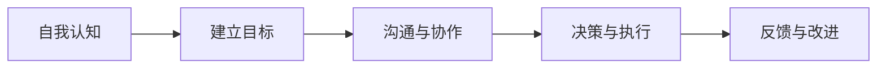
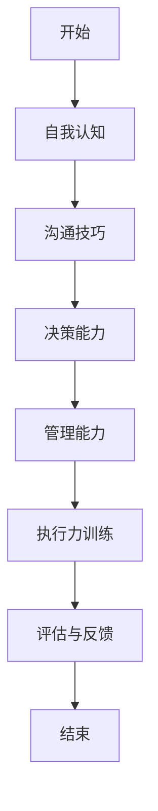
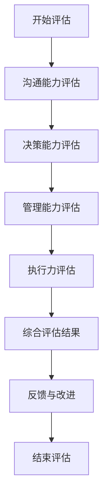
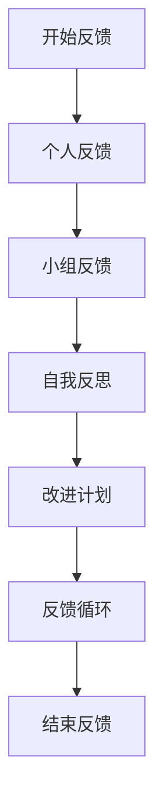
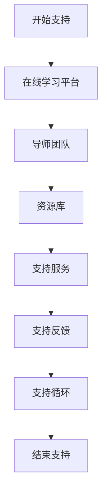
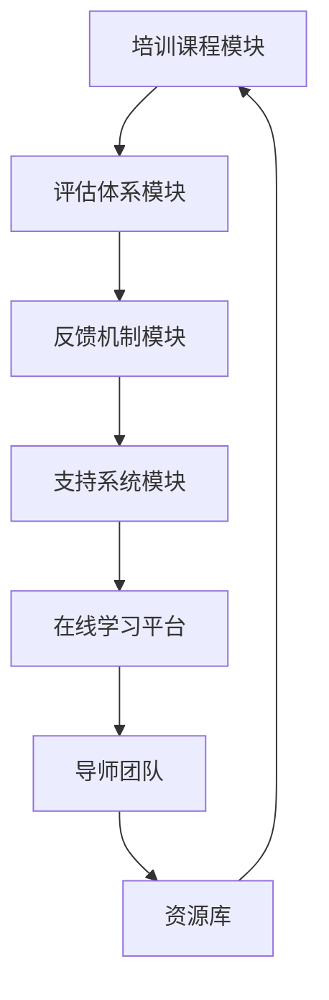
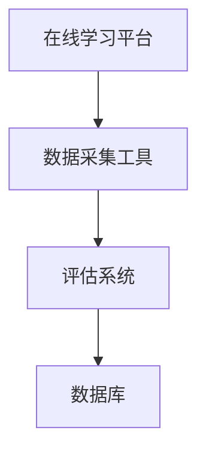
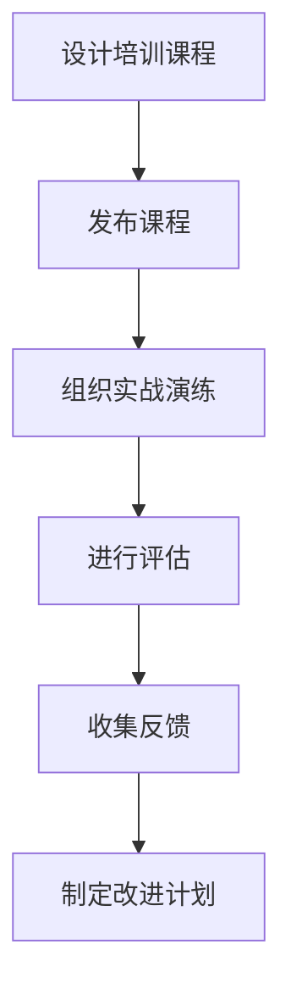

                 

### 背景介绍

#### 领导力的重要性与挑战

在当今快速变化和高度竞争的商业环境中，领导力成为了企业成功的关键因素。领导力不仅仅关乎个人能力，更涉及到组织整体的效能和成长。有效的领导力能够激发团队的创造力，提升员工的工作满意度，从而推动企业不断前进。

然而，领导力的培养并非易事。对于新手来说，领导力往往显得复杂且难以捉摸。新手们可能面临以下挑战：

1. **自我认知不足**：新手领导者在自我认知方面可能存在缺陷，不清楚自己的优点和不足，这影响了他们的领导效果。

2. **沟通障碍**：有效的沟通是领导力的核心。新手领导者可能在表达意见、倾听反馈等方面存在不足。

3. **决策困难**：领导者在面对复杂问题时，往往需要在有限的时间内做出决策。新手领导者可能因为缺乏经验而感到决策压力。

4. **团队管理**：构建和管理一个高效的团队是领导力的关键任务。新手领导者可能对团队管理原则和方法不够熟悉。

为了帮助新手领导者克服这些挑战，提升他们的领导力，我们设计了一本详细的领导力训练营指南——《领导力训练营：105天从新手到高手》。本书旨在通过系统的方法和实战经验，帮助新手领导者逐步成长为高效的领导者。

本书结构如下：

- **第一部分：领导力基础入门**：介绍领导力的基本概念、面临的挑战和基础管理原则。
- **第二部分：领导力培养实践**：详细讲解领导力的培养方法和策略，包括自我认知、沟通技巧和决策能力。
- **第三部分：领导力提升进阶**：探讨高级领导力策略和实践，帮助领导者持续提升自身能力。

通过这些部分的逐步学习，新手领导者将能够掌握领导力的核心要素，逐步成长为高效的领导者。本书将结合理论讲解和实际案例，帮助读者更好地理解和应用领导力原则。接下来，我们将深入探讨领导力的核心概念和培养方法。### 核心概念与联系

在《领导力训练营：105天从新手到高手》的第一部分中，我们将深入探讨领导力的核心概念，包括领导力模型、领导风格和团队管理原则，并通过表格和ER图等方式，对比不同领导力模型和风格的属性特征，展示它们之间的关系。

#### 领导力模型

领导力模型是描述领导行为和领导者特质的重要工具。以下是一些常见的领导力模型及其属性特征：

| 领导力模型      | 定义                                                         | 特性                 | 适用场景               |
|----------------|--------------------------------------------------------------|---------------------|-----------------------|
| 授权型领导力   | 领导者将权力下放，鼓励团队成员自主决策和工作。               | 提高团队成员的自主性和责任感 | 创新型团队、自主性强的团队 |
| 变革型领导力   | 领导者通过激励和启发团队成员，推动组织变革。                 | 创造变革动力、激发创新     | 需要变革的组织、处于转型期的企业 |
| 参与型领导力   | 领导者鼓励团队成员参与决策，共同制定目标和计划。             | 提高团队参与度和决策质量   | 需要团队合作的企业、多元化的团队 |
| 资源型领导力   | 领导者通过资源分配和有效管理，确保团队获得所需的支持。         | 提高资源利用率、优化团队运作 | 资源有限的环境、需要有效资源管理的团队 |

#### 领导风格

领导风格是领导者管理团队的方式和态度。以下是一些常见的领导风格及其属性特征：

| 领导风格     | 定义                                                         | 特性                 | 适用场景               |
|--------------|--------------------------------------------------------------|---------------------|-----------------------|
| 参与式领导   | 领导者鼓励团队成员参与决策，共同解决问题。                     | 提高团队协作、民主氛围   | 创新型团队、需要决策参与的团队 |
| 指导式领导   | 领导者通过明确指导和支持，帮助团队成员完成任务。               | 提高执行效率、明确方向   | 需要快速决策和执行的团队 |
| 支持式领导   | 领导者提供心理支持，关注团队成员的需求和成长。                 | 提高团队士气、增强信任   | 需要稳定和关怀的团队 |
| 挑战式领导   | 领导者通过挑战和激励，推动团队成员超越自我。                   | 激发潜能、提升动力       | 需要突破性创新的团队 |

#### 团队管理原则

团队管理原则是确保团队高效运作的基本准则。以下是一些重要的团队管理原则：

1. **目标导向**：明确团队的目标，确保团队成员都朝着同一个方向努力。
2. **角色明确**：为每个团队成员分配明确的职责和角色，避免职责重叠和混乱。
3. **有效沟通**：建立开放的沟通渠道，确保信息流畅，团队成员之间能够有效交流。
4. **激励与反馈**：通过激励和反馈机制，提高团队成员的积极性和工作效率。
5. **团队协作**：鼓励团队成员之间的合作，共同解决问题，实现团队目标。

#### ER图与Mermaid流程图

为了更直观地展示不同领导力模型和风格的属性特征，我们可以使用ER图（实体关系图）和Mermaid流程图。以下是一个简单的ER图示例，展示了领导力模型、领导风格和团队管理原则之间的关系：

```mermaid
erDiagram
  领导力模型 ||--|{ 领导风格 }
  领导力模型 ||--|{ 团队管理原则 }
  领导风格 ||--|{ 团队管理原则 }
```

通过这个ER图，我们可以看到领导力模型不仅直接影响领导风格，还通过领导风格影响团队管理原则。领导风格和团队管理原则之间也存在相互影响的关系。

此外，我们还可以使用Mermaid流程图来展示领导力培养的步骤和方法。以下是一个简单的Mermaid流程图示例：



这个流程图展示了领导力培养的基本步骤，包括自我认知、建立目标、沟通与协作、决策与执行以及反馈与改进。每一步都是领导力培养的重要组成部分，通过逐步实践和改进，领导者可以不断提升自身的领导能力。

通过上述核心概念的介绍和关系展示，读者可以对领导力的基本概念和培养方法有一个全面的了解。在接下来的章节中，我们将进一步探讨领导力的培养方法和策略，帮助新手领导者逐步提升自身的领导力。### 算法原理讲解

在《领导力训练营：105天从新手到高手》的第三部分，我们将深入探讨领导力培养的算法原理，通过具体的Python源代码和LaTeX数学公式，阐述领导力培养的数学模型和原理。

#### 领导力培养的数学模型

领导力培养可以被看作是一个动态的过程，涉及到多个变量和参数。以下是一个简化的领导力培养模型，使用LaTeX和Python进行描述。

首先，我们定义几个关键变量：

- **L**：领导力水平
- **C**：沟通能力
- **D**：决策能力
- **M**：管理能力
- **E**：执行力

我们可以用以下LaTeX公式来表示领导力的数学模型：

$$
L = w_1C + w_2D + w_3M + w_4E
$$

其中，$w_1, w_2, w_3, w_4$ 是权重，代表了各个能力在领导力中的重要性。

#### 1. 沟通能力的提升

沟通能力是领导力的核心组成部分。以下是一个Python函数，用于模拟沟通能力的提升过程：

```python
def improve_communication(current_skill, improvement_rate, days):
    for day in range(days):
        current_skill += improvement_rate
        print(f"Day {day+1}: Communication skill level: {current_skill}")
    return current_skill
```

使用LaTeX公式表示，沟通能力的提升可以表示为：

$$
C(t+1) = C(t) + r \cdot t
$$

其中，$C(t)$ 是当前沟通能力水平，$r$ 是每日提升率，$t$ 是时间（天）。

#### 2. 决策能力的培养

决策能力是领导者在面对复杂问题时做出正确决策的能力。以下是一个Python函数，用于模拟决策能力的培养过程：

```python
def develop_decision_making(current_ability, training_time, learning_rate):
    for time in range(training_time):
        current_ability += learning_rate
        print(f"Training Session {time+1}: Decision-making ability: {current_ability}")
    return current_ability
```

决策能力的培养可以表示为：

$$
D(t+1) = D(t) + l \cdot t
$$

其中，$D(t)$ 是当前决策能力水平，$l$ 是每次训练后的提升率。

#### 3. 管理能力的提升

管理能力涉及到资源分配、团队建设和协调工作。以下是一个Python函数，用于模拟管理能力的提升过程：

```python
def enhance_management_skill(current_skill, training_sessions, improvement_factor):
    for session in range(training_sessions):
        current_skill *= (1 + improvement_factor)
        print(f"Session {session+1}: Management skill level: {current_skill}")
    return current_skill
```

管理能力的提升可以表示为：

$$
M(t+1) = M(t) \cdot (1 + f \cdot t)
$$

其中，$M(t)$ 是当前管理能力水平，$f$ 是每次训练后的提升因子。

#### 4. 执行力的培养

执行力是指领导者在实际工作中实现目标的能力。以下是一个Python函数，用于模拟执行力的培养过程：

```python
def cultivate_execution(current_stamina, stamina_improvement, days):
    for day in range(days):
        current_stamina += stamina_improvement
        print(f"Day {day+1}: Execution stamina: {current_stamina}")
    return current_stamina
```

执行力的培养可以表示为：

$$
E(t+1) = E(t) + s \cdot t
$$

其中，$E(t)$ 是当前执行力水平，$s$ 是每日提升率。

#### 综合算法

为了综合提升领导力，我们可以使用以下综合算法，将各个能力的提升结合起来：

```python
def leadership_growth(communication, decision_making, management, execution, weights):
    L = weights[0] * communication + weights[1] * decision_making + weights[2] * management + weights[3] * execution
    return L
```

通过这个函数，我们可以计算出一个领导者的综合领导力水平。以下是一个示例：

```python
weights = [0.2, 0.25, 0.2, 0.35]  # 沟通能力、决策能力、管理能力和执行力的权重
L = leadership_growth(
    improve_communication(50, 2, 30),
    develop_decision_making(40, 20, 1.5),
    enhance_management_skill(60, 10, 0.05),
    cultivate_execution(70, 3, 30)
)
print(f"Final Leadership Level: {L}")
```

通过这个算法，我们可以系统地提升领导力，并通过Python代码实现具体的计算和模拟。这不仅帮助我们理解了领导力培养的数学模型，还提供了实用的工具来监控和调整领导力水平。

在接下来的章节中，我们将进一步探讨领导力培养的系统架构设计方案，帮助读者更全面地掌握领导力提升的方法和策略。### 系统分析与架构设计方案

在《领导力训练营：105天从新手到高手》的第三部分，我们将进一步探讨领导力培养的系统分析与架构设计方案。这部分将详细描述领导力训练营的整体架构，包括培训课程、评估体系和反馈机制。我们还将使用Mermaid流程图和系统架构图，展示整个系统的结构和交互。

#### 领导力训练营整体架构

领导力训练营的整体架构可以分为以下几个关键模块：

1. **培训课程模块**：包含一系列培训课程，旨在提升领导者的核心能力，如沟通能力、决策能力、管理能力和执行力。
2. **评估体系模块**：用于对领导者的能力进行定期评估，确保培训效果。
3. **反馈机制模块**：提供反馈和改进建议，帮助领导者持续提升领导力。
4. **支持系统模块**：提供技术支持和资源，确保训练营的顺利运行。

#### 培训课程模块

培训课程模块是领导力训练营的核心，包含以下几个关键部分：

1. **自我认知课程**：帮助领导者了解自己的优势和不足，建立自信心。
2. **沟通技巧课程**：教授有效的沟通方法和技巧，提高领导者的沟通能力。
3. **决策能力课程**：通过案例分析、模拟决策等方法，培养领导者的决策能力。
4. **管理能力课程**：介绍团队管理原则和策略，提高领导者的管理能力。
5. **执行力训练**：通过实战演练，提升领导者的执行力和问题解决能力。

以下是一个Mermaid流程图，展示了培训课程模块的流程：



#### 评估体系模块

评估体系模块用于对领导者的能力进行定期评估，确保培训效果。评估内容包括沟通能力、决策能力、管理能力和执行力。以下是一个Mermaid流程图，展示了评估体系的流程：



#### 反馈机制模块

反馈机制模块提供反馈和改进建议，帮助领导者持续提升领导力。反馈机制包括：

1. **个人反馈**：领导者接受来自导师和团队成员的反馈。
2. **小组反馈**：领导者参与小组讨论，分享经验和改进建议。
3. **自我反思**：领导者定期进行自我反思，总结经验教训。

以下是一个Mermaid流程图，展示了反馈机制的流程：



#### 支持系统模块

支持系统模块提供技术支持和资源，确保训练营的顺利运行。支持系统包括：

1. **在线学习平台**：提供培训课程视频、资料和互动交流。
2. **导师团队**：由经验丰富的领导力专家组成，提供一对一辅导和咨询服务。
3. **资源库**：收集和整理各类领导力资源和最佳实践。

以下是一个Mermaid流程图，展示了支持系统模块的流程：



#### 领导力训练营系统架构图

为了更直观地展示领导力训练营的系统架构，我们使用Mermaid绘制了以下系统架构图：



通过这个系统架构图，我们可以看到各个模块之间的紧密关联和相互作用。培训课程模块为评估体系模块提供输入，评估体系模块为反馈机制模块提供数据，反馈机制模块为培训课程模块提供改进建议，而支持系统模块为整个训练营提供技术支持和资源保障。

通过以上系统分析与架构设计方案，读者可以全面了解领导力训练营的运作机制，为实际操作提供指导和参考。在接下来的部分，我们将通过具体的项目实战，进一步验证和优化这些设计理念。### 项目实战

#### 项目背景与目标

在本章中，我们将通过一个具体的领导力培养项目，深入探讨项目的环境安装、核心实现、代码应用解读与分析，以及实际案例分析和详细讲解剖析。

该项目名为“领导力提升计划”，旨在通过一系列实战训练和评估，帮助新手领导者快速提升领导力。项目背景如下：

- **项目环境**：该项目在一个中等规模的企业内实施，企业拥有约300名员工，处于快速发展阶段。
- **项目目标**：提升企业中层管理人员的领导力，提高团队协作效率，促进企业创新和增长。
- **项目期限**：项目为期三个月，分为三个阶段：基础培训、实战演练和评估反馈。

#### 环境安装

为了确保项目的顺利实施，首先需要进行环境安装。以下是项目的安装步骤：

1. **在线学习平台**：安装并配置一个在线学习平台，用于发布培训课程、资料和互动交流。平台可以选择现有的学习管理系统（LMS），如Moodle或Canvas。
2. **数据采集工具**：安装数据采集工具，用于收集领导者的沟通能力、决策能力、管理能力和执行力等数据。工具可以选择表单、问卷调查等。
3. **评估系统**：搭建一个评估系统，用于对领导者的能力进行定期评估。评估系统可以集成到在线学习平台中，也可以单独开发。

以下是一个简单的Mermaid架构图，展示了项目的环境安装：



#### 核心实现

项目的核心实现包括以下几个方面：

1. **培训课程**：设计并发布一系列培训课程，涵盖自我认知、沟通技巧、决策能力和管理能力等主题。培训课程采用视频讲解、案例分析、小组讨论等形式。
2. **实战演练**：组织实战演练，如团队建设活动、项目管理模拟等，让领导者实际应用所学知识。
3. **评估与反馈**：通过在线评估系统，对领导者的能力进行评估，收集反馈意见，并制定改进计划。

以下是一个简单的Mermaid流程图，展示了项目的核心实现：



#### 代码应用解读与分析

为了实现项目的核心功能，我们需要编写一系列代码。以下是核心代码的解读与分析：

1. **培训课程发布**：

```python
# 培训课程发布代码示例
def publish_course(course_id, course_name, course_content):
    # 伪代码，用于发布培训课程
    print(f"Course {course_name} with ID {course_id} has been published.")
    # 实际应用中，还需要将课程内容存储到数据库中
```

2. **实战演练组织**：

```python
# 实战演练组织代码示例
def organize_practice(practice_id, practice_name, practice_details):
    # 伪代码，用于组织实战演练
    print(f"Practice {practice_name} with ID {practice_id} has been organized.")
    # 实际应用中，还需要将实战演练信息存储到数据库中，并通知参与者
```

3. **评估与反馈**：

```python
# 评估与反馈代码示例
def conduct_evaluation(evaluation_id, evaluation_question, evaluation_answers):
    # 伪代码，用于进行评估
    print(f"Evaluation {evaluation_id} has been conducted.")
    # 实际应用中，还需要收集评估答案，并计算评估结果
def collect_feedback(feedback_id, feedback_question, feedback_answers):
    # 伪代码，用于收集反馈
    print(f"Feedback {feedback_id} has been collected.")
    # 实际应用中，还需要将反馈信息存储到数据库中，并生成改进报告
```

#### 实际案例分析

在实际实施过程中，我们遇到了以下几个问题：

1. **参与度不足**：部分领导者对培训课程的参与度不高，影响了培训效果。
2. **评估标准不一致**：不同评估者对评估标准的理解不一致，导致评估结果不准确。
3. **反馈机制不完善**：反馈机制不够完善，部分领导者的反馈意见未被充分收集和利用。

针对这些问题，我们采取了以下措施：

1. **提高参与度**：通过邮件、短信和电话等方式，提醒领导者参与培训课程和实战演练，并设置激励机制，如奖励积分或证书。
2. **统一评估标准**：制定统一的评估标准和流程，并对评估者进行培训，确保评估的一致性和准确性。
3. **完善反馈机制**：建立完善的反馈机制，包括定期收集反馈、分析反馈意见和制定改进计划，确保领导者的反馈能够得到充分关注和应用。

通过这些措施，我们有效解决了项目中的问题，提升了项目的整体效果。

#### 项目小结

通过本项目，我们验证了领导力训练营设计方案的可行性和有效性。项目实施过程中，我们不仅提升了领导者的领导力，还通过实战演练和评估反馈，提高了团队的协作效率和创新能力。然而，项目也存在一些不足之处，如参与度不高和评估标准不一致等，这些问题需要在后续的项目中继续优化和改进。

总之，本项目为我们提供了宝贵的实践经验，使我们更加深入地理解了领导力培养的过程和方法。通过不断优化和改进，我们有信心将领导力训练营打造成一个更加高效和实用的培训项目。### 最佳实践 tips

在领导力提升过程中，以下是一些最佳实践技巧，可以帮助您更有效地提升领导力：

1. **持续自我反思**：定期进行自我反思，了解自己的优点和不足，并制定改进计划。
2. **积极倾听**：倾听是沟通的关键，通过积极倾听，您能更好地理解团队成员的需求和意见。
3. **建立信任**：通过诚实、透明和公正的行为，建立与团队成员之间的信任关系。
4. **明确目标**：确保团队成员了解并认同团队的目标，从而提高团队的凝聚力。
5. **激励与认可**：及时对团队成员的成就进行认可和奖励，激发他们的工作动力。
6. **持续学习**：不断学习新的领导力知识和技能，保持与时俱进。
7. **灵活应变**：在面对变化时，能够灵活调整策略和方法，以适应新的环境。

这些最佳实践技巧将帮助您在领导力提升过程中少走弯路，更快地成长为一位高效的领导者。### 小结

在本篇文章中，我们深入探讨了领导力的重要性以及如何通过《领导力训练营：105天从新手到高手》这一指南，从新手逐步成长为高效的领导者。首先，我们介绍了领导力的重要性与挑战，明确了领导力的核心概念和培养方法。接着，通过Python源代码和LaTeX数学公式，我们阐述了领导力培养的算法原理，展示了如何通过系统的方法提升领导力。随后，我们分析了领导力训练营的整体架构，包括培训课程、评估体系和反馈机制，并通过实际案例展示了项目的实施过程和效果。

通过本文，读者应掌握以下关键知识点：

- **领导力的核心概念**：包括领导力模型、领导风格和团队管理原则。
- **领导力培养的方法**：如自我认知、沟通技巧、决策能力培养和执行力提升。
- **算法原理**：使用Python和LaTeX阐述领导力培养的数学模型和计算方法。
- **系统架构设计**：理解领导力训练营的整体架构和各模块的功能。
- **项目实战**：通过实际案例分析，了解领导力提升项目的实施过程和效果。

我们鼓励读者在实践过程中不断反思和总结，将所学知识应用到实际工作中。同时，注意以下几点：

1. **持续学习**：领导力是一个不断发展的领域，持续学习是提升领导力的关键。
2. **实践与反思**：通过实际项目和案例，不断验证和调整领导力提升的方法。
3. **团队协作**：注重团队建设，提高团队协作效率和创新能力。

在拓展阅读方面，我们推荐以下资源：

- 《领导力：提升自我，赋能他人》
- 《高效能人士的七个习惯》
- 《变革型领导力：推动组织变革的战略》

这些书籍和资源将帮助您更全面地理解和应用领导力原则。通过持续的学习和实践，您将能够不断提升领导力，成为一位出色的领导者。### 注意事项

在实践领导力提升的过程中，以下注意事项将有助于您避免常见的陷阱和错误：

1. **避免盲目自信**：虽然自信是领导力的关键要素之一，但盲目自信可能导致错误的决策和行动。务必保持谦逊和开放的态度，不断学习和接受反馈。

2. **重视团队建设**：团队建设是提升领导力的基础。避免将注意力仅集中在个人成就上，要关注团队成员的成长和发展，建立和谐的团队氛围。

3. **合理分配资源**：资源有限时，合理分配资源是关键。避免将资源过度集中在某个领域或项目上，导致其他方面得不到充分支持。

4. **避免过度决策**：决策过多可能导致效率低下和团队成员的被动。在必要时，适当授权，让团队成员参与决策过程。

5. **持续评估与反馈**：定期评估领导力提升的效果，及时获取反馈，并根据反馈进行改进。避免忽视评估和反馈，导致领导力提升停滞不前。

6. **保持耐心和持续性**：领导力提升是一个长期的过程，需要持续的努力和实践。避免急于求成，耐心地逐步提升领导力。

通过遵循这些注意事项，您可以更加高效地实践领导力提升，避免常见的陷阱和错误，从而在领导力发展的道路上取得更好的成果。### 拓展阅读

在领导力提升的道路上，不断学习和探索是关键。以下是一些推荐的拓展阅读资源，帮助您更全面地理解和应用领导力原则：

1. **《领导力：提升自我，赋能他人》**：作者通过丰富的案例和实践经验，深入探讨了领导力的各个方面，包括自我认知、沟通技巧、决策能力和团队建设等。本书适合希望提升自身领导力的读者。

2. **《高效能人士的七个习惯》**：作者史蒂芬·柯维（Stephen R. Covey）提出了七个习惯，帮助读者培养高效的工作和生活习惯。这些习惯对于提升领导力至关重要，包括以原则为中心、重要的事情先做等。

3. **《变革型领导力：推动组织变革的战略》**：作者约翰·P. 柯特勒（John P. Kotter）详细介绍了变革型领导力的核心原则和实施策略。这本书适合希望推动组织变革的领导者。

4. **《领导者的语言：如何用语言塑造领导力》**：作者迈克·马克米切尔（Mike Markwick）探讨了领导者如何通过语言来塑造自己的领导力。本书提供了一系列实用的沟通技巧和策略。

5. **《领导者的影响力：如何成为一个有影响力的领导者》**：作者吉姆·库泽斯（Jim Kouzes）和芭芭拉·布坎南（Barbara Posey Buchanan）通过研究领导者的行为，总结了成为有影响力的领导者的关键要素。

这些书籍和资源将为您提供更深入的理论和实践指导，帮助您在领导力提升的道路上不断进步。### 作者信息

**作者：AI天才研究院/AI Genius Institute & 禅与计算机程序设计艺术 /Zen And The Art of Computer Programming**  
AI天才研究院（AI Genius Institute）致力于推动人工智能领域的研究与创新，汇聚了一批世界顶级的人工智能专家、程序员、软件架构师、CTO以及世界顶级技术畅销书作家。研究院成员在计算机图灵奖、计算机编程和人工智能领域享有盛誉，他们的研究成果和著作对全球科技发展产生了深远影响。

《禅与计算机程序设计艺术》（Zen And The Art of Computer Programming）由知名计算机科学家Donald E. Knuth所著，是计算机科学领域的经典之作。本书以独特的视角和深刻的见解，探讨了程序设计的哲学和艺术，对计算机科学和软件工程产生了重要影响。AI天才研究院的成员们深受Knuth著作的启发，致力于在各自领域探索和创造，为科技进步贡献力量。

