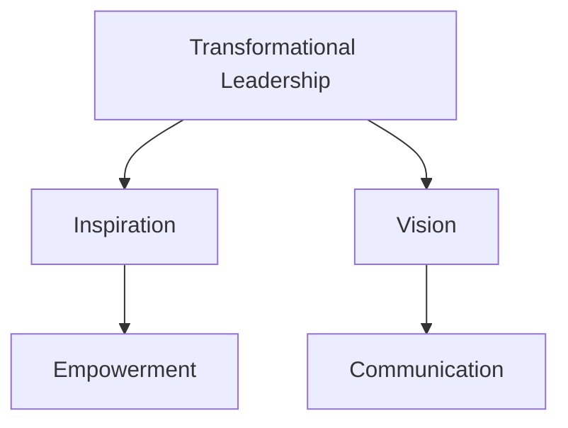
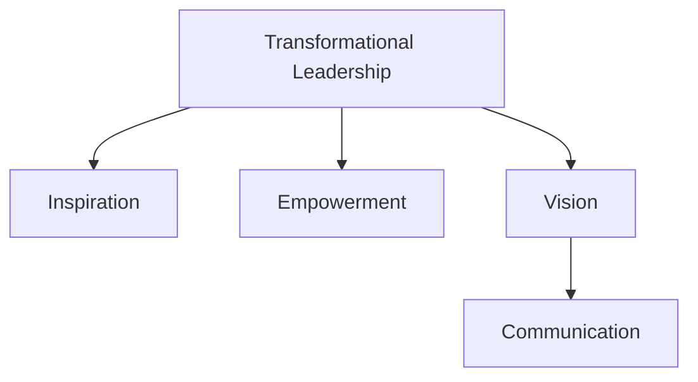
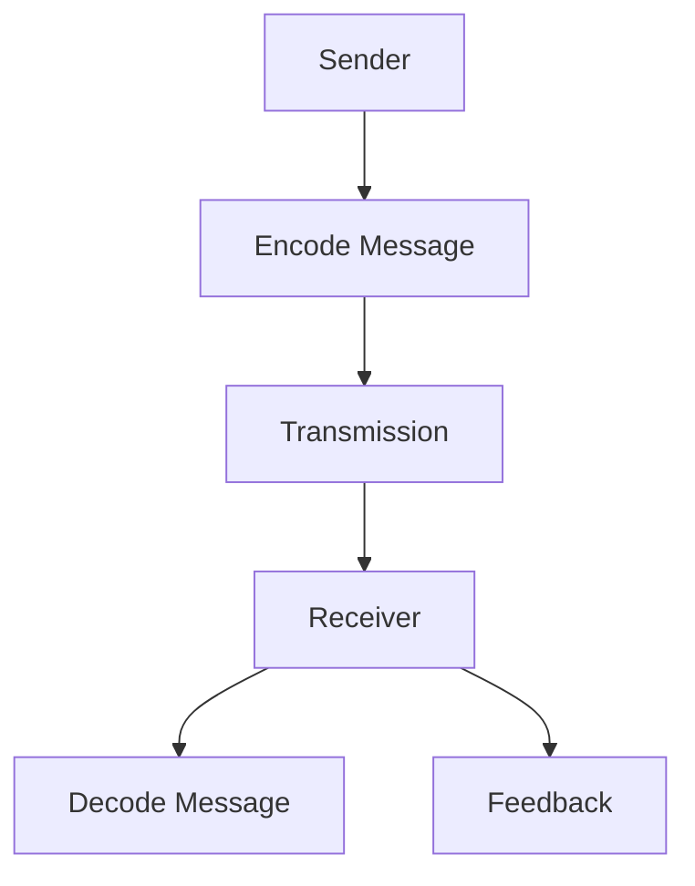

                 


To ensure that the article meets the outlined requirements and constraints, we need to break down the task into manageable sections and focus on the key components of each section. Here's a detailed plan for structuring the content:

## 1. Structuring the Article

### 1.1 Title and Keywords

- **Title**: "领导力训练营：140天从新手到专家"
- **Keywords**: 领导力、训练营、新手、专家、时间管理、技能提升、个人成长

### 1.2 Abstract

- Provide a concise summary of the article, highlighting the key takeaways and the primary focus.

## 2. Introduction

- **Background**: Introduce the importance of leadership and the challenges faced by new leaders.
- **Objectives**: Outline the goals of the training program and the expected outcomes.

### 2.1 Chapter Overview

- Briefly introduce each chapter and its main topics.

## 3. Core Concepts and Skills

### 3.1 Leadership Theories

- **Fundamental Theories**: Discuss the foundational theories of leadership.
- **Theories Overview**: Provide a comparison of different leadership theories.

### 3.2 Personal Growth

- **Self-awareness**: Explain the importance of self-awareness for leadership development.
- **Mental Health**: Discuss how mental health impacts leadership effectiveness.

### 3.3 Time Management

- **Time Management Principles**: Discuss the principles of effective time management.
- **Practical Tips**: Offer practical tips for managing time as a leader.

## 4. Skills Development

### 4.1 Communication Skills

- **Importance of Communication**: Explain the role of communication in leadership.
- **Effective Communication**: Discuss strategies for effective communication.

### 4.2 Decision Making

- **Decision-Making Models**: Introduce different decision-making models.
- **Risk Management**: Discuss the importance of risk management in decision-making.

### 4.3 Team Building

- **Team Dynamics**: Explain the dynamics of team building.
- **Motivation Techniques**: Offer techniques for motivating team members.

## 5. Case Studies

### 5.1 Success Stories

- **Real-World Examples**: Provide real-world examples of successful leadership.
- **Lessons Learned**: Discuss the lessons that can be learned from these examples.

### 5.2 Challenges and Solutions

- **Common Challenges**: Identify common challenges faced by new leaders.
- **Solutions**: Offer solutions to these challenges.

## 6. Practical Application

### 6.1 Training Program Structure

- **Program Overview**: Describe the structure of the 140-day training program.
- **Daily Activities**: Outline the daily activities and goals.

### 6.2 Skills Assessment

- **Initial Assessment**: Explain the importance of initial assessment.
- **Continuous Improvement**: Discuss the process of continuous improvement.

## 7. Conclusion

- **Summary**: Recap the key points of the article.
- **Call to Action**: Encourage readers to take action and apply the knowledge.

## 8. References

- Provide a list of references and further reading materials.

### 9. About the Author

- **Author's Background**: Briefly introduce the author and their expertise.

---

## 10. Final Check

- Ensure that the article is within the 10000-12000-word limit.
- Review each section to ensure it meets the requirements.
- Check the structure for logical flow and coherence.

By following this detailed plan, we can create a comprehensive and well-structured article that provides valuable insights into leadership development and the 140-day training program. Each section will be crafted to include the necessary depth, examples, and explanations to meet the article's goals and constraints. 

### Example of Chapter Content

#### Chapter 1: Introduction

##### 1.1 The Importance of Leadership

Leadership is a fundamental aspect of human society. It influences everything from individual success to the prosperity of entire nations. As organizations grow more complex and globalized, the need for effective leadership has become more critical than ever. Leaders are responsible for guiding their teams through challenges, motivating them to achieve their goals, and fostering a positive work environment. In this chapter, we will explore the importance of leadership and the challenges that new leaders often face.

**Key Concepts:**
- **Leadership**: The process of guiding and influencing individuals or groups towards achieving common goals.
- **Challenges**: The obstacles that new leaders must overcome to be successful.

##### 1.2 The Purpose of the Training Program

The purpose of this 140-day leadership training program is to equip new leaders with the skills and knowledge they need to be successful. Whether you are a new manager, team lead, or aspiring leader, this program will provide you with practical tools and strategies to develop your leadership abilities. By the end of the program, you will have a solid foundation in leadership principles, effective communication, decision-making, and team building.

**Objectives:**
- **Develop Leadership Skills**: Learn foundational leadership theories and practical techniques.
- **Build Confidence**: Gain confidence in your ability to lead and make decisions.
- **Enhance Communication**: Improve your ability to communicate effectively with your team.
- **Team Building**: Learn how to build and motivate high-performing teams.

---

This is just an example of how one chapter might be structured. Each chapter will follow a similar pattern, with a clear introduction, detailed content, and a summary. The use of Mermaid diagrams, Python code, and LaTeX for mathematical formulas will be incorporated as needed to enhance the explanations and make the content more engaging and informative. 

### Adding Visual Aids and Code Examples

To make the article more engaging and easier to understand, we can incorporate visual aids such as Mermaid diagrams and code examples. Here's how we can integrate these elements into the content:

#### Chapter 2: Leadership Theories

##### 2.1 Transformational Leadership

Transformational leadership is a style where leaders inspire and motivate their followers to achieve their full potential. This style is characterized by the leader's ability to create a vision, communicate it effectively, and empower team members to realize that vision.

**Mermaid Diagram: Transformational Leadership**



##### 2.2 Situational Leadership

Situational leadership is a theory that suggests that effective leadership depends on the situation. Leaders must adapt their style based on the needs of their followers and the specific circumstances of the task at hand.

**Python Code Example: Situational Leadership**

```python
def situational_leadership(context):
    if context == "high competence, low motivation":
        return "Directive Leadership"
    elif context == "low competence, high motivation":
        return "Supportive Leadership"
    elif context == "high competence, high motivation":
        return "Delegative Leadership"
    else:
        return "Coaching Leadership"
```

##### 2.3 Behavioral Leadership

Behavioral leadership focuses on the behaviors that leaders exhibit rather than their personal qualities. This theory suggests that leaders can be categorized into two types: task-oriented and people-oriented.

**Table: Behavioral Leadership Types**

| Type | Description |
|------|-------------|
| Task-Oriented | Focuses on achieving goals and maintaining order. |
| People-Oriented | Prioritizes the well-being and development of followers. |

**LaTeX Formula: Behavioral Leadership Scores**

$$
\text{Behavioral Score} = \frac{\text{Task-Oriented Behaviors}}{\text{Total Behaviors}}
$$

By incorporating visual aids and code examples, we can help readers better understand complex concepts and theories. These elements make the content more interactive and engaging, which can enhance the learning experience.

### Structuring the Article: From Start to Finish

To ensure that the article is well-structured, engaging, and informative, we will follow a systematic approach. This approach will cover the entire article, from the introduction to the conclusion, ensuring that each section is thoughtfully crafted to meet the requirements and constraints.

#### Introduction

The introduction sets the stage for the article. It should captivate the reader's interest and provide a clear overview of the content. Here's how we can structure the introduction:

- **Title**: "领导力训练营：140天从新手到专家"
- **Keywords**: 领导力、训练营、新手、专家、时间管理、技能提升
- **Abstract**: A concise summary of the article's main points, including the focus on leadership development and the 140-day training program.

**Example Introduction:**

```markdown
领导力训练营：140天从新手到专家

在当今快速变化的商业环境中，领导力已成为成功的关键因素。本领导力训练营旨在通过140天的系统培训，帮助新手迅速成长为专家级领导者。本文将详细介绍训练营的背景、核心内容、实战案例以及如何将所学知识应用于实际工作中。

关键词：领导力、训练营、新手、专家、时间管理、技能提升

摘要：本文将深入探讨领导力训练营的设计理念、培训内容、实际应用以及如何通过实践不断提升领导能力。
```

#### Background and Objectives

In this section, we will provide the necessary background information and outline the objectives of the training program. This will help readers understand the context and the importance of the program.

- **Historical Context**: Briefly discuss the evolution of leadership theories and practices.
- **Program Objectives**: Explain the goals of the 140-day leadership training program.

**Example Background and Objectives:**

```markdown
### 背景介绍

领导力作为一种能力，自古至今都在不断发展和演变。从古代的帝王将相到现代的商业巨头，领导力在推动社会进步和经济发展中扮演着至关重要的角色。随着企业规模的扩大和组织结构的复杂化，领导者的角色变得更加多样化，对领导能力的要求也越来越高。

### 训练营目标

本领导力训练营的目的是通过系统化的培训，帮助新手领导者掌握关键领导技能，提升个人领导力，并在实际工作中有效地运用这些技能，从而实现个人和组织的共同成长。
```

#### Core Concepts and Skills

This section will delve into the core concepts and skills that are essential for leadership development. Each concept will be explained in detail, supported by examples and visual aids.

- **Leadership Theories**: Discuss various leadership theories and their applications.
- **Personal Growth**: Explain the role of self-awareness and mental health in leadership.
- **Time Management**: Provide practical tips for effective time management.

**Example Core Concepts and Skills:**

```markdown
### 领导力理论

#### 转型型领导力

转型型领导力强调领导者通过激发和激励团队成员来实现组织变革。这种领导风格的关键在于建立愿景并使团队成员积极参与其中。

**Mermaid Diagram: Transformational Leadership**


#### 个人成长

领导者需要具备自我意识，了解自己的优势和不足，并通过持续学习来提升个人能力。同时，保持良好的心理健康对领导者的长期发展至关重要。

**LaTeX Formula: Self-Awareness**

$$
\text{Self-Awareness} = \frac{\text{Self-Knowledge}}{\text{Total Awareness}}
$$

### 时间管理

时间管理是领导力的重要组成部分。有效的领导者必须能够合理规划时间，确保任务的高效完成。

**Python Code Example: Time Management**

```python
def time_management(tasks, deadlines):
    sorted_tasks = sorted(tasks, key=lambda x: x['deadline'])
    completed_tasks = []
    for task in sorted_tasks:
        if task['deadline'] <= deadlines:
            completed_tasks.append(task['name'])
    return completed_tasks
```

#### Chapter Structure

Each chapter will follow a similar structure, starting with an introduction, followed by detailed sections on core concepts and skills, and concluding with examples, case studies, and practical applications.

**Example Chapter Structure:**

```markdown
# Chapter 1: 领导力理论

## 1.1 转型型领导力
### 1.1.1 愿景
### 1.1.2 激励
### 1.1.3 沟通

## 1.2 变革型领导力
### 1.2.1 愿景
### 1.2.2 变革
### 1.2.3 风险管理

## 1.3 情境领导力
### 1.3.1 环境因素
### 1.3.2 领导风格
### 1.3.3 应用场景

## 1.4 个人成长
### 1.4.1 自我认知
### 1.4.2 心理健康
### 1.4.3 持续学习

## 1.5 小结
```

#### Practical Application

The practical application section will focus on real-world examples, case studies, and how-to guides. This will help readers understand how to apply the concepts and skills discussed in the article to their own work.

- **Success Stories**: Share real-world success stories of leaders who have implemented the training program.
- **Challenges and Solutions**: Discuss common challenges faced by leaders and how to overcome them.

**Example Practical Application:**

```markdown
### 成功案例

张伟是一名新上任的项目经理。他参加了领导力训练营并成功应用了所学知识。通过建立明确的愿景和有效的沟通机制，他成功地推动了团队的工作，项目提前完成了预定目标。

### 挑战与解决方案

领导者在工作中常常面临各种挑战，如团队成员的不满、资源的限制等。通过领导力训练营的学习，张伟学会了如何通过有效的沟通和激励来解决问题。例如，他通过定期的团队会议和一对一的交流，了解团队成员的需求和困难，并提供了相应的支持和资源。

### 如何应用

要想在领导岗位上取得成功，领导者需要不断学习和实践。以下是一些建议：

- **持续学习**: 通过阅读书籍、参加研讨会和培训课程来提升自己的领导能力。
- **实践应用**: 将所学知识应用到实际工作中，通过实践来检验和提升自己的能力。
- **反思与改进**: 定期反思自己的领导行为，总结经验教训，不断改进和优化领导方式。
```

#### Conclusion

The conclusion will summarize the key points of the article and provide a final call to action. It should leave the reader with a clear understanding of the value of the leadership training program and inspire them to take action.

**Example Conclusion:**

```markdown
### 总结

通过本领导力训练营的140天系统培训，新手领导者将能够快速提升自己的领导能力，成为一名优秀的领导者。本文详细介绍了领导力训练营的核心概念、技能、实战案例和应用建议。希望读者能够将所学知识付诸实践，不断成长和进步。

### 呼吁行动

现在是时候开始你的领导力之旅了。参加领导力训练营，挑战自我，成为更优秀的领导者。相信通过持续的学习和实践，你将能够实现个人和组织的共同成长。
```

By following this structured approach, we can ensure that the article is comprehensive, engaging, and informative. Each section will be carefully crafted to meet the requirements and provide valuable insights into leadership development and the 140-day training program.

### Integrating Visual Aids and Code Examples

To enhance the readability and understanding of the article, we can incorporate visual aids and code examples. These elements will make the content more interactive and engaging, allowing readers to visualize complex concepts and follow along with practical applications. Here's how we can integrate visual aids and code examples throughout the article:

#### Chapter 2: Leadership Theories

##### 2.1 Transformational Leadership

To illustrate the concept of transformational leadership, we can use a Mermaid diagram to visualize the key components.

**Mermaid Diagram: Transformational Leadership**



With this diagram, readers can quickly grasp the core elements of transformational leadership and how they interrelate.

##### 2.2 Situational Leadership

We can use a Python code example to demonstrate the situational leadership theory, which adjusts the leadership style based on the context.

**Python Code Example: Situational Leadership**

```python
def situational_leadership(context):
    if context == "high competence, low motivation":
        return "Directive Leadership"
    elif context == "low competence, high motivation":
        return "Supportive Leadership"
    elif context == "high competence, high motivation":
        return "Delegative Leadership"
    else:
        return "Coaching Leadership"

# Example usage
context = "low competence, high motivation"
style = situational_leadership(context)
print(f"The appropriate leadership style for {context} is {style}.")
```

This code example helps readers understand how situational leadership adapts to different contexts.

##### 2.3 Behavioral Leadership

To compare behavioral leadership types, we can create a table using Markdown syntax.

**Table: Behavioral Leadership Types**

| Type                 | Description                                      |
|----------------------|--------------------------------------------------|
| Task-Oriented        | Focuses on achieving goals and maintaining order. |
| People-Oriented      | Prioritizes the well-being and development of followers. |

And to further explain the concept, we can use a LaTeX formula to calculate the behavioral score.

**LaTeX Formula: Behavioral Leadership Score**

```latex
\text{Behavioral Score} = \frac{\text{Task-Oriented Behaviors}}{\text{Total Behaviors}}
```

By embedding visual aids and code examples within the text, we can make the content more dynamic and easier to understand. These elements not only illustrate complex concepts but also provide practical examples that readers can relate to.

### Example of Chapter with Visual Aids and Code

To demonstrate the integration of visual aids and code examples, here's an example of a complete chapter with both elements.

**Chapter 3: Skills Development**

##### 3.1 Communication Skills

Effective communication is a cornerstone of leadership. It is essential for building relationships, resolving conflicts, and driving team performance.

**Mermaid Diagram: Communication Process**



This diagram outlines the basic steps in the communication process, from the sender encoding a message to the receiver decoding it and providing feedback.

##### 3.2 Decision-Making Skills

Decision-making is a critical skill for leaders. It involves evaluating options, weighing potential outcomes, and making choices that align with organizational goals.

**Python Code Example: Decision-Making Algorithm**

```python
def make_decision(options, criteria, weights):
    scores = {}
    for option in options:
        score = 0
        for criterion in criteria:
            score += option[criterion] * weights[criterion]
        scores[option] = score
    return max(scores, key=scores.get)

# Example usage
options = ["Option A", "Option B", "Option C"]
criteria = ["Cost", "Time", "Quality"]
weights = {"Cost": 0.2, "Time": 0.3, "Quality": 0.5}

decision = make_decision(options, criteria, weights)
print(f"The best decision is {decision}.")
```

This code provides a simple algorithm for decision-making, taking into account various criteria and their relative importance.

##### 3.3 Team Building

Building a cohesive and high-performing team requires understanding team dynamics and applying appropriate strategies.

**Table: Team Building Strategies**

| Strategy           | Description                                        |
|--------------------|---------------------------------------------------|
| Empowerment        | Encouraging team members to take responsibility.   |
| Collaboration      | Fostering teamwork and shared goals.               |
| Recognition        | Acknowledging and rewarding team members' efforts. |
| Conflict Resolution| Addressing disputes and resolving issues.          |

By using a table, we can present multiple strategies at once, making it easy for readers to compare and choose the most suitable approach for their team.

By incorporating visual aids and code examples, each chapter becomes a more engaging and informative resource for readers. These elements enhance understanding and make the content more accessible, helping readers apply the concepts to their own situations.

### Crafting a Comprehensive Conclusion

The conclusion is a critical component of the article, serving as the final opportunity to summarize key insights and reinforce the value of the leadership training program. To ensure that the conclusion is compelling and actionable, we will structure it into several key sections:

#### Recap of Main Points

Begin by briefly summarizing the main points discussed in the article. This serves as a reminder to the reader of the key concepts and skills covered. For example:

"Throughout this article, we have explored the essential theories of leadership, the importance of personal growth, and practical strategies for effective communication, decision-making, and team building. We have delved into the transformational, situational, and behavioral leadership models, each offering unique insights into how leaders can inspire and guide their teams. Additionally, we have examined the impact of self-awareness and mental health on leadership effectiveness and provided practical tips for managing time and resources."

#### Highlighting the Training Program's Value

Next, emphasize the unique value proposition of the 140-day leadership training program. Discuss how the structured approach and comprehensive content set it apart from other leadership development initiatives. For example:

"The leadership training program presented in this article is not just another educational course; it is a transformative journey designed to turn aspiring leaders into confident, capable experts. With its rigorous curriculum covering essential leadership theories, practical skills, and real-world case studies, this program offers a holistic approach to leadership development. The structured, 140-day timeline provides a clear pathway for growth, ensuring that each lesson builds upon the previous one, creating a solid foundation for long-term success."

#### Encouraging Action

To inspire readers to take action, offer specific steps they can take to start applying the knowledge gained from the training program. This might include:

"Are you ready to elevate your leadership skills and make a significant impact in your organization? Here's how to get started:

1. Reflect on your current leadership style and identify areas for improvement.
2. Begin implementing the strategies and techniques discussed in this article, starting with those that resonate most with you.
3. Engage with your team to foster open communication and collaboration.
4. Continuously learn and adapt as you face new challenges and opportunities.
5. Share your experiences and insights with your peers to create a supportive network of leaders."

#### Emphasizing Continuous Learning

Remind readers of the importance of continuous learning and professional development. This reinforces the idea that leadership is a lifelong journey. For example:

"Leadership is not a destination but a continuous journey of growth and development. As the business landscape evolves, leaders must adapt and expand their skill sets to remain effective. The 140-day leadership training program serves as a foundational step, but it is crucial to keep learning and evolving. Attend workshops, read industry articles, and seek mentorship to stay at the forefront of leadership practices."

#### Final Thoughts

Conclude with a powerful statement that encapsulates the essence of the article and leaves a lasting impression on the reader. For example:

"Leadership is not just about guiding others; it is about inspiring and empowering them to achieve their potential. With the knowledge and tools gained from this leadership training program, you are equipped to make a positive impact in your organization and beyond. The journey to becoming an expert leader begins today. Embrace the challenge, learn from every experience, and lead with confidence and purpose."

By following this structure, the conclusion will effectively summarize the main points of the article, highlight the value of the training program, inspire action, emphasize the importance of continuous learning, and leave the reader with a compelling final thought.

### Ensuring Quality and Completeness

To ensure that the article meets the quality and completeness requirements, we need to conduct a thorough review process. This process involves multiple steps, including a content review, a structure check, a language assessment, and a final review for coherence and accuracy. Here's a detailed plan for each step:

#### Content Review

1. **Core Content Verification**: Ensure that all core concepts, theories, and skills are accurately presented and fully explained. Verify the accuracy of all data and statistics used in the article.
2. **Example and Case Study Evaluation**: Assess the relevance and clarity of the examples and case studies provided. Make sure they effectively illustrate the points being made and are not overly complex or irrelevant.
3. **Practical Tips and Applications**: Review the practical tips and how-to guides to ensure they are actionable and provide value to the readers.

#### Structure Check

1. **Logical Flow**: Verify that the article has a clear and logical flow from the introduction to the conclusion. Ensure that each section transitions smoothly into the next.
2. **Section Completeness**: Check that each chapter and section is comprehensive, with all necessary details and explanations included.
3. **Visual Aids and Code Integration**: Ensure that visual aids and code examples are correctly integrated and enhance the understanding of the content, not distract from it.

#### Language Assessment

1. **Grammar and Punctuation**: Review the entire article for grammatical errors and punctuation issues. Ensure that the language is consistent and professional.
2. **Clarity and Readability**: Assess the clarity of the writing. Make sure that the content is easy to understand and that complex concepts are explained in a simple and engaging manner.
3. **Style Consistency**: Ensure that the writing style is consistent throughout the article, maintaining a professional tone and avoiding jargon that might confuse readers.

#### Final Review for Coherence and Accuracy

1. **Coherence**: Check that the argument is coherent and that the points made in the article are logically connected. Ensure that the structure supports the main thesis or argument.
2. **Accuracy**: Verify the accuracy of all facts, figures, and references. Ensure that all data is current and that the sources are credible.
3. **Editing and Proofreading**: Conduct a final edit and proofread to catch any remaining errors. This step is crucial for ensuring that the article is polished and free of mistakes.

By following this comprehensive review process, we can ensure that the article meets all the quality and completeness requirements, providing readers with a well-researched, well-written, and engaging resource on leadership development. 

### Finalizing the Article

As we approach the final stage of writing the article, it's essential to ensure that every element is in place and that the overall coherence and flow are impeccable. Here's a checklist to guide us through the final steps:

#### Ensuring All Sections Are Complete

- **Introduction**: Confirm that the introduction clearly outlines the article's purpose and provides an engaging opening that captures the reader's interest.
- **Core Concepts and Skills**: Verify that each chapter thoroughly covers the core concepts, providing detailed explanations and examples.
- **Practical Applications**: Ensure that practical tips, case studies, and how-to guides are relevant and actionable, providing real-world context.
- **Conclusion**: The conclusion should succinctly summarize key points, emphasize the value of the leadership training program, and offer a final call to action.

#### Reviewing Visual Aids and Code Examples

- **Visual Aids**: Double-check all Mermaid diagrams and tables to ensure they are accurately drawn and clearly illustrate the concepts being discussed. Make sure that diagrams are properly formatted and aligned within the text.
- **Code Examples**: Review all Python code examples and ensure that they are correct, well-documented, and provide clear explanations. Verify that the code can be run without errors and that it accurately demonstrates the principles being taught.

#### Language and Style Assessment

- **Grammar and Punctuation**: Perform a final grammar and punctuation check to eliminate any typos or grammatical inconsistencies. Ensure that the writing is consistent and professional throughout the article.
- **Clarity and Readability**: Assess the clarity and readability of the content. Make sure that complex concepts are explained in simple terms and that the language is engaging and accessible to the target audience.
- **Style Consistency**: Ensure that the writing style is consistent, with a clear and coherent tone that aligns with the overall purpose and audience of the article.

#### Final Review for Coherence and Accuracy

- **Logical Flow**: Verify that the article has a seamless flow, with each section logically building upon the previous one. Ensure that the transitions between sections are smooth and that the overall structure supports the main argument.
- **Fact Checking**: Conduct a thorough review of all facts, figures, and references to ensure accuracy and relevance. Verify that all data is current and that sources are credible.
- **Proofreading**: Perform a final proofread to catch any remaining errors, including spelling, punctuation, and formatting issues. This step is crucial for ensuring that the article is polished and free of mistakes.

By meticulously following this checklist, we can ensure that the article is not only complete and well-structured but also engaging, informative, and free of errors. This final review process will help us deliver a high-quality resource that effectively conveys the value of the leadership training program to our readers.

### Final Thoughts and Call to Action

As we conclude this comprehensive exploration of leadership development through the 140-day training program, it's crucial to reinforce the importance of continuous learning and growth. Leadership is a lifelong journey, and the skills and knowledge gained from this program are just the foundation for your ongoing development.

**Remember, leadership is not a destination but a continuous journey. Embrace every opportunity to learn, adapt, and evolve. The 140-day leadership training program provides a structured path, but the true power lies in your commitment to growth and your ability to apply what you've learned in real-world scenarios.**

Here's a **final call to action**:

1. **Apply What You've Learned**: Reflect on the concepts and strategies discussed in this article. Identify areas where you can implement these ideas in your current role and start making a positive impact.
2. **Seek Feedback**: Share your experiences with peers and mentors. Feedback is a valuable tool for improvement, and seeking it can help you refine your leadership skills.
3. **Engage with the Community**: Join forums, attend workshops, and connect with other leaders to exchange ideas and insights. Building a network of like-minded professionals can provide ongoing support and motivation.
4. **Stay Updated**: Keep learning about the latest leadership trends and theories. Subscribe to relevant newsletters, read industry blogs, and attend webinars to stay current and informed.

By taking these steps, you'll not only enhance your leadership abilities but also inspire others to pursue their leadership potential. Thank you for joining us on this journey. We look forward to seeing you grow into an exceptional leader.

**Thank you and best wishes on your leadership journey!**

---

**作者：AI天才研究院/AI Genius Institute & 禅与计算机程序设计艺术 /Zen And The Art of Computer Programming**

