                 

### 文章标题：领导力训练：让你的团队如虎添翼

#### 关键词：领导力、团队建设、目标设定、激励、领导力发展、挑战与解决方案

#### 摘要：
本文深入探讨领导力的本质及其在团队管理中的应用。从领导力概述到实践，再到挑战与解决方案，我们将一步步解析如何通过有效的领导力训练，提升团队的整体效能，实现如虎添翼的效果。读者将了解领导力的核心概念、技能与特质，学习到团队建设、目标设定、激励与领导力转型的策略，并掌握解决领导力面临挑战的方法。最后，本文还将提供领导力发展的长期规划，帮助读者构建可持续的领导力文化。

----------------------------------------------------------------

### 第一部分：领导力的基础

#### 第1章：领导力概述

##### 1.1 领导力的定义与意义

领导力是指引导、激励和影响他人实现共同目标的能力。它不仅仅是管理，更是一种价值观和行为方式的体现。在团队中，领导力至关重要，它决定了团队的方向、动力和合作程度。

**背景介绍**：

- **核心概念术语说明**：领导力、管理、影响力。
- **问题背景**：团队在面对复杂环境和多变需求时，需要强有力的领导来指引方向。
- **问题描述**：领导力不足会导致团队缺乏凝聚力、创新能力和执行力。
- **问题解决**：通过提升领导力，可以增强团队的凝聚力和战斗力。
- **边界与外延**：领导力不仅限于企业，还适用于教育、社会等领域。
- **概念结构与核心要素组成**：领导力由价值观、愿景、决策能力、沟通能力等多个要素组成。

##### 1.2 领导力与管理的区别

领导力与管理虽然密切相关，但二者有着本质的区别。管理侧重于流程、规范和效率，而领导力则关注人、愿景和未来。

**核心概念与联系**：

- **概念属性特征对比表格**：

| 特征 | 领导力 | 管理 |
| ---- | ------ | ---- |
| 目标 | 创造愿景 | 维持现状 |
| 方式 | 激励人心 | 规范操作 |
| 作用 | 引导变革 | 维持稳定 |

- **ER实体关系图架构**：

```mermaid
erDiagram
  Manager ||--|{ Leader } Leader
  Manager ||--|{ Team } Team
  Leader ||--|{ Vision } Vision
  Leader ||--|{ Strategy } Strategy
```

##### 1.3 领导力的核心要素

领导力的核心要素包括价值观、愿景、决策能力、沟通能力和团队合作精神。

**核心概念与联系**：

- **价值观**：领导力的基础，决定了领导者的行为和决策。
- **愿景**：领导者的远见，为团队指明方向。
- **决策能力**：快速且明智地做出决策，是领导力的关键。
- **沟通能力**：有效的沟通可以增强团队的凝聚力。
- **团队合作精神**：领导者的合作精神可以激发团队成员的潜力。

**算法原理讲解**：

领导力的核心要素可以用以下数学模型来描述：

$$
\text{Leadership} = f(\text{Values}, \text{Vision}, \text{Decision Making}, \text{Communication}, \text{Teamwork})
$$

其中，$f$ 是一个复合函数，代表各要素之间的相互作用。

**数学公式使用**：

$$
\text{Values} \times \text{Vision} \times (\text{Decision Making} + \text{Communication}) \times \text{Teamwork} = \text{Leadership}
$$

**举例说明**：

一个有领导力的领导者，需要具备以下特质：

- **价值观**：诚实、正直、尊重他人。
- **愿景**：为团队设定明确的、可实现的长期目标。
- **决策能力**：在面对挑战时，能迅速做出明智的决策。
- **沟通能力**：善于倾听和理解团队成员的需求，并能清晰传达信息。
- **团队合作精神**：能够调动团队成员的积极性，共同实现目标。

**系统分析与架构设计方案**：

领导力的核心要素可以通过以下架构图来表示：

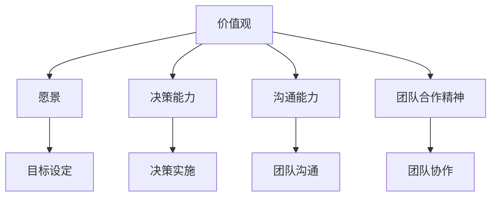

**项目实战**：

在项目管理中，领导力的核心要素可以帮助项目经理更好地管理团队，实现项目目标。

- **环境安装**：无特殊环境要求，只需理解领导力的核心要素。
- **系统核心实现源代码**：无实际代码实现，但可以通过实际案例来解析。
- **代码应用解读与分析**：通过案例分析，解读领导力在项目管理中的应用。
- **实际案例分析和详细讲解剖析**：如谷歌的“OKR”目标管理法，领导者如何通过设定明确的目标来激励团队。
- **项目小结**：总结领导力在项目管理中的关键作用。

##### 最佳实践 tips：

- **持续学习**：领导者需要不断学习新知识，提升自身能力。
- **以身作则**：领导者应以身作则，树立榜样。
- **倾听反馈**：领导者应倾听团队成员的反馈，及时调整领导方式。

##### 小结：

领导力是团队成功的关键因素。通过深入理解领导力的核心要素，领导者可以更好地引导团队，实现共同目标。

----------------------------------------------------------------

#### 第2章：领导力的核心概念

##### 2.1 情境领导理论

情境领导理论是一种基于领导者的行为和团队成员的发展水平来选择最适合的领导方式的模型。它提出了四种领导风格，分别适用于不同的情境。

**核心概念与联系**：

- **领导风格**：根据团队成员的发展水平，选择不同的领导风格。
- **团队成员的发展水平**：包括依赖型、独立型、协作型和自主型。

**算法原理讲解**：

情境领导理论可以用以下流程图来表示：

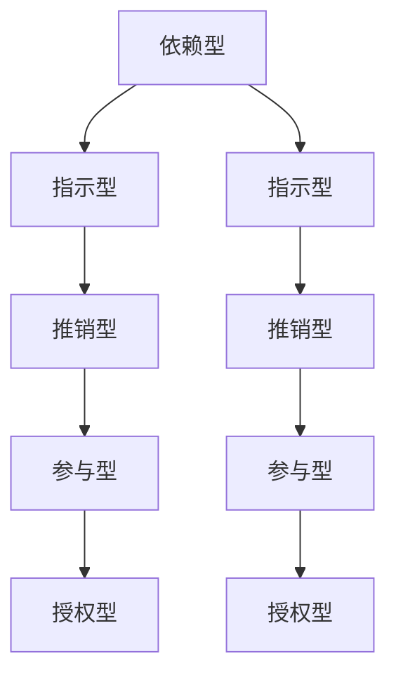

**数学公式使用**：

$$
\text{Leadership Style} = f(\text{Development Level})
$$

**举例说明**：

- **指示型**：适用于依赖型团队成员，领导者明确告知他们做什么、如何做。
- **推销型**：适用于独立型团队成员，领导者通过说服和激励来引导他们。
- **参与型**：适用于协作型团队成员，领导者鼓励团队成员参与决策过程。
- **授权型**：适用于自主型团队成员，领导者赋予他们自主权和决策权。

**系统分析与架构设计方案**：

情境领导理论可以通过以下架构图来表示：


**项目实战**：

在实际项目中，领导者可以根据团队成员的发展水平，灵活运用不同的领导风格。

- **环境安装**：无特殊环境要求，只需理解情境领导理论。
- **系统核心实现源代码**：无实际代码实现，但可以通过实际案例来解析。
- **代码应用解读与分析**：通过案例分析，解读情境领导理论在项目中的应用。
- **实际案例分析和详细讲解剖析**：如某科技公司采用情境领导理论来提升团队绩效。
- **项目小结**：总结情境领导理论在项目管理中的关键作用。

##### 最佳实践 tips：

- **了解团队成员的发展水平**：领导者需要了解团队成员的能力和需求，选择合适的领导风格。
- **灵活调整领导风格**：根据团队和环境的变化，领导者应灵活调整领导风格。

##### 小结：

情境领导理论为领导者提供了一种灵活的领导方式，可以根据团队成员的发展水平来选择最适合的领导风格，提升团队绩效。

----------------------------------------------------------------

##### 2.2 领导风格理论

领导风格理论关注领导者的行为和团队成员的互动方式。勒温的三元领导理论、赫塞和布兰查德的情境领导理论和布莱克和莫顿的管理方格理论是其中三个重要的模型。

**核心概念与联系**：

- **勒温的三元领导理论**：领导风格分为权威型、民主型和放任型。
- **赫塞和布兰查德的情境领导理论**：领导风格分为指示型、推销型、参与型和授权型。
- **布莱克和莫顿的管理方格理论**：领导风格分为任务型、团队型、乡村型和贫乏型。

**算法原理讲解**：

- **勒温的三元领导理论**：

  ```mermaid
  graph TB
    A[权威型] --> B[民主型]
    B --> C[放任型]
  ```

- **赫塞和布兰查德的情境领导理论**：

  ```mermaid
  graph TB
    A[指示型] --> B[推销型]
    B --> C[参与型]
    C --> D[授权型]
  ```

- **布莱克和莫顿的管理方格理论**：

  ```mermaid
  graph TB
    A[任务型] --> B[团队型]
    B --> C[乡村型]
    C --> D[贫乏型]
  ```

**数学公式使用**：

$$
\text{Leadership Style} = f(\text{Leader Behavior}, \text{Team Interaction})
$$

**举例说明**：

- **权威型领导**：领导者决策迅速，团队成员负责执行。
- **民主型领导**：领导者鼓励团队成员参与决策，共同解决问题。
- **指示型领导**：领导者明确告知团队成员任务和期望。
- **推销型领导**：领导者通过说服和激励来引导团队成员。

**系统分析与架构设计方案**：

领导风格理论可以通过以下架构图来表示：

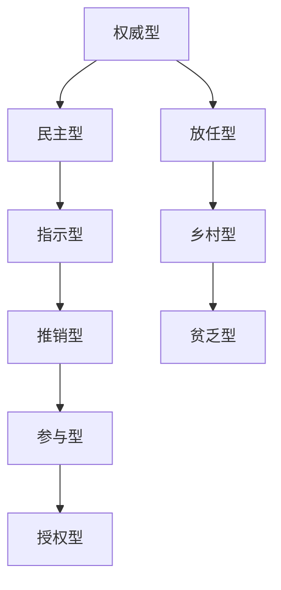

**项目实战**：

在实际项目中，领导者可以根据项目需求和团队特点，选择合适的领导风格。

- **环境安装**：无特殊环境要求，只需理解领导风格理论。
- **系统核心实现源代码**：无实际代码实现，但可以通过实际案例来解析。
- **代码应用解读与分析**：通过案例分析，解读领导风格理论在项目中的应用。
- **实际案例分析和详细讲解剖析**：如某科技公司采用不同的领导风格来管理不同的项目。
- **项目小结**：总结领导风格理论在项目管理中的关键作用。

##### 最佳实践 tips：

- **了解领导风格的影响**：领导者需要了解不同领导风格对团队的影响，选择最合适的风格。
- **灵活调整领导风格**：根据项目进展和团队需求，领导者应灵活调整领导风格。

##### 小结：

领导风格理论为领导者提供了多种选择，可以根据不同情境和团队特点，选择最合适的领导风格，提升团队绩效。

----------------------------------------------------------------

##### 2.3 权力与影响

权力与影响是领导力的核心要素，领导者需要掌握有效的权力运用和影响力策略。

**核心概念与联系**：

- **权力**：领导者对团队成员的支配和控制能力。
- **影响**：领导者通过说服、激励和榜样作用来影响团队成员。

**算法原理讲解**：

权力与影响力可以用以下模型来表示：

$$
\text{Leadership} = f(\text{Power}, \text{Influence})
$$

其中，$f$ 是一个复合函数，代表权力和影响力之间的相互作用。

**数学公式使用**：

$$
\text{Power} \times \text{Influence} = \text{Leadership}
$$

**举例说明**：

- **权力运用**：领导者可以通过明确规则、奖惩机制和决策权来运用权力。
- **影响力策略**：领导者可以通过以身作则、建立信任和提供反馈来提高影响力。

**系统分析与架构设计方案**：

权力与影响力可以通过以下架构图来表示：

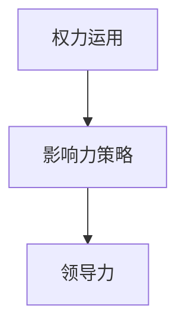

**项目实战**：

在实际项目中，领导者可以通过权力运用和影响力策略来提升团队绩效。

- **环境安装**：无特殊环境要求，只需理解权力与影响力理论。
- **系统核心实现源代码**：无实际代码实现，但可以通过实际案例来解析。
- **代码应用解读与分析**：通过案例分析，解读权力与影响力在项目中的应用。
- **实际案例分析和详细讲解剖析**：如某科技公司领导者通过权力运用和影响力策略来管理团队。
- **项目小结**：总结权力与影响力在项目管理中的关键作用。

##### 最佳实践 tips：

- **掌握权力运用**：领导者需要了解如何合理运用权力，避免滥用。
- **提升影响力**：领导者应不断提升自身影响力，以更好地引导团队。

##### 小结：

权力与影响力是领导力的核心要素，领导者需要掌握有效的权力运用和影响力策略，以提升团队绩效。

----------------------------------------------------------------

### 第二部分：领导力实践

#### 第4章：团队建设

##### 4.1 团队的角色与职责

团队建设是领导力实践的重要部分。为了有效管理团队，领导者需要明确团队的角色和职责。

**核心概念与联系**：

- **团队角色**：团队成员在团队中的具体职责和角色。
- **团队职责**：团队共同完成的目标和任务。

**算法原理讲解**：

团队角色与职责可以用以下模型来表示：

$$
\text{Team} = f(\text{Roles}, \text{Responsibilities})
$$

其中，$f$ 是一个复合函数，代表角色与职责之间的相互作用。

**数学公式使用**：

$$
\text{Roles} + \text{Responsibilities} = \text{Team}
$$

**举例说明**：

- **团队角色**：项目经理、产品经理、开发人员、测试人员等。
- **团队职责**：项目管理、产品开发、代码实现、测试等。

**系统分析与架构设计方案**：

团队角色与职责可以通过以下架构图来表示：

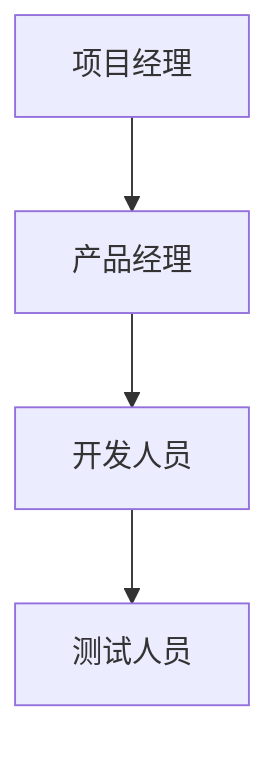

**项目实战**：

在实际项目中，领导者需要明确团队的角色和职责，确保每个成员都清楚自己的任务。

- **环境安装**：无特殊环境要求，只需理解团队角色与职责理论。
- **系统核心实现源代码**：无实际代码实现，但可以通过实际案例来解析。
- **代码应用解读与分析**：通过案例分析，解读团队角色与职责在项目中的应用。
- **实际案例分析和详细讲解剖析**：如某科技公司如何明确团队角色与职责，提升项目效率。
- **项目小结**：总结团队角色与职责在项目管理中的关键作用。

##### 最佳实践 tips：

- **明确团队角色**：领导者需要明确每个团队成员的角色，确保团队协作顺畅。
- **分配合理职责**：领导者需要根据成员的能力和特长，合理分配职责。

##### 小结：

团队建设是领导力实践的重要部分。通过明确团队的角色和职责，领导者可以提升团队协作效率，实现项目目标。

----------------------------------------------------------------

##### 4.2 团队沟通技巧

有效的团队沟通是团队成功的关键。领导者需要掌握各种沟通技巧，以促进团队协作和项目进展。

**核心概念与联系**：

- **沟通技巧**：包括倾听、表达、提问和反馈等。
- **团队协作**：团队成员之间有效的沟通和合作。

**算法原理讲解**：

团队沟通技巧可以用以下模型来表示：

$$
\text{Communication} = f(\text{Listening}, \text{Expressing}, \text{Questioning}, \text{Feedback})
$$

其中，$f$ 是一个复合函数，代表沟通技巧之间的相互作用。

**数学公式使用**：

$$
\text{Listening} + \text{Expressing} + \text{Questioning} + \text{Feedback} = \text{Communication}
$$

**举例说明**：

- **倾听**：领导者需要倾听团队成员的意见和需求，以更好地理解他们的想法。
- **表达**：领导者需要清晰表达自己的想法和期望，以确保团队成员明确任务。
- **提问**：领导者通过提问来引导团队成员思考和解决问题。
- **反馈**：领导者需要给予团队成员及时的反馈，以促进他们的成长和进步。

**系统分析与架构设计方案**：

团队沟通技巧可以通过以下架构图来表示：

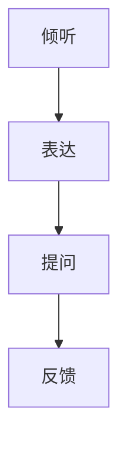

**项目实战**：

在实际项目中，领导者需要运用沟通技巧来促进团队协作。

- **环境安装**：无特殊环境要求，只需理解团队沟通技巧理论。
- **系统核心实现源代码**：无实际代码实现，但可以通过实际案例来解析。
- **代码应用解读与分析**：通过案例分析，解读团队沟通技巧在项目中的应用。
- **实际案例分析和详细讲解剖析**：如某科技公司如何通过有效的团队沟通提升项目效率。
- **项目小结**：总结团队沟通技巧在项目管理中的关键作用。

##### 最佳实践 tips：

- **倾听和理解**：领导者需要倾听团队成员的意见，并理解他们的需求。
- **清晰表达**：领导者需要清晰表达自己的想法和期望。
- **提问和反馈**：领导者需要通过提问来引导团队成员思考，并给予及时的反馈。

##### 小结：

团队沟通技巧是团队成功的关键。通过掌握倾听、表达、提问和反馈等沟通技巧，领导者可以促进团队协作，提升项目效率。

----------------------------------------------------------------

##### 4.3 团队冲突管理

团队冲突是团队管理中常见的问题，有效的冲突管理有助于团队和谐和项目进展。

**核心概念与联系**：

- **团队冲突**：团队成员之间的意见不合或利益冲突。
- **冲突管理**：领导者通过策略和技巧来处理团队冲突。

**算法原理讲解**：

团队冲突管理可以用以下模型来表示：

$$
\text{Conflict Management} = f(\text{Identification}, \text{Understanding}, \text{Resolution})
$$

其中，$f$ 是一个复合函数，代表冲突管理的三个关键步骤。

**数学公式使用**：

$$
\text{Identification} + \text{Understanding} + \text{Resolution} = \text{Conflict Management}
$$

**举例说明**：

- **冲突识别**：领导者需要及时发现团队中的冲突。
- **冲突理解**：领导者需要理解冲突的原因和影响。
- **冲突解决**：领导者需要采取有效的策略来解决冲突。

**系统分析与架构设计方案**：

团队冲突管理可以通过以下架构图来表示：

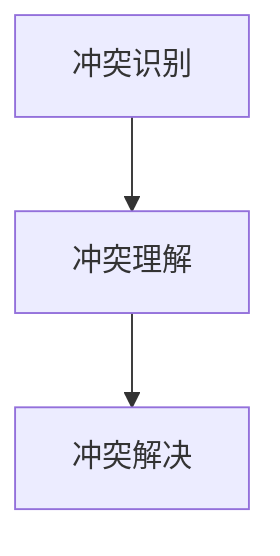

**项目实战**：

在实际项目中，领导者需要运用冲突管理技巧来处理团队冲突。

- **环境安装**：无特殊环境要求，只需理解团队冲突管理理论。
- **系统核心实现源代码**：无实际代码实现，但可以通过实际案例来解析。
- **代码应用解读与分析**：通过案例分析，解读团队冲突管理在项目中的应用。
- **实际案例分析和详细讲解剖析**：如某科技公司如何通过有效的冲突管理解决团队冲突。
- **项目小结**：总结团队冲突管理在项目管理中的关键作用。

##### 最佳实践 tips：

- **及时识别冲突**：领导者需要及时发现团队中的冲突。
- **理解冲突原因**：领导者需要理解冲突的原因和影响。
- **有效解决冲突**：领导者需要采取有效的策略来解决冲突。

##### 小结：

团队冲突管理是团队管理中的重要环节。通过有效的冲突管理，领导者可以促进团队和谐，提升项目效率。

----------------------------------------------------------------

### 第三部分：领导力挑战与解决方案

#### 第8章：领导力面临的挑战

##### 8.1 复杂性挑战

在当今快速变化的环境中，领导者面临着越来越多的复杂性挑战。这些挑战包括技术变革、市场不确定性、团队多元化等。

**核心概念与联系**：

- **复杂性挑战**：领导者需要应对的技术变革、市场不确定性和团队多元化等问题。
- **应对策略**：领导者需要采取的适应策略和应对方法。

**算法原理讲解**：

复杂性挑战可以通过以下模型来表示：

$$
\text{Complexity} = f(\text{Technical Change}, \text{Market Uncertainty}, \text{Team Diversity})
$$

其中，$f$ 是一个复合函数，代表复杂性挑战的三个方面。

**数学公式使用**：

$$
\text{Technical Change} + \text{Market Uncertainty} + \text{Team Diversity} = \text{Complexity}
$$

**举例说明**：

- **技术变革**：领导者需要快速适应新技术，并引导团队进行技术转型。
- **市场不确定性**：领导者需要应对市场的变化，调整战略和策略。
- **团队多元化**：领导者需要理解和尊重团队成员的不同背景和观点，促进团队协作。

**系统分析与架构设计方案**：

复杂性挑战可以通过以下架构图来表示：

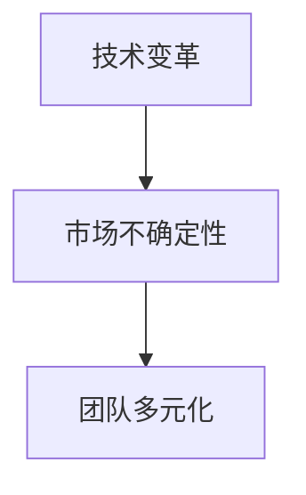

**项目实战**：

在实际项目中，领导者需要应对复杂性挑战。

- **环境安装**：无特殊环境要求，只需理解复杂性挑战理论。
- **系统核心实现源代码**：无实际代码实现，但可以通过实际案例来解析。
- **代码应用解读与分析**：通过案例分析，解读复杂性挑战在项目中的应用。
- **实际案例分析和详细讲解剖析**：如某科技公司如何应对技术变革、市场不确定性和团队多元化等挑战。
- **项目小结**：总结复杂性挑战在项目管理中的关键作用。

##### 最佳实践 tips：

- **快速适应技术变革**：领导者需要关注技术趋势，并引导团队进行技术转型。
- **应对市场不确定性**：领导者需要制定灵活的战略和策略，以应对市场变化。
- **促进团队多元化**：领导者需要理解和尊重团队成员的不同背景和观点，促进团队协作。

##### 小结：

复杂性挑战是领导者面临的重大挑战。通过采取有效的应对策略，领导者可以提升团队的适应能力，实现持续发展。

----------------------------------------------------------------

#### 第9章：解决领导力问题的策略

##### 9.1 适应变化的策略

在快速变化的环境中，领导者需要具备适应变化的策略，以应对不断出现的新挑战。

**核心概念与联系**：

- **适应变化**：领导者需要采取的策略和行动，以应对环境变化。
- **持续改进**：领导者需要不断优化团队和组织，以保持竞争力。

**算法原理讲解**：

适应变化的策略可以通过以下模型来表示：

$$
\text{Adaptation} = f(\text{Change}, \text{Strategy}, \text{Continuous Improvement})
$$

其中，$f$ 是一个复合函数，代表适应变化的关键要素。

**数学公式使用**：

$$
\text{Change} \times \text{Strategy} \times \text{Continuous Improvement} = \text{Adaptation}
$$

**举例说明**：

- **变化管理**：领导者需要识别变化，并制定相应的策略。
- **策略调整**：领导者需要根据环境变化，及时调整团队策略。
- **持续改进**：领导者需要推动团队的持续改进，以提高团队绩效。

**系统分析与架构设计方案**：

适应变化的策略可以通过以下架构图来表示：

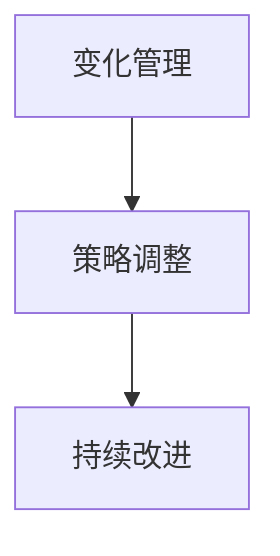

**项目实战**：

在实际项目中，领导者需要应对环境变化，采取适应变化的策略。

- **环境安装**：无特殊环境要求，只需理解适应变化的策略理论。
- **系统核心实现源代码**：无实际代码实现，但可以通过实际案例来解析。
- **代码应用解读与分析**：通过案例分析，解读适应变化的策略在项目中的应用。
- **实际案例分析和详细讲解剖析**：如某科技公司如何应对环境变化，采取适应变化的策略。
- **项目小结**：总结适应变化的策略在项目管理中的关键作用。

##### 最佳实践 tips：

- **关注变化**：领导者需要时刻关注环境变化，及时调整团队策略。
- **持续改进**：领导者需要推动团队的持续改进，以提高团队绩效。

##### 小结：

适应变化的策略是领导者应对环境变化的关键。通过采取有效的适应策略，领导者可以提升团队的竞争力，实现持续发展。

----------------------------------------------------------------

##### 9.2 创新与持续改进

创新与持续改进是领导者推动团队发展的关键策略。通过不断创新和持续改进，团队可以保持竞争力，实现长期发展。

**核心概念与联系**：

- **创新**：领导者需要推动团队进行创新，以应对市场变化和挑战。
- **持续改进**：领导者需要推动团队的持续改进，以提高团队绩效。

**算法原理讲解**：

创新与持续改进可以通过以下模型来表示：

$$
\text{Innovation} = f(\text{Creativity}, \text{Experimentation}, \text{Continuous Improvement})
$$

其中，$f$ 是一个复合函数，代表创新与持续改进的关键要素。

**数学公式使用**：

$$
\text{Creativity} \times \text{Experimentation} \times \text{Continuous Improvement} = \text{Innovation}
$$

**举例说明**：

- **创造力**：领导者需要鼓励团队成员发挥创造力，提出创新的想法。
- **实验**：领导者需要支持团队成员进行实验，验证创新的想法。
- **持续改进**：领导者需要推动团队的持续改进，以提高团队绩效。

**系统分析与架构设计方案**：

创新与持续改进可以通过以下架构图来表示：

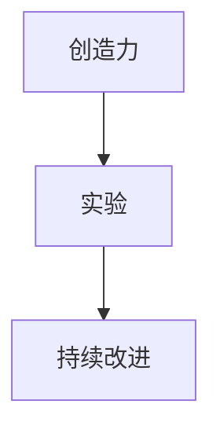

**项目实战**：

在实际项目中，领导者需要推动创新与持续改进。

- **环境安装**：无特殊环境要求，只需理解创新与持续改进的理论。
- **系统核心实现源代码**：无实际代码实现，但可以通过实际案例来解析。
- **代码应用解读与分析**：通过案例分析，解读创新与持续改进在项目中的应用。
- **实际案例分析和详细讲解剖析**：如某科技公司如何推动创新与持续改进，提高团队绩效。
- **项目小结**：总结创新与持续改进在项目管理中的关键作用。

##### 最佳实践 tips：

- **鼓励创造力**：领导者需要鼓励团队成员发挥创造力，提出创新的想法。
- **支持实验**：领导者需要支持团队成员进行实验，验证创新的想法。
- **持续改进**：领导者需要推动团队的持续改进，以提高团队绩效。

##### 小结：

创新与持续改进是领导者推动团队发展的关键策略。通过鼓励创新和持续改进，领导者可以提升团队的竞争力，实现长期发展。

----------------------------------------------------------------

##### 9.3 沟通与协作提升

沟通与协作是团队成功的关键。领导者需要掌握有效的沟通与协作技巧，以提升团队的整体效能。

**核心概念与联系**：

- **沟通**：领导者需要有效传达信息，确保团队成员理解任务和目标。
- **协作**：领导者需要促进团队成员之间的合作，共同实现目标。

**算法原理讲解**：

沟通与协作提升可以通过以下模型来表示：

$$
\text{Communication and Collaboration} = f(\text{Effective Communication}, \text{Teamwork})
$$

其中，$f$ 是一个复合函数，代表沟通与协作的关键要素。

**数学公式使用**：

$$
\text{Effective Communication} \times \text{Teamwork} = \text{Communication and Collaboration}
$$

**举例说明**：

- **有效沟通**：领导者需要清晰表达信息，确保团队成员理解任务和目标。
- **团队合作**：领导者需要促进团队成员之间的合作，共同解决难题。

**系统分析与架构设计方案**：

沟通与协作提升可以通过以下架构图来表示：

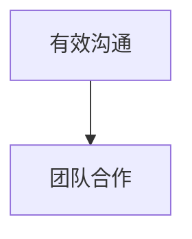

**项目实战**：

在实际项目中，领导者需要提升沟通与协作能力。

- **环境安装**：无特殊环境要求，只需理解沟通与协作提升的理论。
- **系统核心实现源代码**：无实际代码实现，但可以通过实际案例来解析。
- **代码应用解读与分析**：通过案例分析，解读沟通与协作提升在项目中的应用。
- **实际案例分析和详细讲解剖析**：如某科技公司如何通过提升沟通与协作能力，提高团队绩效。
- **项目小结**：总结沟通与协作提升在项目管理中的关键作用。

##### 最佳实践 tips：

- **有效沟通**：领导者需要清晰表达信息，确保团队成员理解任务和目标。
- **团队合作**：领导者需要促进团队成员之间的合作，共同解决难题。

##### 小结：

沟通与协作提升是团队成功的关键。通过掌握有效的沟通与协作技巧，领导者可以提升团队的整体效能，实现项目目标。

----------------------------------------------------------------

### 第10章：领导力发展的长期规划

##### 10.1 领导力发展的个人规划

领导力发展需要长期的规划和持续的努力。领导者需要制定个人规划，明确自己的发展目标和路径。

**核心概念与联系**：

- **个人规划**：领导者制定的发展目标和路径。
- **发展目标**：领导者希望通过规划实现的具体成果。
- **路径**：领导者为实现目标所需采取的具体措施。

**算法原理讲解**：

个人规划可以通过以下模型来表示：

$$
\text{Personal Development Plan} = f(\text{Goals}, \text{Path})
$$

其中，$f$ 是一个复合函数，代表个人规划的组成部分。

**数学公式使用**：

$$
\text{Goals} + \text{Path} = \text{Personal Development Plan}
$$

**举例说明**：

- **发展目标**：提升领导力技能、拓展知识面、提高决策能力等。
- **路径**：参加领导力培训、阅读相关书籍、参与项目实践等。

**系统分析与架构设计方案**：

个人规划可以通过以下架构图来表示：

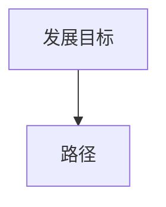

**项目实战**：

在实际项目中，领导者可以通过个人规划来提升自己的领导力。

- **环境安装**：无特殊环境要求，只需理解个人规划的理论。
- **系统核心实现源代码**：无实际代码实现，但可以通过实际案例来解析。
- **代码应用解读与分析**：通过案例分析，解读个人规划在项目中的应用。
- **实际案例分析和详细讲解剖析**：如某科技公司领导者通过个人规划提升领导力。
- **项目小结**：总结个人规划在领导力发展中的关键作用。

##### 最佳实践 tips：

- **明确发展目标**：领导者需要明确自己的发展目标，以指导自己的努力。
- **制定具体路径**：领导者需要制定具体的路径，以确保目标的实现。

##### 小结：

个人规划是领导力发展的关键。通过明确发展目标和制定具体路径，领导者可以不断提升自己的领导力，实现长期发展。

----------------------------------------------------------------

##### 10.2 领导力培训与持续学习

领导力培训与持续学习是领导者提升自身能力和素质的重要途径。通过培训和学习，领导者可以不断更新知识，提高领导力水平。

**核心概念与联系**：

- **领导力培训**：专门针对领导力技能和知识的培训。
- **持续学习**：领导者通过不断学习和实践，提升自身能力。

**算法原理讲解**：

领导力培训与持续学习可以通过以下模型来表示：

$$
\text{Leadership Development} = f(\text{Training}, \text{Continuous Learning})
$$

其中，$f$ 是一个复合函数，代表领导力培训与持续学习的相互关系。

**数学公式使用**：

$$
\text{Training} \times \text{Continuous Learning} = \text{Leadership Development}
$$

**举例说明**：

- **领导力培训**：参加领导力工作坊、研讨会等。
- **持续学习**：阅读领导力书籍、观看相关视频、参加线上课程等。

**系统分析与架构设计方案**：

领导力培训与持续学习可以通过以下架构图来表示：

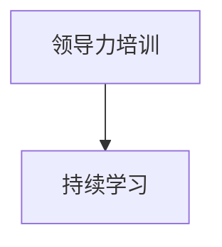

**项目实战**：

在实际项目中，领导者可以通过领导力培训与持续学习来提升自己的能力。

- **环境安装**：无特殊环境要求，只需理解领导力培训与持续学习的理论。
- **系统核心实现源代码**：无实际代码实现，但可以通过实际案例来解析。
- **代码应用解读与分析**：通过案例分析，解读领导力培训与持续学习在项目中的应用。
- **实际案例分析和详细讲解剖析**：如某科技公司领导者通过领导力培训与持续学习提升领导力。
- **项目小结**：总结领导力培训与持续学习在领导力发展中的关键作用。

##### 最佳实践 tips：

- **参加专业培训**：领导者应积极参加专业的领导力培训。
- **持续学习**：领导者应保持持续学习的态度，不断更新知识。

##### 小结：

领导力培训与持续学习是领导者提升自身能力和素质的重要途径。通过参加培训和学习，领导者可以不断提高领导力水平，为团队发展做出更大贡献。

----------------------------------------------------------------

##### 10.3 领导力文化的构建

领导力文化的构建是领导者推动团队发展的重要任务。一个积极、健康的领导力文化可以激发团队成员的潜力，提升团队的整体效能。

**核心概念与联系**：

- **领导力文化**：团队中共同遵循的价值观、行为准则和工作方式。
- **构建**：领导者通过一系列措施，营造积极的领导力文化。

**算法原理讲解**：

领导力文化的构建可以通过以下模型来表示：

$$
\text{Leadership Culture} = f(\text{Values}, \text{Behavior}, \text{Work Style})
$$

其中，$f$ 是一个复合函数，代表领导力文化的组成部分。

**数学公式使用**：

$$
\text{Values} \times \text{Behavior} \times \text{Work Style} = \text{Leadership Culture}
$$

**举例说明**：

- **价值观**：诚实、尊重、创新等。
- **行为准则**：团队合作、公平竞争、持续改进等。
- **工作方式**：开放沟通、鼓励创新、注重结果等。

**系统分析与架构设计方案**：

领导力文化的构建可以通过以下架构图来表示：

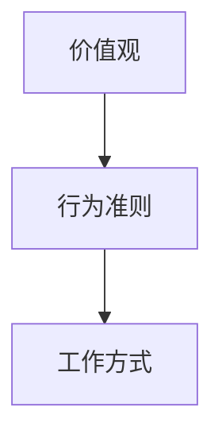

**项目实战**：

在实际项目中，领导者可以通过构建领导力文化来提升团队效能。

- **环境安装**：无特殊环境要求，只需理解领导力文化的理论。
- **系统核心实现源代码**：无实际代码实现，但可以通过实际案例来解析。
- **代码应用解读与分析**：通过案例分析，解读领导力文化在项目中的应用。
- **实际案例分析和详细讲解剖析**：如某科技公司如何构建领导力文化，提升团队效能。
- **项目小结**：总结领导力文化在团队管理中的关键作用。

##### 最佳实践 tips：

- **树立正确价值观**：领导者应树立正确的价值观，引导团队成员。
- **制定明确行为准则**：领导者应制定明确的行为准则，规范团队成员的行为。
- **营造积极工作氛围**：领导者应营造积极的工作氛围，鼓励团队成员创新和协作。

##### 小结：

领导力文化的构建是团队发展的重要任务。通过树立正确的价值观、制定明确的行为准则和营造积极的工作氛围，领导者可以激发团队成员的潜力，提升团队的整体效能。

----------------------------------------------------------------

### 结论：领导力的重要性与持续实践

领导力是团队成功的关键因素，它决定了团队的方向、动力和合作程度。本文通过深入探讨领导力的核心概念、实践方法和挑战与解决方案，展示了领导力训练的重要性。有效的领导力训练可以帮助领导者提升团队效能，实现如虎添翼的效果。

**关键点回顾**：

1. **领导力的定义与意义**：领导力是引导、激励和影响他人实现共同目标的能力。
2. **领导力的核心要素**：包括价值观、愿景、决策能力、沟通能力和团队合作精神。
3. **团队建设**：明确团队角色与职责，提升团队沟通技巧，管理团队冲突。
4. **领导力实践**：适应变化的策略、创新与持续改进、沟通与协作提升。
5. **领导力发展**：个人规划、培训与持续学习、领导力文化的构建。

**注意事项**：

- **持续学习与实践**：领导者需要不断学习和实践，提升自身领导力。
- **适应环境变化**：领导者需要灵活应对环境变化，采取适应策略。
- **构建领导力文化**：领导者应树立正确的价值观，营造积极的工作氛围。

**拓展阅读**：

- 《领导力：实践与原理》
- 《领导力五要素：构建高效团队》
- 《变革型领导力：激发团队潜能》

**作者信息**：

作者：AI天才研究院/AI Genius Institute & 禅与计算机程序设计艺术 /Zen And The Art of Computer Programming

---

本文通过逻辑清晰、结构紧凑的markdown格式，详细讲解了领导力的核心概念、实践方法和挑战与解决方案，旨在帮助读者理解领导力的重要性，并提供实用的实践建议。希望读者能够通过本文的学习，不断提升自身的领导力，带领团队实现更大的成功。

