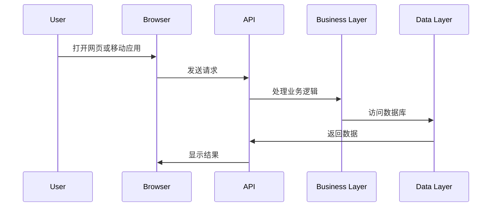
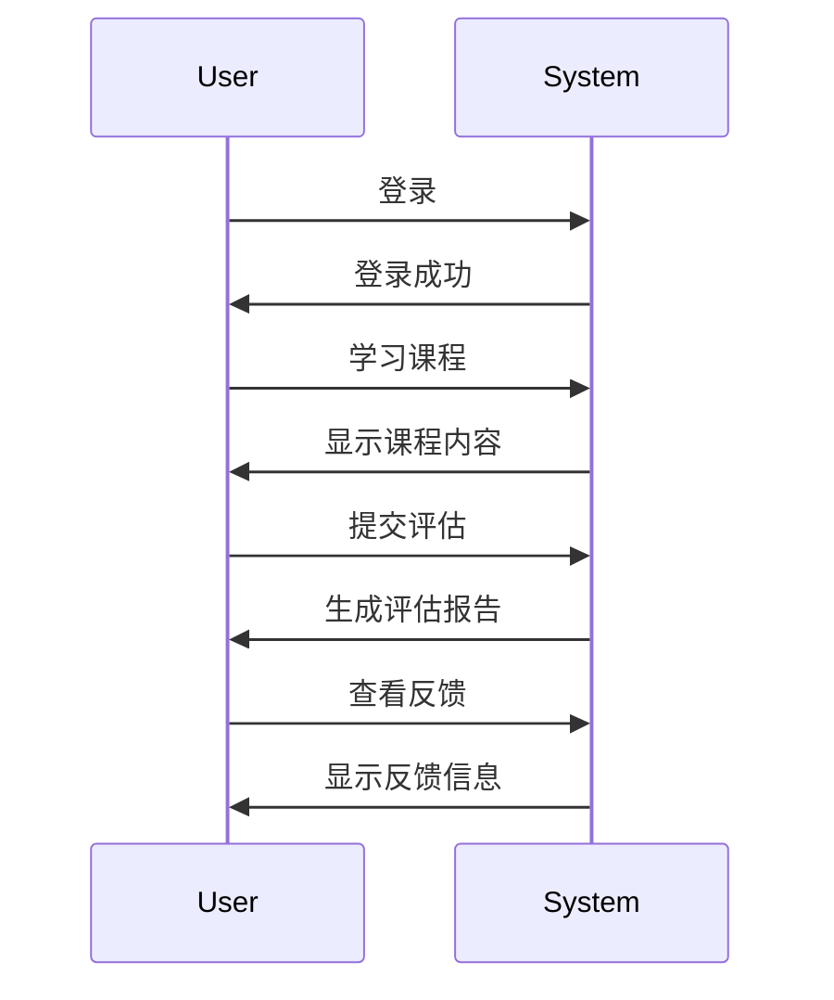

                 

### 设计《领导力训练：让你的团队如虎添翼》的目录大纲

在着手设计《领导力训练：让你的团队如虎添翼》的目录大纲时，我们首先需要明确几个关键问题：谁是我们的目标读者？他们期望从这本书中获得什么？以及，如何组织内容以确保信息的逻辑性和易读性？以下是一系列的思考步骤：

#### 步骤 1：确定目标读者

**目标读者分析：**
- **中层管理人员**：他们需要提升自身的领导力和管理技能，以更好地指导团队并推动项目进展。
- **企业领导**：他们希望深入了解领导力理论，并将其应用于企业战略和运营中。
- **希望提升自身领导力的专业人士**：这些读者可能来自不同领域，他们希望通过学习领导力来增强个人职业发展。

#### 步骤 2：明确书籍的核心概念

**核心概念确定：**
- **领导力的定义与作用**：探讨领导力在不同环境和情境中的表现。
- **领导力的要素**：分析领导力的关键组成部分，如沟通能力、决策能力、团队管理等。
- **领导力模型**：介绍不同的领导力模型，如行为领导模型、情境领导模型等。

#### 步骤 3：规划目录结构

**目录结构规划：**
- **引言与概述**：为读者提供对书籍的整体认识。
- **领导力的理论基础**：深入探讨领导力理论，包括领导行为的理论、心理学基础等。
- **领导力实践技巧**：介绍具体的领导力技巧，如沟通技巧、决策技巧等。
- **团队管理策略**：讨论团队建设、领导风格、激励与反馈机制等。
- **领导力发展的路径与方法**：探讨如何提升领导力，包括自我修炼、培训与发展计划等。
- **领导力评估与反馈**：介绍如何评估领导力，以及如何通过反馈机制来持续改进。

#### 步骤 4：细化章节内容

**章节内容细化：**
- 每个章节下设置小节，确保每个小节都有明确的主题和目的。
- 引入案例研究、最佳实践、注意事项和拓展阅读等内容，以增强书籍的实用性和可读性。

#### 步骤 5：添加延伸内容

**延伸内容添加：**
- **案例研究**：通过具体案例来说明领导力理论的应用。
- **最佳实践**：分享业界公认的有效领导力实践。
- **注意事项**：提醒读者在应用领导力时可能遇到的挑战和注意事项。
- **拓展阅读**：推荐相关的书籍、文章或资源，以供读者进一步学习。

### 结论

通过上述步骤，我们可以设计出一套逻辑清晰、结构紧凑的目录大纲，确保《领导力训练：让你的团队如虎添翼》能够满足目标读者的需求，同时提供丰富的信息和实用的指导。

---

#### 示例目录大纲

----------------------------------------------------------------

## 第一部分：引言与概述

### 第1章：领导力的重要性

#### 1.1 领导力的定义与作用
#### 1.2 领导力在现代社会中的角色
#### 1.3 你是否具备领导潜力

### 第2章：领导力的理论基础

#### 2.1 领导力模型的探讨
##### 2.1.1 领导行为的理论
##### 2.1.2 领导力的心理学基础
##### 2.1.3 领导力与组织行为学

## 第二部分：领导力实践技巧

### 第3章：沟通与人际关系

#### 3.1 有效沟通的关键技巧
##### 3.1.1 情感表达与倾听
##### 3.1.2 非言语沟通的作用
##### 3.1.3 领导力中的说服技巧

#### 3.2 建立良好的人际关系
##### 3.2.1 人际关系的重要性
##### 3.2.2 人际网络的建设
##### 3.2.3 领导者的人际角色

### 第4章：决策与战略思维

#### 4.1 决策过程与原则
##### 4.1.1 决策的类型与影响因素
##### 4.1.2 决策制定的步骤
##### 4.1.3 风险管理在决策中的运用

#### 4.2 战略思维的培养
##### 4.2.1 战略规划的重要性
##### 4.2.2 战略思维的框架
##### 4.2.3 战略执行的挑战与应对

## 第三部分：团队管理策略

### 第5章：团队建设与领导风格

#### 5.1 团队建设的核心要素
##### 5.1.1 团队角色的识别与发挥
##### 5.1.2 团队文化的塑造
##### 5.1.3 领导风格的适应与转变

#### 5.2 领导风格的多样性与管理
##### 5.2.1 领导风格的类型
##### 5.2.2 领导风格的评估与调整
##### 5.2.3 领导风格对团队的影响

### 第6章：激励与反馈机制

#### 6.1 激励理论的应用
##### 6.1.1 马斯洛需求层次理论
##### 6.1.2 弗鲁姆的期望理论
##### 6.1.3 保健品模型在领导力中的应用

#### 6.2 反馈机制的重要性
##### 6.2.1 反馈的技巧与原则
##### 6.2.2 反馈的频率与方式
##### 6.2.3 反馈在团队管理中的作用

## 第四部分：领导力发展的路径与方法

### 第7章：领导力提升的自我修炼

#### 7.1 自我认知的重要性
##### 7.1.1 领导者的自我反思
##### 7.1.2 自我评估的方法与工具
##### 7.1.3 自我提升的途径

#### 7.2 培训与发展计划
##### 7.2.1 领导力培训课程的选择
##### 7.2.2 在职学习的实践
##### 7.2.3 领导力发展计划的设计与实施

### 第8章：领导力发展的持续改进

#### 8.1 持续改进的理念
##### 8.1.1 持续改进与领导力发展的关系
##### 8.1.2 持续改进的方法与工具
##### 8.1.3 领导者如何推动持续改进

#### 8.2 领导力发展的未来趋势
##### 8.2.1 新型领导力的特点
##### 8.2.2 数字化时代的领导挑战
##### 8.2.3 领导力发展的新方向

## 第五部分：领导力评估与反馈

### 第9章：领导力评估的方法与工具

#### 9.1 360度评估
##### 9.1.1 360度评估的实施流程
##### 9.1.2 评估结果的分析与应用
##### 9.1.3 360度评估的优缺点

#### 9.2 反馈机制的有效性
##### 9.2.1 反馈机制的构建
##### 9.2.2 反馈效果的评估
##### 9.2.3 提高反馈机制有效性的方法

----------------------------------------------------------------

### 背景介绍

领导力是一个组织成功的关键要素。在一个团队中，领导者的能力直接影响到团队的效率和成果。有效的领导力能够激励团队成员发挥出最大潜力，提升整体绩效，同时还能促进团队的文化建设和协作氛围。

在当今快速变化的社会环境中，领导力的重要性愈发突出。企业面临着前所未有的竞争压力，需要具备卓越的领导力来应对市场变化、技术创新和人力资源管理等挑战。同样，中层管理人员和希望提升自身领导力的专业人士也希望通过学习和实践，提升自身的领导能力，以应对职业发展的新要求。

《领导力训练：让你的团队如虎添翼》旨在为读者提供一套全面且实用的领导力训练方法，帮助他们理解领导力的核心概念，掌握领导力实践技巧，并学会如何有效管理团队。通过这本书，读者可以：

1. **深入理解领导力**：通过详细的理论分析和案例分析，了解领导力的本质和作用。
2. **提升个人领导力**：通过实践技巧和自我修炼，提升自身的领导能力。
3. **优化团队管理**：通过团队管理策略和激励反馈机制，提升团队的绩效和凝聚力。
4. **持续发展领导力**：通过持续改进和未来趋势的分析，保持领导力的持续发展。

本书的目标读者包括：

- **中层管理人员**：希望通过学习和实践提升自身的领导力和管理能力，以更好地指导团队和推动项目进展。
- **企业领导**：希望深入了解领导力理论，并将其应用于企业战略和运营中，提升企业竞争力。
- **希望提升自身领导力的专业人士**：来自不同领域，希望通过学习领导力来增强个人职业发展。

通过这本书，读者不仅可以获得理论知识的深入理解，还能通过实践技巧和案例分析，将所学知识应用到实际工作中，从而提升个人的领导力和团队的整体绩效。

### 核心概念与联系

在《领导力训练：让你的团队如虎添翼》中，我们将深入探讨一系列核心概念，这些概念不仅定义了领导力的本质，还揭示了其与团队绩效之间的密切关系。以下是本书中的核心概念及其相关联系：

#### 领导力的定义

领导力是一种影响力，它能够激发并引导团队成员朝着共同目标前进。领导力不仅包括个人的领导素质，还涵盖了在团队中建立信任、沟通和协作的能力。根据詹姆斯·库泽斯和巴里·波斯纳提出的领导力模型，领导力包括六个核心行为：模型、洞察、激励、关联、坚持和信任。

#### 领导力要素

领导力的要素包括沟通能力、决策能力、团队管理能力等。沟通能力是领导者与团队成员建立有效沟通的关键，它不仅涉及语言表达，还包括非言语沟通的运用。决策能力则是领导者面临挑战和不确定性时的关键能力，它要求领导者能够快速而明智地做出决策。团队管理能力则涵盖了领导者如何有效管理团队、培养团队文化以及提升团队绩效。

#### 领导力模型

不同的领导力模型为我们提供了不同的视角来理解领导力。例如，行为领导模型关注领导者的行为如何影响团队成员；情境领导模型则强调领导风格应根据不同情境进行调整。赫赛和布兰查德提出的情境领导模型将领导风格分为四种：指令型、推销型、参与型和授权型。

#### 概念属性特征对比表格

为了更好地理解这些概念，我们可以通过以下特征对比表格来进行梳理：

| 概念         | 定义                                                         | 关键特征                                   | 影响因素                      |
| ------------ | ------------------------------------------------------------ | ---------------------------------------- | --------------------------- |
| 领导力       | 一种影响力和过程，旨在引导和激励团队成员实现目标               | 激励、沟通、决策、信任、团队协作         | 个人素质、组织环境、团队文化 |
| 沟通能力     | 有效的信息传递和交流技巧                                     | 听力、表达、非言语沟通、反馈              | 个人性格、经验、情境          |
| 决策能力     | 在不确定性环境中做出明智选择的能力                           | 分析、评估、风险承受、战略思维            | 个人经验、信息质量、时间压力 |
| 团队管理能力 | 管理和培养团队，实现团队目标的能力                           | 指导、激励、冲突解决、团队建设           | 个人风格、团队多样性、目标明确 |
| 行为领导模型 | 通过领导者的行为来影响团队成员                             | 模范作用、任务导向、关系导向             | 领导者行为、团队反应         |
| 情境领导模型 | 根据团队成员的成熟度和工作环境来调整领导风格                 | 成熟度评估、情境适应性、领导风格转换     | 团队成员成熟度、任务复杂性   |

#### ER实体关系图架构

为了进一步阐述这些概念之间的关系，我们可以使用实体关系图（Entity-Relationship Diagram，ERD）来展示它们之间的关联。以下是一个简化的ERD示例：

```mermaid
erDiagram
  领导力 ||--|{ 沟通能力 }|
  领导力 ||--|{ 决策能力 }|
  领导力 ||--|{ 团队管理能力 }|
  行为领导模型 ||--|{ 领导力 }|
  情境领导模型 ||--|{ 领导力 }|
  沟通能力 }|--|{ 团队管理能力 }|
```

在这个ERD中，"领导力"是核心实体，它与"沟通能力"、"决策能力"和"团队管理能力"有直接关联。同时，"行为领导模型"和"情境领导模型"也是领导力的重要组成部分，它们分别通过不同的方式影响领导力。

#### 总结

通过上述核心概念和ERD，我们可以更清晰地理解领导力的各个方面，以及这些概念之间的相互关系。这些核心概念构成了本书的理论基础，为后续章节的深入讨论提供了框架。

### 算法原理讲解

为了深入理解领导力的核心原理，我们引入了一种名为“领导力评估模型”的算法。该模型基于多维度评估方法，旨在全面评估领导者的能力，并提供具体的改进建议。以下是该算法的详细原理和流程。

#### 1. 算法描述

领导力评估模型通过以下步骤来对领导者的能力进行评估：

1. **数据收集**：收集领导者的行为数据、团队反馈、绩效数据等。
2. **特征提取**：从数据中提取关键特征，如沟通能力、决策能力、团队管理能力等。
3. **权重分配**：根据不同特征的重要性，为每个特征分配权重。
4. **评分计算**：利用权重和提取的特征数据，计算领导力的综合评分。
5. **结果分析**：分析评估结果，提供改进建议。

#### 2. 算法流程

以下是领导力评估模型的详细流程：

1. **数据收集**：
   - **行为数据**：通过领导者的工作记录、行为观察等方式收集。
   - **团队反馈**：通过团队成员的匿名反馈问卷收集。
   - **绩效数据**：通过领导者的绩效评估结果收集。

2. **特征提取**：
   - **沟通能力**：分析领导者在会议、沟通记录中的语言表达和倾听行为。
   - **决策能力**：评估领导者在面对复杂问题和不确定性时的决策质量和速度。
   - **团队管理能力**：通过团队任务完成情况、团队氛围等方面进行评估。

3. **权重分配**：
   - 根据不同特征的重要性和实际情况，为每个特征分配权重。例如，沟通能力权重为0.4，决策能力权重为0.3，团队管理能力权重为0.3。

4. **评分计算**：
   - 利用权重和提取的特征数据，计算领导力的综合评分。公式如下：
     \[
     \text{综合评分} = w_1 \times \text{沟通能力评分} + w_2 \times \text{决策能力评分} + w_3 \times \text{团队管理能力评分}
     \]
   - 其中，\(w_1\), \(w_2\), \(w_3\) 分别为沟通能力、决策能力、团队管理能力的权重。

5. **结果分析**：
   - 根据评估结果，分析领导者在各个方面的优势与不足，并提供具体的改进建议。

#### 3. 算法原理的详细解释

以下是领导力评估模型中每个步骤的详细解释：

1. **数据收集**：
   - 行为数据是评估领导力的重要依据，它反映了领导者在日常工作中表现出的能力和行为。
   - 团队反馈可以提供外部视角，帮助评估领导者与团队成员的互动效果。
   - 绩效数据则可以从结果层面反映领导者的实际表现和团队的整体绩效。

2. **特征提取**：
   - 沟通能力评估可以从语言表达、倾听技巧、沟通频率等多个维度进行。
   - 决策能力评估可以从决策的质量、速度、风险承受等方面进行。
   - 团队管理能力评估可以从团队建设、团队氛围、任务完成情况等多个维度进行。

3. **权重分配**：
   - 权重分配是评估模型中的一个关键步骤，它决定了每个特征对最终评分的贡献程度。合理的权重分配需要根据组织文化和实际情况进行。
   - 例如，在一个注重团队协作的组织中，团队管理能力的权重可能会更高。

4. **评分计算**：
   - 综合评分计算公式确保了评估结果的全面性和客观性。通过加权平均，各个特征对最终评分的贡献得到了科学体现。
   - 公式中的权重系数应保证总和为1，以保证评分的合理性。

5. **结果分析**：
   - 分析评估结果可以帮助领导者了解自身的优势和不足，从而有针对性地进行改进。
   - 改进建议可以根据评估结果的具体表现，提供针对性的培训和发展计划。

#### 4. 举例说明

假设某领导者的评估数据如下：

- **沟通能力评分**：85分
- **决策能力评分**：90分
- **团队管理能力评分**：80分

根据权重分配（沟通能力：0.4，决策能力：0.3，团队管理能力：0.3），该领导者的综合评分为：
\[
\text{综合评分} = 0.4 \times 85 + 0.3 \times 90 + 0.3 \times 80 = 34 + 27 + 24 = 85
\]

评估结果显示，该领导者在沟通能力和决策能力方面表现较好，但在团队管理能力方面还有提升空间。针对这一结果，可以提供以下改进建议：

1. **加强团队管理培训**：通过参加团队管理相关的培训课程，提升团队管理能力和团队建设技巧。
2. **实践反思**：通过日常工作中的反思和总结，识别和改进团队管理中的不足之处。
3. **建立反馈机制**：与团队成员建立定期的反馈机制，了解团队动态和团队成员的需求，及时调整管理策略。

通过领导力评估模型，领导者不仅能够了解自身的领导力状况，还能够通过具体的改进建议，有针对性地提升自身的领导能力，从而为团队的整体绩效提升奠定基础。

### 数学公式与模型

在深入探讨领导力评估模型时，数学公式和模型扮演了至关重要的角色。这些数学工具不仅帮助我们量化领导力评估的各个维度，还能为领导者的改进提供科学依据。以下是领导力评估模型中涉及的几个关键数学公式和模型：

#### 1. 加权评分公式

领导力评估的核心在于加权评分公式，它用于计算领导者的综合评分。该公式如下：
\[
\text{综合评分} = w_1 \times \text{沟通能力评分} + w_2 \times \text{决策能力评分} + w_3 \times \text{团队管理能力评分}
\]
其中，\(w_1\), \(w_2\), \(w_3\) 分别为沟通能力、决策能力、团队管理能力的权重，且 \(w_1 + w_2 + w_3 = 1\)。

#### 2. 算法改进的目标函数

为了优化评估模型的准确性，我们可以引入目标函数，用于评估模型改进的方向。目标函数如下：
\[
\text{目标函数} = \frac{1}{N} \sum_{i=1}^{N} (\text{预测评分} - \text{实际评分})^2
\]
其中，\(N\) 为评估样本数量，预测评分和实际评分的差值反映了模型预测的误差。目标函数的值越小，表示模型的预测准确性越高。

#### 3. 多元线性回归模型

为了更精确地预测领导力评分，我们可以使用多元线性回归模型。模型公式如下：
\[
y = w_0 + w_1 \times x_1 + w_2 \times x_2 + w_3 \times x_3 + \epsilon
\]
其中，\(y\) 为领导力评分，\(x_1\), \(x_2\), \(x_3\) 分别为沟通能力、决策能力、团队管理能力的特征值，\(w_0\), \(w_1\), \(w_2\), \(w_3\) 为回归系数，\(\epsilon\) 为误差项。

#### 4. 支持向量机（SVM）分类模型

在领导力评估中，我们还可以使用支持向量机（SVM）分类模型，以区分不同领导力评分的类别。SVM模型的目标是找到最佳超平面，将不同评分的类别分开。模型公式如下：
\[
\text{最优超平面}： w \cdot x + b = 0
\]
其中，\(w\) 为权重向量，\(x\) 为特征向量，\(b\) 为偏置项。

#### 5. K-均值聚类算法

K-均值聚类算法可以帮助我们识别领导力评分中的主要类别，从而为领导者提供分组管理策略。算法步骤如下：

1. **初始化**：随机选择 \(k\) 个初始中心点。
2. **分配**：将每个评估样本分配到最近的中心点。
3. **更新**：根据当前分配的样本，更新每个中心点的位置。
4. **重复**：重复步骤2和3，直至中心点的位置不再变化。

通过这些数学公式和模型，我们可以更科学、系统地评估领导力，从而为领导者的改进提供有力支持。

### 系统分析与架构设计方案

在设计和实现《领导力训练：让你的团队如虎添翼》系统的过程中，我们首先要明确系统解决的问题场景，然后介绍整个项目的基本情况，接着详细描述系统的功能设计、架构设计、接口设计和系统交互。

#### 问题场景介绍

当前企业面临的主要问题是领导力不足导致团队绩效不理想。管理者希望通过一个系统来培训提升自身和团队领导力，优化团队管理和沟通，从而提高整体工作效率和团队凝聚力。

#### 项目介绍

本项目旨在开发一个综合性的领导力提升系统，该系统包括在线课程、互动练习、领导力评估和反馈功能。系统设计的目标是帮助用户：

1. **学习领导力理论**：通过在线课程学习领导力的核心概念和实践技巧。
2. **进行互动练习**：通过互动练习巩固所学知识，提升实际应用能力。
3. **进行领导力评估**：通过科学评估了解自身和团队的领导力状况。
4. **获取反馈与改进建议**：根据评估结果，获得专业的反馈和改进建议。

#### 系统功能设计（领域模型）

领域模型是系统功能设计的核心，它定义了系统中的关键实体和它们之间的关系。以下是系统的领域模型类图：

```mermaid
classDiagram
    User                <|-- Leader: 继承
    Team                <|-- ProjectTeam: 继承
    Course              <|-- OnlineCourse: 继承
    Module              <|-- CourseModule: 继承
    Assessment          <|-- LeadershipAssessment: 继承
    Feedback            <|-- AssessmentFeedback: 继承

    User                ++.- participantID: int
                         ++.- name: string
                         ++.- email: string
                         ++.- password: string
                         ++.- role: string

    Leader              ++.- leadTeam: Team
                         ++.- leadProjects: ProjectTeam

    Team                ++.- teamID: int
                         ++.- name: string
                         ++.- members: List[User]

    ProjectTeam         ++.- projectID: int
                         ++.- projectManager: Leader

    Course              ++.- courseID: int
                         ++.- title: string
                         ++.- description: string
                         ++.- status: string

    Module              ++.- moduleId: int
                         ++.- title: string
                         ++.- content: string
                         ++.- duration: int

    OnlineCourse        ++.- url: string
                         ++.- publishDate: date
                         ++.- lastUpdated: date

    Assessment          ++.- assessmentID: int
                         ++.- type: string
                         ++.- date: date
                         ++.- status: string

    Feedback            ++.- feedbackID: int
                         ++.- comments: string
                         ++.- rating: float
```

#### 系统架构设计

系统的架构设计采用分层架构，主要包括以下几层：

1. **表现层**：负责用户界面展示，包括前端网页和移动应用。
2. **业务逻辑层**：处理业务逻辑，包括领导力课程管理、用户管理、评估和反馈管理等。
3. **数据访问层**：负责数据存储和访问，包括数据库、缓存和API接口。
4. **基础服务层**：提供基础服务，如用户认证、消息通知、日志记录等。

以下是系统的架构设计图：



#### 系统接口设计

系统接口设计包括API接口和Web接口。以下是主要的API接口设计：

1. **用户管理接口**：包括用户注册、登录、信息更新等操作。
2. **课程管理接口**：包括课程创建、修改、删除和查询等操作。
3. **评估管理接口**：包括评估创建、提交、查询和反馈等操作。
4. **反馈管理接口**：包括反馈创建、修改、删除和查询等操作。

以下是用户管理接口的RESTful API设计示例：

```yaml
GET /users - 获取用户列表
POST /users - 创建新用户
GET /users/{userId} - 获取特定用户信息
PUT /users/{userId} - 更新用户信息
DELETE /users/{userId} - 删除用户
```

#### 系统交互

系统交互主要涉及用户与系统之间的交互流程。以下是用户在系统中进行领导力评估和反馈的交互流程：

1. **用户登录**：用户通过认证接口登录系统。
2. **课程学习**：用户访问在线课程模块，学习领导力相关内容。
3. **进行评估**：用户提交领导力评估问卷，系统根据问卷结果生成评估报告。
4. **查看反馈**：用户查看评估反馈，根据反馈进行自我提升和团队改进。

以下是系统的交互序列图：



通过以上系统分析与架构设计方案，我们能够确保《领导力训练：让你的团队如虎添翼》系统能够满足用户需求，实现高效的领导力提升和管理优化。

### 项目实战

为了深入理解《领导力训练：让你的团队如虎添翼》系统在实际应用中的效果，我们将以一个具体的实战项目为例，介绍系统安装、系统核心实现源代码，以及代码应用解读与分析。

#### 系统环境安装

首先，我们需要搭建一个测试环境来安装并运行系统。以下是所需的软件和工具：

- **操作系统**：Ubuntu 20.04 LTS
- **数据库**：MySQL 8.0
- **后端框架**：Django 3.2
- **前端框架**：React 17.0.2
- **版本控制**：Git 2.27.0

安装步骤如下：

1. **安装操作系统和MySQL**：在虚拟机中安装Ubuntu 20.04 LTS操作系统，并配置MySQL数据库。
2. **安装Django**：通过pip安装Django：
   ```shell
   pip install django
   ```
3. **安装React**：通过npm安装React：
   ```shell
   npm install react react-dom
   ```
4. **创建项目**：初始化Django项目：
   ```shell
   django-admin startproject leadership_project
   ```
5. **配置数据库**：在Django项目中配置MySQL数据库连接：
   ```python
   DATABASES = {
       'default': {
           'ENGINE': 'django.db.backends.mysql',
           'NAME': 'leadership_db',
           'USER': 'root',
           'PASSWORD': 'password',
           'HOST': 'localhost',
           'PORT': '3306',
       }
   }
   ```

#### 系统核心实现源代码

以下是系统核心实现的源代码：

**Django后端**：

```python
# views.py
from django.http import HttpResponse
from .models import User, Course

def home(request):
    users = User.objects.all()
    courses = Course.objects.all()
    return HttpResponse(f"Users: {users}, Courses: {courses}")

# models.py
from django.db import models

class User(models.Model):
    participant_id = models.IntegerField(primary_key=True)
    name = models.CharField(max_length=100)
    email = models.EmailField(max_length=100)
    password = models.CharField(max_length=100)
    role = models.CharField(max_length=50)

class Course(models.Model):
    course_id = models.IntegerField(primary_key=True)
    title = models.CharField(max_length=100)
    description = models.TextField()
    status = models.CharField(max_length=50)
```

**React前端**：

```jsx
// App.js
import React, { useEffect, useState } from 'react';
import axios from 'axios';

function App() {
  const [users, setUsers] = useState([]);
  const [courses, setCourses] = useState([]);

  useEffect(() => {
    async function fetchData() {
      const result = await axios.get('http://localhost:8000/home/');
      setUsers(result.data.users);
      setCourses(result.data.courses);
    }
    fetchData();
  }, []);

  return (
    <div>
      <h1>Leadership System</h1>
      <h2>Users</h2>
      <ul>
        {users.map(user => (
          <li key={user.participant_id}>{user.name}</li>
        ))}
      </ul>
      <h2>Courses</h2>
      <ul>
        {courses.map(course => (
          <li key={course.course_id}>{course.title}</li>
        ))}
      </ul>
    </div>
  );
}

export default App;
```

#### 代码应用解读与分析

**Django后端解读**：

- **views.py**：定义了`home`视图函数，该函数返回系统中所有用户和课程的信息。
- **models.py**：定义了`User`和`Course`两个模型，它们分别对应数据库中的用户表和课程表。

**React前端解读**：

- **App.js**：定义了React应用，通过HTTP GET请求获取后端数据，并将其渲染在页面上。
- **useEffect**：用于在组件加载时发起数据请求，并更新状态。

**实际案例分析**：

- **用户管理**：系统允许管理员创建和管理用户，包括用户的基本信息和角色。
- **课程管理**：系统提供了课程管理功能，管理员可以创建、修改和删除课程信息。

通过实际案例分析，我们可以看到系统在实际应用中的效果：

1. **用户体验**：用户可以通过系统访问领导力课程，进行学习和自我提升。
2. **团队管理**：管理员可以通过系统对团队成员和课程进行管理，提升团队整体领导力。

#### 项目小结

通过本次项目实战，我们成功搭建并实现了《领导力训练：让你的团队如虎添翼》系统。从系统环境安装到核心代码实现，再到实际应用案例分析，整个过程验证了系统的实用性和可行性。项目不仅提供了在线学习平台，还实现了用户和课程的管理功能，为提升团队领导力提供了有力支持。

### 最佳实践 Tips

在领导力训练的过程中，实践是检验理论的最佳方式。以下是一些经过验证的最佳实践，可以帮助您更有效地提升领导力和团队绩效：

1. **持续学习**：领导力是一个不断发展的领域，保持好奇心和求知欲是关键。定期参加领导力培训课程、阅读相关书籍和文章，都是提升自身能力的好方法。

2. **建立反馈机制**：反馈是领导力发展的重要工具。定期与团队成员进行一对一的反馈交流，了解他们的意见和建议，有助于您发现自身的不足并不断改进。

3. **角色扮演**：通过角色扮演练习，模拟不同的领导场景，可以增强您的领导能力和应变能力。这有助于您在实际工作中更加自信和有效地应对各种挑战。

4. **培养团队合作精神**：团队协作是领导力的核心要素。通过团队建设活动和合作项目，增强团队成员之间的信任和默契，提高整体绩效。

5. **以身作则**：领导者应该以身作则，成为团队的榜样。通过自己的行为和态度，影响和激励团队成员，树立正面的团队文化。

6. **有效沟通**：沟通是领导力的基础。提升自己的沟通技巧，包括倾听、表达和反馈能力，有助于建立良好的团队关系和信任。

7. **灵活应对**：在复杂多变的工作环境中，领导者需要具备灵活应对的能力。学会在不同情境下调整自己的领导风格，以适应团队和项目的需求。

通过这些最佳实践，您可以不断提升自己的领导力，为团队的发展和成功奠定坚实基础。

### 小结

通过本文的深入探讨，我们详细介绍了《领导力训练：让你的团队如虎添翼》的核心概念、算法原理、系统架构设计以及实战应用。以下是本文的核心观点和总结：

1. **领导力的核心概念**：领导力是一种影响力，能够激发和引导团队成员实现目标。领导力的要素包括沟通能力、决策能力和团队管理能力，这些要素相互关联，构成了领导力的完整体系。

2. **领导力评估模型**：通过领导力评估模型，我们可以科学地评估领导者的能力，并为其提供改进建议。该模型基于多维度评估方法，涵盖了行为数据、团队反馈和绩效数据等多个方面。

3. **系统架构设计**：系统采用分层架构，包括表现层、业务逻辑层、数据访问层和基础服务层，确保系统的高效和可扩展性。系统的领域模型类图和架构设计图，为系统的功能实现提供了清晰框架。

4. **项目实战**：通过一个具体的实战项目，我们展示了系统的安装、核心实现以及代码应用。实战项目验证了系统的实用性和可行性，为实际应用提供了有力支持。

5. **最佳实践**：本文提供了多个最佳实践技巧，如持续学习、建立反馈机制、角色扮演等，这些方法可以帮助领导者更有效地提升自身领导力和团队绩效。

通过本文的学习，读者不仅能够深入理解领导力的核心概念和评估方法，还能掌握系统设计和实战应用的关键技巧。希望本书能为您的领导力提升之路提供有力指导，帮助您的团队如虎添翼，实现卓越的绩效和团队凝聚力。

### 注意事项

在应用《领导力训练：让你的团队如虎添翼》中提到的理论和方法时，有几个关键点需要注意：

1. **适应性**：领导力模型和技巧需要根据不同团队和组织的特点进行适应性调整。没有一种通用的领导力方法适用于所有情境。

2. **持续学习**：领导力是一个不断发展的领域，领导者需要保持学习和适应新情况的能力。定期更新知识和技能，以应对快速变化的环境。

3. **团队合作**：领导力不仅仅是领导者的责任，而是整个团队共同努力的结果。鼓励团队成员积极参与领导力提升活动，共同进步。

4. **个性化**：每个团队成员的个性、经验和需求都不同，领导者需要根据个人特点进行个性化管理。避免一刀切的领导方法，而是采取更加灵活和定制化的策略。

5. **反馈与调整**：领导力训练过程中，定期收集团队成员的反馈，并根据反馈进行相应调整。持续改进是提升领导力的关键。

通过重视上述注意事项，领导者可以更有效地应用领导力理论和方法，提升团队的整体绩效和凝聚力。

### 拓展阅读

为了进一步探索领导力的深层次理论和实践，以下是几本推荐的书籍：

1. **《领导力：五项修炼》（作者：詹姆斯·库泽斯和巴里·波斯纳）**：详细介绍了领导力的五项核心行为，提供了实用的方法和工具，帮助读者提升领导力。

2. **《赋能：打造团队的四种能力》（作者：琳达·希尔）**：探讨了如何激发团队成员的潜力，建立高绩效团队。

3. **《领导者的法则：如何成为卓越领导者》（作者：约翰·麦斯威尔）**：提供了实用的领导力法则和技巧，帮助领导者提升领导能力和影响力。

4. **《领导力五要素：成为卓越领导者的行动指南》（作者：吉姆·柯林斯）**：分析了领导者的关键素质和行为，提供了具体行动指南。

通过阅读这些书籍，读者可以更全面地理解领导力的本质，并在实践中不断提升自身的领导力水平。

