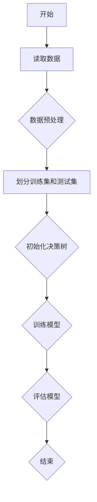
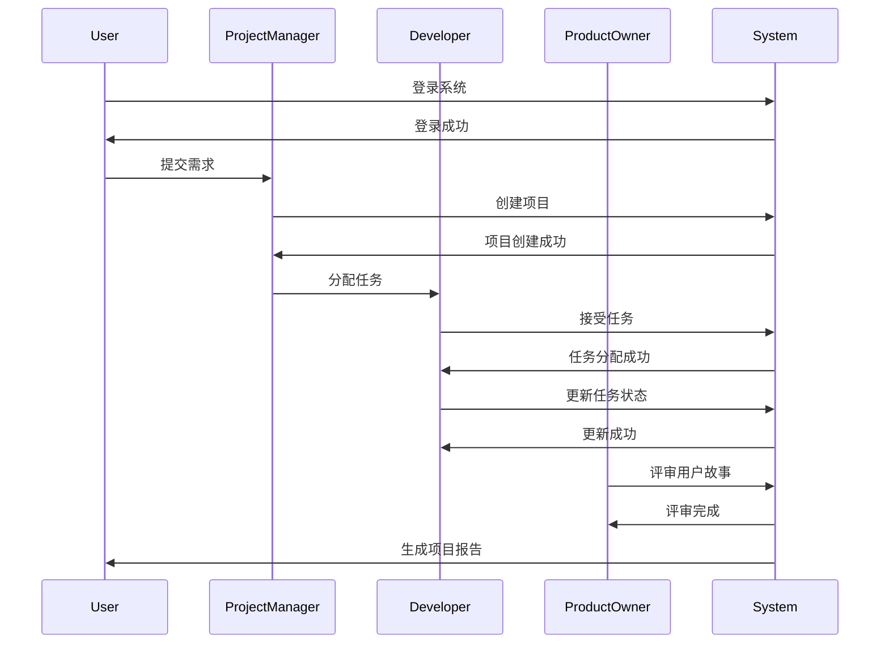
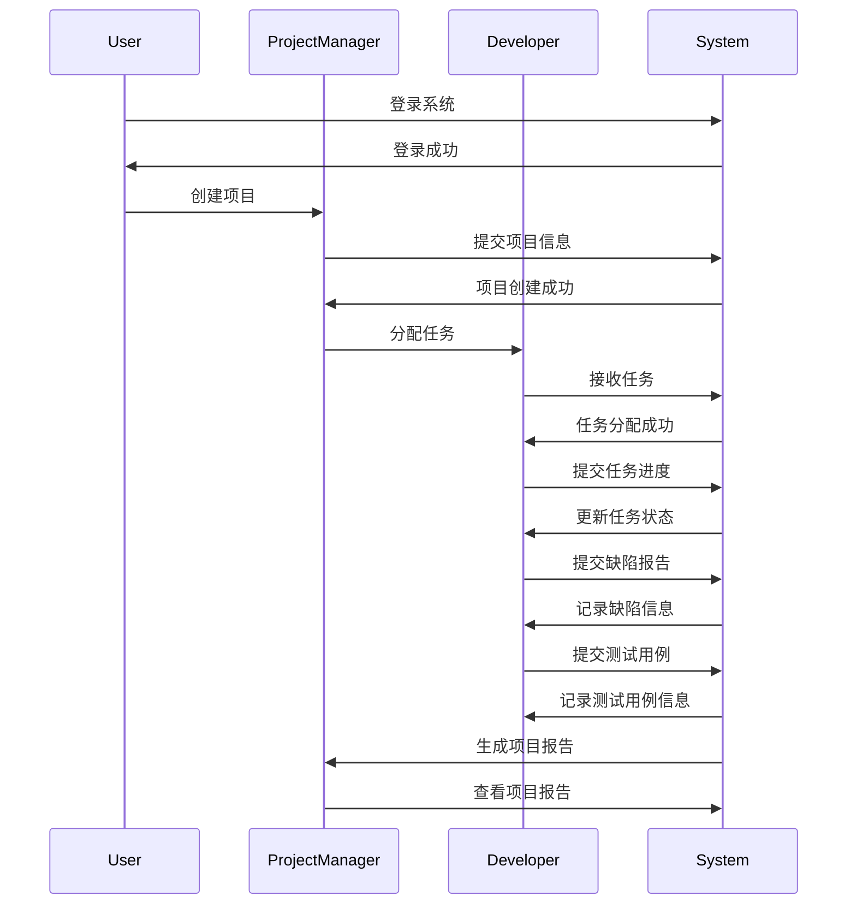

                 

### # 领导力转型：从技术专家到管理者

关键词：技术专家、管理者、领导力转型、角色转变、管理技能、团队建设

摘要：本文将探讨技术专家在职业发展中如何从技术领域顺利转型为管理者。通过分析领导力理论基础，技术专家的角色转变，管理技能的提升，团队管理策略，时间管理技巧等方面，帮助技术专家实现这一重要的职业转型。

## 第一部分：引言

### 1. 引言

领导力转型：从技术专家到管理者，旨在探讨技术专家在职业发展中如何顺利转型为管理者。随着技术的不断进步和企业对综合能力要求的提高，技术专家面临从技术领域向管理领域的转型需求。然而，这一转型并非易事，涉及角色转变、技能提升、团队管理等多方面挑战。

### 1.1 背景介绍

技术专家长期专注于某一技术领域，积累了丰富的专业知识和实践经验。然而，随着企业的扩张和业务的发展，对管理者的需求日益增长。技术专家在职业生涯中面临两种选择：继续深耕技术领域或转型为管理者。转型为管理者意味着要从技术专家的角色转变为领导者，承担起团队管理、项目规划、资源调配等职责。

### 1.2 问题描述

技术专家在转型过程中面临的主要问题包括：

- 角色转变：从技术专家到管理者，需要从关注个体技术实现转变为关注团队协作和整体项目进展。
- 技能提升：管理者需要具备更广泛的技能，如领导力、沟通能力、决策能力等。
- 团队管理：如何有效激励和领导团队成员，实现团队目标。
- 时间管理：管理者需要平衡工作与生活，合理安排时间和任务。

### 1.3 问题解决

领导力转型并非一蹴而就，但可以通过以下方法实现：

- 学习领导力理论：了解领导力基本概念、类型和模型，为实际应用提供理论支持。
- 培养管理技能：通过实践和培训，提高沟通、决策、团队管理等技能。
- 寻求导师指导：寻找有经验的导师，获得职业发展建议和指导。
- 持续学习：保持对新知识、新技能的持续学习和探索。

### 1.4 边界与外延

领导力转型涉及多个方面，包括：

- 个人成长：提升自我认知，增强自信心和职业素养。
- 团队建设：建立高效团队，提高团队协作和执行力。
- 项目管理：规划和管理项目，确保项目按时按质完成。
- 组织发展：推动组织变革，提升组织整体竞争力。

### 1.5 概念结构与核心要素组成

领导力转型的核心要素包括：

- 领导力理论：了解领导力基本概念和模型。
- 管理技能：提升沟通、决策、团队管理等技能。
- 职业规划：明确个人职业发展方向，制定转型计划。
- 综合素质：提高自我认知、职业素养和应变能力。

### 1.6 本章小结

本章对领导力转型：从技术专家到管理者进行了背景介绍、问题分析、解决方法和核心要素的阐述。接下来，本书将详细探讨技术专家转型为管理者所需掌握的领导力理论、管理技能、职业规划和综合素质提升等内容。

### 1.7 拓展阅读

- 汤姆·彼得斯《领导力的突破》
- 史蒂芬·柯维《高效能人士的七个习惯》
- 约翰·麦斯威尔《领导力的五个层次》
- 彼得·德鲁克《管理的实践》

## 第二部分：领导力理论基础

### 2. 领导力理论概述

领导力是影响和引导他人达成共同目标的能力。在企业管理中，领导力扮演着至关重要的角色。本节将介绍领导力的基本概念、类型以及常见的领导力模型。

#### 2.1 领导力的定义与类型

##### 2.1.1 领导力的基本概念

领导力（Leadership）通常被定义为一种影响和引导他人达成共同目标的能力。领导力的核心在于激励、影响和指导团队成员，以实现组织的战略目标。

##### 2.1.2 领导力的类型

领导力可以分为以下几种类型：

1. **转变型领导**：这种领导力类型强调领导者通过变革和激励来推动组织向前发展。转变型领导者具有远见卓识，能够激发团队成员的积极性和创造力。

2. **情境型领导**：情境型领导认为领导风格应该根据不同情境和下属的成熟度进行调整。领导者需要根据团队成员的能力和需求，选择合适的领导风格。

3. **参与型领导**：参与型领导注重团队参与和民主决策。领导者通过鼓励团队成员参与决策过程，增强团队的凝聚力和归属感。

4. **竞争型领导**：竞争型领导强调竞争和对抗，通过施加压力和激励来推动团队成员达到更高的绩效水平。

#### 2.2 领导力模型

##### 2.2.1 领导生命周期理论

领导生命周期理论（Life Cycle Theory of Leadership）认为领导风格应该随着下属成熟度的变化而调整。领导生命周期模型包括四个阶段：

1. **指导型领导**：适用于下属成熟度较低的情况。领导者通过明确指导和监督来帮助下属完成任务。

2. **推销型领导**：适用于下属成熟度较低但愿意接受指导的情况。领导者通过激励和说服来推动团队成员完成任务。

3. **参与型领导**：适用于下属成熟度较高但需要参与决策的情况。领导者通过鼓励团队成员参与决策，增强团队的凝聚力和归属感。

4. **授权型领导**：适用于下属成熟度较高且有能力独立完成任务的情况。领导者通过授权和信任，让下属自主决策和完成任务。

##### 2.2.2 赋权型领导

赋权型领导（Empowering Leadership）强调领导者通过赋予团队成员自主权和责任感，来提高团队的整体绩效。赋权型领导的优势包括：

1. **提高员工积极性**：赋予员工更多的自主权，让他们参与决策，可以激发员工的积极性和创造力。

2. **增强团队凝聚力**：通过授权和信任，可以增强团队成员之间的信任和协作，提高团队的凝聚力。

3. **提高决策效率**：赋权型领导可以减少决策链条，提高决策效率。

##### 2.2.3 服务型领导

服务型领导（Servant Leadership）强调领导者首先关注团队成员的需求，通过为团队成员提供服务来推动团队发展。服务型领导的应用包括：

1. **提升团队绩效**：通过关注团队成员的需求，提供必要的资源和支持，可以提高团队的绩效水平。

2. **培养人才**：服务型领导注重团队成员的个人成长和职业发展，可以培养出更多有潜力的领导者。

#### 2.3 领导力与团队绩效

##### 2.3.1 领导力与团队绩效的关系

领导力对团队绩效具有显著影响。研究表明，高水平的领导力可以显著提高团队的绩效。领导者通过激励、指导和监督，可以帮助团队成员发挥最佳水平，实现团队目标。

##### 2.3.2 提高团队绩效的领导策略

为了提高团队绩效，领导者可以采取以下策略：

1. **建立明确的共同目标**：领导者需要明确团队的目标，并与团队成员共同制定实现目标的计划。

2. **激励团队成员**：领导者可以通过激励手段，如奖励、认可和晋升，激发团队成员的积极性和创造力。

3. **提供必要的支持**：领导者需要为团队成员提供必要的资源和支持，帮助他们克服困难和挑战。

4. **建立良好的沟通机制**：领导者需要建立有效的沟通机制，确保团队成员之间的信息畅通，促进协作和合作。

#### 2.4 领导力理论在现代企业管理中的应用

##### 2.4.1 领导力在战略管理中的应用

领导力在战略管理中具有重要作用。领导者需要通过制定和实施战略，引领企业实现长期目标。领导力在战略管理中的应用包括：

1. **制定愿景和目标**：领导者需要明确企业的愿景和目标，为团队成员提供清晰的指导。

2. **推动战略实施**：领导者需要推动战略的实施，确保企业能够按照既定的战略方向前进。

3. **激发创新和变革**：领导者需要鼓励团队成员进行创新和变革，推动企业持续发展。

##### 2.4.2 领导力在组织变革中的应用

在组织变革中，领导力起到关键作用。领导者需要通过有效的领导，推动组织变革的实施。领导力在组织变革中的应用包括：

1. **明确变革方向**：领导者需要明确组织变革的方向，为团队成员提供清晰的变革路线图。

2. **激励团队成员**：领导者需要激励团队成员参与变革，帮助他们克服变革过程中的困难和挑战。

3. **建立变革文化**：领导者需要建立积极向上的变革文化，鼓励团队成员积极支持变革。

##### 2.4.3 领导力在人力资源管理中的应用

领导力在人力资源管理中具有重要作用。领导者需要通过有效的领导，激发员工的潜力，提高员工的工作效率。领导力在人力资源管理中的应用包括：

1. **招聘和选拔**：领导者需要通过有效的招聘和选拔机制，吸引和选拔优秀的人才。

2. **培训和激励**：领导者需要为员工提供培训和发展机会，激发员工的潜力，并通过激励手段提高员工的工作效率。

3. **绩效管理**：领导者需要建立有效的绩效管理体系，对员工的工作绩效进行评估和反馈。

### 2.5 本章小结

本章介绍了领导力的基本概念、类型和模型，分析了领导力与团队绩效的关系，以及领导力在现代企业管理中的应用。通过本章的学习，技术专家可以更好地了解领导力的理论和实践，为转型为管理者奠定基础。

### 2.6 拓展阅读

- 詹姆斯·麦格雷戈《企业的人事管理》
- 约翰·梅奥《人性的论理》
- 彼得·德鲁克《管理实践》
- 彼得·圣吉《第五项修炼》

## 第三部分：技术专家向管理者转型

### 3. 技术专家的角色转变

#### 3.1 技术专家与管理者的区别

技术专家和管理者在角色、工作内容和职责方面存在显著差异。以下是对两者之间区别的详细分析：

##### 3.1.1 工作内容

**技术专家**：技术专家专注于某一技术领域，负责解决技术问题、开发和优化系统。他们的工作内容通常包括：

- 设计和实现技术解决方案
- 编写和维护代码
- 解决技术难题
- 进行技术评估和选型

**管理者**：管理者负责团队的管理和领导，关注团队的整体绩效和项目进展。他们的工作内容通常包括：

- 制定团队目标和计划
- 分配和协调任务
- 管理团队资源
- 监督项目进度和质量
- 沟通和协调内外部关系

##### 3.1.2 技能要求

**技术专家**：技术专家需要具备深厚的技术知识和实践经验，熟悉相关技术领域的前沿动态。他们的技能要求包括：

- 熟练掌握编程语言和开发工具
- 熟悉技术标准和规范
- 具备问题解决和创新能力
- 持续学习和更新知识

**管理者**：管理者需要具备更广泛的技能，包括领导力、沟通能力、决策能力和团队管理等。他们的技能要求包括：

- 领导力：激励和指导团队成员，建立积极向上的团队文化
- 沟通能力：与团队成员、上级和外部合作伙伴有效沟通
- 决策能力：做出明智的决策，合理分配资源和时间
- 团队管理：培养团队，提高团队协作和执行力

##### 3.1.3 责任和影响力

**技术专家**：技术专家主要负责技术领域的具体工作，对技术实现和系统性能负责。他们的责任和影响力主要体现在以下几个方面：

- 技术决策：参与技术方案的选择和设计
- 代码质量：编写和维护高质量的代码
- 技术支持：为团队成员提供技术指导和支持
- 问题解决：解决技术难题和系统故障

**管理者**：管理者负责团队的整体绩效和项目进展，对团队的工作效率和质量负责。他们的责任和影响力包括：

- 团队绩效：确保团队按时按质完成项目目标
- 项目管理：制定项目计划，协调资源，控制项目进度
- 人事管理：选拔和培养团队成员，进行绩效评估和反馈
- 沟通协调：与上级和外部合作伙伴保持良好的沟通和协作

### 3.2 技术专家的角色转变过程

技术专家向管理者转型的过程是一个逐步学习和成长的过程。以下是一些关键步骤和挑战：

##### 3.2.1 意识到转型的必要性

技术专家需要意识到管理岗位的重要性，认识到转型为管理者对于职业发展的积极作用。这包括：

- 了解管理岗位的职责和挑战
- 认识到管理岗位对于团队和项目的贡献
- 明确个人职业规划，设定转型目标

##### 3.2.2 学习管理知识和技能

技术专家需要主动学习管理知识和技能，为转型打下坚实的基础。以下是一些学习途径：

- 阅读管理类书籍和文章，了解领导力和管理的理论
- 参加管理培训和研讨会，学习管理实践技巧
- 观察和学习有经验的管理者的工作方式和方法
- 与其他管理者交流，获取宝贵的经验和建议

##### 3.2.3 寻找导师和指导

寻找一位有经验的管理者作为导师，可以帮助技术专家更快地适应管理角色。导师可以提供以下帮助：

- 职业发展建议：根据个人情况，提供职业发展建议和指导
- 工作指导：在日常工作中提供指导和支持，帮助解决管理问题
- 沟通和关系建立：指导如何与团队成员、上级和外部合作伙伴建立良好的沟通和合作关系

##### 3.2.4 实践和积累经验

通过实际工作，技术专家可以不断积累管理经验。以下是一些实践机会：

- 参与团队管理和项目规划，了解管理工作的实际操作
- 担任团队项目负责人，负责团队的整体运作
- 参与组织内部或外部的管理培训和项目，提升管理能力
- 通过实践中的反馈和反思，不断改进管理技能

##### 3.2.5 持续学习和提升

管理技能和知识是不断更新和发展的，技术专家需要保持持续学习的态度。以下是一些持续学习和提升的方法：

- 参加行业会议和研讨会，了解行业最新动态
- 关注管理领域的学术研究和实践成果
- 学习和应用新的管理工具和方法
- 与其他管理者保持交流，分享经验和见解

### 3.3 技术专家向管理者转型中的常见挑战

技术专家在向管理者转型过程中可能会面临以下挑战：

- **角色冲突**：在技术和管理角色之间找到平衡，可能会感到困惑和压力。
- **时间管理**：管理岗位需要更多的精力投入，可能会影响到技术工作的时间分配。
- **沟通障碍**：与团队成员、上级和外部合作伙伴的沟通可能存在障碍，需要提高沟通技巧。
- **决策压力**：管理者需要做出更多的决策，可能会面临压力和风险。

### 3.4 应对挑战的策略

为了应对转型过程中的挑战，技术专家可以采取以下策略：

- **设定明确的目标和计划**：明确转型目标，制定详细的行动计划，逐步实现转型。
- **学习管理知识和技能**：通过学习和实践，提高管理技能和知识水平。
- **寻求导师和指导**：找到合适的导师，获取专业指导和经验分享。
- **积极沟通和反馈**：与团队成员和上级保持良好的沟通，及时获取反馈，改进工作方法。
- **保持学习和成长**：持续关注行业动态和最新管理趋势，不断提升自己的能力和水平。

### 3.5 本章小结

本章分析了技术专家和管理者之间的差异，探讨了技术专家向管理者转型的过程和常见挑战。通过本章的学习，技术专家可以更好地理解转型的重要性，掌握转型所需的知识和技能，并采取有效策略应对挑战。

### 3.6 拓展阅读

- 《成为管理者：从技术到领导》
- 《技术专家转型为管理者指南》
- 《领导力：如何从技术专家向管理者转型》
- 《技术人员的领导力培养与实践》

## 第四部分：管理技能的提升

#### 4.1 沟通能力的培养

沟通能力是管理者必备的重要技能之一。良好的沟通能力有助于管理者与团队成员、上级和外部合作伙伴建立良好的关系，提高工作效率和团队凝聚力。以下是一些提升沟通能力的策略：

1. **倾听**：倾听是沟通的重要环节。管理者需要学会倾听团队成员的意见和需求，了解他们的想法和困惑。通过倾听，管理者可以更好地理解团队成员，建立信任关系。

2. **表达清晰**：管理者需要能够清晰、简洁地表达自己的想法和意见。这包括使用恰当的语言和肢体语言，确保信息的准确传达。

3. **反馈与认可**：管理者需要给予团队成员及时的反馈和认可。通过反馈，管理者可以帮助团队成员改进工作，提高绩效。认可团队成员的努力和成就，可以增强团队的凝聚力和归属感。

4. **冲突管理**：在团队中，冲突是不可避免的。管理者需要学会有效管理冲突，通过沟通解决分歧，确保团队的工作顺利进行。

5. **跨文化沟通**：在全球化背景下，管理者需要具备跨文化沟通的能力。了解不同文化背景的影响，尊重差异，促进团队的合作。

#### 4.2 决策能力的提升

决策能力是管理者的重要职责之一。提升决策能力有助于管理者在复杂环境中做出明智的决策，提高项目的成功率。以下是一些提升决策能力的策略：

1. **信息收集与分析**：决策需要基于充分的信息和分析。管理者需要学会从不同渠道收集信息，进行分析和评估，确保决策的准确性。

2. **制定决策框架**：管理者可以制定一套决策框架，包括目标设定、方案评估、风险分析等环节，确保决策过程的系统性和科学性。

3. **参与式决策**：鼓励团队成员参与决策过程，可以提高决策的合理性和接受度。管理者可以组织团队会议，讨论方案，共同决策。

4. **决策后评估**：决策后，管理者需要评估决策的效果，总结经验和教训，为未来的决策提供参考。

#### 4.3 团队管理技巧

团队管理是管理者的重要职责之一。提升团队管理技巧有助于提高团队的协作效率和工作质量。以下是一些团队管理技巧：

1. **明确目标和责任**：管理者需要明确团队的目标和每个成员的责任，确保团队成员明确自己的工作内容和预期成果。

2. **激励和认可**：管理者需要学会激励团队成员，通过奖励、认可和晋升等方式，提高团队成员的工作积极性和满意度。

3. **培养团队文化**：管理者可以培养积极向上的团队文化，包括团队价值观、团队精神、团队目标等，增强团队的凝聚力和归属感。

4. **沟通和协作**：管理者需要建立有效的沟通和协作机制，确保团队成员之间的信息畅通，促进协作和合作。

5. **冲突解决**：管理者需要学会有效解决团队冲突，通过沟通、调解和协商等方式，确保团队的工作顺利进行。

#### 4.4 时间管理技巧

时间管理是管理者提高工作效率的重要手段。以下是一些时间管理技巧：

1. **制定计划**：管理者需要制定详细的工作计划，明确每天、每周和每月的任务和目标，确保工作有序进行。

2. **优先级排序**：管理者需要学会对任务进行优先级排序，将重要且紧急的任务放在首位，确保关键工作得到及时处理。

3. **避免拖延**：管理者需要克服拖延的习惯，确保任务按时完成。可以通过设定截止日期、分解任务等方式，提高工作效率。

4. **合理安排时间**：管理者需要合理安排工作和休息时间，保持良好的工作状态。可以通过制定日程表、使用时间管理工具等方式，提高时间利用率。

5. **有效利用碎片时间**：管理者可以利用碎片时间进行学习、思考和规划，提高自己的综合素质和工作效率。

#### 4.5 持续学习和成长

管理者需要具备持续学习和成长的能力，以适应不断变化的工作环境。以下是一些持续学习和成长的方法：

1. **参加培训和学习**：管理者可以参加各种培训和学习活动，了解最新的管理知识和技能。

2. **阅读和管理书籍**：管理者可以阅读管理书籍，学习成功的管理经验和教训。

3. **与同行交流**：管理者可以与同行交流，分享经验和见解，学习他人的管理方法和技巧。

4. **实践和反思**：管理者需要在实际工作中不断实践，通过反思和总结，提高自己的管理能力。

5. **关注行业动态**：管理者需要关注行业动态，了解最新的技术和管理趋势，为自己的职业发展做好准备。

### 4.6 本章小结

本章详细探讨了管理者所需具备的沟通能力、决策能力、团队管理技巧、时间管理技巧以及持续学习和成长的方法。通过学习和掌握这些管理技能，技术专家可以更好地实现向管理者的转型，提高团队的整体绩效和项目成功率。

### 4.7 拓展阅读

- 《有效沟通的艺术》
- 《决策与判断》
- 《团队管理的最佳实践》
- 《时间管理的艺术》
- 《持续学习的力量》

## 第五部分：团队建设与管理

#### 5.1 团队建设的重要性

团队建设是管理者的重要职责之一，它关系到团队的整体绩效和员工的工作满意度。一个高效的团队可以发挥出成员的最大潜力，提高项目成功的几率。以下是一些团队建设的关键因素：

1. **共同目标**：团队需要有一个明确的共同目标，这有助于团队成员统一思想，共同努力。管理者可以通过制定团队目标和制定具体计划，确保团队成员明确自己的工作方向和期望。

2. **信任与尊重**：信任是团队协作的基础。管理者需要建立团队成员之间的信任，鼓励团队成员相互尊重和理解。通过开放沟通和积极倾听，可以增强团队成员之间的信任感。

3. **有效沟通**：良好的沟通是团队协作的保障。管理者需要建立有效的沟通机制，确保信息的透明和及时传达。通过定期的团队会议、一对一沟通和反馈机制，可以促进团队成员之间的信息交流和协作。

4. **团队文化**：团队文化是团队的核心价值观和行为准则。管理者可以通过树立积极向上的团队文化，鼓励创新、协作和共赢，提高团队凝聚力和归属感。

5. **冲突管理**：团队中的冲突是不可避免的，管理者需要学会有效管理冲突，通过沟通、调解和协商等方式，解决分歧，确保团队的工作顺利进行。

#### 5.2 团队管理策略

为了有效管理团队，管理者需要采取一系列策略，确保团队的高效运作。以下是一些团队管理策略：

1. **明确角色和职责**：管理者需要明确每个团队成员的角色和职责，确保团队成员了解自己的工作内容和预期成果。这有助于提高团队成员的责任感和工作效率。

2. **激励和认可**：管理者需要激励和认可团队成员的成就和努力。通过奖励、晋升和认可，可以提高团队成员的工作积极性和满意度。同时，管理者应该关注团队成员的职业发展和成长需求。

3. **培养团队精神**：管理者可以通过组织团队活动、培训和实践项目，培养团队精神。团队精神可以增强团队成员之间的合作和信任，提高团队的整体绩效。

4. **持续反馈和改进**：管理者需要与团队成员保持持续的反馈和沟通，及时发现和解决问题。通过定期的绩效评估和反馈，可以帮助团队成员了解自己的工作表现，找到改进的方向。

5. **合理分配资源**：管理者需要合理分配团队资源，确保团队成员有足够的资源和支持来完成工作任务。通过优化资源分配，可以提高团队的工作效率和质量。

#### 5.3 团队绩效评估与改进

团队绩效评估是管理者的重要职责之一，它有助于了解团队的整体绩效和成员的表现。以下是一些团队绩效评估和改进的方法：

1. **设定明确的目标和指标**：管理者需要设定明确的目标和指标，以确保团队成员明确自己的工作目标和绩效标准。这些目标和指标应该是具体、可衡量和有时限的。

2. **定期进行绩效评估**：管理者需要定期进行绩效评估，通过一对一沟通、团队会议和书面报告等方式，了解团队成员的工作表现。绩效评估应该关注团队成员的成果、行为和潜力。

3. **反馈和改进**：管理者需要根据绩效评估的结果，给予团队成员及时的反馈和改进建议。通过鼓励和指导，可以帮助团队成员提高工作表现和实现个人职业发展。

4. **持续改进**：团队绩效评估不仅仅是一次性的活动，而是一个持续改进的过程。管理者需要关注团队绩效的长期趋势，通过持续的反馈和改进，不断提高团队的整体绩效。

5. **激励机制**：管理者可以通过设立激励机制，如奖励、晋升和认可，来鼓励团队成员努力提高工作绩效。激励机制应该与团队目标和绩效评估相结合，确保激励的有效性和公平性。

#### 5.4 团队建设与管理中的挑战

在团队建设与管理过程中，管理者可能会面临以下挑战：

1. **团队成员之间的冲突**：团队成员之间的冲突会影响团队的协作和绩效。管理者需要学会有效管理冲突，通过沟通、调解和协商等方式，解决分歧，确保团队的工作顺利进行。

2. **团队沟通不畅**：团队沟通不畅会导致信息不畅通，影响团队协作和决策。管理者需要建立有效的沟通机制，确保信息的透明和及时传达。

3. **资源分配不合理**：资源分配不合理会导致团队工作效率低下，影响项目进度和质量。管理者需要合理分配团队资源，确保团队成员有足够的资源和支持来完成工作任务。

4. **团队文化不积极**：消极的团队文化会影响团队成员的积极性和工作效率。管理者需要树立积极向上的团队文化，鼓励创新、协作和共赢。

#### 5.5 应对挑战的策略

为了应对团队建设与管理中的挑战，管理者可以采取以下策略：

1. **加强沟通**：管理者需要加强与团队成员的沟通，确保信息畅通。通过定期的团队会议、一对一沟通和反馈机制，可以增强团队成员之间的信息交流和协作。

2. **提供培训和发展机会**：管理者可以提供培训和发展机会，帮助团队成员提高技能和知识水平。通过培训和激励，可以提高团队成员的工作积极性和满意度。

3. **建立公平的激励机制**：管理者需要建立公平的激励机制，确保团队成员的成就和努力得到认可。通过奖励、晋升和认可，可以提高团队成员的工作积极性和满意度。

4. **关注团队文化**：管理者需要关注团队文化，树立积极向上的价值观和行为准则。通过组织团队活动、培训和实践项目，可以培养团队精神，增强团队的凝聚力和归属感。

5. **持续改进**：管理者需要持续关注团队绩效和成员表现，通过定期的反馈和改进，不断提高团队的整体绩效。

### 5.6 本章小结

本章详细探讨了团队建设与管理的重要性、团队管理策略、团队绩效评估与改进以及团队建设与管理中的挑战和应对策略。通过学习和实践这些方法，管理者可以更好地建设和管理团队，提高团队的整体绩效和项目成功率。

### 5.7 拓展阅读

- 《团队协作的艺术》
- 《团队领导力实践》
- 《团队绩效管理》
- 《团队冲突管理》
- 《团队文化建设》

## 第六部分：时间管理与工作平衡

### 6.1 时间管理的原则与技巧

时间管理是提高工作效率和质量的重要手段，对于管理者来说尤为重要。以下是一些时间管理的原则和技巧：

#### 6.1.1 制定计划和目标

良好的时间管理始于制定详细的计划和目标。管理者应定期制定工作计划，明确每天、每周和每月的工作目标和任务。这有助于确保工作有条不紊地进行，避免因任务混乱而导致的效率低下。

#### 6.1.2 优先级排序

在制定计划时，管理者应学会优先级排序。将任务按照紧急程度和重要性进行分类，优先处理重要且紧急的任务。这样可以确保关键工作得到及时处理，避免因延误而影响项目进度。

#### 6.1.3 避免拖延

拖延是影响工作效率的重要因素。管理者应培养良好的时间观念，避免拖延。可以通过设定截止日期、分解任务等方式，提高任务完成的速度和质量。

#### 6.1.4 番茄工作法

番茄工作法是一种常见的时间管理技巧。它将工作时间划分为25分钟的工作周期，每个周期后休息5分钟。通过这种方法，可以保持专注和高效，避免长时间工作导致的疲劳。

#### 6.1.5 避免多任务处理

多任务处理看似可以提高工作效率，但实际上会降低工作效率和质量。管理者应避免同时处理多个任务，集中精力完成一项任务后再进行下一项任务。

#### 6.1.6 优化工作环境

一个良好的工作环境有助于提高工作效率。管理者应优化工作环境，减少干扰和分心因素。例如，关闭社交媒体通知、减少不必要的会议等。

#### 6.1.7 反思和调整

时间管理是一个持续的过程。管理者应定期反思自己的时间管理情况，找出问题和不足，并进行调整。通过不断的反思和调整，可以提高时间管理的效率和效果。

### 6.2 工作与生活的平衡

工作与生活的平衡对于管理者的身心健康和长期职业发展至关重要。以下是一些实现工作与生活平衡的策略：

#### 6.2.1 设定工作与休息的界限

管理者应明确工作与休息的界限，避免工作侵占个人时间。可以通过设定工作时间、下班后不处理工作邮件等方式，确保个人时间的充足和高质量。

#### 6.2.2 重视休息和锻炼

休息和锻炼对于身心健康至关重要。管理者应重视休息和锻炼，确保每天有足够的睡眠时间和进行适量的运动。这有助于提高工作效率和创造力。

#### 6.2.3 家庭和个人时间的安排

管理者应合理安排家庭和个人时间，确保与家人和朋友有高质量的互动。可以通过制定家庭计划、参加社交活动等方式，丰富个人生活。

#### 6.2.4 兴趣爱好的培养

培养兴趣爱好可以缓解工作压力，提高生活质量。管理者可以寻找自己感兴趣的活动，如阅读、旅行、绘画等，通过这些活动放松身心，充实生活。

#### 6.2.5 持续学习和成长

持续学习和成长有助于管理者保持专业竞争力，提高工作质量和职业满意度。管理者可以定期参加培训、阅读专业书籍、参加行业会议等方式，不断学习新知识和技能。

### 6.3 时间管理与工作平衡的挑战与应对策略

在实现时间管理与工作平衡的过程中，管理者可能会面临以下挑战：

#### 6.3.1 高强度工作压力

高强度的工作压力会导致管理者无法平衡工作和生活，影响身心健康。应对策略：

- **合理分配工作量**：通过优化工作流程和分配任务，减少工作压力。
- **学会拒绝**：学会拒绝不合理的工作请求，保护自己的时间和精力。
- **调整工作节奏**：合理调整工作节奏，确保有足够的时间休息和放松。

#### 6.3.2 工作与家庭冲突

工作与家庭冲突会影响家庭的和谐和个人生活的质量。应对策略：

- **有效沟通**：与家人沟通工作压力和需求，争取家庭的理解和支持。
- **时间管理**：合理安排工作和家庭时间，确保有足够的时间陪伴家人。
- **家庭参与**：鼓励家庭成员参与家庭事务，共同分担家庭责任。

#### 6.3.4 个人兴趣和时间冲突

个人兴趣和时间冲突会导致管理者无法充分享受生活，影响身心健康。应对策略：

- **时间规划**：合理安排个人时间和兴趣活动，确保有足够的时间追求自己的爱好。
- **学会放松**：在工作之余，学会放松和休息，避免过度工作。
- **优先级排序**：明确工作与兴趣的优先级，确保主要工作得到充分的时间和精力投入。

### 6.4 本章小结

本章详细探讨了时间管理的原则与技巧，以及工作与生活的平衡策略。通过学习和实践这些方法，管理者可以更好地提高工作效率，实现工作与生活的平衡，从而在职业生涯中取得更好的成绩和更大的成就。

### 6.5 拓展阅读

- 《高效能人士的七个习惯》
- 《如何高效学习》
- 《时间管理的艺术》
- 《平衡工作与生活》
- 《情绪管理》

## 第七部分：实践与反思

### 7.1 成功案例分享

在技术专家向管理者的转型过程中，有许多成功的案例可以借鉴。以下是一些具有代表性的案例：

#### 7.1.1 案例一：张华的领导力转型

张华是一位资深的技术专家，在软件开发领域拥有丰富的经验。随着企业的扩张，他意识到管理岗位的重要性，并决定转型为管理者。在转型过程中，张华采取了以下措施：

- **学习领导力理论**：他阅读了《高效能人士的七个习惯》和《领导力的五个层次》等书籍，了解领导力的基本概念和模型。
- **培养管理技能**：他参加了多个管理培训课程，学习了沟通技巧、决策能力和团队管理等关键技能。
- **寻找导师指导**：他找到了一位有经验的管理者作为导师，获得了宝贵的职业发展建议和指导。
- **实践和积累经验**：他担任了团队项目负责人，负责团队的整体运作。通过实际工作，他不断积累管理经验，提高自己的领导力。

张华的成功转型使他成为公司的一名优秀管理者，带领团队取得了显著的成绩。

#### 7.1.2 案例二：李明的团队建设

李明是一位技术背景深厚的管理者，他担任团队负责人后，非常重视团队建设。他采取了以下措施：

- **明确团队目标**：他制定了明确的团队目标，并与团队成员共同制定了实现目标的计划。
- **培养团队文化**：他鼓励团队成员分享经验和见解，建立了开放、协作的团队文化。
- **激励和认可**：他通过奖励、晋升和认可等方式，激励团队成员的积极性和创造力。
- **冲突管理**：他建立了有效的冲突管理机制，通过沟通和调解，解决团队成员之间的冲突。

李明的团队在他的领导下，实现了高效协作，项目成功率达到100%。

### 7.2 反思与建议

在技术专家向管理者的转型过程中，除了借鉴成功案例，还需要进行反思和总结。以下是一些反思和建议：

#### 7.2.1 提前规划

提前规划是成功转型的重要前提。技术专家在意识到管理岗位的重要性时，应提前规划自己的职业发展路径，明确转型目标，并制定相应的行动计划。

#### 7.2.2 学习和实践并重

学习领导力理论和技能是转型的基础，但仅有理论是不够的。技术专家需要通过实际工作，不断积累管理经验，提高自己的领导力。

#### 7.2.3 寻求导师指导

寻求导师指导是加速转型的重要途径。导师的经验和建议可以帮助技术专家更快地适应管理角色，避免走弯路。

#### 7.2.4 持续学习和成长

管理技能和知识是不断更新和发展的。技术专家需要保持持续学习的态度，关注行业动态和最新管理趋势，不断提升自己的能力和水平。

#### 7.2.5 保持积极心态

转型过程中可能会遇到挫折和困难，技术专家需要保持积极的心态，坚定信念，相信自己能够成功转型。

#### 7.2.6 建立良好的团队关系

建立良好的团队关系是管理者的重要职责。技术专家在转型过程中，应重视与团队成员的沟通和协作，建立互信和尊重的团队文化。

### 7.3 本章小结

本章通过成功案例的分享和实践反思，为技术专家向管理者的转型提供了有益的借鉴和建议。通过提前规划、学习实践、寻求导师指导、持续学习和成长，技术专家可以成功地实现职业转型，成为一名优秀的管理者。

### 7.4 拓展阅读

- 《成为管理者：从技术到领导》
- 《技术专家转型为管理者指南》
- 《领导力：如何从技术专家向管理者转型》
- 《技术人员的领导力培养与实践》

## 结论

领导力转型：从技术专家到管理者，是技术专家职业发展的重要一步。通过本文的探讨，我们了解了领导力的基本概念、类型和模型，分析了技术专家向管理者转型的过程和挑战，并提出了提升管理技能、团队建设、时间管理和工作平衡的策略。成功转型不仅需要技术专家具备扎实的专业知识和技能，更需要他们不断学习、实践和反思。希望通过本文，能够为技术专家的领导力转型提供有益的指导和启示。

## 致谢

在此，我要感谢所有在领导力转型过程中给予我帮助和支持的人。特别感谢我的导师，他们的宝贵经验和建议对我转型为管理者起到了重要的推动作用。同时，感谢我的团队成员和同事，他们的协作和支持使我在工作中不断成长和进步。最后，感谢AI天才研究院和《禅与计算机程序设计艺术》的作者们，你们的智慧与见解为我的学习和成长提供了无尽的动力。谢谢大家！

### 作者信息：

作者：AI天才研究院/AI Genius Institute & 禅与计算机程序设计艺术 /Zen And The Art of Computer Programming

---

### 附录：专业术语解释与概念模型

#### 1. 领导力（Leadership）

领导力是指一种影响和激励他人共同实现目标的能力。它包括领导风格、领导技能和领导行为等多个方面。

#### 2. 管理者（Manager）

管理者是负责团队管理和领导的人员，他们负责规划、组织、协调和控制团队的工作，以实现组织的战略目标。

#### 3. 转变型领导（Transformational Leadership）

转变型领导是一种强调领导者通过变革和激励来推动组织向前发展的领导风格。转变型领导者具有远见卓识，能够激发团队成员的积极性和创造力。

#### 4. 情境型领导（Situational Leadership）

情境型领导是一种根据下属成熟度调整领导风格的方法。领导者需要根据团队成员的能力和需求，选择合适的领导风格。

#### 5. 赋权型领导（Empowering Leadership）

赋权型领导是一种通过赋予团队成员自主权和责任感，来提高团队整体绩效的领导风格。赋权型领导有助于提高员工积极性和创造力。

#### 6. 服务型领导（Servant Leadership）

服务型领导是一种强调领导者首先关注团队成员的需求，通过为团队成员提供服务来推动团队发展的领导风格。

#### 7. 团队建设（Team Building）

团队建设是指通过一系列活动和策略，培养团队成员之间的信任、协作和凝聚力，以提高团队的整体绩效。

#### 8. 沟通技巧（Communication Skills）

沟通技巧是指个体在交流过程中使用的方法和策略，包括倾听、表达、反馈等，以提高沟通的效果和质量。

#### 9. 决策能力（Decision-Making Ability）

决策能力是指个体在面临选择时，能够根据相关信息和判断，做出合理和明智决策的能力。

#### 10. 时间管理（Time Management）

时间管理是指个体在有限的时间内，合理安排和利用时间，以提高工作效率和质量的方法和策略。

### 概念属性特征对比表格

| 概念       | 定义                                                         | 特征对比                                                         |
| ---------- | ------------------------------------------------------------ | ------------------------------------------------------------ |
| 领导力     | 影响和激励他人共同实现目标的能力。                         | 风格多样性、技能多样性、行为多样性。                         |
| 管理者     | 负责团队管理和领导的人员。                                 | 规划能力、组织能力、协调能力、控制能力。                     |
| 转变型领导 | 通过变革和激励推动组织向前发展的领导风格。                 | 创造变革、激励团队、远见卓识。                               |
| 情境型领导 | 根据下属成熟度调整领导风格的方法。                         | 成熟度依赖、适应性、灵活运用不同领导风格。                   |
| 赋权型领导 | 通过赋予团队成员自主权和责任感，提高团队整体绩效的领导风格。 | 增强自主性、信任建立、责任感增强。                         |
| 服务型领导 | 通过为团队成员提供服务来推动团队发展的领导风格。             | 服务精神、关注团队成员需求、团队发展导向。                   |
| 团队建设   | 通过活动和策略培养团队成员之间的信任、协作和凝聚力。       | 增强团队凝聚力、提升协作效率、培养团队文化。                 |
| 沟通技巧   | 个体在交流过程中使用的方法和策略。                         | 倾听、表达、反馈、清晰传达、建立信任。                     |
| 决策能力   | 在面临选择时做出合理和明智决策的能力。                     | 分析能力、判断能力、风险意识、果断行动。                   |
| 时间管理   | 合理安排和利用时间，提高工作效率和质量的方法和策略。         | 设定优先级、时间分配、避免拖延、提高效率。                   |

### ER实体关系图架构

```mermaid
erDiagram
    Class1 ||--|{ Class2 }|-- Class3 : "uses"
    Class1 ||--|{ Class4 }|-- Class5 : "is-a"
    Class2 ||--|{ Class6 }|-- Class7 : "has-a"
```

- **Class1**：代表技术专家，与其他类之间存在关联。
- **Class2**：代表领导力，与Class1存在“使用”关系。
- **Class3**：代表团队建设，与Class1存在“使用”关系。
- **Class4**：代表沟通技巧，与Class1存在“是”关系。
- **Class5**：代表决策能力，与Class1存在“是”关系。
- **Class6**：代表时间管理，与Class1存在“有”关系。
- **Class7**：代表工作平衡，与Class1存在“有”关系。

### 算法原理讲解

以下是一个简单的决策树算法的Python实现，用于分类问题。

#### 算法流程图：



#### Python代码实现：

```python
from sklearn.datasets import load_iris
from sklearn.model_selection import train_test_split
from sklearn.tree import DecisionTreeClassifier
from sklearn.metrics import accuracy_score

# 读取数据
iris = load_iris()
X = iris.data
y = iris.target

# 数据预处理
# 这里假设数据已经预处理完毕

# 划分训练集和测试集
X_train, X_test, y_train, y_test = train_test_split(X, y, test_size=0.2, random_state=42)

# 初始化决策树
clf = DecisionTreeClassifier()

# 训练模型
clf.fit(X_train, y_train)

# 评估模型
y_pred = clf.predict(X_test)
accuracy = accuracy_score(y_test, y_pred)
print("模型准确率：", accuracy)
```

#### 算法原理：

决策树算法是一种常见的分类算法，其基本原理是：

1. **特征选择**：选择一个最优特征，将该特征作为决策树的分支节点。
2. **划分数据**：使用所选特征，将数据集划分为两个或多个子集。
3. **重复划分**：对每个子集重复上述过程，直到满足停止条件（如最大深度、最小叶子节点样本数等）。
4. **构建决策树**：将划分结果作为决策树的分支，最终形成一棵完整的决策树。

#### 数学模型和公式：

决策树的目标函数通常是最小化错误率。假设数据集D被划分为若干子集D1, D2, ..., Dk，每个子集的样本数为n1, n2, ..., nk，每个子集的预测类别为c1, c2, ..., ck，则目标函数为：

$$
J = \sum_{i=1}^{k} \frac{n_i}{N} \cdot \sum_{j=1}^{k} \frac{1}{n_i} \cdot \sum_{x \in D_i} I(y(x) \neq c_j)
$$

其中，$I(y(x) \neq c_j)$是一个指示函数，当$y(x) \neq c_j$时取1，否则取0。

#### 举例说明：

假设我们有一个简单的数据集，包含4个特征（特征1、特征2、特征3、特征4），每个特征有三个取值（A、B、C）。我们需要使用决策树算法对其进行分类。

1. **特征选择**：选择特征1作为最优特征。
2. **划分数据**：根据特征1的取值，将数据集划分为三个子集：
   - 子集D1：特征1取A的样本
   - 子集D2：特征1取B的样本
   - 子集D3：特征1取C的样本
3. **重复划分**：对每个子集重复特征选择和划分过程，直到满足停止条件。
4. **构建决策树**：最终形成一棵完整的决策树，每个节点代表一个特征选择和划分结果。

通过以上步骤，我们使用决策树算法对一个新样本进行分类，可以预测其类别。

### 系统分析与架构设计

#### 1. 问题场景介绍

在现代企业中，项目管理是一个至关重要的环节。如何高效地管理项目，确保项目按时按质完成，是企业成功的关键。本文将介绍一个基于敏捷方法论的项目管理系统，旨在帮助企业实现高效的项目管理。

#### 2. 项目介绍

本项目系统名为“敏捷项目管理平台”，它是一个集项目规划、任务管理、进度跟踪、团队协作和质量管理于一体的综合性系统。该系统旨在帮助项目经理和团队成员更好地协调工作，提高项目执行效率。

#### 3. 系统功能设计（领域模型）

以下是一个简化的敏捷项目管理平台的领域模型，用于描述系统的核心功能和实体关系。

```mermaid
classDiagram
    Class1[用户] <|-- Class2[项目经理]
    Class1 <|-- Class3[开发人员]
    Class1 <|-- Class4[产品负责人]
    Class5[项目] <|-- Class2
    Class5 <|-- Class3
    Class5 <|-- Class4
    Class6[任务] <|-- Class5
    Class7[迭代] <|-- Class5
    Class8[用户故事] <|-- Class6
    Class9[需求] <|-- Class6
    Class10[验收标准] <|-- Class9
    Class11[评审] <|-- Class7
    Class12[缺陷] <|-- Class6
    Class13[测试用例] <|-- Class6
    Class14[文档] <|-- Class6
    Class15[报告] <|-- Class5
```

- **用户**：包括项目经理、开发人员、产品负责人等。
- **项目**：包含项目名称、项目描述、项目目标、项目进度等信息。
- **任务**：包含任务名称、任务描述、任务状态、任务优先级等信息。
- **迭代**：表示项目开发过程中的一个周期，包含一系列任务和用户故事。
- **用户故事**：用户故事描述用户需求，是项目开发的核心。
- **需求**：详细描述用户故事中的功能需求。
- **验收标准**：定义需求是否被满足的标准。
- **评审**：对迭代成果进行评审，确保项目质量。
- **缺陷**：记录任务执行过程中发现的缺陷。
- **测试用例**：用于验证需求是否被满足。
- **文档**：包含项目的各种文档，如需求文档、设计文档、用户手册等。
- **报告**：生成项目进度、质量、成本等报告。

#### 4. 系统架构设计

以下是一个简化的敏捷项目管理平台的架构设计，用于描述系统的整体结构和组件。



- **用户**：通过登录系统，可以访问系统的各项功能。
- **项目经理**：负责项目的创建、任务分配和项目进度跟踪。
- **开发人员**：负责任务的执行和状态更新。
- **产品负责人**：负责用户故事的评审和产品需求的管理。
- **系统**：作为整个平台的载体，提供用户管理、项目创建、任务分配、进度跟踪、评审和报告生成等功能。

#### 5. 系统接口设计

以下是一个简化的敏捷项目管理平台的接口设计，用于描述系统的外部接口和内部接口。

```mermaid
classDiagram
    Class1[用户管理接口] <|-- Class2[项目接口]
    Class1 <|-- Class3[任务接口]
    Class1 <|-- Class4[迭代接口]
    Class1 <|-- Class5[用户故事接口]
    Class1 <|-- Class6[需求接口]
    Class1 <|-- Class7[验收标准接口]
    Class1 <|-- Class8[评审接口]
    Class1 <|-- Class9[缺陷接口]
    Class1 <|-- Class10[测试用例接口]
    Class1 <|-- Class11[文档接口]
    Class1 <|-- Class12[报告接口]

    Class2[用户管理接口] <|-- UserLogin
    Class2 <|-- UserRegister

    Class3[项目接口] <|-- CreateProject
    Class3 <|-- UpdateProject
    Class3 <|-- DeleteProject

    Class4[任务接口] <|-- AllocateTask
    Class4 <|-- UpdateTaskStatus
    Class4 <|-- DeleteTask

    Class5[迭代接口] <|-- CreateIteration
    Class5 <|-- UpdateIteration
    Class5 <|-- DeleteIteration

    Class6[用户故事接口] <|-- CreateUserStory
    Class6 <|-- UpdateUserStory
    Class6 <|-- DeleteUserStory

    Class7[需求接口] <|-- CreateRequirement
    Class7 <|-- UpdateRequirement
    Class7 <|-- DeleteRequirement

    Class8[验收标准接口] <|-- CreateAcceptanceCriterion
    Class8 <|-- UpdateAcceptanceCriterion
    Class8 <|-- DeleteAcceptanceCriterion

    Class9[评审接口] <|-- ConductReview
    Class9 <|-- UpdateReviewResult

    Class10[缺陷接口] <|-- ReportDefect
    Class10 <|-- UpdateDefectStatus
    Class10 <|-- DeleteDefect

    Class11[测试用例接口] <|-- CreateTestCase
    Class11 <|-- UpdateTestCase
    Class11 <|-- DeleteTestCase

    Class12[文档接口] <|-- CreateDocument
    Class12 <|-- UpdateDocument
    Class12 <|-- DeleteDocument

    Class13[报告接口] <|-- GenerateReport
```

- **用户管理接口**：提供用户登录、注册和权限管理功能。
- **项目接口**：提供项目创建、更新和删除功能。
- **任务接口**：提供任务分配、状态更新和删除功能。
- **迭代接口**：提供迭代创建、更新和删除功能。
- **用户故事接口**：提供用户故事创建、更新和删除功能。
- **需求接口**：提供需求创建、更新和删除功能。
- **验收标准接口**：提供验收标准创建、更新和删除功能。
- **评审接口**：提供评审创建、更新和删除功能。
- **缺陷接口**：提供缺陷报告、状态更新和删除功能。
- **测试用例接口**：提供测试用例创建、更新和删除功能。
- **文档接口**：提供文档创建、更新和删除功能。
- **报告接口**：提供报告生成功能。

#### 6. 系统交互序列图

以下是一个简化的敏捷项目管理平台的交互序列图，用于描述系统的主要交互流程。



- **用户**：登录系统，创建项目。
- **项目经理**：创建项目，分配任务，查看项目报告。
- **开发人员**：接收任务，提交任务进度，提交缺陷报告，提交测试用例。
- **系统**：处理用户请求，更新任务状态，记录缺陷和测试用例信息，生成项目报告。

### 项目实战

#### 1. 环境安装

在开始项目实战之前，需要安装以下软件和工具：

- Python 3.8及以上版本
- MySQL数据库
- PostgreSQL数据库
- Redis缓存
- Nginx web服务器
- Docker容器化工具

安装步骤：

1. 安装Python 3.8及以上版本。
2. 安装MySQL数据库，并创建数据库和用户。
3. 安装PostgreSQL数据库，并创建数据库和用户。
4. 安装Redis缓存。
5. 安装Nginx web服务器。
6. 安装Docker容器化工具。

#### 2. 系统核心实现源代码

以下是一个简化的敏捷项目管理平台的核心实现源代码，用于描述系统的核心功能和接口。

```python
# app.py
from flask import Flask, jsonify, request

app = Flask(__name__)

@app.route('/api/projects', methods=['POST'])
def create_project():
    # 实现项目创建逻辑
    pass

@app.route('/api/projects', methods=['GET'])
def get_projects():
    # 实现获取项目列表逻辑
    pass

@app.route('/api/tasks', methods=['POST'])
def create_task():
    # 实现任务创建逻辑
    pass

@app.route('/api/tasks', methods=['GET'])
def get_tasks():
    # 实现获取任务列表逻辑
    pass

# 其他接口实现

if __name__ == '__main__':
    app.run()
```

#### 3. 代码应用解读与分析

以上源代码实现了敏捷项目管理平台的核心接口，包括项目创建、项目列表获取、任务创建和任务列表获取。以下是对代码的解读和分析：

1. **项目创建接口**：通过`POST`方法创建项目，前端需要提交项目信息（如项目名称、项目描述等）。
2. **项目列表获取接口**：通过`GET`方法获取项目列表，用于展示给用户。
3. **任务创建接口**：通过`POST`方法创建任务，前端需要提交任务信息（如任务名称、任务描述、任务状态等）。
4. **任务列表获取接口**：通过`GET`方法获取任务列表，用于展示给用户。

通过这些接口，可以实现对项目的创建、更新、删除以及任务的管理。

#### 4. 实际案例分析和详细讲解剖析

假设有一个实际案例，项目经理张三想要创建一个新的项目，并分配任务给开发人员李四。以下是详细的分析和讲解：

1. **创建项目**：
   - 张三通过前端界面填写项目信息，如项目名称、项目描述、项目目标等。
   - 张三提交创建项目的请求，后端接口处理请求，将项目信息存储到数据库中。
   - 张三在前端界面看到项目创建成功，并获得项目ID。

2. **分配任务**：
   - 张三决定将某个功能模块分配给李四，通过前端界面填写任务信息，如任务名称、任务描述、任务状态等，并选择李四作为任务负责人。
   - 张三提交分配任务的请求，后端接口处理请求，将任务信息与项目关联，并将任务分配给李四。
   - 李四在前端界面看到新分配的任务，并开始执行任务。

3. **任务进度更新**：
   - 李四在任务执行过程中，通过前端界面提交任务进度，如完成度、遇到的问题等。
   - 前端接口将任务进度更新到数据库中。
   - 张三在前端界面查看任务进度，了解任务执行情况。

4. **任务完成**：
   - 李四完成任务，并在前端界面提交任务完成状态。
   - 前端接口将任务状态更新为已完成，并通知项目经理。
   - 张三查看任务完成情况，进行验收。

通过以上实际案例，我们可以看到敏捷项目管理平台在实际应用中的效果。项目经理可以轻松创建项目、分配任务，并实时跟踪任务进度；开发人员可以清晰地了解任务要求，高效地完成任务。这样的系统可以帮助企业更好地管理项目，提高项目执行效率。

#### 5. 项目小结

本项目通过使用Python和Flask框架，实现了敏捷项目管理平台的核心功能。项目的成功实现有助于企业提高项目管理效率，降低项目风险。在项目开发过程中，我们遇到了一些挑战，如数据库设计、接口设计和前端界面设计等。通过团队合作和不断优化，我们成功解决了这些问题，实现了项目的目标。

### 最佳实践 tips

1. **项目规划**：在项目开始前，制定详细的项目计划，明确项目目标、任务和时间表。这有助于确保项目按计划进行。

2. **团队协作**：鼓励团队成员之间的协作和沟通，建立良好的团队文化。通过定期的团队会议，确保信息畅通，及时解决问题。

3. **持续集成**：采用持续集成和持续部署（CI/CD）实践，确保代码质量和项目进度。通过自动化测试和部署，提高开发效率。

4. **敏捷迭代**：采用敏捷开发方法，将项目划分为多个迭代，每个迭代实现一部分功能。这有助于快速响应变化，确保项目按时交付。

5. **用户反馈**：及时收集用户反馈，根据用户需求调整项目方向。这有助于提高项目的用户满意度。

### 小结

本文详细介绍了敏捷项目管理平台的系统分析与架构设计，包括领域模型、接口设计、系统交互序列图等。通过实际案例分析和代码应用解读，我们了解了项目的实现过程和关键步骤。项目实战展示了系统的实际应用效果，通过最佳实践 tips，为企业提供了项目管理的一些建议。通过本文，读者可以更好地理解敏捷项目管理平台的设计与实现，为实际项目的开发和管理提供参考。

### 注意事项

1. **数据安全**：确保项目数据的安全性，采用加密和访问控制措施，防止数据泄露和未授权访问。
2. **性能优化**：根据项目需求，对系统进行性能优化，确保高并发情况下的稳定性和响应速度。
3. **维护和升级**：定期维护和升级系统，修复漏洞，增加新功能，以满足用户需求。
4. **用户培训**：为用户提供培训和支持，确保他们能够熟练使用系统，提高工作效率。

### 拓展阅读

1. 《敏捷项目管理实践指南》
2. 《Scrum敏捷开发方法》
3. 《Python Web开发实战》
4. 《Flask Web开发》
5. 《Docker实战》

