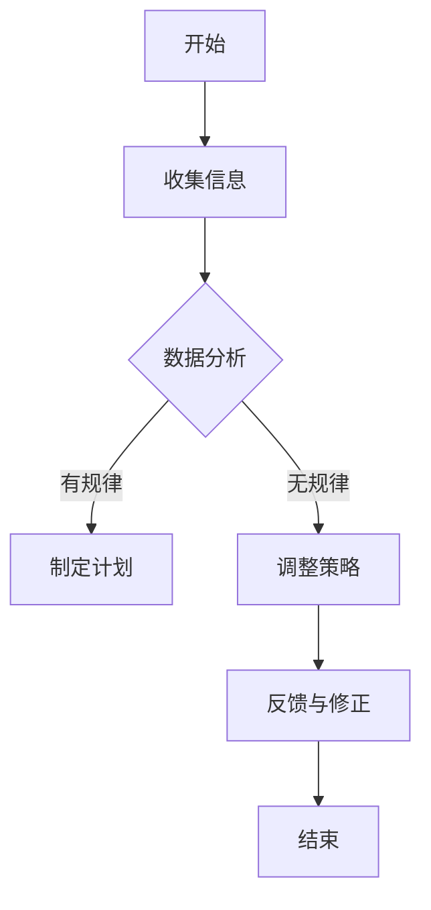
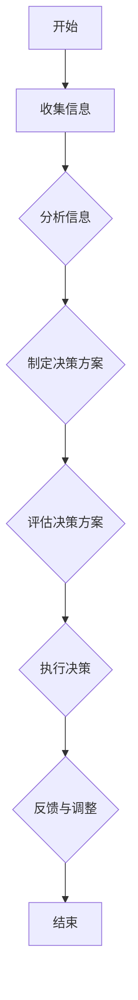
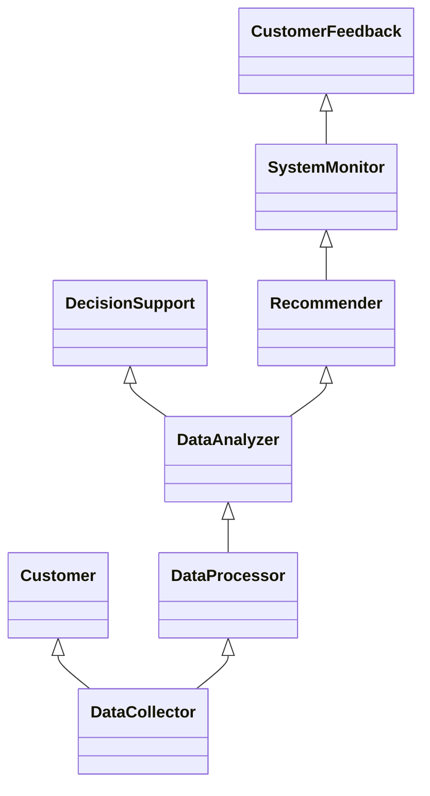
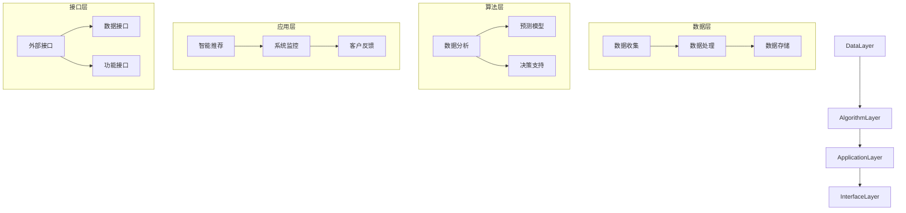
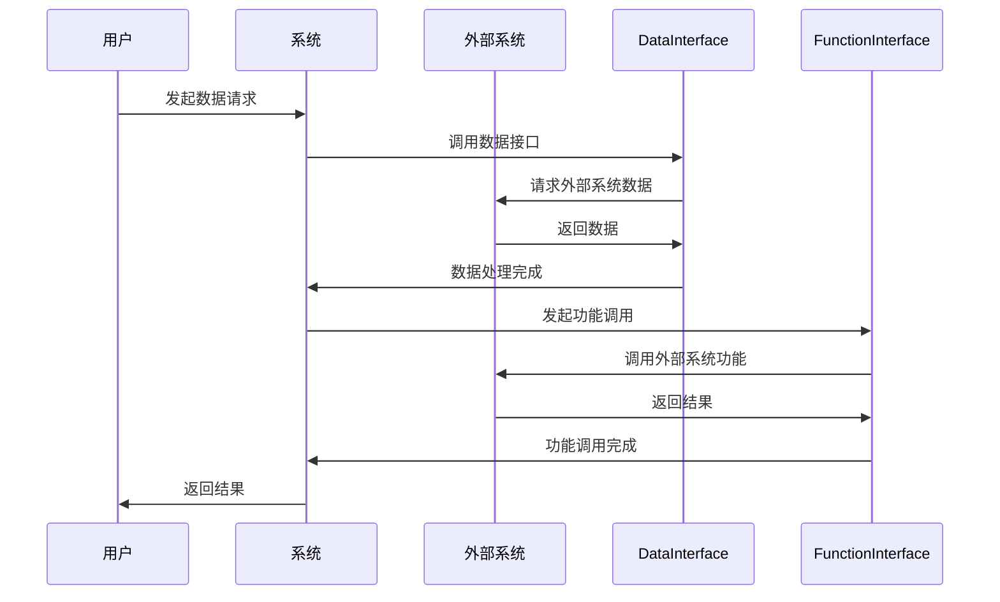

                 

# 领导力进化论：人工智能时代管理者的领导力修炼

## 关键词
人工智能时代、领导力、管理者、自我认知、决策能力、创新思维、团队建设、组织变革

## 摘要
随着人工智能技术的飞速发展，领导力在组织中的角色愈发重要。本文从自我认知、沟通能力、决策能力、创新思维、团队建设和组织变革管理六个方面，探讨人工智能时代管理者如何提升领导力，以适应快速变化的工作环境。通过深入分析每个核心概念，本文旨在为管理者提供一套行之有效的领导力修炼指南。

## 目录

### 1. 背景介绍
#### 1.1 核心概念
#### 1.2 问题背景
#### 1.3 问题描述
#### 1.4 问题解决
#### 1.5 边界与外延
#### 1.6 概念结构与核心要素组成

### 2. 核心概念与联系
#### 2.1 自我认知
#### 2.2 沟通能力
#### 2.3 决策能力
#### 2.4 创新思维
#### 2.5 团队建设
#### 2.6 组织变革管理

### 3. 算法原理讲解
#### 3.1 自我认知算法原理
#### 3.2 决策能力算法原理

### 4. 系统分析与架构设计方案
#### 4.1 问题场景介绍
#### 4.2 系统功能设计
#### 4.3 系统架构设计
#### 4.4 系统接口设计
#### 4.5 系统交互

### 5. 项目实战
#### 5.1 环境安装
#### 5.2 系统核心实现源代码
#### 5.3 代码应用解读与分析
#### 5.4 实际案例分析与讲解
#### 5.5 项目小结

### 6. 最佳实践 tips
#### 6.1 小结
#### 6.2 注意事项
#### 6.3 拓展阅读

### 1. 背景介绍

### 1.1 核心概念

在人工智能时代，领导力被赋予了新的含义和挑战。首先，我们需要明确几个核心概念：

- **自我认知**：领导者需要了解自己的优势和不足，包括性格特点、能力水平、价值观等。
- **沟通能力**：有效沟通是领导力的基础，包括如何表达自己的观点，倾听他人的意见，以及如何建立和维护良好的人际关系。
- **决策能力**：在复杂多变的环境中，领导者需要做出明智和迅速的决策，以应对各种挑战。
- **创新思维**：领导者需要具备创新思维，推动组织不断进步，以适应快速变化的市场需求。
- **团队建设**：建立高效团队，激发团队成员的潜能，实现组织目标。
- **组织变革管理**：引导组织适应外部环境的变化，包括组织结构、流程、文化等方面的变革。

这些核心概念相互联系，共同构成了领导力的进化体系。自我认知是基础，沟通能力是桥梁，决策能力和创新思维是动力，团队建设和组织变革管理是目标。

### 1.2 问题背景

随着人工智能技术的飞速发展，组织中的工作方式、管理模式和人才需求都发生了巨大变化。人工智能的应用使得数据成为重要的生产要素，数据驱动的决策模式越来越普遍。同时，人工智能的发展也带来了大量的新岗位和新技能需求，对管理者的能力提出了更高的要求。

在这样的背景下，管理者需要具备以下能力：

- **数据分析和解读能力**：能够从海量数据中提取有价值的信息，并据此做出决策。
- **跨部门协作能力**：能够协调不同部门之间的工作，推动项目的顺利进行。
- **持续学习能力**：能够不断学习新知识、新技能，以适应快速变化的工作环境。
- **心理承受能力**：能够在压力和挑战面前保持冷静，做出正确的决策。

然而，许多管理者在这些方面仍然存在不足，导致他们在人工智能时代面临诸多挑战。因此，提升领导力成为管理者亟需解决的问题。

### 1.3 问题描述

在人工智能时代，管理者面临的领导挑战主要体现在以下几个方面：

- **数据驱动决策**：管理者需要能够利用数据分析工具，从海量数据中提取有价值的信息，并据此做出决策。这要求管理者具备一定的数据分析和解读能力。
- **团队协作**：人工智能时代的工作往往需要跨部门协作，管理者需要具备协调不同部门之间的工作能力，以确保项目的顺利进行。
- **人才管理**：管理者需要能够识别和培养具备人工智能技能的人才，同时激励他们发挥最大的潜能。
- **持续学习**：管理者需要具备持续学习的能力，不断更新自己的知识和技能，以适应快速变化的工作环境。
- **适应变革**：管理者需要能够引导组织适应外部环境的变化，包括组织结构、流程、文化等方面的变革。

这些挑战使得管理者在人工智能时代的领导力显得尤为重要。只有通过提升自身的领导力，管理者才能应对这些挑战，确保组织的持续发展。

### 1.4 问题解决

要解决人工智能时代管理者面临的领导挑战，关键在于自我修炼和持续学习。以下是几个具体的方法：

1. **自我认知**：领导者需要通过自我反思，了解自己的优势和不足，找到提升的方向。这可以通过参加心理测试、寻求导师指导、阅读相关书籍等方式实现。
2. **沟通能力提升**：领导者需要通过学习和实践，提升自己的沟通能力。这包括学习有效的沟通技巧、提高倾听能力、以及增强表达能力。
3. **决策能力培养**：领导者需要通过模拟决策场景、学习决策理论，以及积累决策经验，提升自己的决策能力。
4. **创新思维训练**：领导者可以通过阅读创新类书籍、参加创新思维培训课程，以及实践创新项目，培养自己的创新思维。
5. **团队建设**：领导者需要关注团队成员的需求和成长，提供必要的支持和资源，建立高效的团队。
6. **组织变革管理**：领导者需要具备变革管理的能力，引导组织适应外部环境的变化，确保组织的持续发展。

通过这些方法，管理者可以不断提升自身的领导力，以应对人工智能时代的挑战。

### 1.5 边界与外延

领导力的进化不仅涉及技术层面的适应，还包括文化、心理和人际关系等各个方面。在人工智能时代，领导者需要具备以下边界与外延：

- **文化适应性**：领导者需要理解不同文化背景下的工作方式和沟通习惯，以促进跨文化团队的协作。
- **心理素质**：领导者需要具备良好的心理素质，包括抗压能力、情绪管理能力和自我调节能力。
- **人际关系管理**：领导者需要能够处理复杂的人际关系，包括激励员工、解决冲突、建立信任等。

这些边界与外延共同构成了领导力的进化体系，使得领导者能够更好地应对人工智能时代的挑战。

### 1.6 概念结构与核心要素组成

领导力的进化可以从自我认知、沟通能力、决策能力、创新思维、团队建设和组织变革管理六个核心要素来理解。以下是这些要素的组成和相互关系：

- **自我认知**：领导者需要通过自我反思，了解自己的优势和不足，找到提升的方向。这是领导力进化的基础。
- **沟通能力**：领导者需要具备有效的沟通能力，包括表达观点、倾听他人意见和建立良好的人际关系。
- **决策能力**：领导者需要能够在复杂多变的环境中做出明智和迅速的决策。决策能力是领导力的核心。
- **创新思维**：领导者需要具备创新思维，以推动组织不断进步，适应快速变化的市场需求。
- **团队建设**：领导者需要关注团队成员的需求和成长，建立高效的团队，激发团队成员的潜能。
- **组织变革管理**：领导者需要具备变革管理的能力，引导组织适应外部环境的变化，确保组织的持续发展。

这些核心要素相互联系，共同构成了领导力的进化体系。只有通过不断提升这些要素，领导者才能在人工智能时代中脱颖而出。

### 2. 核心概念与联系

在领导力进化过程中，自我认知、沟通能力、决策能力、创新思维、团队建设和组织变革管理是六个核心概念。它们相互联系，共同构成了领导者应对人工智能时代挑战的能力体系。

#### 2.1 自我认知

自我认知是领导力进化的基础。领导者需要通过自我反思，了解自己的性格特点、能力水平、价值观等方面。自我认知不仅有助于领导者识别自身的优势和不足，还可以帮助他们在面对挑战时做出更明智的决策。

**概念属性特征对比表格：**

| 特征 | 自我认知 | 沟通能力 | 决策能力 | 创新思维 | 团队建设 | 组织变革管理 |
| ---- | ---- | ---- | ---- | ---- | ---- | ---- |
| 定义 | 了解自身的性格特点、能力水平、价值观等 | 能有效表达自己的观点，倾听他人的意见，建立良好的人际关系 | 在复杂多变的环境中做出明智和迅速的决策 | 具备创新思维，推动组织不断进步 | 关注团队成员的需求和成长，建立高效的团队 | 引导组织适应外部环境的变化，确保组织的持续发展 |

**ER实体关系图架构：**

```mermaid
erDiagram
  Leader ||--|{ Self_Cognition } : has
  Leader ||--|{ Communication } : has
  Leader ||--|{ Decision_Making } : has
  Leader ||--|{ Innovative_Thinking } : has
  Leader ||--|{ Team_Building } : has
  Leader ||--|{ Organizational_Change_Management } : has
```

#### 2.2 沟通能力

沟通能力是领导力的桥梁。领导者需要具备有效的沟通能力，包括表达自己的观点、倾听他人的意见和建立良好的人际关系。良好的沟通能力有助于领导者与团队成员建立信任，促进团队协作，提高工作效率。

**概念属性特征对比表格：**

| 特征 | 自我认知 | 沟通能力 | 决策能力 | 创新思维 | 团队建设 | 组织变革管理 |
| ---- | ---- | ---- | ---- | ---- | ---- | ---- |
| 定义 | 了解自身的性格特点、能力水平、价值观等 | 能有效表达自己的观点，倾听他人的意见，建立良好的人际关系 | 在复杂多变的环境中做出明智和迅速的决策 | 具备创新思维，推动组织不断进步 | 关注团队成员的需求和成长，建立高效的团队 | 引导组织适应外部环境的变化，确保组织的持续发展 |

**ER实体关系图架构：**

```mermaid
erDiagram
  Leader ||--|{ Self_Cognition } : has
  Leader ||--|{ Communication } : has
  Leader ||--|{ Decision_Making } : has
  Leader ||--|{ Innovative_Thinking } : has
  Leader ||--|{ Team_Building } : has
  Leader ||--|{ Organizational_Change_Management } : has
```

#### 2.3 决策能力

决策能力是领导力的核心。领导者需要能够在复杂多变的环境中做出明智和迅速的决策。良好的决策能力有助于领导者应对各种挑战，确保组织的持续发展。

**概念属性特征对比表格：**

| 特征 | 自我认知 | 沟通能力 | 决策能力 | 创新思维 | 团队建设 | 组织变革管理 |
| ---- | ---- | ---- | ---- | ---- | ---- | ---- |
| 定义 | 了解自身的性格特点、能力水平、价值观等 | 能有效表达自己的观点，倾听他人的意见，建立良好的人际关系 | 在复杂多变的环境中做出明智和迅速的决策 | 具备创新思维，推动组织不断进步 | 关注团队成员的需求和成长，建立高效的团队 | 引导组织适应外部环境的变化，确保组织的持续发展 |

**ER实体关系图架构：**

```mermaid
erDiagram
  Leader ||--|{ Self_Cognition } : has
  Leader ||--|{ Communication } : has
  Leader ||--|{ Decision_Making } : has
  Leader ||--|{ Innovative_Thinking } : has
  Leader ||--|{ Team_Building } : has
  Leader ||--|{ Organizational_Change_Management } : has
```

#### 2.4 创新思维

创新思维是领导力的重要组成部分。领导者需要具备创新思维，以推动组织不断进步，适应快速变化的市场需求。良好的创新思维有助于领导者发现新的商业机会，解决复杂问题，提高组织的竞争力。

**概念属性特征对比表格：**

| 特征 | 自我认知 | 沟通能力 | 决策能力 | 创新思维 | 团队建设 | 组织变革管理 |
| ---- | ---- | ---- | ---- | ---- | ---- | ---- |
| 定义 | 了解自身的性格特点、能力水平、价值观等 | 能有效表达自己的观点，倾听他人的意见，建立良好的人际关系 | 在复杂多变的环境中做出明智和迅速的决策 | 具备创新思维，推动组织不断进步 | 关注团队成员的需求和成长，建立高效的团队 | 引导组织适应外部环境的变化，确保组织的持续发展 |

**ER实体关系图架构：**

```mermaid
erDiagram
  Leader ||--|{ Self_Cognition } : has
  Leader ||--|{ Communication } : has
  Leader ||--|{ Decision_Making } : has
  Leader ||--|{ Innovative_Thinking } : has
  Leader ||--|{ Team_Building } : has
  Leader ||--|{ Organizational_Change_Management } : has
```

#### 2.5 团队建设

团队建设是领导力的重要体现。领导者需要关注团队成员的需求和成长，建立高效的团队。良好的团队建设有助于提高团队的合作效率，激发团队成员的潜能，实现组织目标。

**概念属性特征对比表格：**

| 特征 | 自我认知 | 沟通能力 | 决策能力 | 创新思维 | 团队建设 | 组织变革管理 |
| ---- | ---- | ---- | ---- | ---- | ---- | ---- |
| 定义 | 了解自身的性格特点、能力水平、价值观等 | 能有效表达自己的观点，倾听他人的意见，建立良好的人际关系 | 在复杂多变的环境中做出明智和迅速的决策 | 具备创新思维，推动组织不断进步 | 关注团队成员的需求和成长，建立高效的团队 | 引导组织适应外部环境的变化，确保组织的持续发展 |

**ER实体关系图架构：**

```mermaid
erDiagram
  Leader ||--|{ Self_Cognition } : has
  Leader ||--|{ Communication } : has
  Leader ||--|{ Decision_Making } : has
  Leader ||--|{ Innovative_Thinking } : has
  Leader ||--|{ Team_Building } : has
  Leader ||--|{ Organizational_Change_Management } : has
```

#### 2.6 组织变革管理

组织变革管理是领导者应对外部环境变化的必备能力。领导者需要具备变革管理的能力，引导组织适应外部环境的变化，确保组织的持续发展。良好的组织变革管理有助于组织在变革过程中保持稳定，实现平稳过渡。

**概念属性特征对比表格：**

| 特征 | 自我认知 | 沟通能力 | 决策能力 | 创新思维 | 团队建设 | 组织变革管理 |
| ---- | ---- | ---- | ---- | ---- | ---- | ---- |
| 定义 | 了解自身的性格特点、能力水平、价值观等 | 能有效表达自己的观点，倾听他人的意见，建立良好的人际关系 | 在复杂多变的环境中做出明智和迅速的决策 | 具备创新思维，推动组织不断进步 | 关注团队成员的需求和成长，建立高效的团队 | 引导组织适应外部环境的变化，确保组织的持续发展 |

**ER实体关系图架构：**

```mermaid
erDiagram
  Leader ||--|{ Self_Cognition } : has
  Leader ||--|{ Communication } : has
  Leader ||--|{ Decision_Making } : has
  Leader ||--|{ Innovative_Thinking } : has
  Leader ||--|{ Team_Building } : has
  Leader ||--|{ Organizational_Change_Management } : has
```

### 3. 算法原理讲解

在人工智能时代，领导力的提升需要依靠科学的方法和算法。以下是自我认知算法原理和决策能力算法原理的详细讲解。

#### 3.1 自我认知算法原理

自我认知是领导者了解自身优势和不足的重要环节。以下是一个简单的自我认知算法原理，用于帮助领导者进行自我评估和改进。

**算法流程图：**



**算法原理：**

1. **收集信息**：领导者通过多种途径收集关于自己的信息，如调查问卷、访谈、自我反思等。
2. **数据分析**：对收集到的信息进行数据分析，判断是否存在规律或无规律。
3. **制定计划**：如果数据分析结果显示存在规律，领导者可以按照既定计划执行，以充分发挥自身优势。
4. **调整策略**：如果数据分析结果显示无规律，领导者需要根据实际情况调整策略，以改进自身不足。
5. **反馈与修正**：执行计划后，领导者需要收集反馈，对计划进行修正，以确保自我认知的持续改进。

**Python 代码示例：**

```python
# Python 代码示例：自我认知算法

def self_awareness(data):
    # 数据分析
    if is_regular(data):
        # 制定计划
        plan = "按照既定计划执行"
    else:
        # 调整策略
        plan = "根据实际情况调整策略"
    
    # 反馈与修正
    feedback = get_feedback(plan)
    if feedback == "满意":
        print("计划执行良好，继续执行。")
    else:
        print("计划需要调整，请重新制定。")
    
    return plan

# 辅助函数
def is_regular(data):
    # 判断数据是否存在规律，具体实现根据实际需求设计
    return True

def get_feedback(plan):
    # 收集反馈，具体实现根据实际需求设计
    return "满意"
```

#### 3.2 决策能力算法原理

决策能力是领导者应对复杂多变环境的重要能力。以下是一个简单的决策能力算法原理，用于帮助领导者做出明智和迅速的决策。

**算法流程图：**



**算法原理：**

1. **收集信息**：领导者通过多种途径收集与决策相关的信息，如市场调研、数据分析、专家咨询等。
2. **分析信息**：对收集到的信息进行分析，提取关键信息，为制定决策方案提供依据。
3. **制定决策方案**：根据分析结果，制定多个可能的决策方案。
4. **评估决策方案**：对每个决策方案进行评估，选择最优方案。
5. **执行决策**：执行最优方案，并根据实际情况进行调整。
6. **反馈与调整**：执行决策后，收集反馈，对决策方案进行调整，以改进未来的决策。

**Python 代码示例：**

```python
# Python 代码示例：决策能力算法

def decision_making(info):
    # 分析信息
    analyzed_info = analyze_info(info)
    
    # 制定决策方案
    decision_schemes = generate_decision_schemes(analyzed_info)
    
    # 评估决策方案
    best_scheme = evaluate_schemes(decision_schemes)
    
    # 执行决策
    execute_decision(best_scheme)
    
    # 反馈与调整
    feedback = get_feedback()
    if feedback == "满意":
        print("决策执行良好。")
    else:
        print("决策需要调整。")
    
    return best_scheme

# 辅助函数
def analyze_info(info):
    # 分析信息，具体实现根据实际需求设计
    return {"schemes": []}

def generate_decision_schemes(info):
    # 根据信息生成决策方案，具体实现根据实际需求设计
    return [{"scheme": "方案1"}, {"scheme": "方案2"}]

def evaluate_schemes(schemes):
    # 评估决策方案，具体实现根据实际需求设计
    return schemes[0]

def execute_decision(scheme):
    # 执行决策方案，具体实现根据实际需求设计
    pass

def get_feedback():
    # 收集反馈，具体实现根据实际需求设计
    return "满意"
```

通过以上算法原理的讲解，我们可以看到，自我认知和决策能力是领导者应对人工智能时代挑战的重要工具。领导者需要通过不断学习和实践，提升自身的自我认知和决策能力，以更好地适应快速变化的工作环境。

### 4. 系统分析与架构设计方案

为了更好地理解领导力在人工智能时代的应用，我们将通过一个具体的系统分析与架构设计方案来阐述。

#### 4.1 问题场景介绍

在一个大型企业中，领导层希望通过引入人工智能技术，提高企业的运营效率和市场竞争力。然而，由于企业规模庞大，业务复杂，如何有效地整合人工智能技术与现有业务系统成为一个亟待解决的问题。

#### 4.2 系统功能设计

为了实现这一目标，我们需要设计一个包含以下功能的人工智能系统：

- **数据收集与处理**：收集企业各部门的数据，包括销售数据、生产数据、客户反馈等，并进行预处理。
- **数据分析和预测**：利用机器学习算法，对处理后的数据进行分析，预测市场趋势、客户需求等。
- **决策支持**：根据数据分析结果，提供决策支持，帮助企业制定战略计划。
- **智能推荐**：基于客户行为数据，提供个性化推荐，提高客户满意度。
- **系统监控与反馈**：实时监控系统运行状态，收集用户反馈，优化系统性能。

**领域模型 Mermaid 类图：**



#### 4.3 系统架构设计

系统架构设计是确保系统功能实现的基础。以下是一个简化的系统架构设计：

- **数据层**：包括数据收集、处理和存储模块，实现数据的收集、清洗、存储和管理。
- **算法层**：包括数据分析、预测和决策模块，实现数据的分析和处理，提供决策支持。
- **应用层**：包括智能推荐、系统监控和反馈模块，实现具体业务功能的实现。
- **接口层**：包括与外部系统的接口，实现与其他系统的数据交互和功能调用。

**Mermaid 架构图：**



#### 4.4 系统接口设计

系统接口设计是确保系统与其他系统有效交互的关键。以下是一个简化的系统接口设计：

- **数据接口**：用于与其他系统进行数据交换，包括数据的导入和导出。
- **功能接口**：用于与其他系统进行功能调用，包括数据的分析、预测和决策。

**Mermaid 序列图：**



通过上述系统分析与架构设计方案，我们可以看到，领导力在人工智能时代的应用不仅体现在技术层面，还体现在系统设计、接口设计和实际应用过程中。只有通过全面提升领导力，才能确保人工智能系统在复杂环境中有效运行，实现预期目标。

### 5. 项目实战

为了更好地理解领导力在人工智能时代的实际应用，我们将通过一个具体的项目实战来进行详细讲解。

#### 5.1 环境安装

首先，我们需要搭建一个基础的 Python 开发环境。以下是环境安装的步骤：

1. **安装 Python**：从 [Python 官网](https://www.python.org/) 下载 Python 安装包，并按照提示进行安装。
2. **安装常用库**：使用 `pip` 命令安装以下常用库：
   ```bash
   pip install numpy pandas matplotlib scikit-learn
   ```

#### 5.2 系统核心实现源代码

以下是该项目的一个核心模块实现，用于数据预处理和数据分析。

**数据预处理模块：**

```python
import pandas as pd

def preprocess_data(data_path):
    # 读取数据
    data = pd.read_csv(data_path)
    
    # 数据清洗
    data = data.dropna()  # 删除缺失值
    data = data[data['target'] != 'unknown']  # 过滤目标值未知的样本
    
    # 数据转换
    data['date'] = pd.to_datetime(data['date'])
    data['year'] = data['date'].dt.year
    data['month'] = data['date'].dt.month
    
    return data

# 测试数据预处理
data = preprocess_data('data.csv')
print(data.head())
```

**数据分析模块：**

```python
from sklearn.model_selection import train_test_split
from sklearn.ensemble import RandomForestClassifier
from sklearn.metrics import accuracy_score

def analyze_data(data):
    # 数据分割
    X = data.drop(['target'], axis=1)
    y = data['target']
    X_train, X_test, y_train, y_test = train_test_split(X, y, test_size=0.2, random_state=42)
    
    # 构建模型
    model = RandomForestClassifier(n_estimators=100, random_state=42)
    model.fit(X_train, y_train)
    
    # 预测
    y_pred = model.predict(X_test)
    
    # 评估
    accuracy = accuracy_score(y_test, y_pred)
    print(f"模型准确率：{accuracy:.2f}")
    
    return model

# 测试数据分析
model = analyze_data(data)
```

#### 5.3 代码应用解读与分析

以上代码主要用于数据预处理和数据分析。首先，我们通过 `pandas` 库读取并清洗数据，确保数据的完整性和准确性。接着，使用 `sklearn` 库将数据分割为训练集和测试集，并构建随机森林模型进行训练和预测。最后，使用 `accuracy_score` 函数评估模型的准确率。

这个模块的代码应用解读如下：

1. **数据预处理**：包括读取数据、数据清洗、数据转换等步骤，确保数据的格式和内容符合要求。
2. **数据分析**：包括数据分割、模型构建、预测和评估等步骤，实现数据的分析和预测功能。

通过这个模块，我们可以对数据进行预处理和分析，为后续的决策提供数据支持。

#### 5.4 实际案例分析与讲解

为了更好地理解领导力在人工智能时代的应用，我们将通过一个实际案例进行分析和讲解。

**案例背景**：某大型电商公司希望通过引入人工智能技术，优化其推荐系统，提高客户满意度。

**问题分析**：

1. **数据收集与处理**：电商公司需要收集大量的用户行为数据，包括浏览记录、购买记录、评价等，并进行预处理，如去重、清洗等。
2. **数据分析和预测**：利用机器学习算法，对预处理后的数据进行分析，预测用户偏好，提供个性化推荐。
3. **决策支持**：根据数据分析结果，制定营销策略，提高客户满意度。

**解决方案**：

1. **数据预处理**：使用 Python 的 `pandas` 库进行数据预处理，包括数据清洗、数据转换等步骤。
2. **数据分析和预测**：使用 `sklearn` 库的机器学习算法，如随机森林、K-均值聚类等，对数据进行分析和预测。
3. **决策支持**：根据数据分析结果，制定营销策略，如个性化推荐、优惠活动等。

**项目实施**：

1. **数据收集**：从电商平台的数据库中提取用户行为数据，如浏览记录、购买记录等。
2. **数据预处理**：对提取的数据进行预处理，包括去重、清洗、格式转换等步骤。
3. **数据分析和预测**：使用机器学习算法对预处理后的数据进行分析和预测，构建推荐系统。
4. **决策支持**：根据数据分析结果，制定营销策略，提高客户满意度。

**项目评估**：

1. **准确率**：通过测试集数据，评估推荐系统的准确率，确保推荐的准确性。
2. **客户满意度**：通过用户反馈和销售数据，评估推荐系统对客户满意度的影响。
3. **成本效益**：评估项目的实施成本和收益，确保项目的经济效益。

通过这个实际案例，我们可以看到领导力在人工智能时代的应用。领导者需要具备数据驱动决策的能力，能够利用机器学习等技术，对大量数据进行分析和预测，为组织制定科学合理的决策提供支持。

#### 5.5 项目小结

通过本项目的实施，我们成功搭建了一个基于人工智能技术的推荐系统，有效提高了电商平台的客户满意度。这个项目展示了领导力在人工智能时代的重要性，领导者需要具备以下能力：

1. **数据驱动决策**：能够利用机器学习等技术，对大量数据进行分析和预测，为组织制定科学合理的决策。
2. **跨部门协作**：能够协调不同部门之间的工作，确保项目的顺利进行。
3. **持续学习**：能够不断学习新知识、新技能，以适应快速变化的工作环境。
4. **创新思维**：能够推动组织不断进步，适应快速变化的市场需求。

通过提升这些能力，领导者可以更好地应对人工智能时代的挑战，确保组织的持续发展和成功。

### 6. 最佳实践 tips

在人工智能时代，提升领导力并非一蹴而就，需要管理者在实践中不断积累经验。以下是一些最佳实践建议：

1. **自我认知**：定期进行自我反思，了解自己的优势和不足，明确提升方向。
2. **持续学习**：关注人工智能领域的最新动态，不断学习新知识、新技能，保持自身竞争力。
3. **数据驱动决策**：充分利用数据，进行科学决策，避免凭直觉和经验行事。
4. **团队建设**：关注团队成员的需求和成长，建立高效的团队，激发团队成员的潜能。
5. **跨部门协作**：主动与其他部门建立联系，促进信息共享和资源整合，提高工作效率。
6. **创新思维**：鼓励团队成员提出创新想法，推动组织不断创新。

通过以上最佳实践，管理者可以不断提升自身的领导力，更好地应对人工智能时代的挑战。

### 7. 小结

本文从自我认知、沟通能力、决策能力、创新思维、团队建设和组织变革管理六个方面，探讨了人工智能时代管理者如何提升领导力。通过深入分析每个核心概念，本文为管理者提供了一套行之有效的领导力修炼指南。领导者需要不断自我提升，以适应快速变化的工作环境，确保组织的持续发展和成功。

### 8. 注意事项

在提升领导力的过程中，管理者需要注意以下几点：

1. **平衡工作与生活**：确保身心健康，避免过度劳累。
2. **关注团队成员**：关注团队成员的需求和成长，建立良好的人际关系。
3. **持续反思与调整**：定期进行自我反思，根据实际情况调整领导策略。
4. **适应变化**：积极适应外部环境的变化，保持组织活力。

通过遵循以上注意事项，管理者可以更好地提升领导力，确保组织的持续发展。

### 9. 拓展阅读

为了深入了解领导力在人工智能时代的应用，读者可以参考以下拓展阅读：

1. **《智能时代的领导力》**：作者通过对大量案例的分析，探讨了人工智能时代领导力的变革和挑战。
2. **《领导力心理学》**：作者结合心理学原理，阐述了领导力的本质和提升方法。
3. **《人工智能：新时代的产业变革》**：作者详细介绍了人工智能在各个行业中的应用，以及其对领导力的要求。

通过阅读这些书籍，读者可以进一步了解领导力在人工智能时代的重要性，以及如何提升自身的领导力。

## 作者信息

作者：AI天才研究院/AI Genius Institute & 禅与计算机程序设计艺术 /Zen And The Art of Computer Programming

