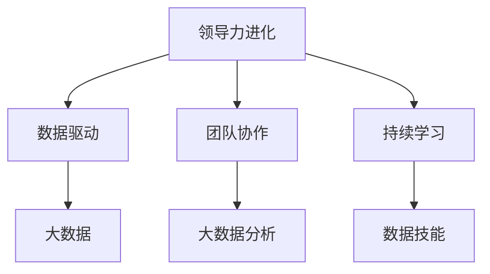

                 

# 领导力进化论：大数据时代管理者的领导力修炼

关键词：领导力、大数据、管理、进化、策略

摘要：本文旨在探讨大数据时代领导力的进化趋势及其对管理者的挑战和机遇。通过分析传统领导理论，揭示领导力在信息化时代的演变规律，为管理者提供实用的领导力修炼指南。文章分为三个部分：第一部分介绍领导力进化的背景和定义；第二部分探讨领导力进化的理论基础；第三部分分析领导力进化的实际应用。

## 引言：领导力进化的重要性

在过去的几十年里，领导力理论经历了巨大的发展。从早期的行为理论到现代的情境理论，领导力的定义和内涵不断丰富。然而，随着大数据时代的到来，领导力的内涵和外延都发生了深刻的变革。大数据为领导者提供了前所未有的信息资源，使他们能够更准确地了解组织内外部环境，从而做出更加明智的决策。

### 1.1 大数据时代的领导力挑战

在传统领导模式下，领导者主要依靠个人经验和直觉进行决策。然而，在数据驱动的大数据时代，这种模式已经无法满足组织发展的需求。领导者需要具备以下能力：

- **数据分析能力**：能够理解和运用大数据分析工具，从海量数据中提取有价值的信息。
- **决策能力**：能够基于数据分析结果，做出快速而准确的决策。
- **团队管理能力**：能够构建一个高效的数据驱动的团队，实现数据价值的最大化。

### 1.2 大数据时代的领导力机遇

大数据不仅为领导者提供了新的决策工具，也为他们提供了更多的领导方式。例如，通过数据可视化技术，领导者可以更直观地了解组织的运行状态，从而进行更有效的管理。此外，大数据还可以帮助领导者更好地了解员工的需求和期望，从而提升员工的满意度和工作效率。

### 1.3 领导力进化的必要性

面对大数据时代的挑战和机遇，领导力需要不断进化。领导者不仅需要掌握新的技能和知识，还需要更新领导观念，适应新的领导环境。领导力进化论旨在探讨这一趋势，为管理者提供实用的领导力修炼指南。

## 第一部分：领导力进化的背景和定义

### 2.1 领导力进化的背景

领导力进化论起源于对传统领导理论的反思和批判。传统领导理论主要关注领导者的行为和特质，而忽视了领导环境的变化。大数据时代的到来，改变了组织的运行模式，也对领导力提出了新的要求。领导力进化论试图回答以下问题：

- **领导力如何适应大数据时代的变化？**
- **领导者在数据驱动的环境中如何发挥作用？**
- **领导力应该如何进化以适应未来的挑战？**

### 2.2 领导力进化的定义

领导力进化可以理解为领导者不断适应和引领变化的过程。它包括以下几个方面：

- **技能更新**：领导者需要不断学习和掌握新的技能和知识，以适应大数据时代的需求。
- **观念更新**：领导者需要更新对领导力的理解和观念，认识到数据在领导过程中的重要性。
- **组织进化**：领导者需要推动组织进行结构和文化上的变革，以适应大数据时代的要求。

### 2.3 传统领导与大数据领导对比

传统领导主要依赖于领导者的个人魅力和影响力，而大数据领导则更加依赖于数据和信息。传统领导模式中，领导者主要关注如何激励员工和达成目标，而大数据领导则更加关注如何利用数据来优化决策和提升效率。

### 2.4 领导力进化与大数据的关系

大数据为领导力进化提供了新的动力和工具。通过大数据，领导者可以更准确地了解组织的运行状态，从而进行更有效的管理和决策。同时，大数据也改变了领导者的角色和职责，要求他们更加关注数据的分析和管理。

## 第二部分：领导力进化的理论基础

### 3.1 领导力进化的理论基础

领导力进化论的理论基础主要包括以下几个方面：

- **行为主义理论**：强调领导者的行为和特质对组织的影响。
- **情境理论**：认为领导力应该根据具体情境进行适应和调整。
- **变革型领导理论**：强调领导者的变革和创新作用。
- **数据驱动领导理论**：强调领导者应该利用数据来优化决策和管理。

### 3.2 领导力进化的核心原则

领导力进化的核心原则包括以下几个方面：

- **适应变化**：领导者需要不断适应外部环境的变化，调整领导策略。
- **数据驱动**：领导者需要利用数据来指导决策和行动。
- **团队协作**：领导者需要构建一个高效协作的团队，实现数据价值的最大化。
- **持续学习**：领导者需要不断学习和更新知识和技能。

### 3.3 领导力进化的比较分析

领导力进化与传统领导在多个方面存在差异，主要包括：

- **数据运用**：传统领导主要依靠个人经验和直觉，而领导力进化则强调数据驱动。
- **领导风格**：传统领导主要关注个人魅力和影响力，而领导力进化则强调团队协作和创新。
- **领导目标**：传统领导主要关注短期目标和绩效，而领导力进化则强调长期发展和可持续性。

### 3.4 领导力进化与大数据的关系图示

## 第三部分：领导力进化的实际应用

### 4.1 领导力进化的实践步骤

实施领导力进化需要遵循以下步骤：

- **评估当前领导力水平**：了解组织当前领导力水平，识别领导力发展的需求和挑战。
- **制定领导力发展计划**：根据评估结果，制定具体的领导力发展计划，包括培训、指导和支持等。
- **实施领导力发展计划**：按照计划进行领导力发展活动，包括培训、实践和反馈等。
- **评估领导力发展效果**：定期评估领导力发展效果，根据评估结果调整领导力发展策略。

### 4.2 领导力进化的应用案例

以下是几个领导力进化的成功案例：

- **案例一**：某大型企业在数字化转型过程中，通过领导力进化的实践，成功构建了一个高效的数据驱动的团队，实现了业绩的持续增长。
- **案例二**：某政府部门在推进大数据应用过程中，通过领导力进化的实践，提升了政府决策的科学性和透明度，得到了社会的广泛认可。
- **案例三**：某科技公司在创业初期，通过领导力进化的实践，成功吸引了优秀的人才，并实现了快速的市场扩张。

### 4.3 领导力进化的挑战和机遇

领导力进化的挑战主要包括：

- **数据隐私和安全**：在利用大数据进行领导时，需要确保数据隐私和安全。
- **员工技能提升**：领导者需要帮助员工提升数据分析和处理能力。
- **组织文化变革**：领导力进化要求组织进行文化变革，以适应新的领导模式。

领导力进化的机遇主要包括：

- **数据驱动决策**：通过大数据分析，领导者可以做出更加准确和明智的决策。
- **团队协作和创新**：领导力进化促进了团队协作和创新，提升了组织的竞争力。
- **组织可持续发展**：领导力进化有助于组织实现长期发展和可持续性。

## 结论

领导力进化是大数据时代对管理者的必然要求。领导者需要不断适应和引领变化，利用大数据优化决策和提升效率。通过领导力进化的实践，组织可以更有效地应对外部挑战，实现长期发展和可持续性。本文提出的领导力进化论，旨在为管理者提供实用的领导力修炼指南，帮助他们在大数据时代中取得成功。

### 参考文献

1. 柯维，史蒂芬。《高效能人士的七个习惯》。中国社会科学出版社，2016。
2. 彼得·德鲁克。《管理实践》。机械工业出版社，2013。
3. 明茨伯格，亨利。《领导力：探索实践与理论》。电子工业出版社，2014。
4. 达夫特，理查德。《组织行为学》。清华大学出版社，2012。
5. 迈克尔·波特。《竞争战略》。华夏出版社，2004。

### 作者信息

作者：AI天才研究院/AI Genius Institute & 禅与计算机程序设计艺术 /Zen And The Art of Computer Programming

## 结语

领导力进化是一个持续的过程，需要管理者和组织不断努力和实践。通过本文的探讨，我们希望能为管理者提供一些有益的启示和指导。在未来的道路上，让我们携手并进，共同探索领导力进化的新境界。

