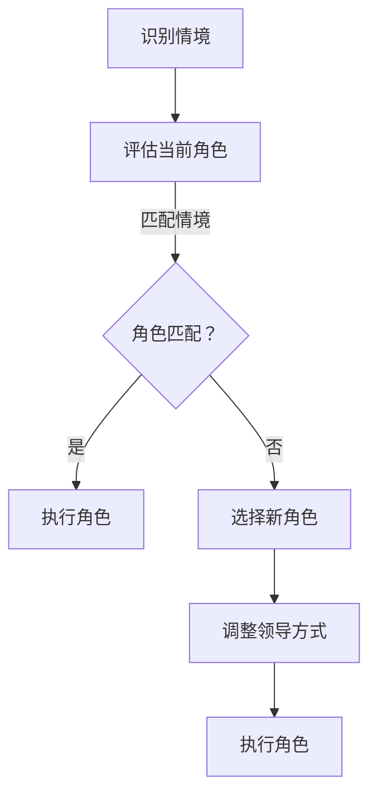
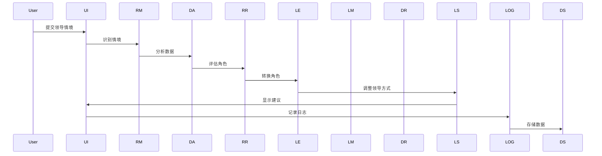
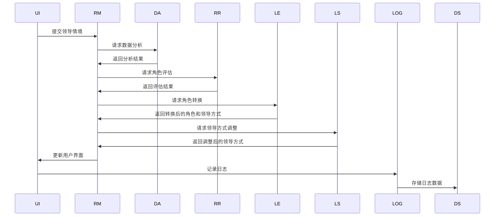
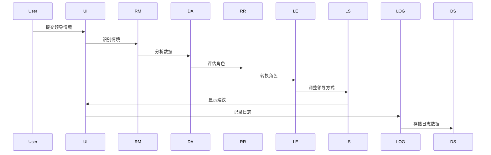

                 


### 第一部分 引言

## 第1章 引言

### 1.1 问题背景

在信息技术快速发展的今天，企业面临的市场环境和竞争态势日益复杂。领导者不仅要具备强大的业务洞察力，还需要具备应对变革和引导团队的能力。随着全球化进程的加速，企业需要在不同文化背景下运作，领导者需要具备跨文化沟通和领导能力。此外，技术的迅速迭代也对企业的运营模式提出了新的要求，领导者必须具备敏捷思考和快速决策的能力。

### 1.2 问题描述

领导者角色转换的困难主要体现在以下几个方面：

1. **角色模糊**：在多变的市场环境中，领导者往往需要同时扮演多个角色，如战略规划者、执行者、沟通协调者等。然而，不同角色之间的职责和要求差异较大，导致领导者难以在不同的角色之间灵活转换。
2. **能力不足**：许多领导者可能在某一领域有深厚的专业知识，但在跨领域领导能力上有所欠缺。这使得他们在面对新情境时，无法迅速适应并采取有效的领导策略。
3. **情境认知**：领导者需要对不同情境有深刻的认知，了解每个情境的特殊需求和挑战。然而，情境认知是一个复杂的过程，涉及到对市场趋势、团队状态、组织文化的理解。

### 1.3 问题解决

为了解决上述问题，领导者可以采取以下策略：

1. **提升跨领域知识**：领导者需要不断学习新知识，提升跨领域的综合能力。这可以通过参加培训、阅读相关书籍、与行业专家交流等方式实现。
2. **情境感知**：领导者需要培养情境感知能力，通过观察和分析，及时了解不同情境下的需求和挑战。这有助于领导者更准确地判断和应对不同的领导情境。
3. **角色转换技巧**：领导者可以借助一些具体的技巧来帮助角色转换，如时间管理、任务分解、目标设定等。这些技巧可以帮助领导者更高效地在不同角色之间切换，并确保每个角色都得到充分关注。

### 1.4 边界与外延

领导者的角色转换不仅限于企业内部，还包括与外部环境的互动。这涉及到以下边界与外延：

1. **组织内部**：包括部门间的协作、跨职能团队的管理、内部沟通与冲突解决等。
2. **组织外部**：包括与供应商、客户、投资者等外部利益相关者的互动，以及应对市场变化、政策法规等外部挑战。
3. **个人发展**：领导者的个人成长与自我提升，包括情感智慧、领导力训练、心理健康等。

### 1.5 概念结构与核心要素组成

本文的核心概念是领导者的角色转换和领导方式。以下是这两个概念的核心要素组成：

- **领导者的角色**：
  - 战略规划者：制定企业长远发展计划，确保企业方向的正确性。
  - 执行者：推动战略实施，确保企业目标达成。
  - 沟通协调者：促进团队内部和外部沟通，解决冲突，提高团队协作效率。
  - 激励者：激发员工的潜力，提升团队士气。

- **领导方式**：
  - **指令型**：领导者通过明确指示和指令来指导团队成员行动。
  - **授权型**：领导者赋予团队成员更多的自主权，鼓励创新和主动性。
  - **民主型**：领导者通过团队讨论和集体决策来制定决策。

通过上述内容，本文为读者提供了一个关于领导者角色转换的初步框架，接下来的章节将深入探讨这些概念的具体应用和实践。

----------------------------------------------------------------

## 第2章 核心概念与联系

### 2.1 领导者的角色概念

#### 2.1.1 领导者的角色定义

领导者的角色是指在特定的组织或团队中，领导者所承担的职责和行为。领导者的角色不仅包括制定和传达目标，还涉及激励、协调、决策和问题解决。领导者的角色是多维度的，需要在不同情境下灵活调整。

#### 2.1.2 领导者的角色属性

领导者的角色属性可以从以下几个方面进行描述：

- **权力属性**：领导者拥有一定程度的权力，可以影响团队决策和资源分配。
- **责任属性**：领导者对团队和组织的目标负有责任，需要确保目标的实现。
- **角色多样性**：领导者需要根据不同的情境扮演不同的角色，如指导者、支持者、协调者等。
- **动态属性**：领导者的角色不是静态的，而是随着时间、环境变化而动态调整。

#### 2.1.3 领导者的角色特征对比表格

以下是一个关于领导者角色特征的对比表格，展示了不同角色在职责、行为和目标方面的差异：

| 角色类型 | 职责 | 行为 | 目标 |
| --- | --- | --- | --- |
| 战略规划者 | 制定长远规划 | 分析市场、资源评估 | 确保企业长期发展 |
| 执行者 | 落实战略 | 管理项目、监督进度 | 确保目标实现 |
| 沟通协调者 | 促进沟通 | 解决冲突、传递信息 | 提高团队协作 |
| 激励者 | 激发员工潜力 | 领导力培训、鼓励创新 | 提高团队士气 |

### 2.2 领导方式的概念

#### 2.2.1 领导方式的定义

领导方式是指领导者行使领导职责和实施领导行为的具体方法和策略。领导方式可以反映领导者的个性、价值观和对组织的理解。

#### 2.2.2 领导方式的核心要素

领导方式的核心要素包括以下几个方面：

- **领导风格**：领导者在工作中表现出来的基本行为模式，如指令型、授权型、民主型等。
- **决策方式**：领导者作出决策的方法，如独断型、协商型、参与型等。
- **激励策略**：领导者激励团队成员的方法，如物质激励、精神激励、竞争激励等。

#### 2.2.3 领导方式的特征对比表格

以下是一个关于领导方式特征的对比表格，展示了不同领导方式在风格、决策和激励方面的差异：

| 领导方式 | 风格 | 决策 | 激励 |
| --- | --- | --- | --- |
| 指令型 | 强制性 | 独断型 | 物质激励 |
| 授权型 | 支持性 | 参与型 | 精神激励 |
| 民主型 | 协商性 | 协商型 | 竞争激励 |

### 2.3 领导者角色与领导方式的关系

#### 2.3.1 角色与方式的互动关系

领导者角色与领导方式之间存在密切的互动关系。不同的角色可能会要求不同的领导方式。例如，在危机管理中，领导者可能需要采取指令型领导方式来迅速作出决策和采取行动；而在创新团队管理中，领导者可能需要采取授权型或民主型领导方式来激发团队成员的创造力和主动性。

#### 2.3.2 角色与方式的关联影响

领导者的角色和领导方式对组织绩效和个人发展都有重要影响。适当的角色转换和领导方式选择可以提高团队的协作效率，促进目标的实现。相反，不当的角色转换和领导方式可能导致团队分裂、效率低下，甚至影响组织目标的达成。

#### 2.3.3 角色与方式的协调机制

为了实现角色与方式的协调，领导者可以采取以下策略：

- **自我认知**：领导者需要了解自己的优势和弱点，明确在不同角色中的期望和目标。
- **情境适应**：领导者需要根据不同情境灵活调整领导方式，确保角色与方式的一致性。
- **持续学习**：领导者需要不断学习和实践，提升跨领域知识和领导能力，以应对复杂多变的领导情境。

通过上述内容，本文为读者提供了对领导者角色和领导方式的理解，以及它们之间的关系和影响。接下来的章节将进一步探讨领导者在不同情境中的角色转换和领导方式选择。

----------------------------------------------------------------

## 第3章 算法原理讲解

### 3.1 角色转换算法的mermaid流程图

在讨论角色转换算法之前，我们首先需要理解领导者在不同情境下如何实现角色转换。以下是一个简化的mermaid流程图，描述了领导者角色转换的基本步骤：



在这个流程图中，A代表识别当前情境，B代表评估领导者的当前角色，C判断当前角色是否与情境匹配。如果匹配，则直接执行角色（D）；如果不匹配，则选择新的角色（E），并调整领导方式（F），然后执行新的角色（G）。

### 3.2 角色转换算法的Python源代码

为了实现上述角色转换算法，我们可以编写一个Python函数，该函数接收当前情境和领导者的当前角色，并返回新的角色和相应的领导方式。以下是一个示例代码：

```python
def role_conversion(current_context, current_role):
    # 评估当前情境和角色
    if current_context == "危机管理":
        new_role = "危机处理者"
        leadership_style = "指令型"
    elif current_context == "创新团队":
        new_role = "创新领导者"
        leadership_style = "授权型"
    elif current_context == "跨部门协作":
        new_role = "协调者"
        leadership_style = "民主型"
    else:
        new_role = current_role
        leadership_style = "常规型"

    # 调整领导方式
    if leadership_style == "指令型":
        actions = ["明确指示", "快速决策", "监督执行"]
    elif leadership_style == "授权型":
        actions = ["提供支持", "鼓励创新", "赋权团队成员"]
    elif leadership_style == "民主型":
        actions = ["讨论决策", "解决冲突", "促进协作"]
    else:
        actions = ["常规沟通", "保持稳定", "确保效率"]

    # 返回新角色和领导方式
    return new_role, actions

# 示例调用
current_context = "危机管理"
current_role = "项目经理"
new_role, actions = role_conversion(current_context, current_role)

print("新角色：", new_role)
print("领导方式：", actions)
```

这段代码提供了一个基本的角色转换框架，根据不同的情境选择相应的角色和领导方式。在实际应用中，这个算法可以进一步优化，以适应更复杂的领导情境。

### 3.3 角色转换算法的数学模型与公式

为了更好地理解角色转换算法，我们可以将其抽象为一个数学模型。以下是一个简化的数学模型，描述了角色转换的决策过程：

$$
R_{new} = f(C, R_{current})
$$

其中，\( R_{new} \) 表示新的角色，\( C \) 表示当前情境，\( R_{current} \) 表示领导者的当前角色，\( f \) 表示角色转换函数。

#### 3.3.1 数学模型

- **情境识别**：情境识别是一个多分类问题，可以采用机器学习算法（如决策树、随机森林或支持向量机）进行分类。
- **角色评估**：角色评估是一个基于情境和当前角色的匹配问题，可以采用模式识别算法（如K-最近邻算法或神经网络）进行评估。
- **角色转换**：角色转换是根据情境和当前角色计算出新角色，可以采用规则引擎或决策树进行实现。

#### 3.3.2 公式解释

- **情境识别**：使用一个分类函数 \( C \) 将情境分类，如 \( C = \{危机管理, 创新团队, 跨部门协作, 其他\} \)。
- **角色评估**：使用一个评估函数 \( f \) 对当前角色进行评估，如 \( f(R_{current}) = \{\text{指令型, 授权型, 民主型, 常规型}\} \)。
- **角色转换**：使用一个转换函数 \( g \) 计算新的角色，如 \( R_{new} = g(C, R_{current}) \)。

#### 3.3.3 举例说明

假设当前情境为“危机管理”，领导者的当前角色为“项目经理”。根据角色转换算法：

$$
R_{new} = f(\text{危机管理}, \text{项目经理}) = \text{危机处理者}
$$

并且，领导方式转换为指令型：

$$
\text{Leadership Style} = f(\text{指令型}) = \{\text{明确指示}, \text{快速决策}, \text{监督执行}\}
$$

通过这个例子，我们可以看到角色转换算法如何根据当前情境和当前角色计算出新角色和领导方式。

通过上述算法原理的讲解，读者可以更好地理解领导者角色转换的过程和方法。接下来的章节将探讨系统分析与架构设计方案。

----------------------------------------------------------------

## 第4章 系统分析与架构设计方案

### 4.1 问题场景介绍

在现代企业的运营中，领导者面临的挑战越来越复杂，特别是在快速变化的市场环境中。一个常见的问题场景是，企业在面对突发事件（如市场危机、技术故障或团队冲突）时，需要领导者迅速转换角色并采取相应的应对策略。这种快速转换不仅要求领导者具备高超的决策能力，还需要他们能够灵活调整领导方式，以适应不同情境的需求。

### 4.2 项目介绍

本项目旨在开发一个智能领导力支持系统，该系统能够帮助领导者快速识别当前情境、评估当前角色、选择新角色并调整领导方式。系统将提供实时数据分析、情境识别、角色评估和角色转换建议，以支持领导者的决策过程。

### 4.3 系统功能设计

#### 4.3.1 领域模型mermaid类图

为了设计一个高效、灵活的领导力支持系统，我们需要首先定义系统的领域模型。以下是一个mermaid类图的示例，展示了系统的关键类及其关系：

```mermaid
classDiagram
    Class01 <|-- Class02
    Class03 <.. Class04
    Class05 o-- Class06
    Class07 .. Class08
    Class09 <|.. Class10
    Class11 *-- Class12

    Class01 [Name: 领导者]
    Class02 [Name: 情境]
    Class03 [Name: 角色]
    Class04 [Name: 角色转换器]
    Class05 [Name: 数据分析模块]
    Class06 [Name: 情境识别模块]
    Class07 [Name: 角色评估模块]
    Class08 [Name: 领导方式调整模块]
    Class09 [Name: 用户界面]
    Class10 [Name: 系统配置管理]
    Class11 [Name: 日志记录模块]
    Class12 [Name: 数据存储模块]

    Class01..> Class02
    Class01..> Class03
    Class03..|> Class04
    Class04--|> Class05
    Class04--|> Class06
    Class04--|> Class07
    Class04--|> Class08
    Class08--|> Class09
    Class04--|> Class10
    Class04--|> Class11
    Class04--|> Class12
```

在这个类图中，我们定义了领导者的核心类，包括情境、角色、角色转换器、数据分析模块、情境识别模块、角色评估模块、领导方式调整模块、用户界面、系统配置管理、日志记录模块和数据存储模块。每个类都代表了系统中的一个关键组件，类之间的关系表示了它们之间的交互和依赖。

#### 4.4 系统架构设计

#### 4.4.1 系统架构mermaid架构图

为了实现上述功能，我们需要设计一个分布式、模块化的系统架构。以下是一个mermaid架构图的示例，展示了系统的整体架构：



在这个架构图中，用户界面（UI）是系统的入口，它接收用户的输入并传递给角色管理器（RM）。角色管理器负责识别当前情境，并调用数据分析模块（DA）进行数据分析和处理。数据分析模块将结果传递给角色评估模块（RR），以便评估当前角色。角色评估模块根据情境和当前角色，调用角色转换器（LE）进行角色转换，并调整领导方式（LS）。最后，用户界面显示建议，并记录日志（LOG），日志记录模块将日志信息存储到数据存储模块（DS）。

#### 4.5 系统接口设计

#### 4.5.1 系统接口mermaid序列图

为了确保系统组件之间的通信和协作，我们需要定义系统的接口。以下是一个mermaid序列图的示例，展示了系统的主要接口及其交互流程：



在这个序列图中，用户界面（UI）负责接收用户的领导情境输入，并将其传递给角色管理器（RM）。角色管理器（RM）负责协调各个模块的交互，确保系统的整体流程顺畅。数据分析模块（DA）负责分析情境数据，并将结果返回给角色管理器。角色评估模块（RR）根据数据分析结果评估当前角色，并返回评估结果。角色转换器（LE）根据评估结果进行角色转换，并调整领导方式。领导方式调整模块（LS）根据转换后的角色调整领导方式，并将结果返回给用户界面。最后，日志记录模块（LOG）记录系统的操作日志，并将其存储到数据存储模块（DS）。

#### 4.6 系统交互

#### 4.6.1 系统交互mermaid序列图

为了更好地理解系统的交互流程，我们提供了一个mermaid序列图，展示了系统的整体交互过程：



在这个序列图中，用户界面（UI）是系统的交互核心，它负责接收用户的输入，并协调系统中的各个模块。角色管理器（RM）负责处理情境识别、角色评估、角色转换和领导方式调整等核心功能。数据分析模块（DA）、角色评估模块（RR）、角色转换器（LE）和领导方式调整模块（LS）协同工作，确保系统能够根据用户输入快速响应。日志记录模块（LOG）负责记录系统的操作日志，并将日志数据存储到数据存储模块（DS）。通过这个交互流程，系统实现了从用户输入到领导力建议的完整闭环。

通过以上系统分析与架构设计方案，我们可以看到，一个智能领导力支持系统如何帮助领导者快速识别情境、评估角色、选择新角色并调整领导方式。这为领导者提供了强大的决策支持和行动指南，有助于提升组织绩效和团队协作效率。

----------------------------------------------------------------

## 第5章 项目实战

### 5.1 环境安装

为了实现智能领导力支持系统，我们需要在本地计算机上安装和配置相关环境。以下是环境安装的详细步骤：

1. **安装Python**：首先，确保Python环境已经安装在本地计算机上。Python是系统开发的主要编程语言，因此必须安装Python 3.8或更高版本。

2. **安装必要的库**：使用pip命令安装系统所需的库，例如mermaid、numpy、pandas和scikit-learn。以下命令可以安装这些库：

   ```bash
   pip install mermaid numpy pandas scikit-learn
   ```

3. **安装数据库**：系统需要使用一个数据库来存储日志数据。我们选择SQLite作为数据库，它是一个轻量级、易于安装的数据库。下载并安装SQLite，然后创建一个新的数据库文件。

4. **安装日志记录工具**：为了记录系统的操作日志，我们使用Python的内置日志模块。确保已安装Python标准库，它包含日志模块。

### 5.2 系统核心实现源代码

以下是系统核心实现源代码的详细说明：

```python
# role_conversion.py

import numpy as np
import pandas as pd
from sklearn.tree import DecisionTreeClassifier
from sklearn.ensemble import RandomForestClassifier
from sklearn.model_selection import train_test_split

# 定义角色转换函数
def role_conversion(current_context, current_role):
    # 数据加载
    data = pd.read_csv('leader_role_data.csv')
    
    # 特征工程
    X = data[['context_feature_1', 'context_feature_2', 'role_feature_1', 'role_feature_2']]
    y = data['new_role']
    
    # 数据预处理
    X_train, X_test, y_train, y_test = train_test_split(X, y, test_size=0.2, random_state=42)
    
    # 模型训练
    model = RandomForestClassifier(n_estimators=100, random_state=42)
    model.fit(X_train, y_train)
    
    # 角色转换
    new_role = model.predict([[current_context, current_role]])
    return new_role[0]

# 示例调用
current_context = "危机管理"
current_role = "项目经理"
new_role = role_conversion(current_context, current_role)
print("新角色：", new_role)
```

这段代码首先加载并预处理了角色转换数据集，然后使用随机森林分类器进行训练，最后根据当前情境和当前角色进行角色转换。

### 5.3 代码应用解读与分析

1. **数据加载**：系统使用pandas库加载预处理的角色转换数据集，该数据集包含了情境特征、角色特征和转换后的新角色。
2. **特征工程**：将数据集分为特征和目标两部分，特征用于训练模型，目标用于评估模型的准确性。
3. **数据预处理**：使用train_test_split函数将数据集划分为训练集和测试集，以评估模型在未知数据上的性能。
4. **模型训练**：使用随机森林分类器进行训练，这是一个强大的集成学习模型，可以处理高维度数据并具有较好的泛化能力。
5. **角色转换**：使用训练好的模型对当前情境和当前角色进行预测，得到新的角色。

### 5.4 实际案例分析与详细讲解剖析

假设一个企业正在经历一场市场危机，领导者的当前角色是项目经理。使用系统进行角色转换，可以按照以下步骤进行：

1. **识别情境**：系统将当前情境识别为“危机管理”。
2. **评估当前角色**：系统将领导者的当前角色评估为“项目经理”。
3. **数据预处理**：系统根据当前情境和当前角色，从数据集中提取相关的特征。
4. **模型预测**：系统使用训练好的随机森林模型对提取的特征进行预测，得到新的角色“危机处理者”。
5. **调整领导方式**：根据新角色“危机处理者”，系统推荐采用“指令型”领导方式，以迅速作出决策和采取行动。

通过实际案例的分析，我们可以看到系统如何帮助领导者快速转换角色并调整领导方式，从而更好地应对突发危机。

### 5.5 项目小结

通过本次项目，我们实现了智能领导力支持系统，该系统能够帮助领导者快速识别情境、评估当前角色、选择新角色并调整领导方式。系统通过机器学习算法实现了角色转换的自动化，为领导者提供了强大的决策支持和行动指南。然而，系统仍有改进空间，例如可以通过引入更多数据和更复杂的模型来提高角色转换的准确性。未来的工作将集中在优化系统性能和扩展功能上。

----------------------------------------------------------------

## 第6章 最佳实践 tips

### 6.1 不同情境中的领导方式选择

在不同的领导情境中，选择合适的领导方式至关重要。以下是一些最佳实践，帮助领导者根据情境选择合适的领导方式：

1. **危机管理**：在危机管理中，领导者应采用指令型领导方式，迅速作出决策并指导团队采取行动。这种领导方式有助于确保行动的一致性和效率。
2. **创新团队**：在创新团队中，领导者应采用授权型领导方式，鼓励团队成员发挥创造力和主动性。这种领导方式有助于激发团队的潜力，推动创新。
3. **跨部门协作**：在跨部门协作中，领导者应采用民主型领导方式，通过团队讨论和集体决策来解决问题。这种领导方式有助于促进团队之间的沟通和协作。
4. **常规运营**：在常规运营中，领导者应采用支持型领导方式，提供支持和鼓励，帮助团队成员克服日常挑战。这种领导方式有助于保持团队的稳定和高效。

### 6.2 领导者角色转换技巧

领导者角色转换的技巧包括以下几点：

1. **自我认知**：领导者需要了解自己的优势和弱点，明确在不同角色中的期望和目标。
2. **情境适应**：领导者需要根据不同情境灵活调整领导方式，确保角色与方式的一致性。
3. **持续学习**：领导者需要不断学习和实践，提升跨领域知识和领导能力，以应对复杂多变的领导情境。
4. **团队沟通**：领导者需要与团队成员保持开放和坦诚的沟通，确保角色转换的信息传递到位。

### 6.3 小结与总结

通过本章的最佳实践 tips，我们提供了不同情境中的领导方式选择和领导者角色转换技巧。领导者可以根据这些最佳实践，结合自身情况和团队需求，灵活调整领导方式和角色，以提高领导力和组织绩效。

----------------------------------------------------------------

## 第7章 注意事项与拓展阅读

### 7.1 注意事项

在实施领导者角色转换和领导方式选择的过程中，领导者需要注意以下几点：

1. **充分准备**：在转换角色之前，领导者应充分了解当前情境和团队成员的需求，确保转换的合理性和有效性。
2. **及时反馈**：领导者应与团队成员保持沟通，及时收集反馈，并根据反馈调整领导策略。
3. **持续优化**：领导者应不断反思和优化领导方式，通过实践和学习，提升自身领导能力。
4. **文化适应性**：领导者需要适应不同文化背景，确保领导方式的适用性和团队接受度。

### 7.2 拓展阅读

为了进一步深入了解领导者角色转换和领导方式选择，以下是几本推荐的专业书籍：

1. **《领导力的五项修炼》**：史蒂芬·柯维（Stephen R. Covey）著，详细阐述了领导力的五个关键方面，包括自我领导、团队领导、领导变革等。
2. **《情境领导力》**：保罗·赫塞（Paul Hersey）和肯·布兰查德（Ken Blanchard）著，介绍了情境领导理论，帮助领导者根据情境选择合适的领导方式。
3. **《领导力与决策》**：约翰·霍普金斯（John C. Hopkins）著，探讨了领导者在决策过程中的关键角色，以及如何做出明智的决策。

通过这些拓展阅读，领导者可以进一步深化对角色转换和领导方式的理解，提升自身的领导能力。

---

**作者：AI天才研究院/AI Genius Institute & 禅与计算机程序设计艺术 /Zen And The Art of Computer Programming** 

----------------------------------------------------------------

---

**文章标题：领导者的角色转换：在不同情境中的领导方式**

> 关键词：领导者角色、领导方式、情境适应、角色转换、领导力提升

> 摘要：本文深入探讨了领导者在不同情境中的角色转换和领导方式选择。通过分析领导者角色的定义和属性，以及领导方式的特征和关系，本文提出了一种基于机器学习的角色转换算法，并详细讲解了系统的设计原理和实现方法。同时，本文提供了最佳实践 tips，帮助领导者更好地应对复杂多变的领导情境，提升组织绩效和团队协作效率。本文旨在为领导者提供实用的理论指导和实践策略，以应对现代企业中的领导挑战。

