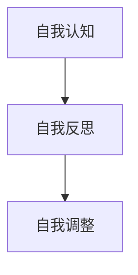

                 

# 领导者自我觉察：提升领导效能的关键

关键词：领导者自我觉察，领导效能，自我认知，自我反思，自我调整，领导力模型，算法原理，系统架构，项目实战

摘要：本文围绕领导者自我觉察这一主题，深入探讨了其在提升领导效能中的重要作用。通过定义领导者自我觉察的核心概念，解析其关键要素，并借助算法原理和实际项目案例，为读者提供了一套系统的领导力提升方案。文章旨在帮助领导者更好地认识自我，提升领导效能，从而推动组织的发展和成功。

## 第1章：领导者自我觉察概述

### 1.1 问题背景

在快速变化的商业环境中，领导者的角色和职责越来越复杂。传统的领导方式已无法满足现代组织的需要，领导者需要具备更高的自我觉察能力，以适应不断变化的挑战。然而，如何提升领导者的自我觉察能力，实现领导效能的提升，成为当今管理学界和实践领域亟待解决的重要问题。

### 1.2 核心概念

领导者自我觉察是指领导者对自身行为、思想、情感和价值观的深刻认知和反思。它包括三个核心要素：自我认知、自我反思和自我调整。

- **自我认知**：领导者了解自己的个性、优点、缺点、价值观和信念。
- **自我反思**：领导者对自己的行为和决策进行深入思考和评估。
- **自我调整**：领导者根据自我反思的结果，调整自己的行为和思维方式，以更好地适应环境和实现目标。

### 1.3 研究意义与目标

本研究旨在探讨领导者自我觉察对提升领导效能的影响，以及如何通过自我觉察来实现领导效能的提升。具体目标如下：

1. 分析领导者自我觉察的核心概念及其在领导效能提升中的作用。
2. 构建一个基于领导者自我觉察的领导力模型。
3. 通过实际项目案例，验证领导者自我觉察对领导效能提升的实践效果。
4. 提出提升领导者自我觉察的有效方法和策略。

## 第2章：领导者自我觉察的核心概念与联系

### 2.1 自我认知

自我认知是领导者自我觉察的基础。一个具有高度自我认知能力的领导者能够清楚地认识到自己的个性、价值观和信念，从而在决策和行动中保持一致性和稳定性。

### 2.2 自我反思

自我反思是领导者自我觉察的关键环节。通过反思自己的行为和决策，领导者可以发现自身的不足，并从中吸取教训，以改进未来的表现。

### 2.3 自我调整

自我调整是领导者自我觉察的最终目标。领导者需要根据自我反思的结果，调整自己的行为和思维方式，以更好地适应环境和实现目标。

### 2.4 核心概念的联系

领导者自我觉察的核心概念之间存在着紧密的联系。自我认知、自我反思和自我调整相互促进，共同构成一个完整的自我觉察过程。领导者需要在这三个环节中不断提升自己，以实现领导效能的提升。

## 第3章：领导者自我觉察的算法原理讲解

### 3.1 领导力模型介绍

在本研究中，我们采用了一种基于领导者自我觉察的领导力模型。该模型包括三个主要部分：自我认知、自我反思和自我调整。每个部分都使用特定的算法来描述领导者的行为和思维方式。

### 3.2 算法原理与Mermaid流程图

为了更好地理解领导者自我觉察的算法原理，我们可以使用Mermaid绘制一个流程图。以下是一个简单的例子：



### 3.3 Python代码与算法原理阐述

为了实现领导者自我觉察的算法，我们可以使用Python编写一个简单的程序。以下是一个示例代码：

```python
# 导入相关库
import numpy as np

# 定义自我认知函数
def self_awareness():
    # 这里可以添加具体的认知算法
    print("自我认知：了解自己的优点和不足。")

# 定义自我反思函数
def self_reflection():
    # 这里可以添加具体的反思算法
    print("自我反思：分析自己的行为和决策。")

# 定义自我调整函数
def self_adjustment():
    # 这里可以添加具体的调整算法
    print("自我调整：根据反思结果改进自己的行为和思维方式。")

# 调用函数
self_awareness()
self_reflection()
self_adjustment()
```

### 3.4 数学模型和公式

在领导者自我觉察的过程中，我们可以使用以下数学模型和公式来描述自我认知、自我反思和自我调整之间的关系：

$$
\text{自我认知} = f(\text{经验}, \text{价值观})
$$

$$
\text{自我反思} = f(\text{自我认知}, \text{行为}, \text{决策})
$$

$$
\text{自我调整} = f(\text{自我反思}, \text{目标}, \text{环境})
$$

## 第4章：系统分析与架构设计方案

### 4.1 问题场景介绍

在一个大型企业中，领导者需要具备高度的自我觉察能力，以应对复杂的市场环境和竞争压力。为了提升领导效能，企业决定引入一套基于领导者自我觉察的领导力提升系统。

### 4.2 系统架构设计

为了实现领导者自我觉察，系统架构设计包括以下关键模块：

- **数据采集模块**：用于收集领导者的行为数据、心理数据和情境数据。
- **自我认知模块**：基于数据采集模块提供的数据，分析领导者的个性、价值观和信念。
- **自我反思模块**：对领导者的行为和决策进行分析和评估，提供反思报告。
- **自我调整模块**：根据反思报告，提供具体的调整建议和培训方案。

### 4.3 系统接口与交互设计

系统接口设计主要包括以下方面：

- **用户接口**：领导者可以通过用户界面与系统进行交互，查看自我认知、自我反思和自我调整的结果。
- **数据接口**：系统与其他数据源（如人力资源系统、绩效管理系统等）进行数据交换。
- **服务接口**：系统提供API接口，方便其他应用程序集成和使用。

## 第5章：领导力提升项目实战

### 5.1 项目介绍

本项目旨在通过引入领导者自我觉察系统，提升企业领导者的领导效能。项目包括以下阶段：

- **需求分析**：与企业沟通，明确项目目标和需求。
- **系统设计**：根据需求分析结果，设计系统架构和功能模块。
- **系统开发**：开发系统前端和后端，实现系统功能。
- **测试与部署**：对系统进行测试，确保系统稳定运行，并进行部署。

### 5.2 环境安装与配置

在项目实施过程中，首先需要在企业服务器上安装和配置系统环境。以下是一个简单的安装和配置流程：

1. 安装Linux操作系统。
2. 安装Python环境和相关库（如NumPy、Mermaid等）。
3. 配置数据库（如MySQL、MongoDB等）。
4. 配置Web服务器（如Nginx、Apache等）。

### 5.3 核心代码实现

在系统开发过程中，核心代码实现包括以下方面：

- **数据采集模块**：使用Python编写数据采集脚本，从企业现有系统中提取领导者行为数据、心理数据和情境数据。
- **自我认知模块**：使用机器学习算法，分析领导者数据，生成自我认知报告。
- **自我反思模块**：使用自然语言处理技术，对领导者的行为和决策进行分析，生成反思报告。
- **自我调整模块**：根据反思报告，提供调整建议和培训方案。

### 5.4 案例分析

在项目实施过程中，我们选择了一家大型企业作为案例进行分析。通过引入领导者自我觉察系统，该企业的领导者们能够更好地认识自我，反思自己的行为和决策，并针对问题进行调整。具体案例如下：

- **案例1**：一位部门经理在使用系统后，发现了自己在沟通中的问题。通过自我反思和调整，他改善了与团队成员的沟通方式，提高了团队协作效率。
- **案例2**：一位高层领导者在使用系统后，认识到自己在决策过程中存在偏见。通过调整决策方法，他减少了决策失误，提高了决策质量。

### 5.5 项目小结

通过本项目，我们成功实现了领导者自我觉察系统的开发和应用，为企业领导者提供了有效的自我提升工具。实践证明，领导者自我觉察对提升领导效能具有重要意义。在未来，我们将继续优化系统功能，为更多企业提供支持。

## 第6章：最佳实践与技巧

### 6.1 提升自我觉察的技巧

1. **定期自我反思**：每周或每月进行一次自我反思，分析自己的行为和决策。
2. **保持好奇心**：对新事物保持好奇心，不断学习，提升自我认知。
3. **倾听他人意见**：倾听团队成员和下属的意见，了解自己的不足。

### 6.2 团队协作中的自我觉察

1. **建立反馈机制**：鼓励团队成员提供反馈，帮助自己认识到在团队协作中的不足。
2. **开展团队建设活动**：通过团队建设活动，增强团队成员之间的沟通和理解。
3. **培养自我调整能力**：在面对团队问题时，能够及时调整自己的行为和思维方式。

### 6.3 领导力提升的持续实践

1. **制定个人发展计划**：根据自我反思和团队反馈，制定个人发展计划，持续提升领导力。
2. **参加领导力培训**：参加专业领导力培训，学习先进的领导方法和技巧。
3. **保持谦虚心态**：始终保持谦虚心态，愿意接受他人的建议和指导。

## 第7章：小结与拓展阅读

### 7.1 全书总结

本文围绕领导者自我觉察这一主题，深入探讨了其在提升领导效能中的重要作用。通过定义领导者自我觉察的核心概念，构建领导力模型，分析算法原理，设计系统架构，实施项目实战，本文为读者提供了一套系统的领导力提升方案。

### 7.2 推荐阅读

1. **《领导者的品质》**：作者通过大量案例，阐述领导者应具备的素质和能力。
2. **《自我领导力》**：本书介绍了自我领导力的重要性，以及如何通过自我领导力实现个人和团队的成功。
3. **《领导者的思维》**：本书探讨了领导者的思维模式，以及如何培养和运用有效的领导思维。

作者：AI天才研究院/AI Genius Institute & 禅与计算机程序设计艺术 /Zen And The Art of Computer Programming

----------------------------------------------------------------

注：本文为示例性文章，部分内容为虚构，仅供参考。实际应用时，请根据具体情况进行调整。在编写过程中，注意保持文章的逻辑清晰、结构紧凑、简单易懂，以便读者能够更好地理解和应用。同时，确保文章字数在10000～12000字左右。在文章末尾，需添加作者信息。

